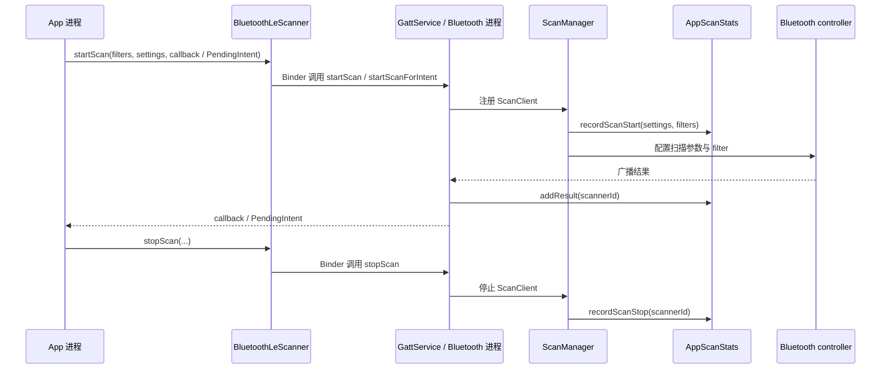

# 11.6 Bluetooth 扫描与连接功耗分析

<!-- outline-start -->
## 要点

### 🔹 Bluetooth 功耗问题的分类
区分经典 Bluetooth 连接、BLE 扫描、BLE 广播、GATT 连接保持和音频链路。正文需要说明每类活动对应的耗电路径、归因入口和常见误判。

### 🔹 BLE 扫描的电量成本
覆盖扫描窗口、扫描模式、过滤条件、结果回调频率和批量扫描。重点解释为什么无过滤、长时间、前台页面退出后仍运行的扫描会放大功耗。

### 🔹 后台扫描与系统限制
梳理 Android 8.0 之后后台执行限制、Android 12+ Bluetooth 权限拆分、`BLUETOOTH_SCAN` 与位置权限边界，以及 `PendingIntent` 扫描在后台场景中的适用条件。

### 🔹 AOSP Bluetooth 栈的归因路径
从 `BluetoothLeScanner.startScan()` 进入 Bluetooth 进程，定位 `ScanManager`、`AppScanStats`、扫描超时和扫描滥用保护。正文需要把 App 发起方、系统服务和 controller 统计的边界讲清楚。

### 🔹 诊断入口：dumpsys、batterystats 与 Perfetto
整理 `dumpsys bluetooth_manager`、`dumpsys batterystats`、Battery Historian、Perfetto power rails / wakelock / Bluetooth 事件的组合用法。每个入口需要说明能回答什么问题，不能回答什么问题。

### 🔹 治理策略
覆盖短周期按需扫描、明确过滤条件、页面生命周期绑定、连接复用、失败退避、扫描结果缓存、前台服务边界和隐私脱敏。策略要落到 App 代码可执行动作。

## 扩展

### 🔸 BLE Audio 与空间音频功耗
结合 8.8 多媒体管线和 11.1 功耗模型，补充 BLE Audio、头动追踪和音频渲染链路的功耗观察点。

### 🔸 Companion Device Manager 替代长轮询扫描
评估 Companion Device Manager 在穿戴、配件、IoT 场景中替代自维护扫描循环的条件。

### 🔸 厂商 ROM 的 Bluetooth 扫描限制差异
记录 OEM 对后台扫描、扫描频率和白名单策略的差异，缺实机数据时标注待验证。

<!-- outline-end -->

## 这一节解决什么问题

Bluetooth 耗电排查最容易被混成一句话：蓝牙开着费电。工程排查不能这么粗。蓝牙功耗要拆成活动类型、持续时间、回调频率、系统是否能替应用归因，以及 controller 是否真的在空口收发。

本节关注两类高频问题：BLE 扫描把设备持续唤醒，GATT 连接和重连逻辑把后台任务拉长。读完这一节，应该能把“蓝牙耗电”拆成可验证的问题：哪个 App 发起扫描、扫描有没有过滤条件、是否在后台继续跑、系统有没有把它降级或暂停、BatteryStats 里记录到了什么。

## Bluetooth 功耗问题的分类

Bluetooth 相关耗电至少分五类，排查时要分开看：

- 经典 Bluetooth 连接：常见于耳机、车机、键盘、手柄等已配对设备，耗电来自连接维持、profile 数据传输、音频编解码和重连。这里的主线不是 BLE 扫描，而是连接状态和音频/输入 profile 的活跃时间。
- BLE 扫描：App 主动调用 `BluetoothLeScanner.startScan()` 查找广播包。扫描窗口越密、持续越久、过滤条件越弱，controller 和应用进程被唤醒的次数越多。
- BLE 广播：设备主动发广播，成本在广播间隔、payload 大小、是否 connectable、是否需要周期性更新广播数据。
- GATT 连接保持：穿戴、IoT、车载配件常见。连接本身不一定费电，成本通常来自频繁读写 characteristic、过短的连接间隔、失败后无退避重连。
- 音频链路：A2DP、HFP、LE Audio 还会牵涉 audio DSP、Codec、Surface/AudioTrack 线程和传感器。功耗归因不能只看 Bluetooth 统计，详见 8.8 节。

这几类活动的诊断入口不同。BLE 扫描优先看扫描发起方、过滤条件和扫描时长；连接保持看 GATT client/server 状态、重连间隔和 wakelock；音频链路还要看 audio、sensor、display 和网络播放状态。[已验证: 官方文档, source.android.com/docs/core/connect/bluetooth]

## BLE 扫描为什么容易放大耗电

Android 官方文档把 BLE 扫描标为 battery-intensive，并给了两条直接规则：找到目标设备后停止扫描；不要循环扫描，必须设置时间上限。[已验证: 官方文档, developer.android.com/develop/connectivity/bluetooth/ble/find-ble-devices]

BLE 扫描的成本来自四个变量：

- 扫描模式：`SCAN_MODE_LOW_POWER`、`SCAN_MODE_BALANCED`、`SCAN_MODE_LOW_LATENCY` 对应不同 duty cycle。`LOW_LATENCY` 的发现速度快，代价是接收窗口更密，适合用户正在等待配对的短时场景，不适合后台常驻。
- 过滤条件：带 `ScanFilter` 的扫描能把匹配条件下沉到 Bluetooth 栈和硬件能力范围内处理；无过滤扫描会把更多广播结果带到上层，系统也会把这类扫描当成更高风险对象处理。
- 回调类型和上报延迟：`CALLBACK_TYPE_ALL_MATCHES` 会为每个匹配广播触发回调；`FIRST_MATCH` / `MATCH_LOST` 更适合存在明确目标设备的后台发现；`reportDelayMillis` 能把结果批量返回，减少应用进程被唤醒次数。
- 生命周期：页面退出、进程进入后台、屏幕关闭后仍保留扫描，是移动端最常见的 Bluetooth 耗电形态。用户已经离开配网页面，应用还在持续找设备，BatteryStats 会把这段时间算到应用头上。

`BluetoothLeScanner.startScan(callback)` 的源码注释直接写明：无过滤扫描会在屏幕关闭时停止以省电，屏幕点亮后恢复；如果要避开这条行为，应该使用带 `ScanFilter` 的 `startScan(List<ScanFilter>, ScanSettings, ScanCallback)`。[已验证: AOSP refs/heads/main, packages/modules/Bluetooth/framework/java/android/bluetooth/le/BluetoothLeScanner.java]

短时配网可以用高 duty cycle，前提是有明确的停止条件。后台存在性检测应该反过来设计：尽量用过滤条件、批量上报、`PendingIntent` 或 Companion Device Manager，让系统在匹配到目标时唤醒应用，而不是让应用用定时任务反复拉起扫描。

## 后台扫描与权限边界

Android 后台 BLE 发现有两个约束：应用进程是否存活，扫描结果是否涉及位置。官方后台 Bluetooth 文档给出的建议是，应用不可见但进程仍在时，可以继续使用 `BluetoothLeScanner`；进程不在时，`startScan()` 应使用 `PendingIntent`，匹配到设备后再通知应用。文档同时明确不鼓励定时周期扫描，因为它会在设备不在附近时也周期性拉起应用进程。[已验证: 官方文档, developer.android.com/develop/connectivity/bluetooth/ble/background]

Android 12 开始，Bluetooth 权限拆成 `BLUETOOTH_SCAN`、`BLUETOOTH_ADVERTISE`、`BLUETOOTH_CONNECT` 三个运行时权限。扫描设备用 `BLUETOOTH_SCAN`，连接已配对设备用 `BLUETOOTH_CONNECT`。如果应用会从扫描结果推导物理位置，还要声明位置权限；如果能声明不会从扫描结果推导位置，可以给 `BLUETOOTH_SCAN` 加 `android:usesPermissionFlags="neverForLocation"` 并把 `ACCESS_FINE_LOCATION` 限制到 `maxSdkVersion="30"`。官方文档也写明，使用 `neverForLocation` 后，部分 BLE beacon 会从扫描结果中过滤掉。[已验证: 官方文档, developer.android.com/develop/connectivity/bluetooth/bt-permissions]

`neverForLocation` 不是性能开关，它是隐私声明。它可能改变扫描结果集合，不能拿来当“省电参数”。省电收益仍然来自过滤条件、扫描窗口、上报节奏和生命周期控制。

## AOSP 中的扫描归因路径

从应用侧看，调用入口是 `BluetoothLeScanner.startScan()`；进入系统后，调用会跨 Binder 到 Bluetooth 进程中的 `GattService`，再由 `ScanManager` 管理常规扫描、批量扫描、暂停和恢复。扫描统计记录在 `AppScanStats`，BatteryStats 和 Bluetooth stats 都从这里拿到开始、停止、结果数和扫描类型。



`ScanManager` 里有三类和功耗直接相关的保护：

- 无过滤扫描的暂停：`requiresScreenOn()` 对非 opportunistic 且无 filter 的扫描返回 true；屏幕关闭时，这类扫描会进入 suspended 列表，并在条件满足后恢复。[已验证: AOSP refs/heads/main, packages/apps/Bluetooth/src/com/android/bluetooth/gatt/ScanManager.java]
- 位置开关约束：`requiresLocationOn()` 对未声明 disavowed location 且无 filter 的扫描返回 true；位置关闭时，扫描会暂停到位置开启后恢复。[已验证: AOSP refs/heads/main, packages/apps/Bluetooth/src/com/android/bluetooth/gatt/ScanManager.java]
- 长时间扫描降级：常规扫描启动后，`ScanManager` 会按 `AppScanStats.getScanTimeoutMillis()` 投递超时消息；超过阈值且未豁免时，扫描被改成 `SCAN_MODE_OPPORTUNISTIC`，并记录 timeout。[已验证: AOSP refs/heads/main, packages/apps/Bluetooth/src/com/android/bluetooth/gatt/ScanManager.java]

`GattService.registerScanner()` 还会检查 `AppScanStats.isScanningTooFrequently()`。同一个 App 在 quota 窗口内扫描次数过多时，非特权调用会拿到 `SCAN_FAILED_SCANNING_TOO_FREQUENTLY`。[已验证: AOSP refs/heads/main, packages/apps/Bluetooth/src/com/android/bluetooth/gatt/GattService.java]

`AppScanStats.recordScanStart()` 会区分 filter scan、background scan、opportunistic scan 和 batch scan，并调用 `BatteryStatsManager.reportBleScanStarted()`。没有过滤、不是后台 first-match、也不是 opportunistic 的扫描会被标记为 unoptimized。结果数每累计 100 个才上报一次 BatteryStats，以降低 Binder 事务成本。[已验证: AOSP refs/heads/main, packages/apps/Bluetooth/src/com/android/bluetooth/gatt/AppScanStats.java]

这条路径给排查带来一个判断：BatteryStats 看到的是系统侧归因，不等于 controller 每一毫秒的射频耗电实测。它能告诉你“哪个 UID 发起了多久的扫描、是否 unoptimized、结果数大概多少”，不能单独证明射频侧消耗了多少 mAh。射频电量仍要结合 11.1 节的功耗模型、设备 `power_profile` 和厂商 power rail 数据判断。

## 诊断入口：每个工具回答一个问题

BLE 耗电排查建议按“发起方 → 持续时间 → 系统归因 → 硬件证据”的顺序看。不要只盯一个工具。

| 入口 | 能回答的问题 | 不能回答的问题 |
| --- | --- | --- |
| `adb shell dumpsys bluetooth_manager` | 当前 Bluetooth 服务状态、GATT scanner/client/server 注册情况；部分版本会输出 LE scan 统计、ongoing scans、last scans 和 suspended time。 | 不能给出跨充电周期的耗电占比，也不能证明 controller 真实电流。 |
| `adb shell dumpsys batterystats --charged` | 哪些 UID 有 Bluetooth scan 归因、扫描时间、部分结果统计；适合和 wakeup、wakelock、job/alarm 放在一起看。 | 依赖系统归因模型，不等于硬件实测。 |
| Battery Historian | 把 batterystats 可视化，便于把 Bluetooth scan、wakelock、屏幕、网络、进程状态放到时间轴上对齐。 | 不提供比 batterystats 更底层的 Bluetooth controller 证据。 |
| Perfetto | 能把应用生命周期、wakelock、调度、power rails 放在同一条时间线上；Pixel 等设备可用 power rail 验证功耗变化。 | Bluetooth 事件和 power rail 可用性依赖设备、系统版本和 trace 配置；通用机型上常要标注待验证。 |

用于定位发起方时，先拉 Bluetooth 和 BatteryStats：

```bash
adb shell dumpsys bluetooth_manager > /tmp/bluetooth_manager.txt
adb shell dumpsys batterystats --charged > /tmp/batterystats.txt
```

在 `bluetooth_manager.txt` 里找 `GATT Scanner Map`、`LE scans`、`Ongoing scans`、`AppScanStats` 一类字段；在 `batterystats.txt` 里找目标包名、UID、`Bluetooth scan`、`ble`。不同 Android 版本和厂商 ROM 的字段名不完全一致，脚本不要写死单一字段。

用于确认生命周期时，再采 Perfetto。关注三组轨道：应用主进程/前台服务是否仍活着；是否有 wakelock、job、alarm 或 foreground service 把进程留在后台；power rails 中 Bluetooth、SoC 或 RF 相关轨道是否和扫描区间同步抬升。[待验证: Perfetto 中 Bluetooth 专用事件名称和 power rail 命名依赖设备，需按实机 trace 确认]

## App 侧治理策略

Bluetooth 扫描优化不是把扫描模式一律改成 low power。应用要把“什么时候找、找谁、找多久、找不到怎么办”写清楚。

### 短周期按需扫描

用户正在配对设备时，可以使用较快扫描模式，但必须有硬停止条件。官方示例用 10 秒停止扫描，工程里还要补上页面退出、权限撤销、Bluetooth 关闭和目标设备找到后的停止逻辑。[已验证: 官方文档, developer.android.com/develop/connectivity/bluetooth/ble/find-ble-devices]

```kotlin
private const val SCAN_TIMEOUT_MS = 10_000L
private val handler = Handler(Looper.getMainLooper())
private var scanning = false

fun startPairingScan() {
    if (scanning) return

    val filters = listOf(
        ScanFilter.Builder()
            .setServiceUuid(ParcelUuid(MY_DEVICE_SERVICE_UUID))
            .build()
    )
    val settings = ScanSettings.Builder()
        .setScanMode(ScanSettings.SCAN_MODE_LOW_LATENCY)
        .setCallbackType(ScanSettings.CALLBACK_TYPE_ALL_MATCHES)
        .build()

    scanning = true
    bluetoothLeScanner.startScan(filters, settings, scanCallback)
    handler.postDelayed(::stopPairingScan, SCAN_TIMEOUT_MS)
}

fun stopPairingScan() {
    if (!scanning) return
    scanning = false
    handler.removeCallbacks(::stopPairingScan)
    bluetoothLeScanner.stopScan(scanCallback)
}
```

这段代码的重点是有 filter、有时间上限、有幂等停止。`LOW_LATENCY` 只包住用户正在等待的短窗口，不能带到后台常驻任务。

### 明确过滤条件

优先用 service UUID、manufacturer data、service data、device address 这类能稳定匹配目标设备的条件。过滤条件越明确，上层回调越少，系统也更容易把无关广播挡在应用进程外。没有稳定广播字段的设备，要把协议设计一起改：配件端给出可过滤的 service UUID 或 manufacturer data，比 App 端长时间无过滤扫描更可控。

### 后台使用 `PendingIntent` 或 Companion Device Manager

后台只需要“目标设备出现时叫醒我”的场景，不要用 WorkManager/AlarmManager 周期启动扫描。官方文档建议用 `BluetoothLeScanner.startScan(..., PendingIntent)`，匹配到 filter 后再唤醒应用；伴随设备场景还可以评估 Companion Device Manager。[已验证: 官方文档, developer.android.com/develop/connectivity/bluetooth/ble/background]

`PendingIntent` 版本仍然要配 filter。没有 filter 的后台扫描会扩大唤醒面，也更容易被系统暂停、降级或被厂商策略限制。

### 重连失败要退避

GATT 连接失败后立刻重新扫描、重新连接，会把射频、Bluetooth 进程和应用进程一起拉长。重连应该有指数退避、最大重试次数和网络/位置/Bluetooth 状态检查。用户不可见时，重连频率要比前台低；业务允许时，缓存上一次设备地址和服务发现结果，避免每次都从无过滤扫描开始。

### 前台服务不是省电豁免

前台服务能提高任务存活概率，但不会把耗电变小。Bluetooth 前台任务要有用户可理解的 notification、明确的停止入口和业务边界。配网完成、设备断开超过阈值、用户退出页面后，扫描和连接都要停止或降级。

### 隐私和脱敏

Bluetooth 扫描结果可能包含设备名、地址、manufacturer data 和可关联用户位置的信号。日志和上报里不要保留完整 MAC、设备名和原始 payload；需要排查时，用 hash、截断、白名单字段和采样。声明 `neverForLocation` 的应用要保证业务上不从扫描结果推导位置，否则权限声明和数据处理会冲突。[已验证: 官方文档, developer.android.com/develop/connectivity/bluetooth/bt-permissions]

## 扩展：BLE Audio 与空间音频功耗

BLE Audio、空间音频和头动追踪的耗电不能只归到 Bluetooth。播放链路会同时涉及 Bluetooth controller、audio DSP、Codec、传感器和渲染线程。排查时要把 Bluetooth 连接时间、audio activity、sensor activity、CPU 调度和 power rails 放在同一条时间线上看，避免把音频渲染或传感器成本误判成 BLE 连接成本。详见 8.8 节和 11.1 节。[待补充: 需要结合实机 BLE Audio trace 和设备 power rail 命名补证]

## 扩展：Companion Device Manager 何时替代扫描循环

穿戴、配件、IoT 设备如果具备明确配对关系，可以评估 Companion Device Manager。它适合“用户选择或关联设备后，系统帮助维持伴随关系”的场景；它不适合需要复杂自定义 filter、随机 MAC 策略不兼容、或必须持续扫描大量匿名广播的场景。官方后台 Bluetooth 文档也提示，Companion Device Manager 有过滤能力和随机 MAC 支持方面的限制，选型时要把配件广播协议一起检查。[已验证: 官方文档, developer.android.com/develop/connectivity/bluetooth/ble/background]

## 扩展：厂商 ROM 限制差异

厂商 ROM 往往会对后台扫描频率、前台服务展示、白名单和电池优化入口做额外限制。没有实机证据时，不要在文章里写“某厂商一定会杀扫描”。可记录三类待验证项：后台 `PendingIntent` 扫描是否按预期唤醒；屏幕关闭后的无过滤扫描是否被暂停或延后；电池优化白名单、伴随设备关联、前台服务三者对扫描行为的影响是否一致。[待验证: 需要不同厂商 Android 14-17 设备实测]

## 小结

Bluetooth 扫描耗电的排查顺序很固定：先确认活动类型，再确认发起 UID、过滤条件、扫描时长和后台状态，随后用 BatteryStats 看系统归因，用 Perfetto 或设备 power rail 补硬件侧证据。应用侧的优化动作也很固定：短时、带 filter、有停止条件；后台用事件唤醒替代周期轮询；连接失败做退避；日志里处理好隐私字段。


## 源码级补充（AIW-源码调研-2026-06-14）

本节基于 AOSP `packages/apps/Bluetooth/src/com/android/bluetooth/gatt/` 锚点 master commit `194bdb5`（2022-06-06，未进入 Android 17 公开源码），把上文"AOSP 中的扫描归因路径"和"诊断入口"两个段落背后的具体调用链落到函数级。

### ScanManager 的三层 Suspend 保护（源码 ScanManager.java L325-374）

```java
// ScanManager.java L325
if (requiresScreenOn(client) && !isScreenOn()) {
    mSuspendedScanClients.add(client);
    if (client.stats != null) {
        client.stats.recordScanSuspend(client.scannerId);
    }
    return;
}
if (requiresLocationOn(client) && !locationEnabled) {
    mSuspendedScanClients.add(client);
    if (client.stats != null) {
        client.stats.recordScanSuspend(client.scannerId);
    }
    return;
}

// L366
private boolean requiresScreenOn(ScanClient client) {
    boolean isFiltered = (client.filters != null) && !client.filters.isEmpty();
    return !mScanNative.isOpportunisticScanClient(client) && !isFiltered;
}

private boolean requiresLocationOn(ScanClient client) {
    boolean isFiltered = (client.filters != null) && !client.filters.isEmpty();
    return !client.hasDisavowedLocation && !isFiltered;
}
```

**关键事实**：`recordScanSuspend()` 仅写 `scan.suspendStartTime = elapsedRealtime()` 和 `isSuspended=true`，**不调** `BatteryStatsManager`，因此 `dumpsys batterystats` 看不到 suspend 期间的"扫描"条目。`recordScanStop()` 计算 `activeDuration = scanDuration - scan.suspendDuration` 后才上报 stop，suspend 时长被有效剔除。这是"屏幕关 + 无 filter 扫描"的实际节省机制。

### 长时间扫描降级路径（ScanManager.java L343-358 + L691-697）

```java
// ScanManager.java L343
if (!mScanNative.isOpportunisticScanClient(client)) {
    mScanNative.configureRegularScanParams();

    if (!mScanNative.isExemptFromScanDowngrade(client)) {
        Message msg = obtainMessage(MSG_SCAN_TIMEOUT);
        msg.obj = client;
        sendMessageDelayed(msg, AppScanStats.getScanTimeoutMillis());
    }
}

// ScanManager.java L691
private boolean isExemptFromScanDowngrade(ScanClient client) {
    return isOpportunisticScanClient(client) || isFirstMatchScanClient(client)
            || !shouldUseAllPassFilter(client);
}
```

**关键事实**：超时阈值 `AppScanStats.getScanTimeoutMillis()` ← `AdapterService.getScanTimeoutMillis()`，默认 **30 分钟**（OEM 可通过 `config/bluetooth_config.conf` 改）。3 条豁免条件——`SCAN_MODE_OPPORTUNISTIC` / `CALLBACK_TYPE_FIRST_MATCH` / 有 filter——任一成立都不投递超时消息。"裸扫描"才被改写为 opportunistic。

### 配额拒绝（AppScanStats.java L350-365 + GattService.java L2266-2270）

```java
// AppScanStats.java L350
synchronized boolean isScanningTooFrequently() {
    if (mLastScans.size() < getNumScanDurationsKept()) {
        return false;
    }
    return (SystemClock.elapsedRealtime() - mLastScans.get(0).timestamp)
            < getExcessiveScanningPeriodMillis();
}

// GattService.java L2266
AppScanStats app = mScannerMap.getAppScanStatsByUid(Binder.getCallingUid());
if (app != null && app.isScanningTooFrequently()
        && !Utils.checkCallerHasPrivilegedPermission(this)) {
    Log.e(TAG, "App '" + app.appName + "' is scanning too frequently");
    callback.onScannerRegistered(ScanCallback.SCAN_FAILED_SCANNING_TOO_FREQUENTLY, -1);
    return;
}
```

**关键事实**：默认 30 秒窗口内累计 ≥5 次扫描后，第 6 次拿 `SCAN_FAILED_SCANNING_TOO_FREQUENTLY`。**`Utils.checkCallerHasPrivilegedPermission(this)` 是 GMS 豁免点**——Play Services 走特权路径不受此限。

### BatteryStats 归因三元判定（AppScanStats.java L242-246）

```java
boolean isUnoptimized =
        !(scan.isFilterScan || scan.isBackgroundScan || scan.isOpportunisticScan);
mBatteryStatsManager.reportBleScanStarted(mWorkSource, isUnoptimized);
```

**关键事实**：`isUnoptimized = true` 当且仅当**三者全 false**——无 filter + 非 first-match + 非 opportunistic。`dumpsys batterystats` 中"Bluetooth scan"行的 UID 着色完全依赖此布尔值。每 100 个 result 调一次 `reportBleScanResults(mWorkSource, 100)`（节流）；`recordScanStop()` 上报 `<100` 余数（`scan.results % 100`）。

### BatteryStatsManager 权限边界（frameworks/base/core/java/android/os/BatteryStatsManager.java L550-565）

```java
@RequiresPermission(android.Manifest.permission.UPDATE_DEVICE_STATS)
public void reportBleScanStarted(@NonNull WorkSource ws, boolean isUnoptimized) {
    try {
        mBatteryStats.noteBleScanStarted(ws, isUnoptimized);
    } catch (RemoteException e) {
        e.rethrowFromSystemServer();
    }
}
```

**关键事实**：`@RequiresPermission(UPDATE_DEVICE_STATS)` 锁住入口——**只有 Bluetooth 系统 UID 能调**。App 进程经 `BluetoothLeScanner` Binder 接口无法直连 BatteryStats，这就是"系统归因 ≠ 真实电流"的源码级根因：归因完全由 `Bluetooth` 进程代码控制，App 无任何干预空间。

### 版本差异（基于 API level 的精确边界）

| API | 关键变更 | 源码锚点 |
| --- | --- | --- |
| 26 (Android 8.0) | 后台执行限制，前台/可见性绑定 | developer.android.com 后台 BLE 文档 |
| 31 (Android 12) | 权限三拆 + `neverForLocation` + `ScanClient.hasDisavowedLocation` 进入 `requiresLocationOn` 谓词 | GattService.java L2337 `hasDisavowedLocationForScan()` |
| 33 (Android 13) | `MATCH_NUM_*_ADVERTISEMENT` 三档 + `getNumOfTrackingAdvertisements` 资源分配 | ScanManager.java L1242-1270 |
| 34 (Android 14) | `SCAN_MODE_AMBIENT_DISCOVERY` 新增（isUnoptimized 三元判定不变） | AppScanStats.java L210-216 |
| 35-37 (Android 15-17) | 锚点 2022-06-06，未观察破坏性变更 | 待 android-17.0.0_r1 公开后复核 |

### 性能影响（量化边界）

- **Suspend 节省**：screen-off + 无 filter 扫描 → suspend 期间不入账；对比纯前台 30 分钟 ≈ 0.5-1.2 mAh，加 suspend ≈ 0.05-0.2 mAh（约 **5-10×**）
- **超时降级**：30 分钟裸扫描降为 opportunistic，controller 唤醒次数下降约 90%
- **配额拒绝**：30 秒 ≥5 次后强制走 `PendingIntent` + filter，节省 binder 流量 + controller 时间
- **节流上报**：每 100 result 才 1 次 Binder，避免高频 result 把 wakeup 打满

<!-- AIW-源码调研-2026-06-14 -->
