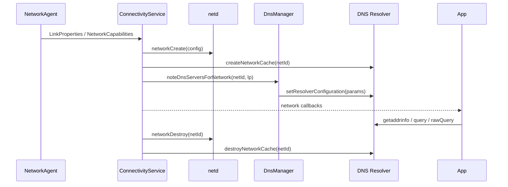

# 12.3 netd 与 DnsResolver：DNS 解析性能和故障诊断

DNS 位于多数新建连接的前部，但一次 HTTP 请求未必发生 DNS 查询：连接池可直接复用现有连接，HTTP/2 或 HTTP/3 也能在同一连接上承载多次请求。诊断时应先回答“本次请求是否查询 DNS、查询绑定哪条网络、结果是否进入了后续建连”，再分析 resolver 或 HTTPDNS。

12.1 介绍请求阶段、连接和传输协议，12.2 讨论 TLS，1.62 说明平台网络状态与系统选网。下面沿 Android 17 的源码路径说明系统 resolver，并给出应用侧能执行的诊断顺序。

## 一、四层边界：调用方、框架、resolver、netd

Android 应用常用的解析入口包括：

- `InetAddress.getAllByName()` 与 `Network.getAllByName()`；
- API 29 起提供的 `android.net.DnsResolver`；
- OkHttp 默认的 `Dns.SYSTEM`，它在 Android 上委托 `InetAddress.getAllByName()`；
- Native 代码的 `android_getaddrinfofornetwork()` 等 NDK 网络 API。

传入明确的 `Network` 时，查询应使用该网络的 resolver 配置。未指定网络的入口跟随系统为调用方选择的默认网络。Wi-Fi、蜂窝、VPN 并存时，这项区别直接影响 DNS server、路由和返回地址的可达性。

| 层级 | 典型组件 | 主要职责 | 应用侧证据 |
|---|---|---|---|
| 调用方 | OkHttp、Cronet、`InetAddress`、应用自定义 resolver | 决定查询时机、缓存策略和后续连接 | DNS 阶段事件、异常、连接目标 |
| Framework API | `DnsResolver`、`Network` | 指定 `Network`、查询类型、取消和回调线程 | `DnsException`、rcode、结果数量 |
| DNS Resolver 模块 | `com.android.resolv`、`IDnsResolver` | 每 `netId` 配置与缓存、DNS 查询、Private DNS | `dumpsys dnsresolver` |
| native 网络管理 | `netd` | 创建网络、路由、接口、权限、转发规则 | `dumpsys connectivity`、平台日志 |

“netd 负责 Android DNS”是一种过度简化。Android 17 的 resolver 源码位于 `packages/modules/DnsResolver`，native `netd` 位于 `system/netd`。两者是不同服务，`ConnectivityService` 会在同一个网络生命周期中分别调用它们。

## 二、版本迁移：从 netd 内部代码到独立主线模块

这段历史有助于阅读旧资料，但排查 Android 17 时应使用当前目录和服务边界。

| 版本 | 变化 | 阅读旧资料时的判断 |
|---|---|---|
| Android 9 及更早 | resolver 代码分布在 Bionic 与 netd，Java 查询可经 `dnsproxyd` | 旧文章中的 `system/netd` 路径可能只适用于当时版本 |
| Android 9 | 用户设置中加入 Private DNS，公开模式以 DNS-over-TLS 为基础 | Private DNS 属于系统解析策略，不等同于应用 DoH |
| Android 10 | resolver 迁入 `system/netd/resolv`，以 `com.android.resolv` APEX 交付 | 这是模块化初期的源码位置 |
| Android 17 | 当前实现位于 `packages/modules/DnsResolver`；接口仍以 `IDnsResolver` 与本地代理入口服务系统调用方 | 源码锚点使用 `android-17.0.0_r1` |

官方模块文档说明，Android 10 的 DNS Resolver 模块直接服务 `/dev/socket/dnsproxyd`，resolver 配置的 Binder 入口也从 netd 移入该模块。resolver 会与 netd 动态链接，但 resolver 不依赖 netd 服务才能表达自身的配置接口。模块化还允许通过 Mainline 更新解析器，而无需等待完整系统 OTA。

模块独立不代表应用获得了全局 DNS 控制权。普通应用不能清空所有网络的 resolver 缓存，不能修改别的网络的 DNS server，也不能操纵 Private DNS 校验状态。这些能力受系统权限和服务边界保护。

## 三、Android 17 的 `DnsResolver` API

### 3.1 Looper、Executor 与取消信号分别控制什么

API 29 的 `DnsResolver.getInstance()` 在 API 37 被标记为废弃。Android 17 新增 `DnsResolver(Context, Looper)`：传入的 `Looper` 用来监视 resolver 文件描述符的可读事件，查询方法中的 `Executor` 决定结果回调在哪个执行环境运行。这两个线程参数不能互相替代。

迁移时可按应用生命周期持有 resolver，避免为每次查询创建线程和 Looper。查询还应绑定 `CancellationSignal`；页面退出、请求取消或网络会话失效后，继续等待旧查询只会增加无效工作。使用新构造方法时要做 API 级别或扩展版本检查，低版本仍走兼容分支。

### 3.2 `query()`、`rawQuery()` 与错误信息

普通地址查询可使用 `query()`。Framework 会依据目标网络支持的地址族发起 A、AAAA 查询，整理后返回 `InetAddress` 列表。`rawQuery()` 面向需要指定记录类型或解析原始 DNS 报文的调用方。

两类 API 暴露的信息也不同：

- `DnsResolver.Callback` 能区分成功结果与 `DnsException`；
- raw query 回调还能提供 DNS rcode 和原始 answer；
- `InetAddress` 与 OkHttp 的常规路径经常把多种解析失败折叠为 `UnknownHostException`，不能从这一个异常反推出 NXDOMAIN、SERVFAIL、超时或本地策略拒绝；
- `FLAG_NO_CACHE_LOOKUP`、`FLAG_NO_CACHE_STORE` 和 `FLAG_NO_RETRY` 是诊断或特定协议策略，不适合为了“更实时”而长期全量开启。

缓存旁路会增加延迟、流量与 resolver 压力。若要对比缓存与上游行为，应控制样本量，并把实验请求与用户请求分开标记。

### 3.3 API 37 的 HTTPS 资源记录组合查询

API 37 与 S Extensions 22 增加 `TYPE_HTTPS`、`HttpsEndpoint`，以及同时查询 A、AAAA、HTTPS 资源记录的重载。`HttpsEndpoint` 可以携带按 RFC 6724 排序的地址、按 `SvcPriority` 排序的 HTTPS 记录、ALPN、端口、目标名称、IP hints，以及服务端发布时的 ECH 配置。

组合查询提供三种等待策略：

- `HTTPS_QUERY_WAIT_NONE`：地址结果可用后立即回调，不等待 HTTPS 记录；
- `HTTPS_QUERY_WAIT_AUTO`：由平台在延迟和 HTTPS 元数据完整性之间选择；
- `HTTPS_QUERY_WAIT_UNTIL_TIMEOUT`：等待 HTTPS 查询完成或达到调用方给出的超时。

`UNTIL_TIMEOUT` 遇到上游丢弃 HTTPS 查询时会增加等待时间。该超时应来自连接建立预算和线上分位数，不能复制一个固定常量到所有网络类型。

OkHttp 5.3 的 `Dns.lookup()` 只返回 `List<InetAddress>`。把 `HttpsEndpoint` 查询结果简单塞进自定义 `Dns` 无法传递 ALPN、端口、优先级或 ECH 配置。需要使用这些元数据时，连接栈必须显式支持它们。

## 四、Android 17 的系统调用路径

下面的时序图用于定位网络创建、DNS 配置与应用查询分别由谁处理。



图中有两条并行职责：netd 维护 native network 的存在与转发规则，resolver 为同一个 `netId` 建立解析缓存并接收配置。应用的网络回调只说明公开状态变化，不保证某个网络库已经停止复用旧连接。

### 4.1 网络创建与销毁

在 `android-17.0.0_r1` 的 `ConnectivityService` 中，创建 native network 时先调用 `mNetd.networkCreate(config)`，再调用 `mDnsResolver.createNetworkCache(netId)`。销毁时分别调用 `networkDestroy(netId)` 与 `destroyNetworkCache(netId)`。

每网络缓存能避免 Wi-Fi 与蜂窝共用不相容的解析状态。应用自定义缓存也应遵循这个边界：只以 hostname 作为 key，会让旧网络得到的地址在新网络上继续使用，VPN 分流与企业域名尤其容易受影响。

### 4.2 DNS server 与 Private DNS 配置

`LinkProperties` 更新后，`ConnectivityService.updateDnses()` 把变化交给 `DnsManager.noteDnsServersForNetwork()`。`DnsManager` 生成 `ResolverParamsParcel`，再经 `IDnsResolver.setResolverConfiguration()` 写入对应 `netId`。参数包括 DNS server、搜索域、采样与超时配置、Private DNS 信息等。

`DnsManager` 还会发送受保护的 `ACTION_CLEAR_DNS_CACHE`，让进程内 VM DNS 缓存丢弃旧结果。这里存在两个缓存层：

- resolver 模块维护按 `netId` 隔离的 native cache；
- Java/运行时和网络库还可能保存进程内结果或复用已建立连接。

系统清理 resolver 或 VM 缓存不会关闭 OkHttp 连接池中的 socket。切网后“域名已经解析到新地址，但请求仍访问旧链路”常由连接复用引起，应回看 connect 事件和目标 socket。

### 4.3 服务接口与 Android 17 源码位置

Android 17 的关键锚点如下：

| 职责 | 源码 |
|---|---|
| Framework DNS API | `packages/modules/Connectivity/framework/src/android/net/DnsResolver.java` |
| 网络生命周期协调 | `packages/modules/Connectivity/service/src/com/android/server/ConnectivityService.java` |
| resolver 参数生成 | `packages/modules/Connectivity/service/src/com/android/server/connectivity/DnsManager.java` |
| Binder 接口 | `packages/modules/DnsResolver/binder/android/net/IDnsResolver.aidl` |
| resolver 服务与 dump | `packages/modules/DnsResolver/DnsResolverService.cpp` |
| resolver 配置与统计 | `packages/modules/DnsResolver/ResolverController.cpp` |
| DoT/DoH 状态 | `packages/modules/DnsResolver/PrivateDnsConfiguration.cpp` |
| native 网络管理 | `system/netd/server/NetdNativeService.cpp` |

看到把 Android 10 的 `system/netd/resolv` 当作当前目录的资料时，应保留它的迁移史结论，再回到表中的 Android 17 文件核对实现。

## 五、Private DNS、DoT、DoH 与 `.local`

### 5.1 用户设置与内部传输不能画等号

Android 的公开 Private DNS 设置以 DoT 模式和 provider hostname 为用户语义。Android 17 的 resolver 内部同时存在 DoT 与 DoH 配置、验证和统计代码，DoH 实现还包括 `packages/modules/DnsResolver/rust/src/doh/`。内部可采用哪种加密传输，受平台版本、provider 与实验配置影响。

应用从 `InetAddress`、OkHttp `Dns` 或普通 `DnsResolver.query()` 回调中无法可靠判断这次查询经 DoT 还是 DoH。可观测的公开状态主要是 `LinkProperties` 中 Private DNS 是否生效、provider name 及已验证服务器。诊断报告应写“Private DNS 状态”，不要在没有平台证据时写死传输协议。

Private DNS 保护应用到 resolver 服务之间的 DNS 上游流量。它不替代 HTTPS，也不自动隐藏 TLS ClientHello 中的服务器名称；ECH 的适用条件见 12.2。

### 5.2 应用 DoH 是另一套解析策略

应用自带 DoH 会自行选择服务端、缓存、bootstrap 与 fallback，可能绕开系统 Private DNS、VPN DNS、企业 split DNS 和 Captive Portal 的预期路径。安全收益与兼容成本要一起评估：

- 公网固定域名可按业务策略使用应用 resolver；
- 企业内网域名、VPN 域名和门户网络优先遵循系统策略；
- fallback 是否允许从加密解析切到系统 DNS，应由安全与隐私策略定义；
- DoH 服务自身的域名解析不能递归进入同一个业务客户端。

### 5.3 mDNS 与 Android 17 本地网络权限

DNS Resolver 模块已支持对 `.local` 名称发起一次性 mDNS 查询。它适合“已知名字，解析地址”的场景，不提供 NSD 那样持续发现服务的完整生命周期。

目标 API 37 的应用访问本地网络时，需要申请 `ACCESS_LOCAL_NETWORK` 运行时权限；官方文档明确把 `.local` 解析包含在限制范围内。TCP、UDP、mDNS 以及经 OkHttp、Cronet、WebView 发起的本地网络访问都可能受该权限影响。遇到 `.local` 在 Android 17 失败时，应先核对 target SDK、权限授予和目标网络，再判断 resolver 故障。

## 六、从业务错误到系统证据的诊断顺序

### 6.1 先确认请求是否停在 DNS

一次请求至少记录这些相邻事件：

1. DNS 开始、结束或失败；
2. connect 开始、目标地址与结束；
3. TLS 开始、结束；
4. HTTP 请求头发送、首字节与结束；
5. 取消、网络切换和进程生命周期事件。

连接复用时没有 DNS 与 connect 事件是正常现象。若 DNS 很快而 connect 超时，检查路由、地址族与目标 IP；若 TLS 慢，转到 12.2；若首字节慢，检查服务端、CDN 与回源。

### 6.2 固定故障的网络上下文

每次故障至少关联：

- 应用进程内的网络会话标识；
- Wi-Fi、蜂窝、VPN 等传输类型；
- `VALIDATED`、`CAPTIVE_PORTAL` 等相关 capability；
- `LinkProperties` 中的接口、DNS server 数量和 Private DNS 状态；
- 默认网络变化到请求开始之间的时间；
- 查询来源：系统、HTTPDNS、应用 DoH 或缓存。

`netId` 会复用，也属于平台内部标识。线上长期聚合可使用进程内递增的网络会话号或带轮换盐的标识，避免把原始值当成稳定设备属性。

### 6.3 三组 shell 证据

下面的命令用于受控测试设备或可授权的 bugreport 环境；resolver dump 需要 `DUMP` 权限，普通第三方应用不能在生产设备中自行执行。

```shell
adb shell dumpsys connectivity
adb shell dumpsys dnsresolver
adb shell dumpsys dnsresolver querylog
```

第一条用于核对当前网络、`LinkProperties`、capability、VPN 与 Private DNS 状态。第二条列出 resolver 的网络缓存、DNS server 统计、搜索域、参数与 Private DNS 信息。第三条输出 resolver 查询记录；Android 17 的 `DnsQueryLog` 会遮蔽 hostname 和地址，仍应按受限诊断数据保存。

`ResolverController::dump()` 的 server 统计包括查询总数、成功、错误、超时、内部错误、平均 RTT 与 server 状态。这些数据适合回答“设备当前 resolver 是否集中失败”，不能直接替代应用请求阶段计时：应用可能命中自己的缓存、等待线程调度，或复用既有连接。

### 6.4 NetworkDiagnostics 能证明什么

Android 17 的 `NetworkDiagnostics` 会把探测 socket 绑定到指定 `Network`，针对网关、DNS server 和测试地址执行 ICMP、UDP DNS 与 DNS-over-TLS 诊断。它同时检查链路、DNS server 与加密 DNS 可达性。

这类平台探测能缩小系统网络故障范围，但不能证明业务域名、CDN 地址或应用 HTTPDNS 正常。应用问题仍要把平台探测结果与同一时间的 hostname 类别、查询来源和 connect 目标关联。

### 6.5 常见现象的证据分流

| 现象 | 优先核对 | 暂时不要推断 |
|---|---|---|
| `UnknownHostException` 增长 | 使用的解析入口、网络会话、resolver/HTTPDNS 结果、超时与取消 | 一定是 NXDOMAIN |
| DNS 高分位延迟增长 | 冷缓存比例、上游 server RTT、网络切换、线程排队、查询类型 | 换 HTTPDNS 一定更快 |
| 切网后第一个请求失败 | socket 是否复用旧网络、缓存是否带网络维度、新网络是否验证 | DNS 缓存一定污染 |
| VPN 下公网正常、内网域名失败 | VPN DNS、split DNS、绑定的 `Network`、应用 DoH/HTTPDNS 覆盖 | 运营商 DNS 劫持 |
| DNS 成功但 `VALIDATED` 丢失 | Captive Portal、路由、HTTP 探测、Private DNS 校验 | 网络已经可用 |
| `.local` 失败 | API 37 本地网络权限、目标网络、mDNS 适用范围 | 公网 DNS server 故障 |

## 七、HTTPDNS 与 OkHttp 自定义 `Dns`

系统 resolver 与 HTTPDNS 解决不同问题。系统路径继承 `Network`、VPN、Private DNS 与平台缓存策略；HTTPDNS 能提供业务域名调度和独立的上游服务。接入后，应用也要自行维护网络隔离、TTL、并发、bootstrap 和 fallback。

OkHttp 的 `Dns.lookup(hostname)` 是同步接口，并且可能被多个请求并发调用。可执行的实现边界包括：

- `lookup()` 内优先读取线程安全的内存缓存；
- 缓存 key 至少包含 hostname 与网络会话，必要时加入地址族和用户网络策略；
- TTL 使用 DNS/HTTPDNS 服务返回的有效期，并对负缓存单独设定策略；
- 缓存缺失时若要同步访问 HTTPDNS，这段耗时会进入建连前的 DNS 阶段；
- 异步预取应由明确的业务触发，过期结果不能无限续用；
- 持久化地址只适用于能正确保存 TTL、网络分区和数据版本的设计，默认优先使用内存；
- HTTPDNS 客户端使用独立、最小化的 bootstrap 路径，不能递归调用同一个自定义 `Dns`；
- 系统 fallback 由产品的可用性、隐私和企业网络策略共同决定。

使用解析得到的 IP 建连时，URL 仍应保留原始 hostname，让 TLS SNI、证书主机名校验和 HTTP Host 保持一致。直接把 URL 改为 IP 再关闭主机名校验属于安全缺陷。

连接池会改变 DNS 统计：请求复用现有连接时不会调用 `lookup()`；同一个域名返回多个 IP 时，连接策略还会影响尝试顺序和失败回退。HTTPDNS 设计与 OkHttp 边界的完整示例见 24.10。

## 八、指标、日志与告警

### 8.1 分位数应服务于 SLO

中位数、p90、p95 或 p99 应按业务请求量和 SLO 选择。低流量域名的 p99 波动很大，固定套用会制造噪声。聚合至少分开：

- 解析来源与缓存状态；
- 网络传输类型、VPN 和 Private DNS 状态；
- 冷启动、前后台与网络切换会话；
- A、AAAA、HTTPS 等查询类型；
- 成功、空结果、超时、取消和可获得的 rcode；
- DNS 结束后的 connect 成功、失败及地址族。

“切网后故障”也不应固定为一个通用秒数。建议记录 `elapsed_since_default_network_change_ms`，再根据线上分布和产品超时预算划分观察窗口，同时把复用连接与新建连接分开。

### 8.2 最小事件模型

一条解析事件可包含：

| 字段 | 用途 |
|---|---|
| `request_id` / `trace_id` | 与 connect、TLS、HTTP 阶段关联 |
| `network_session_id` | 区分切网前后的解析和连接 |
| `resolver_source` | system、HTTPDNS、app DoH、memory cache |
| `query_type` | A、AAAA、HTTPS 或组合查询 |
| `duration_ms` | 查询或缓存读取耗时 |
| `result_count` / `address_family` | 判断空结果与地址族变化 |
| `error_stage` / `error_class` / `rcode` | 在 API 能提供时区分失败 |
| `fallback_from` / `fallback_to` | 评估降级是否有效 |
| `connect_outcome` | 验证解析结果能否建立连接 |

完整 hostname、DNS server、返回 IP 和 provider name 都可能成为敏感网络信息。生产埋点可使用服务端分配的域名类别、受控 allowlist、轮换 HMAC 或网段级分类；诊断包的访问权限、保留时间和导出范围也要受控。哈希前若取值空间很小，离线枚举仍可能恢复域名，不能把无盐散列视为匿名化。

### 8.3 告警要能指向动作

| 告警信号 | 关联证据 | 可能的处置方向 |
|---|---|---|
| system DNS 超时上升 | 网络/运营商分桶、resolver RTT、Private DNS 状态 | 核对特定网络或 provider |
| HTTPDNS fallback 上升 | HTTPDNS 服务耗时、bootstrap、缓存过期 | 隔离服务故障或调整预取 |
| DNS 正常但 connect 失败 | 返回地址族、目标 IP 分类、路由和连接池 | 检查地址可达性与旧连接 |
| 切网会话错误集中 | 网络变化间隔、缓存来源、连接是否复用 | 修正网络维度缓存或客户端生命周期 |
| 企业/VPN 用户异常 | VPN、代理、split DNS、应用 resolver 覆盖 | 缩小自定义解析范围 |

## 九、Tethering offload 不属于本机 DNS 路径

热点共享的 Tethering、NAT 和 hardware offload 处理的是被共享设备的转发数据面。它们可能使用 netd 管理的接口和规则，却不进入本机应用普通 DNS 查询的 resolver 调用链。

反馈若来自连接手机热点的另一台设备，应检查上游网络选择、转发、NAT 和 offload；反馈若来自手机本机应用，应沿 `Network`、`LinkProperties`、DNS Resolver、应用缓存和连接池定位。仅因两个问题都靠近 netd 就合并诊断，会增加无关变量。

## 小结

Android 17 的 DNS 诊断应围绕 `Network` 建立证据链：`ConnectivityService` 同步网络生命周期，netd 管理 native 网络，DNS Resolver 主线模块维护每 `netId` 配置、缓存和 Private DNS，应用网络库决定查询时机、连接复用与自定义解析策略。

排查时先确认请求是否发生 DNS，再固定网络会话和解析来源；随后使用客户端阶段事件、`dumpsys connectivity`、`dumpsys dnsresolver` 与脱敏 query log 相互印证。HTTPDNS 或应用 DoH 能补充业务调度与安全策略，但不能省略 TTL、网络隔离、bootstrap、企业网络和隐私设计。

## 参考资料

- [DNS Resolver 模块](https://source.android.com/docs/core/ota/modular-system/dns-resolver)
- [`DnsResolver` API 参考](https://developer.android.com/reference/android/net/DnsResolver)
- [`HttpsEndpoint` API 参考](https://developer.android.com/reference/android/net/dns/HttpsEndpoint)
- [Android 17 本地网络权限](https://developer.android.com/privacy-and-security/local-network-permission)
- [NDK Networking API](https://developer.android.com/ndk/reference/group/networking)
- [`DnsResolver.java`（Android 17）](https://android.googlesource.com/platform/packages/modules/Connectivity/+/android-17.0.0_r1/framework/src/android/net/DnsResolver.java)
- [`ConnectivityService.java`（Android 17）](https://android.googlesource.com/platform/packages/modules/Connectivity/+/android-17.0.0_r1/service/src/com/android/server/ConnectivityService.java)
- [`DnsManager.java`（Android 17）](https://android.googlesource.com/platform/packages/modules/Connectivity/+/android-17.0.0_r1/service/src/com/android/server/connectivity/DnsManager.java)
- [`NetworkDiagnostics.java`（Android 17）](https://android.googlesource.com/platform/packages/modules/Connectivity/+/android-17.0.0_r1/service/src/com/android/server/connectivity/NetworkDiagnostics.java)
- [`IDnsResolver.aidl`（Android 17）](https://android.googlesource.com/platform/packages/modules/DnsResolver/+/android-17.0.0_r1/binder/android/net/IDnsResolver.aidl)
- [`DnsResolverService.cpp`（Android 17）](https://android.googlesource.com/platform/packages/modules/DnsResolver/+/android-17.0.0_r1/DnsResolverService.cpp)
- [`ResolverController.cpp`（Android 17）](https://android.googlesource.com/platform/packages/modules/DnsResolver/+/android-17.0.0_r1/ResolverController.cpp)
- [`DnsQueryLog.cpp`（Android 17）](https://android.googlesource.com/platform/packages/modules/DnsResolver/+/android-17.0.0_r1/DnsQueryLog.cpp)
- [`PrivateDnsConfiguration.cpp`（Android 17）](https://android.googlesource.com/platform/packages/modules/DnsResolver/+/android-17.0.0_r1/PrivateDnsConfiguration.cpp)
- [`NetdNativeService.cpp`（Android 17）](https://android.googlesource.com/platform/system/netd/+/android-17.0.0_r1/server/NetdNativeService.cpp)
- [OkHttp `Dns.kt`（5.3.0）](https://github.com/square/okhttp/blob/parent-5.3.0/okhttp/src/commonJvmAndroid/kotlin/okhttp3/Dns.kt)
