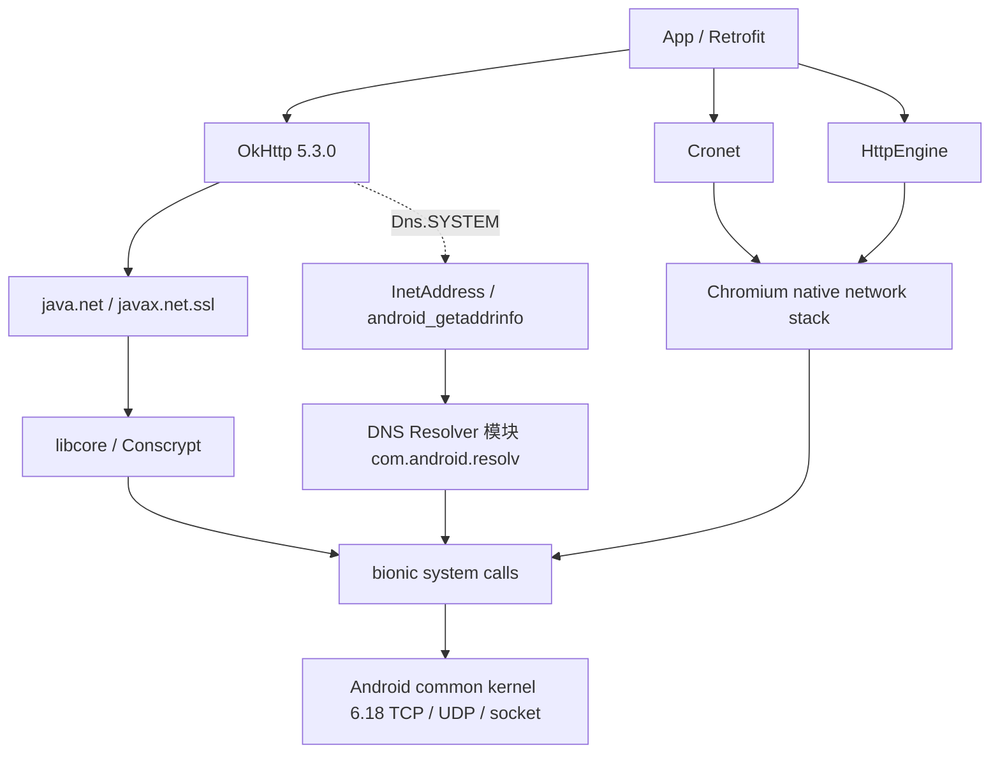

# 12.3 网络性能深入：连接池、TLS 与传输优化

<!-- outline-start -->
## 本节要点大纲

### 锚点（必须覆盖）

- 🔹 Android 网络栈全景：请求从 OkHttp 到内核协议栈的路径与耗时拆分
- 🔹 OkHttp 连接池与复用机制：ConnectionPool、HTTP/2 多路复用、EventListener 时序
- 🔹 TLS 握手性能与优化：TLS 1.2 / TLS 1.3、Conscrypt、证书校验开销
- 🔹 DNS 解析性能：系统 DNS resolver、DoT / DoH、OkHttp 自定义 DNS
- 🔹 网络请求对电池的影响：Radio State Machine、批量请求、JobScheduler 调度
- 🔹 在 Perfetto 中分析网络性能：自定义 Trace Event、主线程阻塞、指标基线

### 扩展（可选深入）

- 🔸 HTTP/3 与 QUIC
- 🔸 WebSocket 性能
- 🔸 Retrofit 与 Coroutine 集成性能

### OpenClaw 加工指引

> **锚点**是最低覆盖要求，加工时必须逐条落实并标注验证结果。
> **扩展**视素材丰富程度选择性深入。
> 如果后续补到了 HTTP/2 复用、Radio State Machine 或网络请求分阶段 Trace 的图示，优先插入对应锚点后并补验证来源。
<!-- outline-end -->

§12.2 讨论客户端选择、超时、重试和弱网策略，本节关注一次调用在客户端内部经历的阶段。分析时要同时保留两种视角：

- **逻辑调用**：业务发起的一次 `Call`，可能包含排队、重定向、认证挑战、重试和多个物理连接尝试。
- **物理交换**：一次具体的 DNS 查询、socket 建连、TLS 握手或 HTTP request/response exchange。

只记录逻辑调用总时长，会把排队、建连和服务端等待混在一起。只记录单次物理交换，又会漏掉重试和重定向成本。OkHttp `EventListener` 提供的事件正好覆盖这两个层级。

## Android 17 网络栈边界

Android 应用常见的三条 HTTP 路径不能合写成一条 Java 调用栈：

- **OkHttp 5.3.0**：连接管理由 OkHttp 完成，TCP 通常经 `java.net.Socket`，TLS 经 `SSLSocket` 与平台 JSSE provider，系统 DNS 入口是 `InetAddress.getAllByName()`。
- **Cronet**：Chromium 网络栈以库形式运行，连接池、HTTP/2、HTTP/3、QUIC 和异步 DNS 策略主要位于 Chromium 代码。
- **HttpEngine**：API 34 起提供 `android.net.http` SDK，底层使用设备提供的 HttpEngine/Cronet 实现；可用协议与 provider 能力有关。

下面的图用于标出应用库、Android 平台与内核之间的职责边界。



图中的 QUIC 状态机位于 Cronet/Chromium 用户空间，内核只处理 UDP socket、IP、路由、拥塞相关的通用设施。TCP 路径可在 `android17-6.18-2026-06_r6` 的 `net/ipv4/tcp.c`、`tcp_input.c` 与 `tcp_output.c` 继续追踪；内核里没有与 Cronet 等价的 HTTP/3 实现。

### 冷连接的阶段

一次直连 HTTPS 冷连接可能出现下列阶段。代理、连接竞速、缓存和协议版本会改变顺序与次数，因此这些耗时不能机械相加。

| 阶段 | 客户端正在做什么 | 常见影响因素 |
| --- | --- | --- |
| Dispatcher 排队 | 等待 OkHttp 并发名额或 HTTP/2 stream 名额 | `maxRequests`、`maxRequestsPerHost`、服务端并发 stream 上限 |
| 路由与 DNS | 选择代理，查询地址并确定候选 route | DNS 缓存、Private DNS、地址族、VPN、网络切换 |
| TCP 建连 | 对候选地址建立 socket；Fast Fallback 可能交错尝试 IPv6/IPv4 | RTT、丢包、SYN 重传、防火墙、代理 |
| 代理隧道 | HTTPS 经 HTTP 代理时执行 `CONNECT` | 代理认证与代理 RTT |
| TLS | 协商协议、验证证书、派生密钥 | TLS 版本、恢复票据、证书链、CPU、网络 RTT |
| HTTP 交换 | 写入请求、等待响应头、读取响应体 | 上传体积、服务端队列、拥塞、流控 |

连接复用会省去其中若干阶段。命中 HTTP 缓存时，网络阶段甚至全部缺席。性能数据必须标出 pooled/new connection、cache hit、protocol 和网络类别，才具有可比性。

### 主线程网络访问为何会失败

Android 17 的 `Inet6AddressImpl.lookupHostByName()` 在查询缓存前调用线程策略，随后才进入 `android_getaddrinfo()`。下面的源码摘录用于说明检测位置。

```java
BlockGuard.getThreadPolicy().onNetwork();
Object cachedResult = addressCache.get(host, netId);
// ...
InetAddress[] addresses =
        Libcore.os.android_getaddrinfo(host, hints, netId);
```

这个顺序表明，即使 Java 层地址缓存命中，主线程调用域名解析也会经过 `onNetwork()`。`BlockGuardOs` 对 `connect()`、阻塞式 `poll()`、`recvmsg()` 等入口同样调用线程策略。面向 Honeycomb 及以上 SDK 的应用，主线程默认策略会用 `NetworkOnMainThreadException` 终止这类 Java 网络操作。

`StrictMode` 属于尽力检测工具。JNI 直接发起的 I/O 可能避开部分检测，应用也能修改线程策略。另一类常见故障来自 UI 线程等待后台网络任务：`Future.get()`、`CountDownLatch.await()` 或 `runBlocking` 不会触发网络异常，仍会阻塞输入与首帧。

[已验证: AOSP `android-17.0.0_r1`, `libcore/ojluni/src/main/java/java/net/Inet6AddressImpl.java`, `libcore/luni/src/main/java/libcore/io/BlockGuardOs.java`, `frameworks/base/core/java/android/os/StrictMode.java`]

## OkHttp 5.3.0 连接池与复用

### 共享客户端

一个 `OkHttpClient` 持有连接池、Dispatcher 和内部线程资源。业务按请求创建客户端，会产生彼此隔离的池，连接复用率也会下降。应用应共享客户端；差异化超时或拦截器可通过 `newBuilder()` 派生，派生客户端继续共享连接池与线程资源。

### 默认参数的准确含义

下面的 OkHttp 5.3.0 源码摘录用于确认默认空闲连接策略。

```kotlin
constructor() : this(5, 5, TimeUnit.MINUTES)
```

`5` 是池内最多保留的**空闲连接**数量，`5 分钟`是空闲连接保留时长。它不限制连接总数，也不等于“最多连接 5 个域名”。正在承载 HTTP/2 stream 的连接不是空闲连接；并发上限由 Dispatcher、HTTP/2 settings、socket 资源和服务端共同影响。源码注释还说明这些调优值可能随 OkHttp 版本变化，应用不应把它们当成永久协议约束。

[已验证: OkHttp 5.3.0, `okhttp3.ConnectionPool`]

### 何时可以复用

同一 `Address` 的请求可复用已有连接。这里的 `Address` 包含 scheme、port、DNS、代理、socket factory、TLS 配置、hostname verifier、certificate pinner 等配置，不能缩写成“host、port、scheme 相同”。

HTTP/2 还支持连接合并。OkHttp 5.3.0 的 `RealConnection.isEligible()` 对跨主机复用检查以下条件：

- 连接是 HTTP/2，并且仍允许新的 stream。
- 候选 route 与现有直连 route 指向同一 IP 和端口。
- 现有证书覆盖新主机，且使用 OkHttp 默认 hostname verifier。
- 新主机的 certificate pin 校验通过。
- 除主机名外，其余 `Address` 配置兼容。

因此，域名分片可能降低 HTTP/2 复用效果；证书覆盖多个主机也不会自动保证连接合并，DNS、代理与 pin 条件仍要通过。

### HTTP/1.1 与 HTTP/2

OkHttp 不在 HTTP/1.1 上使用 pipelining，一条连接同一时刻承载一个 exchange。并发请求通常需要多条连接。HTTP/2 在一条连接中用 stream ID 区分并发交换，连接数量通常更少。

HTTP/2 仍运行在一个有序 TCP 字节流上。TCP 丢失某段数据时，后续字节要等待重传，即使它们属于别的 HTTP/2 stream。HTTP/3 把 HTTP stream 映射到 QUIC stream，可避免某个 stream 的数据丢失直接阻塞其他 stream 的有序交付；连接级拥塞控制仍然共享。

### EventListener 的事件口径

下面的时序用于对照 OkHttp 5.3.0 的公开回调。方括号表示可能缺席或重复的事件组。

```text
callStart
[dispatcherQueueStart -> dispatcherQueueEnd]
[cacheHit -> callEnd]
[cacheMiss | cacheConditionalHit]
[proxySelectStart -> proxySelectEnd] × 0..n
[dnsStart -> dnsEnd] × 0..n
[connectStart -> [secureConnectStart -> secureConnectEnd] -> connectEnd] × 0..n
[connectStart -> [secureConnectStart] -> connectFailed] × 0..n
[connectionAcquired
    -> requestHeadersStart -> requestHeadersEnd
    -> [requestBodyStart -> requestBodyEnd]
    -> responseHeadersStart -> responseHeadersEnd
    -> [responseBodyStart -> responseBodyEnd]
    -> connectionReleased] × 0..n
callEnd | callFailed
[canceled 可在任意位置并发出现]
```

完整缓存命中会触发 `cacheHit` 并跳过常规网络事件；条件缓存命中仍可能访问网络做验证。池中连接可复用时，proxy、DNS 与 connect 事件会缺席。重定向、认证、route 重试会让事件组重复；duplex body 与 `Expect: 100-continue` 还会改变常见嵌套顺序。`canceled` 可与其他回调并发，取消也可能在下一次昂贵 I/O 前尚未生效。

监听器必须快速返回，不能执行文件或网络 I/O，也不能重入客户端。采样结果应写入无阻塞内存队列，再由后台消费者批量处理。

推荐的指标口径如下：

| 指标 | 计算口径 | 解读限制 |
| --- | --- | --- |
| Dispatcher queue | `dispatcherQueueEnd - dispatcherQueueStart` | 事件缺席表示未排队，不能记为缺失数据 |
| DNS | 每组 `dnsEnd - dnsStart` | 一个 Call 可有多组；池复用时为零组 |
| 建连尝试 | `connectEnd/connectFailed - connectStart` | HTTPS 成功事件包含 TLS；多个尝试可能交错 |
| TLS | 成功时用 `secureConnectEnd - secureConnectStart`；失败时记录 `connectFailed` 与最近一次 `secureConnectStart` | `Handshake.tlsVersion` 可区分协议版本；公开 EventListener 不提供“是否会话恢复”字段 |
| TTFB | 无请求体时从 `requestHeadersEnd` 起算；普通请求体从 `requestBodyEnd` 起算 | 包含上行、服务端处理与下行首包，duplex 请求需单独定义 |
| 响应体读取 | `responseBodyEnd - responseBodyStart` | 同时受消费速度、流控与网络影响 |
| Call 总时长 | `callStart` 到 `callEnd` 或 `callFailed` | 包含排队、重试、重定向和 body close |

`connectStart` 到 `secureConnectStart` 只能在直连 HTTPS、无代理隧道且单次尝试的条件下近似 socket connect。把它全局命名为 TCP 耗时会污染代理请求和复杂 route 数据。

## TLS 握手与证书验证

### TLS 1.2、TLS 1.3 与恢复

协议往返数描述消息依赖关系，不能直接换算成固定毫秒数。

- TLS 1.2 完整 ECDHE 握手通常需要两个网络往返后，客户端才能发送应用数据。
- TLS 1.3 完整握手把客户端发送应用数据前的等待缩短到一个往返。
- TLS 1.3 PSK 恢复仍可按 1-RTT 运行，并减少证书与密钥交换工作。
- TLS 1.3 0-RTT 允许恢复连接在首个 flight 携带 early data，但数据缺少连接间防重放保证。

Android 10（API 29）起，平台 TLS 默认启用 TLS 1.3；平台 JSSE 实现明确不支持 0-RTT。Cronet/HttpEngine 的 QUIC 0-RTT 属于另一条客户端路径，不能用 JSSE/Conscrypt 的行为推断。

RFC 8446 要求客户端只发送能够容忍重放的 early data。HTTP 方法名也不够用来判断安全性：带鉴权的查询、限流计数或一次性 token 即使使用 GET，也可能不适合 0-RTT。

### Conscrypt 的位置

Android 平台 JSSE provider 由 Conscrypt 提供，native 加密实现基于 BoringSSL。Android 10 起，`com.android.conscrypt` 作为 Mainline APEX 模块分发。应用调用 `SSLSocket`、`SSLEngine`、`TrustManager` 等标准 API，通常无需依赖外部 `org.conscrypt` artifact。

全局插入外部 provider 会改变进程中的 JCA/JSSE 选择顺序，兼容风险高于单纯的“握手加速”。只有明确的旧系统安全兼容需求、完整的设备测试与回退方案同时具备时，才应考虑 ProviderInstaller 或外部 Conscrypt；它们不应作为常规性能开关。

### 证书验证不能独立看成网络 RTT

证书链解析、签名校验、hostname verification 和 pin 校验以本地 CPU 工作为主。Android 的证书吊销处理结合系统 blocklist、Certificate Transparency 与服务端 stapled OCSP response，不会为每次 TLS 握手固定追加一次在线 OCSP 查询。

Android 官方安全文档不推荐普通应用采用 certificate pinning。确有 pin 需求时，应准备备用 key 与可维护的轮换策略。Pin 配置过期或遗漏新证书会让连接直接失败。OkHttp 5.3.0 的 TLS 成功路径才调用 `secureConnectEnd`；hostname、证书链或 pin 校验失败时，事件通常从 `secureConnectStart` 进入 `connectFailed`，不能误判为握手偏慢。

降低 TLS 成本的工程顺序是：

- 提高连接复用率，减少握手次数。
- 按 TLS 版本、证书链和网络类别拆分数据；会话恢复状态需由服务端或额外 TLS 遥测补充。
- 检查服务端证书链是否发送完整，避免冗余证书。
- 检查 session ticket、负载均衡与集群密钥配置，让恢复在服务端集群内可用。
- 保留现代协议协商，不为毫秒目标强制降级 TLS。

## DNS 解析性能

### Android 17 的系统解析路径

OkHttp `Dns.SYSTEM` 调用 `InetAddress.getAllByName()`。AOSP 17 中，`Inet6AddressImpl` 先查以 hostname 与 `netId` 为 key 的 Java `AddressCache`，未命中时调用 `Libcore.os.android_getaddrinfo()`。Java 层缓存最多 16 项，正负结果都保留 2 秒；它主要减少 Java/native 对象转换。更下方的 DNS Resolver 模块维护网络级解析状态与缓存，并负责向配置的 DNS transport 发查询。

Android 10 把 resolver 迁入可更新的 `com.android.resolv` 模块；Android 11 起该模块成为强制组件。每条 Android `Network` 有独立配置，VPN、Private DNS 与网络切换都可能改变解析结果。用一个进程级永久 map 缓存 IP 会绕过这些边界。

[已验证: AOSP `android-17.0.0_r1`, `java/net/AddressCache.java`, `java/net/Inet6AddressImpl.java`; Android DNS Resolver Mainline 文档]

### DoT、DoH 与 DoH3

Android 9（API 28）引入 Private DNS，公开设置入口对应 DoT。Google 在 2022 年说明，系统 resolver 通过 Mainline 更新在部分 Android 10 设备及 Android 11 以上设备为受支持的 well-known resolver 启用 DoH3。AOSP 17 的实现仍位于 `packages/modules/DnsResolver/rust/src/doh/`。

这段历史说明系统可能选择不同的加密 DNS transport。应用不能从 `InetAddress` 回调判断本次查询走了 UDP、DoT 或 DoH3，也不能把系统 rollout 当成面向应用的通用 DoH API。排障时应结合 Private DNS 状态、目标 `Network`、resolver 日志与应用阶段指标。

### API 37 的 HTTPS DNS Record

Android 17（API 37，同时标注 S Extensions 22）为 `DnsResolver` 增加 `TYPE_HTTPS` 和并发 A/AAAA/HTTPS 查询重载，回调返回 `HttpsEndpoint`。源码中的 `HttpsEndpoint` 包含：

- 按 RFC 6724 排序的 IP 地址，来源可包括 A/AAAA 结果与 HTTPS RR 的 IP hints。
- 按 `SvcPriority` 排序的 `HttpsRecord`。
- HTTPS RR 提供的 ALPN ID、目标名、端口、IP hints；平台 ECH flag 可用时还可读取 ECH 配置。

这些 API 带 `FLAG_ENCRYPTED_CLIENT_HELLO_DNS`，ECH 读取另受 Conscrypt 平台 flag 约束。应用还要处理设备 API/extension 可用性、空 HTTPS 记录和查询超时。

`httpsTimeoutMillis` 明确表达性能取舍：A/AAAA 已返回后，继续等待 HTTPS 查询可能增加 DNS 阶段时间；不等待则可能拿不到 ALPN、ECH 与 IP hints。HTTPS RR 可让支持它的客户端提前获知 alternative endpoint 或 `h3` 能力，不能保证减少固定数量的 RTT，也不会替代 TLS 握手。

OkHttp 5.3.0 的 `Dns.lookup()` 只返回 `List<InetAddress>`。把 `HttpsEndpoint` 的地址塞进这个列表，只能传递地址与顺序，ALPN、端口、priority 和 ECH 信息都会丢失。需要完整使用 HTTPS RR 的客户端必须在连接层支持这些字段，单靠 OkHttp 自定义 `Dns` 无法完成。

[已验证: AOSP `android-17.0.0_r1`, `android/net/DnsResolver.java`, `android/net/dns/HttpsEndpoint.java`, `android/net/dns/HttpsRecord.java`; RFC 9460]

### 自定义 DNS 的边界

OkHttp `Dns` 是同步接口，OkHttp 会从自己的调用执行路径调用它。实现类必须可并发使用，并按期望尝试顺序返回地址。自定义 HTTPDNS 或 DoH 方案至少要处理：

- IPv4/IPv6 结果与 Fast Fallback，不能永久偏向单一地址族。
- DNS TTL、负缓存、目标 `Network` 和网络切换后的失效。
- HTTPDNS 服务自身的 bootstrap，避免用同一个自定义 resolver 递归解析自己。
- 查询失败后的系统 DNS 回退，以及回退是否符合业务的隐私要求。
- URL 保留原 hostname，让 SNI、hostname verification 与 certificate pinning 继续按域名工作。
- CDN 调度所需的客户端网络位置与 EDNS Client Subnet 策略。

预解析只适合点击概率较高、目标 host 数量受控且查询可取消的场景。它可能缩短后续冷连接的 DNS 阶段，也可能只产生一次无用查询。Android 16 没有公开的 `DnsResolver Predictive Prefetching` API，应用不能依赖 hover 或无障碍焦点自动触发系统预解析。

连接池已有可用连接时，OkHttp 会跳过 DNS。网络回调到达后无条件调用 `connectionPool.evictAll()` 会关闭全部空闲连接，降低复用率；`onAvailable()` 还会在初次注册与多种网络可用场景触发。只有故障数据确认旧连接或自定义 DNS 缓存无法恢复时，才应设计受控失效策略。

## 网络活动与电池

蜂窝网络发送少量数据也可能让 modem 从低功耗态切到传输态。数据停止后，运营商与基带配置通常会保留一段 tail time。RAT、设备、信号质量和运营商参数都会改变状态与持续时间，因此文档中的 3G 示例不能直接当作 LTE/5G 的固定功耗模型。

请求调度应按业务时效性处理：

| 请求类别 | 建议方式 | 说明 |
| --- | --- | --- |
| 用户正在等待 | 立即发起，复用连接，支持取消 | 交互响应优先，避免为了批处理延迟用户操作 |
| 日志、遥测、可延迟同步 | 在应用内合批，用 WorkManager 设置网络与电量约束 | 系统获得更大的调度窗口，但不保证跨应用同时执行 |
| 大文件预取 | 结合 `UNMETERED`、充电状态、存储与内容过期时间 | `UNMETERED` 表示计费属性，不等同于 Wi-Fi transport |
| 服务端主动更新 | 优先复用 FCM 等系统推送通道 | 避免每个应用维护短周期 polling 与心跳 |

WorkManager 在 API 23 以上通常借助 JobScheduler 执行持久工作，仍受 Doze、App Standby Bucket、后台资源限制和约束变化影响。约束满足表示“允许调度”，不等于精确执行时刻。运行期间约束失效时，Worker 还可能被停止并在以后重试。

判断计费属性应查看 `NET_CAPABILITY_NOT_METERED` 或使用 WorkManager 的 `NetworkType.UNMETERED`。`TRANSPORT_WIFI` 只描述传输类型：Wi-Fi 热点可能按流量计费，蜂窝网络也可能由运营商提供不计费能力。

## 用 Perfetto 分析网络调用

Perfetto 不会自动把每个 OkHttp Call 展开成 DNS、TLS 与 TTFB 切片。它擅长展示线程调度、Binder、系统事件和应用自定义 trace；HTTP 语义仍要由客户端事件补充。

### 给逻辑 Call 加异步切片

`Trace.beginSection()` 与 `endSection()` 必须在同一线程严格嵌套。OkHttp 回调可能重复，未来还可能并发尝试 route；用跨线程异步切片标记整个 Call 更稳妥。下面的示例为每个 Call 分配 cookie，并在两个终止回调中关闭同一个切片。

```kotlin
private val nextTraceId = AtomicInteger()

class CallTraceListener(
    private val traceId: Int
) : EventListener() {
    override fun callStart(call: Call) {
        Trace.beginAsyncSection("net.call", traceId)
    }

    override fun callEnd(call: Call) {
        Trace.endAsyncSection("net.call", traceId)
    }

    override fun callFailed(call: Call, ioe: IOException) {
        Trace.endAsyncSection("net.call", traceId)
    }
}

val client = OkHttpClient.Builder()
    .eventListenerFactory {
        CallTraceListener(nextTraceId.incrementAndGet())
    }
    .build()
```

这里的 `Trace` 来自 `androidx.tracing:tracing`，兼容旧于 API 29 的设备。相同名称的重叠切片必须使用不同 cookie。不要把完整 URL、查询参数、用户 ID 或 token 写进 trace 名称；固定名称配合内存中的 request ID 映射更安全，也能控制字符串基数。

阶段级事件更适合记录单调时钟时间戳，再在采集器中按 Call、route、地址和事件序号生成 span。直接在每个 `connectStart()` 调 `beginSection()`，随后在 `connectEnd()` 调 `endSection()`，遇到 Fast Fallback、失败重试或线程切换时容易配错。

### 读主线程轨迹

主线程处于 `nativePollOnce` 或 `epoll_wait` 常常只是 Looper 空闲，不能据此认定网络阻塞。排查顺序可以按以下证据推进：

- MainThread 是否长时间处于 Running、Runnable、Sleeping 或不可中断等待。
- 调用栈是否停在 `Future.get()`、`CountDownLatch.await()`、锁或协程桥接点。
- 同一时间窗口的 OkHttp Dispatcher、Cronet、Binder 线程处于哪个网络阶段。
- 若主线程栈直接出现 `recvmsg`、`connect` 或阻塞 `poll`，再核对 fd、native 调用栈与线程策略。

Perfetto 中的自定义 `net.call` 切片能把后台网络时间与主线程等待对齐；它不证明两者存在因果关系。调用 ID、业务事件和同步对象的栈证据能补足因果判断。

### 建立可比较的线上基线

推荐收集 queue、DNS、connect attempt、TLS、upload、TTFB、body read、Call total 与错误阶段，并增加以下低基数维度：

- 客户端与版本：OkHttp、Cronet、HttpEngine。
- 协议：HTTP/1.1、HTTP/2、HTTP/3。
- 新建或池复用、缓存命中状态。
- 网络 transport、metered 状态、VPN、IPv4/IPv6。
- TLS 版本、恢复状态和证书错误类别。
- 后端逻辑 ID；避免直接上报高基数完整 URL。

P50 用于观察常态，P95/P99 用于观察长尾；错误率与取消率要同时展示。版本、地区、运营商和网络类别未分层时，分位数变化无法直接归因到服务端或客户端。阈值应来自同一业务自己的稳定版本与 SLO，不能照搬一组固定毫秒数。

## HTTP/3、WebSocket 与 Coroutine

### HTTP/3 与 QUIC

| 能力 | Cronet | HttpEngine | OkHttp 5.3.0 |
| --- | --- | --- | --- |
| HTTP/2 | 支持 | provider 支持时可启用 | 支持 |
| HTTP/3 over QUIC | 支持，依赖服务端与配置 | API 34+ 可用 `setEnableQuic(true)`，仍依赖 provider | 没有稳定公开的 HTTP/3 配置入口 |
| 0-RTT | QUIC 会话恢复可配置，服务端可拒绝 | 取决于 provider 与会话状态 | 平台 JSSE 路径无 0-RTT |
| 连接迁移 | QUIC 条件满足时可用 | 取决于 provider | TCP 连接不具备 QUIC 迁移语义 |

QUIC 用 UDP 承载加密 packet 和多个 stream。某个 stream 的丢失数据不会要求其他 stream 等待相同的有序字节位置，但 packet loss 仍会消耗连接级拥塞窗口。网络切换后的迁移也受连接 ID、路径验证、NAT、服务端与客户端策略约束，不能假设每次 Wi-Fi/蜂窝切换都保持请求无感。

API 37 的 HTTPS RR 可广告 `h3` ALPN 与 alternative endpoint。客户端仍需实现 HTTP/3、验证记录、建立 QUIC 并准备兼容回退。0-RTT 请求还要满足可重放条件。

### WebSocket

WebSocket 适合高频双向消息，但长连接不会自动省电。评估时要观察：

- ping/pong 周期是否让蜂窝 radio 长时间保持活跃。
- NAT 与代理空闲超时是否导致重复重连。
- App 进入后台后的连接策略是否符合后台执行限制。
- 网络切换后重连、订阅恢复与消息去重是否可靠。

低频服务端通知通常更适合 FCM 等系统共享通道。高频业务使用 WebSocket 时，应让服务端与客户端共同定义心跳、自适应退避、会话恢复和重复消息处理。

### Retrofit 与 Coroutine

Retrofit 的 suspend adapter 不会把网络协议变快。EventListener 显示网络阶段正常、业务仍晚拿到数据时，应继续检查：

- OkHttp Dispatcher 是否排队。
- Converter 与 JSON 解析是否占用 CPU。
- 大响应体是否在不合适的 dispatcher 上解析。
- 协程取消是否传递到 `Call.cancel()`。
- UI 层是否在主线程执行排序、映射或大对象构造。

同一个协程 dispatcher 同时运行长时间 CPU 解析与阻塞任务，可能形成线程饥饿。网络阶段、解析阶段和 UI 提交阶段应分别 trace，避免把网络完成后的 CPU 时间计入 TTFB。

## Review 检查表

- 以 Android 17 / API 37、AOSP `android-17.0.0_r1` 为平台锚点。
- 涉及 TCP 内核实现时，以 `android17-6.18-2026-06_r6` 为源码锚点。
- 区分 OkHttp、Cronet 与 HttpEngine 的实现路径。
- 区分 Call、exchange、route attempt 与连接复用。
- 指标记录事件缺席、重复、失败和并发尝试。
- TLS 数据按版本、恢复状态和证书结果分层。
- DNS 数据按 `Network`、Private DNS、自定义 resolver 与地址族分层。
- API 37 HTTPS RR 同时评估额外等待与连接能力收益。
- 延迟后台流量用 WorkManager 约束，交互请求保留取消能力。
- Perfetto 自定义事件不写入敏感 URL 或高基数字段。

## 参考资料

- [OkHttp 5.3.0 ConnectionPool 源码](https://github.com/lysine-dev/okhttp/blob/parent-5.3.0/okhttp/src/commonJvmAndroid/kotlin/okhttp3/ConnectionPool.kt)
- [OkHttp 5.3.0 EventListener 源码](https://github.com/lysine-dev/okhttp/blob/parent-5.3.0/okhttp/src/commonJvmAndroid/kotlin/okhttp3/EventListener.kt)
- [OkHttp 5.3.0 ConnectPlan 建连与 TLS 事件](https://github.com/lysine-dev/okhttp/blob/parent-5.3.0/okhttp/src/commonJvmAndroid/kotlin/okhttp3/internal/connection/ConnectPlan.kt)
- [OkHttp 5.3.0 RealConnection 连接合并判断](https://github.com/lysine-dev/okhttp/blob/parent-5.3.0/okhttp/src/commonJvmAndroid/kotlin/okhttp3/internal/connection/RealConnection.kt)
- [AOSP 17 Inet6AddressImpl](https://android.googlesource.com/platform/libcore/+/android-17.0.0_r1/ojluni/src/main/java/java/net/Inet6AddressImpl.java)
- [AOSP 17 AddressCache](https://android.googlesource.com/platform/libcore/+/android-17.0.0_r1/luni/src/main/java/java/net/AddressCache.java)
- [AOSP 17 BlockGuardOs](https://android.googlesource.com/platform/libcore/+/android-17.0.0_r1/luni/src/main/java/libcore/io/BlockGuardOs.java)
- [AOSP 17 DnsResolver](https://android.googlesource.com/platform/packages/modules/Connectivity/+/android-17.0.0_r1/framework/src/android/net/DnsResolver.java)
- [AOSP 17 HttpsEndpoint](https://android.googlesource.com/platform/packages/modules/Connectivity/+/android-17.0.0_r1/framework/src/android/net/dns/HttpsEndpoint.java)
- [AOSP 17 HttpsRecord](https://android.googlesource.com/platform/packages/modules/Connectivity/+/android-17.0.0_r1/framework/src/android/net/dns/HttpsRecord.java)
- [Android common kernel 6.18 TCP](https://android.googlesource.com/kernel/common/+/refs/tags/android17-6.18-2026-06_r6/net/ipv4/tcp.c)
- [Android DNS Resolver Mainline 模块](https://source.android.com/docs/core/ota/modular-system/dns-resolver)
- [Android Conscrypt Mainline 模块](https://source.android.com/docs/core/ota/modular-system/conscrypt)
- [Android 10 TLS 1.3 行为变化](https://developer.android.com/about/versions/10/behavior-changes-all#tls-1.3)
- [Android 网络协议安全指南](https://developer.android.com/privacy-and-security/security-ssl)
- [Android 17 DnsResolver API](https://developer.android.com/reference/android/net/DnsResolver)
- [Android 17 HttpsEndpoint API](https://developer.android.com/reference/android/net/dns/HttpsEndpoint)
- [Cronet 官方文档](https://developer.android.com/develop/connectivity/cronet)
- [HttpEngine.Builder API](https://developer.android.com/reference/android/net/http/HttpEngine.Builder)
- [AndroidX Tracing Trace API](https://developer.android.com/reference/androidx/tracing/Trace)
- [减少周期网络更新的电量影响](https://developer.android.com/develop/connectivity/minimize-effect-regular-updates)
- [Perfetto Track Event SDK](https://perfetto.dev/docs/instrumentation/tracing-sdk)
- [RFC 8446: TLS 1.3](https://www.rfc-editor.org/rfc/rfc8446)
- [RFC 9000: QUIC](https://www.rfc-editor.org/rfc/rfc9000)
- [RFC 9001: QUIC TLS](https://www.rfc-editor.org/rfc/rfc9001)
- [RFC 9113: HTTP/2](https://www.rfc-editor.org/rfc/rfc9113)
- [RFC 9114: HTTP/3](https://www.rfc-editor.org/rfc/rfc9114)
- [RFC 9460: SVCB and HTTPS DNS Records](https://www.rfc-editor.org/rfc/rfc9460)
