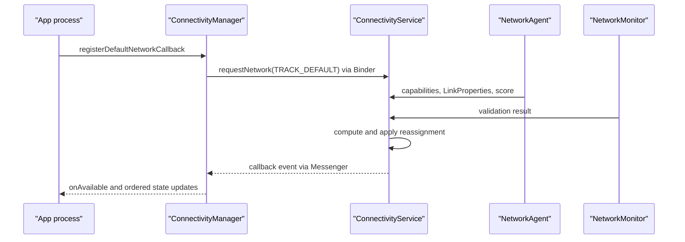

# 12.5 ConnectivityService 与网络状态监听性能

应用观察网络状态时，面对的是一组随时变化的系统快照。`NetworkCallback.onAvailable()` 只说明某条 `Network` 已满足系统请求条件，不证明业务域名能解析、TLS 能握手、服务器能返回成功响应。把回调当成业务探活，会在网络切换时制造重试风暴。

本章以 Android 17（API 37）和 AOSP `android-17.0.0_r1` 为锚点，说明应用该选择哪种监听接口、回调顺序能保证什么、注册为何有配额，以及 Android 17 本地网络权限和通信优先能力如何改变旧代码。

<!-- outline-start -->
## 本节导读

- 🔹 状态模型：区分 `Network`、`NetworkCapabilities`、`LinkProperties` 与业务可达性。
- 🔹 API 选择：区分一次性查询、默认网络监听、被动匹配、主动请求和后台约束。
- 🔹 回调时序：说明 `onAvailable()`、能力变化、链路变化、阻塞、丢失和不可用。
- 🔹 系统路径：从 `ConnectivityManager` 的 Binder 请求追到 `ConnectivityService` 的重匹配。
- 🔹 Android 17 边界：补充 `ACCESS_LOCAL_NETWORK` 与统一通信优先能力。
<!-- outline-end -->

## 平台网络状态不是一个布尔值

应用侧常用四类对象：

| 对象 | 表达内容 | 适合回答的问题 |
|:---|:---|:---|
| `ConnectivityManager` | 查询、监听、请求和绑定网络的入口 | 应用该观察哪类网络 |
| `Network` | 一条网络路径的稳定句柄 | 某次 DNS、Socket 或失败属于哪条路径 |
| `NetworkCapabilities` | 互联网、验证、计费、拥塞、传输类型等能力 | 当前策略该预取、延后还是降档 |
| `LinkProperties` | 接口、地址、DNS、路由、代理和 MTU | 网络切换后哪项链路配置发生变化 |

`NET_CAPABILITY_INTERNET` 表示网络被配置为可访问一般互联网。`NET_CAPABILITY_VALIDATED` 表示系统最近一次验证发现一般互联网连通。两者都不是业务探活结果：企业防火墙、指定域名 DNS、TLS、服务端鉴权和限流仍可能让请求失败。

能力组合比单一标志更有信息量：

| 能力 | 平台含义 | 应用侧用法 |
|:---|:---|:---|
| `VALIDATED` | 系统验证过一般互联网连通 | 控制自动重试和离线提示，但保留用户主动操作 |
| `CAPTIVE_PORTAL` / `PARTIAL_CONNECTIVITY` | 需要门户登录，或只能访问部分互联网 | 引导用户处理网络，暂停非紧急后台流量 |
| `NOT_METERED` / `TEMPORARILY_NOT_METERED` | 非计费，或当前临时非计费 | 决定大文件、高清媒体和批量同步 |
| `NOT_ROAMING` | 当前不处于漫游 | 参与流量成本策略 |
| `NOT_CONGESTED` / `NOT_SUSPENDED` | 网络当前未拥塞、未暂停 | 延后可推迟流量，避免密集重试 |
| `NOT_BANDWIDTH_CONSTRAINED` | 网络不受严格带宽约束 | 缺失时限制带宽和访问频率 |

`getLinkDownstreamBandwidthKbps()` 与 `getLinkUpstreamBandwidthKbps()` 只描述第一跳传输带宽估计，不是到业务服务器的实时吞吐。Wi‑Fi 或蜂窝也不等于免费、稳定或快速；计费和拥塞策略应读取能力，不应从 transport 名称推导。

## 先选对 ConnectivityManager 入口

| 入口 | 行为 | 适用场景 | 生命周期风险 |
|:---|:---|:---|:---|
| `activeNetwork` + `getNetworkCapabilities()` | 读取调用时刻的应用默认网络 | 页面进入、用户点击前的即时判断 | 快照会过期 |
| `registerDefaultNetworkCallback()` | 监听该应用的默认网络 | 进程级网络状态源 | 重复注册、忘记注销 |
| `registerNetworkCallback()` | 被动监听所有满足 `NetworkRequest` 的网络 | 多网络观察、特定能力监控 | 同时收到多条网络事件 |
| `registerBestMatchingNetworkCallback()` | 只跟踪满足请求的最佳网络 | API 31+ 的单一路径选择观察 | 仍需对称注销 |
| `requestNetwork()` | 查找最佳匹配；没有匹配时尝试拉起网络 | 专用网络、蜂窝能力、网络切片 | 会持有或拉起网络，需要 `CHANGE_NETWORK_STATE` |
| WorkManager / JobScheduler constraint | 到满足条件时由系统运行后台任务 | 延迟同步、日志补报、大文件下载 | 不适合前台即时反馈 |

查询与监听通常需要 `ACCESS_NETWORK_STATE`；主动 `requestNetwork()` 还需要 `CHANGE_NETWORK_STATE` 或相应的系统设置权限。构建请求时若加入受限能力，还可能有额外声明或特权要求。

`registerNetworkCallback()` 是监听，`requestNetwork()` 是主动请求。用短 timeout 反复调用 `requestNetwork()` 轮询网络，会让系统尝试建立所请求的网络；官方文档明确要求用监听接口完成存在性观察。带 timeout 的主动请求触发 `onUnavailable()` 后会自动释放。

API 36 的 `reserveNetwork()` 与 `NetworkCallback.onReserved()` 面向需要先预留能力、再由软硬件组件创建网络的专门流程。普通应用维护在线状态不需要它。

## NetworkCallback 的顺序与语义

### `onAvailable()` 后不要同步再查一遍

从 Android 8.0（API 26）起，`onAvailable(network)` 会紧接着收到同一网络的 `onCapabilitiesChanged()`、`onLinkPropertiesChanged()` 和 `onBlockedStatusChanged()`。官方 API 明确要求不要在回调中同步调用 `getNetworkCapabilities(network)` 或 `getLinkProperties(network)`：同步查询与事件队列之间存在竞态，结果可能已经过期或为 `null`。应直接消费后续回调参数。

几个回调处理不同的状态变化：

- `onAvailable()`：该网络成为当前请求的匹配网络；还不能把它标成业务接口可用。
- `onCapabilitiesChanged()`：验证、计费、拥塞、暂停、transport 等能力发生变化。
- `onLinkPropertiesChanged()`：DNS、路由、地址、代理或 MTU 变化。
- `onBlockedStatusChanged()`：系统策略允许或阻止应用访问该网络。
- `onLosing()`：系统预计网络即将失去；突然断网时可能完全不调用。
- `onLost()`：网络断开，或不再满足当前 callback/request。
- `onUnavailable()`：主动请求或网络预留无法满足；普通监听不会用它表示“当前没网”。

默认网络回调只跟踪应用当前最佳路径。Wi‑Fi 被更优网络替换后，旧 Wi‑Fi 可能仍连接，默认回调却会转到新 `Network`。普通 `registerNetworkCallback()` 则可能同时跟踪 Wi‑Fi、蜂窝和 VPN，状态容器必须以 `Network` 为 key，不能用一个全局布尔值覆盖所有事件。

### 配额属于整个 UID

Android 17 的公开 API 与 AOSP 源码一致：每个 UID 最多有 100 个 outstanding network requests。这个额度由 `registerDefaultNetworkCallback()`、`registerNetworkCallback()`、`requestNetwork()`、对应的 `PendingIntent` 变体和 `ConnectivityDiagnosticsManager` 回调共享。超过额度会抛出运行时异常。

`NetworkCallback` 同一时刻最多注册一次。停止使用时调用 `unregisterNetworkCallback()`；若它来自 `requestNetwork()`，注销还可能让系统关闭仅为该请求维持的网络。把 callback 放进每个 Fragment、每次重组或每个 repository 实例，都会扩大泄漏和配额耗尽风险。

## 一个进程级默认网络状态源

下面的 API 26+ 示例只维护应用默认网络的有序快照。它把 callback 放在专用 `HandlerThread`，`close()` 是终止操作，调用后不再重新 `start()`。

```kotlin
class AppNetworkMonitor(
    context: Context,
    private val publish: (Snapshot) -> Unit,
) : Closeable {

    data class Snapshot(
        val network: Network?,
        val capabilities: NetworkCapabilities?,
        val linkProperties: LinkProperties?,
        val blocked: Boolean,
    )

    private val cm = context.applicationContext
        .getSystemService(ConnectivityManager::class.java)
    private val thread = HandlerThread("app-network-callback").apply { start() }
    private val handler = Handler(thread.looper)

    @Volatile
    private var registered = false
    private var closed = false

    private var network: Network? = null
    private var capabilities: NetworkCapabilities? = null
    private var linkProperties: LinkProperties? = null
    private var blocked = false

    private fun emit() {
        publish(Snapshot(network, capabilities, linkProperties, blocked))
    }

    private val callback = object : ConnectivityManager.NetworkCallback() {
        override fun onAvailable(available: Network) {
            network = available
            capabilities = null
            linkProperties = null
            blocked = false
            emit()
        }

        override fun onCapabilitiesChanged(
            changed: Network,
            value: NetworkCapabilities,
        ) {
            if (changed != network) return
            capabilities = value
            emit()
        }

        override fun onLinkPropertiesChanged(
            changed: Network,
            value: LinkProperties,
        ) {
            if (changed != network) return
            linkProperties = value
            emit()
        }

        override fun onBlockedStatusChanged(changed: Network, value: Boolean) {
            if (changed != network) return
            blocked = value
            emit()
        }

        override fun onLost(lost: Network) {
            if (lost != network) return
            network = null
            capabilities = null
            linkProperties = null
            blocked = false
            emit()
        }
    }

    @Synchronized
    fun start() {
        check(!closed) { "monitor is closed" }
        if (registered) return
        cm.registerDefaultNetworkCallback(callback, handler)
        registered = true
    }

    @Synchronized
    override fun close() {
        if (closed) return
        if (registered) {
            cm.unregisterNetworkCallback(callback)
            registered = false
        }
        closed = true
        thread.quitSafely()
    }
}
```

`publish` 在专用线程执行；UI 层需要自行切换到主线程。`onAvailable()` 发布的第一份快照故意不带 capabilities 和 link properties，后续两个有序回调会补齐。业务层应把相同策略状态去重，避免一次网络建立触发多轮等价刷新。API 24–25 没有带 `Handler` 的默认回调重载，可使用无 `Handler` 版本，或在回调内立刻转发到自己的串行执行器。

## AOSP Android 17 的注册与分发路径

`ConnectivityManager.sendRequestForNetwork()` 会创建 `Messenger` 与 `Binder` token。`LISTEN` 类型走 `IConnectivityManager.listenForNetwork()`；主动请求、默认网络跟踪等其他类型走 `requestNetwork()`。成功后，framework 以 `NetworkRequest` 为 key 保存 callback 映射。

系统侧 `ConnectivityService.MAX_NETWORK_REQUESTS_PER_UID` 为 100。`NetworkAgent` 上报能力、链路和评分，`NetworkMonitor` 上报验证结果；这些变化可能触发网络与请求的重新匹配。`computeNetworkReassignment()` 收集当前 `NetworkAgentInfo`，遍历需要重评估的请求，并交给 `NetworkRanker` 选择匹配网络。源码给 `rematchNetworksAndRequests()` 留有“可能较慢，应优化”的 TODO。耗时随网络、请求和分层 request 数量增长，不能只用一个简化公式描述。

下面的时序图用于定位一次默认网络 callback 从应用注册到系统回调的边界。



图中的 `onAvailable` 代表系统选择结果，不代表 HTTP 请求已完成。NetworkAgent 注册、销毁和评分细节放在 12.8 处理，避免本章用易漂移的源码行号重复维护。

## 回调、后台执行与重试必须分层

面向 API 24 及以上的应用，manifest 中声明的 `CONNECTIVITY_ACTION` receiver 不会因网络变化被系统启动。运行时注册的 receiver 仅在注册它的进程和 `Context` 有效时接收事件。`NetworkCallback` 同样不是后台保活机制：进程存活时它提供实时状态，进程退出后应由 WorkManager、JobScheduler 或服务端推送处理延迟工作。

推荐的职责分配如下：

- `NetworkCallback`：产出有序的网络快照。
- 网络策略层：把能力映射为预取、媒体质量、并发和重试策略。
- HTTP 客户端：处理 DNS、连接池、TLS、协议和请求级错误。
- WorkManager / JobScheduler：等待网络、充电等约束后执行可延迟任务。
- 业务重试器：结合请求幂等性、异常、服务端限流和网络切换决定退避。

网络事件到达时，不要统一清空连接池、重建 HTTP 客户端或立即重放全部失败请求。现有连接是否还能使用应由网络库和具体异常决定；批量重试还要加入指数退避、随机抖动和队列上限。

## 从 NetworkCapabilities 生成业务策略

| 观测状态 | 合理动作 | 不应推导的结论 |
|:---|:---|:---|
| 缺少 `VALIDATED` | 暂停自动刷新；允许用户主动重试；检查门户或局部连通 | 所有业务域名必然失败 |
| 缺少 `NOT_METERED` | 降低预取、高清媒体和后台上传 | 当前一定是蜂窝网络 |
| 缺少 `NOT_CONGESTED` | 延后遥测、索引和非紧急同步 | 立即中断前台请求 |
| 缺少 `NOT_BANDWIDTH_CONSTRAINED` | 把吞吐与频率限制在平台带宽估计以内 | 仅降低图片清晰度便足够 |
| `onBlockedStatusChanged(..., true)` | 停止自动网络工作并记录系统策略阻塞 | 服务端宕机 |
| transport 发生变化 | 记录切换点，观察 DNS/TLS/连接复用 | 旧请求一定失败 |

Android 16（API 36）加入 `NET_CAPABILITY_NOT_BANDWIDTH_CONSTRAINED`。当它缺失时，官方 API 要求应用限制高带宽传输和访问频率；持续超出网络承受范围，系统可能阻止应用使用该网络。Android 17 应把这项能力纳入大文件、媒体和设备间传输策略。

## 多网络、VPN 与绑定网络

`registerDefaultNetworkCallback()` 观察的是应用默认网络，它可能是适用于该应用的 VPN，因此不必等于设备界面上显示的物理默认网络。`registerNetworkCallback()` 能看到多条匹配网络；日志与状态容器应保留 `Network` 身份，不能只记 Wi‑Fi/蜂窝。

需要固定路径的业务可通过 `Network.getSocketFactory()`、`Network.openConnection()` 或 network-specific DNS 建立连接。`bindProcessToNetwork()` 会影响进程后续创建的 Socket 和 DNS，影响面更大。企业专线、VPN、Wi‑Fi Direct 等有明确路由要求的场景才适合绑定；普通 API 请求应跟随应用默认网络。

网络切换失败归因至少关联这些信息：request ID、`Network`、capabilities 摘要、DNS 服务器与解析结果、目标 IP、TCP/QUIC 建连、TLS、HTTP 状态、callback 时间线和服务端日志。`onLost()` 与请求异常时间接近只能证明相关，无法单独证明因果。

## Android 17 的本地网络权限

Android 17 对 targetSdk 37 及以上应用强制执行 `ACCESS_LOCAL_NETWORK` 运行时权限。限制位于网络栈深处，覆盖 TCP、UDP 单播、组播、广播、mDNS/SSDP、NsdManager 以及建立在 Socket 上的 OkHttp、Cronet 和 WebView。权限被拒绝或撤回时，应用仍可能有可用的 Wi‑Fi `Network`，但到 LAN 地址的流量会被阻止。

有两条迁移路径：

- 媒体投放或单设备发现优先使用系统中介的 picker；`NsdManager` 的 picker 返回的设备地址可以在没有广泛 LAN 权限时连接。
- 家庭自动化、IoT 管理等需要持续扫描和访问多个设备的功能，声明并在运行时请求 `ACCESS_LOCAL_NETWORK`，同时处理拒绝与撤回。

`NET_CAPABILITY_LOCAL_NETWORK` 与这项权限不是同一概念。该 capability 描述设备自己提供地址的本地网络，例如热点、Thread Border Router 或 Wi‑Fi P2P Group Owner；用于互联网接入的普通 Wi‑Fi 不会因此变成 `LOCAL_NETWORK`。权限则控制应用访问本地地址范围。

## Android 17 的优先通信能力与 5G slicing

API 33 提供 `NET_CAPABILITY_PRIORITIZE_LATENCY` 和 `NET_CAPABILITY_PRIORITIZE_BANDWIDTH`。targetSdk 34 及以上应用通过 `requestNetwork()` 请求这些自认证能力前，要在 manifest property 对应的 XML 中声明。网络能否满足请求仍取决于设备、运营商、套餐、区域和策略；请求失败时不会自动回到默认网络，应用要自行处理。

Android 17 / API 37 又加入 `NET_CAPABILITY_PRIORITIZE_UNIFIED_COMMUNICATIONS`，范围限定为 OTT 语音与视频通话。系统可以在检测到合格通话时代表应用请求，也允许 OTT 应用通过 `requestNetwork(NetworkRequest, PendingIntent)` 请求。它是网络可能提供高优先级、低延迟数据路径的提示，不保证任意一次通话都会使用专用 slice。

列表刷新、图片加载和日志上传不应申请通信优先能力。音视频通话采用它时，也要保留默认网络路径、请求超时、callback 注销和通话结束释放逻辑。

## 诊断清单

出现网络状态抖动、后台耗电或配额异常时，按下列顺序核对：

1. callback 是否由进程级组件统一注册，注册和注销是否一一对应；
2. 使用的是被动监听还是可能拉起网络的 `requestNetwork()`；
3. 回调线程是否执行 DNS、磁盘 I/O、HTTP 请求或大批量序列化；
4. 状态容器是否按 `Network` 区分多条路径，并消费有序的 capability/link 回调；
5. `VALIDATED`、`PARTIAL_CONNECTIVITY`、blocked、metered、constrained 是否被压成一个布尔值；
6. WorkManager 约束与 callback 是否重复触发同一批任务；
7. targetSdk 37 后的 LAN 失败是否来自 `ACCESS_LOCAL_NETWORK`；
8. `requestNetwork()` 与 diagnostics callback 总量是否接近每 UID 100 的共享配额。

调试设备可用 `adb shell dumpsys connectivity` 查看当前网络、requests 和默认网络选择；应用侧用 trace slice 标出 callback 与重试器事件，再与 OkHttp `EventListener`、Cronet NetLog 和服务端日志对齐。日志不要保存完整 IP 拓扑、Wi‑Fi 标识或鉴权数据。

## 与其他章节的关系

- **12.2**：HTTP 请求分段与性能观测。
- **12.3**：DNS、Socket、连接池和协议层诊断。
- **12.4**：TLS、ECH、CT 与加密 DNS。
- **12.6**：netd、DnsResolver 与系统网络诊断。
- **12.8**：NetworkAgent 生命周期、网络评分与重匹配。

## 参考资料

- [Read network state](https://developer.android.com/develop/connectivity/network-ops/reading-network-state)：默认网络、普通 callback 和回调时序。
- [`ConnectivityManager`](https://developer.android.com/reference/android/net/ConnectivityManager) 与 [`NetworkCallback`](https://developer.android.com/reference/android/net/ConnectivityManager.NetworkCallback)：API 语义、权限、配额和生命周期。
- [`NetworkCapabilities`](https://developer.android.com/reference/android/net/NetworkCapabilities)：验证、计费、带宽约束、本地网络和 API 37 通信优先能力。
- [Android 17 local network permission](https://developer.android.com/privacy-and-security/local-network-permission)：LAN 流量限制、权限迁移和系统 picker。
- [Use network slicing](https://developer.android.com/develop/connectivity/5g/use-network-slicing)：自认证能力声明、主动请求和失败回退。
- [Background optimization](https://developer.android.com/topic/performance/background-optimization)：`CONNECTIVITY_ACTION` 与后台执行边界。
- [AOSP `ConnectivityManager.java`](https://android.googlesource.com/platform/packages/modules/Connectivity/+/android-17.0.0_r1/framework/src/android/net/ConnectivityManager.java)：callback 映射、`listenForNetwork()` 与 `requestNetwork()`。
- [AOSP `NetworkCapabilities.java`](https://android.googlesource.com/platform/packages/modules/Connectivity/+/android-17.0.0_r1/framework/src/android/net/NetworkCapabilities.java)：Android 17 capability 定义。
- [AOSP `ConnectivityService.java`](https://android.googlesource.com/platform/packages/modules/Connectivity/+/android-17.0.0_r1/service/src/com/android/server/ConnectivityService.java)：每 UID 配额、NetworkAgent 注册、评分更新和网络重匹配。
