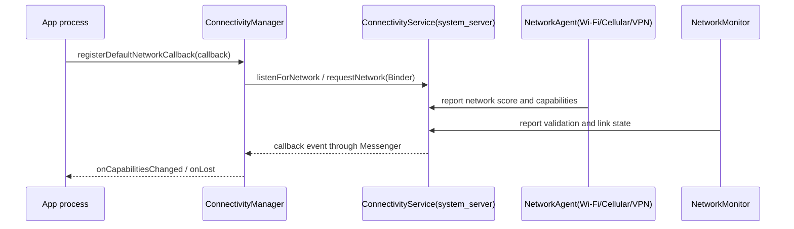

---

title: "ConnectivityService 与网络状态监听性能"
chapter: "12.5"
section: "12.5"
status: "finalized"
drafted_date: "2026-05-17"
applicable_versions: "Android 7.0 (API 24) - Android 16 (API 36)"
last_verified: "2026-06-09"
last_verified_against: "AOSP android-16.0.0_r1 / developer.android.com; Android 17 tag not public on android.googlesource at audit time"
confidence: high
tags: [connectivity, network-callback, network-performance, power, android-16]
related_chapters: ["12.2", "12.3", "12.4", "24.4", "25.2"]
created_by: "task2a-knowledge-gap"
created_date: "2026-05-17"
gap_source: "官方文档+AOSP结构+每日信息"
gap_score: 15
sources:
  - type: official
    path: "https://developer.android.com/develop/connectivity/network-ops/reading-network-state"
  - type: official
    path: "https://developer.android.com/topic/performance/power/network/action-app-traffic.html"
  - type: official
    path: "https://developer.android.com/topic/performance/background-optimization"
  - type: official
    path: "https://developer.android.com/develop/connectivity/5g/use-network-slicing"
  - type: aosp
    path: "packages/modules/Connectivity/service/src/com/android/server/ConnectivityService.java"
  - type: aosp
    path: "packages/modules/Connectivity/framework/src/android/net/ConnectivityManager.java"
  - type: aosp
    path: "packages/modules/Connectivity/framework/src/android/net/NetworkCapabilities.java"
reviewed_date: "2026-05-17"
reviewed_by: openclaw-task6
task6_state: "reviewed"  # updated by task2b-verifier 2026-06-09
task6_result: pass-light-edit
task9_state: "reviewed"
task2b_state: "fixed"
pipeline_stage: "ready-to-publish"
review_type: task6-writing-quality-review
last_task6_at: "2026-05-17T12:11:00+08:00"
last_task6_audit: "2026-06-08"
task6_review_notes: "2026-05-17 Task6 12: L1/L2 小修 3 处（补 section 元数据、弱化口语化表述 2 处）；无回炉项，待 Task9 技术审查。"
task9_reviewed_date: "2026-05-17"
task9_reviewed_by: "openclaw-task9"
last_task9_at: "2026-06-09T00:20:00+08:00"
deepseek_polish_state: done
last_deepseek_polish_at: 2026-05-27
last_task9_review_log: "logs/deep-review/2026-06-09-00-audit.md"
last_task9_audit: "2026-06-09"
last_task9_audit_log: "logs/deep-review/2026-06-09-00-audit.md"
last_task9_autofix_at: "2026-06-09"
task9_result: "auto-fixed"
task9_review_notes: "2026-06-09 Task9 闲时抽检：auto-fixed。将 ConnectivityManager / ConnectivityService / NetworkCapabilities 的源码锚点从 AOSP main 收敛到已复核的 android-16.0.0_r1；Android 17 tag 当前未在 android.googlesource 公开，适用范围暂回退到 Android 16。P0 0 / P1 1（已修）/ P2 0。"---

# 12.5 ConnectivityService 与网络状态监听性能

网络状态监听看起来只是一个 `NetworkCallback`，放到性能问题里涉及三类成本：系统侧要维护请求和回调，应用侧要避免重复注册与后台唤醒，网络请求侧要把“网络可用”转成可执行的降级策略。12.2、12.3、12.4 已经讲请求耗时、连接池和 TLS，本节补平台连接状态这一层；连接池、HTTPDNS 和 TLS 细节只做交叉引用，不重复展开。

[已验证: 官方文档, developer.android.com/develop/connectivity/network-ops/reading-network-state] 官方建议用 `ConnectivityManager` 与 `NetworkCallback` 监听网络状态变化，而不是靠高频轮询。`NetworkCapabilities` 的 AOSP 注释也提醒，一次性读取到的能力可能很快过期，生产代码应通过回调持续接收变化。[已验证: AOSP android-16.0.0_r1, packages/modules/Connectivity/framework/src/android/net/NetworkCapabilities.java]

## 平台网络状态模型

应用侧看到的网络状态由四个对象组成：`ConnectivityManager` 是入口，`Network` 是一条网络路径的句柄，`NetworkCapabilities` 描述这条路径的能力，`LinkProperties` 描述 DNS、接口名、路由等连接参数。弱网判断不要只看“有没有网络”，因为 `NET_CAPABILITY_INTERNET` 只表示这条网络声明可达互联网，`NET_CAPABILITY_VALIDATED` 才表示系统探测过公共互联网可达；Captive Portal、DNS 失效或局域网直连会把这两类状态拉开。[已验证: 官方文档, developer.android.com/develop/connectivity/network-ops/reading-network-state]

这几个对象回答的问题不同：

| 对象 | 回答的问题 | 性能治理里的用法 |
|------|------------|------------------|
| `Network` | 当前请求走哪条网络路径 | 在多网络并存、VPN、专用网络里区分故障来源 |
| `NetworkCapabilities` | 是否有互联网、是否已验证、是否计费、是否拥塞、传输类型是什么 | 决定预取、同步频率、图片清晰度、日志批量上报策略 |
| `LinkProperties` | DNS、接口、路由、MTU 等连接参数 | 排查 DNS 解析失败、VPN 路由异常、网络切换后的连接复用问题 |
| `ConnectivityManager` | 注册回调、一次性查询、请求特定网络能力 | 把平台状态接入应用网络调度层 |

一个常见误判是把 `onAvailable()` 当成“业务接口可用”。`onAvailable()` 只说明某条网络满足请求条件，业务接口还会受 DNS、TLS、连接池、服务端限流和运营商策略影响。请求耗时分析见 12.2，连接池与 TLS 复用见 12.3、12.4。

## 监听方式选择：回调、查询与后台任务

`ConnectivityManager` 给了三类入口，适用的性能含义不同。一次性查询适合当前页面做即时判断；默认网络回调适合维护应用级网络状态；带 `NetworkRequest` 的回调用于监听某类网络能力。后台下载、周期同步这类延迟任务不应该常驻回调后自己调度，交给 `WorkManager` 或 `JobScheduler` 的网络约束更省进程和电量。[已验证: 官方文档, developer.android.com/develop/connectivity/network-ops/reading-network-state]

| 入口 | 适用任务 | 主要风险 |
|------|----------|----------|
| `getActiveNetwork()` + `getNetworkCapabilities()` | 页面打开时判断当前网络是否适合立即发起请求 | 结果会过期，不能缓存很久 |
| `registerDefaultNetworkCallback()` | 跟踪应用默认网络变化，维护内存态网络画像 | 重复注册会占用系统请求名额，回调里做重活会阻塞回调线程 |
| `registerNetworkCallback(NetworkRequest, callback)` | 监听满足特定能力的网络，例如未计费网络、蜂窝网络、低延迟能力 | 过宽的请求会收到多条网络事件，过窄的请求会漏掉可用路径 |
| `WorkManager` 网络约束 | 延迟下载、日志补报、离线队列同步 | 不适合要求秒级响应的前台交互 |

平台 API 本身也把成本边界写得很清楚。`ConnectivityManager` 文档说明，`registerDefaultNetworkCallback()`、`registerNetworkCallback()`、`requestNetwork()` 与 `ConnectivityDiagnosticsManager` 回调共享每 UID 100 个 outstanding request 限额，超过后抛异常；AOSP 的 `ConnectivityService.MAX_NETWORK_REQUESTS_PER_UID` 同样是 100。[已验证: AOSP android-16.0.0_r1, packages/modules/Connectivity/framework/src/android/net/ConnectivityManager.java; packages/modules/Connectivity/service/src/com/android/server/ConnectivityService.java]

## NetworkCallback 的注册成本与生命周期

`NetworkCallback` 的成本不在回调对象本身，而在“注册一次”会穿过 Binder 进入系统服务，系统要保存 `NetworkRequest`、`Messenger`、`Binder` 和回调映射，再把网络变化分发回应用进程。AOSP 中 `ConnectivityManager.sendRequestForNetwork()` 会把 `NetworkCallback` 包进 `Messenger`，`LISTEN` 类型调用 `mService.listenForNetwork()`，其他请求调用 `mService.requestNetwork()`；`unregisterNetworkCallback()` 会释放对应 `NetworkRequest` 并从 `sCallbacks` 移除映射。[已验证: AOSP android-16.0.0_r1, packages/modules/Connectivity/framework/src/android/net/ConnectivityManager.java]

回调生命周期按“应用级单例 + 显式注销”管理，页面不要各自注册一份。回调里只更新内存态状态或发轻量事件，DNS 重刷、连接池清理、接口重试放到单独的调度层。默认回调运行在内部 Handler 上；如果回调要做更多工作，使用带 `Handler` 的重载，把执行线程交给应用控制。[已验证: 官方文档, developer.android.com/develop/connectivity/network-ops/reading-network-state]

这段代码展示一种应用级网络状态监听写法，重点是单例注册、专用线程和对称注销：

```kotlin
class NetworkStateMonitor(
    context: Context,
    private val onStateChanged: (NetworkCapabilities?) -> Unit,
) {
    private val appContext = context.applicationContext
    private val connectivityManager =
        appContext.getSystemService(ConnectivityManager::class.java)

    private val callbackThread = HandlerThread("network-state-callback").apply { start() }
    private val callbackHandler = Handler(callbackThread.looper)

    @Volatile
    private var registered = false

    private val callback = object : ConnectivityManager.NetworkCallback() {
        override fun onCapabilitiesChanged(
            network: Network,
            networkCapabilities: NetworkCapabilities,
        ) {
            onStateChanged(networkCapabilities)
        }

        override fun onLost(network: Network) {
            onStateChanged(null)
        }
    }

    fun start() {
        if (registered) return
        connectivityManager.registerDefaultNetworkCallback(callback, callbackHandler)
        registered = true
    }

    fun stop() {
        if (!registered) return
        connectivityManager.unregisterNetworkCallback(callback)
        registered = false
        callbackThread.quitSafely()
    }
}
```

这段代码只维护状态，不在回调中直接发起网络请求。线上实现还要处理进程级生命周期：如果 `stop()` 后可能再次 `start()`，线程要延后到进程退出再关闭，或在重新注册前创建新的 `HandlerThread`。

## CONNECTIVITY_ACTION 限制与后台进程唤醒

Android 7.0 开始，面向 API 24 及以上的应用如果在 manifest 里声明 `CONNECTIVITY_ACTION` receiver，系统不会因为网络变化把进程拉起来；运行时通过 `Context.registerReceiver()` 注册的 receiver 仍可在上下文有效期间收到广播。[已验证: 官方文档, developer.android.com/topic/performance/background-optimization]

这条限制直接改变了老架构里的“网络一变就启动进程补任务”模型。网络变化是高频事件，Wi-Fi 与蜂窝切换、VPN 重连、Captive Portal 校验都会触发状态变化；如果每个应用都靠隐式广播唤醒进程，系统会在同一时刻启动大量后台进程，带来 CPU、I/O 和电量开销。新的写法是：前台体验依赖 `NetworkCallback` 维护实时状态，后台补偿任务依赖 `WorkManager` 的网络约束，服务端推送优先用 FCM，避免应用自己轮询服务器。

这也解释了为什么网络状态监听不该和业务重试绑死。回调只告诉网络画像变化，业务层要按请求类型决定：前台请求可以立即重试一次，日志上报可以进入批量队列，大文件下载应等未计费网络或充电条件，非紧急同步交给后台任务调度。

## 网络计量、漫游与请求降级策略

`NET_CAPABILITY_NOT_METERED` 表示用户通常不按流量计费或不敏感，官方与 AOSP 都建议应用根据它控制大流量行为；`hasTransport(TRANSPORT_WIFI)`、`hasTransport(TRANSPORT_CELLULAR)` 只能说明传输类型，不能等价于“便宜”或“稳定”。热点、企业无线局域网、漫游蜂窝、临时不限量套餐都会让传输类型和计费状态不一致。[已验证: AOSP android-16.0.0_r1, packages/modules/Connectivity/framework/src/android/net/NetworkCapabilities.java]

应用网络调度层可以把平台能力转成策略表：

| 状态 | 请求策略 | 典型动作 |
|------|----------|----------|
| `VALIDATED` 缺失 | 暂停非紧急请求，保留用户主动刷新入口 | 显示网络不可用或登录门户提示，避免队列反复重试 |
| 缺少 `NOT_METERED` | 降低预取和自动播放强度 | 图片降档、视频预加载窗口缩小、日志批量上报延后 |
| 蜂窝且带宽估计较低 | 控制并发连接与请求体大小 | 分页缩小、上传压缩、重试退避时间拉长 |
| 网络从无线局域网切到蜂窝 | 保护正在进行的大文件任务 | 暂停后台下载，前台请求按用户动作继续 |
| VPN 存在 | 排查路径要把应用流量和系统默认网络分开 | 记录 `Network` 与 DNS 结果，避免把 VPN 路由问题归因到服务端 |

策略表最好只影响“何时发、发多大、是否降级”，不要在这里直接替换 DNS、清空连接池或重建 HTTP 客户端。HTTPDNS 与连接池策略见 24.4；后台功耗治理见 25.2。

## ConnectivityService 的系统侧分发路径

应用调用 `registerDefaultNetworkCallback()` 后，路径大致是：应用进程的 `ConnectivityManager` 通过 Binder 调到 `ConnectivityService`，系统服务保存请求和回调通道；Wi-Fi、蜂窝、VPN 等网络由各自的 `NetworkAgent` 上报状态；`NetworkMonitor` 做验证探测并更新 `VALIDATED` 等能力；`ConnectivityService` 选择默认网络并向匹配的 `NetworkCallback` 分发 `onAvailable()`、`onCapabilitiesChanged()`、`onLinkPropertiesChanged()`、`onLost()` 等事件。[已验证: AOSP android-16.0.0_r1, packages/modules/Connectivity/service/src/com/android/server/ConnectivityService.java]



排查性能问题时，重点看五类信号：应用是否重复注册、系统是否存在大量 outstanding request、回调是否在主线程做重活、`VALIDATED` 是否频繁抖动、VPN 或多网络是否改变了默认路径。更底层的 TCP、TLS、HTTP/2 多路复用和连接池复用，回到 12.2、12.3、12.4 分析。

## 5G Network Slicing 的适用边界

Network Slicing 适合低延迟、专用带宽这类明确网络质量诉求，不适合当作通用“提速开关”。官方文档要求应用在资源里声明要使用的 premium capability，例如 `NET_CAPABILITY_PRIORITIZE_LATENCY`，再通过 `requestNetwork()` 请求满足能力的网络；Android 14 文档标注当时支持的 premium capability 是 `NET_CAPABILITY_PRIORITIZE_LATENCY`。[已验证: 官方文档, developer.android.com/develop/connectivity/5g/use-network-slicing]

这个能力的可用性由运营商、套餐、设备、系统版本和企业策略共同决定。应用设计上要把它当成可选能力：请求成功时把低延迟业务绑定到返回的 `Network`，请求失败时回退到默认网络；不要把业务可用性建立在 slicing 一定存在的假设上。对于直播连麦、云游戏、工业控制这类场景，它的价值在于申请更匹配的网络能力；对于普通列表刷新、图片加载、日志上报，它通常不值得增加接入复杂度。

## 与 HTTPDNS、连接池和后台任务的关系

网络状态监听只回答“系统现在认为哪条网络路径可用、具备哪些能力”。它不替代 HTTPDNS，不负责选择服务端 IP；不替代 OkHttp 连接池，不负责复用 socket；不替代 WorkManager，不负责在后台找合适时机执行任务。

建议的分工：

- `NetworkCallback`：维护网络画像，输出计费、验证、传输类型、VPN、多网络等状态。
- HTTPDNS / `Dns`：在业务域名层做解析策略，处理运营商 DNS 污染、跨地域调度和兜底解析。
- OkHttp 连接池：控制连接复用、空闲连接淘汰、HTTP/2 多路复用和 TLS 会话复用。
- WorkManager / JobScheduler：承接延迟任务，按网络、充电、电量、后台限制来安排执行窗口。
- 业务重试器：把错误码、异常类型、网络画像和服务端限流合在一起，决定是否立即重试、退避重试或降级展示。

这种拆分能避免把所有弱网策略压到一个回调里。`NetworkCallback` 只做状态输入，策略由网络调度层统一消费，连接层和任务调度层各自处理自己的成本边界。

## 扩展：多网络并存与 VPN 场景

同一时刻可能存在无线局域网、蜂窝、VPN、企业专用网络和本地网络。应用默认网络不一定等于系统默认网络，VPN 也可能让应用流量走一条和系统探测不同的路径。遇到“用户说有网但接口失败”的问题，日志里至少记录 `Network`、`NetworkCapabilities` 摘要、DNS 结果、连接目标 IP、是否 VPN、请求开始时和失败时的网络状态。

如果业务要绑定某条 `Network` 发请求，要把生命周期写清楚：`Network` 丢失后旧 socket 可能继续失败，连接池也可能保留旧路径上的连接。绑定网络是高级用法，适合企业 VPN、专线、低延迟网络这类有明确路径诉求的业务，不适合普通请求随手绑定。

## 扩展：网络切换期间的请求失败归因

无线局域网切蜂窝、VPN 重连、Captive Portal、DNS 缓存失效和服务端超时经常混在同一个时间窗口里。排查时不要只看 `onLost()` 和接口失败的时间接近就下结论，应把 OkHttp `EventListener`、应用网络画像、服务端访问日志放在同一条时间线上：DNS 是否重新解析、TLS 是否重新握手、连接池是否命中旧连接、失败请求是否跨越网络切换点。

可执行的记录字段包括：请求 ID、开始时间、结束时间、异常类型、`Network` 标识、是否 `VALIDATED`、是否 `NOT_METERED`、传输类型、DNS 耗时、TCP 连接耗时、TLS 握手耗时、HTTP 状态码。字段足够细，弱网问题才不会被简单归到“用户网络不好”。

## 小结

ConnectivityService 和 `NetworkCallback` 的性能价值在于提供平台级网络画像，让应用把预取、同步、降级、重试和后台任务调度建立在同一份状态上。注册回调要少而稳，后台任务交给系统调度，计费与验证状态要参与请求策略，连接池和 HTTPDNS 仍由网络栈独立处理。这样的网络层既能减少无效唤醒，也能让弱网归因更接近真实故障位置。
