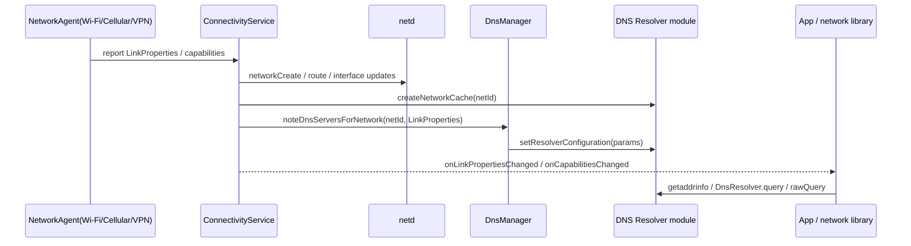

# 12.6 netd 与 DnsResolver：DNS 解析性能和故障诊断

<!-- outline-start -->
## 要点

### 🔹 DNS 解析在 Android 网络请求里的位置
明确应用 `DnsResolver` / OkHttp `Dns.lookup()`、系统 DNS Resolver 模块、`netd`、网络接口和缓存之间的边界，避免把 DNS、TCP 建连和服务端耗时混在一起判断。

### 🔹 DNS Resolver 模块化后的能力边界
梳理 Android 10 之后 DNS Resolver 主线模块的更新方式、私有 DNS、解析缓存和安全防护范围，标出应用能观测到和不能直接控制的部分。

### 🔹 netd 与 ConnectivityService 的调用关系
从 `ConnectivityService`、`NetworkManagementService`、`NetdService` 到 `packages/modules/Connectivity/netd/` 建立最小调用图，说明网络切换、DNS 配置和链路属性变更如何传到应用侧。

### 🔹 DNS 延迟、失败和网络切换的诊断路径
围绕 `LinkProperties`、DNS server 列表、`NetworkCapabilities`、HTTPDNS fallback、抓包和日志建立排查顺序，区分解析失败、缓存污染、运营商劫持和网络切换后的连接复用问题。

### 🔹 应用层 DNS 优化的边界
把系统 DNS、HTTPDNS、OkHttp `Dns`、异步预取、TTL 缓存、失败隔离和 bootstrap client 放到同一张选型表里，说明哪些优化能降低尾延迟，哪些会引入一致性和可用性风险。

### 🔹 可观测指标与线上告警设计
定义 DNS P50/P90/P99、解析失败率、fallback 命中率、网络切换后的首包失败率、按运营商/地区分桶等指标，避免只用总体网络错误率定位 DNS 问题。

## 扩展

### 🔸 私有 DNS、DoT/DoH 与企业网络兼容性
补充私有 DNS、VPN、企业代理和 Captive Portal 场景下的排查边界。

### 🔸 Tethering offload 与 netd 侧数据面
如素材充分，补充 tethering hardware offload 与普通 App 网络请求诊断的边界。

<!-- outline-end -->

DNS 解析是网络请求最前面的等待段，但它经常被混进“接口慢”“连接慢”“服务端慢”里一起看。12.2、12.3 已经展开请求耗时、连接池、TLS 和协议选择，12.5 讲平台网络状态；本节补系统 DNS Resolver、`netd` 和应用层 DNS 策略之间的边界。读完这一节，排查“域名解析慢/失败/切网后首包失败”时，应该能把问题放到正确层级，而不是直接把故障归到 HTTPDNS 或服务端。

## DNS 解析在 Android 网络请求里的位置

应用侧常见入口有三条：Java/Kotlin 网络库经由 `InetAddress.getAllByName()` 或 OkHttp `Dns.SYSTEM` 走系统解析，API 29 之后可直接使用 `android.net.DnsResolver` 发起异步 DNS 查询，Native 代码可通过 NDK `android_getaddrinfofornetwork()` 在指定 `Network` 上解析域名。[已验证: 官方文档, developer.android.com/reference/android/net/DnsResolver] [已验证: 官方文档, developer.android.com/ndk/reference/group/networking]

这些入口最终都要回答同一个问题：在某条 `Network` 上，用这条网络的 DNS server，把 hostname 解析成可连接的 IP 列表。`Network` 为空时通常走默认网络；绑定到特定 `Network` 时，解析也应跟随该网络的 DNS 配置。这样才能避免 Wi-Fi、蜂窝、VPN、多网络并存时“连接走 A 网络，DNS 却按 B 网络判断”的错位。

| 层级 | 典型入口 | 它掌握的信息 | 应用能观测什么 |
|------|----------|--------------|----------------|
| 应用网络库 | OkHttp `Dns.lookup()`、`InetAddress.getAllByName()` | 域名、请求时机、连接池状态 | `dnsStart/dnsEnd`、异常类型、返回 IP 数量 |
| Android API | `DnsResolver.query()`、NDK `android_getaddrinfofornetwork()` | `Network`、DNS 记录类型、取消信号 | 异步回调、rcode、`DnsException` |
| 平台状态 | `ConnectivityManager`、`LinkProperties`、`NetworkCapabilities` | DNS server、路由、接口名、网络能力 | `onLinkPropertiesChanged()`、`VALIDATED`、VPN/计费状态 |
| 系统服务 | `ConnectivityService`、`DnsManager`、DNS Resolver 模块 | 每个 netId 的解析配置、私有 DNS 状态、缓存 | 普通应用不能直接读取内部状态，只能通过公开 API 间接判断 |

`DnsResolver` 的 AOSP 实现也体现了这层边界：`query(Network, domain, flags, Executor, CancellationSignal, Callback)` 接收 `Network` 与 `Executor`，异步返回 `InetAddress` 列表；`rawQuery()` 适合发指定类型的 DNS 查询。源码里会根据传入网络或当前 DNS 网络决定查询目标，再分别判断 IPv4/IPv6 可用性。[已验证: AOSP main, packages/modules/Connectivity/framework/src/android/net/DnsResolver.java]

这和 OkHttp `Dns.lookup()` 的工程约束不同。OkHttp `Dns` 是同步接口，返回前请求不能进入 TCP connect；如果在 `lookup()` 内实时请求 HTTPDNS 服务，会把 HTTPDNS 服务的网络耗时塞进业务请求建连路径。HTTPDNS 接入边界见 24.10，本节只把它作为系统 DNS 诊断里的对照项。[来源: DeepResearch/2026-05-15-okhttp-dns-lookup-sync-httpdns-async-prefetch.md]

## DNS Resolver 模块化后的能力边界

Android 9 及更早版本里，DNS resolver 代码分散在 Bionic 和 `netd`；Android 10 把 resolver 代码移到 `system/netd/resolv`，并以 `com.android.resolv` APEX 模块交付。官方文档说明，DNS Resolver 模块提供 DNS 拦截防护、配置更新攻击防护和解析性能改进；它包含 DNS stub resolver，把域名解析成 IP 地址。[已验证: 官方文档, source.android.com/docs/core/ota/modular-system/dns-resolver]

模块化之后有两个边界变化容易被忽略：`netd` 仍参与网络创建、权限、路由、接口等 native 网络管理，但 resolver 配置的 Binder 端点已从 `netd` 移到 resolver；resolver 模块服务本地 `/dev/socket/dnsproxyd`，并由系统服务直接配置。对应用来说，这不是“DNS 完全交给 App 控制”，而是系统 DNS 更独立地更新和防护。

应用能依赖的公开信息主要有三类：

- `LinkProperties.getDnsServers()`：当前网络公开给应用的 DNS server 列表，适合排查 DNS server 是否随网络切换更新。[已验证: 官方文档, developer.android.com/develop/connectivity/network-ops/reading-network-state]
- `LinkProperties` 的私有 DNS 状态：系统在 private DNS 可用时会把使用状态和已验证服务器写回 `LinkProperties`，应用可通过公开对象间接观察。
- `DnsResolver` / 网络库回调：记录查询耗时、rcode、异常、返回地址族和后续 connect 结果。

应用不能直接控制系统 DNS Resolver 的全局缓存、每个 netId 的 resolver 参数或私有 DNS 校验流程。要改业务域名解析策略，应在应用网络栈内做 HTTPDNS、DoH 或自定义 OkHttp `Dns`；要改设备 DNS 配置，通常落到 VPN、企业 DPC、系统权限或用户设置，不属于普通应用性能优化手段。

## netd 与 ConnectivityService 的最小调用图

`ConnectivityService` 是应用可见网络状态和 native 网络配置之间的调度层。AOSP main 中，`ConnectivityService` 通过 `DnsResolverServiceManager` 拿到 `IDnsResolver`，持有 `DnsManager`；创建 native network 时调用 `mNetd.networkCreate(config)`，随后为该 netId 调用 `mDnsResolver.createNetworkCache()`；网络销毁时调用 `mNetd.networkDestroy()` 与 `mDnsResolver.destroyNetworkCache()`。[已验证: AOSP main, packages/modules/Connectivity/service/src/com/android/server/ConnectivityService.java]

`LinkProperties` 变化时，路径会继续往 DNS 配置传播。`handleUpdateLinkProperties()` 进入 `updateLinkProperties()`，其中会调用 `updateDnses(newLp, oldLp, netId)`；如果 DNS server 列表变化，`DnsManager.noteDnsServersForNetwork(netId, newLp)` 会保存这份 `LinkProperties`，再构造 `ResolverParamsParcel` 调 `mDnsResolver.setResolverConfiguration(paramsParcel)`。同一处还会发 `ACTION_CLEAR_DNS_CACHE`，让 VM 丢弃 DNS 缓存。[已验证: AOSP main, packages/modules/Connectivity/service/src/com/android/server/connectivity/DnsManager.java]

这张图给排查带来一个可操作的判断：网络切换后 DNS server 没变，优先看 `LinkProperties` 是否更新；`LinkProperties` 已变但解析仍走旧结果，优先看应用侧缓存、OkHttp 连接池、HTTPDNS 缓存和 VM DNS 缓存；系统解析事件异常，再进入 `dumpsys connectivity`、NetworkDiagnostics 和平台日志。

## DNS 延迟、失败和网络切换的诊断路径

DNS 问题要按时间线拆。一次请求至少记录四段：DNS 查询、TCP connect、TLS 握手、首字节。只有 DNS 段异常，才进入 DNS 专项排查；如果 DNS 很快但 connect 或 TLS 慢，回到 12.3、12.4；如果首字节慢，优先看服务端、CDN 和回源。

推荐的排查顺序如下：

1. 以请求 ID 串起客户端 `dnsStart/dnsEnd`、connect、TLS、HTTP 状态码和异常类型。
2. 在请求开始和失败时记录 `Network`、`NetworkCapabilities`、`LinkProperties.getDnsServers()`、是否 VPN、是否 `VALIDATED`。
3. 对照网络切换事件：`onAvailable()`、`onLinkPropertiesChanged()`、`onLost()` 是否落在同一时间窗。
4. 如果用了 HTTPDNS，记录缓存命中、TTL、返回 IP、fallback 是否发生、失败 IP 是否隔离。
5. 系统侧复核 `dumpsys connectivity` 中的 DNS、Private DNS、NetworkDiagnostics 输出；需要包级证据时再抓包或采集平台日志。

| 现象 | 优先检查 | 不要直接下的结论 |
|------|----------|------------------|
| `UnknownHostException` 突增 | DNS rcode、DNS server 列表、HTTPDNS fallback、Private DNS 状态 | 服务端挂了 |
| DNS P99 拉高 | 是否首次解析、缓存是否失效、网络是否切换、DNS server 是否跨地区 | HTTPDNS 一定能解决 |
| 切 Wi-Fi 后首个请求失败 | 连接池是否复用旧网络 socket、DNS 缓存是否按旧网络保留 | Wi-Fi 不可用 |
| VPN 下解析结果异常 | `Network` 绑定、VPN DNS、企业代理、分流策略 | 运营商 DNS 污染 |
| `VALIDATED` 丢失但 DNS 可解析 | Captive Portal、私有 DNS 校验、路由可达性 | 解析成功就等于网络可用 |

AOSP 的 `NetworkDiagnostics` 也体现了这套思路：它拿到 `Network`、`LinkProperties` 和 Private DNS 配置后，会对网关、DNS server、测试 DNS 地址发 ICMP、DNS 和 DNS-over-TLS 探测，并把 socket 绑定到指定 `Network`。这说明系统诊断不是只问“域名能不能解析”，而是同时看路由、DNS server、私有 DNS 和网络绑定。[已验证: AOSP main, packages/modules/Connectivity/service/src/com/android/server/connectivity/NetworkDiagnostics.java]

## 应用层 DNS 优化的边界

DNS 优化不要从“替换系统 DNS”开始，而要从请求场景和故障类型开始。系统 DNS 的价值是跟随平台网络状态、私有 DNS、VPN、企业网络和多网络路由；HTTPDNS 的价值是业务域名调度、运营商 DNS 污染规避和尾延迟控制。两者服务的目标不同。

| 方案 | 能降低什么成本 | 引入什么风险 | 适用场景 |
|------|----------------|--------------|----------|
| 系统 DNS | 跟随当前 `Network` 的 DNS 配置，和平台网络校验一致 | 首次解析、运营商 DNS 或私有 DNS 故障会暴露给业务 | 普通 API 请求、企业/VPN 兼容要求高的 App |
| `DnsResolver.query()` | 异步查询、指定 `Network`、指定记录类型 | 仍受系统 DNS server 与私有 DNS 状态影响 | 需要显式控制线程、取消和记录类型的场景 |
| OkHttp 自定义 `Dns` | 控制业务域名返回 IP 顺序、接入 HTTPDNS 缓存 | 同步路径阻塞、并发安全、连接池和网络切换边界 | 高频核心域名、强调 P99 的业务请求 |
| HTTPDNS 异步预取 | 建连前已有 IP，减少首次解析尾延迟 | TTL 过期、地区调度不一致、服务自身可用性 | 首页、登录、支付、消息等高价值域名 |
| 应用自带 DoH | 避开本地 DNS 篡改，统一解析入口 | 企业网络、Captive Portal、代理和合规风险 | 安全要求高且可接受兼容成本的场景 |

HTTPDNS 的安全写法是异步预取 + 本地缓存读取 + 系统 DNS 兜底。OkHttp `lookup()` 内只读内存/磁盘缓存，发现缓存缺失或接近 TTL 时投递后台刷新；无可用 IP 时回退系统 DNS。HTTPDNS 请求使用独立 bootstrap client，避免请求自己的 DNS 服务时又进入同一个业务 client 的 `Dns.lookup()`。[来源: DeepResearch/2026-05-15-okhttp-dns-lookup-sync-httpdns-async-prefetch.md]

失败隔离要按 `hostname + IP + Network` 维度做。某个 IP 在蜂窝网络失败，不代表 Wi-Fi 下也失败；某个域名的一个 IP connect 超时，不代表整个域名应该切回系统 DNS。隔离时间也要短，避免一次局部失败污染后续所有请求。

## 可观测指标与线上告警设计

DNS 指标要能回答三个问题：解析有没有变慢，失败是否集中在某类网络，业务 fallback 是否在保护用户体验。只看总体网络错误率会把 DNS、TCP、TLS、HTTP 5xx、客户端取消混成一类，排查会失焦。

| 指标 | 推荐口径 | 告警提示 |
|------|----------|----------|
| DNS P50/P90/P99 | 按域名、网络类型、地区、运营商分桶 | P99 拉高通常比均值更早暴露 DNS server 或缓存问题 |
| DNS 失败率 | `UnknownHostException`、rcode、空结果、取消分开记 | 空结果和超时的治理动作不同 |
| HTTPDNS 缓存命中率 | 内存命中、磁盘命中、系统 DNS fallback 分开记 | 命中率低会把请求拖回系统首次解析路径 |
| fallback 命中率 | HTTPDNS → 系统 DNS、系统 DNS → HTTPDNS 的方向分开记 | fallback 突增可能是某一侧服务或网络策略变化 |
| 网络切换后首包失败率 | 切换后 0-5 秒内的新请求和复用连接分开记 | 复用旧连接失败不等同于 DNS 失败 |
| Private DNS / VPN 分桶 | 记录是否使用 VPN、是否有 Private DNS server 名称 | 企业网络问题常被误归因到运营商 |

埋点字段要跟排查动作对应：`request_id`、hostname、`Network` 标识、传输类型、是否 `VALIDATED`、DNS server 摘要、解析耗时、返回 IP 数量、IP 地址族、connect 目标 IP、fallback 类型、异常类名和错误码。字段里不必上传完整 IP，可按隐私要求做哈希或网段归类；但要保留“同一 IP 是否反复失败”的判断能力。

## 扩展：私有 DNS、DoT/DoH 与企业网络兼容性

Android Private DNS 使用 DNS-over-TLS 模式保护系统 DNS 查询，严格模式下还要验证用户配置的 hostname。`DnsManager` 源码里，Private DNS 配置会参与 resolver 参数生成；验证状态会写回 `LinkProperties`，例如是否使用私有 DNS、私有 DNS server name、已验证 server 列表。[已验证: AOSP main, packages/modules/Connectivity/service/src/com/android/server/connectivity/DnsManager.java]

企业网络和 Captive Portal 场景下，解析“更安全”不一定等于请求“更可用”。企业代理可能要求使用内网 DNS；酒店、机场网络需要先通过门户校验；VPN 可能重写 DNS 和路由；应用自带 DoH/HTTPDNS 可能绕过企业策略，导致本应走内网的域名解析到公网地址。遇到这类反馈，排查记录里要保留 VPN、Private DNS、代理、Captive Portal 和 `Network` 绑定信息。

一个保守策略是：默认走系统 DNS；业务域名 HTTPDNS 只覆盖公网核心域名；检测到 VPN、企业代理或 Captive Portal 未验证时，缩小 HTTPDNS 覆盖范围或回退系统 DNS。这样牺牲一部分尾延迟收益，换来更稳的网络兼容性。

## 扩展：Tethering offload 与 netd 侧数据面

`tethering hardware offload` 和普通 App DNS 解析不在同一条路径上。前者处理的是热点共享场景里的转发数据面，目标是减少 CPU 参与包转发；普通 App 请求的 DNS 诊断关心的是当前 `Network` 的 DNS server、resolver 配置、应用缓存和连接复用。两类问题都可能在 `netd` 周边出现，但排查入口不同。

如果用户反馈来自“手机开热点后被连接设备网络慢”，要看 Tethering、转发、NAT、offload 和上游网络选择；如果反馈来自本机 App 域名解析慢，仍按 `LinkProperties`、`DnsResolver`、应用网络库和 HTTPDNS 缓存排查。把热点转发优化套到本机 App DNS 问题上，通常找不到有效证据。

## 小结

DNS 解析性能的可控部分分布在三层：平台层保证每个 `Network` 的 DNS 配置和私有 DNS 状态正确传播，应用层记录 DNS 等待段并处理 HTTPDNS/DoH 边界，线上指标把解析失败和连接失败拆开。系统 DNS、HTTPDNS、OkHttp `Dns` 和 `DnsResolver` 都不是互相替代的银弹；按故障类型选择工具，才能把 DNS P99、切网首包失败和企业网络兼容性放进同一套诊断框架。
