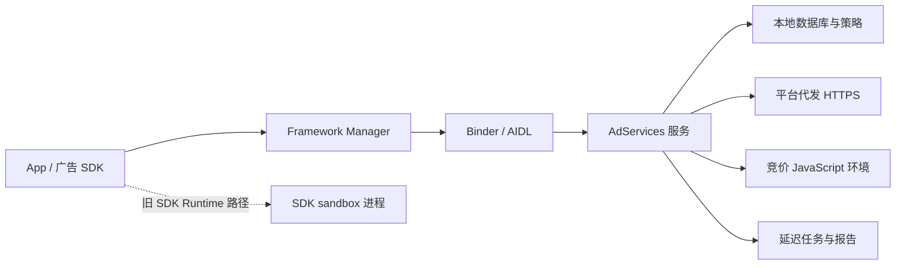

# 12.7 Privacy Sandbox on Android 退场：Android 17 API 状态与性能迁移

## 一、先更新产品判断

旧版 Privacy Sandbox on Android 面向移动广告，主要包含：

- Topics：依据设备上的应用使用情况提供兴趣主题；
- Protected Audience：用 Custom Audience 与 Ad Selection 支持再营销；
- Attribution Reporting：登记广告来源与转化触发器，延迟发送报告；
- SDK Runtime：把受支持的第三方 SDK 放入独立 sandbox 进程。

2025 年 10 月 17 日，Google 公告决定退役这些技术，理由包括采用率较低与生态反馈。官方状态页随后把 Android 侧 Attribution Reporting、On-Device Personalization、Protected App Signals、Protected Audience、SDK Runtime 和 Topics 都标为 “Scheduled for phaseout”。

该状态没有给出统一的 Android 移除版本，因此不推测停用日期。工程上应采用两个已确认事实：

1. 不为新业务建立这些 API 的强依赖；
2. 已接入业务要允许 API 缺失、被禁用、返回废弃错误或永久无结果。

官方站点仍保留旧版接入文档，页面也说明这些资料会作为历史参考继续存在。看到完整的 `getTopics()`、`selectAds()` 或 `registerSource()` 示例，不应据此判断 API 仍适合生产接入。

## 二、Android 17 源码给出的能力状态

### 2.1 Relevance API 已无法按旧设计使用

Android 17 的 `TopicsManager`、`AdSelectionManager` 与 `CustomAudienceManager` 都带有 `@Deprecated` 和 `FLAG_ADSERVICES_DEPRECATED`。类注释要求开发者停止使用，并说明没有直接替代 API。

更有判断价值的是回调代码：

- `TopicsManager.getTopics()` 调用服务后，无论服务返回结果还是失败码，Framework 都向调用方回调 `IllegalStateException`；
- `AdSelectionManager.selectAds()` 收到服务成功或失败后，同样向调用方回调废弃异常；
- `CustomAudienceManager.joinCustomAudience()` 等入口也把服务结果转换为废弃异常；
- `AdServicesDeprecationConstants` 的错误文本说明 Topics、Ad Selection、Custom Audience 和 Protected Signals API 已废弃且不再工作。

因此，Android 17 上测量这些入口的“热路径延迟”没有产品意义。一次很快的失败仍是失败；为了缩短失败时间去预热 AdServices 进程，只会增加后台工作。

### 2.2 Measurement 处于 soft removal

`MeasurementManager` 及其请求类型也已标记废弃。Android 17 的类注释说明：

- Measurement API 没有直接替代；
- 现有开发者应停止集成；
- 后续 Android 版本会在 soft removal 过程中拒绝调用。

与 Relevance API 相比，Android 17 的 Measurement 调用路径仍保留原有委托逻辑，不能笼统写成“所有调用已经立即失败”。调用方也不能把当前某台设备上的成功当作长期兼容保证。服务可通过系统更新、构建配置、用户选择或服务状态发生变化。

### 2.3 SDK Runtime 已标记为不再支持

`SdkSandboxManager` 在 Android 17 中标记废弃，类注释直接说明 SDK sandbox 不再受支持。相关 `SandboxedSdk`、`SdkSandboxController`、provider API 和 system-server 接口也带有相同的废弃方向。

这会影响把广告 SDK 冷启动成本转移到 sandbox 的旧方案。SDK Runtime 的进程隔离模型可用于理解历史架构，不能继续作为新 SDK 集成的前提。21.10 会从启动与进程角度单独处理该变化。

### 2.4 源码目录与能力结论要分开

Android 17 标签仍包含这些目录：

| 目录 | 内容 | Android 17 判断 |
|---|---|---|
| `packages/modules/AdServices/adservices/framework` | Framework manager、AIDL、请求与结果类型 | 大量公开类型已经废弃 |
| `packages/modules/AdServices/adservices/apk` | Topics、Ad Selection、Measurement 等服务实现 | 服务代码存在，不能证明调用方能获得结果 |
| `packages/modules/AdServices/adservices/service-core` | 数据库、网络、任务与共享逻辑 | 主要用于维护、兼容和退场过程 |
| `packages/modules/AdServices/sdksandbox` | SDK Runtime framework 与服务 | API 已标记不再支持 |

模块目录通常要保留一段时间，以满足系统升级、兼容、CTS 和数据清理需求。删除源码不是 API 退场的起点，保留源码也不是可用性承诺。

## 三、历史调用链与性能成本

下面的图用于阅读 Android 13 至 Android 16 的资料，并定位 Android 17 遗留调用可能发生在哪一层。

历史 API 的耗时不只来自 Binder。一次回调可能覆盖数据库访问、策略校验、网络获取、JavaScript 执行或任务登记；另一些 API 只登记本地状态，把网络成本延后到平台任务。调用到回调的总耗时仍是应用最可靠的观测口径。

### 3.1 Binder 延迟不能用固定常数描述

固定的 Binder、进程启动和 sandbox 序列化毫秒范围，若没有设备、构建类型、温度、负载、模块版本或样本数，就无法迁移到另一台设备。

影响跨进程耗时的变量包括：

- 服务进程是否已存在，是否经历过冻结或回收；
- Binder 线程池与调用方 Executor 是否排队；
- 参数的 parcel 大小和文件描述符数量；
- 服务是否进入数据库、网络或 JavaScript 阶段；
- 设备功耗状态、内存压力和后台限制；
- Ad Services Mainline 版本、OEM 配置与 feature flag。

分析时应报告设备与版本组合、冷暖定义、样本数和分位数。没有这些信息时，只能写调用链，不能写通用时延。

### 3.2 Topics 的历史查询不等于现场分类

Topics 的历史设计在 epoch 任务中计算和保存主题。`getTopics()` 主要通过 Binder 请求已生成的结果，并依据调用方、SDK、观察标记、权限和 consent 处理响应。把每次调用描述成“现场执行分类模型并在一毫秒内完成”会误导性能判断。

旧版默认 epoch 曾以 7 天为周期，测试环境可通过 device config 缩短周期。该值属于历史实现配置，不应成为 Android 17 业务缓存 TTL。Android 17 的 Framework 已把结果回调改成废弃错误。

### 3.3 Protected Audience 的历史竞价包含多种模式

Protected Audience 早期常被称为 FLEDGE。典型本地竞价可能包含：

- 读取符合条件的 Custom Audience；
- 获取 buyer bidding logic、seller decision logic 和 trusted signals；
- 执行 bidding、scoring 与 reporting JavaScript；
- 保存选择结果并在后续上报曝光或交互；
- 按限额、用户选择、注册状态和网络错误返回失败。

后续设计还支持 Bidding and Auction server 等路径，所以“每次竞价都在本地 WebView 完成”也不完整。买家数、候选数、缓存命中、脚本体积、trusted data、网络 RTT 与执行限制都会改变耗时。

Android 17 已让 `selectAds()` 回调废弃错误。历史链路适合解释旧端点为何仍有流量、旧数据库为何仍占空间，不适合继续给广告首帧设定竞价预算。

### 3.4 Attribution 注册会触发网络获取

旧文把 `registerSource()` 与 `registerTrigger()` 写成纯本地 SQLite 操作，这与公开 API 合同冲突。接收 `Uri` 的重载会让平台访问 HTTPS registration URI，获取 source 或 trigger metadata，再把合格数据存入设备。

调用还要区分两类完成事件：

- API callback 表示本次注册调用的处理结果；
- attribution report 会按隐私窗口和平台任务调度在稍后发送。

callback 成功不代表报告已经到达广告技术平台。报告到达时间也不是应用能精确安排的固定时刻。服务端容量评估应使用报告端真实到达分布，不能从 trigger 发生时间直接平移一个常数。

## 四、Android 17 应采用退场架构

### 4.1 将 API 结果降为可选信号

遗留代码若暂时不能删除，应把 Privacy Sandbox 结果视为可选输入：

- 广告位和业务页面不能等待它才能完成布局；
- 调用方设置自己的短时限，超时后忽略迟到回调；
- 回调必须带请求代次或生命周期 token，避免旧结果更新新页面；
- deprecation、unsupported、disabled、security、rate limit 与网络错误要分开记录；
- fallback 不得再次同步调用另一条高延迟广告链路；
- 远程开关能在不发版的情况下停用调用。

许多 API 不提供调用方可传入的取消信号。应用本地结束等待后，平台工作可能仍继续；因此“超时”只代表 UI 不再接收结果，不代表系统任务已经取消。

### 4.2 不要把 GAID 当成自动回退

Privacy Sandbox 退场不表示 GAID 获得了新的用途，也不表示应用可恢复旧式跨应用跟踪。广告 ID、App Set ID、第一方标识和服务端账号体系具有不同权限、用户控制与政策边界。

替代路线应从业务目标出发：

| 目标 | 可评估方向 | 评审重点 |
|---|---|---|
| 广告填充 | 上下文广告、广告平台当前支持的 SDK | 首帧时限、缓存、用户选择 |
| 兴趣定向 | 获得许可的第一方信号、上下文特征 | 数据最小化、生命周期、政策 |
| 再营销 | 广告平台公开且受支持的方案 | 跨应用数据边界、用户控制 |
| 安装与转化测量 | 商店归因、MMP、第一方聚合分析 | 去重、延迟、归因窗口、合规 |
| SDK 隔离 | 进程隔离、最小权限、SDK 审核与版本治理 | 启动、内存、Binder、故障域 |

Android 17 源码已说明没有平台直接替代。团队应记录为什么选择某条路线，并由隐私、政策、安全和性能共同审核。

### 4.3 清理顺序

现有项目可按以下顺序退出：

1. 盘点 `TopicsManager`、`AdSelectionManager`、`CustomAudienceManager`、`MeasurementManager` 与 `SdkSandboxManager` 的调用点；
2. 盘点 manifest 中 AdServices 权限、`AD_SERVICES_CONFIG`、`uses-sdk-library` 与相关 Jetpack 依赖；
3. 用远程开关停止新请求，观察广告填充、页面时延、错误率和旧服务端端点流量；
4. 取消 Topics 缓存、Custom Audience 维护、竞价脚本和 registration endpoint 的业务依赖；
5. 清理迟到回调、重试任务、数据库映射、指标维度和测试 fixture；
6. 删除权限、资源、依赖与服务端兼容代码；
7. 在 Android 13 至 Android 17 及不同 Ad Services extension 版本上回归。

退场期间不要使用无限重试。一个被平台永久拒绝的 API 不会因指数退避恢复；远程开关、错误分类和删除版本才是对应动作。

## 五、可观测性：测量退场风险

### 5.1 版本判断不能只看 API level

Ad Services 曾通过 Mainline 与 Ad Services SDK Extensions 跨 Android 大版本交付。API 类存在、`SDK_INT >= 33`、manager 非空都不足以说明某项能力可用。还可能受 extension 版本、服务进程、用户选择、enrollment、权限、feature flag 和 OEM 构建影响。

Android 17 的能力判断要优先服从退场状态。旧兼容层若仍查询 extension version，目的应是安全关闭旧路径，不是继续扩大接入。

### 5.2 推荐事件字段

| 字段 | 说明 |
|---|---|
| `sandbox_feature` | topics、ad_selection、custom_audience、measurement、sdk_runtime |
| `platform_api` | Android API level |
| `ad_services_extension` | 可获得时记录扩展版本 |
| `call_site` | 广告位、启动、转化等受控枚举 |
| `result_category` | success、deprecated、unsupported、disabled、security、rate_limited、local_timeout |
| `end_to_end_ms` | 调用到接受回调或本地截止的时间 |
| `late_callback` | UI 放弃后是否又收到回调 |
| `fallback_path` | contextual、provider SDK、none 等受控枚举 |
| `user_visible_outcome` | 页面完成、广告填充、空位或错误 |

不要记录返回的 topic、Custom Audience 名称、竞价信号、完整 registration URI 或用户级归因信息。这些内容可能携带敏感广告画像，性能排查通常不需要它们。

### 5.3 退场完成条件

一条旧路径可在满足这些条件后删除：

- 线上调用量降为零或只剩明确的旧版本 cohort；
- deprecation 和 unsupported 错误不再影响页面；
- 替代路径的延迟、失败率和业务指标已独立统计；
- 旧 registration、bidding、trusted data 与 reporting endpoint 没有未知流量；
- manifest 权限、SDK Runtime 包、依赖与配置均已移除；
- 数据删除和保留策略已经执行。

“调用很少”不能代替删除。低频后台任务仍可能造成唤醒、网络和隐私成本，也会让服务端长期保留无人维护的协议。

## 六、验证 Android 17 时应读哪些源码

| 判断 | Android 17 锚点 |
|---|---|
| Topics 类型与强制错误回调 | `adservices/framework/java/android/adservices/topics/TopicsManager.java` |
| Ad Selection 废弃与错误回调 | `adservices/framework/java/android/adservices/adselection/AdSelectionManager.java` |
| Custom Audience 废弃与错误回调 | `adservices/framework/java/android/adservices/customaudience/CustomAudienceManager.java` |
| Measurement soft removal | `adservices/framework/java/android/adservices/measurement/MeasurementManager.java` |
| SDK Runtime 状态 | `sdksandbox/framework/java/android/app/sdksandbox/SdkSandboxManager.java` |
| Relevance 错误文本 | `shared/libraries/device-side/java/com/android/adservices/shared/common/exception/AdServicesDeprecationConstants.java` |

阅读服务实现时还应核对 Framework 层。即使 service-core 能完成数据库或网络工作，Framework 也可能把结果改成废弃错误，应用收到的行为由整条调用链决定。

## 小结

Android 17 已把 Privacy Sandbox on Android 从性能优化议题转为退场议题。Topics、Ad Selection 与 Custom Audience 无法按旧文档获得业务结果；Measurement 进入 soft removal；SDK Runtime 已标记不再支持。官方也没有为这些 Android API 提供一比一替代。

现有项目应把调用移出关键路径，通过远程开关停用，区分废弃与暂时性错误，核对平台和服务端遗留流量，再删除权限、依赖、任务和 endpoint。历史 Binder、数据库、网络、JavaScript 与延迟报告模型仍有排障价值，但不再构成新接入方案。

## 参考资料

- [Privacy Sandbox feature status](https://privacysandbox.google.com/overview/status)
- [Update on Plans for Privacy Sandbox Technologies](https://privacysandbox.google.com/blog/update-on-plans-for-privacy-sandbox-technologies)
- [Private Advertising 文档保留说明](https://privacysandbox.google.com/private-advertising)
- [`TopicsManager.java`（Android 17）](https://android.googlesource.com/platform/packages/modules/AdServices/+/android-17.0.0_r1/adservices/framework/java/android/adservices/topics/TopicsManager.java)
- [`AdSelectionManager.java`（Android 17）](https://android.googlesource.com/platform/packages/modules/AdServices/+/android-17.0.0_r1/adservices/framework/java/android/adservices/adselection/AdSelectionManager.java)
- [`CustomAudienceManager.java`（Android 17）](https://android.googlesource.com/platform/packages/modules/AdServices/+/android-17.0.0_r1/adservices/framework/java/android/adservices/customaudience/CustomAudienceManager.java)
- [`MeasurementManager.java`（Android 17）](https://android.googlesource.com/platform/packages/modules/AdServices/+/android-17.0.0_r1/adservices/framework/java/android/adservices/measurement/MeasurementManager.java)
- [`AdServicesDeprecationConstants.java`（Android 17）](https://android.googlesource.com/platform/packages/modules/AdServices/+/android-17.0.0_r1/shared/libraries/device-side/java/com/android/adservices/shared/common/exception/AdServicesDeprecationConstants.java)
- [`SdkSandboxManager.java`（Android 17）](https://android.googlesource.com/platform/packages/modules/AdServices/+/android-17.0.0_r1/sdksandbox/framework/java/android/app/sdksandbox/SdkSandboxManager.java)
