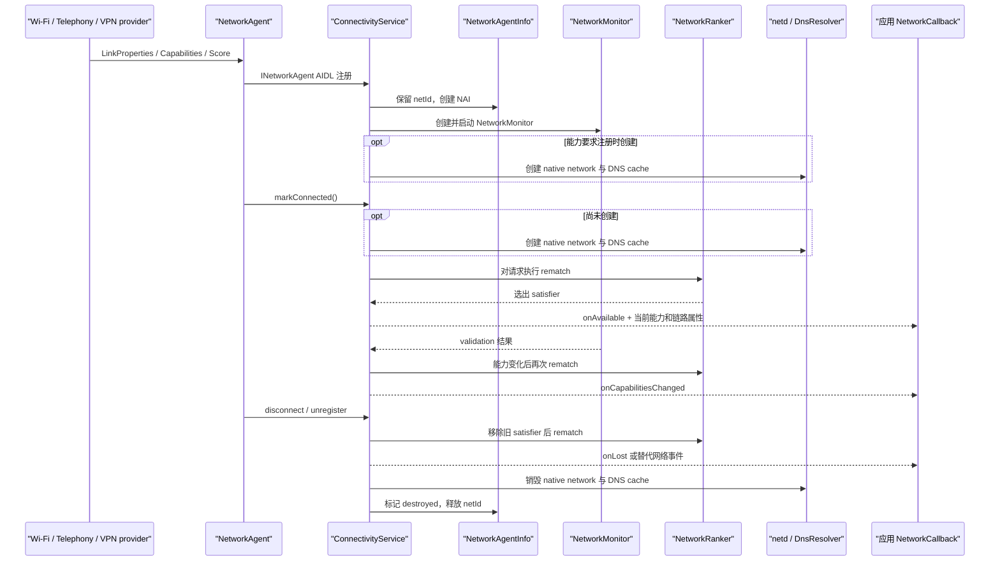

# 12.8 Android 17 NetworkAgent 生命周期与 FullScore 网络排序

应用通过 `ConnectivityManager` 看见一组 `Network`、`NetworkCapabilities`、`LinkProperties` 和回调事件。系统内部还要回答两个问题：

- Wi-Fi、蜂窝、VPN 等网络如何进入和退出 `ConnectivityService`；
- 同一个 `NetworkRequest` 被多条网络满足时，哪一条成为当前 satisfier。

Android 17 的答案由 `NetworkAgent`、`NetworkAgentInfo`、`FullScore` 和 `NetworkRanker` 协作完成。这里没有“比较两个整数，分高者胜出”的通用公式，也没有一个名为 `NetworkScorecard` 的 Connectivity 排序输入。

`NetworkAgent` 属于 `@SystemApi` 且带有隐藏 API 标记。它面向系统网络提供者，普通应用应使用 `ConnectivityManager` 观察网络，不能自行注册系统网络 agent。

## 一张图读懂控制链路

下面的时序图用来区分注册、验证、重匹配与销毁四条容易混淆的路径。



注册和 connected 只表示系统已经接纳这条网络并可参与匹配。互联网验证由 `NetworkMonitor` 异步完成，因此 `onAvailable()` 可能早于 `NET_CAPABILITY_VALIDATED`。

## NetworkAgent 如何进入 ConnectivityService

### AIDL 注册和 NetworkAgentInfo

`NetworkAgent.register()` 把 `INetworkAgent`、初始 `NetworkInfo`、`LinkProperties`、`NetworkCapabilities`、`NetworkScore` 和配置交给 `ConnectivityService`。Android 17 的注册通道是 `INetworkAgent` / `INetworkAgentRegistry` AIDL；旧资料中的 Messenger 描述不适用于本章锚点。

`registerNetworkAgentInternal()` 会复制调用方传入的可变对象，保留一个 netId，构造 `NetworkAgentInfo`，再请求 NetworkStack 创建 `NetworkMonitor`。`NetworkMonitor` 返回后，`handleRegisterNetworkAgent()` 才把 NAI 放入系统集合并开始接收 agent 消息。

netId 在活跃网络集合中保持唯一。网络销毁后，`mNetIdManager.releaseNetId()` 允许该整数在未来被复用，所以持久化日志不能只凭 netId 判断两条跨时段网络是否相同。

[源码锚点：`ConnectivityService.registerNetworkAgentInternal()` 与 `handleRegisterNetworkAgent()`](https://android.googlesource.com/platform/packages/modules/Connectivity/+/android-17.0.0_r1/service/src/com/android/server/ConnectivityService.java)

### NAI 记录的时间和状态

`NetworkAgentInfo` 没有单一的公开生命周期枚举。Android 17 用时间戳、能力位、请求集合和 inactivity 状态组合表达生命周期。

| NAI 状态 | 源码成员或方法 | 排查含义 |
|---|---|---|
| native network 已创建 | `mCreatedTime` / `isCreated()` | netd 网络与每网络 DNS cache 已建立 |
| agent 已报告 connected | `mConnectedTime` / `everConnected()` | 首次进入 connected；不代表互联网已验证 |
| 当前验证通过 | `mCurrentValidationTime` / `isValidated()` | 非零表示当前具有验证结果 |
| 曾经验证通过 | `mFirstValidationTime` / `everValidated()` | 可参与“曾经验证”相关策略判断 |
| 首轮评估已结束 | `mFirstEvaluationConcludedTime` | 区分尚在评估与已有评估结论 |
| nascent / lingering | inactivity timer 和请求 linger 集合 | 网络暂时保留，等待请求或平滑切换 |
| native network 已销毁 | `mDestroyedTime` / `isDestroyed()` | 数据通路已经撤销，可能仍在等待替代 agent 的流程中 |

`dumpsys connectivity` 展示的是这些状态的组合。分析日志时应同时记录 netId、transport、接口名、创建时间和 NAI 简写，避免把被复用的 netId 当成连续的一条网络。

[源码锚点：`NetworkAgentInfo` 生命周期时间戳与 inactivity 状态](https://android.googlesource.com/platform/packages/modules/Connectivity/+/android-17.0.0_r1/service/src/com/android/server/connectivity/NetworkAgentInfo.java)

### native network、connected 和 validation

`createNativeNetwork()` 通过 `mNetd.networkCreate()` 创建物理、local 或 virtual 网络，再调用 `mDnsResolver.createNetworkCache(netId)`，并把当前能力交给 `DnsManager`。不同能力和 VPN 场景决定 native network 在注册时创建，还是在 agent 报告 connected 时创建。

首次 connected 的处理顺序包含：

1. 标记 `mConnectedTime`；
2. 应用初始 `LinkProperties`，准备接口、路由和 DNS；
3. 通知 `NetworkMonitor` 开始评估；
4. 添加 nascent inactivity timer；
5. 把尚未验证的网络放入请求匹配；
6. 发送 precheck 回调。

这段顺序解释了一个常见现象：网络已经满足某个请求并触发 `onAvailable()`，过一会儿才通过 `onCapabilitiesChanged()` 获得 `NET_CAPABILITY_VALIDATED`。若业务只接受可访问公网的网络，应在能力回调里检查 validated，而不能把 `onAvailable()` 当成验证成功。

[源码锚点：`ConnectivityService.updateNetworkInfo()` 与 `createNativeNetwork()`](https://android.googlesource.com/platform/packages/modules/Connectivity/+/android-17.0.0_r1/service/src/com/android/server/ConnectivityService.java)

## Android 17 的评分对象

### NetworkScore：agent 能表达什么

`NetworkScore` 保存三类信息：

- `legacyInt`：兼容旧 provider 的整数，仅供测量和日志；
- agent policy：`POLICY_YIELD_TO_BAD_WIFI`、`POLICY_TRANSPORT_PRIMARY`、`POLICY_EXITING`、`POLICY_VCN`；
- keep-connected reason：handover、测试或 local network 等保留原因。

源码对 `Builder.setLegacyInt()` 的约束很直接：这个整数不再用于连接态网络之间的排名。下面摘录对应注释，目的是把兼容字段和排序依据分开。

```java
/**
 * This will be used for measurements and logs, but will no longer be used
 * for ranking networks against each other.
 */
public Builder setLegacyInt(final int score) {
    mLegacyInt = score;
    return this;
}
```

因此，“Wi-Fi 60 分、蜂窝 50 分、VPN 101 分，然后取最大值”只能用于解释旧版本或兼容日志，不能描述 Android 17 的连接态网络选择。

[源码锚点：`NetworkScore.Builder.setLegacyInt()`](https://android.googlesource.com/platform/packages/modules/Connectivity/+/android-17.0.0_r1/framework/src/android/net/NetworkScore.java)

### FullScore：系统补充上下文

provider 不知道网络未来能否验证、用户是否接受未验证连接、网络是否即将销毁。`ConnectivityService` 把 agent policy 与自身维护的状态组合成 `FullScore`。

| FullScore 中由 Connectivity 管理的 policy | 表达的状态 |
|---|---|
| `POLICY_IS_VALIDATED` | 当前已验证 |
| `POLICY_EVER_VALIDATED` | 曾经验证 |
| `POLICY_IS_VPN` | VPN transport |
| `POLICY_EVER_USER_SELECTED` | 用户曾显式选择 |
| `POLICY_ACCEPT_UNVALIDATED` | 用户接受未验证网络 |
| `POLICY_AVOIDED_WHEN_UNVALIDATED` | 未验证时应避开 |
| `POLICY_IS_UNMETERED` | 当前能力显示不计量 |
| `POLICY_IS_INVINCIBLE` | prospective offer 的兼容特例 |
| `POLICY_EVER_EVALUATED` | 已经得到过评估结果 |
| `POLICY_IS_DESTROYED` | native network 已销毁，正在等待替代 |

`POLICY_IS_UNMETERED` 已进入 `FullScore`，但 Android 17 `NetworkRanker` 中“unmetered 胜过 metered”的筛选分支仍被注释。看到该 policy 不能推导出不计量网络必然获胜。

keep-connected reason 用于判断一条暂时没有前台请求的网络是否仍应保留。它不属于 `NetworkRanker` 的胜负条件。

[源码锚点：`FullScore` policy 定义与构造](https://android.googlesource.com/platform/packages/modules/Connectivity/+/android-17.0.0_r1/service/src/com/android/server/connectivity/FullScore.java)

### prospective offer 的 legacyInt 特例

网络 provider 可以先注册 `NetworkOffer`，表示它有机会提供满足某组能力的网络。`NetworkRanker.mightBeat()` 比较 offer 的 prospective score 与当前 champion；没有胜算的 offer 无需唤醒 radio 或建立网络。

`FullScore.makeProspectiveScore()` 会把 score filter 中大于 `NetworkRanker.LEGACY_INT_MAX`（100）的 `legacyInt` 映射为 `POLICY_IS_INVINCIBLE`。这是 offer 阶段的兼容规则，作用是决定 provider 是否值得尝试建立网络。offer 不是能力承诺，连接成功后的网络仍按完整 policy 链参与选择。

由此可以解释历史 VPN 101 的残留：它不能证明一条已连接 VPN 依靠整数 101 压过所有网络；已连接 VPN 的优先级来自 `POLICY_IS_VPN`。

[源码锚点：`FullScore.makeProspectiveScore()` 与 `NetworkRanker.mightBeat()`](https://android.googlesource.com/platform/packages/modules/Connectivity/+/android-17.0.0_r1/service/src/com/android/server/connectivity/FullScore.java)

## NetworkRanker 怎样选 satisfier

### 先按能力过滤

`getBestNetwork(request, nais, currentSatisfier)` 先调用 `nai.satisfies(request)`。不满足请求 transport、capability、UID 可见性或其他约束的 NAI 不会进入排序。

这一步也说明“系统只有一个统一的最优网络”并不准确。每个请求都有自己的候选集；默认网络、IMS、VPN underlying、local network 和应用显式请求可能落在不同 NAI 上。

### 再逐级缩小候选集

`getBestNetworkByPolicy()` 对候选集执行有序筛选。某一级有命中项时，只保留命中项；无法区分时，全部候选进入下一级。

| 顺序 | 筛选条件 | 设计含义 |
|---:|---|---|
| 1 | `POLICY_IS_INVINCIBLE` | prospective offer 的兼容优先项 |
| 2 | `POLICY_IS_VPN` | 已连接 VPN |
| 3 | 用户选择且接受未验证 | 尊重用户对该网络的明确选择 |
| 4 | validated 或 accept-unvalidated | 偏好已有可用性结论的网络，并应用 bad-Wi-Fi yield 规则 |
| 5 | 没有 `POLICY_EXITING` | 避开 provider 已声明即将退出的网络 |
| 6 | 同 transport 下的 `POLICY_TRANSPORT_PRIMARY` | 例如同类 transport 的主订阅选择 |
| 7 | transport 顺序 | Ethernet、Wi-Fi、Bluetooth、Cellular |
| 8 | `POLICY_VCN` | 等价候选中保留 VCN |
| 9 | 没有 `POLICY_IS_DESTROYED` | 等待替代的旧网络让位给等价的新网络 |
| 10 | 当前 satisfier | 等价时保持现状，减少无收益切换 |
| 11 | 列表中的一个等价候选 | 前述条件仍无法区分时返回一个候选 |

该顺序是 Android 17 AOSP 的默认策略。OEM 可以改变 provider 上报的 policy 和外围配置，但不能用一组通用 RSSI 阈值推导所有设备的切换结果。Wi-Fi 信号变差也不等同于“整数分降到蜂窝以下”；provider 可以更新能力或 policy，NetworkMonitor 也会更新验证状态，两者都可能触发重匹配。

[源码锚点：`NetworkRanker.getBestNetworkByPolicy()`](https://android.googlesource.com/platform/packages/modules/Connectivity/+/android-17.0.0_r1/service/src/com/android/server/connectivity/NetworkRanker.java)

## 从 score 更新到回调

### 计算重分配

agent 更新 score 时，`ConnectivityService.updateNetworkScore()` 写入 NAI 并调用 `rematchAllNetworksAndRequests()`。重分配的主要调用关系如下，这段代码用于定位性能事件对应的方法边界。

```text
updateNetworkScore()
  -> NetworkAgentInfo.setScore()
  -> rematchAllNetworksAndRequests()
       -> computeNetworkReassignment()
            -> NetworkRanker.getBestNetwork(request, nais, currentSatisfier)
       -> applyNetworkReassignment()
       -> issueNetworkNeeds()
```

`computeNetworkReassignment()` 收集当前 NAI，然后遍历待评估的 `NetworkRequestInfo`。普通纯 listen 请求可以跳过；multilayer request 会按层级尝试请求，找到首个可用 satisfier 后停止处理较低优先级层。

其成本会随活跃 NAI 数量和被评估的 request layer 数量增长，应用阶段还包含默认网络状态、回调、offer、listen 与 inactivity 处理。源码在 `rematchNetworksAndRequests()` 保留了 “This may be slow, and should be optimized” 注释。这里没有足够依据给出所有设备通用的毫秒范围。

### 应用重分配

`applyNetworkReassignment()` 的顺序会影响应用观察：

1. 更新每条网络满足的请求集合；
2. 处理默认网络变化；
3. 更新 local network forwarding；
4. 新 satisfier 非空时发送 available；新 satisfier 为空时发送 lost；
5. 更新 background、listen 和 inactivity 状态；
6. 对进入 linger 的网络发送 losing；
7. 清理已无请求且无需保留的网络。

local network forwarding 在 available 之前更新，应用收到回调时相关转发规则已经配置。互联网 validation 仍可能在后续完成，所以 available 的语义是“该请求已有 satisfier”，不是“公网探测已经通过”。

调试构建或启用相应日志级别时，重匹配日志会包含 `NetReassign` 以及 `[c ...] [a ...] [i ...]`，分别对应 compute、apply 和 issue 阶段。它们是设备实测入口，不应被文档里的固定延迟代替。

[源码锚点：`computeNetworkReassignment()`、`rematchNetworksAndRequests()` 与 `applyNetworkReassignment()`](https://android.googlesource.com/platform/packages/modules/Connectivity/+/android-17.0.0_r1/service/src/com/android/server/ConnectivityService.java)

## linger 与替代网络

请求从旧网络迁到新网络后，旧 satisfier 可以为该请求进入 linger，给应用一段处理旧 socket 的时间。Android 17 AOSP 的默认 linger delay 为 30 秒，nascent delay 为 5 秒；linger 还可由 `persist.netmon.linger` 和测试配置调整。这些是当前源码默认值，不是 SDK 时序保证。

以下边界影响排查结论：

- 只有系统判断可以平滑切换时才为旧请求建立 linger；
- 已标记 destroyed 的旧网络不会 linger，因为其 native 数据通路已经撤销；
- linger 到期也不保证网络立刻销毁，后台请求或 keep-connected reason 仍可能保留它；
- `onLosing()` 是提示，应用应允许缺失、延迟或紧邻 `onLost()` 的情况。

Android 17 还支持 `NetworkAgent.unregisterAfterReplacement(timeout)`。旧 agent 的 native network 会被销毁，NAI 获得 `POLICY_IS_DESTROYED`，系统暂留注册状态等待等价的新 agent。该 policy 位于排序链后部：旧 satisfier 可在没有替代者时维持请求关系，新 agent 出现后会在等价比较中胜出；超时仍未替代时，旧 agent 被注销。

[源码锚点：`NetworkAgent.unregisterAfterReplacement()` 与 ConnectivityService 的对应事件处理](https://android.googlesource.com/platform/packages/modules/Connectivity/+/android-17.0.0_r1/framework/src/android/net/NetworkAgent.java)

## 断开和资源销毁

`disconnectAndDestroyNetwork()` 先从 ConnectivityService 的控制状态移除旧网络、通知相关组件、更新 satisfier 并重新匹配请求。`destroyNetwork()` 随后调用 `destroyNativeNetwork()`。源码注释明确说明，较慢的 netd 清理放在 rematch 之后，可减少默认网络切换期间的额外中断。

`destroyNativeNetwork()` 的主要清理项包括：

- 删除 DSCP policy、local forwarding 和 VPN 入口过滤状态；
- 调用 `mNetd.networkDestroy(netId)`；
- 清理接口 qdisc、IP 地址和相关 socket；
- 调用 `mDnsResolver.destroyNetworkCache(netId)`；
- 从 `DnsManager` 移除该网络；
- 清理入口限速和接口跟踪；
- 标记 `mDestroyedTime` 并通知 agent；
- 由外层 `destroyNetwork()` 释放 netId。

DNS cache 清理是 native network 销毁流程的一部分。源码没有支持“提前清 DNS 会造成系统级 DNS 超时”这类因果结论，也没有把 DNS 统计送入 `NetworkRanker`。排查短暂断网时，应分别检查请求重分配、默认网络变化、旧 socket、Private DNS 和新网络 validation，不能只凭清理顺序归因。

[源码锚点：`disconnectAndDestroyNetwork()`、`destroyNetwork()` 与 `destroyNativeNetwork()`](https://android.googlesource.com/platform/packages/modules/Connectivity/+/android-17.0.0_r1/service/src/com/android/server/ConnectivityService.java)

## 应用层应如何理解网络切换

### 回调语义

应用的判断规则可以保持简洁：

- `onAvailable(network)`：这个请求已有 satisfier，可立即用返回的 `Network` 查询能力和链路属性；
- `onCapabilitiesChanged()`：validated、metered、transport、带宽等能力发生变化；
- `onLinkPropertiesChanged()`：地址、路由、DNS server、代理等链路配置变化；
- `onLosing()`：系统预告网络可能失去请求，不能作为必达事件；
- `onLost()`：该 `Network` 已不再满足这个回调对应的请求。

`ConnectivityManager.NetworkCallback` 文档要求应用在 `onAvailable()` 后依赖随后的 capabilities 与 link-properties 回调获取同步状态，避免在回调内用阻塞式查询拼接一个可能已经变化的快照。

[官方 API：`ConnectivityManager.NetworkCallback`](https://developer.android.com/reference/android/net/ConnectivityManager.NetworkCallback)

### 默认网络具有 UID 视角

默认网络不是对所有进程都相同的永久全局值。VPN、UID 路由策略、企业策略和应用绑定都可能改变某个 UID 的默认路径。诊断时要明确观察者 UID，并区分：

- `getActiveNetwork()` 返回调用方当前默认网络；
- `Network.getSocketFactory()` 创建绑定到指定网络的新 socket；
- `bindProcessToNetwork()` 改变该进程后续创建 socket 的网络选择。

网络切换不会普遍迁移既有 TCP、TLS 或 WebSocket。旧 socket 仍关联原网络和地址，网络消失后通常需要由连接库或业务层重试；新 socket 默认使用调用 UID 此刻的网络，除非显式绑定。

[官方指南：读取网络状态](https://developer.android.com/develop/connectivity/network-ops/reading-network-state)

## 诊断步骤

下面的命令用于收集 Connectivity、NetworkStack 与 DNS resolver 的同一时段证据。

```bash
adb shell dumpsys connectivity
adb shell dumpsys network_stack
adb shell dumpsys dnsresolver
adb logcat -v threadtime -s ConnectivityService NetworkMonitor
```

这些命令通常需要 shell 权限，OEM 构建也可能裁剪字段或调整日志级别。生产问题优先保留 bugreport，并记录复现时刻、应用 UID、目标请求、netId、transport、接口名和回调时间线。

建议按以下顺序阅读证据：

1. 在 `dumpsys connectivity` 中确认请求、当前 satisfier、FullScore policy、validated、lingering 和 destroyed；
2. 对照 NetworkMonitor 日志确认验证状态何时变化；
3. 对照 `NetReassign` 或 rematch 日志确认 compute、apply、issue 阶段；
4. 检查应用是否把 available 当成 validated，或在回调中启动了阻塞工作；
5. 检查旧连接是否具备重试与幂等保护；
6. 涉及 DNS 时，结合每网络 resolver 配置和 Private DNS 结果判断。

Perfetto 可以记录 Binder、调度、应用自定义 trace 和网络相关系统事件，但 Android 17 源码没有保证名为 `rematchAllNetworksAndRequests` 的公开 atrace slice。若平台团队需要精确量化该方法，应在自有调试构建增加 trace 标记，或使用 ConnectivityService 已有的分阶段日志。

## Review 结论

本章在 Android 17 源码锚点下可以归纳为五条：

1. `NetworkAgent` 注册一条候选网络，`NetworkAgentInfo` 保存它在 ConnectivityService 中的控制状态。
2. connected、available 和 validated 是三个不同事件，不能互相替代。
3. `legacyInt` 不参与连接态网络排名，`NetworkScorecard` 也不在 `NetworkRanker` 输入中。
4. `FullScore` 合并 agent policy 与系统状态，`NetworkRanker` 通过固定顺序逐级筛选候选。
5. rematch 先更新请求和默认网络，再清理旧 native network；既有 socket 的恢复仍由应用或连接库处理。

遇到“Wi-Fi 信号仍在、流量却切到蜂窝”或“收到 available 后请求失败”时，应从 request 能力、FullScore policy、validation 和 UID 默认网络四个维度还原当时的选择，不要从旧整数分数表反推 Android 17 行为。
