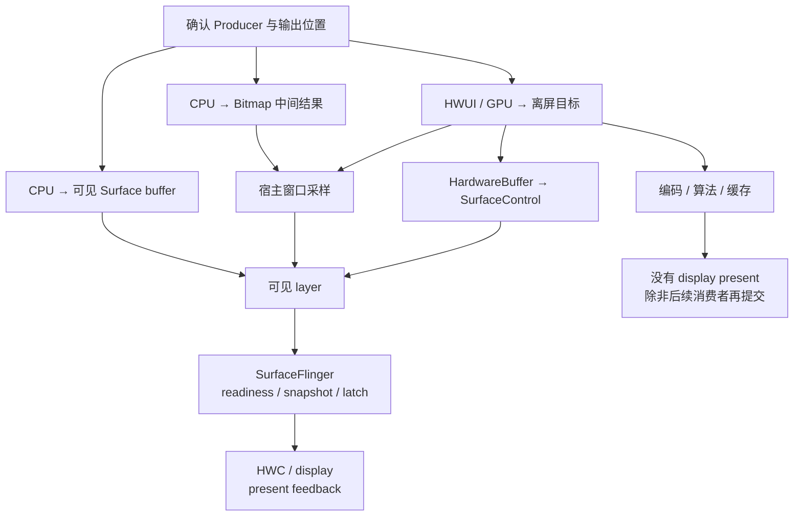
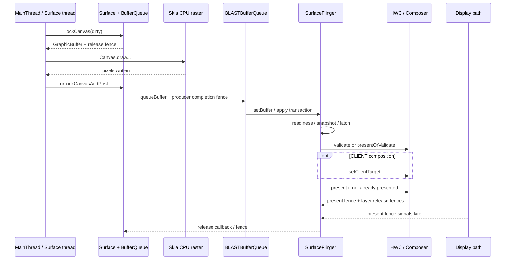
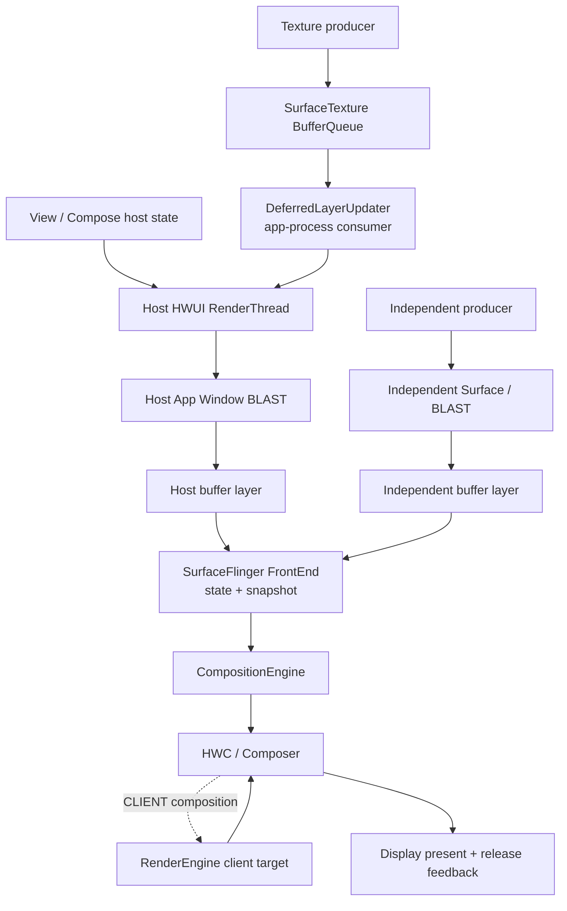
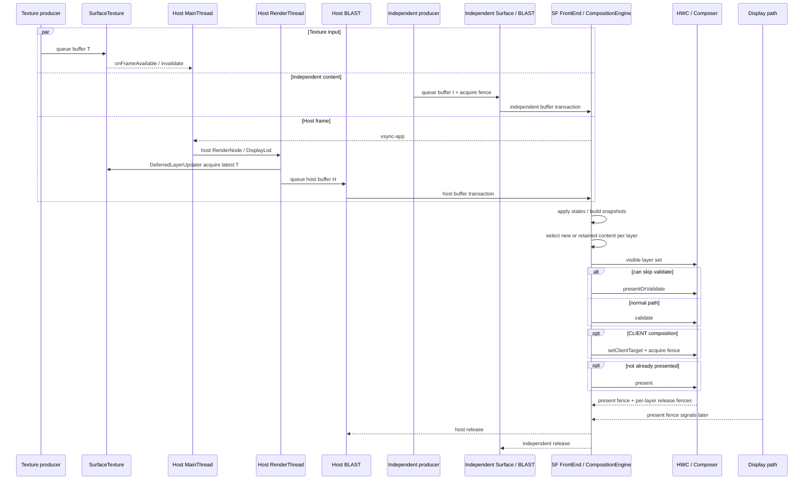

# Android 软件、离屏与混合渲染路径

软件渲染回答“谁生成像素”，离屏渲染回答“像素先写到哪里”。这是两个独立维度：CPU 可以直接写可见 `Surface`，GPU 也可以先画进离屏纹理或 `HardwareBuffer`（可在 CPU、GPU 和硬件模块之间共享的图形 buffer）。诊断时要依次确认 Producer、输出位置、Consumer 和最终可见 layer。

平台实现以 Android 17 / API 37 的 `android-17.0.0_r1` 为基线；涉及 dma-buf（共享 buffer 的内核机制）、dma-fence（内核同步对象）、sync_file（把 fence 暴露为文件描述符的接口）、调度与内存回收时，内核以 `android17-6.18-2026-06_r6` 为基线。

## CPU 光栅化与离屏缓冲区

### 软件与离屏路径的分类

#### 先按“生产方式 × 结果去向”分类

常见路径可以归纳成四组：

| 生产者 | 结果先写到 | 最终可见对象 | 典型入口 |
|---|---|---|---|
| CPU | 当前窗口或独立 `Surface` buffer | 对应 SurfaceFlinger layer | `ViewRootImpl.drawSoftware()`、`SurfaceHolder.lockCanvas()` |
| CPU | Bitmap 中间结果 | 宿主 App Window | `LAYER_TYPE_SOFTWARE`、显式 Bitmap Canvas |
| HWUI / GPU | GPU render target（渲染目标）或 `HardwareBuffer` | 取决于后续消费者 | 硬件 Canvas 的 `saveLayer()`、`RenderEffect`、`HardwareBufferRenderer` |
| App GPU | `HardwareBuffer` | 独立 `SurfaceControl` layer | EGL / Vulkan 生产后调用 `Transaction#setBuffer()` |

前两行属于 CPU 软件栅格化，也就是由 CPU 把绘制指令转换成像素。后两行属于 GPU 离屏渲染，并非软件渲染。中间结果若只交给编码器、算法或缓存，就不会自然出现 SurfaceFlinger latch、HWC present 和 display present fence。

下面的图用于确认中间结果的消费者以及它是否进入显示链。



纯离屏分支停在编码、算法或缓存消费者，不会自动产生 SF layer。通过宿主窗口采样时，显示证据属于宿主 App Window；通过 `Transaction#setBuffer()` 提交时，才继续跟踪目标 `SurfaceControl` layer 的 transaction、latch、composition、present 与 release。

#### 整窗口软件绘制

应用或 Activity 关闭硬件加速时，普通 View 树由 `ViewRootImpl.drawSoftware()` 绘制。Android 17 的实现会锁住窗口 `Surface`，取得 software Canvas，调用 `mView.draw(canvas)`，再执行 `unlockCanvasAndPost()`。

这条路径通常仍由 `ViewRootImpl` traversal（测量、布局和绘制遍历）与 `Choreographer#doFrame()` 驱动，只是改由 CPU Canvas 生成窗口 buffer，没有使用 HWUI RenderThread 的 GPU 绘制。软件渲染仍可能受 VSync 调度；缺少 RenderThread slice 也不能单独证明当前使用软件路径。

#### 业务线程直接写 `Surface`

`Surface.lockCanvas()`、`SurfaceHolder.lockCanvas()` 或 `lockHardwareCanvas()` 是显式 Surface 生产接口：

- `lockCanvas()` 返回 CPU Canvas；
- `lockHardwareCanvas()` 返回硬件加速 Canvas，不能归入 CPU 软件路径；
- `SurfaceHolder` 的生产循环可以放在业务线程中，节奏由应用决定，不一定跟随宿主窗口 `Choreographer`。

看到 lock/post（取得 Canvas 后提交）循环时，要同时确认线程、Surface/layer 和 Canvas 类型。它可能是软件 Producer，也可能是独立硬件 Canvas Producer。

#### 单个 View 的 software layer

`View#setLayerType(LAYER_TYPE_SOFTWARE, paint)` 只改变该 View 子树。Android 17 的公开语义仍是“software layer 由 Bitmap 承载”，即先把子树画成一张 CPU Bitmap；`View.buildLayer()` 的 software 分支调用 `buildDrawingCache(true)`。宿主窗口若开启硬件加速，后续仍有 RenderThread、窗口 BufferQueue、BLAST transaction 和 SurfaceFlinger layer。

SurfaceFlinger 看不到独立的“software View layer”。这块 Bitmap 已经在应用侧与其他 View 内容合并到宿主窗口 buffer，SF 只能观察 App Window。

公开的 `buildDrawingCache()` 从 API 28 起已弃用。业务代码不应依赖它；源码出现内部 drawing-cache 分支，也不意味着所有设备都会提供名为 `uploadToTexture` 的固定 Perfetto slice。稳定证据是 CPU Bitmap 栅格化、缓存失效、宿主 HWUI 帧以及可能的纹理上传成本。

#### 三种常被混淆的 layer

| 入口 | 软件 Canvas | 硬件 Canvas |
|---|---|---|
| `LAYER_TYPE_SOFTWARE` | Bitmap 软件层 | 子树先栅格化到 Bitmap，再由宿主硬件帧采样 |
| `LAYER_TYPE_HARDWARE` | 硬件加速关闭时按 software layer 行为处理 | HWUI/GPU 中间层 |
| `Canvas.saveLayer()` | 软件离屏像素存储 | GPU render target/FBO（Framebuffer Object，帧缓冲对象）类中间目标 |

`saveLayer()` 由 CPU 还是 GPU 执行，取决于当前 Canvas 类型，不能只看 API 名。`Canvas.isHardwareAccelerated()` 回答当前 Canvas 是否硬件加速；`View.isHardwareAccelerated()` 只说明 View 所在窗口是否开启硬件加速。硬件加速窗口中的 View 仍可能被画到 Bitmap software Canvas。

GPU 驱动错误、Surface 失效或资源不足有各自的恢复和错误处理，不能笼统写成“系统会自动把整个窗口降级为软件渲染”。如果 trace 显示软件路径，应回到窗口配置、Canvas 类型、`setLayerType()` 和调用栈确认入口。

### 完整执行流程

#### 整窗口 `drawSoftware()` 主链

下面的调用关系用于定位 Android 17 中 CPU 直写窗口 Surface 的阶段：

```text
ViewRootImpl.drawSoftware(...)
  → Surface.lockCanvas(dirty)
    → android_view_Surface.nativeLockCanvas(...)
      → Surface::lock(...)
        → dequeueBuffer(...)
        → GraphicBuffer::lockAsync(..., fenceFd)
  → View.draw(canvas)
  → Surface.unlockCanvasAndPost(canvas)
    → Surface::unlockAndPost()
      → GraphicBuffer::unlockAsync(&fenceFd)
      → queueBuffer(buffer, fenceFd)
```

这条链不使用 App HWUI RenderThread 绘制窗口 buffer，但仍受 BufferQueue slot、release fence、内存映射和下游消费速度约束。CPU 栅格化只发生在 lock 成功到 unlock 之间，不能代表整条提交和显示路径。

#### Lock：取得可写 buffer

`Surface::lock()` 会以 `NATIVE_WINDOW_API_CPU` 连接 Surface，通过 `dequeueBuffer()` 取得候选 `GraphicBuffer` 和 fence fd（承载同步 fence 的文件描述符），再调用 `GraphicBuffer::lockAsync()`。此时可能出现三类成本：

- 没有满足约束的 FREE slot，Producer 等待 Consumer 释放；
- slot 已返回，但 release fence 尚未允许 CPU 写入；
- buffer 首次映射、page fault（访问页尚未映射）或 reclaim（内存回收）使映射路径变慢。

`lockCanvas()` 除了可能执行 mmap（把 buffer 映射到进程地址空间），还要经过 dequeue、fence 等步骤，因此没有跨设备有效的固定正常耗时。16KB page size（内存页大小）可能改变页表和 fault 行为，但无法仅凭页大小推导某次 GraphicBuffer 映射必然更快；gralloc（图形 buffer 分配器）、buffer 复用、访问模式和内存压力都要纳入测量。

#### Draw：CPU 生成像素

software Canvas 的 `drawPath()`、`drawText()`、`drawBitmap()` 等操作由 Skia CPU backend（CPU 绘制后端）栅格化，并写入锁定的像素内存。硬件 Canvas 会先录制宿主窗口 DisplayList，再由 RenderThread 提交 GPU draw；software Canvas 在当前线程直接生成像素。

CPU 栅格化成本由脏区面积、像素格式、混合、clip（裁剪区域）、路径复杂度、文字与图片采样共同决定。“每条命令逐像素串行执行”也过于绝对；Skia 和 vendor 库可以使用 SIMD（单条指令并行处理多个数据）、专用实现或内部任务，但不能据此假设 Android View software Canvas 会自动把一帧均匀分摊到多个 CPU。

#### Unlock & Post：把 buffer 交给 Consumer

`Surface::unlockAndPost()` 调用 `GraphicBuffer::unlockAsync(&fd)`，再用该 fd 构造 fence 并 `queueBuffer()`。CPU 路径没有 HWUI GPU draw completion fence；不过 gralloc unlock 仍可能返回有效 fd，因此软件渲染也可能携带同步 fence。

下游把 Producer 完成信号作为 acquire 边界：Consumer 在读取 buffer 前必须遵守它。SurfaceFlinger/HWC 完成消费后，再通过 release fence 约束 Producer 何时可以复用旧 buffer。

下面的时序图以 Android 17 App Window 的 `drawSoftware()` 为主，把 CPU 生产、BLAST/SF transaction 和显示消费分开：



图中 `queueBuffer()` 返回不表示已经上屏；latch 也不表示 panel（物理显示面板）已完成扫描。CPU buffer 可能被 HWC 直接消费，也可能由 RenderEngine 采样进 client target（GPU 合成后的显示目标），取决于 format（像素格式）、dataspace（颜色空间与范围）、transform（变换）、crop（裁剪）、alpha（透明度）、保护属性、设备能力和本轮其他 layer。

自定义 Surface Producer 可能连接自己的 BufferQueue/layer，不一定经过图中同一个 App Window BLAST adapter（适配层）；它的生产线程和节奏也要单独确认。

#### Dirty Rect 与 copyback

software Canvas 支持 dirty region（需要重画的区域），但分析不能停在“只重画脏区”。Android 17 的 `Surface::lock()` 会比较本轮 back buffer（待写入的后备 buffer）与上一块已提交的 `mPostedBuffer`：

- 尺寸和 format 兼容时，计算上一轮有效区域与本轮新脏区的差集，并通过 `copyBlt()` 执行 copyback，把需要保留的像素复制到当前 back buffer；
- 无法 copyback（从旧 buffer 补回复用区域）时，把新脏区扩成整个 bounds（buffer 边界），并清理 slot 的 dirty-region 状态；
- 随后用最终 dirty bounds 执行 `lockAsync()`。

因此，小脏区可能减少 CPU 重画，也可能增加旧 buffer 到新 buffer 的内存复制。resize（尺寸变化）、format 变化、Surface 重建、buffer discard（内容被丢弃）或大范围脏区会削弱收益。判断 Dirty Rect 是否有效，要同时测量 CPU draw 与 copyback 的内存流量。

#### 单 View software layer 的链路

宿主窗口开启硬件加速时，单个 software layer 可以概括为：

`View 子树 → CPU Bitmap 栅格化/缓存 → 宿主 RenderNode/DisplayList 引用 → RenderThread/GPU 采样 → App Window buffer`

该路径同时存在 CPU 和 GPU 成本。只看到 RenderThread 不能排除 software layer；只看到 Bitmap draw 也不能说明整个窗口退出 HWUI。缓存没有失效时可以复用结果，频繁 invalidate、尺寸变化或大面积内容变化则会重复栅格化和上传。

#### GPU 离屏与 `HardwareBuffer`

`HardwareBufferRenderer` 属于 GPU 离屏生产，不是整窗口 software Canvas。它把 RenderNode 输出到调用方持有的 `HardwareBuffer`，completion fence（完成同步信号）只证明像素生产结束，不代表结果已经送显；复用、清屏、所有权和后续提交的完整规则统一见 [13.6 SurfaceControl 与 HardwareBufferRenderer](06-surfacecontrol-hardwarebuffer-renderer.md)。本节只用它说明“离屏”与“软件”是两个独立维度。

#### `SurfaceControl.Transaction#setBuffer()` 直接提交

`Transaction#setBuffer()` 可以绕过该 layer 的常规 `dequeueBuffer()` / `queueBuffer()` 循环，但不会绕过 SurfaceFlinger。仍在生产的 buffer 要携带 production/acquire fence，连续复用还要等待 release callback；usage（buffer 的允许用途标志）只表示哪些消费者可以使用它，不保证 HWC 选择 DEVICE composition。完整提交与回收协议由 [13.6 SurfaceControl 与 HardwareBufferRenderer](06-surfacecontrol-hardwarebuffer-renderer.md) 维护。

### 与硬件加速路径的核心差异

这里把“CPU 直写可见 Surface”和标准 HWUI App Window 对比；单 View software layer 是两者的混合。

| 维度 | CPU 直写可见 Surface | 标准 HWUI App Window |
|---|---|---|
| 窗口像素生产者 | App 线程上的 Skia CPU raster | HWUI RenderThread / GPU |
| 主线程职责 | 整窗口软件 draw 时直接生成像素 | 更新状态、measure/layout、录制 RenderNode/DisplayList |
| RenderThread | 窗口 buffer 生产不依赖 HWUI RenderThread | 执行 sync、draw 与 GPU submission |
| 主要 Producer 等待 | `dequeueBuffer()`、release fence、CPU buffer lock | UI↔RT sync、dequeue、GPU queue/fence |
| 提交后 | 仍经 BLAST/SF/HWC 显示 | 经 BLAST/SF/HWC 显示 |
| 部分更新 | dirty region 可能触发 copyback | RenderNode/display list 复用、damage（内容变化区域）与 GPU/HWC 策略 |
| 适合的证据 | App 线程 Running、lock/post、CPU memory traffic | `doFrame`、`syncAndDrawFrame`、`DrawFrame`、GPU、queue |

GPU 也有 setup（初始化）、同步和资源转换成本。极小、低频、一次性的 Bitmap 生成可能更适合 CPU；持续窗口动画、大面积混合、模糊和高分辨率重绘通常更适合硬件路径。结论要由目标设备的 CPU/GPU 时间、内存流量、功耗和 deadline（截止时间）数据支持。

#### 三类 fence 不可互换

| fence | 保护的边界 | 典型等待方 |
|---|---|---|
| production / acquire fence | Producer 已写完，Consumer 可以读 | 宿主 GPU、SurfaceFlinger、编码器或算法模块 |
| display present fence | 本轮 display frame 到达显示 present 边界 | SurfaceFlinger 显示时间线 |
| layer release fence | Consumer 不再读取该 buffer，可以回池复用 | Producer / buffer pool |

纯离屏任务通常只有生产完成与消费者 release 边界。没有可见 layer，就没有该结果对应的 SF latch、HWC present 和 display present fence。

进入内核后，共享图形 buffer 通常由 dma-buf 表示，生产与消费依赖 dma-fence；sync_file 把 fence 暴露为 fd。上层 `SyncFence`、native fence fd 和内核 dma-fence 位于同一条同步路径的不同接口层，但它们各自保护的生命周期阶段仍要根据调用上下文判断。

### Trace 视角

固定“`lockCanvas < 1ms`、draw 占 80%、`doFrame < 16ms`”无法覆盖不同刷新率、分辨率、设备和业务。Perfetto 诊断应从四个问题开始：

1. 谁生产像素：MainThread、Surface thread、HWUI RenderThread、App GL/Vulkan thread，还是外部硬件？
2. 结果写到哪里：可见 Surface buffer、Bitmap、GPU render target 还是 `HardwareBuffer`？
3. 谁消费结果：宿主窗口、SurfaceFlinger、编码器、ImageReader、算法模块还是缓存？
4. 结果是否进入显示链：有没有目标 layer 的 transaction、latch、composition 与 present？

#### 识别整窗口软件路径

较强的组合证据包括：

- 窗口配置关闭硬件加速，或调用栈进入 `ViewRootImpl.drawSoftware()`；
- MainThread traversal 内出现 `Surface.lockCanvas()`、`mView.draw()`、`unlockCanvasAndPost()`；
- 目标 App Window 仍有 buffer transaction / latch；
- 同一窗口帧没有对应 HWUI `DrawFrame` 和 GPU window draw。

“没有 `DrawFrame`”本身不够。trace 可能漏采、窗口可能没有重绘，主体也可能来自 SurfaceView、游戏引擎、Camera 或视频 Producer。

#### 识别单 View software layer

这类路径应同时出现宿主 HWUI 帧和前置 CPU Bitmap 工作。可关注：

- software layer 的创建、缓存失效和 Bitmap 分配；
- App 线程 CPU raster、Bitmap upload 或 texture update；
- 宿主 `syncAndDrawFrame` / RenderThread `DrawFrame`；
- 最终 App Window 的 transaction、latch 和 present。

slice 名会随渲染后端、vendor（设备或芯片厂商）和 trace 配置变化。没有固定 `uploadToTexture` 字符串时，可用调用栈、buffer/texture id、线程和明确的相邻时序建立证据。

#### 拆开 lock、draw 与 post

`lockCanvas()` 变长时先看线程状态：

- Sleeping/blocked 且落在 dequeue、futex（线程同步原语）或 fence wait：优先查 slot、release 和 Consumer 节奏；
- Running 且伴随 page fault、reclaim 或高内存流量：查映射、copyback 和内存压力；
- lock 成功后 `View.draw()` / Canvas draw 长时间 Running：再归因到 CPU 栅格化与业务绘制。

`unlockCanvasAndPost()` 变长也不能直接写成“CPU 画慢”。要检查 gralloc unlock、queueBuffer、Binder/transaction、队列是否因 Consumer 处理较慢而阻塞，以及线程调度。

#### 离屏结果的证据链

`HardwareBufferRenderer` callback 变晚时，要区分 common RenderThread 排队、GPU 执行与 completion fence signal。`setBuffer()` 已 apply 但 layer 未更新时，再查 production fence、transaction readiness（事务是否满足处理条件）、desired present time（期望呈现时间）、layer 可见性和旧 buffer 是否被沿用。

纯离屏任务没有目标 SF layer 是正常现象。此时要寻找编码器、ImageReader、缓存或算法 Consumer，并用 buffer id、fence 和 request/callback 关联生产与消费。

#### 连续帧量化

至少记录多帧的请求、拿到可写 buffer、生产完成、提交、latch、present 和 release 时间。用 buffer id、frame number、SurfaceFrame token 或 transaction id 关联同一份内容，才能区分：

- Producer 工作变慢；
- Consumer 间隔变长；
- buffer 池耗尽后迫使 Producer 等待；
- App 按时提交，但 SF/HWC/display 后段错过 deadline。

FrameTimeline 只覆盖进入相应可见 SurfaceFrame/DisplayFrame 的部分。Bitmap、纯离屏 GPU pass（一次离屏渲染过程）或编码输入不会因为生成完成而自动得到 FrameTimeline present 结论。

### 性能特征与适用场景

#### 先估算像素存储

RGBA_8888 的红、绿、蓝、透明度通道各占 8 bit，因此每个像素占 4 byte，像素存储可以用下式估算：

`width × height × 4 × 同时存活的 buffer 数`

1440 × 3200 的单块 RGBA_8888 buffer 约为 17.6 MiB。若某个具体配置同时存活三块，像素存储约 52.7 MiB；“三块”只是示例，不能反推 BufferQueue 或 buffer pool 固定为三缓冲。

此外还可能有 dirty copyback、CPU 写入、纹理上传、GPU 采样、client target 和编码/算法 Consumer。单块 buffer 的字节数只能表示存储容量，不能代表一帧在各阶段读写产生的总内存流量。

#### 常见成本

- 大面积 CPU raster：路径、模糊、复杂 clip、图片缩放和多层 alpha 会增加算术与访存；
- copyback：小脏区减少重画时，也可能产生旧 buffer 到新 buffer 的内存复制；
- software layer 失效：重复生成 Bitmap、CPU draw、上传，以及 GC/native allocation（Java 垃圾回收或原生内存分配）；
- GPU 离屏 pass：中间 render target 过大、渲染次数过多或 completion fence 较晚；
- buffer 池过深：内存占用和 in-flight（仍在处理链中）延迟一起增加；
- format/transform/alpha 不匹配：可能增加 RenderEngine CLIENT composition。

CPU 高占用不能直接推出 thermal throttling（温控降频）。若要写温控结论，应同时看到温度/thermal event、频率上限变化、调度状态和持续负载；单帧 CPU raster 只能证明该帧存在 CPU 绘制工作。

#### 适用边界

可以合理使用 CPU software 或离屏路径的场景包括：

- 生成小尺寸、低频、一次性的 Bitmap 快照；
- 兼容性验证，需要比较 software 与 hardware Canvas 行为；
- 明确由 CPU 算法写入、随后交给非显示 Consumer 的 buffer；
- 简单、低刷新率的独立 Surface 绘制，且实测满足功耗和 deadline；
- 需要 `HardwareBufferRenderer`、EGL/Vulkan 离屏或 `setBuffer()` 直接提交的系统级处理路径。

不应仅为“解决一次硬件绘制问题”长期关闭整个窗口硬件加速，也不应把 `LAYER_TYPE_SOFTWARE` 当作通用性能开关。发现意外软件路径时，检查 Manifest/Activity 的 `hardwareAccelerated`、`setLayerType()`、实际 Canvas 类型和 Surface Producer 调用栈。

#### Android 12—17 版本边界

| 平台 | 相关公开能力 | 诊断影响 |
|---|---|---|
| Android 12 / API 31 | CPU Surface、View software layer、HWUI 离屏路径已成熟；`RenderEffect` 公开 | BLAST/FrameTimeline 是现代显示分析背景，纯离屏结果仍没有显示时间线 |
| Android 13 / API 33 | `SurfaceControl.Transaction#setBuffer()`、`SyncFence` 与 Java release callback 公开 | 可用公开 Java API 表达 production fence 和 buffer 回收 |
| Android 14 / API 34 | `HardwareBufferRenderer` 公开 | `RenderNode → HardwareBuffer` 可通过 common HWUI render thread 完成 |
| Android 15 / API 35 | `setFrameTimeline()`、`setDesiredPresentTimeNanos()`、transaction listener 进入公开 API，并受 flag/API 条件约束 | 直接提交可以表达目标显示周期；事务反馈仍不等于 buffer release |
| Android 16 / API 36 | NDK `ASurfaceTransaction_setBufferWithRelease()` | Native producer 获得专门的 buffer release callback |
| Android 17 / API 37 | 源码基线；四条主路径延续，SF 使用当前 FrontEnd snapshot、CompositionEngine 与 AIDL（Android Interface Definition Language，接口定义语言）Composer 流程 | 方法名与 flag 按 `android-17.0.0_r1` 解读，不用旧 HWC2 教程替代当前完整路径 |

#### Android 17 源码入口

平台源码统一固定到 `android-17.0.0_r1`：

- [`ViewRootImpl.java`](https://android.googlesource.com/platform/frameworks/base/+/android-17.0.0_r1/core/java/android/view/ViewRootImpl.java)：`drawSoftware()`、窗口 Surface lock/draw/post；
- [`Surface.java`](https://android.googlesource.com/platform/frameworks/base/+/android-17.0.0_r1/core/java/android/view/Surface.java) 与 [`android_view_Surface.cpp`](https://android.googlesource.com/platform/frameworks/base/+/android-17.0.0_r1/core/jni/android_view_Surface.cpp)：Java Canvas 到 native Surface；
- [`Surface.cpp`](https://android.googlesource.com/platform/frameworks/native/+/android-17.0.0_r1/libs/gui/Surface.cpp) 与 [`GraphicBuffer.cpp`](https://android.googlesource.com/platform/frameworks/native/+/android-17.0.0_r1/libs/ui/GraphicBuffer.cpp)：dequeue、copyback、`lockAsync()`、`unlockAsync()`、queue；
- [`View.java`](https://android.googlesource.com/platform/frameworks/base/+/android-17.0.0_r1/core/java/android/view/View.java) 与 [View layer 官方说明](https://developer.android.com/develop/ui/views/graphics/hardware-accel)：`LAYER_TYPE_SOFTWARE` 的 Bitmap 语义和 Canvas 判断；
- [`HardwareBufferRenderer.java`](https://android.googlesource.com/platform/frameworks/base/+/android-17.0.0_r1/graphics/java/android/graphics/HardwareBufferRenderer.java)：common render thread、completion fence、清屏和所有权边界；
- [`SurfaceControl.java`](https://android.googlesource.com/platform/frameworks/base/+/android-17.0.0_r1/core/java/android/view/SurfaceControl.java)：`setBuffer()`、usage、production fence、release callback 和 present-time API；
- [`include/android/surface_control.h`](https://android.googlesource.com/platform/frameworks/native/+/android-17.0.0_r1/include/android/surface_control.h)：NDK acquire fence 与 API 36 `ASurfaceTransaction_setBufferWithRelease()`；
- [`SurfaceFlinger.cpp`](https://android.googlesource.com/platform/frameworks/native/+/android-17.0.0_r1/services/surfaceflinger/SurfaceFlinger.cpp) 与 [`HWComposer.cpp`](https://android.googlesource.com/platform/frameworks/native/+/android-17.0.0_r1/services/surfaceflinger/DisplayHardware/HWComposer.cpp)：可见 layer 的 transaction、composition、present 和 release。

Kernel 固定到 `android17-6.18-2026-06_r6`：

- [`Documentation/driver-api/dma-buf.rst`](https://android.googlesource.com/kernel/common/+/refs/tags/android17-6.18-2026-06_r6/Documentation/driver-api/dma-buf.rst)：共享 buffer；
- [`Documentation/driver-api/sync_file.rst`](https://android.googlesource.com/kernel/common/+/refs/tags/android17-6.18-2026-06_r6/Documentation/driver-api/sync_file.rst) 与 [`drivers/dma-buf/sync_file.c`](https://android.googlesource.com/kernel/common/+/refs/tags/android17-6.18-2026-06_r6/drivers/dma-buf/sync_file.c)：dma-fence 到 fence fd；
- [`mm/`](https://android.googlesource.com/kernel/common/+/refs/tags/android17-6.18-2026-06_r6/mm/)：page fault、reclaim、Pressure Stall Information（PSI，压力停顿信息）等内存侧证据。实际 gralloc、GPU driver 和 dma-buf heap 行为仍需用目标设备补充证据。

交叉阅读：

- [13.1 Android View 渲染管线与分析方法](01-android-view-pipeline-analysis.md)
- [13.6 SurfaceControl 与 HardwareBufferRenderer](06-surfacecontrol-hardwarebuffer-renderer.md)
- [2.8 BufferQueue、Gralloc 与 Sync Fence](../../part1-fundamentals/ch02-rendering/08-bufferqueue-gralloc-sync-fence.md)
- [2.7 GPU 渲染与图形 API 选型](../../part1-fundamentals/ch02-rendering/07-gpu-rendering-graphics-api.md)

#### 小结

CPU `lockCanvas()` 可以直接生成可见 Surface buffer；`LAYER_TYPE_SOFTWARE` 只把 View 子树栅格化成 Bitmap；硬件 Canvas、`HardwareBufferRenderer`、EGL/Vulkan 可以生成 GPU 离屏结果；`Transaction#setBuffer()` 能把 `HardwareBuffer` 接入独立 layer。

定位问题时，按 Producer、intermediate buffer（中间 buffer）、Consumer、visible layer（可见图层）的顺序收集证据，再分别对齐 production fence、display present fence 和 layer release fence。这样才能区分像素生成、buffer 等待、Consumer 处理与 SF/HWC/display 后段延迟。


## CPU、GPU 与多 Surface 混合

离屏结果进入最终窗口后，可能与 HWUI、SurfaceView 或 GPU 内容共同合成。分析时要明确每块内容的生产者和同步信号。

混合渲染页面同时存在两条以上可区分的内容生产路径，并且这些路径共同影响同一个最终画面。普通 View、Compose、`TextureView`、`SurfaceView`、嵌入式 `SurfaceControlViewHost`、视频、Camera、地图或游戏引擎都可能参与。分析时，Producer 指生成 buffer 的组件，Consumer 指取得并读取 buffer 的组件。

平台实现以 Android 17 / API 37 的 `android-17.0.0_r1` 为基线，内核以 `android17-6.18-2026-06_r6` 为基线。AOSP 能证明公共接口与系统合成行为；目标应用采用哪种 Producer、buffer format（像素格式）和 layer 拓扑，仍要根据当前 trace、layer tree（图层层级树）与业务配置确认。

### 什么是混合渲染

“混合渲染”是诊断分类，不是 Android framework 中的某个类。页面满足下面两个条件时，应使用这里的方法：

- 存在两条以上能区分 Producer 或 Consumer 的内容路径；
- 这些路径共同影响同一屏的可见结果。

只看到多个线程、多个 `queueBuffer()` 或多个 SurfaceFlinger layer 还不够。SystemUI、壁纸、输入法和导航栏本来就会参与 display composition（显示合成）；这里关注的是目标页面自身引入的多路内容关系。

#### 三种拓扑

##### 宿主采样型

外部 Producer 把 buffer 交给 `SurfaceTexture`，应用进程内的 HWUI Consumer 取得最新纹理内容，再采样进宿主 App Window。`TextureView` 是典型入口；外部内容最终成为宿主窗口 buffer 的一部分。

SurfaceFlinger 通常只看到最终宿主 layer，看不到与该 Texture 输入一一对应的独立可见 layer。错帧可能发生在外部 queue、宿主 acquire（取得可读输入）、GPU 采样或 host BLAST 提交中的任一阶段。

##### 独立 layer 型

`SurfaceView`、应用自管 `SurfaceControl` 或嵌入式 Surface hierarchy（图层层级）保留独立 buffer layer。宿主与独立内容各自提交，SurfaceFlinger/HWC 决定目标 display frame 使用哪块 buffer 和哪组位置、裁剪等几何状态。

##### 组合型

页面既有 Texture 输入由宿主采样，也有独立 layer。宿主 buffer 已经包含多路输入，SurfaceFlinger 又把宿主与独立内容组合。此时至少有三个 deadline（截止时间）：

1. Texture buffer 是否在宿主 RenderThread acquire 前准备完成；
2. 宿主 App Window 是否赶上目标 SF display frame；
3. 独立 layer 的 buffer 与几何是否赶上同一个 display frame。

下面的拓扑图用于区分“由宿主采样”和“保持独立 layer”：



图中 Texture 输入在 App RenderThread 中变成宿主窗口像素；独立 Surface 保持单独的 SF buffer layer。分析前必须先判断内容使用哪条路径。

#### 一次 display 更新怎样汇合

以“宿主控制层 + TextureView 地图 + SurfaceView 视频”为例，一次可见更新要经过这些阶段：

1. 地图 Producer 向 `SurfaceTexture` 提交 buffer，frame-available（新帧可用）回调请求宿主更新；
2. 宿主 MainThread 在 `Choreographer#doFrame()` 中更新 View/Compose 状态和 RenderNode；
3. RenderThread 在 `DrawFrameTask::syncFrameState()` 处理 pending（待更新）的 `DeferredLayerUpdater`，取得 Texture 输入的最新可用 buffer；
4. HWUI 将地图、普通 View、遮罩和控制层画入宿主 App Window buffer；
5. 宿主 BLAST 把 host buffer transaction 交给 SurfaceFlinger；
6. 视频 Producer 按自己的 cadence（输出间隔）向 SurfaceView BLAST child 提交独立 buffer 和 acquire fence；
7. SurfaceView container（控制位置和层级的容器 layer）的 position、crop、alpha、visibility 与 relative Z（相对其他 layer 的叠放顺序）由相应 Transaction 更新；
8. SurfaceFlinger FrontEnd 处理各路状态和 buffer readiness（buffer 是否具备处理条件）；没有选中新 buffer 的 layer 可以沿用此前已选中的内容；
9. CompositionEngine/HWC 针对整屏可见 layer 集合协商 DEVICE（显示硬件合成）或 CLIENT（SurfaceFlinger 使用 GPU 合成），必要时由 RenderEngine 生成 client target（GPU 合成后的显示目标）；
10. present 路径返回 display 级 present fence 和各 layer 的 release fence，信号稍后异步完成。

这十步没有共享的“业务帧”对象。目标 present 可能组合新宿主与旧视频，也可能让新视频配上旧 container 几何；需要同步的业务关系必须由应用或受控 Surface 的同步机制明确表达。

#### 常见组合

| 页面组合 | SurfaceFlinger 侧常见形态 | 诊断入口 |
|---|---|---|
| 普通 View + `TextureView` | 通常只有宿主 App Window 主体 layer | 外部 queue、SurfaceTexture acquire、宿主 GPU、host BLAST |
| 普通 View + `SurfaceView` | 宿主 layer + SurfaceView container/content hierarchy | 宿主帧、独立 buffer、几何、hole-punch（在宿主中清出透明区域）、每个 layer 的内容选择 |
| `TextureView` + `SurfaceView` | Texture 内容进入宿主，另有独立 SurfaceView layer | 两套输入队列、宿主采样、独立 layer、HWC |
| 多个 `SurfaceView` / `SurfaceControl` | 宿主 + 多个独立 layer | parent/Z-order、每路 `BufferTX`、同步组、composition type |
| `SurfaceControlViewHost` 嵌入 | 宿主 hierarchy 下有跨进程 child | `SurfacePackage`（跨进程传递 Surface 层级的对象）、`AttachedSurfaceControl`（宿主提供的附着点）、sync group、可见性 |
| WebView / Flutter / 游戏 + 原生 Surface | 取决于引擎承载模式 | 先恢复真实 layer/BufferQueue 拓扑，再分析引擎线程 |

框架名不能直接决定拓扑。同一个播放器可能在不同模式下使用 `TextureView` 或 `SurfaceView`，同一个 Camera 页面也可能输出到预览 Surface、ImageReader 和编码 Surface。

#### 生命周期会改变拓扑

播放器切换承载模式、Camera 重建 output、WebView 进入全屏视频、Surface hierarchy reparent（改变 layer 父子关系）都会让旧 trace 对象失效。

| 对象 | 生命周期信号 | 常见失败 |
|---|---|---|
| `SurfaceView` | `surfaceCreated/Changed/Destroyed`、lifecycle strategy（Surface 保留或销毁策略） | Producer 仍写旧 Surface、container 已显示但承载内容的 child layer 无首帧 |
| `TextureView` | `onSurfaceTextureAvailable/Destroyed`、visibility、`setSurfaceTexture()` | Producer 已换队列，分析仍跟旧 `SurfaceTexture` |
| `SurfaceControlViewHost` | `SurfacePackage` attach/clear/reparent、远端 Binder | child hierarchy 断开、同步组对象退出 |
| Media/Camera output | session/output config（会话/输出配置）、codec surface switch、secure 属性 | 切换期无 buffer、旧 buffer 保留、保护能力不匹配 |
| App Window | attach/detach、relayout、window Surface replacement | host layer id、BLAST queue、FrameTimeline token 改变 |

黑屏排查应按“对象存在 → Producer 连接 → 首 buffer 提交 → acquire fence 完成 → layer 可见 → HWC 接受”检查。`surfaceCreated()` 已回调只说明对象生命周期走到该阶段，不证明已有可显示 buffer。

### 并行生产机制

以“宿主控制层 + TextureView 地图 + SurfaceView 视频”为例，三路内容各有节奏。

#### 宿主 View / Compose

宿主按 `vsync-app` 驱动 MainThread 与 RenderThread：

1. `Choreographer#doFrame()` 处理 INPUT、ANIMATION、INSETS_ANIMATION、TRAVERSAL、COMMIT；
2. View/Compose 更新 RenderNode/DisplayList；
3. RenderThread 生成宿主窗口 buffer；
4. host BLAST 把 buffer transaction 送到 SurfaceFlinger。

#### TextureView 由宿主采样

地图或视频 Producer 向 `SurfaceTexture` queue buffer。Android 17 的 `TextureView` 在 frame-available 回调中安排 layer update 和 View invalidation（请求重绘）；宿主硬件 draw 记录 `TextureLayer`。`DrawFrameTask::syncFrameState()` 随后遍历 pending layer，并调用 `DeferredLayerUpdater::apply()`；该方法再通过 `ASurfaceTexture_dequeueBuffer()` 取得当前内容。

源码注释明确指出，`ASurfaceTexture_dequeueBuffer()` 会丢弃此前尚未消费的帧，只保留最新一帧。外部 Producer 已经 queue buffer，并不能证明宿主本帧采到了它；还要对齐 frame-available、宿主 traversal、`DeferredLayerUpdater` acquire 与 host draw。

#### 独立 Surface

视频、Camera、游戏或嵌入式 UI 可以向独立 Surface 提交 buffer。它可能由应用线程、codec、provider/HAL（服务提供进程或硬件抽象层）、引擎或远端进程生产，不保证统一经过 App UI Thread、HWUI RenderThread 或同一个 BLAST adapter（适配层）。

内容 cadence 可以是 24/30/60 fps、sensor（传感器）节奏或引擎 VSync。它与宿主 `vsync-app` 不同，但仍共享：

- SurfaceFlinger/HWC 的 display composition；
- overlay plane（硬件叠加平面）、scaler（硬件缩放器）、bandwidth（内存带宽）、GPU 与内存资源；
- container 的 position、crop、alpha、visibility 和 Z-order；
- display mode、present 与 release 节奏。

因此，“两路独立”只表示 Producer 和队列可以分别推进，不表示彼此没有资源或状态依赖。主线程卡顿未必停止视频解码，但可能让遮罩、container 几何、hole-punch 或可见性停留在旧状态。

#### 先建立对象清单

每条内容路径至少记录一行：

| 字段 | 要记录的内容 | 常用证据 |
|---|---|---|
| 内容 | 视频、预览、地图、控制层、远端 UI | 页面结构、layer name、业务配置 |
| Producer | 应用线程、codec、camera provider/HAL、引擎、远端进程 | BufferQueue connect、queue、调用栈、进程/线程 |
| Consumer | HWUI SurfaceTexture Consumer、BLAST/SF、ImageReader、编码器 | layer tree、BufferQueue 名、源码路径 |
| 最终 SF layer | 宿主、独立 content child、color/effect layer（纯色/效果图层） | layer trace、dumpsys |
| 几何所有者 | ViewRoot、SurfaceView container、应用 Transaction、远端 host | parent、crop、matrix（变换矩阵）、relative-Z transaction |
| 帧节奏 | `vsync-app`、媒体 timestamp（内容时间戳）、sensor cadence、引擎 VSync | Choreographer、Producer timestamp、业务 trace |
| fence | acquire/release 属于哪块 buffer 和哪条队列 | fence fd、sync wait、release callback、driver trace |
| 同步约束 | 同一 Transaction、SurfaceSyncGroup、frame number、desired present | API 调用、transaction id、sync trace |

Producer 进程不能靠固定名单判断。应从目标 BufferQueue connection、queue 调用和 completion fence（生产完成信号）反向查找，进程名只能帮助缩小范围。

### 宿主透明区域与合成

#### SurfaceView 的 hole-punch

默认位于宿主下方的 SurfaceView 需要让宿主窗口对应区域透明，这一步称为 hole-punch。Android 17 的行为可以从源码直接确认：`SurfaceView.draw()` / `dispatchDraw()` 在 `mDrawFinished` 且 Surface 位于 parent 下方时调用 `clearSurfaceViewPort()`，后者通过 `Canvas.punchHole()` 处理矩形或圆角区域及 alpha。

`mDrawFinished` 在 `surfaceRedrawNeededAsync` 的回调集合完成后置为 `true`。它表示 Framework 认为 Surface redraw 回调阶段已经结束，不能单独证明 Producer 已提交首个 buffer，更不能证明该 buffer 已被 latch 或 present。黑屏分析仍要继续检查 Producer connection、首个 buffer transaction、acquire fence、layer 可见性和目标 present。

SurfaceView 还要分清三个对象：

- `mSurfaceControl`：container，管理位置、裁剪、透明度、blur 等状态；
- `mBlastSurfaceControl`：承载 Producer buffer 的 BLAST content child；
- `mBackgroundControl`：按 format、Z-order 和配置决定显隐的背景 color layer（纯色图层）。

只看到 container 的 position 更新，不能证明 content child 已经使用新 buffer。Android 17 的 position update listener（位置更新监听器）还会把 parent scale、child buffer scale 与 crop 同步提交，以降低缩放和移动时的闪烁。

SurfaceView 位于宿主上方时不需要对宿主打洞；API 34 起 alpha 规则也区分 Z-above 与 Z-below。`TextureView` 则没有独立可见 SurfaceView child：它的内容被宿主 GPU 采样，不使用相同的 hole-punch 模型。

#### SurfaceFlinger/HWC 合成

SurfaceFlinger 为当前 display 构造可见 layer 集合，再由 HWC 协商 DEVICE/CLIENT composition。CPU/GPU 生产者类型、YUV format 或 `SurfaceView` 名称都不能保证该 layer 获得 overlay 硬件平面。

影响 composition strategy（各 layer 采用硬件还是 GPU 合成）的条件包括：

- format、modifier（buffer 内存布局修饰信息）、dataspace、HDR metadata（HDR 元数据）；
- protected/secure usage（受保护内容用途标志）与目标 display 的保护能力；
- crop、destination frame（输出目标矩形）、scale、rotation、alpha、blend（混合方式）；
- overlay plane、scaler、bandwidth 和 vendor 限制；
- 同屏其他 layer 对硬件资源的占用；
- display mode、color mode 与全局 color transform（颜色变换）。

新增 layer 可能让视频从宿主 GPU 采样改为 DEVICE composition，也可能占用 plane，使其他 layer 转为 CLIENT。成本不随 layer 数固定线性增长，也不存在可跨设备套用的“最多 4～8 个 overlay”阈值。

protected 内容若无法使用目标设备的受保护路径，也不能改交给普通的非保护 RenderEngine 合成。黑屏或 composition failure（合成失败）要检查 usage、secure flag、display capability 与 vendor Composer 结果。

### 渲染时序图

下面的时序图同时画出 Texture 回流、宿主窗口和独立 Surface：



同一个 display frame 可以合法地组合“新宿主 + 旧独立内容”或“旧宿主 + 新独立内容”。如果宿主中还包含 TextureView，还要注明宿主 buffer H 采到了哪个 Texture buffer T。业务上的字幕、遮罩、位置与内容可能要求同一逻辑时刻，系统却无法从像素推断这种关系。

`presentOrValidate()` 的 `PresentSucceeded` 只表示该 Composer/HWC 调用已执行 present 分支并保存 fences；不表示 panel（物理显示面板）已完成扫描。`Validated` 或普通 validate 路径还要处理 composition changes，必要时生成 client target，再调用 present。

### 跨 Surface 同步机制

混合页的同步要分成“状态原子提交”“等待受控 Surface”“调度目标”和“buffer 生命周期”四类。每类 API 只解决其中一类问题。

#### 同一 Transaction

`SurfaceControl.Transaction` 可以同时更新多个 SurfaceControl 的 position、crop、alpha、layer、reparent，也可以通过公开 `setBuffer()` 提交调用方掌握的 `HardwareBuffer`。加入同一次 `apply()` 的状态会原子提交，即外界不会观察到其中一部分先单独生效。

下面的职责模型用于区分同一 Transaction 内的状态与外部 BufferQueue 事件；它只表达边界，不是可编译代码。

```text
Transaction T
  setPosition(surfaceA)
  setCrop(surfaceA)
  setAlpha(surfaceB)
  optional setBuffer(surfaceC, hardwareBuffer, acquireFence)
  apply T atomically

external producer
  queueBuffer(surfaceB)
  remains a separate BufferQueue event
```

`surfaceB` 的 alpha 属于 Transaction T，外部 Producer 之后提交的 buffer 仍是另一项事件。若业务要求新 alpha、新几何和新内容出现在同一逻辑帧，还要把对应 buffer transaction 纳入控制，或使用能够等待目标 Surface 的同步机制。

原子性只覆盖已经加入 Transaction 的状态。Camera、codec 或游戏 Producer 之后向另一个 BufferQueue queue 的“下一帧”不会自动加入。两个 container 几何同帧生效、某个 child 仍沿用旧 buffer，并不表示 Transaction 丢了状态。

#### SurfaceSyncGroup

API 34 的 `SurfaceSyncGroup` 可以收集 `AttachedSurfaceControl`、`SurfaceControlViewHost.SurfacePackage` 和附加 Transaction，也能协调跨进程 child sync。调用 `markSyncReady()` 后，同步组会等待已注册 child 提供结果，再应用 merged transaction（合并后的事务）。

它只等待加入组的对象。MediaCodec、Camera HAL 或引擎 Producer 若没有通过受控 Surface 的同步接口进入组，系统无法替业务预测它何时生成下一逻辑帧。`SurfaceView` 的部分直接 sync 接口属于 framework/internal 路径，普通应用不能把隐藏 API 当成公开契约。

#### committed、completed 与 release

| 回调/信号 | 能证明什么 | 不能证明什么 |
|---|---|---|
| API 33 committed listener | transaction 已应用，update 已具备后续呈现条件 | display 已 present、buffer 已 release |
| API 35 completed listener | transaction 已 presented，并返回包含完成信息的 `TransactionStats` | panel 光学响应完成、旧 buffer 可无条件写 |
| buffer release callback/fence | Consumer 不再读取目标 buffer，可以按 fence 复用 | 新内容已在目标时间显示 |
| display present fence | 本轮 display 到达 Android 显示栈 present 边界 | panel 扫描/像素响应完成 |

#### desired present 与 FrameTimeline

API 35 的 `setDesiredPresentTimeNanos()` 请求 transaction 在指定 monotonic clock（不受系统时间校准影响的单调时钟）时间或之后显示。`setFrameTimeline(vsyncId)` 把 Choreographer 提供的 VSync id 交给 SurfaceFlinger，选择对应的 expected presentation timeline（预期呈现时间线）。

它们提供调度目标，不生成 buffer，也不消除 fence wait。Android 17 Java 文档明确要求：在所有 acquire fence 发出 signal 之前，transaction 不能因更早的 desired present time 而被强制显示。相关 API 仍受平台 flag 与设备构建配置约束。

#### 三类 fence

| fence | 粒度 | 回答的问题 |
|---|---|---|
| acquire / production fence | 每块输入 buffer | Producer 何时写完，Consumer 何时可读 |
| release fence | 每个被消费的 layer/buffer | Consumer/HWC 何时不再读取，旧 buffer 何时可复用 |
| present fence | 每个 display present | 本轮 display 何时到达显示栈 present 边界 |

TextureView 回流多一套 SurfaceTexture acquire/release；宿主窗口还有 host BLAST acquire/release。报告中的 fence 必须注明队列、layer、buffer 与方向。

#### AutoSingleLayer 不能提供跨 Surface 同步

Android 13 的 `AutoSingleLayer` latch-unsignaled 模式只适用于满足条件的单 layer 简单 buffer update。跨 layer、geometry change（几何变化）和 sync transaction 正是它的限制边界。

它可以把某次 acquire-fence wait 后移到内容读取阶段，不能让多个 Producer 的逻辑帧自动一致，也不能替代 Transaction 或 SurfaceSyncGroup。

### SurfaceFlinger 在多 Layer 时的 latch 行为

#### Android 17 FrontEnd 对象

Android 17 收到 transaction 后，把请求合入 `RequestedLayerState`，由 `LayerLifecycleManager` 管理 layer 生命周期和 hierarchy，再由 `LayerSnapshotBuilder` 生成当前可见性、几何和效果 snapshot（本轮状态快照）。buffer layer 的 transaction readiness、buffer readiness 与 fence 还要单独判断。

旧资料把流程简化成 `SurfaceFlinger::commit()` 逐层调用 `Layer::latchBuffer()`，已经不足以解释 Android 17 的 container/content child、FrontEnd state 与 snapshot。

#### 没有新 buffer 时可以沿用旧内容

SurfaceFlinger 不要求每个可见 layer 在每个 display frame 都有新 buffer。某一路没有新内容时，可以继续使用已选中的上次内容；低帧率视频与高刷新率 UI 的组合会自然出现这种复用。

视觉错位通常来自业务对象没有在同一逻辑时刻更新，不能用“SF 必须等待所有 layer”解释：

- 新宿主 UI + 旧视频：字幕或遮罩已经更新，视频仍是上一帧；
- 新视频 + 旧宿主几何：内容推进，container/crop 仍在旧位置；
- 新地图标记 + 旧 Texture 输入：宿主 UI 与被采样底图属于不同业务时刻。

定位时要回答目标 present 对每个对象使用了什么：

1. 宿主 App Window 使用哪次 `BufferTX`；
2. 每个独立 content child 使用新 buffer，还是 retained previous content（沿用上次内容）；
3. container position/crop/relative-Z 是否已更新；
4. 宿主内部的 TextureView 采到了哪个输入 buffer；
5. 哪些 layer 为 DEVICE，哪些进入 CLIENT。

`BufferTX - <layerName>` 只表示 SurfaceFlinger 侧 pending buffer transaction（待处理 buffer 事务）的计数变化。计数增加不能说明 acquire fence、sync barrier（同步屏障）、desired present 或 HWC strategy 的完整状态。

#### transaction ready 不等于 fence 不再重要

SurfaceFlinger 可能因 sync group、barrier、desired present、acquire fence 或其他条件推迟更新。满足 latch-unsignaled 条件时，transaction 可以先通过部分 readiness（处理条件检查）；RenderEngine 或 HWC 读取 buffer 前仍要遵守 fence。

看到 transaction committed、`BufferTX` 增加或 snapshot 更新，都不能单独证明目标 display 已使用新 buffer。

#### HWC present 路径

Android 17 的 `HWComposer::getDeviceCompositionChanges()` 只有本轮没有 client composition、且满足 earliest-present 条件时，才尝试 `presentOrValidate()`：

- PresentSucceeded：本次组合调用已执行 present，保存 present/release fences，并令 `validateWasSkipped` 为 true；
- Validated：validate 已完成，随后读取 changed composition types/requests 并 `acceptChanges()`；
- 不能 skip：走普通 `validate()`，再处理 changes 与 `acceptChanges()`。

存在 CLIENT layer 时，RenderEngine 生成 client target，`setClientTarget()` 携带 output acquire fence。`presentAndGetReleaseFences()` 在 fast path（前一步已完成 present 的快速路径）只需提交积累的 commands；其他路径调用 present 并取得 release fences。

### 性能特征与陷阱

#### 独立生产不代表彼此没有影响

独立 Producer 的价值是内容生产不必跟随宿主 MainThread。主线程短暂卡顿时，如果 Surface 已建立且几何状态稳定，视频仍可能继续更新；反过来，视频解码迟到也不必阻止宿主按钮动画。

但它们共享显示和硬件资源，container 状态通常仍由宿主控制。不能把“视频帧率稳定”扩写成“主线程问题与视频无关”，也不能把“UI 帧率稳定”当成独立 layer 已按时 present。

#### 常见故障

| 现象 | 优先检查 | 不应直接下的结论 |
|---|---|---|
| 新字幕配旧视频 | host buffer、视频 child buffer、目标 present | SF 会自动理解逻辑帧关系 |
| 视频已动，遮罩位置旧 | container geometry（位置和裁剪等几何状态）、hole-punch、sync transaction | 视频 Producer 慢 |
| 地图标记与底图错位 | Texture queue、宿主 acquire、标记所在 host frame | SF 多 layer latch 错 |
| 首屏局部黑 | lifecycle、Producer connect、首 buffer、visibility | 主线程已画完，所以所有内容已存在 |
| GPU 功耗跳升 | DEVICE→CLIENT、client target、透明/transform/layer 集合 | layer 数增加必然线性增成本 |
| Producer dequeue 很长 | 对应队列 slot 与 release fence | 所有 Producer 被同一个 display fence 卡住 |
| committed 后画面未变 | completed/present、buffer readiness、目标 display | committed 等于 present |
| desired present 仍迟到 | acquire fence、cadence、transaction 顺序、display mode | API 会强制在指定纳秒显示 |
| protected 视频黑屏 | secure/protected path、display、HWC capability | 改走普通 GPU fallback（备用路径）就能解决 |

#### Perfetto 复原顺序

从用户看到异常的 display present 开始，沿显示路径向 Producer 检查，比从最长 CPU slice 开始更容易识别错帧组合：

1. 锁定异常 present time 与 `display_frame_token`；
2. 列出该 display 的可见 layer、parent 和 hierarchy；
3. 标记每个 layer 使用的新/旧 buffer 与几何状态；
4. 展开宿主 buffer 内的 TextureView、WebView functor（把 WebView 绘制接入宿主 HWUI 的桥接对象）或引擎纹理；
5. 对齐 Transaction、SurfaceSyncGroup、desired present 和 FrameTimeline；
6. 标明每个 acquire/release/present fence 的所有者；
7. 比较 DEVICE/CLIENT strategy、client target、display mode 和 color mode；
8. 找到最早偏离业务期望的 Producer 或同步边界。

FrameTimeline 的 host SurfaceFrame 适合判断 App Window，SF DisplayFrame 适合判断整屏。独立 Surface 或 TextureView 输入不一定有完整的 app actual slice（应用实际帧记录），必须补充 `BufferTX`、queue/acquire、fence、layer 与 HWC 证据。

#### 对比 HWC strategy 变化前后

发生 GPU、功耗或延迟跳变时，选择变化前后相邻 display frame，记录：

- 可见 layer 集合与 Z-order；
- format、dataspace、protected、alpha、transform、crop；
- 每个 layer 的 DEVICE/CLIENT composition type；
- client target 面积和 GPU duration；
- display mode、刷新率、color mode；
- vendor Composer request、error 或 fallback（备用处理路径）。

静止与动画期间可能使用不同 strategy，测试必须覆盖出现问题的动态状态。

#### Android 12—17 版本边界

| 平台 | 混合出图相关变化 | 诊断影响 |
|---|---|---|
| Android 12 / API 31 | BLAST 与 FrameTimeline 构成现代窗口/Surface 基线 | 可用 host SurfaceFrame、SF DisplayFrame、layer/`BufferTX` 复原多路显示 |
| Android 13 / API 33 | Composer HAL 转向 AIDL（Android Interface Definition Language，接口定义语言）；`AutoSingleLayer` 默认；committed listener 与 Java `setBuffer()` 公开 | Binder/trace 入口变化；latch-unsignaled 不解决跨 layer 同步 |
| Android 14 / API 34 | `SurfaceSyncGroup`、SurfaceView lifecycle strategy 与任意 alpha 公开 | 受控跨进程 Surface 可同步；保留/销毁与半透明规则改变 |
| Android 15 / API 35 | desired present、transaction FrameTimeline、completed listener、desired HDR headroom（SDR 白场以上的 HDR 亮度余量） | 调度和完成反馈更明确，buffer/fence 与设备能力仍决定结果 |
| Android 16 / API 36 | `SurfaceView.setCompositionOrder(int)` 公开 | 负值在宿主下，非负值在宿主上；同值的同级（peer）Surface 顺序未定义 |
| Android 17 / API 37 | SurfaceView blur region API；固定到当前 FrontEnd、BLAST、CompositionEngine/HWC | blur、crop、transform、位置和 flag 状态要一起检查 |

历史边界可从这些一手入口复核：[Android 13 release notes](https://source.android.com/docs/whatsnew/android-13-release)、[unsignaled buffer latch](https://source.android.com/docs/core/graphics/unsignaled-buffer-latch)、[API 33 Transaction diff](https://developer.android.com/sdk/api_diff/33/changes/android.view.SurfaceControl.Transaction)、[API 34 SurfaceSyncGroup diff](https://developer.android.com/sdk/api_diff/34/changes/android.window.SurfaceSyncGroup)、[API 35 Transaction diff](https://developer.android.com/sdk/api_diff/35/changes/android.view.SurfaceControl.Transaction)、[API 36 SurfaceView diff](https://developer.android.com/sdk/api_diff/36/changes/android.view.SurfaceView) 与 [API 37 SurfaceView diff](https://developer.android.com/sdk/api_diff/37/changes/android.view.SurfaceView)。

#### Android 17 源码入口

平台固定到 `android-17.0.0_r1`：

- [`ViewRootImpl.java`](https://android.googlesource.com/platform/frameworks/base/+/android-17.0.0_r1/core/java/android/view/ViewRootImpl.java) 与 [`Choreographer.java`](https://android.googlesource.com/platform/frameworks/base/+/android-17.0.0_r1/core/java/android/view/Choreographer.java)：宿主 traversal、VSync 与 window transaction；
- [`TextureView.java`](https://android.googlesource.com/platform/frameworks/base/+/android-17.0.0_r1/core/java/android/view/TextureView.java) 与 [`DeferredLayerUpdater.cpp`](https://android.googlesource.com/platform/frameworks/base/+/android-17.0.0_r1/libs/hwui/DeferredLayerUpdater.cpp)：SurfaceTexture frame-available、App Consumer 与宿主 GPU 采样；
- [`SurfaceView.java`](https://android.googlesource.com/platform/frameworks/base/+/android-17.0.0_r1/core/java/android/view/SurfaceView.java)：container/BLAST child、hole-punch、几何、lifecycle、composition order 与 blur；
- [`BLASTBufferQueue.cpp`](https://android.googlesource.com/platform/frameworks/native/+/android-17.0.0_r1/libs/gui/BLASTBufferQueue.cpp)：buffer transaction、frame-number merge 与 release；
- [`SurfaceControl.java`](https://android.googlesource.com/platform/frameworks/base/+/android-17.0.0_r1/core/java/android/view/SurfaceControl.java) 与 [`SurfaceComposerClient.cpp`](https://android.googlesource.com/platform/frameworks/native/+/android-17.0.0_r1/libs/gui/SurfaceComposerClient.cpp)：multi-Surface state、listeners、desired present、FrameTimeline 与 fence；
- [`SurfaceSyncGroup.java`](https://android.googlesource.com/platform/frameworks/base/+/android-17.0.0_r1/core/java/android/window/SurfaceSyncGroup.java)：child sync、跨进程 `SurfacePackage` 与 merged transaction；
- [SurfaceFlinger FrontEnd](https://android.googlesource.com/platform/frameworks/native/+/android-17.0.0_r1/services/surfaceflinger/FrontEnd/)、[`SurfaceFlinger.cpp`](https://android.googlesource.com/platform/frameworks/native/+/android-17.0.0_r1/services/surfaceflinger/SurfaceFlinger.cpp)：state、lifecycle、snapshot 与 transaction readiness；
- [CompositionEngine](https://android.googlesource.com/platform/frameworks/native/+/android-17.0.0_r1/services/surfaceflinger/CompositionEngine/)、[`HWComposer.cpp`](https://android.googlesource.com/platform/frameworks/native/+/android-17.0.0_r1/services/surfaceflinger/DisplayHardware/HWComposer.cpp) 与 [`HWC2.cpp`](https://android.googlesource.com/platform/frameworks/native/+/android-17.0.0_r1/services/surfaceflinger/DisplayHardware/HWC2.cpp)：visible layer、DEVICE/CLIENT、present/release fence。

Kernel 固定到 `android17-6.18-2026-06_r6`：

- [`drivers/dma-buf/sync_file.c`](https://android.googlesource.com/kernel/common/+/refs/tags/android17-6.18-2026-06_r6/drivers/dma-buf/sync_file.c)：fence fd；
- [`drivers/dma-buf/dma-fence.c`](https://android.googlesource.com/kernel/common/+/refs/tags/android17-6.18-2026-06_r6/drivers/dma-buf/dma-fence.c)：signal、callback 与 wait；
- [`drivers/dma-buf/dma-buf.c`](https://android.googlesource.com/kernel/common/+/refs/tags/android17-6.18-2026-06_r6/drivers/dma-buf/dma-buf.c)：dma-buf attach/map 与引用管理。

common kernel 不能解释 vendor GPU、codec、Camera 或 DPU（Display Processing Unit，显示处理单元）的 fence 创建和 signal 原因，这部分需要目标设备驱动与 vendor trace。

交叉阅读：

- [13.1 Android View 渲染管线与分析方法](01-android-view-pipeline-analysis.md)
- [13.3 SurfaceView 与 TextureView 渲染管线](03-surfaceview-textureview-pipelines.md)
- [2.9 SurfaceFlinger 合成、FrontEnd 与事务队列](../../part1-fundamentals/ch02-rendering/09-surfaceflinger-frontend-transaction.md)
- [2.4 MainThread、RenderThread 与 Hardware Layer](../../part1-fundamentals/ch02-rendering/04-main-render-thread-hardware-layer.md)

## 小结

软件渲染由 CPU 生成像素，离屏渲染将结果写入中间目标，两者可以组合，也可以分别出现。分析时先确认输出是可见 Surface 还是离屏资源，再追踪其 Consumer；离屏任务完成只能证明中间结果可用，不能说明画面已经呈现。

混合页应按内容对象分析。每个对象都要确认 Producer、Consumer、最终 SF layer、几何所有者、帧节奏、buffer 与 fence；宿主窗口内部还可能包含 TextureView 等需要再次采样的输入。

同一 Transaction 保证已加入状态的原子应用，`SurfaceSyncGroup` 等待已注册的受控 Surface，desired present 与 FrameTimeline 提供调度目标。它们都不会自动控制外部 Producer 的下一帧。

定位错帧时，从异常 display present 开始，列出每个 layer 使用的新旧 buffer 与几何状态，再检查宿主内部输入，直到找到最早偏离业务期望的 Producer 或同步边界。
