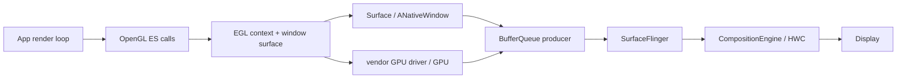
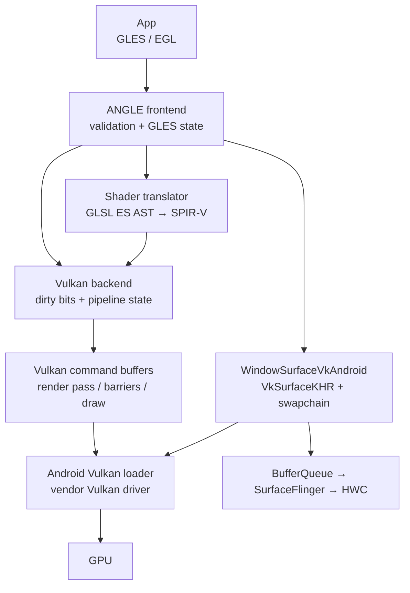
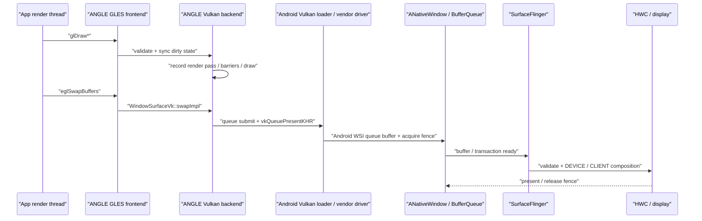

# OpenGL ES、EGL 与 ANGLE

OpenGL ES（GLES）定义应用如何向 GPU 描述绘制，EGL 则把 GLES context 与 Android `Surface` 对应的 native window 连接起来。应用发出 draw call 之后，GPU 开始或完成执行、window buffer 进入 BufferQueue、SurfaceFlinger 选中新内容，以及 HWC present，是四个不同的时间边界。

本文的平台基线是 `android-17.0.0_r1`，内核基线是 `android17-6.18-2026-06_r6`。厂商 EGL/GLES 驱动、GPU job scheduler（硬件任务调度器）和 Composer 实现并不由 AOSP 统一提供。分析调用阻塞与硬件完成时刻时，还必须使用目标设备的 trace 补足证据。

EGL 负责显示连接、上下文和 Surface，OpenGL ES 提交图形命令；ANGLE 在兼容入口下把 GLES 翻译为 Vulkan。两条路径共享应用 API 的一部分，但驱动、同步和着色器处理不同。

## EGL 上下文、Swap 与 GLES 提交

### 核心架构

#### EGL 对象与 Android Surface

EGL 是 GLES 与 native window system 之间的绑定层。阅读代码时要分清三个核心对象：

- `EGLDisplay`：连接 EGL 实现的句柄，用于查询配置和创建资源；名称中的 Display 不代表某块物理屏幕。
- `EGLContext`：保存 GLES 状态与资源命名空间。共享 context 可以共享部分 GL 对象，但线程绑定、同步和资源生命周期仍由应用管理。
- `EGLSurface`：context 的 draw/read target（绘制或读取目标）。window surface 连接 `ANativeWindow`，pbuffer 等 surface 则用于离屏渲染。

Android `Surface` 可以通过 JNI/NDK 转换为 `ANativeWindow`。AOSP 的 `android::Surface` 实现 native window 接口，并把 dequeue/queue 请求转交给 BufferQueue Producer；EGL window surface 由此取得可供 GPU 写入的 GraphicBuffer。

下面的结构图用于区分 API、承载对象与显示后半段：



图中 GPU 与 BufferQueue 之间的箭头表示 buffer 内容会连同 GPU 完成依赖一起交付，并不表示 GLES draw call 会直接调用 SurfaceFlinger。

#### GLES 是 Producer，承载方式要另行确认

GLES 只描述内容的生产方式，不决定内容由哪种 Android 组件承载。常见组合包括：

- `GLSurfaceView`：该类继承 `SurfaceView`，GLThread 向独立的 child Surface 提交内容；
- 原生 EGL + `SurfaceView`/GameActivity/NativeActivity：应用自行维护 render loop（渲染循环）和 window lifecycle；
- EGL 写入由 TextureView 的 SurfaceTexture 创建的 `Surface`：GLES 输出先成为 TextureView 输入，之后还要由宿主 HWUI 采样；
- pbuffer、FBO（Framebuffer Object，帧缓冲对象）、HardwareBuffer 等离屏目标：结果未必直接显示，还要确认后续 Consumer。

使用 Perfetto 确认拓扑时，要同时回答两个问题：谁发出 GLES 工作，EGLSurface 又连接到哪个 Consumer。看到 `eglSwapBuffers()` 只能证明某个 EGL surface 执行了 swap；还要确认目标 native window 属于独立可见 Surface、TextureView 输入还是其他消费者，不能据此推断 SurfaceFlinger 中一定存在独立的 SurfaceView layer。

#### GLSurfaceView 的 GLThread

Android 17 的 `GLSurfaceView` 在调用 `setRenderer()` 后启动 `GLThread`。该线程负责：

- 创建和销毁 EGLContext 与 EGLSurface；
- 在 Surface 可用、尺寸非零并且没有暂停时调用 Renderer；
- 执行 `onSurfaceCreated()`、`onSurfaceChanged()`、`onDrawFrame()`；
- 调用 `EglHelper.swap()`，后者进入 `eglSwapBuffers()`；
- 处理 `EGL_CONTEXT_LOST`、无效 Surface、pause/resume、detach 和重建。

渲染回调不在应用主线程执行，但生命周期和输入状态仍从主线程传入。SurfaceHolder 创建或销毁、View attach/detach、`onPause()`/`onResume()`、`queueEvent()` 与业务状态同步不当，仍可能导致 GLThread 停止、重建，或者读取旧状态。独立线程只隔离执行队列，并不会隔离 UI 状态、Surface 生命周期或显示资源。

`EGLContext` 同一时刻只能 `current` 到符合 EGL 规则的线程/surface 组合。多线程资源加载如果使用共享 context，还需要显式同步 GL 资源的可见性；Java 线程的执行先后本身无法保证 GPU 资源已经可用。

### 渲染循环时序

#### Continuous 与 When Dirty

`GLSurfaceView` 有两种 render mode：

| 模式 | `GLThread.readyToDraw()` 的触发 | 适合场景 | 风险 |
|---|---|---|---|
| `RENDERMODE_CONTINUOUSLY` | Surface/context 就绪后持续满足绘制条件 | 游戏、持续动画、相机特效 | 未做 pacing（提交节奏控制）时容易过量提交，增加功耗与排队 |
| `RENDERMODE_WHEN_DIRTY` | `requestRender()` 把 `mRequestRender` 设为 true | 静态图表、事件驱动更新 | 业务漏发请求会停在旧帧，过晚请求会错过目标周期 |

Continuous 模式下，`GLThread` 默认不会由 `Choreographer#doFrame()` 逐帧直接唤醒。它会持续执行 draw/swap，实际节奏可能受 swap interval、BufferQueue backpressure（消费者较慢形成的背压）、驱动、Swappy 或业务 scheduler 约束。When Dirty 只规定收到请求后才绘制；请求本身可以来自 Choreographer、传感器、网络或任意线程。

#### 一帧的 CPU、GPU 与显示边界

下面的时序图以 `GLSurfaceView + SurfaceView` 为例；若 EGLSurface 连接 TextureView 或离屏目标，swap 之后的 Consumer 会不同：

```mermaid
sequenceDiagram
    participant Loop as "GLThread / app render loop"
    participant EGL as "EGL + vendor driver"
    participant BQ as "ANativeWindow / BufferQueue"
    participant GPU as "GPU queue"
    participant SF as "SurfaceFlinger"
    participant HWC as "Composer / Display"

    Loop->>Loop: "sample input / update / onDrawFrame"
    Loop->>EGL: "GLES draw calls"
    EGL->>GPU: "submit command work"
    Loop->>EGL: "eglSwapBuffers"
    EGL->>BQ: "queue current buffer + producer fence"
    BQ->>SF: "buffer update + acquire fence"
    SF->>SF: "transaction readiness / select new or old buffer"
    SF->>HWC: "validate / present"
    HWC-->>SF: "present fence + per-layer release fence"
    SF-->>BQ: "release dependency"
    BQ-->>EGL: "future dequeue returns reusable buffer + fence"
```

draw call 返回通常只说明命令已经记录或交给驱动。`eglSwapBuffers()` 返回则通常说明当前 image 已按 EGL/驱动规则交给 window system，无法证明 GPU 工作已完成、SurfaceFlinger 已 latch（为本次合成选中）该 buffer、HWC 已 present，或者面板已经扫描到该帧。

#### frame pacing 与 queue-stuffing

如果 render loop 按最大速度持续提交，就可能在消费者释放 buffer 前积累多个 in-flight frame（已经开始、尚未完成显示的帧）。队列到达高水位后，线程会周期性阻塞在 swap 或下一次 dequeue。此时显示帧率可能仍然稳定，但输入状态采自更早的帧，触控到显示时延会随排队增长。

Frame Pacing library 中的 Swappy 属于 AGDK 库，不在 `android-17.0.0_r1` 平台源码内。GLES 入口 `SwappyGL_swap()` 包装 `eglSwapBuffers()`，综合 Choreographer、presentation timestamp 和 sync fence 控制提交节拍。看到 Swappy 主动等待时，应同时比较目标 present、队列深度和输入时延；这段等待可能是在避免 queue-stuffing，即生产端持续把过多帧塞进队列。

业务自研 pacing 也应区分：

- 内容目标帧率：应用希望按何种 cadence（节奏）生成新内容；
- Display refresh-rate hint：`Surface.setFrameRate()`/native window frame-rate API 向系统提供的显示模式选择提示；
- submit timing：当前帧应在哪个显示周期的截止点前交付；
- in-flight 数量：CPU、GPU 和 BufferQueue 中允许同时存在多少个尚未完成的帧。

只修改 refresh-rate hint，不会自动调整输入采样时刻、提交节拍或队列深度。

### eglSwapBuffers 详解

#### Android 17 的分发边界

AOSP `libEGL` 的 `eglSwapBuffersImpl()` 会进入 `eglSwapBuffersWithDamageKHRImpl()`。平台层先验证 display/surface，处理 surface metadata 和 damage（本帧更新区域），再把调用分发给已经选中的 EGL 实现：

- native GLES 路径进入厂商 EGL 实现；
- ANGLE 路径进入 ANGLE 的 EGL；
- 扩展可用时，带 damage 的调用进入 `eglSwapBuffersWithDamageKHR()`；扩展不可用时使用普通 swap。

AOSP wrapper 只覆盖平台分发边界，不包含完整的 swap 实现。dequeue 的具体时机、GPU flush/submit、swap interval 和 fence 生成通常位于 ANGLE 或厂商驱动中。因此，`eglSwapBuffers()` 没有一条适用于所有设备的固定内部调用栈。

调用的职责可用下面的概念骨架理解：

```text
eglSwapBuffers(display, windowSurface)
  validate EGL objects
  propagate metadata / damage when supported
  enter selected EGL implementation
    complete or submit rendering for current image
    hand current image and producer completion dependency to ANativeWindow
    obey swap interval / pacing / available-buffer constraints
```

这份骨架只标出职责，不保证 dequeue 一定发生在 swap 函数的某一行。部分实现可能提前取得下一块 buffer，也可能等到后续渲染开始时再处理。

#### swap 很长代表什么

`eglSwapBuffers()` 的 wall time 可能包含：

- 应用/驱动尚未提交完当前命令；
- 驱动内部串行执行或 GPU queue 限制；
- 没有可用 BufferQueue slot；
- 返回的旧 buffer release fence 尚未满足；
- swap interval 或 presentation timestamp 等待；
- Swappy/引擎的 pacing 等待；
- Surface resize、重分配、context/surface 错误恢复；
- ANGLE 状态处理和 Vulkan backend 工作。

因此，swap 耗时较长不能直接归因于 GPU shader，也不能预设大部分时间都花在 dequeue。需要把线程状态、子 slice、BufferQueue、fence、GPU stage 和 pacing marker 放在同一条时间轴上。

#### damage 与 buffer age

`eglSwapBuffersWithDamageKHR()` 可以把本帧更新区域传给 window system；`EGL_EXT_buffer_age`/平台 buffer age 则帮助应用判断 back buffer 中哪些区域仍保留有效旧内容。只有 renderer 正确保留旧内容并计算 damage 时，这两项机制才能安全减少工作。

局部 damage 可能减少 tile/load/store 或后续合成工作，但系统不一定只读取指定矩形，HWC composition type 也可能变化。旋转、缩放、透明混合、颜色处理和设备实现都可能扩大最终有效的 damage 区域。

#### 错误与生命周期

`GLSurfaceView` 对 swap 返回值做了明确区分：

- `EGL_SUCCESS`：本次 swap 调用成功，可以进入下一轮；
- `EGL_CONTEXT_LOST`：销毁并重建 context/surface，Renderer 需要在 `onSurfaceCreated()` 中重建 GL 资源；
- 其他错误：将 Surface 标记为 bad，等待生命周期变化后恢复。

原生 EGL 集成同样必须处理 `EGL_BAD_SURFACE`、context lost、窗口销毁和尺寸变化。只在 Activity `onResume()` 时创建一次 EGLSurface，无法覆盖 Surface 在 Activity 仍存活时被单独替换的情况。

### Buffer 流转与 Triple Buffering

“Triple Buffering”标题沿用目录名称，但 GLES window surface 并不存在适用于所有设备和模式的固定三 buffer 规则。

`BufferQueueCore` 根据 `mMaxDequeuedBufferCount`、`mMaxAcquiredBufferCount`、async/non-blocking 状态和配置上限计算可用数量。slot 是记录 buffer 所有权和状态的槽位，slot 表容量不等于同时分配的 GraphicBuffer 数量；EGL 实现、shared buffer mode、Consumer 和应用设置都可能改变活跃 buffer 的数量。

通用所有权可以简化为：

```text
FREE → DEQUEUED → QUEUED → ACQUIRED → FREE
          EGL/App          BLAST/SF/HWC
```

状态回到 FREE 时，前序 Consumer 的硬件工作未必已经完成。dequeue 返回的 fence 可能仍要求 Producer 在写入前等待；queue 当前 buffer 时，Producer 又会把 GPU 的完成依赖交给 Consumer。

#### 为什么 buffer 数量影响吞吐与时延

较少的 buffer 会更早把显示背压传回 Producer，缩小排队空间，但可能让 CPU/GPU 更容易等待。较多的 buffer 能吸收短时抖动，也允许更多帧同时处于处理中，从而增加图形内存占用和输入时延。选择时应衡量目标设备上的稳定帧率、时延、内存和功耗，不能以“GLES 默认三缓冲”为前提跳过分析。

#### 诊断等待

Producer 在 dequeue/swap 中等待时，依次核对：

1. 是否达到最大 dequeued/outstanding 限制；
2. 是否没有可用 slot；
3. Consumer 是否仍 ACQUIRED；
4. per-layer release fence 是否迟到；
5. buffer 是否因尺寸/格式变化重分配；
6. swap interval 或 pacing 是否有意等待；
7. Surface 是否正在重建或不可见。

只有同时出现队列长期处于高水位、Producer 持续按最大速度提交、swap/acquire 周期性等待和输入时延上升，才能构成 queue-stuffing 的完整证据。

### Fence 机制

#### dequeue fence：旧消费者何时完成

Android `Surface::dequeueBuffer()` 从 `IGraphicBufferProducer` 取得 slot、GraphicBuffer 和 fence fd。这个 fence 说明前序 Consumer 何时停止读取该 buffer；Producer 在安全写入前必须满足这项依赖。调用线程仍阻塞在 dequeue，以及 dequeue 已返回但 fence 尚未 signal，是两个不同阶段，要分别观察。

#### queue fence：新 Producer 何时写完

GLES 驱动可以把 GPU 尚未完成写入的 buffer 连同完成 fence 一起 queue 给 BufferQueue。对 SurfaceFlinger/BLAST 而言，这项依赖就是 acquire fence：合成路径真正读取像素前必须保证它已经满足。允许 unsignaled latch 的受限路径也不会消除硬件读取依赖。

HWC/Display 完成读取后会产生 per-layer release fence，并沿 SurfaceFlinger/BufferQueue 返回后续 dequeue。present fence 则描述一次 Display present 的显示栈同步边界，属于整个 Display，不是某块 GLES back buffer 的 Producer completion fence。

#### EGL sync 与平台 buffer fence

应用可以用 `EGL_KHR_fence_sync`、`EGL_ANDROID_native_fence_sync` 等扩展建立额外同步，但必须先查询当前实现是否支持对应 extension。三种操作的语义不同：

- `eglClientWaitSyncKHR()` 让调用方在 CPU 上等待；
- `eglWaitSyncKHR()` 或相关能力可以把依赖放入 GPU 命令流；
- `eglDupNativeFenceFDANDROID()` 导出 native fence fd，其所有权按扩展规则转移。

创建 sync 后，如果需要保证前序 GL 命令已经送入驱动，还要按扩展要求执行 flush。导出 fd 和让 CPU 阻塞等待是两种不同操作，不能混为一个同步步骤。普通 window swap 的平台 fence 通常由 EGL/驱动与 ANativeWindow 的集成层维护，应用无须为每一帧手工导出 fence，再交回同一个 Surface。

#### kernel 边界

在 `android17-6.18-2026-06_r6` 中：

- `drivers/dma-buf/dma-buf.c` 提供跨子系统共享 buffer 的基础机制；
- `drivers/dma-buf/sync_file.c` 把 fence 暴露为 fd（文件描述符）；
- `drivers/dma-buf/dma-fence.c` 提供 signal、callback 与 wait 原语。

common kernel 只能解释通用同步语义。某项 Adreno、Mali、Immortalis 或其他 GPU 工作何时完成，仍取决于厂商驱动的 job scheduler、频率、抢占、内存和硬件队列。

### ANGLE 路径

ANGLE 可以让应用继续调用 GLES/EGL，同时把命令翻译到 Vulkan 等 backend。应用可见的提交点仍是 `eglSwapBuffers()`，底层则可能出现 Vulkan command buffer、queue submit、pipeline cache 和 Vulkan 驱动工作。

ANGLE 不会因为某个 Android 版本而在所有应用中强制启用。实际选择会受到设备配置、开发者选项、应用 manifest、graphics driver 包、系统属性和厂商策略影响。Android 15 提供 ANGLE 开发者测试入口。Android 17 新增 manifest 元数据 `com.android.graphics.driver.prefer_angle=true`，用于表达应用对 ANGLE 的偏好；`GraphicsEnvironment#queryAngleChoice()` 仍可能因为平台选择优先级、denylist（禁用名单）、essential-tier、低内存设备、旧 vendor API 或 ANGLE 不可用，而保留或改用 GPU 厂商 GLES 驱动。该元数据只是偏好信号，无法证明当前进程正在使用 ANGLE。

#### 怎样确认 backend

建议组合以下证据：

- `glGetString(GL_VENDOR/GL_RENDERER/GL_VERSION)` 和 EGL vendor/version；
- Graphics Driver/ANGLE 日志和包选择信息；
- 进程已加载库；
- Perfetto/atrace 中 ANGLE marker、Vulkan driver queue 和 GPU submission；
- 同一设备上 native/ANGLE 的 A/B trace。

看到 `vkQueueSubmit()` 只能说明进程中存在 Vulkan 工作，应用也可能同时运行其他 Vulkan 模块。要确认 ANGLE 路径，必须把该次 submit 与 GLES frame、ANGLE context 和目标 Surface 对齐。

#### 分段归因

ANGLE 性能应拆成：

1. 应用 GLES 调用与状态切换；
2. ANGLE validation、state tracking、shader/pipeline 转换与缓存；
3. Vulkan driver 与 GPU 执行；
4. window swap、BufferQueue 与显示后半段。

大量细碎状态切换、同步 shader 编译或 pipeline cache 未命中，可能增加 ANGLE 的 CPU 成本；在另一台设备上，也可能因为 Vulkan 驱动更稳定而获得收益。因此，要用目标设备的 A/B 数据判断，不能预设 ANGLE 一定更快或更慢。

### Trace 视角

#### 从目标 Surface 找 Producer

先在 SurfaceFlinger layer tree 中找到主体画面对应的可见 Surface，再回到应用进程定位管理该 Surface 的 render thread。`GLThread <id>` 是 `GLSurfaceView` 的常见线程名，原生引擎可能使用 Render、RHI（Render Hardware Interface，渲染硬件接口）或自定义名称。线程名只能作为线索；`eglMakeCurrent()`、GLES marker、swap 和 BufferQueue connection 更可靠。

每帧建议标出：

```text
input sample
→ logic/update
→ GL command preparation
→ driver submit / GPU start-end
→ eglSwapBuffers
→ BufferQueue queue
→ SF selects/latches buffer
→ HWC validate/present
→ display present feedback
→ per-layer release
```

这条时间线用于避免把 CPU API 返回误认为 GPU 或显示已经完成。缺少某个标准 slice 时，可以用 engine frame id、buffer id、frame number、fence 和 FrameTimeline token 补齐关联。

#### 常见等待的证据表

| 现象 | 候选原因 | 应补证据 |
|---|---|---|
| `eglSwapBuffers()` 耗时长 | driver flush、可用 slot、release fence、swap interval、Swappy、Surface 重建 | 线程状态、swap 子 slice、BufferQueue 状态、fence 和 pacing marker |
| GL draw API 的 CPU 时间长 | 状态验证、shader 编译、驱动工作、ANGLE translation | 调用栈、shader/pipeline cache 和 CPU sampling |
| CPU 很快，GPU fence 迟到 | fragment/compute 负载、带宽、overdraw（重复绘制）、驱动队列、温控 | GPU stage/counter、频率、job queue 和 fence signal |
| buffer 已 queue，SF 仍使用旧内容 | acquire fence 未 ready、目标显示时刻未到、layer 不可见、transaction 条件未满足 | layer trace、fence、desired present 和 FrameTimeline |
| SF 已采用新 buffer，present 仍晚 | CLIENT composition、HWC validate、Display 资源竞争 | composition type、RenderEngine、HWC/present fence |
| swap 周期性阻塞且输入延迟升高 | queue-stuffing | pending buffer 数量、in-flight frame 数量和 input→present 时延 |

#### FrameTimeline 与 composition

`GLSurfaceView` 的独立 child Surface 是否具有完整 App FrameTimeline，取决于 Producer 是否传递 frame timeline/desired present 信息，以及 trace 的采集配置。缺少 expected slice 只代表这条预期时间线没有被完整记录，不能说明内容未显示；可以用 buffer frame number、layer latch、HWC present 和 fence 补齐。

GLES 生成的 layer 不一定使用 DEVICE composition。alpha、crop、rotation、scale、HDR/SDR、protected usage、同屏其他 layer 和 HWC 资源都会影响策略。如果 GLES 主体已经由 GPU 渲染，又被 SurfaceFlinger 作为 CLIENT layer 采样进 client target，就会增加一段 RenderEngine 工作和相应带宽。

Android 17 的 HWC 主链路仍要区分 SF 侧的 `presentOrValidate()`、`validate()`、`present()` 与 ComposerHal 的 `*Display()` 调用。`PresentSucceeded` 表示组合调用已经执行 present 并保存 fence，当前流程无须再执行第二次 present；该状态无法证明面板扫描已经完成。

#### GLSurfaceView 与原生 EGL

`GLSurfaceView` 适合单一 Surface、标准生命周期和简化的 EGL 管理。原生 EGL 适合需要多个 surface/context、共享资源、定制 pacing、明确控制错误恢复，或使用引擎自有线程模型的场景。原生实现需要自行处理：

- `ANativeWindow` 引用计数和 SurfaceHolder/NativeActivity 生命周期；
- config/context/surface 创建与销毁；
- context lost 和 bad surface 的恢复；
- 跨 context 资源同步；
- swap interval、frame-rate hint、damage 和 pacing；
- 所有 EGL/GL 错误检查。

原生 EGL 本身不会自动提升性能。它的收益来自更细的控制能力，代价则是应用要承担更多生命周期与同步责任。

#### Android 12—17 边界

| 平台 | 相关变化 | 分析重点 |
|---|---|---|
| Android 12 / API 31 | BLAST/FrameTimeline 成为现代显示诊断基线；刷新率选择继续演进 | 区分 Producer、SF 和 Display 分别在哪一阶段迟到 |
| Android 13 / API 33 | Composer AIDL（稳定的进程间接口定义）成为新主线；Game Mode/FPS intervention 可能限制游戏帧率 | 判断目标帧率时要包含系统 intervention（干预） |
| Android 14 / API 34 | EGL→ANativeWindow→BufferQueue 主结构延续 | 不要寻找虚构的 API 34 swap 重构 |
| Android 15 / API 35 | ARR（Adaptive Refresh Rate，自适应刷新率）能力演进；提供 ANGLE 开发者测试入口；16 KB page-size 兼容进入 native 发布要求 | backend 和 native `.so` 兼容性要分开验证 |
| Android 16 / API 36 | ARR、性能 headroom 和 ADPF 能力扩展；GPU syscall filtering 影响非标准调试/注入路径 | 应用 API 路径与 profiling 工具要分别验证 |
| Android 17 / API 37 | 增加 `com.android.graphics.driver.prefer_angle` manifest 偏好信号；GLES/EGL、ANGLE 与 Vulkan 继续并存 | 检查选择优先级和实际 renderer，不能把驱动偏好写成强制使用 ANGLE |

#### Android 17 源码锚点

- [`GLSurfaceView.java`](https://android.googlesource.com/platform/frameworks/base/+/refs/tags/android-17.0.0_r1/opengl/java/android/opengl/GLSurfaceView.java)：GLThread、render mode、Renderer 回调、swap、pause/resume 和 context lost；
- [`GraphicsEnvironment.java`](https://android.googlesource.com/platform/frameworks/base/+/refs/tags/android-17.0.0_r1/core/java/android/os/GraphicsEnvironment.java)：ANGLE driver 选择优先级、denylist 与 API 37 manifest 偏好信号；
- [`egl_platform_entries.cpp`](https://android.googlesource.com/platform/frameworks/native/+/refs/tags/android-17.0.0_r1/opengl/libs/EGL/egl_platform_entries.cpp)：libEGL validation、damage、native/ANGLE 分发；
- [`Surface.cpp`](https://android.googlesource.com/platform/frameworks/native/+/refs/tags/android-17.0.0_r1/libs/gui/Surface.cpp)、[`Surface.h`](https://android.googlesource.com/platform/frameworks/native/+/refs/tags/android-17.0.0_r1/libs/gui/include/gui/Surface.h)：ANativeWindow、dequeue/queue、buffer age 与 fences；
- [`BufferQueueCore.cpp`](https://android.googlesource.com/platform/frameworks/native/+/refs/tags/android-17.0.0_r1/libs/gui/BufferQueueCore.cpp)、[`BufferQueueProducer.cpp`](https://android.googlesource.com/platform/frameworks/native/+/refs/tags/android-17.0.0_r1/libs/gui/BufferQueueProducer.cpp)：buffer 数量、slot 和背压；
- [`BLASTBufferQueue.cpp`](https://android.googlesource.com/platform/frameworks/native/+/refs/tags/android-17.0.0_r1/libs/gui/BLASTBufferQueue.cpp)、[SurfaceFlinger FrontEnd](https://android.googlesource.com/platform/frameworks/native/+/refs/tags/android-17.0.0_r1/services/surfaceflinger/FrontEnd/)、[`HWComposer.cpp`](https://android.googlesource.com/platform/frameworks/native/+/refs/tags/android-17.0.0_r1/services/surfaceflinger/DisplayHardware/HWComposer.cpp)：buffer transaction、layer state、composition 和 present；
- [`dma-buf.c`](https://android.googlesource.com/kernel/common/+/refs/tags/android17-6.18-2026-06_r6/drivers/dma-buf/dma-buf.c)、[`sync_file.c`](https://android.googlesource.com/kernel/common/+/refs/tags/android17-6.18-2026-06_r6/drivers/dma-buf/sync_file.c)、[`dma-fence.c`](https://android.googlesource.com/kernel/common/+/refs/tags/android17-6.18-2026-06_r6/drivers/dma-buf/dma-fence.c)：共享 buffer 和 fence fd；
- [Android Frame Pacing](https://developer.android.com/games/sdk/frame-pacing)、[ANGLE for Android](https://chromium.googlesource.com/angle/angle/+/HEAD/doc/DevSetupAndroid.md)：库级 pacing 和 backend 的验证边界。

相关章节：

- [13.3 SurfaceView 与 TextureView 渲染管线](03-surfaceview-textureview-pipelines.md)
- [13.5 Vulkan 原生管线与 HWUI 多队列](05-vulkan-hwui-multi-queue.md)
- [2.8 BufferQueue、Gralloc 与 Sync Fence](../../part1-fundamentals/ch02-rendering/08-bufferqueue-gralloc-sync-fence.md)
- [2.7 GPU 渲染与图形 API 选型](../../part1-fundamentals/ch02-rendering/07-gpu-rendering-graphics-api.md)


## ANGLE 选择、翻译与同步

GLES 直接驱动路径明确后，ANGLE 可以理解为另一套实现后端。启用条件、特性覆盖和同步转换决定兼容性与性能。

本文以 Android 平台 `android-17.0.0_r1` 和同一 tag 的 AOSP `external/angle` 为源码基线，讨论 Android 上最常见的 OpenGL ES/EGL frontend（接收并解释应用 API 的前端）+ Vulkan backend（生成 Vulkan 工作的后端）。ANGLE 也支持其他平台和 backend，但它们不属于本文的 Android runtime path。

从应用接口看，代码仍调用 GLES 和 EGL；向下看驱动接口，ANGLE 会维护 GLES 状态、翻译 shader、记录 Vulkan 命令，并通过 Android Vulkan WSI（Vulkan 与窗口系统的连接层）提交显示。ANGLE 减少的是 GLES frontend 的厂商实现差异，厂商 Vulkan 驱动、GPU 和显示硬件仍然位于执行路径中。

### ANGLE 解决什么问题

Android 应用面对的 GLES 实现来自不同 GPU 厂商、驱动版本和 OEM 集成。即使应用遵守规范，也可能遇到 shader compiler、扩展行为和驱动缺陷方面的差异；如果应用依赖规范未定义的行为，换设备后更容易暴露问题。

ANGLE 提供由 Google 维护的 GLES/EGL 实现，把规范校验、状态跟踪、shader 翻译和大量兼容处理集中在同一套 frontend 中。在 Android 的 Vulkan backend 路径下，设备仍由厂商提供 Vulkan 驱动：

```text
App 的 GLES / EGL 调用
        ↓
ANGLE frontend、状态跟踪、shader translator
        ↓
ANGLE Vulkan backend
        ↓
Android Vulkan loader / vendor Vulkan driver
        ↓
GPU、BufferQueue、SurfaceFlinger、HWC
```

这条路径带来两个直接边界：

- ANGLE 可以绕过部分厂商 GLES frontend 问题，但底层仍依赖厂商 Vulkan compiler、内核 GPU 驱动和硬件。
- ANGLE 能让 GLES 行为更加一致，但不会保证每一种 workload（工作负载）都更快；性能仍要逐场景测量。

使用 ANGLE 的应用仍然通过 GLES API 编程，不能直接操作 Vulkan descriptor、render pass 或 queue；这些对象由 ANGLE backend 管理。如果新引擎需要完整控制 Vulkan 资源、命令和同步，应直接使用原生 Vulkan API。

### 翻译层架构

#### 四层职责

下面的结构图把 API 语义、shader、Vulkan 命令和窗口展示分开。



ANGLE frontend 负责 GLES 对象、错误检查和状态机。Vulkan backend 的 `ContextVk::syncState()` 会读取 GLES dirty bits（自上次同步后发生变化的状态标记），再更新 viewport、blend、depth/stencil、program、texture、vertex array 等 Vulkan 状态，随后准备 pipeline 和 draw。

#### 一个 GLES draw 不一定只对应一个 Vulkan draw

`ContextVk::drawArrays()` 的普通分支会准备状态并记录 draw，但特殊 primitive 和兼容处理可能改变命令形态。例如，`GL_LINE_LOOP` 分支会生成或复用索引数据，再记录 indexed draw；deferred clear（延后执行的清理）、format conversion、framebuffer fetch emulation 和 render-pass 切换，也可能在 draw 前后插入额外命令。

因此，下面这种写法只适合做概念图：

```text
glDrawArrays()  →  ANGLE 状态同步与兼容处理  →  一组 Vulkan 命令
```

因此，不能把每个 GLES 调用一一映射成同名、同数量的 `vkCmd*` 调用。分析 frame capture 时，应按 GLES draw、ANGLE event 和 Vulkan command buffer 三个层级建立关联。

#### GLSL ES 到 SPIR-V

Android 17 tag 的 `CompilerVk::getTranslatorOutputType()` 返回 `SH_SPIRV_VULKAN_OUTPUT`。下面的源码片段说明 Vulkan backend 选择 SPIR-V translator 输出。

```cpp
ShShaderOutput CompilerVk::getTranslatorOutputType() const
{
    return SH_SPIRV_VULKAN_OUTPUT;
}
```

`CodeGen.cpp` 随后为该 output type 创建 `TranslatorSPIRV`。translator 会处理 GLES 语义、注入 driver uniform（由 ANGLE/驱动维护的统一参数）、改写部分 AST（抽象语法树），并输出 SPIR-V blob。厂商 Vulkan 驱动仍要结合 pipeline state，把 SPIR-V 编译为设备可执行形式。

这段工作发生在 shader 编译、program link、cache 恢复或 pipeline 准备阶段，并不会在每次 `glDraw*` 时都从 GLSL ES 文本重新开始。

### Android 17 的运行时选路

#### 决策发生在应用进程启动阶段

`GraphicsEnvironment.setup()` 会在应用进程初始化图形环境时调用 `setupAngle()`。类注释明确说明，相关 Settings 改动只会影响尚未完成 setup 的进程。因此，每次修改驱动选择后都要停止并重启目标应用；只重建 EGLContext 不会重新执行 Java 侧选路。

`queryAngleChoice()` 在 `android-17.0.0_r1` 中按以下顺序检查：

| 优先级 | 来源 | 结果 |
|:---:|:---|:---|
| 1 | `angle_gl_driver_all_angle=1` | 为后续启动的 Java runtime 应用进程请求 ANGLE |
| 2 | 包名列表与取值列表 | 当前包可指定 `angle`、`native` 或继续默认 |
| 3 | `config_angleAllowList` | 命中包请求 ANGLE |
| 4 | flag 控制的 device/global/dynamic denylist | 命中包改用 native driver |
| 5 | 同一 flag 分支下的 game 策略 | 可由调试属性或设备资源为 game 请求 ANGLE |
| 6 | Android 17 manifest metadata | 满足平台条件时请求 ANGLE |
| 7 | 无匹配项 | 返回 default |

denylist（禁用名单）和 game 分支受 `enableAngleDenyList` 平台 flag 控制。源码中存在该分支，不代表目标设备已经启用。返回 default 后，`setupAngle()` 还会检查 `persist.graphics.egl` 和只读属性 `ro.hardware.egl`；系统也可能把 ANGLE 配置为默认 GL driver。

#### Android 17 manifest 偏好

Android 17 允许应用在 manifest 中请求 ANGLE。下面是官方面向 game 的写法。

```xml
<application
    android:appCategory="game">
    <meta-data
        android:name="com.android.graphics.driver.prefer_angle"
        android:value="true" />
</application>
```

这是偏好信号，不是强制开关。遇到 essential-tier SoC、low-RAM 设备或 `ro.vendor.api_level < 202604` 时，`GraphicsEnvironment` 会跳过该请求；更高优先级的显式选择和 denylist 也会先决定结果。应用仍要在运行时确认实际加载的驱动。

#### ANGLE APK、system ANGLE 与 vendor updatable driver

选择结果要求使用 ANGLE 时，`setupAngle()` 会先调用 `setupAngleFromApk()`，失败后再尝试 `setupAngleFromSystem()`：

1. debuggable 应用或 debuggable 设备可以通过 `angle_debug_package` 指定开发包；
2. 否则根据 `android.app.action.ANGLE_FOR_ANDROID` 查询唯一的 system app；
3. Android 17 的 AOSP manifest 对应包名为 `com.android.angle`；
4. APK 路径不可用时，loader 可以改用 system ANGLE library。

ANGLE package 与 vendor updatable graphics driver 是两套独立机制。前者提供 GLES-over-Vulkan 实现；后者通过 `ro.gfx.driver.*`、独立 linker namespace（动态库加载隔离空间）和厂商 driver package 更新 GLES/Vulkan 驱动。看到 “driver from APK” 时，必须先确认它来自 ANGLE namespace 还是 updatable driver namespace。

EGL loader 的 `attempt_to_load_angle()` 会装入 ANGLE 的 `libEGL`、`libGLESv1_CM` 和 `libGLESv2` 实现。源码注释中的 “ANGLE doesn't ship with GLES library” 是指不提供旧式合并库 `libGLES.so`，并非 ANGLE 不提供 GLES 1/2/3 入口。

#### 用 ADB 做包级 A/B

下面的命令为一个包请求 ANGLE；设置后必须停止并重新启动进程。

```bash
adb shell settings put global angle_gl_driver_selection_pkgs com.example.game
adb shell settings put global angle_gl_driver_selection_values angle
adb shell am force-stop com.example.game
```

测试结束后删除两个列表，避免该调试配置影响后续测量。

```bash
adb shell settings delete global angle_gl_driver_selection_pkgs
adb shell settings delete global angle_gl_driver_selection_values
adb shell am force-stop com.example.game
```

多个包共用列表时，`pkgs` 与 `values` 必须按逗号一一对应；两者长度不同会被 `GraphicsEnvironment` 忽略。量产设备还可能限制 Settings 写入或包级覆盖。命令执行成功只说明配置写入成功，不能证明 ANGLE 已经加载。

### 一帧怎样从 GLES 走到显示

#### Draw 阶段

应用的 render loop 仍然调用 `glUseProgram()`、`glBind*()` 和 `glDraw*()`。ANGLE frontend 先记录 GLES 对象与状态，Vulkan backend 通过 dirty bits 延后处理许多变化，直到 draw、dispatch、clear 等需要实际执行的命令到来时才同步到 Vulkan 状态。

这种延迟处理可以解释一个常见现象：某个看似轻量的 `glDrawArrays()` 在 CPU trace 中耗时很长，时间未必来自 draw 编码本身，也可能包含此前积累的 texture、framebuffer、pipeline 或 shader 准备工作。

#### Swap 阶段

Android 上的 `WindowSurfaceVkAndroid::createSurfaceVk()` 会把 `ANativeWindow` 交给 `vkCreateAndroidSurfaceKHR()`。`eglSwapBuffers()` 进入 ANGLE 的 `WindowSurfaceVk` 后，可能执行：

- 结束或提交当前 render pass；
- 处理 present layout transition；
- 等待或取得下一块 swapchain image；
- 进行 CPU throttle 或 swap interval pacing；
- 由 `Renderer::queuePresent()` 提交 Vulkan present。

下面的时序图刻意保留了 ANGLE、Vulkan WSI 和 Android 显示端的边界。



`vkQueuePresentKHR()` 返回，只说明 present 请求已经处理到 Vulkan WSI 规定的边界，无法证明屏幕已经扫描出该帧。SurfaceFlinger 仍要选择可展示的内容，与 HWC 协商 composition，并完成 Display present。

SurfaceFlinger 接收到的是目标 Layer、buffer、dataspace、damage、几何、时间信息和 acquire fence。对显示系统而言，上游使用厂商 GLES、ANGLE Vulkan 还是原生 Vulkan，并不会改变这些合成输入的基本形式。

### Shader、program 与 pipeline cache

ANGLE Vulkan 路径至少有三层容易被统称为“shader cache”：

| 层级 | 缓存对象 | 主要减少什么 |
|:---|:---|:---|
| ANGLE program/blob cache | 编译、链接后的 program 数据 | 重复的 frontend 翻译和 program 恢复工作 |
| ANGLE graphics pipeline cache | pipeline 描述到 Vulkan pipeline 的映射 | 同一进程内重复的 pipeline 查找与创建 |
| Vulkan pipeline cache data | vendor compiler 可复用的数据 | 驱动侧 pipeline 编译成本，实际收益由驱动决定 |

Android 17 tag 中的 `ProgramExecutableVk` 包含 per-program pipeline cache、global cache 合并、warm-up（预热）和序列化分支，具体策略取决于 ANGLE feature 与驱动能力。看到 `VkPipelineCache` 不能证明每次启动都会完整持久化；cache 命中也不会消除全部 CPU 翻译和状态处理成本。

cache 命中仍可能保留：

- GLES 参数校验与对象查找；
- dirty-state 同步；
- descriptor/dynamic state 更新；
- command buffer 记录；
- render-pass 边界和资源 barrier；
- WSI acquire、present 和 fence 等待。

评估首帧和场景切换时，要同时测量 cold（无可用缓存）和 warm（缓存可复用）两种状态：

1. cold：清理应用可控 cache 或使用全新安装，记录 shader compile、program link 和 pipeline creation；
2. warm：保持相同 App、ANGLE package、vendor driver 和资源版本再次运行；
3. 比较相同场景的 CPU slice、GPU stage、present 间隔与 cache 命中情况，不能只比较平均 FPS。

应用更新 shader、ANGLE 更新、vendor driver 更新、GPU 型号变化或 pipeline state 改变，都可能让旧 cache 不再适用。

### Native fence 与 Vulkan 同步

#### server wait：把 sync fd 导入临时 semaphore

`EGL_ANDROID_native_fence_sync` 让 EGL/GLES 与 Android native fence 互操作。Android 17 ANGLE 的 `SyncHelperNativeFence::serverWait()` 会为下一次 Vulkan submit 准备 binary semaphore，并导入一份 duplicated sync fd（复制出的文件描述符）。这里的 server wait 把依赖交给后续 GPU submit，不要求当前 CPU 线程先等 fence 完成。

下面的精简片段保留了 fd ownership 和 submit stage 两个要点。

```cpp
importFdInfo.flags =
        VK_SEMAPHORE_IMPORT_TEMPORARY_BIT_KHR;
importFdInfo.handleType =
        VK_EXTERNAL_SEMAPHORE_HANDLE_TYPE_SYNC_FD_BIT_KHR;
importFdInfo.fd = dup(mExternalFence->getFenceFd());

contextVk->addWaitSemaphore(
        waitSemaphore.get().getHandle(),
        VK_PIPELINE_STAGE_ALL_COMMANDS_BIT);
contextVk->addGarbage(&waitSemaphore.get());
```

传给 Vulkan import 的 duplicated fd 由 Vulkan 同步导入规则接管；`mExternalFence` 持有的原 fd 继续由 ANGLE 管理。temporary import 表示等待完成后，semaphore payload 会恢复到导入前的语义，因此它不是持久共享 semaphore。

#### client wait：调用线程仍在等待

`SyncHelperNativeFence::clientWait()` 会先检查 signal 和 timeout，必要时把等待放入 `UnlockedTailCall`。tail call 在释放 frontend 锁后、对应 EGL API 返回前执行；`SyncHelper::clientWait()` 对 GL sync 使用类似设计。这样可以避免等待期间一直持有 ANGLE 全局/display 锁，但调用线程本身仍然阻塞，等待不会自动转移到异步 GPU worker。

该等待使用 `poll()`，把纳秒 timeout 转换成毫秒；非零且小于 1 ms 的 timeout 会提升为 1 ms。这里描述的是 ANGLE 用户态的等待方式，fd 的底层同步语义仍由内核 sync_file/dma-fence 提供。内核源码统一参照 `android17-6.18-2026-06_r6` 中的 `drivers/dma-buf/sync_file.c` 与 `drivers/dma-buf/dma-fence.c`。

`serverWait()` 本身没有 `ANGLE_TRACE_EVENT`，因此在 Perfetto 中搜索函数名通常找不到对应 slice。需要结合 Vulkan submit、调用栈采样和后续 GPU 执行确认；`clientWait` 与 `clientWait block (unlocked)` 在 Android 17 tag 中则有 `gpu.angle` event。

### 性能特征与 A/B 方法

#### 成本和收益分别量

| 观察维度 | ANGLE 可能增加的工作 | ANGLE 可能带来的收益 |
|:---|:---|:---|
| CPU frontend | GLES validation、状态映射、命令编码 | 统一实现和一致的错误处理 |
| Shader/pipeline | GLSL ES → SPIR-V、pipeline 准备 | cache、并行编译和持续维护的 workaround（兼容修复） |
| GPU | 兼容 pass、格式转换、额外 barrier | 更合适的 Vulkan 驱动路径或驱动优化 |
| 同步/WSI | acquire、throttle、native-fence 转换 | 较统一的 present 与 fence 实现 |
| 兼容性 | 更严格暴露应用未定义行为 | 避开部分 vendor GLES 缺陷 |

ANGLE 变快或变慢都不能从架构图直接推出。CPU-bound（主要受 CPU 限制）的 GLES 游戏可能受益于更成熟的 Vulkan 驱动，也可能被高频状态切换和 pipeline churn（大量创建或切换 pipeline）拖慢；GPU-bound 场景可能几乎不受 frontend 成本影响，也可能因为兼容 pass 或格式选择改变 GPU 工作量。

#### 公平对比的固定项

对比 native GLES 与 ANGLE 时，至少固定以下条件：

- 设备、系统 build、ANGLE package 和厂商驱动版本；
- 分辨率、刷新率、Game Mode、帧率上限和 thermal 状态；
- 相同场景，以及相同的 shader/texture cache 冷热状态；
- 前台窗口、Surface 尺寸、色彩空间和 swap interval；
- 运行时 backend 证据。

指标应包含 CPU frame time 分布、GPU stage、present-to-present 间隔、1% low（最慢 1% 帧所反映的流畅度）、输入延迟、内存和持续温度。只测几十秒的平均 FPS，容易遗漏 pipeline warm-up 和热降频问题。

#### 常见优化顺序

1. 修正 GLES 未定义行为、shader 编译错误和扩展依赖；
2. 合并没有实际作用的细碎状态切换，减少 program/FBO/texture 反复切换；
3. 控制 shader variant 和 pipeline state 数量；
4. 使用应用与 EGL 提供的 cache 能力，并验证恢复是否命中；
5. 避免同步 readback（GPU 结果回读到 CPU）、无界 `glFinish()` 和过长 client wait；
6. 重新测量 swap、GPU 和 SurfaceFlinger 显示段，确认成本没有转移。

ANGLE 拒绝某段 GLSL ES 时，应先检查 shader 是否符合目标 GLES 版本对 precision、layout、extension 和 link 的约束。依赖厂商驱动宽松行为的代码本身就不具备可移植性，不能直接把问题归为 ANGLE 缺陷。

### 启用检测与调试

#### 三类证据要一致

确认 ANGLE 时，应组合检查配置意图、进程实际加载和 API 字符串三类证据：

| 证据 | 能说明什么 | 局限 |
|:---|:---|:---|
| Settings / manifest / platform resource | 系统为何请求某个 driver | 请求可能失败或被更高优先级覆盖 |
| `/proc/<pid>/maps` 中的 ANGLE library | 目标进程实际装入 ANGLE 实现 | 非 debuggable 进程可能无权读取 |
| `GL_VENDOR`/`GL_RENDERER`、`EGL_VENDOR` | 当前 context/display 的实现标识 | 必须在正确的 context 和线程查询 |
| `gpu.angle` trace event | ANGLE Vulkan backend 正在执行对应代码 | category 未启用时看不到 |

下面的代码在 EGLContext current 后打印 API 字符串。

```cpp
const char* glVendor =
        reinterpret_cast<const char*>(glGetString(GL_VENDOR));
const char* glRenderer =
        reinterpret_cast<const char*>(glGetString(GL_RENDERER));
const char* eglVendor = eglQueryString(eglGetCurrentDisplay(), EGL_VENDOR);

ALOGI("GL_VENDOR=%s", glVendor ? glVendor : "<null>");
ALOGI("GL_RENDERER=%s", glRenderer ? glRenderer : "<null>");
ALOGI("EGL_VENDOR=%s", eglVendor ? eglVendor : "<null>");
```

ANGLE renderer 字符串通常包含 `ANGLE`、vendor、GPU 和 Vulkan 版本信息，但格式不是稳定 ABI。不要依赖固定的逗号位置解析；用于遥测时，应保存原始字符串和系统 build。

debuggable 应用可以用下面的命令检查映射。`run-as` 失败时不要通过放宽系统安全策略来做日常验证。

```bash
pid=$(adb shell pidof -s com.example.game)
adb shell run-as com.example.game \
    sh -c "cat /proc/$pid/maps | grep -E 'lib(EGL|GLES).*angle'"
```

`angle_debug_package` 只对允许加载调试 package 的进程生效。修改后仍要重启目标进程，并核对 ABI、system app/debug app 身份和实际 maps。

#### 回归范围

ANGLE 与 native GLES 都要覆盖：

- GLES 版本和扩展查询；
- external image、camera/video texture；
- protected content 和 wide color/HDR；
- context loss、后台恢复和 Surface 重建；
- shader cache 升级与 driver 更新；
- RenderDoc/AGI 等调试工具注入；
- 32/64 位 ABI 和 Android 15+ 的 16 KB page-size 设备。

不能假设 ANGLE 会提供厂商私有的 `GL_*` 扩展。应用应在运行时查询，并为扩展缺失准备符合规范的替代路径。

### 在 Perfetto 中识别 ANGLE

#### 先证实 backend，再解释 slice

单独出现 `vkQueueSubmit` 或 Vulkan GPU stage，无法证明 GLES 正在通过 ANGLE 运行：原生 Vulkan、HWUI Vulkan 和其他库也会产生 Vulkan 工作。Perfetto 结论应同时具备：

1. 目标进程的 GL/EGL 字符串或已加载 library；
2. `gpu.angle` category 中的 ANGLE event；
3. 同一进程的 Vulkan submit / GPU stage；
4. 对应 App Surface 的 BufferQueue、FrameTimeline 和 Display present。

Android 17 tag 中较有辨识度的 event 包括：

| Event | 说明 | 误读风险 |
|:---|:---|:---|
| `ContextVk::flushAndSubmitCommands` | ANGLE 正在准备或提交 Vulkan 工作 | 无法证明 GPU 已经完成 |
| `CommandQueue::submitCommands`/`queueSubmitLocked` | command queue 提交阶段 | 需要结合线程状态和驱动调用 |
| `WindowSurfaceVk::swapImpl` | EGL swap 的 Vulkan backend 实现 | 范围可能包含 acquire、submit 和 pacing |
| `WindowSurfaceVk::present` | ANGLE 组织 present | 无法证明 Display 已经显示该帧 |
| `acquireNextSwapchainImage` | 取得下一张 swapchain image | 长等待可能是 backpressure / pacing |
| `WindowSurfaceVk::throttleCPU` | ANGLE 主动限制 CPU 超前 | 不能直接标成无效卡顿 |
| `SyncHelperNativeFence::clientWait block (unlocked)` | 调用线程在无 frontend 锁状态等待 | 不是异步 GPU worker |
| `CreateMonolithicPipelineTask`/cache warm-up | pipeline 创建或预热 | 要区分 cold/warm |

具体 event 取决于 build、ANGLE revision 和 trace category。找不到某个名称时，应回到调用栈、API marker 和 buffer 时间；缺少 slice 只能说明没有采集到该事件，不能证明代码没有执行。

#### 用 SQL 限定目标进程

下面的 Perfetto SQL 只列出目标进程中常见 ANGLE Vulkan event，适合确认耗时集中在哪一类操作。

```sql
SELECT
  p.name AS process,
  t.name AS thread,
  s.name,
  ROUND(s.dur / 1e6, 3) AS dur_ms
FROM slice s
JOIN thread_track tt ON s.track_id = tt.id
JOIN thread t ON tt.utid = t.utid
JOIN process p ON t.upid = p.upid
WHERE p.name = 'com.example.game'
  AND (
    s.name GLOB 'WindowSurfaceVk::*'
    OR s.name GLOB 'ContextVk::*'
    OR s.name GLOB 'CommandQueue::*'
    OR s.name GLOB 'SyncHelper*'
    OR s.name GLOB '*Pipeline*'
  )
ORDER BY s.ts;
```

查询结果只能定位 CPU event。GPU 是否繁忙要检查 GPU render stage/counter；buffer 是否显示则要检查 SurfaceFlinger FrameTimeline 和 Display present。

#### 按等待位置归因

| 长段位置 | 优先核对 | 可能的根因 |
|:---|:---|:---|
| shader link/pipeline task | cold/warm、variant、驱动 compiler | shader 或 pipeline churn |
| `syncState` 附近 | 之前积累的 dirty state | 高频 state/FBO/resource 变化 |
| `clientWait block (unlocked)` | 谁创建 fence、timeout、CPU thread state | 显式同步或 readback |
| acquire/throttle | queue depth、release fence、swap interval | CPU 超前、Display backpressure |
| queue submit 后 GPU stage 长 | GPU counter、频率、thermal | shader、带宽、overdraw 或降频 |
| ANGLE present 正常，FrameTimeline 晚 | SF latch、composition、HWC present | 显示端或 acquire fence |

一帧的最小时间线是：App GLES call → ANGLE state/command → Vulkan submit → GPU completion fence → WSI queue → SurfaceFlinger latch → HWC/RenderEngine composition → Display present。任何一段缺少证据，都应明确保留为待验证边界。

### Android 10—17 的版本边界

#### Android 10—14

早期 Android 已具备 ANGLE 集成和包级调试选择能力，但 system image、ANGLE build、device policy 和 OEM 支持差异较大。平台源码中存在开关，只能说明系统具备该机制，不能证明所有零售设备都把 ANGLE 作为常规受支持的 GLES 驱动。

#### Android 15

Android 官方把 ANGLE 描述为 Android 15+ 可选的 GLES-over-Vulkan 层，并提供开发者选项与包级 ADB 测试方式。这是当前进行兼容性和性能 A/B 的公开基线，但不代表所有应用都会默认切换到 ANGLE。

#### Android 16

`GraphicsEnvironment` 注释明确把 `config_angleAllowList` 作为 Android 16 起的平台包名单。Android 17 源码还包含由 flag 控制的 denylist 和 game 默认策略；分析 Android 16 设备时应阅读对应 tag，不能把 Android 17 分支倒推到旧 build。

#### Android 17

Android 17 增加 manifest 请求 `com.android.graphics.driver.prefer_angle`。平台仍保留显式 Settings、platform resource、system property、ANGLE package 和 system ANGLE 多层选择；最终要通过运行时字符串和进程 maps 确认实际结果。

本文的平台行为固定到 `android-17.0.0_r1`，ANGLE 实现也固定到 AOSP `external/angle` 的同一 tag。native fence 的内核语义固定到 `android17-6.18-2026-06_r6`。厂商 Vulkan userspace 与 GPU 内核驱动不在 AOSP 通用源码中，因此设备结论还要记录 vendor build。

### Android 17 源码索引

- [Android 官方 Vulkan / ANGLE 说明](https://developer.android.com/games/develop/vulkan/overview)：Android 15+ 可选 ANGLE、包级 ADB 测试和 Android 17 manifest 请求。
- [`GraphicsEnvironment.java`](https://android.googlesource.com/platform/frameworks/base/+/android-17.0.0_r1/core/java/android/os/GraphicsEnvironment.java)：包级选择、platform resource、manifest 偏好和 APK/system 设置。
- [`Loader.cpp`](https://android.googlesource.com/platform/frameworks/native/+/android-17.0.0_r1/opengl/libs/EGL/Loader.cpp)：system driver、ANGLE namespace 和 updatable driver 的加载边界。
- [`AndroidManifest.xml`](https://android.googlesource.com/platform/external/angle/+/android-17.0.0_r1/android/AndroidManifest.xml)：AOSP ANGLE system package 和 intent action。
- [`CompilerVk.cpp`](https://android.googlesource.com/platform/external/angle/+/android-17.0.0_r1/src/libANGLE/renderer/vulkan/CompilerVk.cpp) 与 [`TranslatorSPIRV.cpp`](https://android.googlesource.com/platform/external/angle/+/android-17.0.0_r1/src/compiler/translator/spirv/TranslatorSPIRV.cpp)：Vulkan backend 的 SPIR-V 输出。
- [`ContextVk.cpp`](https://android.googlesource.com/platform/external/angle/+/android-17.0.0_r1/src/libANGLE/renderer/vulkan/ContextVk.cpp)：dirty-state 同步、draw 和 command submit。
- [`WindowSurfaceVkAndroid.cpp`](https://android.googlesource.com/platform/external/angle/+/android-17.0.0_r1/src/libANGLE/renderer/vulkan/android/WindowSurfaceVkAndroid.cpp) 与 [`SurfaceVk.cpp`](https://android.googlesource.com/platform/external/angle/+/android-17.0.0_r1/src/libANGLE/renderer/vulkan/SurfaceVk.cpp)：Android `VkSurfaceKHR`、swapchain acquire 和 present。
- [`ProgramExecutableVk.cpp`](https://android.googlesource.com/platform/external/angle/+/android-17.0.0_r1/src/libANGLE/renderer/vulkan/ProgramExecutableVk.cpp)：pipeline cache 初始化、warm-up、合并与序列化。
- [`SyncVk.cpp`](https://android.googlesource.com/platform/external/angle/+/android-17.0.0_r1/src/libANGLE/renderer/vulkan/SyncVk.cpp)：native fence、client wait 和 server wait。
- 内核 [`sync_file.c`](https://android.googlesource.com/kernel/common/+/refs/tags/android17-6.18-2026-06_r6/drivers/dma-buf/sync_file.c) 与 [`dma-fence.c`](https://android.googlesource.com/kernel/common/+/refs/tags/android17-6.18-2026-06_r6/drivers/dma-buf/dma-fence.c)：sync fd、signal、callback 和 wait。

## 小结

原生 GLES 与 ANGLE 共享 EGL/ANativeWindow → BufferQueue → SurfaceFlinger/HWC 的显示后半段；差异集中在图形前端和驱动实现：前者进入厂商 GLES，后者把 GLES 状态与 shader 翻译成 Vulkan 工作。`eglSwapBuffers()` 或 `vkQueuePresentKHR()` 返回，都不能证明 GPU 已完成或画面已经上屏。

诊断时应沿应用调用、厂商驱动或 ANGLE 状态处理、GPU submit/fence、队列、latch 与 display present 逐段对齐。归因给 ANGLE 前还要先确认实际 backend，不能仅凭某个 Vulkan slice 下结论。

相关章节：

- [13.5 Vulkan 原生管线与 HWUI 多队列](05-vulkan-hwui-multi-queue.md)
- [13.6 SurfaceControl 与 HardwareBufferRenderer](06-surfacecontrol-hardwarebuffer-renderer.md)
- [13.12 Android 17 游戏引擎渲染链路](12-game-engine.md)
- [2.7 GPU 渲染与图形 API 选型](../../part1-fundamentals/ch02-rendering/07-gpu-rendering-graphics-api.md)
