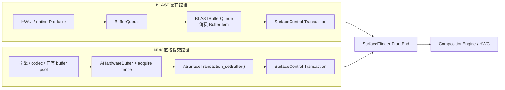
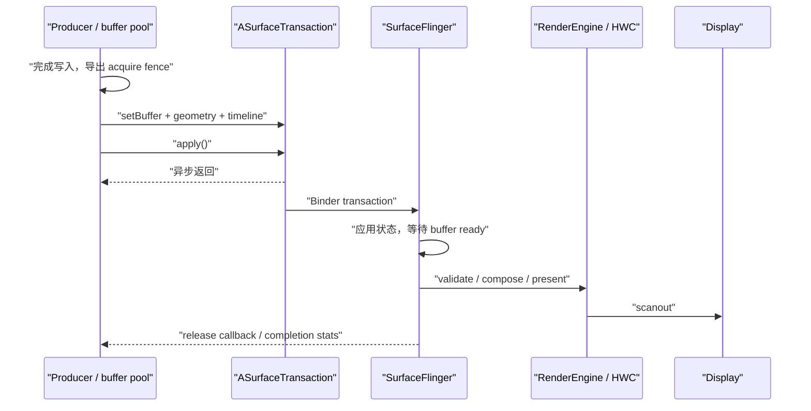

# SurfaceControl 与 HardwareBufferRenderer

本文以 AOSP `android-17.0.0_r1` 为平台源码基线，以 `android17-6.18-2026-06_r6` 为内核基线。`ASurfaceControl` 从 Android 10（API 29）起向 NDK 开放，适合已经拥有原生渲染器、硬件 buffer pool（缓冲池），或者需要管理跨进程嵌入层级的组件。普通 View 页面通常无须绕过 HWUI 直接使用这组 API。

理解 SurfaceControl 时，要把 Layer 节点、像素 buffer、transaction（事务）和同步 fence 分开。`ASurfaceControl` 是 Layer 节点的句柄，`AHardwareBuffer` 携带像素，`ASurfaceTransaction` 收集一批准备原子应用的状态变更，fence 则说明 buffer 何时可以读取或复用。这四类对象有各自的生命周期和所有权，不能相互替代。

SurfaceControl NDK API 让应用直接创建和提交 layer transaction，HardwareBufferRenderer 则把渲染结果写入 HardwareBuffer。组合使用时要管理 buffer 生命周期、fence 和 transaction 提交。

## Layer 创建与 SurfaceControl Transaction

### 核心概念

#### 五类对象各管什么

| 对象 | 职责 | 不负责什么 |
|:---|:---|:---|
| `ANativeWindow` | 面向 Producer 的 dequeue/queue 入口，通常由 Java `Surface` 桥接而来 | 不代表一个新建的 SurfaceFlinger Layer |
| `ASurfaceControl` | 指向可由 transaction 修改的 Layer 节点 | 不提供绘制命令，也不等同于 BufferQueue |
| `ASurfaceTransaction` | 收集一批 Layer 状态，调用 `apply()` 后异步提交 | 不等待该帧真正显示 |
| `AHardwareBuffer` | 持有可在 CPU、GPU、编解码器和合成器间共享的图形内存 | 不包含 acquire/release 时序 |
| sync fence fd | 描述 Producer 写完或 Consumer 用完的同步边界 | 不会延长业务对象或回调上下文的生命周期 |

在 Android 17 的 `frameworks/base/native/android/surface_control.cpp` 中，公开的 `ASurfaceControl*` 会转换为 framework native 的 `SurfaceControl*`，`ASurfaceTransaction*` 会转换为 `SurfaceComposerClient::Transaction*`。它们都是 opaque handle（不透明句柄）：应用只能通过公开函数操作，不能依赖内部字段，也不能把裸指针作为 Binder 参数跨进程传递。

#### 创建的是父节点下面的新 Layer

`ASurfaceControl_createFromWindow(parent, name)` 会从 `ANativeWindow` 取得已有的 SurfaceControl handle，再创建一个以该节点为父节点的新 Layer。原来的 window 不会被转换或替换，新节点也不会复用原 window 的 BufferQueue。Android 17 为新节点设置 `eFXSurfaceBufferState` 标志，因此它可以直接接收 `setBuffer()` 提交的 `AHardwareBuffer`。

已经持有 `ASurfaceControl*` 时，`ASurfaceControl_create(parent, name)` 会在同一个 `SurfaceComposerClient` 连接下创建子节点。两种创建函数都把新引用的所有权交给调用方：失败时返回 `nullptr`，成功后必须配对调用 `ASurfaceControl_release()`。

NDK 创建的节点不能简单套用 “Buffer Layer、Color Layer、Container Layer” 三分法。公开 C API 的创建函数没有 Java `SurfaceControl.Builder` 提供的 layer type 选项。Android 17 中，`ASurfaceTransaction_setColor()` 调用 `setBackgroundColor()`，只设置 buffer 透明区域下方的背景色，并不会新建独立 Color Layer。某个节点可以只组织子树而不提交 buffer，但它仍是这组 NDK 创建函数生成的 buffer-state 节点。

#### Java 与 NDK 句柄桥接

Android 14（API 34）增加了 `android/surface_control_jni.h`：

- `ASurfaceControl_fromJava()` 从有效的 Java `SurfaceControl` 取得一份本地强引用；用完后必须调用 `ASurfaceControl_release()`。
- `ASurfaceTransaction_fromJava()` 返回 Java `SurfaceControl.Transaction` 内部 transaction 的 borrowed pointer（借用指针）；它只在 Java 对象存活且未 `close()` 时有效，调用方不能用 `ASurfaceTransaction_delete()` 释放它。

这两个函数只解决同一进程内 Java 与 native 对象的桥接。跨进程传递仍要通过 Java `SurfaceControl` 的 `Parcelable` 能力、`SurfaceControlViewHost.SurfacePackage` 或系统服务完成。

#### 事务原子性不等于已经上屏

一个 `ASurfaceTransaction` 可以同时修改多个节点。Android 17 头文件保证 transaction 中的更新原子应用，也就是 SF 不会只应用其中一部分；同一线程调用 `apply()` 的多个 transaction 还会按提交顺序应用。这些保证针对 SurfaceFlinger 接收和应用状态的边界，不代表：

- `apply()` 返回时 buffer 已被 latch（选入某次合成）；
- 事务一定赶上调用后的第一个 VSync；
- acquire fence 尚未 signal 的 buffer 可以立即读取；
- 系统会自动识别多个独立 Producer 提交的哪些 buffer 属于同一业务帧。

transaction 提交后还要经过 Binder、SurfaceFlinger 调度、buffer 就绪判断、合成策略选择和 Display present。定位问题时必须继续沿这条时间线追踪，不能在 `apply()` 返回处结束。

### 与 BLAST 的关系

BLAST 与 NDK SurfaceControl 最终都使用 `SurfaceComposerClient::Transaction` 向 SurfaceFlinger 交付 buffer 和 Layer 状态，但入口与 buffer 队列所有者不同。



BLAST 路径通常由 Producer 先通过 BufferQueue `dequeueBuffer()`/`queueBuffer()`，再由 `BLASTBufferQueue` 的 Consumer 取得 `BufferItem`，把 buffer、acquire fence 和几何状态放进 transaction。NDK 直接提交路径不会为调用方创建公开的 BufferQueue；应用把自己管理的 `AHardwareBuffer` 和 fence 直接放入 transaction。

两条路径只在 transaction 层汇合。`ASurfaceControl` 与 `BLASTBufferQueue` 是不同对象，`ASurfaceControl_createFromWindow()` 也不会接管 parent window 的队列。排查时可以通过三个问题区分：

1. Producer 是在调用 `queueBuffer()`，还是直接调用 `ASurfaceTransaction_setBuffer()`？
2. buffer slot 和 release 节奏由 BufferQueue 管理，还是由应用自己的池管理？
3. Perfetto 中要查的是 BLAST queue 的 frame number，还是应用 transaction 中的独立 Layer/buffer？

同一 transaction 中的几何和 buffer 状态具有统一的应用边界，但显示时刻仍受 acquire fence 与调度目标约束。多个 Producer 各自提交 transaction 时，还需要上层同步协议说明哪些 buffer 属于同一业务帧；SurfaceControl 本身不会自动避免跨 Producer 的时序错配。

### 典型使用流程

#### 从 Java Surface 建立子 Layer

下面的 Java 代码只负责把当前有效的 `Surface` 交给 native。`SurfaceView` 生命周期结束或底层 Surface 被替换后，原对象可能失效，因此 native 层也要跟随 `surfaceCreated`、`surfaceChanged` 和 `surfaceDestroyed` 更新资源。

```java
Surface surface = surfaceView.getHolder().getSurface();
nativeCreateChild(surface);
```

native 侧先取得 `ANativeWindow`，再在该 window 对应的 Layer 下创建子节点。下面的代码只展示引用关系，不包含错误处理后的业务回调。

```c
#include <android/native_window_jni.h>
#include <android/surface_control.h>

static ASurfaceControl* g_child;

void nativeCreateChild(JNIEnv* env, jobject javaSurface) {
    ANativeWindow* window = ANativeWindow_fromSurface(env, javaSurface);
    if (window == NULL) {
        return;
    }

    ASurfaceControl* child =
            ASurfaceControl_createFromWindow(window, "native-overlay");
    ANativeWindow_release(window);

    if (child == NULL) {
        return;
    }
    g_child = child;
}
```

`ANativeWindow_fromSurface()` 会增加 window 引用计数，示例在创建子节点后立即释放这份引用。`ASurfaceControl_createFromWindow()` 返回的 child 是另一类资源，只能用 `ASurfaceControl_release()` 释放，不能交给 `ANativeWindow_release()`。

#### 提交 buffer 和几何状态

下面的 C 示例把一块已经由 Producer 写好的 `AHardwareBuffer` 提交给 child。`acquireFenceFd` 为 `-1` 时表示没有需要等待的 fence；大于等于 0 时，调用 `setBuffer()` 后 fd 所有权会转移给 framework，调用方不能再次关闭或复用同一个 fd。

```c
void submitBuffer(
        ASurfaceControl* child,
        AHardwareBuffer* buffer,
        int acquireFenceFd,
        int32_t bufferWidth,
        int32_t bufferHeight,
        int32_t x,
        int32_t y) {
    ASurfaceTransaction* tx = ASurfaceTransaction_create();

    ARect crop = {
        .left = 0,
        .top = 0,
        .right = bufferWidth,
        .bottom = bufferHeight,
    };

    ASurfaceTransaction_setBuffer(tx, child, buffer, acquireFenceFd);
    ASurfaceTransaction_setCrop(tx, child, &crop);
    ASurfaceTransaction_setPosition(tx, child, x, y);
    ASurfaceTransaction_setVisibility(
            tx, child, ASURFACE_TRANSACTION_VISIBILITY_SHOW);

    ASurfaceTransaction_apply(tx);
    ASurfaceTransaction_delete(tx);
}
```

`setCrop()` 和 `setPosition()` 从 API 31 开始可用。如果 `minSdk` 低于 31，需要按运行系统版本选择接口，或者在 API 29—30 使用已废弃的 `setGeometry()` 兼容旧设备。transaction 对象在 `apply()` 后可以删除，但提交到显示系统的工作仍会异步继续。

`AHardwareBuffer` 必须包含 `AHARDWAREBUFFER_USAGE_GPU_SAMPLED_IMAGE`，因为 SurfaceFlinger 可能选择 GPU CLIENT composition。Producer 使用 Vulkan 写入时，还要根据图像用途增加 GPU color output 等 usage；CPU 需要 lock 这块 buffer 时，则要增加相应的 CPU read/write usage。usage 声明哪些模块可以怎样访问内存，fence 只负责访问顺序，二者不能互换。

#### 提交后的系统路径

下面的时序图把 `apply()` 异步返回、buffer 就绪、系统合成和回收通知放在同一条时间线上。



从 `apply()` 到 release 回调之间，Producer 不能根据固定耗时估算 buffer 何时可复用。可靠边界来自 API 36 的 per-buffer release callback，或者 API 29—35 的 transaction completion stats（事务完成统计）。

### 关键 API 详解

#### Android 17 下的公开能力

| API | 级别 | 用途与边界 |
|:---|:---:|:---|
| `createFromWindow()` / `create()` | 29 | 在已有 window 或 control 下创建子节点 |
| `reparent()` / visibility / Z | 29 | 修改树结构、子树可见性和兄弟节点相对层级 |
| `setBuffer()` / color / alpha / dataspace / damage | 29 | 提交像素及合成属性 |
| `setDesiredPresentTime()` | 29 | 请求 transaction 不早于给定时间展示 |
| `setFrameRate()` | 30 | 向系统声明内容帧率，不会替应用控制产帧节奏 |
| crop / position / scale / transform | 31 | 拆分设置几何；优先于已废弃的 `setGeometry()` |
| `setOnCommit()` / backpressure | 31 | transaction 节奏反馈和服务端排队策略 |
| `setFrameTimeline()` | 33 | 把事务关联到 Choreographer 给出的 `vsyncId` |
| `fromJava()` / `clearFrameRate()` | 34 | Java / native 桥接和清除帧率投票 |
| `setDesiredHdrHeadroom()` | 35 | 为标准 HDR 内容声明期望 headroom |
| `setBufferWithRelease()` / LUT | 36 | per-buffer 回收回调和显示用 Look-Up Table（查找表） |

`android-17.0.0_r1` 的公开头文件没有新增标记为 API 37 的 SurfaceControl C 函数。本文以 Android 17 为基线复核所有签名、实现和 SurfaceFlinger 行为，不会把沿用的旧接口误列为 Android 17 新增功能。

#### Buffer、几何和颜色

`ASurfaceTransaction_setBuffer()` 把 `AHardwareBuffer` 与 acquire fence 一起绑定到 Layer。framework 会为已经应用的 buffer 状态持有引用；应用仍要管理自己在 buffer pool 中的引用，并等所有 release 边界完成后才能再次写入。

几何属性的坐标空间容易混淆：

- `setPosition()` 使用父节点的坐标空间；
- `setCrop()` 限制该节点及其子树的可见区域；
- `setScale()` 以 `(0, 0)` 为缩放中心，缩放值必须大于 0；
- `setZOrder()` 只在兄弟节点之间比较，相同 Z 的顺序未定义；
- `setBufferTransform()` 描述 buffer 内容的旋转或翻转，不会移动 Layer 节点本身；
- `setDamageRegion()` 提示哪些内容区域发生了更新，传错可能造成显示错误，或者失去局部更新收益。

`setBufferAlpha()` 使用 premultiplied alpha（颜色通道已经乘过 alpha 的表示）。如果通过 `setBufferTransparency(...OPAQUE)` 声明完全不透明，buffer 范围内每个像素都必须满足该条件；把带透明像素的内容标为 OPAQUE，可能造成错误合成。

`setColor()` 设置背景色、alpha 和 dataspace。带 buffer 的 Layer 还应通过 `setBufferDataSpace()` 描述 buffer 色彩空间；HDR 内容还要按格式提供相应静态元数据或 headroom（高光亮度余量）。这些颜色接口无法修复 Producer 已经写错的像素格式或色域。

#### `OnCommit`、`OnComplete` 与 release callback

| 回调 | API | 能证明什么 | 不能证明什么 |
|:---|:---:|:---|:---|
| `ASurfaceTransaction_OnCommit` | 31 | transaction 已应用，更新已进入可展示状态；后续 transaction 不会再合并进同一帧 | buffer 已释放、present fence 已可读取 |
| `ASurfaceTransaction_OnComplete` | 29 | 包含该 transaction 更新的帧已展示，可以读取 latch/present/previous release 统计 | 所有 previous release fence 都已经 signal |
| `ASurfaceTransaction_OnBufferRelease` | 36 | 对应 `setBufferWithRelease()` 的 buffer 已进入可复用流程 | 回调 fd 大于等于 0 时，fence 已经 signal |

`OnCommit` 会先于 `OnComplete`，适合用作 transaction pacing 的反馈，不适合回收 buffer。在该回调中查询 present fence 或 previous release fence 会失败。

`OnComplete` 传入的 `ASurfaceTransactionStats*` 只在回调执行期间有效。`getPresentFenceFd()` 和 `getPreviousReleaseFenceFd()` 返回的有效 fd 归调用方所有，需要由调用方等待并关闭。`getAcquireTime()` 已废弃，因为回调到达时 acquire fence 仍可能没有 signal；排障时应保留 Producer fence 与提交时间。

API 36 起优先使用 `setBufferWithRelease()`。它把回收通知直接绑定到本次 buffer 提交，应用无须再从“上一块 buffer”的 transaction stats 反推池状态。

#### Backpressure 与丢帧

NDK 创建的节点默认关闭 backpressure（服务端保留每次提交的策略）。在上一块 buffer 的回调到达前继续提交时，新 buffer 可能覆盖尚未展示的旧 buffer。这适合优先降低时延、允许丢弃中间帧的场景。

`ASurfaceTransaction_setEnableBackPressure(..., true)` 要求每个 buffer 在释放前都先展示，服务端可能因此暂存更多提交。它可以保留帧序，也可能增加排队与内存压力。如果引擎已经有可靠的 N-buffer 池和 release pacing，不应只因看到中间帧消失就开启 backpressure；要先判断这些中间帧是否具有业务价值。

### Layer 层级管理

#### 用树描述所有权

下面的结构适合视频编辑器或自绘播放器：视频、字幕和调试信息的更新频率不同，因此各自使用少量独立 Layer。

```text
Host Window
└── Native Container
    ├── Video Buffer Layer      Z = 0
    ├── Subtitle Buffer Layer   Z = 10
    └── Debug Buffer Layer      Z = 20
```

父节点的位置、裁剪和可见性会作用于整个子树。`setVisibility(HIDE)` 会隐藏节点及其后代；`reparent(child, newParent)` 更换 child 的父节点时，其原有后代仍跟随 child；`reparent(child, NULL)` 则让整个子树脱离显示树。

相同 Z 值的兄弟节点顺序未定义，不能依赖创建先后。需要稳定顺序时给出不同 Z 值，并把层级变更和相关几何更新放进同一事务。

#### 跨进程边界

Java `android.view.SurfaceControl` 从 API 29 起实现 `Parcelable`，系统组件可以经 Binder 传递可恢复的句柄，再在目标进程创建本地引用。普通应用嵌入远端 View 时，更常见的公开封装包括：

- 提供方用 `SurfaceControlViewHost` 托管远端 View；
- 接收方取得封装远端 Surface 层级与输入信息的 `SurfacePackage`，并把它附着到 `SurfaceView`；
- API 34 起可用 `SurfaceSyncGroup` 收集参与者的同步结果；
- native 代码需要操作已经传到本进程的 Java control 时，再用 `ASurfaceControl_fromJava()` 桥接。

公开 NDK 没有 `ASurfaceControl_writeToParcel()`。`ASurfaceControl*` 只是当前进程地址空间中的句柄，不能作为跨进程协议传递。跨进程双方还要约定谁创建节点、谁执行 reparent、谁在 Binder death（远端进程死亡）后清理，以及服务退出时如何使 callback context 失效。

#### 销毁分为“离开显示树”和“释放本地引用”

`ASurfaceControl_release()` 只减少调用方持有的本地强引用。Android 17 头文件明确说明，只要父节点仍在显示树中，surface 及其 children 就仍可能留在屏幕上。

需要移除一棵子树时，可以按以下顺序处理：

1. 在 transaction 中隐藏节点，或者调用 `reparent(node, NULL)`；
2. 提交 transaction，并在需要严格确认显示状态时等待 `OnComplete`；
3. 停止 Producer，处理尚未返回的 buffer release；
4. 释放 `ASurfaceControl`、buffer pool 和回调上下文。

这四步分别处理显示树状态、transaction 完成、像素所有权和本地引用。只调用 `release()`，或者只隐藏节点，都无法完成其余三类清理。

#### Layer 数量没有通用阈值

每个独立 buffer Layer 都会增加状态遍历、buffer/fence 跟踪和合成策略输入。HWC 能直接处理多少 Layer，还取决于像素格式、缩放、旋转、alpha、HDR、secure 属性、分辨率和厂商硬件限制，因此不存在“超过 N 层必然 GPU 合成”的通用阈值。

拆分 Layer 时，重点判断两个条件：内容是否需要独立更新节奏，是否需要独立生命周期。如果两个元素总是一起生产、移动和销毁，把它们绘入同一个 buffer 往往更简单。

### FrameTimeline API

#### API 33 才具备完整的 NDK 选择流程

Android 12 引入系统侧 FrameTimeline 诊断能力；NDK 中完整的选择和绑定流程到 Android 13（API 33）才开放，包括 `AChoreographer_postVsyncCallback()`、`AChoreographerFrameCallbackData_*()` 和 `ASurfaceTransaction_setFrameTimeline()`。

VSync callback 会提供多条候选 timeline。每条包含：

- `vsyncId`：用于把 transaction 与 SurfaceFlinger 目标帧关联的标识；
- `expectedPresentationTimeNanos`：预计展示时刻，也可以用于推进动画时钟；
- `deadlineNanos`：buffer 要赶上该次展示所必须满足的就绪期限。

callback data 只在回调执行期间有效，但从中取出的 `AVsyncId`、时间戳和索引值可以保存。选择 timeline 时，既要看业务期望的展示时刻，也要估算渲染能否赶上 deadline。

下面的示例选取一条不早于业务目标、且 deadline 晚于预计完成时间的 timeline。代码省略了 GPU 提交，只展示选择和事务绑定位置。

```c
#include <android/choreographer.h>
#include <android/surface_control.h>

typedef struct FrameContext {
    AChoreographer* choreographer;
    int64_t desiredPresentTimeNanos;
    int64_t predictedReadyTimeNanos;
} FrameContext;

static size_t chooseTimeline(
        const AChoreographerFrameCallbackData* data,
        int64_t desiredPresentTimeNanos,
        int64_t predictedReadyTimeNanos) {
    size_t count =
            AChoreographerFrameCallbackData_getFrameTimelinesLength(data);
    size_t preferred =
            AChoreographerFrameCallbackData_getPreferredFrameTimelineIndex(data);

    for (size_t i = preferred; i < count; ++i) {
        int64_t expected =
                AChoreographerFrameCallbackData_getFrameTimelineExpectedPresentationTimeNanos(
                        data, i);
        int64_t deadline =
                AChoreographerFrameCallbackData_getFrameTimelineDeadlineNanos(
                        data, i);
        if (expected >= desiredPresentTimeNanos
                && deadline >= predictedReadyTimeNanos) {
            return i;
        }
    }
    return count - 1;
}

static void onVsync(
        const AChoreographerFrameCallbackData* data,
        void* opaque) {
    FrameContext* ctx = (FrameContext*)opaque;
    size_t index = chooseTimeline(
            data,
            ctx->desiredPresentTimeNanos,
            ctx->predictedReadyTimeNanos);
    AVsyncId vsyncId =
            AChoreographerFrameCallbackData_getFrameTimelineVsyncId(data, index);

    ASurfaceTransaction* tx = ASurfaceTransaction_create();
    ASurfaceTransaction_setFrameTimeline(tx, vsyncId);
    /* renderFrameAndAttachBuffer(tx, vsyncId); */
    ASurfaceTransaction_apply(tx);
    ASurfaceTransaction_delete(tx);

    AChoreographer_postVsyncCallback(
            ctx->choreographer, onVsync, ctx);
}
```

连续渲染时，每次 callback 都要再次注册下一帧。`AChoreographer_getInstance()` 必须在带有 `ALooper`（NDK 消息循环）的线程中调用。示例假定 callback 至少提供一条 timeline；工程代码还要处理上下文销毁、渲染取消和 buffer 提交失败。

`setFrameTimeline()` 已经把 transaction 关联到候选 timeline 的 expected presentation time 和 deadline，无须机械地把同一个 expected time 再填入 `setDesiredPresentTime()`。后者是 API 29 起的独立调度请求，适用于没有 `vsyncId`，或者业务明确要求“不早于某时刻”展示的场景。如果同时使用两个请求，应保证它们的目标一致；过期或无效的 `vsyncId` 会被忽略。

`setFrameRate()` 也不能替代 FrameTimeline。它只向系统声明内容帧率，可能影响显示刷新率选择；应用仍要通过 Choreographer、swapchain pacing 或 release callback 控制自己的产帧节奏。

#### Trace 中怎样解释 FrameTimeline

FrameTimeline 提供的是“计划”和“结果”的对应关系。分析一帧时至少记录：

| 字段 | 回答的问题 |
|:---|:---|
| expected presentation | 应用选择的目标展示时刻 |
| deadline | buffer 最晚应在何时准备好 |
| actual presentation | 该 SurfaceFrame/DisplayFrame 实际何时展示 |
| present type / jank type | 平台如何归类早、准时或迟到 |
| Layer / token 映射 | 这条 timeline 对应哪个内容对象 |

只有 `vsyncId` 无法解释卡顿。还要把 GPU fence、SurfaceFlinger latch 和 Display present 关联到同一帧。

### Fence 处理与生命周期

#### 一块 buffer 的同步方向

下面的方向图只描述一块 buffer 的读写同步，不表示对象引用关系。

```text
Producer 写入
    │
    ├── acquire fence ──> SurfaceFlinger / HWC 等待后读取
    │
    └── buffer 保持不可复写
                         │
                         └── release fence ──> Producer 等待后复用
```

acquire fence 保证 Producer 写完后 Consumer 才读取，release fence 保证 Consumer 读完后 Producer 才重新写入。两者方向相反，并且都独立于 `AHardwareBuffer` 的引用计数：持有对象引用不代表同步条件已经满足。

调用 `setBuffer()` 或 `setBufferWithRelease()` 后，framework 会接管传入的 acquire fence fd。如果调用方还要保留同一 fence 用于诊断，必须在调用前通过 `dup()` 创建另一份 fd；所有权转移后，不能再关闭或复用原 fd。

内核版本 `android17-6.18-2026-06_r6` 中，`drivers/dma-buf/sync_file.c` 把 dma-fence 暴露为 fd，`drivers/dma-buf/dma-fence.c` 提供 signal、callback 和 wait 原语。这些文件定义通用同步机制，无法单独说明某台设备的 GPU、codec 或 Display fence 为何迟到；归因仍要结合厂商驱动 timeline 和目标 buffer 的所有权。

#### API 36：按 buffer 接收 release

release callback 可能在任意线程执行，不应在回调线程中长时间阻塞。更安全的做法是把 slot 和 fence fd 移交给专门的回收队列。

```c
static void onBufferRelease(void* opaque, int releaseFenceFd) {
    BufferSlot* slot = (BufferSlot*)opaque;
    enqueueForRecycle(slot, releaseFenceFd);
}

void attachBuffer(
        ASurfaceTransaction* tx,
        ASurfaceControl* child,
        BufferSlot* slot,
        int acquireFenceFd) {
    ASurfaceTransaction_setBufferWithRelease(
            tx,
            child,
            slot->hardwareBuffer,
            acquireFenceFd,
            slot,
            onBufferRelease);
}
```

回收线程看到 `releaseFenceFd >= 0` 时，要等 fence signal 后关闭 fd，再把 slot 放回可写队列；值为 `-1` 表示 buffer 已经可以复用。回调上下文 `BufferSlot*` 必须存活到回调执行完毕，组件销毁时要先停止新提交，再排空未完成回调。

Android 17 头文件还规定：如果同一 transaction 中的 buffer 在 `apply()` 前又被一次 `setBuffer()` 替换，被替换 buffer 的回调会立即执行；其他情况会在 buffer 展示后、`OnComplete` 前执行。因此，buffer pool 不能假定每个回调都对应一块已经显示过的 buffer。

#### API 29—35：从完成统计取得上一块 buffer

旧系统使用 `setBuffer()`，并在 `OnComplete` 中调用：

```c
int fd = ASurfaceTransactionStats_getPreviousReleaseFenceFd(stats, control);
if (fd >= 0) {
    enqueuePreviousBufferForRecycle(control, fd);
} else {
    recyclePreviousBufferNow(control);
}
```

该 fd 描述此 Layer 的上一块 buffer。每次把 buffer 应用到某个 surface，framework 都将其视为一次独立引用；同一个 `AHardwareBuffer` 被多次提交时，应用必须等待所有待处理引用释放，不能在第一次 callback 到达后立即复写。

#### 常见错误

| 错误 | 后果 | 修正 |
|:---|:---|:---|
| `apply()` 返回后立即复写 buffer | 撕裂、花屏或同步错误 | 等待 per-buffer callback/previous release fence |
| 把 acquire fd 传入后再次 `close()` | framework 等到无效或复用 fd | 调用前按需 `dup()`，明确所有权转移 |
| 在 `OnCommit` 查询 present / release fence | 查询失败 | 在 `OnComplete` 查询，或使用 API 36 release callback |
| callback context 提前销毁 | use-after-free（释放后继续访问） | 停止提交并排空回调后再销毁池 |
| callback 线程直接长时间等待 | 回调拥塞，后续 release 延迟 | 把 fence 移交给回收线程 |
| 只释放 `ASurfaceControl`，未移除子树 | Layer 仍可能显示 | 先 hide/reparent-null，再释放句柄 |

### 实战场景

#### 自绘引擎与视频编辑器

SurfaceControl 适合把更新节奏不同的少量内容分开：主画面逐帧更新，字幕只在文本变化时更新，调试层只在采样点刷新。引擎负责生产 `AHardwareBuffer`、提交 acquire fence 和处理 release callback；SurfaceFlinger 则把这些 Layer 与其他窗口一起合成。

收益需要同时用应用侧和显示侧数据验证。App GPU 工作减少，不代表显示侧成本也降低；额外 Layer 可能因为缩放、alpha、HDR 或硬件限制进入 CLIENT composition。如果 App RenderThread 负载下降，而 SurfaceFlinger/RenderEngine 负载上升，成本只是转移到了系统合成阶段。

#### SurfaceView 宿主

`SurfaceView` 提供独立 Surface 与 Layer 生命周期。native 组件可以从其 Java `Surface` 取得 `ANativeWindow`，再通过 `createFromWindow()` 创建受宿主裁剪和可见性影响的子节点。宿主销毁或重建 Surface 后，旧 parent handle 已不再代表新树根，不能继续使用。

需要直接向 `SurfaceView` 的 BufferQueue 渲染时，应使用该 `ANativeWindow` 的 EGL/Vulkan/MediaCodec Producer 路径；只有需要在宿主节点下组织额外 Layer 时，才使用 `ASurfaceControl_createFromWindow()`。前者向现有队列生产内容，后者创建新的子 Layer，两者是不同操作。

#### WebView

标准 WebView 主体通常由 Chromium 准备 compositor frame（合成器帧），再通过宿主进程的 HWUI functor 合入 App Window buffer。renderer 进程独立，只说明内容生产跨进程，不能证明网页主体拥有独立 SurfaceFlinger Layer。

视频、受保护内容或 provider 选择的 overlay 可能产生额外 SurfaceControl Layer。判断设备上的真实路径时，要检查 WebView provider revision、SurfaceFlinger Layer 树、宿主 RenderThread 和媒体 Producer；仅看到 Viz/Compositor 线程，不足以证明网页已经独立合成。

#### 画中画与系统动画

进入 PiP 时，WindowManager Shell 通常持有任务 leash（承载过渡动画属性的临时父 Layer）和 PiP container，并通过 Java/framework transaction 修改位置、裁剪、圆角和层级。普通应用负责提交视频内容，但不能通过公开 NDK API 把自己的 Layer 任意 reparent 到系统私有容器。

分析 PiP 卡顿时应分开看：

- Shell / WMS 的几何事务是否按时；
- 视频 Producer 的 buffer 与 acquire fence 是否按时；
- PiP 圆角、阴影和其他窗口是否改变 HWC composition；
- transition 结束后旧 leash / Layer 是否被清理。

旧 buffer 与新几何同时生效时，可能出现拉伸或黑边。内容迟到与动画 transaction 迟到要按 token 和 Layer 分开定位。

#### 跨进程 View 与 Flutter Platform View

分析跨进程 View 时，应优先从 `SurfaceControlViewHost`、`SurfacePackage` 和 `SurfaceSyncGroup` 的公开生命周期入手。Flutter Platform View 可能使用 hybrid composition（原生 View 与 Flutter 内容分层合成）、Texture 路径或 SurfaceProducer，实际拓扑会随 Flutter engine、Android 版本和插件实现变化。框架名称本身无法说明是否存在独立 SurfaceControl Layer。

先画出“内容 Producer → 消费位置 → 宿主 buffer 或独立 Layer → SurfaceFlinger”的对象关系，再讨论优化。只按进程名或框架名判断，很容易把应用内的宿主纹理合成误写成系统 overlay。

### Trace 视角

#### 先建内容对象表

分析混合出图时，应以内容对象为单位，不能只按应用名或某一条线程归类。SurfaceControl 场景可以先填写这张表：

| 内容 | Producer | 提交入口 | SF Layer / parent | buffer 标识 | acquire / release | FrameTimeline |
|:---|:---|:---|:---|:---|:---|:---|
| 主画面 | 引擎 RenderThread | `setBufferWithRelease()` | `game-main`/host | pool slot + frame id | GPU → SF/SF → pool | vsyncId |
| 字幕 | UI raster worker | `setBuffer()` | `subtitle` / container | subtitle generation | CPU ready / previous release | 可选 |
| 视频 | codec | `queueBuffer()` 或独立 bridge | `video` / host | codec PTS + frame number | codec → consumer | media timing |

这张表可以发现同名 Layer 已经重建、误用宿主 FrameTimeline 解释独立视频、把 release fence 归到错误 buffer 等问题。

#### 不依赖固定 slice 名称

NDK 的 `ASurfaceTransaction_apply()` 只调用 native transaction 的 `apply()`。Android 17 源码没有承诺一定生成名为 `ASurfaceTransaction_apply` 的 trace slice，`setTransactionState`、`latchBuffer` 等内部 slice 也可能随版本和 trace 配置变化。

应用可以在提交点加入自己的稳定 marker。下面的标记只表示 API 调用边界，不代表 transaction 已 commit 或内容已经显示。

```c
#include <android/trace.h>

ATrace_beginSection("SC submit: subtitle frame=42");
ASurfaceTransaction_apply(tx);
ATrace_endSection();
```

把业务 frame id 写入自定义 marker 后，再用 transaction、Layer、buffer 和 FrameTimeline 数据源向显示端关联。marker 结束时刻只是应用调用返回时间，不能代替 present time。

#### 最小证据链

一次 SurfaceControl 卡顿分析至少覆盖五段：

1. Producer 何时开始和结束写 buffer，GPU/codec fence 何时 signal；
2. 应用何时提交 transaction，该提交是否被后续 transaction 覆盖；
3. SurfaceFlinger 看到哪个 Layer、parent、Z、crop、buffer 和 frame token；
4. 该 DisplayFrame 选择 DEVICE 还是 CLIENT composition，RenderEngine/HWC 花费多少；
5. actual present 和 release fence 何时发生，buffer pool 是否及时恢复可写 slot。

下面的命令用于核对当前 Layer 名称。不同版本的详细 dump 格式可能变化，自动化脚本不应依赖固定列位置。

```bash
adb shell dumpsys SurfaceFlinger --list
adb shell dumpsys SurfaceFlinger
```

Perfetto 配置应包含应用 atrace、线程调度、Binder、gfx/view、SurfaceFlinger、FrameTimeline 和场景所需的 GPU 数据源。厂商 GPU/HWC counter 是否可见取决于设备；缺少 counter 时，要在结论中明确无法验证的硬件阶段。

#### 从现象回到边界

| 现象 | 优先检查 | 不要直接下的结论 |
|:---|:---|:---|
| `apply()` 很快，画面仍晚 | acquire fence、目标 timeline、SF/HWC present | SurfaceControl 没有生效 |
| 中间帧消失 | backpressure、连续 `setBuffer()`、Producer 频率 | SurfaceFlinger 随机丢帧 |
| Layer 数量上升后耗时增加 | parent 树、CLIENT/DEVICE、RenderEngine | 超过固定 Layer 数量上限 |
| WebView renderer 很忙 | renderer/functor/host/media overlay 各自路径 | 网页主体一定是独立 Layer |
| PiP 几何顺、内容卡 | codec buffer、acquire fence、视频 Layer | Shell 动画慢 |
| 内存只增不降 | 未完成 release、buffer pool、旧 Layer/callback context | 单纯 Java heap 泄漏 |

#### Android 17 源码索引

- [`surface_control.h`](https://android.googlesource.com/platform/frameworks/native/+/android-17.0.0_r1/include/android/surface_control.h)：公开 API、级别、fd 所有权和 callback 语义。
- [`surface_control_jni.h`](https://android.googlesource.com/platform/frameworks/native/+/android-17.0.0_r1/include/android/surface_control_jni.h)：API 34 Java/native 桥接及所有权差异。
- [`surface_control.cpp`](https://android.googlesource.com/platform/frameworks/base/+/android-17.0.0_r1/native/android/surface_control.cpp)：NDK 到 `SurfaceControl`/`Transaction` 的实现映射。
- [`SurfaceControl.java`](https://android.googlesource.com/platform/frameworks/base/+/android-17.0.0_r1/core/java/android/view/SurfaceControl.java)：Java Layer 树、`Parcelable` 和 Transaction。
- [`BLASTBufferQueue.cpp`](https://android.googlesource.com/platform/frameworks/native/+/android-17.0.0_r1/libs/gui/BLASTBufferQueue.cpp)：BLAST 消费 BufferQueue 并生成事务的路径。
- [`SurfaceComposerClient.cpp`](https://android.googlesource.com/platform/frameworks/native/+/android-17.0.0_r1/libs/gui/SurfaceComposerClient.cpp)：transaction 状态收集和提交。
- [`SurfaceFlinger.cpp`](https://android.googlesource.com/platform/frameworks/native/+/android-17.0.0_r1/services/surfaceflinger/SurfaceFlinger.cpp) 与 [`FrameTimeline.cpp`](https://android.googlesource.com/platform/frameworks/native/+/android-17.0.0_r1/services/surfaceflinger/Scheduler/FrameTimeline.cpp)：transaction 应用、帧调度和展示结果。
- [`sync_file.c`](https://android.googlesource.com/kernel/common/+/refs/tags/android17-6.18-2026-06_r6/drivers/dma-buf/sync_file.c) 与 [`dma-fence.c`](https://android.googlesource.com/kernel/common/+/refs/tags/android17-6.18-2026-06_r6/drivers/dma-buf/dma-fence.c)：内核 fence fd、signal、callback 和 wait 语义。

相关章节：

- [13.1 Android View 渲染管线与分析方法](01-android-view-pipeline-analysis.md)
- [13.3 SurfaceView 与 TextureView 渲染管线](03-surfaceview-textureview-pipelines.md)
- [13.5 Vulkan 原生管线与 HWUI 多队列](05-vulkan-hwui-multi-queue.md)
- [13.9 Android 17 WebView 渲染管线](09-webview-rendering.md)
- [2.8 BufferQueue、Gralloc 与 Sync Fence](../../part1-fundamentals/ch02-rendering/08-bufferqueue-gralloc-sync-fence.md)
- [2.9 SurfaceFlinger 合成、FrontEnd 与事务队列](../../part1-fundamentals/ch02-rendering/09-surfaceflinger-frontend-transaction.md)


## HardwareBuffer 渲染与提交

SurfaceControl 管理 layer 状态，HardwareBufferRenderer 负责生成可提交内容。两者之间通过 HardwareBuffer 和同步 fence 交接。

### HBR 的问题边界

`Surface.lockCanvas()` 让 CPU 直接绘制到 `Surface`。调用方从 `BufferQueue` 取得可写 buffer，Skia software backend 在 CPU 上完成光栅化（把矢量绘制命令转成像素），`unlockCanvasAndPost()` 再将 buffer 提交回队列。复杂 Path、大尺寸缩放、滤镜或高分辨率离屏内容会消耗较多 CPU 时间，`HardwareBufferRenderer`（HBR）可以处理其中一类需求。

HBR 不能简单理解成 `lockCanvas()` 的硬件加速开关。Android 还提供 `Surface.lockHardwareCanvas()`，它已经使用 HWUI/GPU，输出目标仍是 `Surface`。三者的边界如下：

| API | 光栅化执行者 | 输出目标 | 提交与 buffer 复用 |
| --- | --- | --- | --- |
| `Surface.lockCanvas()` | CPU / Skia software | `Surface` 背后的 buffer | 由 `unlockCanvasAndPost()` 和 BufferQueue 协作 |
| `Surface.lockHardwareCanvas()` | HWUI / GPU | `Surface` 背后的 buffer | 仍沿用 Surface / BufferQueue；每帧必须完整覆盖目标 |
| `HardwareBufferRenderer` | HWUI RenderThread / GPU | 调用方提供的 `HardwareBuffer` | 调用方选择 consumer，并管理 presentation fence、release fence 和 buffer 池 |

HBR 的区别在于，它把一棵 `RenderNode` 场景树光栅化到**调用方拥有的 `HardwareBuffer`**。调用方自行决定这个 buffer 交给 `SurfaceControl`、其他进程、GPU 或媒体 consumer，并负责同步与复用。如果已经有一个正常消费的 `Surface`，需求只是 GPU Canvas，`lockHardwareCanvas()` 或面向 Surface 的 `HardwareRenderer` 通常更合适。

Android 17 的 `Surface.java` 明确规定，`lockHardwareCanvas()` 不保留前一帧内容，调用方每次都要完整覆盖。HBR 在 draw 前**不会自动清空**目标，未被本次绘制覆盖的像素会继续保留；这是局部更新能力，也可能成为残留旧像素的来源。[AOSP: `Surface.lockHardwareCanvas()`](https://android.googlesource.com/platform/frameworks/base/+/refs/tags/android-17.0.0_r1/core/java/android/view/Surface.java) [AOSP: `HardwareBufferRenderer`](https://android.googlesource.com/platform/frameworks/base/+/refs/tags/android-17.0.0_r1/graphics/java/android/graphics/HardwareBufferRenderer.java)

### Android 17 中的实现边界

HBR 是 Android 14 / API 34 加入的 Java API。它复用 HWUI 的基础设施，没有为离屏内容另建一套渲染系统。Android 17 源码给出了以下生命周期约束：

- 所有 `HardwareBufferRenderer` 与 `HardwareRenderer` 共享应用进程中的 RenderThread、GPU context 和 GPU 资源。HBR 的工作量可能与普通 View 硬件渲染争用 RenderThread 和 GPU。
- 进程首次创建 HBR 时可能需要初始化 GPU context，冷启动成本不能混入稳态单帧数据；后续实例通常只承担较小的增量成本。
- 预期用法是每个活动中的 `HardwareBuffer` 对应一个 HBR 实例。连续渲染若有三块 in-flight buffer，通常也维护三个 renderer/slot。HBR 没有把同一 renderer 临时改绑到另一块 buffer 的 API。
- `close()` 只释放 renderer 资源，不会替调用方关闭构造时传入的 `HardwareBuffer`；两个对象各有自己的所有权。
- `setContentRoot()` 会让内部根节点记录一次 `drawRenderNode(content)`。RenderNode 的 display list 保存已经录制的绘制命令；之后修改这棵树的显示列表或属性，不必重复调用 `setContentRoot()`，下一次 render request 会同步最新状态。
- `obtainRenderRequest()` 返回内部复用的请求对象。每次调用都会把 color space 重置为 sRGB、transform 重置为 identity；该对象不是线程安全的，调用 `draw()` 后也不能继续修改或长期持有。

这些行为都能直接在 Android 17 的 [`HardwareBufferRenderer.java`](https://android.googlesource.com/platform/frameworks/base/+/refs/tags/android-17.0.0_r1/graphics/java/android/graphics/HardwareBufferRenderer.java) 中核对。

`draw()` 之后的 native 调用链可以在 `android-17.0.0_r1` 中逐段对应：

1. `RenderRequest.draw()` 调用 `nRender()`。
2. `android_graphics_HardwareBufferRenderer.cpp` 把尺寸、旋转变换、color space 和 callback 写入 `HardwareBufferRenderParams`，再调用 `RenderProxy::syncAndDrawFrame()`。
3. `DrawFrameTask` 同步 RenderNode 树，并让 HWUI pipeline 写入构造时绑定的 `AHardwareBuffer`。
4. pipeline `flush()` 导出 producer fence，JNI 再把对应 fd 包装成 `RenderResult.getFence()` 返回。

HBR 的 JNI 在构造 `UiFrameInfo` 时使用 `INVALID_VSYNC_ID`，因此一次 HBR draw 本身没有关联到有效的 App FrameTimeline VSync。若结果需要按 VSync 上屏，调用方仍要通过 Choreographer 选择目标帧，并在 `SurfaceControl.Transaction` 上设置对应 FrameTimeline。

### 从 RenderNode 到屏幕的完整路径

HBR 只负责下图中间的 GPU 光栅化，buffer 分配、consumer 选择、显示提交和安全复用都由调用方管理：

```mermaid
flowchart LR
    A["记录或更新 RenderNode"] --> B["obtainRenderRequest()"]
    B --> C["draw(executor, callback)"]
    C --> D["RenderThread 同步场景树"]
    D --> E["GPU 写 HardwareBuffer"]
    E --> F["RenderResult: status + presentation fence"]
    F --> G["SurfaceControl.Transaction.setBuffer()"]
    G --> H["SurfaceFlinger 等 fence 后 latch"]
    H --> I["HWC 或 GPU 合成并显示"]
    I --> J["后续 transaction 替换/移除 buffer"]
    J --> K["release callback / release fence"]
    K --> B
```



这里有两个名称相近、方向相反的同步点，分别保护“producer 写完后 consumer 才能读”和“consumer 读完后 producer 才能重写”：

1. **Presentation fence**：由 `RenderResult.getFence()` 返回，表示 producer 的 GPU 写入何时完成。consumer 在读取 buffer 前必须等待它。直接上屏时可将它传给 `Transaction.setBuffer()`，由 SurfaceFlinger 等待，应用无须先阻塞 CPU。
2. **Release fence**：由 `setBuffer(..., releaseCallback)` 的 callback 参数提供，表示 SurfaceFlinger/HWC 何时不再读取这块 buffer。只有该 fence signal 后，producer 才能再次写入。

`draw()` 的 callback 能拿到 `RenderResult`，不代表其中的 `SyncFence` 已经 signal。Android 17 的 API 注释要求先检查 `status == SUCCESS`，consumer 再等待或接收该 fence。若把 callback 到达时间当成 GPU 完成时间，consumer 可能与 GPU 并发访问同一块 buffer。

release callback 也不会在本次 transaction 调用 `apply()` 后立刻触发。Java API 的定义是：**后续 transaction** 替换或移除该 buffer 后，系统通过 callback 交回 release fence；应用要等 fence signal 才能复用。如果一块 buffer 一直作为 layer 当前内容留在屏上，它就仍处于占用状态。

### Java API：一个可核查的提交骨架

下面的代码展示单个 buffer slot 的关键顺序。`surfaceControl`、线程池与 slot 状态机由上层持有；持续渲染时不能只创建一个 slot 然后无条件循环覆写。

```java
long usage = HardwareBuffer.USAGE_GPU_COLOR_OUTPUT
        | HardwareBuffer.USAGE_GPU_SAMPLED_IMAGE
        | HardwareBuffer.USAGE_COMPOSER_OVERLAY;

if (!HardwareBuffer.isSupported(
        width, height, HardwareBuffer.RGBA_8888, 1, usage)) {
    throw new IllegalArgumentException("Unsupported HardwareBuffer configuration");
}

HardwareBuffer buffer = HardwareBuffer.create(
        width, height, HardwareBuffer.RGBA_8888, 1, usage);
HardwareBufferRenderer renderer = new HardwareBufferRenderer(buffer);

RenderNode root = new RenderNode("HbrContent");
RecordingCanvas canvas = root.beginRecording(width, height);
canvas.drawColor(Color.TRANSPARENT, PorterDuff.Mode.CLEAR);
// 记录本帧需要的 drawBitmap / drawText / drawPath ...
root.endRecording();
renderer.setContentRoot(root);

HardwareBufferRenderer.RenderRequest request = renderer.obtainRenderRequest();
request.setColorSpace(ColorSpace.get(ColorSpace.Named.SRGB));
request.draw(callbackExecutor, result -> {
    SyncFence presentationFence = result.getFence();
    if (result.getStatus()
            != HardwareBufferRenderer.RenderResult.SUCCESS) {
        releaseExecutor.execute(() -> {
            try (presentationFence) {
                if (presentationFence.isValid()) {
                    presentationFence.awaitForever();
                }
            }
            markSlotIdleAfterRenderFailure();
        });
        return;
    }

    try (SurfaceControl.Transaction transaction =
                 new SurfaceControl.Transaction()) {
        transaction
                .setDataSpace(surfaceControl, DataSpace.DATASPACE_SRGB)
                .setBuffer(
                        surfaceControl,
                        buffer,
                        presentationFence,
                        releaseFence -> releaseExecutor.execute(() -> {
                            try (releaseFence) {
                                if (releaseFence.isValid()) {
                                    releaseFence.awaitForever();
                                }
                            }
                            markSlotIdle();
                        }))
                .show(surfaceControl)
                .apply();
    } finally {
        // native transaction 已持有提交所需的 fence 引用。
        presentationFence.close();
    }
});
```

示例显式调用 clear，因为 HBR 不会替调用方清除旧像素。失败分支也会先处理返回的 fence，再把 slot 放回空闲队列，避免 GPU 仍在写入时复用目标。若业务能保证每次记录都覆盖整个 buffer，可以省略 clear；局部更新则要自行维护未覆盖区域的正确内容。

成功分支把 presentation fence 交给 `setBuffer()` 后便关闭 Java wrapper。Android 17 的 `android_view_SurfaceControl.cpp` 会让 transaction 通过 `sp<Fence>` 持有 native fence 引用，因此关闭原 wrapper 不会使 transaction 失去该 fence；若继续保留 wrapper，则会额外占用一个 fd / native 资源。

三个 usage flag 声明不同的访问方式，allocator 会据此判断格式和内存配置是否可用：

- `USAGE_GPU_COLOR_OUTPUT`：GPU 会把该 buffer 作为 render target 写入。
- `USAGE_GPU_SAMPLED_IMAGE`：SurfaceFlinger 可能通过 GPU 采样该 buffer 完成合成。
- `USAGE_COMPOSER_OVERLAY`：直接调用 `SurfaceControl.Transaction.setBuffer()` 时需要，HWC 也可能把该 buffer 作为 overlay layer 输入。

Android 17 的 Java `setBuffer()` 文档同时要求 `GPU_SAMPLED_IMAGE` 和 `COMPOSER_OVERLAY`。gralloc（图形 buffer 分配器）会约束 format 与 usage 的组合；分配前应调用 `HardwareBuffer.isSupported()`，不能假设所有设备都支持任意尺寸、FP16 与用途组合。[AOSP: `HardwareBuffer`](https://android.googlesource.com/platform/frameworks/base/+/refs/tags/android-17.0.0_r1/core/java/android/hardware/HardwareBuffer.java) [AOSP: `SurfaceControl.Transaction.setBuffer()`](https://android.googlesource.com/platform/frameworks/base/+/refs/tags/android-17.0.0_r1/core/java/android/view/SurfaceControl.java)

#### RenderNode 更新与阴影

内容变化时，可以重新 recording 同一个 `RenderNode` 的 display list，也可以只修改 translation、alpha 等 RenderNode 属性，再发起新的 request。只有替换内容根节点时，才需要再次调用 `setContentRoot()`。

若场景使用 elevation 阴影，还要调用 `setLightSourceGeometry()` 与 `setLightSourceAlpha()`。光源坐标应保持在 display space（最终显示坐标系）中；窗口移动后若未更新光源位置，阴影方向会随窗口坐标发生偏移。

#### Transform 只支持直角旋转

Android 17 的 HBR 源码只接受 identity、90°、180°、270° 四种 `BUFFER_TRANSFORM_*` 值。90°/270° 时，内部会交换 render width 与 height。该 transform 用于在输出阶段预旋转 buffer，不能替代 RenderNode 上的任意缩放、镜像或透视变换。

公开 `RenderRequest` 文档因为参数标注为通用 `SurfaceControl.BufferTransform`，枚举列表还包含水平/垂直镜像；Android 17 的 `HardwareBufferRenderer.java` 会对镜像值抛出 `IllegalArgumentException`。应用面向 API 37 时应按这四个实际接受值设计，不能只按文档的通用枚举列表放行。

### Buffer 池：复用规则比“几缓冲”更重要

持续渲染时，“HBR 已经画完”只意味着 producer 阶段接近完成，buffer 还可能正在等待显示或被显示端读取。一个 slot（buffer 池中的一项）至少要经历下面的状态：

```text
IDLE
  -> HBR_DRAW_SUBMITTED
  -> PRESENTATION_FENCE_PENDING
  -> SUBMITTED_TO_SURFACE_CONTROL
  -> DISPLAY_IN_USE
  -> RELEASE_FENCE_PENDING
  -> IDLE
```

池中使用两块还是三块 buffer，要根据目标帧率、GPU 时间、合成延迟和允许的排队深度决定，不能预设“高帧率必须三缓冲”。池太小时，producer 会频繁等待 release；池太大则会增加内存占用与排队延迟。

每个 slot 建议一起保存：

- `HardwareBuffer`
- 绑定该 buffer 的 `HardwareBufferRenderer`
- 当前 generation/frame id，用于识别回调属于哪一轮内容
- busy/idle 状态
- 尚未完成的 release fence 或 callback

release callback 可以在任意线程到达。不要在回调线程中长时间等待 fence；应把等待交给专用 executor，再以线程安全的方式将 slot 放回空闲队列。renderer、buffer 和 `SurfaceControl` 也要在所有 in-flight callback 结束后关闭。由于 `renderer.close()` 不会关闭 buffer，二者必须分别释放。

### 与 NDK 的关系

公开 NDK 没有与 Java HBR 对应的 `AHardwareBufferRenderer_*` API。Native 代码可以把 `AHardwareBuffer` 导入 EGL/OpenGL ES 或 Vulkan，自行实现 GPU producer，再把结果交给 `ASurfaceTransaction`：

```text
AHardwareBuffer_allocate
    -> 导入 EGLImage 或 Vulkan external memory
    -> GPU 渲染
    -> 导出 acquire/presentation fence fd
    -> ASurfaceTransaction_setBuffer*
    -> release callback/fence 后复用
```

这条路径仍要显式处理 acquire/presentation fence、release fence 和 transaction 所有权。Android 17 头文件给出的版本边界如下：

| API 范围 | 提交 API | 安全复用当前 buffer 的依据 |
| --- | --- | --- |
| API 26–28 | 有 `AHardwareBuffer`，没有公开的 `ASurfaceTransaction` buffer 提交 | 走 `ANativeWindow`/EGL/Vulkan 等对应 consumer 的同步规则 |
| API 29–35 | `ASurfaceTransaction_setBuffer()` | 在后续 transaction 的 `OnComplete` 中读取 **previous buffer** 的 release fence |
| API 36–37 | 优先 `ASurfaceTransaction_setBufferWithRelease()` | 与当前提交 buffer 一一对应的 `ASurfaceTransaction_OnBufferRelease` |

API 29–35 的 `ASurfaceTransactionStats_getPreviousReleaseFenceFd()` 返回被本次 transaction 替换或移除的上一块 buffer 的 fence。它不能用于回收本次刚提交的 buffer；要等未来某次 transaction 替换当前 buffer，才能取得当前 buffer 对应的 previous release fence。

API 36–37 的 release callback 会直接关联当前提交的 buffer。若 callback 给出非负 fd，接收方取得该 fd 的所有权，必须等待并关闭；`-1` 表示无需等待。传给 `setBuffer*()` 的 acquire fence fd 则由 framework 接管并关闭。`ASurfaceTransaction_create()` 返回的 transaction 仍归调用方所有，`apply()` 后要调用 `ASurfaceTransaction_delete()`。[AOSP: `surface_control.h`](https://android.googlesource.com/platform/frameworks/native/+/refs/tags/android-17.0.0_r1/include/android/surface_control.h)

### 内核边界：共享对象与同步原语

Java `HardwareBuffer` 在 native 侧映射到 `AHardwareBuffer` / `GraphicBuffer`，allocator 可通过 dma-buf 让 GPU、DPU 等设备共享同一块图形内存。`SyncFence` 和 NDK fence fd 通过 sync_file 跨进程传递，底层由 dma-fence 表达异步硬件任务的完成依赖。

在 `android17-6.18-2026-06_r6` 中，通用语义可从四个入口核对：

- `drivers/dma-buf/dma-buf.c`：buffer attachment（设备附着关系）、map 与跨设备共享；
- `drivers/dma-buf/dma-fence.c`：signal、callback 和 wait；
- `include/linux/dma-fence.h`：dma-fence 接口、上下文与序列号；
- `drivers/dma-buf/sync_file.c`：把一个或一组 dma-fence 封装成 sync_file fd。

内核层不了解 RenderNode、HBR request 或 SurfaceControl Layer 的业务含义。内核证据可以说明共享对象和同步依赖是否成立，却不能单独证明 HWUI 已按预期绘制、Layer 被 HWC 选为 `DEVICE`，也不能把 release fence signal 当成像素已经对用户可见。

### 性能：要和正确的基线比较

HBR 的收益取决于原有瓶颈。下表只用于选择候选方案，不能替代同设备、同内容的测量：

| 维度 | `lockCanvas()` | `lockHardwareCanvas()` | `HardwareBufferRenderer` |
| --- | --- | --- | --- |
| 光栅化 | CPU | GPU / HWUI | GPU / HWUI |
| 目标 | `Surface` | `Surface` | 调用方的 `HardwareBuffer` |
| 局部内容保留 | software Surface 支持 dirty region 语义 | 每帧完整覆盖 | 旧内容保留，是否 clear 由调用方决定 |
| 帧提交 | `unlockCanvasAndPost()` | `unlockCanvasAndPost()` | consumer 自定；直接显示常用 `SurfaceControl.Transaction` |
| 同步管理 | 多数由 Surface / BufferQueue 处理 | 多数由 Surface / BufferQueue 处理 | presentation 与 release 两端都要接好 |
| 主要风险 | CPU 光栅化占用、锁 buffer 等待 | RenderThread/GPU 争用、consumer 不及时 | 冷启动、共享 RenderThread/GPU、transaction 与 buffer 池错误 |

下面几类内容更值得实测 HBR：

- 大尺寸 Path、矢量场景、图片变换或复杂 RenderNode 场景，CPU software raster 已经是主要耗时。
- 结果本来就要作为独立 `HardwareBuffer` 继续消费，避免为了得到独立 buffer 再设计一套读回路径。
- 业务已有合法、稳定的 `SurfaceControl` layer，需要显式控制 buffer 与原子 transaction。

简单图形、低分辨率静态内容或 GPU 已饱和的场景，HBR 可能没有收益。HBR 使用与普通 UI 共享的 RenderThread/GPU，离屏任务过重时，View 动画和窗口帧也可能受影响。direct `setBuffer()` 只让 buffer 成为独立 Layer 输入，HWC 仍会根据格式、变换、遮挡、带宽和硬件能力选择 `DEVICE` 或 `CLIENT` composition，并不保证分配 overlay plane。

基准测试至少要固定设备与 GPU、Android build、buffer format/size/usage、场景内容、清屏策略、目标帧率、buffer 池大小，以及冷启动或稳态条件。测量时分别记录 CPU recording、RenderThread、GPU、transaction 到 latch 和 release 等待；单个总耗时无法说明回归来自哪个阶段。

### 适用场景与约束

#### CPU 软件光栅化吃紧的离屏内容

PDF 页、复杂图形卡片、自定义贴纸或缩略图生成，如果 CPU raster 已在 trace 中成为主要成本，可以评估 HBR。还要确认后续 consumer 能直接使用 `HardwareBuffer`；若最终仍要把结果读回 CPU，GPU readback（把 GPU 结果复制回 CPU 可访问内存）可能抵消收益。

#### 跨进程 buffer 共享

`HardwareBuffer` 实现了 `Parcelable`。Binder 传递的是 native buffer handle/reference，不会把整幅像素复制进 Parcel。跨进程协议仍要同时定义：

- width、height、format、usage、color space/dataspace；
- producer 完成写入的 fence；
- consumer 用完后的 release 反馈；
- buffer id/generation，用于防止迟到的旧回调释放已经重新分配的 slot；
- 进程死亡和 binder 断连时的引用清理。

如果只传 `HardwareBuffer`、没有同时传递同步关系，consumer 可能读到尚未完成的 GPU 输出，producer 也可能在 consumer 使用期间覆写同一块内存。

#### Wide color 与 HDR

`RGBA_FP16` 只表示每个 RGBA 分量使用 16-bit 浮点存储，并不会自动把内容变成 HDR。完整颜色契约至少包括：

1. 用 `RenderRequest.setColorSpace()` 告诉 HBR 如何解释和生成像素；未设置时每次 request 都回到 sRGB。
2. 用 `Transaction.setDataSpace()` 告诉 SurfaceFlinger layer 中像素的编码含义。
3. 确认 buffer format/usage 组合由设备支持。
4. 确认显示、SurfaceFlinger 与 HWC 支持目标色域和传递函数，并准备 tone mapping（色调映射）或 SDR 回退。
5. HDR 内容可在 API 35–37 使用 `setDesiredHdrHeadroom()` 表达期望的 HDR/SDR 亮度比；它是合成 hint，不构成显示能力保证。

`DISPLAY_P3` 描述 wide color gamut（广色域），不等于 HDR。FP16 是存储格式，P3 是色域，HLG/PQ 是 HDR 传递函数，HDR headroom 是亮度比提示；若把它们混成一个开关，可能出现 buffer 精度足够、显示端解释却不正确的问题。[Android API: `setDesiredHdrHeadroom()`](https://developer.android.com/reference/android/view/SurfaceControl.Transaction#setDesiredHdrHeadroom(android.view.SurfaceControl,float))

#### 高帧率直接 layer 提交

HBR 允许应用按自己的节奏生成 buffer，但不会自动接入 `Choreographer`、FrameTimeline 或 display refresh rate 策略。高帧率场景还要自行处理：

- 基于 VSync 的生产节奏；
- `Transaction.setFrameTimeline()` 或系统提供的 frame timeline token；
- layer frame-rate vote 与显示模式切换；
- buffer 池背压，防止 producer 无限领先；
- GPU 预算与 UI 渲染争用。

选择 HBR 本身不会提高刷新率，也不会自动缩短 display pipeline。

### Perfetto：按阶段找证据

HBR 没有承诺跨版本、跨厂商一致的 trace slice 名。排查前可以在 `draw()`、transaction `apply()` 和 release callback 三处加入应用自己的 trace section，再按 frame id 与时间关联以下阶段：

1. **调用线程**：RenderNode recording 与 `RenderRequest.draw()` 发起时间。
2. **应用 RenderThread**：场景树同步和 HWUI 工作；它与普通 View 渲染共享。
3. **GPU queue**：对应离屏 raster 的 GPU 工作，以及 presentation fence signal 时间。
4. **SurfaceFlinger layer / transaction**：目标 layer 何时收到 buffer、是否在等 presentation fence、何时 latch。
5. **HWC / present fence**：合成与显示提交的完成边界。
6. **release callback**：release fence 何时交回、slot 何时能再次进入 producer。

| 现象 | 更可能的证据 |
| --- | --- |
| `draw()` 发起很晚 | recording、业务调度或空闲 slot 获取慢 |
| callback 很快，layer 却很晚 latch | presentation fence 长时间未 signal，或 transaction 提交较晚 |
| GPU 忙而 CPU 很轻 | 离屏 raster 或系统其他 GPU 工作成为瓶颈 |
| producer 周期性停顿 | buffer 池耗尽，等待 release |
| HBR 任务与 UI 帧同时恶化 | 共享 RenderThread/GPU 出现争用 |

看到 BufferQueue/BLAST 轨道时，不能自动认定 HBR 自己 queue 了 buffer。HBR API 只负责写目标 `HardwareBuffer`；BufferQueue 事件来自应用另外选择的 Surface consumer 路径。

### 常见错误

#### 把 draw callback 当成 GPU fence 已 signal

callback 只交付 `RenderResult`，consumer 仍要处理 `getFence()`。若另一个 GPU/CPU consumer 未接收或等待该 fence 就读取 buffer，会与 HBR 的 GPU 写入发生未同步的并发访问。

#### 用 presentation fence 判断 buffer 可写

presentation fence 约束 consumer 何时可读，release fence 约束 producer 何时可再次写。两者方向相反，不能互换。

#### 一块 buffer 连续提交

同一块 buffer 还在 layer 上显示时又发起 HBR draw，会让 producer 与 consumer 同时访问它。单 buffer 必须等 release fence signal 后才能再次写入；连续动画应维护带 backpressure（无空闲 slot 时停止生产）的 buffer 池。

#### 忘记 clear，或把旧内容当成完整帧缓存

HBR 会保留未覆盖像素。这允许调用方自行实现局部更新，也可能留下意外的旧内容；透明背景尤其需要明确清屏策略。

#### 一个 renderer 轮流“绑定”多块 buffer

HBR 在构造时固定输出 buffer，没有更换 target 的 API。buffer 池应让每个 slot 持有对应 renderer；如果 buffer 已经不再活动，应先安全关闭旧 renderer，再按需重建。

#### 只关闭 renderer

`HardwareBufferRenderer.close()` 不会关闭 `HardwareBuffer`。同样，在 renderer 或 in-flight transaction 仍可能访问时提前关闭 buffer 也不安全。需要分别定义两个对象的关闭方和关闭时机。

#### 把 `SurfaceControl.setBuffer()` 当成任意应用窗口入口

调用方必须拥有一个生命周期有效、已经正确挂入 layer tree 的 `SurfaceControl`。普通 View 业务不应仅为了使用 HBR 就绕过既有窗口渲染；很多场景使用 `SurfaceView`、`AttachedSurfaceControl`、`HardwareRenderer` 或 AndroidX Graphics 更合适。

### Android 13 到 Android 17 的接口边界

| 版本 | 与 HBR 直接相关的公开能力 |
| --- | --- |
| Android 13 / API 33 | Java `SyncFence`；`SurfaceControl.Transaction.setBuffer(HardwareBuffer, SyncFence, releaseCallback)` 提供 direct Layer 的 producer / consumer 同步 |
| Android 14 / API 34 | `HardwareBufferRenderer`、`RenderRequest` 与 `RenderResult` 公开，支持 RenderNode 到调用方 HardwareBuffer |
| Android 15 / API 35 | `Transaction.setFrameTimeline()`、`setDesiredPresentTimeNanos()` 与 `setDesiredHdrHeadroom()` 公开 |
| Android 16 / API 36 | NDK `ASurfaceTransaction_setBufferWithRelease()` 和逐 buffer release callback 公开 |
| Android 17 / API 37 | HBR 没有新增公开方法；按 `android-17.0.0_r1` 核对 request reset、四种直角旋转、JNI fence 和 SurfaceControl 提交语义 |

这张表不能用于反推旧版本存在 HBR。API 33 已具备 HardwareBuffer direct Layer 和 fence 基础能力，Java `HardwareBufferRenderer` 类仍要到 API 34 才能使用。

### Android 14 以下的降级

版本判断只能回答类是否存在，降级方案还要根据业务所需的输出目标和 consumer 选择：

```java
if (Build.VERSION.SDK_INT >= Build.VERSION_CODES.UPSIDE_DOWN_CAKE) {
    // API 34+: RenderNode -> HardwareBufferRenderer -> consumer
} else {
    // 已有 Surface：lockHardwareCanvas() 或 HardwareRenderer
    // 独立 GPU buffer：EGL/Vulkan + HardwareBuffer/平台兼容层
    // CPU 可接受：lockCanvas() 或软件 Bitmap
}
```

若目标只是绘制到 `Surface`，应优先保留 Surface 模型；若协议必须输出独立共享 buffer，再评估 EGL/Vulkan 或 AndroidX Graphics 的兼容封装。降级路径也要保持 color space、同步和资源所有权语义，不能只替换类名。

### 复核清单

- [ ] 已确认需要的是“RenderNode → 独立 HardwareBuffer”，不只是 GPU Canvas
- [ ] 用 `HardwareBuffer.isSupported()` 验证 format、尺寸和 usage
- [ ] 每个活动 buffer 有对应 renderer/slot
- [ ] 每次 request 都显式设置需要的 color space/transform
- [ ] 检查 `RenderResult.getStatus()`
- [ ] presentation fence 已传给 consumer 或被正确等待
- [ ] release callback/fence 后才把 slot 标为空闲
- [ ] 已定义全量覆盖或显式 clear 策略
- [ ] renderer、buffer、transaction、fence 都有清晰的关闭方
- [ ] 高帧率 producer 有 VSync pacing 和 buffer 池背压
- [ ] HDR 同时校验 format、color space、dataspace、headroom 与显示能力
- [ ] Perfetto 中把 app、RenderThread、GPU、SurfaceFlinger 和 release 串成同一帧


## 结论

- SurfaceControl 负责 Layer 树、buffer 状态和 transaction，HardwareBufferRenderer 负责把 RenderNode 内容写入调用方持有的 HardwareBuffer；二者通过 production/presentation fence 与 release fence 组成完整交接。
- Transaction 的原子应用、commit、complete 和 display present 是不同边界。直接提交 buffer 的应用还必须自行维护池、回收回调、FrameTimeline 与对象生命周期。
- HBR 把 RenderNode 场景树写入调用方拥有的 `HardwareBuffer`；若目标是现成 `Surface`，应同时比较 `lockHardwareCanvas()` 和 `HardwareRenderer`。
- Android 17 的 HBR 仍共享应用 RenderThread 和 GPU context，离屏任务会与普通 UI 渲染争用资源。
- `RenderResult` 的 presentation fence 约束 consumer 读取，SurfaceControl release fence 约束 producer 复用，两类 fence 的方向不能互换。
- 持续渲染需要按 slot 配置 buffer、renderer、generation 和 release 状态，池大小由 GPU 与显示延迟实测决定。
- Java HBR 从 API 34 开始提供；NDK 需要使用 AHardwareBuffer 加 EGL / Vulkan，并按 API 29–35 与 API 36–37 的不同 release 契约实现。
- HDR 需要同时匹配 format、color space、dataspace、headroom 与显示能力，只有 `RGBA_FP16` 不能证明内容是 HDR。
- Android 17 源码只接受 identity 与三种直角旋转；公开文档列出的镜像 transform 不能直接用于 HBR request。


## 参考资料

- [Android API：HardwareBufferRenderer（API 34）](https://developer.android.com/reference/android/graphics/HardwareBufferRenderer)
- [Android API：HardwareBufferRenderer.RenderRequest](https://developer.android.com/reference/android/graphics/HardwareBufferRenderer.RenderRequest)
- [Android API：HardwareBuffer](https://developer.android.com/reference/android/hardware/HardwareBuffer)
- [Android API：SyncFence](https://developer.android.com/reference/android/hardware/SyncFence)
- [Android API：SurfaceControl.Transaction](https://developer.android.com/reference/android/view/SurfaceControl.Transaction)
- [AndroidX Graphics：CanvasBufferedRenderer](https://developer.android.com/reference/androidx/graphics/CanvasBufferedRenderer)
- [Android 17 AOSP：HardwareBufferRenderer.java](https://android.googlesource.com/platform/frameworks/base/+/refs/tags/android-17.0.0_r1/graphics/java/android/graphics/HardwareBufferRenderer.java) 与 [JNI](https://android.googlesource.com/platform/frameworks/base/+/refs/tags/android-17.0.0_r1/libs/hwui/jni/android_graphics_HardwareBufferRenderer.cpp)
- [Android 17 AOSP：DrawFrameTask.cpp](https://android.googlesource.com/platform/frameworks/base/+/refs/tags/android-17.0.0_r1/libs/hwui/renderthread/DrawFrameTask.cpp)
- [Android 17 AOSP：HardwareBuffer.java](https://android.googlesource.com/platform/frameworks/base/+/refs/tags/android-17.0.0_r1/core/java/android/hardware/HardwareBuffer.java)
- [Android 17 AOSP：Surface.java](https://android.googlesource.com/platform/frameworks/base/+/refs/tags/android-17.0.0_r1/core/java/android/view/Surface.java)
- [Android 17 AOSP：SurfaceControl.java](https://android.googlesource.com/platform/frameworks/base/+/refs/tags/android-17.0.0_r1/core/java/android/view/SurfaceControl.java) 与 [JNI](https://android.googlesource.com/platform/frameworks/base/+/refs/tags/android-17.0.0_r1/core/jni/android_view_SurfaceControl.cpp)
- [Android 17 AOSP：NDK surface_control.h](https://android.googlesource.com/platform/frameworks/native/+/refs/tags/android-17.0.0_r1/include/android/surface_control.h)
- [Kernel android17-6.18：dma-buf.c](https://android.googlesource.com/kernel/common/+/refs/tags/android17-6.18-2026-06_r6/drivers/dma-buf/dma-buf.c)、[dma-fence.c](https://android.googlesource.com/kernel/common/+/refs/tags/android17-6.18-2026-06_r6/drivers/dma-buf/dma-fence.c)、[dma-fence.h](https://android.googlesource.com/kernel/common/+/refs/tags/android17-6.18-2026-06_r6/include/linux/dma-fence.h)、[sync_file.c](https://android.googlesource.com/kernel/common/+/refs/tags/android17-6.18-2026-06_r6/drivers/dma-buf/sync_file.c)
