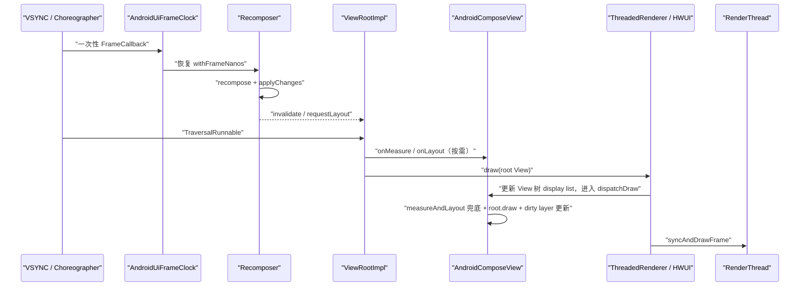
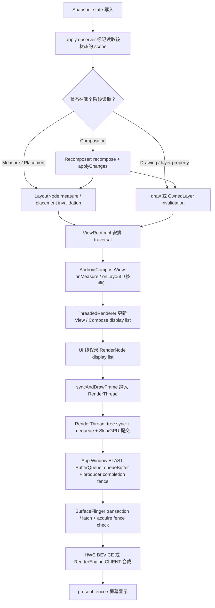

# Jetpack Compose 渲染管线：Composition、Layout 与 RenderNode

Compose 改变了 UI 的声明方式、状态追踪和节点更新，却仍使用 Android 的 App Window 渲染管线。App Window 指应用主窗口及其图形 buffer。对于开启硬件加速且没有额外独立 Surface 的普通 Compose 页面，像素仍依次经过 `ViewRootImpl`、HWUI、RenderThread、BLAST BufferQueue（协调窗口 buffer 与 SurfaceControl transaction 提交的队列机制）、SurfaceFlinger 和 HWC（Hardware Composer，硬件合成器）到达屏幕。

分析 Compose 卡顿时要先分清两层职责。Composition 根据 composable 调用生成和更新 UI 结构，Layout 负责测量与放置，Drawing 负责记录绘制内容；这三阶段属于 Compose。窗口 buffer 的生产、系统合成与 present（提交到显示设备）属于 Android 图形栈。只看 recomposition 次数，无法解释 RenderThread、GPU 或 SurfaceFlinger 导致的慢帧。

## 复核基线与阅读边界

本文复核日期为 2026-07-31，采用以下基线。Android 平台、Jetpack Compose 与内核版本需要分别记录；Android 版本不能代替 Compose 依赖版本。

| 层级 | 基线 | 说明 |
| --- | --- | --- |
| Android 平台 | Android 17 / API 37 / `android-17.0.0_r1` | `Choreographer`、`ViewRootImpl`、`ThreadedRenderer`、`HardwareRenderer`、HWUI、SurfaceFlinger |
| Jetpack Compose | Compose BOM `2026.06.01`，Runtime/UI/Foundation `1.11.4` | Compose 独立发布，不属于 `android-17.0.0_r1` 源码标签 |
| Android 内核 | `android17-6.18-2026-06_r6` | 调度、cpuset、cpufreq、dma-buf 与 fence 等机制；内核不包含 Composition 或 LayoutNode |

讨论范围限定为 Android 12 至 Android 17 上采用硬件加速的 App Window。软件 Canvas、截图或离屏捕获、Preview，以及 `SurfaceView`、`TextureView`、视频或相机等独立 Producer（buffer 生产方）都会改变局部路径，不能沿用单一窗口 buffer 的结论。

## Compose 改了什么，复用了什么

Compose 主要提供四组机制：

- `Snapshot` 为状态读写提供版本化视图，并通知读取过相应状态的观察者；
- `Recomposer` 对失效的 restart scope（编译器标出的可单独重新执行范围）执行 recomposition，再通过 `applyChanges` 把结果写入现有 UI 结构；
- `LayoutNode` 树承载 Compose UI 节点，执行测量、放置、绘制和语义处理；
- `OwnedLayer` / `GraphicsLayer` 保存可复用的绘制内容与 layer 属性。

窗口侧仍由 Android 平台负责：

- `AndroidComposeView` 作为 `ViewGroup` 接入 View 树；
- `ViewRootImpl` 安排 traversal，即窗口的 measure、layout、draw 遍历；
- UI 线程把 View/Compose 的绘制操作录入 RenderNode display list，即可复用的绘制指令列表；
- RenderThread 同步 RenderNode 树，通过 Skia 构建并提交 GPU 工作；
- App Window Producer 把绘制完成的 buffer 排入队列；
- SurfaceFlinger latch buffer，即选定本轮合成要使用的 buffer，再把合成状态交给 HWC 或 RenderEngine；
- 显示系统按照选定的 frame timeline，即该帧的目标显示时序，完成 present。

“Compose 有独立渲染引擎”容易把职责说得过宽。Compose 拥有自己的 UI runtime 和节点系统；在 Android 的常规硬件加速窗口中，实际图形后端仍是 HWUI。

## 两条帧驱动在同一主线程会合

Compose 与 View traversal 都使用 `Choreographer`，即主线程上的帧回调调度器，但两类回调承担不同工作：

1. `AndroidUiFrameClock` 为等待 `withFrameNanos` 的协程注册一次性 `Choreographer.FrameCallback`。`Recomposer` 通过这套 frame clock 让动画、recomposition 和变更应用对齐帧时序。
2. `ViewRootImpl` 的 traversal callback 驱动窗口 measure、layout、draw 与 HWUI 提交。

下面的时序图标出两类回调的调用边界：



图中的两个 Choreographer 回调可能落在同一帧，但职责仍然分开。Recomposition 计算并应用 UI 结构变化；窗口 traversal 决定何时调用 `onMeasure`、`onLayout` 与 draw。因而不能把整条路径概括成 Compose 在自己的 `doFrame` 中完成布局和提交。

Compose 1.11.4 的 `AndroidUiFrameClock` 使用一次性回调。下面的缩写代码只展示回调注册和协程取消时的移除逻辑：

```kotlin
override suspend fun <R> withFrameNanos(onFrame: (Long) -> R): R =
    suspendCancellableCoroutine { continuation ->
        val callback = Choreographer.FrameCallback { frameTimeNanos ->
            continuation.resumeWith(runCatching { onFrame(frameTimeNanos) })
        }
        choreographer.postFrameCallback(callback)
        continuation.invokeOnCancellation {
            choreographer.removeFrameCallback(callback)
        }
    }
```

这段代码在 `doFrame` 内不会自行再次注册。后续是否申请新帧，取决于是否出现新的 `withFrameNanos` 等待者或待处理工作。若把它描述成永久自循环，会错误估计空闲时的回调与功耗。

## AndroidComposeView：Compose 与 ViewRoot 的连接点

`ComposeView` / `AbstractComposeView` 负责创建 composition，即一棵 composable 内容的运行实例；真正承载 Compose 节点树的是内部 `AndroidComposeView`。后者继承 `ViewGroup`，普通 Compose 子节点却不会各自变成 Android `View`。

Compose 1.11.4 的三个入口各有明确职责：

| Android 入口 | Compose 工作 | 需要注意的边界 |
| --- | --- | --- |
| `onMeasure()` | 把 View 的 `MeasureSpec` 转成 Compose `Constraints`，更新根节点约束并执行所需测量 | 仍受父 View 的测量契约约束 |
| `onLayout()` | 调用 `MeasureAndLayoutDelegate.measureAndLayout()`，完成待处理测量/放置并更新根边界 | Layout 不在 `AndroidUiFrameClock` 回调里直接完成 |
| `dispatchDraw()` | 再执行一次 `measureAndLayout()` 检查，调用 `root.draw()`，更新标记为 dirty、等待重录的 `OwnedLayer` | draw 前仍可完成刚产生的布局请求 |

硬件加速 draw 的调用顺序如下：Android 17 的 `ViewRootImpl.performDraw()` 进入 `ThreadedRenderer.draw()`；`ThreadedRenderer` 先通过 `updateRootDisplayList()` 更新 View 树的 display list，期间调用 `AndroidComposeView.dispatchDraw()`，随后执行 `syncAndDrawFrame()`。

UI 线程负责录制 RenderNode display list。RenderThread 接收已录制的渲染节点树及其属性，执行 tree sync（把 UI 线程准备的节点状态同步到渲染线程）、获取 buffer、提交 Skia/GPU 工作并将 buffer 入队。因此，RenderThread 并不负责录制 Compose display list。

## Composition、Layout、Drawing 可以分别失效

Composable 函数的一次执行不会直接包办 Composition、Layout、Drawing 三阶段。状态在哪个阶段被读取，会决定状态变化后从哪个观察范围开始失效，以及需要重做哪些工作。

| 状态读取位置 | 变更后的主要工作 | 可能跳过的阶段 |
| --- | --- | --- |
| Composable 函数体 | Recomposition，随后按变更结果请求 Layout 或 Drawing | 无法预先保证 |
| 测量 lambda | 重新测量受影响节点和必要祖先/子树 | 可跳过 Recomposition |
| 放置 lambda | 重新放置相关节点 | 可跳过 Recomposition，常可跳过测量 |
| draw lambda | 重录所属 layer 的绘制内容 | 可跳过 Recomposition 和 Layout |
| `graphicsLayer {}` 属性 lambda | 更新 layer 属性 | 内容未变时可复用 display list |

下面的例子把状态读取放进布局和 layer 属性 lambda，使高频位置变化不必从 composable 函数体重新开始：

```kotlin
@Composable
fun MovingBadge(offsetPx: State<Int>) {
    Box(
        Modifier
            .offset { IntOffset(offsetPx.value, 0) }
            .graphicsLayer {
                alpha = if (offsetPx.value > 0) 1f else 0.6f
            }
    )
}
```

`offset {}` 在布局阶段读取状态，`graphicsLayer {}` 在 layer 属性更新时读取状态。同一个状态被两个阶段读取，会建立两组观察关系，因此这种写法是否更快仍要由 trace 验证。示例只用于说明状态读取位置与失效范围的关系。

### Recomposition 不等于重绘

Recomposition 会重新执行失效的 composable scope，并生成对现有 UI 结构的变更。参数未变且满足跳过条件时，scope 可以跳过；变更若只影响副作用或无障碍语义，也可能不产生新的绘制内容。

Drawing 也可以在没有 Recomposition 的情况下发生。例如，`Canvas`、`drawWithContent` 或 layer 属性 lambda 在绘制相关 scope 读取状态后，状态变化可以直接使对应绘制范围失效。

Strong Skipping 是 Compose Compiler 决定 composable 调用能否跳过的一套规则，属于 Kotlin 工具链。从 Kotlin 2.0.20 起它默认启用，与 Android 17 平台版本无关。稳定参数通常按 `equals` 比较，不稳定参数通常按实例比较；最终能否跳过仍取决于函数是否 restartable、参数是否变化以及编译器推断结果。

## LayoutNode 的测量与放置

`LayoutNode` 是 Compose UI 树的布局节点。父节点通过 `Constraints(minWidth, maxWidth, minHeight, maxHeight)` 给出允许的尺寸范围，子节点测量后返回 `Placeable`（带测量尺寸、可被放置的结果），父节点再在 `MeasureResult` 的 placement block 中确定它的位置。

Compose 的常规布局协议要求一个 child 在单次 measure pass（一次测量过程）中只测量一次，以限制自定义布局产生歧义。这项约束不代表整棵树每帧只遍历一遍，也不排除额外测量：

- Intrinsic measurement 会先查询内容在给定条件下需要的最小或最大固有尺寸；
- `SubcomposeLayout` 可以在测量过程中根据约束再生成需要测量的内容；
- Lazy 容器会根据可见视口、缓存窗口与预取策略组合和测量 item；
- Lookahead 会保存目标布局的预测结果，为后续动画或位置变化提供参考；
- 约束、内容或依赖状态在 traversal 中变化时，可能产生新的测量请求；
- `dispatchDraw()` 仍会处理尚未完成的 measure/layout 请求。

因此，单凭“每个 child 在一次 measure pass 中只测量一次”，无法得出 Compose 一定比 View 更快。应在 Perfetto 中找出具体节点、布局策略和状态变化如何扩大测量范围。

## Drawing、GraphicsLayer 与 RenderNode

### LayoutNode 与 RenderNode 不是一一对应

大多数 `Text`、`Row`、`Column` 不会各自持有独立的 Android `RenderNode`。没有 layer 边界时，节点的绘制操作会录入最近的所属 layer；Compose 根节点也有自己的绘制承载范围。

因此，不能把绘制失效概括成只重录某个 `LayoutNode` 的 display list。display list 的复用单位是 `OwnedLayer` / `GraphicsLayer` 等绘制边界；普通 LayoutNode 的 draw 内容变化时，可能要重录包含它的最近所属 layer。

### Android 17 上的 graphicsLayer 主路径

在 Android 12 至 Android 17 上，Compose 1.11.4 的 `AndroidComposeView.createLayer()` 主路径会创建 `GraphicsLayerOwnerLayer`。Android 17 使用的图形实现是 `GraphicsLayerV29`，其内部调用公开的 `android.graphics.RenderNode`：

- `GraphicsLayerOwnerLayer.updateDisplayList()` 只在 dirty 时调用 `graphicsLayer.record(...)`；
- `GraphicsLayerV29` 通过 `RenderNode.beginRecording()` / `endRecording()` 保存绘制操作；
- 绘制时通过 `Canvas.drawRenderNode()` 引用该节点；
- translation、scale、rotation、alpha 等 layer 属性可以在绘制内容不变时单独更新，避免重录内部 draw commands。

`RenderNodeLayer` 仍保留在兼容代码中，但 Android 17 + Compose 1.11.4 的主路径不是它。

### layer 边界不一定产生离屏 buffer

`Modifier.graphicsLayer` 会建立图形 layer 隔离边界。offscreen buffer 是先把内容画进中间纹理、再参与最终合成的缓冲区；是否需要它由合成策略和效果共同决定。

| 条件 | RenderNode / layer 边界 | offscreen buffer |
| --- | --- | --- |
| 普通 LayoutNode，无显式 layer | 通常并入最近所属 layer | 无额外 offscreen |
| `graphicsLayer` + 平移/缩放/旋转 | 有 | 通常不需要 |
| `CompositingStrategy.Auto` + `alpha < 1` 且内容可能重叠 | 有 | 为保证整层 alpha 语义，可以自动启用 |
| `RenderEffect` | 有 | 需要中间结果 |
| 非默认 `SrcOver` 的 `BlendMode` 或非空 `ColorFilter` | 有 | Compose 1.11.4 强制按 Offscreen 处理 |
| `CompositingStrategy.Offscreen` | 有 | 始终启用 |
| `CompositingStrategy.ModulateAlpha` | 有 | 把 alpha 分别作用于绘制指令，可以避开离屏 buffer；内容重叠时视觉结果可能不同 |

离屏渲染会增加中间纹理、像素填充、内存带宽与 GPU 内存压力。`ModulateAlpha` 只适用于内容不重叠、逐绘制指令调制 alpha 仍满足视觉要求的场景。

## 从状态写入到 present

下面的流程图把 Compose、HWUI、窗口队列和 SurfaceFlinger 串成一条可按时间核对的证据链：



在这条链路中，`queueBuffer` 只说明 Producer 已把 buffer 交给队列。随 buffer 提交的 producer completion fence 会在 Consumer（buffer 消费方）侧作为 acquire fence，用来表示生产工作何时完成；它不代表 SurfaceFlinger 已经 latch，更不代表屏幕已经显示。定位用户实际看到的帧时，还要继续对齐 BufferTX（SurfaceFlinger 中的 buffer transaction 事件）、FrameTimeline、latch、合成与 present 证据。

### UI 线程与 RenderThread 的分工

UI 线程主要完成：

- Snapshot 通知、recomposition 与 `applyChanges`；
- Compose 测量和放置；
- 录制 View/Compose display list；
- 调用 `syncAndDrawFrame()` 并参与 HWUI 同步。

RenderThread 主要完成：

- 同步 RenderNode tree 和渲染属性；
- `dequeueBuffer` 取得可写的窗口 buffer，必要时等待 Consumer 返回的 release fence；该 fence 表示上一次消费已经结束，buffer 可以复用；
- 让 Skia 构建/提交 GLES 或 Vulkan GPU 工作；
- 完成 swap/queue，并把 producer completion fence 随 buffer 提交。

RenderThread trace slice 的长度不能直接当作 GPU 执行时长。GPU 可能在 RenderThread 提交返回后继续工作，需要 GPU completion、fence 或 GPU counter 才能判断设备侧执行时间。`syncAndDrawFrame()` 返回通常也早于 present 完成；显示结果要结合 present fence 或 FrameTimeline 判断。

## Snapshot 与 Recomposer 的并发边界

Snapshot 为状态读写提供版本化视图，并通过 read/write observer 记录谁读取了状态、哪些写入需要触发失效。它没有承诺所有状态操作都无锁，也不会让同一个 composition 自动并行 recomposition。

Android UI 性能分析可以依赖以下边界：

- 同一个 composition 不会被 Recomposer 同时执行两次 recomposition；
- Runtime 1.11.0-alpha01 已移除曾经的实验性 concurrent recomposition API，旧版本的字段不能证明当前版本仍支持并发 composition；
- 多个 `ComposeView` 各有 composition root（各自的组合根），但可以共享 window Recomposer、parent composition context，也可以显式共享同一份 state；
- 后台线程可以借助 Snapshot API 组织状态更新；多项状态需要原子地一起生效时，应使用明确的 mutable snapshot（可变快照事务）或应用自己的同步策略；
- `apply()` 可能遇到并发修改冲突，业务代码不应把 Snapshot 当作任意跨线程数据结构的替代品；
- Android `View`、`AndroidComposeView`、绘制对象与副作用仍受各自线程约束。state 可以跨线程更新，不表示 UI 对象可以跨线程访问。

Runtime 内部的锁与字段会随 Compose 版本调整；应用应依赖 composition 单实例串行、状态冲突处理和 Android UI 线程约束这些公开边界，而非某一版本的锁实现行号。

## PausableComposition 与 Lazy 预取

### 它分段处理哪类工作

`PausableComposition` 可以分段执行尚未投入使用的子 composition。典型场景是 Lazy 容器预先准备可能进入视口的 item：当前空闲时间不足时请求暂停，后续再调用 `resume()` 继续。只有 `isComplete` 为真并完成 `apply()` 后，结果才能加入布局树。

它不用于把当前可见页面的常规 recomposition 任意切成多帧，也不会直接减少 draw、GPU 或 SurfaceFlinger 工作。它只改变预取 composition 在不同帧空闲区间中的执行安排，工作总量仍由内容决定。

### API 与暂停语义

Compose 1.11.4 的关键 API 是：

- `PausableComposition.setPausableContent()` / `setPausableContentWithReuse()` 返回 `PausedComposition`；
- 调用方反复执行 `resume(shouldPause)`；
- `shouldPause` 返回 `true` 表示请求暂停，执行并不保证在任意函数边界立即停止；
- `resume()` 返回后仍要检查 `isComplete`，完成时再同步调用 `apply()`；
- 暂停期间读过的 state 若发生变化，原本已完成的结果可能再次需要处理；
- 放弃预取时调用 `cancel()`，并按 API 契约丢弃状态不再确定的 composition。

### 1.11.4 的默认预取路径

PausableComposition 最初在 Runtime `1.8.0-alpha02` 加入，并非 Compose 1.7 的稳定特性。Foundation 的 Lazy 预取开关后来经历过调整：

- Foundation 1.10.6 因稳定性考虑把 `isPausableCompositionInPrefetchEnabled` 设为 `false`；
- Foundation 1.11.4 源码中的该 flag 为 `true`；
- `LazyLayoutPrefetchState` 在 flag 开启时调用 paused precomposition，并分别记录 resume、pause、apply 与 measure 的历史耗时。

默认 Android 预取调度器根据 `View.display.refreshRate` 估算 `frameIntervalNs`，再用预计下一帧时间减去当前时间，计算 `availableTimeNanos()`。如果距离上次 draw 已超过两个帧间隔，调度器会把当前阶段视为 idle（近期没有持续绘制），允许执行更多预取工作。

这套调度没有直接读取 `Choreographer.FrameData.getPreferredFrameTimeline().getDeadlineNanos()`。因此，`availableTimeNanos()` 只是 Compose Foundation 当前实现对剩余时间的估算，不能当作 Android 12+ 提供的精确 frame deadline。

## 互操作：按 Surface 拓扑分类

`AndroidView` 或 `ComposeView` 只能说明 UI 框架如何嵌套，不能直接确定图形管线。还要确认四件事：谁生产 buffer、谁消费 buffer、是否新建 Surface，以及 SurfaceFlinger 中是否出现独立 layer。

| 场景 | 常见 Producer / Surface | 管线判断 |
| --- | --- | --- |
| Compose 中嵌普通 `TextView`、`ImageView` | 仍由 App Window HWUI Producer 生成窗口 buffer | 单一标准 App Window 路径 |
| View 树中嵌普通 `ComposeView` | 仍由 App Window HWUI Producer 生成窗口 buffer | 单一标准 App Window 路径 |
| `AndroidView` 内含 `SurfaceView` | 子内容通常有独立 BufferQueue / SurfaceControl layer | 多 Surface 混合路径 |
| `AndroidView` 内含 `TextureView` | 独立 Producer 先写 SurfaceTexture，再作为纹理进入 App Window | Producer 独立，但常回到 App Window 合成 |
| 视频、相机、WebView 或厂商组件 | 取决于内部采用 SurfaceView、TextureView、SurfaceTexture 或软件绘制 | 必须用 dumpsys/trace 验证 |

### AndroidView 的边界

`AndroidViewHolder` 把 Compose `Constraints` 转成 View `MeasureSpec`，调用传统 View 的 measure/layout，并把 View invalidation（内容需要重绘的通知）传播到 Compose 所属 layer。普通 AndroidView 不会天然增加一个 Surface；性能取决于被包装 View 的工作量、嵌套深度、失效频率，以及内部是否创建独立 Producer。

### ComposeView 的边界

每个 `ComposeView` 都有自己的 composition root 与 `AndroidComposeView` 宿主，但框架没有保证多个根之间的状态互相隔离。多个 ComposeView 可以持有同一个 state，也可能通过 View tree composition context 共享 window Recomposer。拆成多个 ComposeView 会增加宿主对象和 composition 生命周期管理，应根据模块边界、生命周期与 trace 结果决定是否采用。

### 混合动画不自动同步

Compose 与普通 View 往往共享主线程 Choreographer 和窗口 traversal，这只代表二者受同一窗口调度。内部若存在 SurfaceView、视频解码器或其他独立 Producer，各 Producer 的 dequeue、render、queue、fence 与 SurfaceFlinger latch 时序仍可能不同。必须逐个对象对齐 frame timeline，不能仅凭共用 Choreographer 就认定画面同步。

FrameTimeline 中，`SurfaceFrame` 描述某个 Surface 交付帧的时序，适合判断 App Window 是否按时提交；它不能代替独立 Surface 或 SurfaceTexture 输入流的时间线。`DisplayFrame` 描述本轮显示合成与 present。分析混合页面时，应从异常 `DisplayFrame` 反向确认宿主采用了哪次 BufferTX、独立 layer 使用了新 buffer 还是旧 buffer，以及 Texture 输入是否赶上宿主 RenderThread 的采样。

## 用 Perfetto 定位慢帧

### 先确认看到的是哪一帧

从 FrameTimeline 的 expected/actual slice（期望帧与实际帧时间片）或目标 jank 帧出发，记录 frame token（关联同一帧的标识）、时间区间和刷新率。60 Hz 的名义间隔约为 16.67 ms，120 Hz 约为 8.33 ms，但应用实际可用的预算还受回调相位、deadline、buffer 压力与系统调度影响。不能把名义帧间隔机械分配成固定的 composition 5 ms、layout 8 ms、draw 3 ms。

### 再沿线程和队列取证

建议按下面顺序检查：

1. **Main thread**：检查目标 `Choreographer#doFrame` 内是否出现 composition、snapshot apply、measure/layout、display-list recording、GC、Binder 或业务代码。
2. **Compose scope**：trace 若没有 composition 细节，先确认构建是否按当前官方说明启用 Compose composition tracing。缺少 slice 只能说明没有采到对应事件，不能直接证明没有发生 recomposition。
3. **RenderThread**：检查 `DrawFrame`、tree sync、`dequeueBuffer` 等等待，以及线程处于 runnable 却未获得 CPU 的调度空档。整段 RenderThread slice 不能都记为 GPU 时间。
4. **GPU / fences**：有 GPU counters、GPU completion 或 fence 时，再判断复杂绘制 path、过度离屏、像素填充、纹理上传或频率限制。
5. **BufferQueue / SurfaceFlinger**：对齐 queue、BufferTX、latch、composition 和 present，确认 App Window 是否错过目标 timeline。
6. **HWC**：检查 layer 集合与 DEVICE/CLIENT 选择。DEVICE 表示 HWC 直接处理该 layer，CLIENT 表示先由 RenderEngine 合成。独立 Surface 过多、效果或格式限制都可能增加 CLIENT 合成。
7. **内核**：在 `android17-6.18-2026-06_r6` 边界内查看 sched、cpuset、cpufreq、dma-buf 与 fence 等机制；这里能解释线程为何没运行或 fence 为何没到，不能解释哪个 composable 被重组。

### 按阶段选择优化手段

| 证据 | 优先检查 | 常见改法 |
| --- | --- | --- |
| Recomposition 范围大 | 状态读取位置、参数稳定性、无效派生状态 | 缩小 state reader scope；只在输出变化频率低于输入时使用 `derivedStateOf` |
| 高频状态把 Composition 拉进来 | 动画/滚动值在函数体读取 | 能满足语义时，把读取移到 placement、draw 或 layer property lambda |
| Measure/Layout 重 | Intrinsics、Subcompose、Lazy 嵌套、自定义 MeasurePolicy | 减少重复 intrinsic 查询；降低布局层级；让 constraints 稳定；用 benchmark 验证 |
| Display-list recording 重 | 大范围 draw invalidation、复杂 path/text、所属 layer 过大 | 缩小绘制失效范围；缓存可复用计算；选择合适 layer 边界 |
| GPU 重 | Offscreen、blur、blend、overdraw（同一像素被重复绘制）、大纹理 | 降低中间 buffer 面积；减少高成本 effect；核对色彩/格式和纹理上传 |
| dequeue / queue 阻塞 | buffer 压力、消费者落后、独立 Producer 时序 | 沿 BufferQueue 和 fence 找等待方，避免只改 Compose 代码 |
| SurfaceFlinger / HWC 重 | Layer 数量、CLIENT 合成、显示侧 deadline | 调整 Surface 拓扑或效果；与设备合成能力一起验证 |

`derivedStateOf` 会观察输入并缓存派生结果，本身也有观察与计算成本。它适合输入频繁变化、派生结果很少变化的场景，例如把连续滚动位置映射成是否显示返回顶部按钮。它不会降低源 state 的写入频率，也不应作为所有性能问题的默认改法。

## 版本演进：平台与 Compose 分开记

| 时间/版本 | 相关变化 |
| --- | --- |
| Compose 1.0（2021） | AndroidComposeView、LayoutNode、Snapshot 与基础硬件加速接入进入稳定版 |
| Runtime 1.8.0-alpha02（2024-09） | 加入实验性 PausableComposition，供可暂停的子 composition 使用 |
| Kotlin 2.0.20 | Strong Skipping 默认启用；这是编译器边界 |
| Foundation 1.10.6 | Lazy 预取的 PausableComposition flag 因稳定性问题暂时默认关闭 |
| Runtime 1.11.0 | 用于保存 composition group 与节点关联的新 SlotTable/link-buffer 内部实现仍处于实验阶段且默认关闭；旧实验性 concurrent recomposition API 已移除 |
| Compose 1.11.4 / BOM 2026.06.01 | Jetpack 基线；Foundation 源码中 Lazy PausableComposition 预取 flag 为 `true` |
| Android 17 / API 37 | 平台上限；标准 App Window 仍走 ViewRoot/HWUI/RenderThread/SurfaceFlinger |

Android 17 同期可用的 Compose 版本不是系统内置版本。Compose Runtime/UI/Foundation 由应用依赖决定，同一台 Android 17 设备可以运行由不同 Compose 版本构建的应用。

## 常见误区

### “每个 Composable 都对应一个 RenderNode”

Composable 对应函数调用与 composition group，LayoutNode 是 UI 节点，RenderNode/GraphicsLayer 是绘制复用边界，三者没有一一对应关系。普通 LayoutNode 的绘制内容通常录入最近的所属 layer。

### “Compose 的 FrameCallback 会直接 measure、layout、draw”

`AndroidUiFrameClock` 负责恢复等待帧的协程。窗口 traversal 才会通过 `AndroidComposeView.onMeasure()`、`onLayout()` 和 `dispatchDraw()` 执行布局与绘制，随后由 `ThreadedRenderer.draw()` 提交 HWUI 帧。

### “graphicsLayer 一定创建离屏纹理”

graphicsLayer 建立 layer 边界。平移、缩放、旋转等属性通常可以由 RenderNode 处理；Offscreen 策略、特定 alpha 语义、RenderEffect、BlendMode 或 ColorFilter 才可能需要中间 buffer。

### “RenderThread slice 就是 GPU 时长”

RenderThread 负责准备和提交 GPU 工作，也可能等待 buffer 或 fence。GPU 可以异步执行，实际执行时长必须结合 GPU completion、counter 或 fence 判断。

### “queueBuffer 代表已经上屏”

queue 之后仍有 SurfaceFlinger latch、合成决策、HWC/RenderEngine 工作与 present。看到 queue 只能证明 Producer 已交付 buffer。

### “多个 ComposeView 的状态天然隔离”

不同 composition root 仍可显式共享 state，也可能使用同一个 Recomposer。判断隔离边界时，需要查看 parent composition context、window Recomposer 和业务状态所有权。

### “PausableComposition 会降低 GPU 工作量”

它主要安排 Lazy 预取子 composition 的执行时机。draw 和 GPU 工作是否减少，取决于最终进入屏幕的内容与绘制方式。

## 源码核对索引

下表列出关键结论及其固定版本源码：

| 结论 | 基线源码 |
| --- | --- |
| 一次性 frame callback | Compose UI 1.11.4 [`AndroidUiFrameClock.android.kt`](https://android.googlesource.com/platform/frameworks/support/+/854220f44ea8ea80fee824a6c5a045f39bede289/compose/ui/ui/src/androidMain/kotlin/androidx/compose/ui/platform/AndroidUiFrameClock.android.kt) |
| AndroidComposeView 的 measure/layout/draw 接缝 | Compose UI 1.11.4 [`AndroidComposeView.android.kt`](https://android.googlesource.com/platform/frameworks/support/+/854220f44ea8ea80fee824a6c5a045f39bede289/compose/ui/ui/src/androidMain/kotlin/androidx/compose/ui/platform/AndroidComposeView.android.kt) |
| Android 17 主 graphics layer | Compose UI 1.11.4 [`GraphicsLayerOwnerLayer.android.kt`](https://android.googlesource.com/platform/frameworks/support/+/854220f44ea8ea80fee824a6c5a045f39bede289/compose/ui/ui/src/androidMain/kotlin/androidx/compose/ui/platform/GraphicsLayerOwnerLayer.android.kt)；UI Graphics 1.11.4 [`GraphicsLayerV29.android.kt`](https://android.googlesource.com/platform/frameworks/support/+/854220f44ea8ea80fee824a6c5a045f39bede289/compose/ui/ui-graphics/src/androidMain/kotlin/androidx/compose/ui/graphics/layer/GraphicsLayerV29.android.kt) |
| offscreen 策略 | Compose UI Graphics 1.11.4 [`GraphicsLayer.kt`](https://android.googlesource.com/platform/frameworks/support/+/854220f44ea8ea80fee824a6c5a045f39bede289/compose/ui/ui-graphics/src/commonMain/kotlin/androidx/compose/ui/graphics/layer/GraphicsLayer.kt) 与 [`CompositingStrategy.kt`](https://android.googlesource.com/platform/frameworks/support/+/854220f44ea8ea80fee824a6c5a045f39bede289/compose/ui/ui-graphics/src/commonMain/kotlin/androidx/compose/ui/graphics/layer/CompositingStrategy.kt) |
| PausableComposition 契约 | Compose Runtime 1.11.4 [`PausableComposition.kt`](https://android.googlesource.com/platform/frameworks/support/+/854220f44ea8ea80fee824a6c5a045f39bede289/compose/runtime/runtime/src/commonMain/kotlin/androidx/compose/runtime/PausableComposition.kt) |
| Lazy 预取 flag 与分段执行 | Compose Foundation 1.11.4 [`ComposeFoundationFlags.kt`](https://android.googlesource.com/platform/frameworks/support/+/854220f44ea8ea80fee824a6c5a045f39bede289/compose/foundation/foundation/src/commonMain/kotlin/androidx/compose/foundation/ComposeFoundationFlags.kt)、[`LazyLayoutPrefetchState.kt`](https://android.googlesource.com/platform/frameworks/support/+/854220f44ea8ea80fee824a6c5a045f39bede289/compose/foundation/foundation/src/commonMain/kotlin/androidx/compose/foundation/lazy/layout/LazyLayoutPrefetchState.kt) 与 [`PrefetchScheduler.android.kt`](https://android.googlesource.com/platform/frameworks/support/+/854220f44ea8ea80fee824a6c5a045f39bede289/compose/foundation/foundation/src/androidMain/kotlin/androidx/compose/foundation/lazy/layout/PrefetchScheduler.android.kt) |
| ViewRoot 到 HWUI 提交 | AOSP Android 17 [`ViewRootImpl.java`](https://android.googlesource.com/platform/frameworks/base/+/refs/tags/android-17.0.0_r1/core/java/android/view/ViewRootImpl.java)、[`ThreadedRenderer.java`](https://android.googlesource.com/platform/frameworks/base/+/refs/tags/android-17.0.0_r1/core/java/android/view/ThreadedRenderer.java) 与 [`HardwareRenderer.java`](https://android.googlesource.com/platform/frameworks/base/+/refs/tags/android-17.0.0_r1/graphics/java/android/graphics/HardwareRenderer.java) |
| RenderThread 到窗口 buffer | AOSP Android 17 [`DrawFrameTask.cpp`](https://android.googlesource.com/platform/frameworks/base/+/refs/tags/android-17.0.0_r1/libs/hwui/renderthread/DrawFrameTask.cpp)、[`CanvasContext.cpp`](https://android.googlesource.com/platform/frameworks/base/+/refs/tags/android-17.0.0_r1/libs/hwui/renderthread/CanvasContext.cpp) 与 [`BLASTBufferQueue.cpp`](https://android.googlesource.com/platform/frameworks/native/+/refs/tags/android-17.0.0_r1/libs/gui/BLASTBufferQueue.cpp) |
| SurfaceFlinger 与 HWC | AOSP Android 17 [SurfaceFlinger FrontEnd](https://android.googlesource.com/platform/frameworks/native/+/refs/tags/android-17.0.0_r1/services/surfaceflinger/FrontEnd/) 与 [`HWComposer.cpp`](https://android.googlesource.com/platform/frameworks/native/+/refs/tags/android-17.0.0_r1/services/surfaceflinger/DisplayHardware/HWComposer.cpp) |
| 内核机制边界 | ACK `android17-6.18-2026-06_r6` [`sched/core.c`](https://android.googlesource.com/kernel/common/+/refs/tags/android17-6.18-2026-06_r6/kernel/sched/core.c)、[`dma-buf.c`](https://android.googlesource.com/kernel/common/+/refs/tags/android17-6.18-2026-06_r6/drivers/dma-buf/dma-buf.c) 与 [`sync_file.c`](https://android.googlesource.com/kernel/common/+/refs/tags/android17-6.18-2026-06_r6/drivers/dma-buf/sync_file.c) |

Compose 版本可在 Android Developers 的 [Compose BOM 页面](https://developer.android.com/develop/ui/compose/bom)、[BOM 映射表](https://developer.android.com/develop/ui/compose/bom/bom-mapping) 与 [Compose Runtime release notes](https://developer.android.com/jetpack/androidx/releases/compose-runtime) 交叉核对。平台源码以 `android-17.0.0_r1` 固定标签为准，不使用持续变化的开发分支代替。

## 总结

Compose 渲染性能可以分三层排查：

1. **Compose 层**：Snapshot 失效范围、Recomposition、Layout、Drawing、GraphicsLayer 与 Lazy 预取；
2. **App Window 层**：ViewRoot traversal、UI display-list recording、RenderThread、Skia/GPU 与 BLAST BufferQueue；
3. **系统合成层**：SurfaceFlinger latch、LayerSnapshot、HWC/RenderEngine 和 present。

普通 Compose 页面仍通过标准 App Window 生产 buffer。Compose 决定窗口内容如何生成；独立 Surface、GPU fence、SurfaceFlinger 合成与显示时序则要沿 Android 图形栈取证。只有把阶段、线程、buffer 和 present timeline 放在同一时间轴上，才能判断慢帧发生在 recomposition、布局、display-list recording、GPU、队列还是系统合成。
