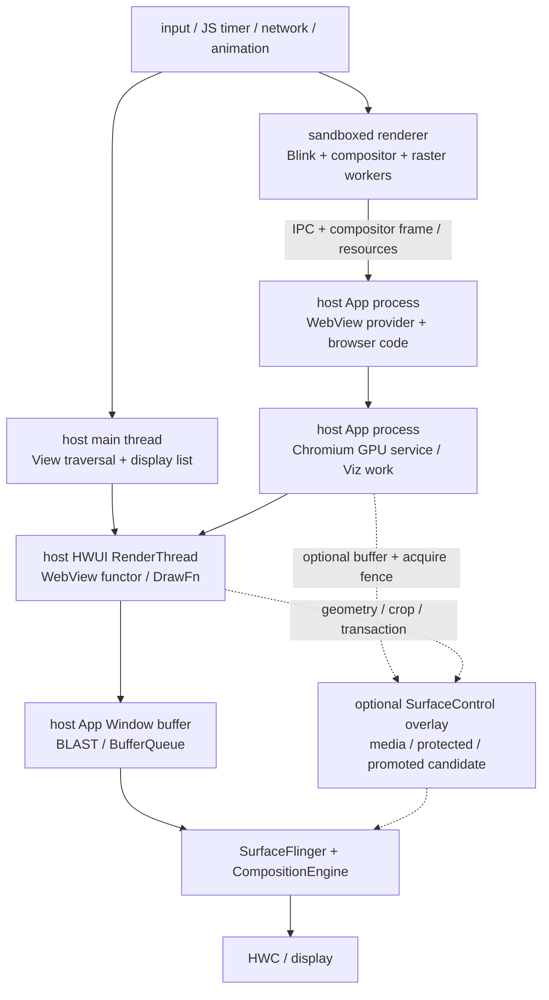
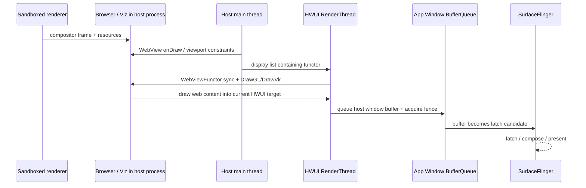

# Android 17 WebView 渲染管线

WebView 的一帧横跨应用 View 树、Chromium 多进程管线和 Android 合成系统，provider 版本还可能独立于平台版本更新。排查时应同时记录两套版本，并先确认当前走硬件 functor、软件 fallback 还是独立 Surface 路径。

## 这条管线为什么容易看错

WebView 同时跨越 Chromium 与 Android 两套渲染系统。网页侧负责 JavaScript、样式、布局、绘制列表、栅格化和 compositor frame（Chromium 合成器生成的帧）；宿主侧仍要完成 View 遍历、HWUI 绘制、窗口 buffer 提交和 SurfaceFlinger 合成。只检查 App 主线程会遗漏 renderer 与 GPU service；只看到 Chromium compositor，也无法证明网页拥有独立的 SurfaceFlinger layer。

这里固定三组锚点，其中 Android 平台和 WebView provider 是两条彼此独立的版本线：

- Android 平台固定在 Android 17/API 37/`android-17.0.0_r1`，用于解释 framework、HWUI、SurfaceControl 和显示系统接口；
- 内核固定在 `android17-6.18-2026-06_r6`，用于解释 dma-buf、dma-fence/sync_file、调度和内存回收；
- WebView provider 是第二条独立版本线。现场必须记录包名、`versionName` 和 `versionCode`，再定位对应 Chromium revision。

即使系统都是 Android 17，两台设备也可能安装不同 Chromium milestone（版本里程碑）的 provider，并受不同 feature flag、GPU blocklist 和 OEM 配置影响。平台 tag 只能回答 Android 提供了哪些接口，provider 的实际行为仍要根据设备版本对应的源码判断。

## 先分清三个边界

WebView 现场常被混在一起的内容有三类。

| 边界 | 谁负责 | 常见形态 | 不能直接推出什么 |
| --- | --- | --- | --- |
| 官方 Android System WebView provider 内部 | framework WebView、可更新 provider、Chromium renderer/GPU service、HWUI | 普通页面经 functor/DrawFn 合入宿主窗口；合格的内容候选可走 SurfaceControl overlay | 看到 WebView 就等于存在独立 SF layer |
| 宿主全屏托管 | `WebChromeClient.onShowCustomView()` 与宿主全屏容器 | 页面进入 fullscreen mode 后，WebView 把一个 `View` 交给宿主 | 回调给出的 `View` 必然是 `SurfaceView` 或 `TextureView` |
| 第三方 SDK 扩展 | X5、UC、定制 Chromium 或厂商包装层 | 可能使用 Texture-like、独立 Surface、ImageReader 或私有桥接 | 可以直接套用 Android System WebView 的内部类名与 trace slice |

这里的 “SurfaceControl 子 Surface” 指官方 provider 把合格的 overlay candidate（可提升候选）放入独立 layer 的能力。普通网页主体通常仍由 functor 绘入宿主 App Window；视频、受保护内容或其他满足条件的候选才可能增加独立 layer。分析时必须保留这一适用范围。

## 进程模型：三个执行域

现代系统 WebView 可以按三个执行域理解。

1. 宿主 App 进程：包含 framework `WebView`、provider glue（框架与 Chromium 实现的连接层）、browser code、UI 协调，以及标准 WebView 架构中的进程内 GPU/network 等服务。
2. sandboxed renderer 进程：Blink 在沙箱进程中执行 JavaScript、style、layout、paint 和 compositor 工作。一个 renderer 是否由多个 WebView 共享，取决于 provider 的进程策略。
3. Android 显示系统：包含宿主 `ViewRootImpl`、HWUI RenderThread、BLAST/BufferQueue、SurfaceFlinger、CompositionEngine 和 HWC。

下面的图用于定位 browser code、GPU services 和 renderer。箭头表达主要数据流，其中部分步骤通过异步 IPC 或资源队列衔接。



图中实线表示普通页面的主体路径，虚线表示可选 overlay。renderer 生成 compositor frame，只说明网页侧结果已可供下游消费；用户看到该帧前，还要等待宿主绘制、窗口提交、SF latch 和 Display present。

主线程空闲不能说明 WebView 整条链路都空闲。renderer 可能正在执行 JavaScript 或布局，raster worker 可能在解码图片，GPU service 可能在等待资源或 fence，宿主 RenderThread 也可能没有及时消费新 frame。

## 平台版本与 provider 版本要一起记录

Android 5 起，WebView provider 可以独立于系统镜像更新；Android 7 起，设备还可以在多个合格 provider 中选择。应用内可以通过 AndroidX WebKit 记录当前实现，设备侧再用 `dumpsys webviewupdate` 交叉核对。

这段代码的用途是把 provider 身份写入复现日志。

```kotlin
val provider = WebViewCompat.getCurrentWebViewPackage(applicationContext)
val versionCode = provider?.let { PackageInfoCompat.getLongVersionCode(it) }
Log.i(
    "WebViewProvider",
    "package=${provider?.packageName}, " +
        "version=${provider?.versionName}, code=$versionCode"
)
```

`PackageInfoCompat` 来自 `androidx.core.content.pm`，用于兼容 API 28 以前的 `versionCode` 读取方式。provider 返回值可能为 `null`，例如设备不支持 WebView、缺少可更新实现或配置异常。进行冷启动实验时，还要检查版本查询或其他 `android.webkit`/`androidx.webkit` 调用是否提前触发 WebView 初始化；基准组应保留一份没有额外探针的 trace。

### Android 17 中 provider 怎样装入宿主进程

Android 17 的调用边界可以概括为：

1. `WebView` 的 provider 代理在第一次需要具体实现时进入 `WebViewFactory.getProvider()`；同一进程会缓存同一个 `WebViewFactoryProvider`。
2. `WebViewFactory` 通过 `WebViewUpdateService.waitForAndGetProvider()` 取得系统选中的包，并校验包名、版本、签名、安装与启用状态。
3. framework 为该包创建可加载代码的 context，取得 provider class loader，加载包声明的 native WebView library，再通过反射创建 provider factory。
4. provider 后续初始化 Chromium browser context、renderer 和图形资源。具体时序属于设备 provider revision，不能由 `WebViewFactory.java` 一份平台源码完整推导。

这条链路解释了 WebView 首次创建为何可能耗时较长：它可能同时包含包选择、RELRO（预重定位只读数据）/native library、Java 类加载、Chromium 初始化、renderer 建立、网络和页面首帧。稳态滚动 trace 无法回答冷启动问题。

AndroidX WebKit 提供 `WebViewCompat.startUpWebView()`，可以把允许在后台执行的启动工作提前到可控时机；其余工作仍可能分段回到主线程。调用后立刻访问其他 WebView API 时，UI 线程仍可能等待初始化完成。预热还会增加进程和内存驻留，应按真实启动路径评估，并以项目实际使用的 AndroidX WebKit 版本说明为准。

## 官方 provider 的标准硬件路径：functor / DrawFn

硬件加速的标准 WebView 仍然是宿主 View 树的一员，参与 measure、layout、clip、alpha、matrix、invalidate 和窗口生命周期。不过，宿主不会逐条执行 `Canvas.drawText()` 或 `drawBitmap()` 来重画网页像素。provider 会在宿主 display list 中记录 WebView functor（由 HWUI 在绘制时回调 provider 的特殊绘制节点），HWUI RenderThread 执行该节点时再接入 Chromium 的合成结果。

### 一次硬件绘制怎样发生

Android 17 与当前 Chromium 上游源码给出的主线如下：

1. renderer 完成网页更新，把 compositor frame 和可转移资源提交到 browser/Viz 一侧；
2. 宿主 UI thread 遍历到 WebView，provider 的 `AwContents::OnDraw()` 在 Canvas 硬件加速、WebView 已附着且没有强制辅助 bitmap 等条件满足时进入 `BrowserViewRenderer::OnDrawHardware()`；
3. `BrowserViewRenderer` 更新 viewport、clip、transform 等约束，通过 synchronous compositor（由宿主绘制触发的同步合成接口）请求或选择可用 child frame，并让宿主 display list 记录 functor；
4. HWUI RenderThread 执行 `WebViewFunctor::sync` 与 `drawGl`，或者 `initVk`、`drawVk`、`postDrawVk`；
5. Chromium 的 `AwDrawFnImpl::DrawGL()`/`DrawVk()` 把工作交给 `RenderThreadManager`，`HardwareRenderer`/Viz 消费 child frame，再把网页主体绘入当前 HWUI target；
6. HWUI 把网页内容与其他宿主 View 一起绘入 App Window buffer，随后通过 BLAST/BufferQueue 交给 SurfaceFlinger。

下面的时序图强调“Chromium 内部完成合成”和“Android 窗口完成提交”是两个不同边界。



`HardwareRenderer::OnViz::DrawAndSwapOnViz()` 名称中的 “Swap” 属于 Chromium 内部显示合成器语义，无法证明 App Window 已经向 SurfaceFlinger `queueBuffer`。普通网页主体的 Android 窗口提交仍由宿主 HWUI 完成。

### GL 与 Vulkan 的准确口径

Android 17 的 `WebViewFunctor.h` 同时定义 GLES 与 Vulkan 回调。`WebViewFunctor_queryPlatformRenderMode()` 查询宿主 HWUI pipeline，HWUI 再按当前 pipeline 校验并调用对应回调。现场可以用以下 slice 区分分支：

- 平台侧：`WebViewFunctor::sync`、`WebViewFunctor::drawGl`、`WebViewFunctor::initVk`、`WebViewFunctor::drawVk`、`WebViewFunctor::postDrawVk`；
- Chromium 侧：`DrawFn_DrawGL`、`DrawFn_InitVk`、`DrawFn_DrawVk`、`DrawFn_PostDrawVk`、`DrawFn_RemoveOverlays`。

这段关系不能简化为 HWUI 与 Chromium 共用一个 GPU context。GL/Vulkan context、resource import 和同步实现取决于 provider revision 与后端；可以确认的是 provider 必须通过平台定义的 functor 模式与当前 HWUI pipeline 协作。

### 这条路径的性能含义

普通网页主体合入 host buffer 后，SurfaceFlinger 通常只看到宿主 App Window layer。DOM layer、CSS transform、canvas 和普通图片已经在 Chromium/HWUI 前半段完成合成，不会逐项变成 SF layer，也无法由 HWC 分别分配 overlay plane。

WebView 的耗时会沿两种方式拖慢宿主帧：

- UI thread 没有及时完成 invalidate、traversal 或 display list 记录；
- RenderThread 执行 functor 时，frame、resource import、GPU service 或 GPU 工作没有按期完成。

因此，宿主主线程负载较低不能排除 WebView 卡顿；SurfaceFlinger 只显示一个 App layer，也不能证明网页侧没有经过多线程合成。

## 软件绘制 fallback

窗口未启用硬件加速、传入 Canvas 没有硬件加速能力，或者 provider 当前无法接受硬件 draw 时，WebView 可以进入软件绘制。Chromium 的 `AwContents::OnDraw()` 会选择 `BrowserViewRenderer::OnDrawSoftware()`，后者通过 `CompositeSW()`/`DemandDrawSw()` 取得软件结果并绘入宿主 Canvas。

这里要区分两种宿主形态：

- 整个窗口软件绘制时，`ViewRootImpl.drawSoftware()` 通过窗口 Surface 的 Canvas 路径提交 App Window buffer；
- 单个 WebView 使用 software layer 时，软件结果可以先成为 bitmap/layer，再由硬件加速的宿主窗口采样。

两种情况都不会让网页自动获得独立 SF layer。确认 fallback 时，应组合检查硬件 DrawFn slice 消失、软件 draw 调用栈或 CPU raster 增长、Canvas acceleration 状态和 provider 日志。低端设备、白屏或某个 CSS 属性本身都不足以定型。

## 官方 provider 的 SurfaceControl 子 Surface：overlay，不是整页搬家

Android 17 的 HWUI 与 Chromium 都包含 WebView overlay 接口，但该接口只提供候选提升机制。常见结果仍是网页 UI 由 functor 绘入 host buffer，视频、受保护内容或其他满足条件的候选单独进入 SurfaceControl layer。

### 平台侧先决定“能不能提供 overlay 容器”

`WebViewFunctorManager.cpp` 只有在以下条件成立时，才把 `overlaysMode` 设为 Enabled：

- `Properties::enableWebViewOverlays` 已启用；
- 当前 draw 存在 active `CanvasContext`；
- 该 context 有 root `SurfaceControl`；
- 本次 WebView draw 的目标不是 HWUI 离屏 layer：GL 分支要求 `!drawInfo.isLayer`，Vulkan 分支要求 `!params.is_layer`。

provider 请求父节点时，HWUI 会创建名为 `Webview Overlay SurfaceControl` 的 buffer-state layer，把它挂在 App Window 的 root SurfaceControl 下，并放在当前绘制目标下方作为 underlay（下层内容）。`prepareSurfaceControlForWebview()` 让窗口准备这条路径；`mergeTransaction()` 尝试把 provider transaction 合入 active `CanvasContext`，没有可合并的 context 时才单独 apply。

这一步只创建 overlay 容器并提供 transaction 接口，还没有证明任何网页内容已经获得独立 layer。

### Chromium 侧再决定“哪个候选能提升”

当前上游 `OverlayProcessorWebView` 还会检查：

- HWUI 是否在本次 draw 允许 overlay；
- 完整 GPU service 是否已经就绪；
- `OverlayProcessorSurfaceControl::CheckOverlaySupportImpl()` 是否接受候选；
- 对应 frame sink 是否被临时阻止；
- buffer、crop、transform、颜色空间、保护属性和 acquire fence 是否满足实现要求。

只有通过检查的候选才会获得 AHardwareBuffer 与 SurfaceControl 更新。候选提升失败时，该部分内容会回到网页主体合成路径，但仍可能使用硬件 DrawFn，不能把它解释为 WebView 软件渲染。

### 一帧里可能同时存在两条提交

网页主体与 overlay 的 Producer/Consumer 关系如下：

| 内容 | Producer | 进入 Android 显示系统的方式 | Consumer |
| --- | --- | --- | --- |
| 普通网页主体 | renderer + Chromium compositor/GPU service | functor 绘入 host App Window buffer | SurfaceFlinger 消费宿主窗口 layer |
| 提升的媒体或受保护候选 | decoder/GPU service/provider | AHardwareBuffer + acquire fence 更新到 SurfaceControl child layer | SurfaceFlinger/HWC 消费独立 layer |
| overlay 几何状态 | 宿主 HWUI draw + provider | crop、position、visibility 等 transaction | SurfaceFlinger transaction state |

buffer ready 与几何 transaction ready 是两个独立条件。媒体 buffer 晚到时可能继续使用旧内容；宿主滚动或变换 transaction 晚到时可能出现位置不同步；HWC plane、裁剪、alpha、HDR/SDR 或保护要求变化，还可能让 layer 在 DEVICE 与 CLIENT composition 之间切换。

Android 10—11 的平台 tag 已有现代 WebView functor 接口，但还没有 `WebViewOverlayData` 中的 SurfaceControl/transaction 回调；[`android-12.0.0_r1` 的 `WebViewFunctor.h`](https://android.googlesource.com/platform/frameworks/base/+/android-12.0.0_r1/libs/hwui/private/hwui/WebViewFunctor.h) 已包含 `getSurfaceControl()` 与 `mergeTransaction()`，Android 17 保留了这组接口并增加 rendering-thread reporting。目标设备是否真正使用该路径，仍需结合 Android tag、provider revision、运行时开关与页面候选判断，不能只看 API level 就认定整页独立出图。

## ImageReader：中间 buffer 不等于最终 layer

标准 Chromium 同样可能使用 ImageReader，不能因为 trace 中出现该对象就归到第三方 SDK。固定 revision 的 `ImageReaderGLOwner` 通过 `AImageReader_newWithUsage()` 创建 private-format reader，并按 TextureOwner mode 请求 GPU sampling、protected content 或 composer overlay usage。新 image 到达后，它异步 acquire image 和 fence，再取出 `AHardwareBuffer` 供后续纹理采样或 overlay 使用。

这条证据只能说明中间 image 的 Producer/Consumer 关系，无法单独确定最终显示对象。ImageReader image 可能被 Chromium/HWUI 再采样进宿主 App Window，也可能服务于 SurfaceControl overlay。排障时应同时核对 `ImageReaderGLOwner` mode、usage、acquire fence、buffer owner、后续 DrawFn 和 SurfaceFlinger layer；如果 acquire 迟到或 reader 的可用 image 数量不足，还要检查 Producer backpressure 与旧帧复用。

## 宿主全屏托管：`onShowCustomView()`

网页进入 fullscreen mode 时，WebView 可以调用 `WebChromeClient.onShowCustomView(View, CustomViewCallback)`。Android 17 的 API 注释说明，回调之后，相关 web content 会改画到参数 `view` 中，不再进入原 WebView；宿主需要把该 View 放入合适的全屏 Window，并在退出时移除。仅把 WebView 布局设为 `match_parent` 不会触发该托管协议。

下面的最小实现用于记录交接 View 的运行时类型，并正确维护退出回调。

```kotlin
class FullscreenChromeClient(
    private val container: ViewGroup
) : WebChromeClient() {
    private var fullscreenView: View? = null
    private var exitCallback: WebChromeClient.CustomViewCallback? = null

    override fun onShowCustomView(
        view: View,
        callback: WebChromeClient.CustomViewCallback
    ) {
        if (fullscreenView != null) {
            callback.onCustomViewHidden()
            return
        }

        Log.i("WebViewFullscreen", "view=${view.javaClass.name}")
        fullscreenView = view
        exitCallback = callback
        container.addView(
            view,
            ViewGroup.LayoutParams(
                ViewGroup.LayoutParams.MATCH_PARENT,
                ViewGroup.LayoutParams.MATCH_PARENT
            )
        )
    }

    override fun onHideCustomView() {
        fullscreenView?.let(container::removeView)
        fullscreenView = null
        exitCallback = null
    }

    fun requestExit() {
        exitCallback?.onCustomViewHidden()
    }
}
```

宿主主动退出时调用 `requestExit()` 通知页面，provider 随后通过 `onHideCustomView()` 要求宿主移除 View。工程代码还要处理 Activity 销毁、重复回调、系统栏和方向策略。

`onShowCustomView()` 只定义 View 的交接和退出协议，不规定内部渲染类型。参数可能是 `SurfaceView`、`TextureView`、其他 View，或者包含多层 child 的容器。记录 `view.javaClass.name` 后，还要检查子树、layer owner、BufferQueue 和调用栈：

- 如果内部是 `SurfaceView`，常见 Producer 是 MediaCodec/MediaPlayer，buffer 直接交给独立 Surface layer；
- 如果内部是 `TextureView`，Producer 写入 `SurfaceTexture`，宿主 RenderThread 通过纹理采样把结果合入 App Window；
- 若只是容器，继续向下找实际持有 Surface、SurfaceTexture 或播放器的 child。

全屏 custom view 与 provider 内部 overlay 可以同时出现，但属于不同机制。判断 owner 时，应以回调、View 树和 layer parent 为准。

## 第三方 SDK 的 Texture-like 扩展

X5、UC 或定制 Chromium 可以在包装层中采用 `TextureView`/`SurfaceTexture`、独立 Surface、ImageReader、HardwareBuffer 或私有桥接。不同版本、设备渠道和 feature flag 都可能改变实现，不能把第三方 WebView 固定描述为一种管线。

只有在 trace 或调用栈中确认以下证据后，才把现场归为 Texture-like：

- SDK 自己创建并持有 `SurfaceTexture` 或等价 Producer endpoint（生产端入口）；
- Producer 的 frame-available 回调到达；
- 宿主 RenderThread 执行 `updateTexImage()` 或等价的纹理获取；
- SurfaceFlinger layer tree 仍以宿主 App Window 为主体，没有与该内容对应的独立 Surface layer。

确认 TextureView-like 后，Android 17 的宿主消费阶段还要继续追踪 `SurfaceTexture.OnFrameAvailableListener`、`TextureView.updateLayer()`/`invalidate()`、RenderThread 的 `DeferredLayerUpdater::apply()` 和 `ASurfaceTexture_dequeueBuffer()`。provider 或第三方 GPU 线程完成 `swapBuffers`，只说明 Producer 已提交；宿主是否及时申请 VSync、取得新 image 并绘入 App Window，要看完整的 Consumer 链。平台实现详见 [13.3 SurfaceView 与 TextureView 渲染管线](03-surfaceview-textureview-pipelines.md)。

这条路径的 Producer 是第三方内核或其 GPU 线程，Consumer 是宿主 HWUI。它会增加一次纹理采样和相应同步，具体开销必须用该 SDK 版本、页面负载和设备 trace 测量，不能预设更快或更慢。

## 从网页更新到显示的一帧

一帧可以拆成六个诊断阶段。

1. 网页状态更新：JavaScript、DOM、style、layout、paint invalidation、图片解码或滚动改变内容。
2. renderer 合成准备：renderer compositor 生成 frame，raster worker 准备 tile（分块栅格化单元），并跨进程提交 frame/resource 信息。
3. 宿主 invalidate 与 traversal：WebView 请求 redraw，主线程在 `Choreographer#doFrame()` 中遍历并记录 functor。
4. RenderThread DrawFn：HWUI 同步 View 状态并调用 functor，Chromium 消费 frame、导入资源，再把主体绘入 host target。
5. 窗口与可选 overlay 提交：HWUI 提交 App Window buffer；provider 还可能提交媒体 buffer 和 SurfaceControl transaction。
6. 系统显示：SF latch layer，CompositionEngine/HWC 选择 CLIENT 或 DEVICE composition，Display present feedback 标记显示端边界。

这些阶段可能相互重叠。renderer 可以提前准备 frame，宿主也可以在没有新网页 frame 时重画其他 View；GPU 命令提交与完成又是异步关系。关联时要使用 frame token、buffer frame number、flow event、transaction id 和 fence，不能把时间上相邻的 slice 自动视为同一帧。

## renderer 生命周期、启动与内存压力

### renderer 消失后不能复用原 WebView

renderer 可能 crash，也可能在内存压力下被系统回收。`WebViewClient.onRenderProcessGone()` 会对受影响的每个 WebView 分别回调，而多个 WebView 可能共享同一个 renderer。如果应用返回 `true` 选择继续运行，必须把回调中的 WebView 从 hierarchy 移除、清理引用并调用 `destroy()`；需要继续展示时应创建新实例，不能复用原对象。

`WebView.setRendererPriorityPolicy()` 可以调整 renderer 的进程重要性。降低不可见 WebView 的优先级会提高它被回收的概率，应用应先具备可靠的 process-gone 恢复路径。后台返回后出现白屏或重载时，应先检查 renderer death/OOM，再检查绘制管线。

### 冷启动和稳态卡顿要分开

首次初始化可能包含 provider 装载、native library、Chromium startup、renderer 创建、网络连接和首帧 raster。稳态滚动则更关注 JavaScript 长任务、layout、raster、resource import、DrawFn、GPU queue 和 host window deadline。两类样本混入同一个平均值，会掩盖各自的主要耗时来源。

### Android 17 / kernel 6.18 下的内存证据

大页面会同时占用 DOM/JS heap、解码图片、Skia 资源、tile cache、GPU texture、AHardwareBuffer/dma-buf 和宿主图形内存。内存压力可能触发 GC、tile 淘汰、重新解码、renderer 回收、page fault（缺页）、direct reclaim（业务线程直接回收内存）、`kswapd` 后台回收、zram I/O 或 dma-buf 分配等待。

在内核基线 `android17-6.18-2026-06_r6` 中，跨进程图形 buffer 仍通过 dma-buf 共享，显式同步通过 dma-fence/sync_file 传递。CPU slice 变长时，要结合线程状态区分 Running（正在执行）、Runnable（可运行但等待 CPU）和 blocked（等待依赖）；线程等待 fence 时，CPU wall time 不能当作实际计算量。

## 如何判断当前 WebView 走哪条路径

可靠结论需要 provider 身份、回调/View 证据、Perfetto 和 SurfaceFlinger layer tree 相互印证。

### 1. 固定版本与复现场景

这组命令只收集平台、provider、进程和 layer 证据，不会自动判定渲染类型。

```bash
adb shell getprop ro.build.fingerprint
adb shell getprop ro.build.version.sdk
adb shell dumpsys webviewupdate
adb shell ps -A -T | grep -E 'webview|sandboxed_process|<宿主包名>'
adb shell dumpsys SurfaceFlinger --list
```

把完整输出与 Perfetto 时间戳放入同一问题单。`grep` 仅用于快速定位入口；正式判断还要回看完整进程关系和 layer parent，避免被同名线程或 layer 误导。

还应记录：

- URL 或本地复现页、登录状态和页面操作；
- hardware acceleration 状态、刷新率、GPU 和窗口模式；
- 是否有 video、WebGL、canvas、复杂 filter、protected content；
- 是否触发 `onShowCustomView()`；
- 第三方 SDK 名称、版本与 feature 配置。

### 2. 先看 fullscreen 交接和 View owner

收到 `onShowCustomView()` 才能确认进入宿主全屏托管分支。记录参数 View 的完整类名与 child tree，再检查它创建的 Surface/SurfaceTexture。没有回调时，不能因为画面占满屏幕就标记为 fullscreen custom view。

### 3. 在 Perfetto 中连接五段证据

| 观察点 | 说明 | 下一步 |
| --- | --- | --- |
| renderer main 长时间 Running | JavaScript、style、layout、paint 可能超预算 | 用 DevTools CPU profile/Performance panel 补充函数与 DOM 证据 |
| raster worker、image decode 或 GPU service 晚 | tile、解码、资源准备或 GPU queue 可能迟到 | 检查 worker queue、Skia/decode、GPU fence 和内存压力 |
| host UI thread 很晚才 traversal | invalidate、主线程调度或其他 View 工作阻塞 | 对齐 `Choreographer#doFrame`、ViewRoot 与 Runnable latency |
| `WebViewFunctor::drawGl/drawVk` 或 `DrawFn_DrawGL/DrawVk` 变长 | functor sync、resource import、Chromium draw 或 GPU 工作影响 host frame | 结合线程状态、flow、GPU queue 与 fence |
| host window `queueBuffer` 正常，SF 很晚才 latch/present | 问题已进入窗口或显示系统 | 检查 FrameTimeline、BufferTX、acquire fence 和 SF/HWC |
| 网页 UI 正常，视频卡顿或位置漂移 | media producer、overlay buffer 或几何 transaction 更可疑 | 单独追视频 child layer、codec fence 与 transaction |

线程名和 slice 名会随 provider 更新而变化。它们是定位线索，不是跨版本稳定 API；复盘时必须保留 provider revision。

### 4. 用 layer tree 验证内容落点

- 只有 host App Window，且 trace 出现 WebView DrawFn，主体更接近标准 functor 路径；
- 出现 `Webview Overlay SurfaceControl` 或其 child 时，还要检查是否有 buffer、owner、parent 和同步更新，不能据此宣布整页独立出图；
- 出现 video / protected layer，分别追 decoder producer 与宿主几何 transaction；
- fullscreen 场景同时核对 custom view 容器和播放器 layer；
- 出现 `SurfaceTexture` / `updateTexImage`，先查 owner。标准 provider、第三方 SDK 或宿主包装层都可能留下不同证据。

### 5. 把结论写成可复查记录

一条足够复查的结论应包含：

- Android build / API level；
- provider 包名、`versionName`、`versionCode` 或第三方 SDK revision；
- 页面场景与复现时间；
- hardware acceleration 与 GPU backend；
- fullscreen callback 与运行时 View 类型；
- Perfetto artifact、关键进程/tid、slice、flow 或 frame token；
- SurfaceFlinger layer 名称、parent、buffer 与 composition type；
- 已排除的路径和尚未确认的假设。

缺少 artifact、版本和页面负载时，不应写出固定帧耗、百分比或“某路径必然更快”之类的结论。

## 常见现场对比表

| 现场 | 所属边界 | Producer | Consumer / 最终落点 | 宿主 RenderThread | 关键证据 |
| --- | --- | --- | --- | --- | --- |
| 标准 GL/Vulkan functor | 官方 provider 主体路径 | renderer + Chromium compositor/GPU service | HWUI host target → App Window → SF | 执行 DrawFn，参与主体合成 | provider revision + DrawFn slice + 只有 host layer |
| SurfaceControl overlay 候选 | 官方 provider 可选路径 | decoder、GPU service 或 provider | child SurfaceControl → SF / HWC | 主体仍走 DrawFn，并协调 overlay transaction | overlay-enabled draw + child layer / buffer + transaction |
| 软件 fallback | 官方 provider fallback | Chromium software compositor/CPU raster | host Canvas 或 software layer → App Window | 不执行硬件 DrawFn，是否参与取决于宿主形态 | software draw stack + Canvas 状态 + DrawFn 缺失 |
| fullscreen custom view | 宿主全屏托管 | 由回调 View 的内部实现决定 | SurfaceView、TextureView 或其他容器对应的路径 | 由实际 View 类型决定 | `onShowCustomView()` + View tree + layer owner |
| 第三方 Texture-like | 第三方 SDK 扩展 | SDK renderer/GPU 线程 | SurfaceTexture → HWUI host target | 消费纹理并合入宿主窗口 | SDK revision + frame-available + `updateTexImage` |

## 常见误判

| 误判 | 修正方法 |
| --- | --- |
| Android 17 唯一确定 WebView 源码 | 同时记录 provider 包版本并匹配 Chromium revision |
| Chromium 有 compositor，所以网页一定是独立 SF layer | 看 host DrawFn 与 SurfaceFlinger layer tree；普通主体通常合入 App Window |
| `Webview Overlay SurfaceControl` 代表整页 WebView | 检查其 child、buffer owner 与 candidate；它是 overlay 容器 |
| DOM layer 对应 SF layer | DOM/cc layer 通常已在 Chromium 与 HWUI 前半段合成 |
| `DrawAndSwapOnViz` 代表 Android 窗口已 swap | 继续追宿主 HWUI `queueBuffer`、SF latch 与 display present |
| 页面铺满屏幕就是 `onShowCustomView()` | 以回调是否发生为准 |
| 全屏回调 View 必然是 SurfaceView | 记录类名、child tree 和 Surface owner |
| renderer frame ready 表示用户已看到 | 继续追 DrawFn、host buffer、SF 和 display |
| 主线程空闲说明 WebView 没问题 | 同看 renderer、raster、GPU service 与 RenderThread |
| renderer 被回收后可复用原实例 | 移除并 destroy 旧 WebView，再创建新实例 |
| 看到 `updateTexImage()` 就是系统 WebView 主路径 | 先查 SurfaceTexture owner 与第三方 SDK / 宿主包装层 |

## Android 12—17 的版本边界

WebView 版本演进要同时保留平台线和 provider 线。下面只说明排障时应保留的 Android 平台边界；Chromium milestone 与 feature flag 仍按设备 provider 核对。

- Android 12/API 31：BLAST 与 FrameTimeline 成为显示诊断的重要基线。现代 WebView 的主体仍通常经 functor 合入 host window；平台具备 SurfaceControl 集成能力，不代表页面整体自动获得独立 layer。
- Android 13/API 33：WebView 的公开 darkening 控制等能力会影响页面 raster 结果，但不改变 framework/provider/renderer/HWUI 的基本分层。
- Android 14/API 34：标准分层保持稳定。差异常来自 provider milestone、GPU blocklist、Skia/Chromium flag 和 OEM provider。
- Android 15/API 35：16 KB page size 设备要求宿主和 provider native libraries 满足对应 ELF/APK 对齐。加载或运行失败时应先检查二进制兼容，不能归因于 functor 帧耗。
- Android 16/API 36：平台图形与安全策略继续演进，定制内核、注入层和非标准 GPU 调试接口需要按设备策略验证；标准 WebView 的可更新 provider 属性不变。
- Android 17/API 37：`android-17.0.0_r1` 的 `WebViewFunctor` 明确定义 GLES/Vulkan draw callback、overlay transaction 和 rendering-thread reporting。平台说明如何承接 provider，但不固定设备上的 Chromium milestone。

内核统一到 `android17-6.18-2026-06_r6` 后，host window 与媒体 overlay 仍通过 dma-buf 共享 buffer，通过 dma-fence/sync_file 传递同步状态。GPU、codec 和显示驱动的私有调度还要用设备 tracepoint 与 vendor 源码补齐。

## 源码阅读入口

### Android 17 平台

- [`WebView.java`](https://android.googlesource.com/platform/frameworks/base/+/android-17.0.0_r1/core/java/android/webkit/WebView.java)、[`WebViewFactory.java`](https://android.googlesource.com/platform/frameworks/base/+/android-17.0.0_r1/core/java/android/webkit/WebViewFactory.java)：framework 代理、provider 选择和装载；
- [`WebViewUpdateServiceImpl2.java`](https://android.googlesource.com/platform/frameworks/base/+/android-17.0.0_r1/services/core/java/com/android/server/webkit/WebViewUpdateServiceImpl2.java)：系统怎样选择、准备与切换 provider；
- [`WebChromeClient.java`](https://android.googlesource.com/platform/frameworks/base/+/android-17.0.0_r1/core/java/android/webkit/WebChromeClient.java)、[`WebViewClient.java`](https://android.googlesource.com/platform/frameworks/base/+/android-17.0.0_r1/core/java/android/webkit/WebViewClient.java)：全屏托管与 renderer 消失后的宿主责任；
- [`WebViewFunctor.h`](https://android.googlesource.com/platform/frameworks/base/+/android-17.0.0_r1/libs/hwui/private/hwui/WebViewFunctor.h)、[`WebViewFunctorManager.cpp`](https://android.googlesource.com/platform/frameworks/base/+/android-17.0.0_r1/libs/hwui/WebViewFunctorManager.cpp)：GL/Vulkan functor、overlay gate、SurfaceControl 和 transaction；
- [`TextureView.java`](https://android.googlesource.com/platform/frameworks/base/+/android-17.0.0_r1/core/java/android/view/TextureView.java)、[`DeferredLayerUpdater.cpp`](https://android.googlesource.com/platform/frameworks/base/+/android-17.0.0_r1/libs/hwui/DeferredLayerUpdater.cpp)：TextureView-like 分支的 frame available、invalidation 和 image acquire；
- [`SurfaceFlinger.cpp`](https://android.googlesource.com/platform/frameworks/native/+/android-17.0.0_r1/services/surfaceflinger/SurfaceFlinger.cpp)、[`FrameTimeline.cpp`](https://android.googlesource.com/platform/frameworks/native/+/android-17.0.0_r1/services/surfaceflinger/Scheduler/FrameTimeline.cpp)、[`HWComposer.cpp`](https://android.googlesource.com/platform/frameworks/native/+/android-17.0.0_r1/services/surfaceflinger/DisplayHardware/HWComposer.cpp)：host/overlay layer 的 latch、composition 和 present。

### WebView provider

Chromium 是可更新组件。这里以上游 revision `4e18c703f7cd950c890e14105da8eff42192af6a` 解释当前实现；处理设备问题时应切到该 provider 对应的 revision。

- [`draw_fn.h`](https://chromium.googlesource.com/chromium/src/+/4e18c703f7cd950c890e14105da8eff42192af6a/android_webview/public/browser/draw_fn.h)、[`aw_draw_fn_impl.cc`](https://chromium.googlesource.com/chromium/src/+/4e18c703f7cd950c890e14105da8eff42192af6a/android_webview/browser/gfx/aw_draw_fn_impl.cc)：HWUI DrawFn 和 provider callback；
- [`aw_contents.cc`](https://chromium.googlesource.com/chromium/src/+/4e18c703f7cd950c890e14105da8eff42192af6a/android_webview/browser/aw_contents.cc)、[`browser_view_renderer.cc`](https://chromium.googlesource.com/chromium/src/+/4e18c703f7cd950c890e14105da8eff42192af6a/android_webview/browser/gfx/browser_view_renderer.cc)：硬件/软件 draw 分流和 synchronous compositor；
- [`hardware_renderer.cc`](https://chromium.googlesource.com/chromium/src/+/4e18c703f7cd950c890e14105da8eff42192af6a/android_webview/browser/gfx/hardware_renderer.cc)：child frame 与 Viz 合成；
- [`overlay_processor_webview.cc`](https://chromium.googlesource.com/chromium/src/+/4e18c703f7cd950c890e14105da8eff42192af6a/android_webview/browser/gfx/overlay_processor_webview.cc)：WebView overlay candidate 与 SurfaceControl 更新。
- [`image_reader_gl_owner.cc`](https://chromium.googlesource.com/chromium/src/+/4e18c703f7cd950c890e14105da8eff42192af6a/gpu/command_buffer/service/image_reader_gl_owner.cc)：ImageReader TextureOwner、AHardwareBuffer、acquire/release fence 和 backpressure。

公开 API 与生命周期要求可交叉核对 [WebView 开发指南](https://developer.android.com/develop/ui/views/layout/webapps/webview)、[WebView 对象管理](https://developer.android.com/develop/ui/views/layout/webapps/managing-webview) 和 [WebView 启动优化](https://developer.android.com/develop/ui/views/layout/webapps/optimize-webview-startup)。

### Kernel 6.18

- [`dma-buf.c`](https://android.googlesource.com/kernel/common/+/refs/tags/android17-6.18-2026-06_r6/drivers/dma-buf/dma-buf.c)：dma-buf 对象、fd 和 attachment 基础；
- [`dma-fence.c`](https://android.googlesource.com/kernel/common/+/refs/tags/android17-6.18-2026-06_r6/drivers/dma-buf/dma-fence.c)：fence signal、callback 和 wait；
- [`sync_file.c`](https://android.googlesource.com/kernel/common/+/refs/tags/android17-6.18-2026-06_r6/drivers/dma-buf/sync_file.c)：以 fd 携带 fence 的 sync_file；
- [Linux 6.18 dma-buf 文档](https://docs.kernel.org/6.18/driver-api/dma-buf.html)：import / export、attachment、CPU access 与同步约束。

## 与其他章节的关系

- [22.16 WebView 性能优化实战](../../part5-app/ch22-rendering-practice/16-webview-optimization.md)：从页面、宿主和业务指标处理 WebView 性能；
- [13.3 SurfaceView 与 TextureView 渲染管线](03-surfaceview-textureview-pipelines.md)：全屏 custom view 或第三方 SDK 返回具体 View 类型后，回到对应管线；
- [13.6 SurfaceControl 与 HardwareBufferRenderer](06-surfacecontrol-hardwarebuffer-renderer.md)：overlay transaction、layer tree 和 fence；
- [2.4 MainThread、RenderThread 与 Hardware Layer](../../part1-fundamentals/ch02-rendering/04-main-render-thread-hardware-layer.md)：宿主 View traversal 与 HWUI 提交；
- [2.9 SurfaceFlinger 合成、FrontEnd 与事务队列](../../part1-fundamentals/ch02-rendering/09-surfaceflinger-frontend-transaction.md)：host layer 与可选 overlay 的系统显示后半段。

## 小结

标准硬件 WebView 的主体路径是：sandboxed renderer 准备网页内容，宿主进程中的 provider/GPU service 接收 compositor frame，主线程记录 functor，HWUI RenderThread 通过 GL 或 Vulkan DrawFn 把主体合入 App Window，窗口 buffer 再交给 SurfaceFlinger。

SurfaceControl 能力用于被提升的 overlay 候选，常见于媒体或受保护内容；它不能证明整页 WebView 独立出图。`onShowCustomView()` 是宿主全屏托管协议，第三方 Texture-like 则属于 SDK 扩展。三者的 owner、producer 和 consumer 不同。

排障时要同时固定 Android build 和 provider revision，再依次核对 renderer、host DrawFn、host window、可选 child layer 和 Display present。这样才能区分网页计算、资源准备、宿主消费、overlay 同步和系统显示分别在哪一阶段迟到。
