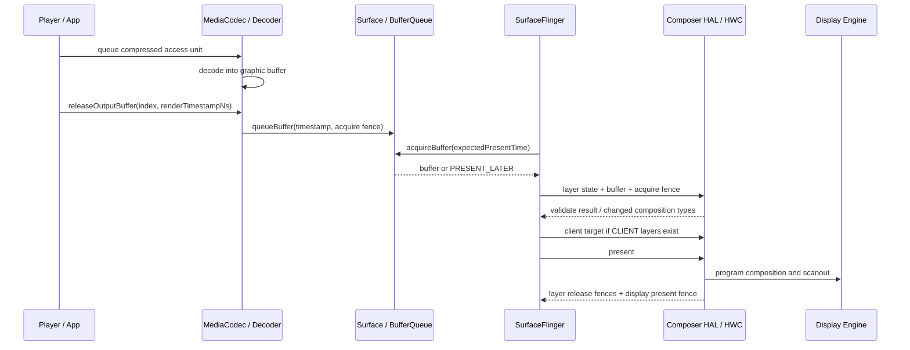
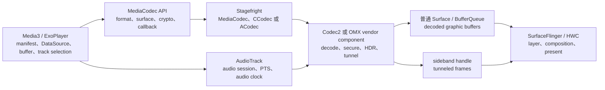
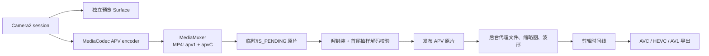

# 视频 Overlay、Media3 与专业编解码管线

视频播放从容器和 ABR 选择进入解码器，经 Surface、BufferQueue 和 HWC 显示。是否使用 tunneled playback 或 overlay 会改变 buffer 流向、音视频同步和功耗；专业视频还增加格式、色深和编解码能力约束。

## 视频 Layer、Overlay 与 HWC 决策

### SurfaceView 只提供 Overlay 候选条件

这里的 Overlay 指显示硬件直接参与某个 Layer 的合成，视频像素无须先由 RenderEngine/GPU 采样进 client target。“使用 `SurfaceView`，视频就会走 Overlay 并绕过 GPU”的说法漏掉了逐帧协商这一条件。`SurfaceView` 会为视频保留独立的 SurfaceFlinger Layer（合成单元），让 HWC（Hardware Composer，硬件合成器 HAL）有机会把它判为 `DEVICE`。最终是否采用显示硬件合成，要等 SurfaceFlinger 把当前帧的完整 Layer 栈交给 HWC 后才能确定。视频格式、缩放、旋转、HDR、受保护属性、叠加 UI、可用 plane 数量和显示带宽都会影响这一帧的选择；plane 是显示硬件可独立读取、缩放或混合一路图像的资源。

因此要分开回答四个问题：

| 问题 | 谁决定 | 能从哪里确认 |
| --- | --- | --- |
| 解码器把帧输出到哪里 | MediaCodec / Codec2 / 厂商解码器 | codec 配置、media trace |
| 视频是否保留为独立 Layer | `SurfaceView`、`TextureView` 或自定义渲染结构 | SurfaceFlinger layer trace |
| 该 Layer 由 GPU 还是显示硬件合成 | SurfaceFlinger 与 Composer HAL 逐帧协商 | HWC composition type |
| 帧何时可读、何时送显、何时可复用 | BufferQueue、fence、HWC 和显示驱动 | Perfetto、fence、驱动 trace |

本文的平台源码版本是 Android 17 / API 37 / `android-17.0.0_r1`，内核版本是 `android17-6.18-2026-06_r6`。Codec、DRM、Composer HAL 和显示驱动通常包含设备定制；分析具体设备时，还要记录系统 build fingerprint、codec 名称、DRM 安全级别和 Composer HAL 版本。

### 普通 Surface 视频的一帧怎样到达屏幕

下面这张图展示非 tunneled 播放的时序。该路径由 App 按帧释放 codec 输出，再通过普通 BufferQueue 交给 SurfaceFlinger：



图中的 access unit 是一份送入 decoder 的压缩数据单元，scanout 则是显示引擎按扫描时序读取最终画面的过程。调用 `releaseOutputBuffer(index, renderTimestampNs)` 时，App 放弃对该输出 buffer 的控制，并要求 codec 按给定时间将它渲染到 Surface；调用返回不代表这一帧已经显示。Android 17 的 `MediaCodec.java` 仍将这个重载的时间戳定义为纳秒，后续能否按时 latch、合成和 scanout，还要继续检查 BufferQueue、SurfaceFlinger 与 HWC。

#### 时间戳决定“希望何时显示”

Android 17 的 `BufferQueueProducer.cpp` 会在 `queueBuffer()` 路径把 requested present timestamp（生产者期望的显示时间）写入 `BufferItem::mTimestamp`。消费端 `BufferQueueConsumer::acquireBuffer(expectedPresent, ...)` 会将它与当前目标 present time 比较：

- 队首帧距离目标显示时间还太早时，返回 `PRESENT_LATER`，SurfaceFlinger 暂不 acquire；
- 队列中存在更合时的后续帧时，旧帧可能被丢弃；
- 时间戳明显不合理或距离目标时间过远时，代码会进入保护分支，避免错误时间戳长期卡住队列。

requested present timestamp 只表达期望时间，不是显示完成凭据。codec 产出 buffer、SurfaceFlinger latch 该 buffer、显示硬件完成 present 分属不同阶段；定位视频卡顿时，只看到 `releaseOutputBuffer()` 正常返回远远不够。

#### 三类 fence 不要混为一谈

| fence | 保护的依赖 | 信号后的含义 |
| --- | --- | --- |
| Layer acquire fence | 生产者写 buffer → HWC 或 GPU 读取 | 消费者可以安全读取该 Layer buffer |
| Layer release fence | HWC 读取 Layer → buffer 回到生产者 | 本次显示使用已结束，该 buffer 才可安全复用 |
| Display present fence | 本次显示提交 → 显示硬件完成相应工作 | 表示整帧 present 的完成边界；是否可当作精确上屏时刻还受 `PRESENT_FENCE_IS_NOT_RELIABLE` 能力影响 |

acquire 与 release 的名称描述某次 buffer 所有权交接的两端；离开具体交接关系，单看名称无法确定等待发生在 codec、GPU 还是显示端。Android 的 fence 最终由内核 `dma_fence` 表示，跨进程 fd 封装由 `sync_file` 提供。`PRESENT_FENCE_IS_NOT_RELIABLE` 则表示设备声明 present fence 不适合用作精确显示时刻。排查时无须记忆 fd 编号，应沿生产者、SurfaceFlinger、Composer HAL、显示驱动逐段确认等待关系，否则很容易把解码慢、排队晚、fence 晚和显示提交晚都归为“视频掉帧”。

### SurfaceView、TextureView 与自定义 GPU 路径

#### SurfaceView：保留独立的合成单元

`SurfaceView` 的 buffer 进入独立的 SurfaceFlinger Layer。即使 App Window 没有重绘，视频 Layer 也可以按自己的帧率更新。这个结构让 HWC 能单独检查视频 Layer 的 YUV 格式、dataspace（色彩与传递特征描述）、crop、transform、alpha、保护属性和目标区域。

如果 HWC 接受它为 `DEVICE`，RenderEngine 就无须采样这个视频 Layer。屏幕上仍可能同时存在 GPU 生成的 client target，即 RenderEngine 将一个或多个 `CLIENT` Layer 预先合成得到的整块图像，例如 App UI 或复杂特效。因此，`DEVICE` 只说明视频 Layer 由设备侧合成，不能据此认定整帧没有 GPU 工作。

#### TextureView：视频先成为 App 渲染输入

`TextureView` 通过 `SurfaceTexture` 把视频帧作为纹理交给 App，HWUI 或自定义 GL 渲染再将它画入 App Window buffer。到达 SurfaceFlinger 时，视频像素通常已经与 App UI 合并在同一个 Layer 中，HWC 无法再把其中的“视频部分”单独分配给硬件 plane。

这条路径适合任意几何变换、透明度、圆角、模糊以及与 UI 紧密混合的场景，代价是每帧增加 GPU 采样和 App Window 写回。是否值得采用，需要比较同一设备、亮度、分辨率和刷新率下的测量结果。

Android 17 的宿主链从 `SurfaceTexture.OnFrameAvailableListener` 进入 `TextureView.updateLayer()` / `invalidate()`；绘制同步后，RenderThread 侧的 `DeferredLayerUpdater::apply()` 调用 `ASurfaceTexture_dequeueBuffer()`，获取最新 `AHardwareBuffer` 并更新 HWUI layer。Codec buffer 已经可读，只能说明 TextureView 有新纹理可取；宿主 traversal（View 树遍历）、RenderThread 或 App Window 提交迟到，最终画面仍会沿用旧帧。

#### 自定义 GL / Vulkan：看输出 Surface，不看 API 名字

自定义渲染有两种常见结构：

- codec 输出到 `SurfaceTexture`，GL/Vulkan 采样后画进 App Window：视频属于 GPU 路径；
- App 把内容画到独立 `SurfaceView` 或其他独立 Surface：该输出仍可作为独立 Layer 参与 HWC 协商。

“使用 Vulkan”或“使用 OpenGL ES”本身不能推出 `CLIENT` 或 `DEVICE`。判断依据是最终内容提交到哪个 Surface，以及该 Surface 在 SurfaceFlinger 中形成了怎样的 Layer。

### HWC 负责什么

HWC 位于 SurfaceFlinger 与设备显示实现之间。它根据当前帧的 Layer 栈和硬件能力提出合成方案，并在存在 GPU 合成内容时接收 SurfaceFlinger 的 client target。AIDL Composer3 的 `Composition.aidl` 定义了三种与视频密切相关的 composition type：

| Composition | Android 17 的接口语义 | 对视频排查的含义 |
| --- | --- | --- |
| `CLIENT` | SurfaceFlinger 的 RenderEngine 把该 Layer 画入 client target，再通过 `setClientTarget()` 交给设备 | 该视频 Layer 参与 RenderEngine/GPU 合成 |
| `DEVICE` | 设备用 hardware overlay 或类似方式处理该 Layer | 该视频 Layer 不由 RenderEngine 采样；具体硬件结构仍由设备决定 |
| `SIDEBAND` | 设备负责 Layer 合成、buffer 更新和内容同步，要求 `SIDEBAND_STREAM` 能力 | 常见于 tunneled playback，通过 sideband handle 关联设备侧流，不走普通逐帧 BufferQueue 更新 |

`DEVICE` 只界定该 Layer 的合成职责，不承诺“一层对应一个物理 plane”，也不承诺固定功耗收益。Composer HAL 不向 framework 暴露具体硬件映射；plane 分配、DPU（Display Processing Unit，显示处理单元）block、色彩单元和带宽策略都属于设备实现。

#### Mixed composition 是常态

一帧可以同时包含：

- 视频 Layer：`DEVICE`；
- App UI、模糊背景或复杂圆角：一个或多个 `CLIENT`；
- GPU 合成这些 `CLIENT` Layer 得到的 client target：再交回 HWC；
- HWC 把 client target 与 `DEVICE` Layer 一起提交给显示硬件。

因此，Perfetto 中出现 GPU 工作不足以证明视频 Overlay 失败。还要确认 GPU 正在处理哪些 Layer，并查看视频 Layer 自己的 `hwc_composition_type`。

### SurfaceFlinger 怎样做每帧协商

validate 是 SurfaceFlinger 与 HWC 对本帧合成分工的确认过程。非 skip-validate 路径可以分为以下几步：

1. SurfaceFlinger 收集本帧可见 Layer，准备 buffer、几何、dataspace、transform、blend mode、可见区域和 acquire fence。
2. CompositionEngine 把 Layer 状态写给 Composer HAL，并请求 validate，询问当前方案是否能由设备执行。
3. HWC 通过 changed composition types 返回需要调整的 Layer 类型。SurfaceFlinger 接受变更后，才能确定哪些 Layer 要改为 `CLIENT`。
4. 如果存在 `CLIENT` Layer，RenderEngine 生成 client target，SurfaceFlinger 用 `setClientTarget()` 把它交给 HWC。
5. HWC 接收 `DEVICE` Layer、client target 和相关 fence，完成 present，并返回 release fence 与 present fence。

Overlay 因此属于逐帧决策。即使上一帧的视频 Layer 是 `DEVICE`，新出现的字幕、画中画、颜色变换、旋转或 plane 竞争，也可能让下一帧改为 `CLIENT`。

#### Android 17 的 `presentOrValidate()` 快路径

在 Android 17 的 `HWComposer::getDeviceCompositionChanges()` 中，设备声明 capability 并不会让 `canSkipValidate` 自动成立。framework 还会检查两个前置条件：

- 本帧当前不能已经需要 client composition；
- 若存在 `earliestPresentTime`，当前 steady clock（单调递增的稳定时钟）必须到达该时间；如果 Composer 支持 expected present time，framework 可以把期望时间交给 Composer，因而不必在这里等待。

条件满足后，SurfaceFlinger 调用 `presentOrValidate()`。返回 `PresentSucceeded` 表示这次调用已经完成 present 阶段，framework 会直接保存 release fence 和 present fence，随后不能再按固定流程额外调用一次 `presentDisplay()`。若返回 validate 结果，framework 仍要处理 changed types，并在需要时执行 client composition。

Composer3 AIDL 已将 `Capability.SKIP_VALIDATE` 标记为 deprecated，并注明该行为默认可用。这里的“默认可用”只说明接口不再依赖显式 capability 位，不能解释某台设备的快路径命中率；实际命中仍取决于帧状态、时序与 HAL 返回结果。

### Overlay 为什么会回退

HWC 的可用能力由 SoC 显示模块、Composer HAL、显示模式和当前 Layer 栈共同决定。下表列出的是排查维度，不应写成跨设备规则：

| 维度 | 典型约束 | 建议观察 |
| --- | --- | --- |
| Plane 资源 | 可用 plane 数量，以及每个 plane 支持的格式与 z-order（前后层级）有限 | 新增浮层前后 composition type 是否改变 |
| buffer 格式 | YUV/RGBA、位深、压缩 modifier、stride 可能超出显示硬件能力；modifier 描述特定的压缩或内存布局 | pixel format、dataspace、gralloc usage |
| 几何变换 | 过大的缩放比例、旋转、复杂 crop 可能不受支持 | source crop、display frame、transform |
| 混合效果 | per-pixel alpha、圆角、阴影、模糊和复杂遮挡会增加限制 | blend mode、alpha、corner radius、background blur |
| HDR 与颜色处理 | tone mapping（色调映射）、HDR/SDR 混合、颜色变换可能占用专用 block | dataspace、HDR metadata、color transform |
| 受保护路径 | 安全 plane、protected client target 或目标 display 的安全能力不匹配 | protected usage、secure Layer、DRM/HDCP 状态 |
| 多显示器 | 内屏、外接屏和虚拟显示的合成能力不同 | display id、输出模式、镜像或录屏状态 |
| 带宽与刷新率 | 高分辨率、高刷新率、多路视频会增加读带宽 | display mode、视频尺寸、同时更新的 Layer |

不要用“设置了 alpha 就一定回退”这类说法编写业务判断。更可靠的做法是设计 A/B 场景，每次只改变一个变量，并连续采集 SurfaceFlinger layer trace、GPU counters、显示频率和功耗。

#### GPU、DEVICE 与 SIDEBAND 的通路对比

| 路径 | 逐帧像素经过 App / SF 的方式 | 视频 Layer 是否由 RenderEngine 采样 | 适用能力 | 代价与边界 |
| --- | --- | --- | --- | --- |
| `TextureView` / GPU | 视频成为 App 纹理，写入 App Window buffer | 是 | 复杂变换和特效 | 多一次采样与写回；视频不再是独立 HWC Layer |
| `SurfaceView` + `DEVICE` | 普通 BufferQueue，SurfaceFlinger 逐帧 latch | 否 | 设备接受该 Layer 的硬件合成 | 仍有 SF/HWC/fence 工作，也可能存在其他 GPU client composition |
| Tunneled + `SIDEBAND` | sideband handle；视频更新与同步由设备机制处理 | 否 | codec、Audio HAL、Composer HAL 与显示链共同支持 | 可用性和格式受设备约束，GPU 特效能力受限 |

在同一台设备上，`DEVICE` 或 `SIDEBAND` 往往能减少视频相关的 GPU 采样和内存写回，但系统总功耗还包含解码、DDR、DPU、面板和背光。结论应来自受控测量，不能预设固定百分比，也不能把某个 SoC 的结果直接推广到其他机型。

### Tunneled playback 与 SIDEBAND

Tunneled playback 把逐帧选择和 A/V 同步交给 codec、音频或 tuner 时钟以及设备显示链。sideband handle 是 framework 传给 HWC 的不透明流句柄，由设备侧机制更新内容并维持同步；因此，sideband layer 不一定出现普通 Surface 视频那样密集的 `queueBuffer` 和 latch 事件。本节只界定它与 HWC composition type 的关系：确认 codec capability、sideband 状态、`SIDEBAND` composition 和设备时钟后，才能把缺少逐帧图形事件判断为正常路径。Codec2 配置、Media3 ABR、音视频同步和完整排障由本文后文统一展开。

### DRM、Secure Video 与 Overlay

本节的 DRM 指 Digital Rights Management（数字版权管理）。`FEATURE_SecurePlayback`、`DEVICE` 和 `FEATURE_TunneledPlayback` 属于不同层面的能力，不能互相替代：

- `FEATURE_SecurePlayback` 表示 codec 支持 secure playback，可参与受保护的解码路径；
- protected buffer / secure Layer 要求像素从解密、解码、分配、合成到输出端都留在允许的安全路径；
- `DEVICE` 表示 HWC 负责合成该 Layer；
- `FEATURE_TunneledPlayback` 表示 codec 支持 tunneled playback；
- `SIDEBAND` 是 tunneled 视频常用的 HWC composition type。

受保护视频通常优先使用安全硬件合成，但“受保护”不能推出“必定 DEVICE”或“必定 SIDEBAND”。Android 17 的 CompositionEngine 会查询 RenderEngine 是否支持 protected content，framework 也保留 protected client composition 路径。设备能否使用这条路径，取决于 protected EGL/GPU、gralloc、codec、Composer HAL、显示输出和 DRM 策略能否共同满足要求。

Android 17 公开的 `HardwareBuffer.USAGE_PROTECTED_CONTENT` 与 graphics common AIDL `BufferUsage.PROTECTED` 只表达 buffer 的保护用途。单凭 usage 标志无法证明 secure decoder、allocator、RenderEngine/HWC、显示输出与 HDCP 已形成完整安全链，仍要逐段核对能力和运行结果。HDCP 是外接数字显示链路上的内容保护协议。

安全路径不满足时，系统可能拒绝播放、显示黑屏、降低输出能力或禁止镜像。这些行为可能是在执行内容保护策略，不能为了恢复画面而改用可被非安全组件读取的 buffer。排查时还要查看外接显示的 HDCP 状态、secure Layer 标记和 DRM session 日志。

### 帧率匹配与 Overlay 是两条问题线

视频 Layer 已经是 `DEVICE`，仍可能出现 judder（因帧间节奏不均产生的周期性顿挫）；视频 Layer 是 `CLIENT`，也不一定掉帧。诊断时需要分开观察两条问题线：

- **合成路径**：`CLIENT`、`DEVICE` 还是 `SIDEBAND`；
- **节奏与时序**：codec 输出 PTS（Presentation Timestamp，期望呈现时间）、`releaseOutputBuffer()` 时间、BufferQueue desired present、SurfaceFlinger latch、显示刷新率和 present fence。

`Surface.setFrameRate()` 向系统声明内容帧率，供 Scheduler 选择显示模式和节奏，但不保证显示器一定切换。视频应报告内容的准确帧率，固定帧率视频可使用 `FRAME_RATE_COMPATIBILITY_FIXED_SOURCE`；暂停或结束后 Surface 仍然可见时，可传入 0 清除提示。24 fps 内容在 120 Hz 屏幕上每帧重复 5 次属于稳定 cadence（帧重复节奏），不能仅凭“屏幕提交了 120 次”认定解码器重复输出。

帧率 vote 是 Layer 向 SurfaceFlinger Scheduler 提交的帧率偏好，用于显示模式和节奏选择；它不会直接指定视频 Layer 的 `CLIENT`、`DEVICE` 或 `SIDEBAND`。刷新率与 composition type 可能在同一时段变化，仍须分别查看 Layer 状态和调度证据，才能判断因果关系。

当问题表现为周期性顿挫时，可以按时间线依次检查：

1. 输入 PTS 是否单调，是否有变帧率或不连续点；
2. codec 输出与 release 是否已经晚于目标呈现时刻；
3. BufferQueue 是否出现 `PRESENT_LATER`、丢旧帧或队列堆积；
4. SurfaceFlinger 是否在目标 VSync 前 latch；
5. HWC acquire fence、present fence 或显示驱动提交是否变晚；
6. 显示刷新率是否与内容帧率形成稳定倍频。

### 用 dumpsys 与 Perfetto 识别合成路径

#### dumpsys：适合看某一时刻的快照

下面的命令用于保存 SurfaceFlinger 快照，并从中初步查找目标视频 Layer；采集前先让视频进入稳定播放状态：

```bash
adb shell dumpsys SurfaceFlinger > sf-video.txt
grep -niE 'SurfaceView|video|composition( type)?|sideband|protected' sf-video.txt
```

命令会生成完整的 `sf-video.txt`，第二行筛出的内容只用于定位，不能替代上下文。不同 Android 版本和厂商 build 的文本布局会变化。Android 17 AOSP 的 CompositionEngine dump 会输出类似 `composition` / `composition type` 的字段；不要依赖固定的 `grep -A5` 行数。应先按 Layer 名找到目标 Layer，再在对应 display 的 output-layer 状态中核对 `DEVICE`、`CLIENT` 或 `SIDEBAND`。

`dumpsys` 只能代表采集瞬间。播放控制条刚消失、字幕刚更新或显示模式正在切换时，结果可能与稳态不同，至少要采集两组状态：

- 无浮层的稳态播放；
- 控制条、字幕、圆角或 PiP 出现时。

#### Perfetto：适合看 composition type 是否随时间变化

下面的命令用于采集 15 秒系统 trace，包含 SurfaceFlinger、图形、调度和频率信息：

```bash
adb shell perfetto \
  -o /data/misc/perfetto-traces/video-hwc.perfetto-trace \
  -t 15s -b 128mb \
  gfx view sched freq idle binder_driver
adb pull /data/misc/perfetto-traces/video-hwc.perfetto-trace
```

命令先把 trace 写入设备，再通过 `adb pull` 取回本机。导入 Perfetto 后，沿目标视频 Layer 检查：

- Layer 快照中的 `hwc_composition_type`；Android 17 的 `Layer.cpp` 会把它写入 Perfetto proto；
- 视频 Layer 的 buffer 更新、期望显示时间与 latch；
- SurfaceFlinger 的 commit/composite/present 活动；
- RenderEngine/GPU 工作是否只在浮层出现时增加；
- acquire、release、present fence 的等待是否与卡顿重合；
- CPU/GPU/DDR 或显示频率变化发生在合成切换之前还是之后，据此区分原因与结果。

判断 Overlay 的最低直接证据是目标视频 Layer 在问题区间的 composition type 为 `DEVICE`。GPU track 较空只能作为旁证，因为 GPU 还可能执行 App 渲染、其他 client composition 或无关任务；反过来，GPU 忙也不能单独证明目标视频 Layer 是 `CLIENT`。

#### 一套可复现的 A/B 实验

| 实验 | 只改变什么 | 需要保持不变 | 预期能回答的问题 |
| --- | --- | --- | --- |
| A | `SurfaceView` ↔ `TextureView` | 文件、codec、亮度、刷新率、分辨率 | 独立 Layer 与 App 纹理路径的差异 |
| B | 显示/隐藏播放控制条 | 视频与显示模式 | UI 叠加是否改变 composition type |
| C | 开关圆角、alpha、旋转 | 其他 Layer 不变 | 哪种几何或混合状态触发回退 |
| D | SDR ↔ HDR 样本 | 编码复杂度尽量接近 | HDR、dataspace 或 tone mapping 是否改变路径 |

每轮同时记录 SurfaceFlinger、Perfetto、codec 名称、温度、亮度和显示模式。缺少这些控制变量时，面板亮度、热状态或刷新率切换很容易被误认为 Overlay 带来的功耗变化。

### 内核和驱动侧看什么

Android 通用内核不负责选择 `CLIENT` 或 `DEVICE`，这个决定由 SurfaceFlinger 与 Composer HAL 协商。内核提供 buffer 共享、同步和显示驱动执行机制。这里的 DRM/KMS 指内核图形子系统 Direct Rendering Manager / Kernel Mode Setting，与前文数字版权管理语境中的 DRM 含义不同：

- `dma-buf` 让 codec、GPU、DPU 等设备共享同一块图形内存；
- `dma_fence` 表示异步硬件任务之间的完成依赖；
- `sync_file` 把 fence 封装成可跨进程传递的 fd（文件描述符）；
- DRM/KMS 或厂商显示驱动把 Layer 规划转换为 plane、color pipeline 和 atomic commit。

在 `android17-6.18-2026-06_r6` 中，可从 `drivers/dma-buf/dma-buf.c`、`include/linux/dma-fence.h` 与 `drivers/dma-buf/sync_file.c` 核对这些通用机制。具体 plane 分配和显示 trace 节点由设备驱动决定；某台 Qualcomm、MediaTek、Mali 或 Exynos 设备的 debugfs 名称不能当作 Android 通用接口。

内核侧出现长时间 fence wait 时，应向上对齐同一帧并区分等待来源：

- 是 codec 写完得晚，导致 Layer acquire fence 晚；
- 是 GPU client target 晚；
- 是 HWC/显示驱动释放 Layer 晚；
- present fence 是否因可靠性能力声明而不适合作为精确上屏时间。

### HWC2.x 到 Composer3：接口变化不等于硬件升级

| 平台阶段 | Composer HAL 形态 | 分析影响 |
| --- | --- | --- |
| Android 8–12 | HIDL `android.hardware.graphics.composer@2.1` 到 `2.4` | SurfaceFlinger 与 HWC 继续按 validate / present 模型协商 |
| Android 11+ | Codec2 支持 tunneled playback 的标准配置路径 | C2 组件可返回 tunnel handle，设备仍需完整支持 |
| Android 13–17 | AIDL `android.hardware.graphics.composer3` 可供厂商实现，HIDL 版本被弃用 | 命令传输与接口演进，`CLIENT` / `DEVICE` / `SIDEBAND` 的职责仍需按源码判断 |
| Android 17 | 锚定 `android-17.0.0_r1` | `SKIP_VALIDATE` 注解为默认启用；框架仍受 `canSkipValidate` 和 `presentOrValidate()` 结果约束 |

AIDL Composer3 改变的是 framework 与 Composer HAL 之间的接口形式，不会自动增加 plane 数量，也不会让旧硬件获得新的缩放、HDR 或 protected 能力。分析具体机型时，需要分别记录 Android API 版本、Composer HAL 接口版本和 DPU 硬件代际。

### 与其他章节的关系

- [2.9 SurfaceFlinger 合成、FrontEnd 与事务队列](../../part1-fundamentals/ch02-rendering/09-surfaceflinger-frontend-transaction.md)：Layer、CompositionEngine 与显示提交的系统路径。
- [2.7 GPU 渲染与图形 API 选型](../../part1-fundamentals/ch02-rendering/07-gpu-rendering-graphics-api.md)：RenderEngine/client composition 的 GPU 侧成本。
- [13.3 SurfaceView 与 TextureView 渲染管线](03-surfaceview-textureview-pipelines.md)：独立 Surface、窗口层级、生命周期以及 `SurfaceTexture` 采样。
- [22.17 Media3 视频播放：解码、帧时序与渲染](../../part5-app/ch22-rendering-practice/17-media3-video-rendering.md)：播放器侧的 Surface 生命周期、prewarming、effects、HDR/DRM 与首帧观测。

### 源码核对清单

#### Android 17 / API 37

- [`MediaCodec.java`](https://android.googlesource.com/platform/frameworks/base/+/refs/tags/android-17.0.0_r1/media/java/android/media/MediaCodec.java)、[`MediaCodecInfo.java`](https://android.googlesource.com/platform/frameworks/base/+/refs/tags/android-17.0.0_r1/media/java/android/media/MediaCodecInfo.java)、[`MediaFormat.java`](https://android.googlesource.com/platform/frameworks/base/+/refs/tags/android-17.0.0_r1/media/java/android/media/MediaFormat.java)：Surface 渲染、secure/tunneled capability 与同步 key。
- [`CCodec.cpp`](https://android.googlesource.com/platform/frameworks/av/+/refs/tags/android-17.0.0_r1/media/codec2/sfplugin/CCodec.cpp)、[`CCodecBufferChannel.cpp`](https://android.googlesource.com/platform/frameworks/av/+/refs/tags/android-17.0.0_r1/media/codec2/sfplugin/CCodecBufferChannel.cpp)、[`ACodec.cpp`](https://android.googlesource.com/platform/frameworks/av/+/refs/tags/android-17.0.0_r1/media/libstagefright/ACodec.cpp)：Codec2 / OMX 的 Surface output、protected buffer、tunneled mode 与 sideband handle。
- [`BufferQueueProducer.cpp`](https://android.googlesource.com/platform/frameworks/native/+/refs/tags/android-17.0.0_r1/libs/gui/BufferQueueProducer.cpp)、[`BufferQueueConsumer.cpp`](https://android.googlesource.com/platform/frameworks/native/+/refs/tags/android-17.0.0_r1/libs/gui/BufferQueueConsumer.cpp)：requested present、`expectedPresent`、丢旧帧与 `PRESENT_LATER`。
- [`TextureView.java`](https://android.googlesource.com/platform/frameworks/base/+/refs/tags/android-17.0.0_r1/core/java/android/view/TextureView.java)、[`DeferredLayerUpdater.cpp`](https://android.googlesource.com/platform/frameworks/base/+/refs/tags/android-17.0.0_r1/libs/hwui/DeferredLayerUpdater.cpp)：TextureView frame available、宿主 invalidation 与最新 buffer 获取。
- [`HWComposer.cpp`](https://android.googlesource.com/platform/frameworks/native/+/refs/tags/android-17.0.0_r1/services/surfaceflinger/DisplayHardware/HWComposer.cpp)、[`Display.cpp`](https://android.googlesource.com/platform/frameworks/native/+/refs/tags/android-17.0.0_r1/services/surfaceflinger/CompositionEngine/src/Display.cpp)、[`Output.cpp`](https://android.googlesource.com/platform/frameworks/native/+/refs/tags/android-17.0.0_r1/services/surfaceflinger/CompositionEngine/src/Output.cpp)：`canSkipValidate`、composition strategy、client target、protected composition 与 present。
- [`Layer.cpp`](https://android.googlesource.com/platform/frameworks/native/+/refs/tags/android-17.0.0_r1/services/surfaceflinger/Layer.cpp)：把 HWC composition type 写入 Layer trace proto。
- [`Composition.aidl`](https://android.googlesource.com/platform/hardware/interfaces/+/refs/tags/android-17.0.0_r1/graphics/composer/aidl/android/hardware/graphics/composer3/Composition.aidl)、[`Capability.aidl`](https://android.googlesource.com/platform/hardware/interfaces/+/refs/tags/android-17.0.0_r1/graphics/composer/aidl/android/hardware/graphics/composer3/Capability.aidl)：`CLIENT`、`DEVICE`、`SIDEBAND`、present fence 可靠性与 skip validate。
- [`HardwareBuffer.java`](https://android.googlesource.com/platform/frameworks/base/+/refs/tags/android-17.0.0_r1/core/java/android/hardware/HardwareBuffer.java)、[`BufferUsage.aidl`](https://android.googlesource.com/platform/hardware/interfaces/+/refs/tags/android-17.0.0_r1/graphics/common/aidl/android/hardware/graphics/common/BufferUsage.aidl)：protected buffer usage。

#### Android 17 通用内核

- [`dma-buf.c`](https://android.googlesource.com/kernel/common/+/refs/tags/android17-6.18-2026-06_r6/drivers/dma-buf/dma-buf.c)：跨设备 buffer 共享和 attachment。
- [`dma-fence.c`](https://android.googlesource.com/kernel/common/+/refs/tags/android17-6.18-2026-06_r6/drivers/dma-buf/dma-fence.c)、[`dma-fence.h`](https://android.googlesource.com/kernel/common/+/refs/tags/android17-6.18-2026-06_r6/include/linux/dma-fence.h)：fence signal、wait 与公共同步接口。
- [`sync_file.c`](https://android.googlesource.com/kernel/common/+/refs/tags/android17-6.18-2026-06_r6/drivers/dma-buf/sync_file.c)：fence fd 封装。

#### 官方说明

- [Hardware Composer HAL](https://source.android.com/docs/core/graphics/hwc)
- [Implement Hardware Composer HAL](https://source.android.com/docs/core/graphics/implement-hwc)
- [AIDL for Hardware Composer HAL](https://source.android.com/docs/core/graphics/aidl-hwc)
- [Multimedia tunneling](https://source.android.com/docs/devices/tv/multimedia-tunneling)
- [MediaCodecInfo.CodecCapabilities](https://developer.android.com/reference/android/media/MediaCodecInfo.CodecCapabilities)
- [Video frame rate](https://developer.android.com/media/optimize/performance/frame-rate)
- [Android 17 release notes](https://developer.android.com/about/versions/17/release-notes)


## Media3、Codec2 与 Tunneled Playback

HWC 只处理到达显示端的 layer，播放前半段还包括 ABR、缓冲、解码和音视频时钟。每个队列都可能形成独立反压。

视频播放卡顿可能来自下载、码率选择、解码、Surface 消费、合成、显示或音频时钟。如果把这些阶段统称为“播放器卡”，很容易在错误层级调整参数。分析时固定三组核查基线：

- Android 平台：Android 17 / API 37 / `android-17.0.0_r1`。
- kernel：`android17-6.18-2026-06_r6`。
- Media3：截至 2026-07-31 的最新稳定版为 1.10.1，源码 tag 对应 commit `5fb306449733dd71595700c1227ad6087578c559`。1.11.0-rc01 已于 2026-07-22 发布，本文的常量仍以稳定版 1.10.1 为准。

Android 平台版本和 Media3 库版本彼此独立。设备运行 Android 17，不能说明应用使用哪个 Media3 版本；升级 Media3 也不会替换设备上的 codec、Composer HAL 或显示驱动。

### 按责任边界理解播放管线

下面这张图把普通视频输出与 tunneled playback 共用的控制面放在一起，用于确认每项决策和证据属于哪一层：



Media3 负责解析 manifest（媒体清单）、下载 segment（媒体分片）、维护播放 buffer，并从可用 track（不同码率、分辨率或语言的轨道）中选择当前档位。`MediaCodec` 是应用可见的 codec 控制接口，Stagefright 是其 native 媒体框架，再把请求交给 CCodec/Codec2 或 ACodec/OMX。普通视频帧经 Surface 的 BufferQueue 到达 SurfaceFlinger；tunnel 模式则把 sideband handle 绑定到 layer，逐帧选择主要由 codec、音频同步硬件和 HWC 完成。

常见现象可以先这样归位：

| 现象 | 优先核对 | 有效证据 |
| --- | --- | --- |
| 弱网降质或反复切档 | DataSource、BandwidthMeter、ABR | 传输样本、带宽估计、buffered duration、track change reason |
| 首帧慢 | manifest、首个分片、codec 初始化、首帧显示 | 请求时长、configure/start、首个 input/output PTS（Presentation Timestamp，期望呈现时间）、first-frame callback |
| seek 慢 | 请求范围、关键帧、flush 后预解码 | seek 目标、前一同步帧、discard 数量、seek 后首帧 |
| 普通播放掉帧 | codec、Surface、SurfaceFlinger/HWC | output/release 时间、queue/latch、acquire fence、present |
| tunnel 黑屏或停住 | audio session、HW A/V sync、sideband、vendor HAL | tunnel capability、codec configure、AudioTrack 状态、sideband layer、HWC/vendor log |
| 某些设备硬解失败 | codec 组合能力 | codec name、MIME、profile/level、secure、HDR、分辨率、帧率 |

这张表只能确定调查入口。例如，用户看到画面卡住而声音继续，可能是 decoder 输出晚，也可能是普通 Surface 队列 backpressure、HWC 切换合成策略或 tunnel 侧视频同步异常，需要沿同一帧的时间关系继续取证。

### Android 17 同时保留 Codec2 与 OMX 路径

Android 10 已把可更新的软件 Codec2 组件纳入 Media Codecs APEX（可独立更新的系统模块），并支持 vendor C2 service；Android 11 起 Codec2 协议支持 tunneled playback。Android 17 的 `frameworks/av` 仍同时包含 `CCodec` 和 `ACodec`，平台并未统一只走 Codec2。

两条路径的应用入口都可以是 `MediaCodec`，native 侧对象和等待点却不同：

| 维度 | Codec2 / CCodec | OMX / ACodec |
| --- | --- | --- |
| 组件入口 | `C2ComponentStore`（组件注册与发现入口）、`C2Component` | OMX node、component、port |
| 工作单元 | `C2Work`（一笔输入及其输出、配置更新的工作记录）、`C2Buffer`、config update | input/output buffer、port callback（端口事件回调） |
| 完成通知 | `onWorkDone()` 等 C2 listener | empty/fill buffer done、OMX event |
| tunnel 配置 | `C2PortTunneledModeTuning` 与 tunnel handle | OMX video tunnel extension 与 sideband window |
| 诊断重点 | work queue、graphic block、C2 参数、component store | port 状态、buffer ownership、OMX command/event |

codec 名称仍是线上诊断的关键字段。API level 只能说明框架能力上限，不能告诉你本次实例选中了哪个 vendor component，也不能证明 secure、HDR、低延迟和 tunnel 的组合可用。

排查 `MediaCodec` 卡住时，至少记录：

- codec name 和 canonical name；
- MIME、profile、level、分辨率、帧率；
- CCodec 或 ACodec 路径；
- secure、HDR、tunneled、low-latency 标志；
- 输出 Surface 类型；
- configure/start/flush/stop/release 的起止时间；
- input/output PTS 与异常诊断信息。

`android-17.0.0_r1` 的 `CCodec::ClientListener::onWorkDone()` 接收已经完成或更新的 `C2Work` 列表并转交 CCodec；`ACodec.cpp` 仍保留 tunneled video 配置。两台设备即使出现相同的 `MediaCodec` Java 栈，也可能选择不同 component 和 native buffer 周转路径。

#### 低延迟、HDR 与动态元数据属于组合能力

Android 11 / API 30 起，应用可在 codec 声明 `FEATURE_LowLatency` 后设置 `MediaFormat.KEY_LOW_LATENCY`。这项能力要求 decoder 避免额外持有超过编码标准需要的数据，但编码结构所需的 B-frame 重排、网络 jitter buffer（吸收网络抖动的缓冲）、Surface 排队和显示 VSync 仍可能贡献延迟；运行时还可通过 `PARAMETER_KEY_LOW_LATENCY` 调整。

验收要同时记录 codec name、profile/level、首帧、稳态掉帧、功耗和热状态，不能从 API 可用性推导固定延迟。

HDR、Dolby Vision、secure、high-frame-rate、low-latency 与 tunnel 要按实际组合查询和测试。显示支持、decoder profile、extractor metadata、secure Surface、HWC plane 和 tone mapping 任一环节都可能改变结果。Android 17 还增加 Eclipsa video 的平台播放与采集能力；这只说明 framework 能传递相应动态元数据，不能保证所有 SoC、显示或 codec 组合都采用硬件低成本路径。

完整音频输出、AAudio/MMAP 与回调预算由 [1.20 音频链路（Audio Pipeline）延迟与性能](../../part1-fundamentals/ch01-architecture/20-audio-pipeline-performance.md) 承载；Camera 到 encoder 的 Surface 管线见 [13.10 Android Camera 平台管线：HAL3、Buffer、ZSL 与显示](10-camera-pipeline.md)；Media3 的 Surface 生命周期、prewarming、effects、HDR/DRM、首帧与播放器侧观测见 [22.17 Media3 视频播放：解码、帧时序与渲染](../../part5-app/ch22-rendering-practice/17-media3-video-rendering.md)。本节只保留播放控制面、Codec2/OMX、tunnel 与 ABR 的共同边界。

### 三种视频承载路径不能混为一谈

普通 SurfaceView、TextureView 和 tunneled playback 都能显示视频，但 decoded frame 的 consumer 与同步责任不同。

| 路径 | decoded frame 的去向 | SurfaceFlinger/HWC 看到什么 | 主要取舍 |
| --- | --- | --- | --- |
| 普通 SurfaceView | codec → Surface/BufferQueue | 独立视频 layer；HWC 每轮决定 DEVICE 或 CLIENT 等 composition | 适合长视频、高分辨率和 protected 内容；overlay 只是候选结果 |
| TextureView | codec → SurfaceTexture → App HWUI → App Window | 视频已采样进宿主窗口，通常没有独立视频 layer | 支持 View 变换、裁剪和动画；增加宿主 GPU 采样与窗口提交 |
| Tunneled playback | codec/HAL → sideband stream | sideband layer；HWC 按 A/V 同步取得视频帧 | 减少 framework 常规 decoded-buffer 周转，适合部分 TV/机顶盒；调试证据和图形效果受限 |

普通 SurfaceView 有独立 layer，但 HWC 是否采用硬件 overlay 仍要逐帧协商。格式、缩放、旋转、alpha、HDR/SDR 混合、protected usage、plane 数量和带宽都可能改变选择。TextureView 的外部视频 buffer 先由应用 HWUI 作为纹理消费，再画入宿主窗口；宿主主线程、RenderThread 或 GPU 迟到都会影响视频可见时间。

Tunnel 仍要通过 SurfaceFlinger 管理的 layer 进入显示链。Android 官方文档与 Android 17 源码给出的边界是：codec 返回 sideband handle（引用设备侧视频流的不透明句柄），native window 把 handle 交给 SurfaceFlinger，SurfaceFlinger 将该 layer 配置为 sideband，HWC 再按音频时钟或 tuner 时钟取得并显示视频帧。普通 decoded graphic buffer 不再按常规逐帧 `queueBuffer()` 形式交给应用/framework 图形路径。

### Tunneled playback 的 Android 17 源码路径

#### 能力与配置条件

低层播放器需要同时满足这些条件：

1. 低层平台接入时，选中的 video decoder 必须支持 `MediaCodecInfo.CodecCapabilities.FEATURE_TunneledPlayback`；audio output 还要能建立 hardware A/V sync（让音视频硬件共享同步时间基准）。Media3 会进一步检查已选 audio、video renderer 的 tunneling support。
2. 点播场景创建一个有效的 audio session id，并让 `AudioTrack` 与视频 `MediaCodec` 使用同一个 id。
3. `AudioTrack` 使用带 `AudioAttributes.FLAG_HW_AV_SYNC` 的输出路径，并持续接收带 PTS 的音频数据。仅把视频格式标成 tunneled，无法建立完整同步关系。
4. 输出使用 `SurfaceView` 提供的 Surface。官方低层接入步骤也以 `SurfaceView` 为承载面。
5. MIME、profile/level、secure decoder、DRM、HDR、分辨率和帧率在同一 codec 组合中均受支持。

能力查询只能回答是否允许发起请求，configure 成功与长时间稳定播放仍要通过设备测试证明。Media3 的 `setTunnelingEnabled(true)` 也只表达偏好；1.10.1 的 `DefaultTrackSelector` 要求恰好有一个已选 audio renderer 和一个已选 video renderer，且二者所选的全部 track 都报告 `TUNNELING_SUPPORTED`，才给这两个 renderer 写入 tunneling 配置。

下面的 Media3 代码只表达 tunnel 偏好；条件不满足时，播放器仍可选择普通输出路径：

```kotlin
val trackSelector = DefaultTrackSelector(context).apply {
    setParameters(
        buildUponParameters()
            .setTunnelingEnabled(true)
            .build()
    )
}

val player = ExoPlayer.Builder(context)
    .setTrackSelector(trackSelector)
    .build()
```

这段代码不能保证设备最终进入 tunnel。应用要从 renderer、codec 和 session 日志确认实际模式，并在目标机型上做播放测试。Media3 官方 API 也明确提示 tunneled playback 存在设备特定限制。

#### audio session 如何变成硬件同步 ID

Android 17 的 `MediaCodec.configure()` 遍历 `MediaFormat` 时，会把 `KEY_AUDIO_SESSION_ID` 改写为 native key `audio-hw-sync`，值来自：

`AudioSystem.getAudioHwSyncForSession(sessionId)`

`MediaFormat.KEY_AUDIO_SESSION_ID` 保存 AudioTrack session id，用于关联应用侧 audio session；传给 codec component 的则是 AudioFlinger/Audio HAL 为该 session 查询出的 hardware sync id。二者数值与职责都不能混用。排查时要同时记录 session id、audio route 和最终硬件同步配置，避免把 Java session id 直接当成 `HW_AV_SYNC`。

#### CCodec 如何建立 sideband

`android-17.0.0_r1` 的 CCodec 路径可以按四步阅读：

1. `CCodec.cpp` 在有输出 Surface、当前组件为视频 decoder，且消息包含非零 `feature-tunneled-playback` 时调用 `configureTunneledVideoPlayback()`。
2. 该函数创建 `C2PortTunneledModeTuning::output`，模式为 `SIDEBAND`。有 `audio-hw-sync` 时选择 `AUDIO_HW_SYNC`；有 `hw-av-sync-id` 时选择 `HW_AV_SYNC`；两者都没有时选择 `REALTIME` 同步类型。公开接口没有继续规定该类型在设备侧采用哪套具体时钟。
3. 函数通过 `C2PortTunnelHandleTuning::output` 查询 component 返回的 tunnel handle，并包装为 native handle。framework 只传递这个不透明句柄，不解析设备侧逐帧 buffer。
4. `CCodec::setSurface()` 调用 `native_window_set_sideband_stream()` 把 handle 设到输出 Surface；退出 tunnel 时会把 sideband stream 置空。

`C2Config.h` 把 tunneled mode、sync type、sync id、tunnel handle 和 tunnel render time 定义成独立参数。公开源码能确认 framework 与 component 的协议；sideband handle 之后如何关联 codec 硬件、secure video path 和 display plane，则由 vendor codec/HWC/driver 实现决定。

ACodec/OMX 也有对应路径：读取 `feature-tunneled-playback` 和 `audio-hw-sync`，调用 OMX tunnel extension，取得 sideband window，再绑定到 native window。配置成功后，`ACodec` 把输出端口的 `nBufferCountActual` 设为 0，跳过普通 native window buffer 分配。Android 17 仍保留该实现，运行时应通过实际 codec 名称和日志判断走哪条路径。

#### 首帧 ready、首帧 render 与 panel 可见是三个时刻

Tunnel 的首帧控制很容易被误读。Android 17 提供：

- `MediaCodec.PARAMETER_KEY_TUNNEL_PEEK`：控制 AudioTrack 暂停时，首个已解码视频帧是否提前显示；
- `MediaCodec.OnFirstTunnelFrameReadyListener`：报告首帧已经解码并具备进入 render 流程的条件；
- `MediaCodec.OnFrameRenderedListener`：报告 codec/HAL 给出的 frame rendered 事件，该事件仍属于 codec 侧反馈。

当 peek 关闭时，首帧可以完成解码并触发 first-tunnel-frame-ready，但显示仍保持上一幅画面或黑屏；AudioTrack 开始播放或应用开启 peek 后，held frame 才进入后续显示过程。

因此，`OnFirstTunnelFrameReadyListener` 不能充当首帧已上屏指标，`OnFrameRenderedListener` 也不等同于 panel scanout 完成的 present fence。应用若要定义“可见首帧”，还需结合显示侧或用户可见边界的证据。

Codec2 的对应路径为：

- Android 17 的 native `MediaCodec` 在显式 peek 状态下给第一块非 CSD、非 decode-only 输入写入内部 `tunnel-first-frame` 标记；
- `CCodecBufferChannel` 把该标记转成 `C2StreamTunnelHoldRender`；
- component 返回带 `C2StreamTunnelHoldRender` 和 `FLAG_INCOMPLETE` 的 work update 时，CCodec 上报 first-tunnel-frame-ready；`FLAG_INCOMPLETE` 表示这笔 work 还可能继续返回更新；
- `MediaCodec` 收到 ready 事件且 peek 已开启时发出内部 `android._trigger-tunnel-peek`，`CCodecConfig` 再把它映射到 `C2_PARAMKEY_TUNNEL_START_RENDER`；
- component 通过 `C2PortTunnelSystemTime` 上报 `CLOCK_MONOTONIC` 纳秒时间，CCodec 再触发 frame-rendered callback。

peek 的默认行为需要同时对照公开文档与兼容实现。`MediaCodec.java` 的 API 注释写着 peek 默认开启；Android 17 的 native `MediaCodec.cpp` 在应用未显式设置时仍保留 `kLegacyMode`，`start` 后把 `android._tunnel-peek-set-legacy=1` 传给 component。`CCodecConfig` 将其映射为 `UNSPECIFIED_PEEK`，decoder 可以忽略 hold/start-render 协议。官方设备实现文档也说明，应用未设置 `PARAMETER_KEY_TUNNEL_PEEK` 时，行为由 OEM 决定。

依赖 seek 预览或暂停态首帧的应用应在 codec 第一次 `start` 后、提交第一块有效视频输入前显式设置 `PARAMETER_KEY_TUNNEL_PEEK` 为 0 或 1。Android 17 会在 `flush` 或 `stop/start` 时保留已经显式设置的 enable bit，并把状态重置为“尚无首帧”；如果要改变策略，应在这个重置边界之后、下一块有效输入之前设置新值。重建 codec 实例时仍要重新显式设置，避免回到 legacy unspecified 模式。

点播 tunnel 通常以音频时钟推进视频。AudioTrack underrun（音频数据供应不足）、pause 或路由切换导致时钟不前进时，视频也可能停住。即使业务处于静音状态，仍需按官方实现要求继续提交带 PTS 的音频数据，不能直接停止 audio feed。

### Media3 1.10.1 的 ABR 到底看什么

ABR（Adaptive Bitrate，自适应码率）的工作分为两层：

1. `DefaultTrackSelector` 先按 renderer/codec 能力、viewport（视频显示区域）、用户约束、MIME、语言、HDR 等条件得到可选 track。
2. `AdaptiveTrackSelection` 再在可选 track 中，根据带宽预算、播放速度、下一个 chunk 时长、buffer 水位和 live edge（直播流当前可播放的最新位置）决定当前档位；传入的 `BandwidthMeter` 能提供 TTFB（Time to First Byte，首字节等待时间）估计时，还会将其计入预算。

第二层不会读取 HWC composition type，也不会因为某一帧错过 display deadline 就自动降码率。若希望解码掉帧影响选档，需要应用限制可选分辨率/码率、排除 track，或实现自定义策略。

#### 默认带宽估计

Media3 1.10.1 的 `DefaultBandwidthMeter` 在一次符合计量条件的全速网络传输结束时计算吞吐样本：

`sampleBitrate = sampleBytesTransferred * 8000 / sampleElapsedTimeMs`

样本以 `sqrt(sampleBytesTransferred)` 作为权重放入 `SlidingPercentile`（按最近加权样本求分位数的窗口）。累计传输时间达到 2 秒，或累计字节达到 512 KiB 后，使用 0.5 分位数，即加权中位数，更新 `bitrateEstimate`。尚无足够样本时，初始值按网络类型与国家/地区分组选择；未知或离线的默认初值为 1 Mbps。

这些阈值属于 Media3 1.10.1 库实现，不是 Android 17 平台常量。更换 Media3 版本后应重新核对源码，不能从设备 API level 推导。

#### 选档与 buffer 门槛

Media3 1.10.1 的 `AdaptiveTrackSelection` 默认值为：

| 常量 | 值 | 含义 |
| --- | ---: | --- |
| `DEFAULT_MIN_DURATION_FOR_QUALITY_INCREASE_MS` | 10,000 ms | 点播升档通常要求的最小 buffered duration |
| `DEFAULT_MAX_DURATION_FOR_QUALITY_DECREASE_MS` | 25,000 ms | buffer 达到该值时可推迟降档 |
| `DEFAULT_MIN_DURATION_TO_RETAIN_AFTER_DISCARD_MS` | 25,000 ms | 为加快升档而丢弃旧 chunk 时，至少保留的播放时长 |
| `DEFAULT_BANDWIDTH_FRACTION` | 0.7 | 对估计带宽保留安全余量 |
| `DEFAULT_BUFFERED_FRACTION_TO_LIVE_EDGE_FOR_QUALITY_INCREASE` | 0.75 | 靠近 live edge 时调整升档门槛 |
| `DEFAULT_MAX_WIDTH_TO_DISCARD` / `HEIGHT` | 1279 / 719 | 允许为升档丢弃的旧低清 chunk 尺寸上限 |

有效预算还会考虑播放速度。TTFB 或下一 chunk 时长未知时，1.10.1 使用以下计算：

`allocatableBandwidth = bitrateEstimate * bandwidthFraction / playbackSpeed`

当 `BandwidthMeter` 同时提供 TTFB，且下一个 chunk 时长已知时，预算改为：

`allocatableBandwidth = cautiousBandwidth × max(chunkDuration / playbackSpeed - TTFB, 0) / chunkDuration`

1.10.1 的 `DefaultBandwidthMeter` 没有覆盖 `BandwidthMeter.getTimeToFirstByteEstimateUs()`，因此使用接口默认值 `TIME_UNSET`；`ExperimentalBandwidthMeter` 则通过 `TimeToFirstByteEstimator` 提供估计。

多条 adaptive selection 共用带宽时，factory 生成的 adaptation checkpoints（把总带宽映射到各自可分配带宽的检查点）还会参与预算分配。因此，`track bitrate < 0.7 × bandwidth estimate` 只覆盖最简单的一种近似，会漏掉直播、倍速、可选 TTFB 和并行选择影响。

`updateSelectedTrack()` 先根据当前带宽预算求出理想档位，再用 buffer 健康度抑制过快切换：

- 升档时 buffer 不足，保留当前档位。点播默认门槛为 10 秒；直播会结合到 live edge 的可用时长和下一 chunk 时长降低门槛。
- 降档时 buffer 仍有 25 秒或更多，可以暂缓降档。

这种设计减少了短时带宽抖动引起的频繁切档，也意味着网络样本变差后不一定立刻降档。分析一次 rebuffer（播放数据耗尽导致停顿）时，必须把传输完成时间、BandwidthMeter 更新、下一次 track 决策和 buffer 消耗放到同一时间轴。

#### 默认主线没有“亚 100 ms 主动预测缓存”

Media3 1.10.1 的默认 ABR 源码中没有 `AdaptivePlaybackCache` 或 `StreamSharingCache`，官方源码也没有二者协同预测并把 ABR 决策压缩到亚 100 ms 的流程。

源码提供 experimental bandwidth estimator，但其类和配置与上述名称无关，也不属于 `DefaultBandwidthMeter` 的默认逻辑。引用实验组件时必须写清构造方式、启用条件和版本，不能把它们描述为所有 Media3 播放都会经过的主路径。

### ABR、解码和显示瓶颈怎样区分

下面这组判断按证据定位，比只用码率解释卡顿更可靠：

| 观察结果 | 更可能的方向 | 还需排除 |
| --- | --- | --- |
| segment 下载耗时持续超过媒体时长，buffer 下降 | 网络/CDN/带宽估计 | 后台限速、请求排队、错误重试 |
| 下载快且 buffer 充足，codec output 持续晚于 PTS | 解码能力或 codec 配置 | thermal、secure/HDR 组合、倍速 `KEY_OPERATING_RATE` |
| codec output/release 准时，普通 Surface queue/latch 晚 | BufferQueue、fence、Surface 消费 | TextureView 宿主帧、错误 timestamp |
| SurfaceFlinger 已有 ready buffer，present 仍晚 | 合成、HWC、display | plane 竞争、GPU client composition、刷新率切换 |
| tunnel 只有音频、无常规视频 BufferTX | tunnel/sideband 调查 | 缺少普通 BufferQueue 事件可能是正常路径，不能直接判定黑屏原因 |
| 画质频繁上下跳，网络样本也剧烈变化 | ABR 采样或参数 | CDN 分片大小、TTFB、并行请求、live edge |

高分辨率、HDR、高帧率或 secure decoder 的解码压力不会自动反馈给默认 ABR。设备即使分别支持 HEVC、HDR10、60 fps、secure 和 tunnel，也未必支持这些能力的组合。播放开始前要过滤 codec 能力，线上再按实际 codec name 与内容属性分组。

### Perfetto 与播放器事件要放在同一时钟上

Perfetto 能观察调度、binder、频率、BufferQueue、SurfaceFlinger、HWC 和 audio 事件；Media3 的带宽估计、buffer 水位与选档原因通常需要应用写入 trace event 或记录 `AnalyticsListener` 事件。两组数据必须映射到同一单调时钟，才能可靠判断事件先后。

普通 SurfaceView 路径可按下面顺序复原：

`segment complete → input PTS → codec output → releaseOutputBuffer(timestamp) → queueBuffer → SF latch → HWC present`

TextureView 要在 codec queue 之后加上：

`SurfaceTexture frame available → 宿主 doFrame/RenderThread 采样 → App Window queue → SF`

Tunnel 路径则改为：

`compressed input PTS → codec/HAL event → audio clock/HW_AV_SYNC → sideband/HWC → render feedback`

Tunnel 的逐帧 decoded buffer 不走普通 BufferQueue 形态，常规 `BufferTX` 数量无法解释每个视频 PTS。SurfaceFlinger 仍管理 sideband layer 的位置、尺寸、层级及其与其他 layer 的合成；HWC 可以在其他 layer 不变时，根据同步时钟独立更新 tunnel 视频。

建议播放器 session 记录这些字段：

- content/session id、Media3 版本、Android build fingerprint；
- selected track、selection reason、码率、分辨率、帧率和 MIME；
- bandwidth estimate、TTFB、buffered duration、live offset；
- codec name、CCodec/ACodec、secure、HDR、tunnel；
- SurfaceView/TextureView、display mode、requested frame rate；
- AudioTrack session、route、underrun 和 timestamp；
- 首帧 ready、首帧 rendered、应用定义的可见首帧；
- dropped/skipped frame、rebuffer、seek、decoder exception。

`FrameTimeline` 对应用宿主窗口和 SurfaceFlinger 显示帧很有价值；Perfetto 官方文档仍说明 SurfaceView 尚未得到完整支持。它不能代表 tunnel decoder 的每个视频 PTS，也不能单独证明某个视频帧已经被 panel scanout。视频指标要同时保留媒体 PTS 和 display 时间，两套时间语义不能混用。

### `KEY_ALLOW_FRAME_DROP` 的适用边界

Android 17 的 `MediaCodec` 文档延续 Android 10 起的 Surface 输出语义：Surface 消费不及时，默认允许丢弃过量帧。面向非 View 的 output Surface，例如 ImageReader 或独立 SurfaceTexture，target SDK 为 Android 10 及以上时，可以在 configure format 中设置 `MediaFormat.KEY_ALLOW_FRAME_DROP = 0`，要求 Surface 不丢弃过量帧；consumer 持续跟不上时，backpressure 会逐步传到 decoder。

View surface 在 Android 10 之前就会丢弃过量帧，公开文档只对非 View surface 提供选择退出默认丢帧的语义。在 SurfaceView/TextureView 场景中，不能把该 key 当成通用的零丢帧开关。

该 key 只处理 Surface 消费过慢时的 frame-drop 策略。码流缺帧、decoder 丢帧、应用主动 skip、Media3 late-frame drop、HWC 重复旧帧和 display miss 都是不同事件，统计时需要分别命名并记录发生层级。

### 应用侧的稳妥策略

1. **固定版本信息。** 每条播放日志都带 Android tag 对应的设备 build、Media3 版本和 codec name。只写“Android 17 + ExoPlayer”无法复现算法常量。
2. **先限制候选能力，再让 ABR 选档。** 对低端设备限制最大分辨率、帧率、bitrate 或 MIME。默认 ABR 不会通过 dropped frame 自动推断设备解码上限。
3. **长视频优先评估 SurfaceView。** 需要普通 View 级变换时再选 TextureView，并把宿主主线程、RenderThread、GPU 采样和 App Window buffer 算入时延。
4. **Tunnel 只在验证过的设备组合启用。** TV/机顶盒、高分辨率长视频是常见候选；手机、复杂动画、圆角/模糊、截图、视频特效和部分 PiP 场景需要评估功能限制。
5. **准备可控回退。** Tunnel 初始化或播放异常时，释放当前 codec 后重建普通 SurfaceView 路径。回退次数必须受限，并保留首次失败的 codec diagnostic，避免循环重建掩盖根因。
6. **不要单改一个 ABR 常量。** `bandwidthFraction`、buffer 门槛、LoadControl、segment duration、TTFB、live offset 和倍速互相影响。按点播、普通直播、低延迟直播分别实验。
7. **组合测试 DRM/HDR/高帧率。** 用目标内容覆盖 secure decoder、Widevine 等级、HDCP、HDR format、60/120 fps、AV1/HEVC/VVC、tunnel 和外接显示。
8. **使用 Media3 1.10.1 或核对对应修复。** 1.10.1 release notes 包含 tunnel 模式 audio session id 生成竞态的修复；旧版本遇到相关 `IllegalStateException` 时，应先确认是否命中该已知问题。

Android 17 增加 VVC/H.266 的 framework MIME、MediaCodec/Codec2 API 与 MP4 extractor 支持，但 AOSP 不提供 VVC software decoder，也不提供 VVC encoder。只有 SoC 厂商提供并注册 vendor Codec2 VVC decoder 的设备才能解码。运行 API 37 和本机能否播放 VVC 必须作为两个独立字段记录。

### 低延迟直播与倍速播放

点播 ABR 追求较少 rebuffer 和稳定画质。低延迟直播还要控制 live offset（当前播放点落后直播最新位置的时间）；buffer 过厚会逐渐远离 live edge，buffer 过薄则会放大网络抖动。分析时至少记录 target live offset、current live offset、segment/part duration、playback speed 调整和每次选档原因。

Tunnel 倍速播放还依赖设备的音频与视频硬件能力。官方实现建议把 `MediaFormat.KEY_OPERATING_RATE` 设为内容帧率与倍速的乘积，例如 60 fps 内容以 2 倍速播放时请求 120 fps。该值表达 decoder 所需处理速率，不保证当前 codec 在 secure/HDR/tunnel 组合下可以达到。

Media3 Transformer 的离线转码不属于这里讨论的播放路径。Transformer 还涉及 decoder、effect、encoder、muxer（封装音视频轨道）、GPU/CPU 和文件 I/O，应单独分析。

### Kernel 证据边界

普通 codec → Surface 路径通常用 dma-buf 共享 graphic buffer，并用 dma-fence/sync_file 表达 codec、GPU、SurfaceFlinger 与 HWC 之间的异步完成关系。kernel 语义固定到 `android17-6.18-2026-06_r6` 的 `drivers/dma-buf/dma-buf.c`、`drivers/dma-buf/sync_file.c` 与 `include/linux/dma-fence.h`。

Tunnel 的 sideband handle 不会让 AOSP common kernel 自动暴露完整逐帧路径。codec job、secure buffer、A/V synchronizer、plane 提交和 scanout 通常位于厂商驱动或固件。Perfetto 只能看到 framework 事件时，应明确标注“vendor display evidence unavailable”，不能用 common kernel 的 fence 定义补写设备没有提供的时序。

### Android 17 源码与官方资料

- [Android 17 `MediaCodec.java`](https://android.googlesource.com/platform/frameworks/base/+/refs/tags/android-17.0.0_r1/media/java/android/media/MediaCodec.java)：audio session 转换、tunnel peek、first-tunnel-frame-ready 与 frame-rendered API。
- [Android 17 `MediaFormat.java`](https://android.googlesource.com/platform/frameworks/base/+/refs/tags/android-17.0.0_r1/media/java/android/media/MediaFormat.java)：`KEY_AUDIO_SESSION_ID` 与 `KEY_ALLOW_FRAME_DROP`。
- [Android 17 `MediaCodecInfo.java`](https://android.googlesource.com/platform/frameworks/base/+/refs/tags/android-17.0.0_r1/media/java/android/media/MediaCodecInfo.java)：`FEATURE_TunneledPlayback`。
- [Android 17 native `MediaCodec.cpp`](https://android.googlesource.com/platform/frameworks/av/+/refs/tags/android-17.0.0_r1/media/libstagefright/MediaCodec.cpp)：peek 状态机、legacy unspecified 行为与首帧内部标记。
- [Android 17 `CCodec.cpp`](https://android.googlesource.com/platform/frameworks/av/+/refs/tags/android-17.0.0_r1/media/codec2/sfplugin/CCodec.cpp)：tunnel 条件、C2 配置、handle 查询和 native window 绑定。
- [Android 17 `CCodecBufferChannel.cpp`](https://android.googlesource.com/platform/frameworks/av/+/refs/tags/android-17.0.0_r1/media/codec2/sfplugin/CCodecBufferChannel.cpp)：tunnel first frame、render time 与 C2 work 回调。
- [Android 17 `CCodecConfig.cpp`](https://android.googlesource.com/platform/frameworks/av/+/refs/tags/android-17.0.0_r1/media/codec2/sfplugin/CCodecConfig.cpp)：tunnel peek 到 C2 参数的映射。
- [Android 17 `C2Config.h`](https://android.googlesource.com/platform/frameworks/av/+/refs/tags/android-17.0.0_r1/media/codec2/core/include/C2Config.h)：tunneled mode、sideband handle、hold/start render 与 render time 参数。
- [Android 17 `ACodec.cpp`](https://android.googlesource.com/platform/frameworks/av/+/refs/tags/android-17.0.0_r1/media/libstagefright/ACodec.cpp)：仍保留的 OMX tunneled playback 路径。
- [Media3 1.10.1 `AdaptiveTrackSelection.java`](https://github.com/androidx/media/blob/1.10.1/libraries/exoplayer/src/main/java/androidx/media3/exoplayer/trackselection/AdaptiveTrackSelection.java)：ABR 常量、预算与升降档条件。
- [Media3 1.10.1 `DefaultBandwidthMeter.java`](https://github.com/androidx/media/blob/1.10.1/libraries/exoplayer/src/main/java/androidx/media3/exoplayer/upstream/DefaultBandwidthMeter.java)：传输样本和 sliding percentile。
- [Media3 1.10.1 `ExperimentalBandwidthMeter.java`](https://github.com/androidx/media/blob/1.10.1/libraries/exoplayer/src/main/java/androidx/media3/exoplayer/upstream/experimental/ExperimentalBandwidthMeter.java)：实验带宽估计与 TTFB 输入。
- [Media3 1.10.1 `DefaultTrackSelector.java`](https://github.com/androidx/media/blob/1.10.1/libraries/exoplayer/src/main/java/androidx/media3/exoplayer/trackselection/DefaultTrackSelector.java)：tunnel renderer 组合判定。
- [Media3 release notes](https://developer.android.com/jetpack/androidx/releases/media3)、[Media3 1.10.1 release](https://github.com/androidx/media/releases/tag/1.10.1)、[track selection guide](https://developer.android.com/media/media3/exoplayer/track-selection) 与 [multimedia tunneling](https://source.android.com/docs/devices/tv/multimedia-tunneling)：版本、应用接入和设备实现边界。
- [Android Media modules](https://source.android.com/docs/core/media/media-modules) 与 [Android 17 VVC support](https://source.android.com/docs/core/media/vvc)：Codec2 模块边界以及 API 37 VVC framework/vendor 分工。
- Kernel `android17-6.18-2026-06_r6`：[dma-buf](https://android.googlesource.com/kernel/common/+/refs/tags/android17-6.18-2026-06_r6/drivers/dma-buf/dma-buf.c)、[sync_file](https://android.googlesource.com/kernel/common/+/refs/tags/android17-6.18-2026-06_r6/drivers/dma-buf/sync_file.c) 与 [dma-fence](https://android.googlesource.com/kernel/common/+/refs/tags/android17-6.18-2026-06_r6/include/linux/dma-fence.h)。


## 专业视频格式、能力协商与回退

普通播放路径建立后，APV 和专业格式需要继续核对编解码器、色彩、位深和设备能力。能力不匹配时应显式回退。

平台源码基线固定为 Android 17 / API 37 的 `android-17.0.0_r1`，kernel 基线固定为 `android17-6.18-2026-06_r6`。APV 在 Android 16 引入；Android 16.1（完整 SDK 版本 36.1）增加 `MediaRecorder.VideoEncoder.APV`，Android 17 再增加录制质量参数。版本演进依据公开 API，源码结论均以 Android 17 tag 为准。

### APV 解决的是专业素材问题

APV（Advanced Professional Video）面向高质量录制、剪辑和后期素材交换。它关注编辑效率与多代处理后的画质，不以互联网分发所需的高压缩率为首要目标。官方列出的主要特征包括：

- 只做帧内编码，即每帧可以独立解码；不使用像素域预测，便于随机访问和并行处理；
- 以较低复杂度承载 2K、4K、8K 的高码率素材；
- 支持 frame tile（把一帧划成可并行处理的区域）、多视图，以及深度、alpha 遮罩、预览等辅助视频；
- 支持多种色度采样（例如 4:2:2、4:4:4）、位深、HDR10 / HDR10+ 和用户元数据；
- 经多次解码和再编码后，代际损失，即每轮转码累积的画质劣化，仍应受到控制。

这些特征让 APV 更接近录制母版（保存完整质量的源素材）或剪辑中间格式。HEVC、AV1 常以更高压缩率服务分发；长 GOP（Group of Pictures，一组相互依赖的帧）内容访问任意帧或反复转码时，通常要处理更多帧间依赖。APV 以更大的文件换取较快的编辑响应、并行处理能力和更稳定的多代画质。

产品不宜把 APV 设为普通拍摄的默认格式。Pro Video、现场粗剪、调色和素材交换等模式可以提供 APV；分享、上传和广泛播放仍应准备 AVC、HEVC 或 AV1 导出。系统能够识别 `video/apv`，无法保证接收文件的 App、桌面软件或云端服务也支持它。

### “平台支持”要拆成三层

“Android 支持 APV”至少包含三层含义，排查时要分别记录：

| 层次 | Android 17 能确认什么 | 仍需运行时或设备验证什么 |
| :--- | :--- | :--- |
| 标准与公开 API | `video/apv`、APV profile / level、P210、MediaRecorder APV、MP4 muxing 均有公开入口 | 目标 SDK 与运行版本是否满足接口要求 |
| AOSP 参考实现 | `frameworks/av` 有 C2 APV 软编码器、软解码器和 MP4 writer | 产品是否启用组件、组件对外公布的规格 |
| 设备产品能力 | `MediaCodecList` 可查询 vendor 和 platform codec | 硬件加速、Camera 输入组合、4K/8K、持续码率、温控和稳定性 |

这里的 profile 表示编码工具集与像素格式约束，level 表示分辨率、采样率等复杂度上限；muxing 是把编码轨道及其元数据封装进 MP4。设备能解码 APV，也无法保证 APV layer 会由 HWC 使用独立硬件 plane 直接 scanout，这正是 hardware overlay。普通 Surface 输出仍由 SurfaceFlinger 与 HWC 逐帧选择合成方式。

### Android 16 到 Android 17 的公开接口

Android 16 的公开常量覆盖 APV 422-10 的主要契约：

- `MediaFormat.MIMETYPE_VIDEO_APV = "video/apv"`；
- `MediaCodecInfo.CodecProfileLevel.APVProfile422_10 = 0x01`；
- `APVProfile422_10HDR10 = 0x1000`；
- `APVProfile422_10HDR10Plus = 0x2000`；
- APV Level 1 到 Level 7.1，以及每一级的 Band 0 到 Band 3；band 是同一 level 下进一步区分码率上限的档位；
- `CodecCapabilities.COLOR_FormatYUVP210`，即 10-bit、4:2:2、半平面 P210。

Android 16 平台承诺的实现范围是 APV 422-10，即 YUV 4:2:2、10-bit，目标码率最高 2 Gbps。官方同时用数 Gbps 和 2K/4K/8K 描述 APV 标准的设计范围。2 Gbps 是平台 profile 的目标上限，不能视为每台 Android 16 或 Android 17 设备都具备的能力。

P210 是 4:2:2、10-bit 的半平面 YUV 内存格式：Y 单独成平面，Cb/Cr 交错存放。每个 Y、Cb、Cr 样本使用 16-bit 容器，只有高 10 bit 有效，因此平均占用 32 bit/pixel。10-bit 描述有效位深，不表示内存中每个样本只占 10 bit。

`MediaRecorder.VideoEncoder.APV = 9` 在 API 文档中标为 36.1。需要兼容 Android 16.0 与 16.1 时，应使用 `Build.VERSION.SDK_INT_FULL` 和 `Build.VERSION_CODES_FULL.BAKLAVA_1` 区分次版本；只查 `SDK_INT == 36` 无法判断高层录制入口是否可用。Android 17 的 `VERSION_CODES.CINNAMON_BUN` 为 37，已经包含该入口。

Android 17 新增 `MediaRecorder.setVideoEncodingQuality(int)`。它必须在 `prepare()` 前调用，只在选中的编码器支持 `EncoderCapabilities.BITRATE_MODE_CQ` 时生效；`prepare()` 仍可能检查质量值是否适用于当前编码器。CQ（Constant Quality）让编码器以目标质量为主，码率随内容变化。可用范围来自该编码器的 `getQualityRange()`。同一次配置不要同时设置 encoding quality 和 video bitrate，API 文档将这种组合定义为行为未指定。质量值也没有跨 codec 的统一刻度，vendor A 的 `80` 与 vendor B 的 `80` 不能直接比较。

### 能力探测要检查完整 MediaFormat

只列出 `video/apv` codec，再调用 `areSizeAndRateSupported()`，会漏掉 profile、码率、输入色彩格式和编码模式。示例代码探测 APV 编码器，分别检查 Surface 输入与 P210 buffer 输入。它还保留 performance point 的未知状态；performance point 是 codec 对某组分辨率和帧率给出的性能保证。

```kotlin
@RequiresApi(36)
data class ApvEncoderProbe(
    val name: String,
    val canonicalName: String,
    val hardware: Boolean,
    val softwareOnly: Boolean,
    val vendor: Boolean,
    val requestedProfileAdvertised: Boolean,
    val requestedLevelCovered: Boolean?,
    val sizeRateSupported: Boolean,
    val bitrateSupported: Boolean,
    val surfaceInputAdvertised: Boolean,
    val p210InputAdvertised: Boolean,
    val surfaceFormatSupported: Boolean,
    val p210FormatSupported: Boolean,
    val cqSupported: Boolean,
    val performancePointCoversTarget: Boolean?
)

@RequiresApi(36)
fun findApvEncoders(
    width: Int,
    height: Int,
    fps: Int,
    bitrate: Int,
    profile: Int = MediaCodecInfo.CodecProfileLevel.APVProfile422_10,
    level: Int? = null
): List<ApvEncoderProbe> {
    val mime = MediaFormat.MIMETYPE_VIDEO_APV
    val targetPoint =
        MediaCodecInfo.VideoCapabilities.PerformancePoint(width, height, fps)

    fun requestedFormat(colorFormat: Int) =
        MediaFormat.createVideoFormat(mime, width, height).apply {
            setInteger(MediaFormat.KEY_FRAME_RATE, fps)
            setInteger(MediaFormat.KEY_BIT_RATE, bitrate)
            setInteger(MediaFormat.KEY_PROFILE, profile)
            setInteger(MediaFormat.KEY_COLOR_FORMAT, colorFormat)
            level?.let { setInteger(MediaFormat.KEY_LEVEL, it) }
        }

    return MediaCodecList(MediaCodecList.ALL_CODECS).codecInfos.mapNotNull { info ->
        if (!info.isEncoder || info.isAlias) return@mapNotNull null
        if (info.supportedTypes.none { it.equals(mime, ignoreCase = true) }) {
            return@mapNotNull null
        }

        val caps = runCatching { info.getCapabilitiesForType(mime) }.getOrNull()
            ?: return@mapNotNull null
        val videoCaps = caps.videoCapabilities ?: return@mapNotNull null
        val encoderCaps = caps.encoderCapabilities ?: return@mapNotNull null

        val profileAdvertised = caps.profileLevels.any { it.profile == profile }
        val levelCovered = level?.let { requestedLevel ->
            caps.profileLevels.any {
                it.profile == profile && it.level >= requestedLevel
            }
        }
        val surfaceAdvertised = caps.colorFormats.any {
            it == MediaCodecInfo.CodecCapabilities.COLOR_FormatSurface
        }
        val p210Advertised = caps.colorFormats.any {
            it == MediaCodecInfo.CodecCapabilities.COLOR_FormatYUVP210
        }
        val sizeRateSupported =
            videoCaps.areSizeAndRateSupported(width, height, fps.toDouble())
        val bitrateSupported = videoCaps.bitrateRange.contains(bitrate)

        fun supports(colorFormat: Int, colorAdvertised: Boolean): Boolean {
            if (!profileAdvertised ||
                levelCovered == false ||
                !colorAdvertised ||
                !sizeRateSupported ||
                !bitrateSupported
            ) {
                return false
            }
            return runCatching {
                caps.isFormatSupported(requestedFormat(colorFormat))
            }.getOrDefault(false)
        }

        ApvEncoderProbe(
            name = info.name,
            canonicalName = info.canonicalName,
            hardware = info.isHardwareAccelerated,
            softwareOnly = info.isSoftwareOnly,
            vendor = info.isVendor,
            requestedProfileAdvertised = profileAdvertised,
            requestedLevelCovered = levelCovered,
            sizeRateSupported = sizeRateSupported,
            bitrateSupported = bitrateSupported,
            surfaceInputAdvertised = surfaceAdvertised,
            p210InputAdvertised = p210Advertised,
            surfaceFormatSupported = supports(
                MediaCodecInfo.CodecCapabilities.COLOR_FormatSurface,
                surfaceAdvertised
            ),
            p210FormatSupported = supports(
                MediaCodecInfo.CodecCapabilities.COLOR_FormatYUVP210,
                p210Advertised
            ),
            cqSupported = encoderCaps.isBitrateModeSupported(
                MediaCodecInfo.EncoderCapabilities.BITRATE_MODE_CQ
            ),
            performancePointCoversTarget =
                videoCaps.supportedPerformancePoints?.any { it.covers(targetPoint) }
        )
    }
}
```

`requestedLevelCovered == null` 表示调用方没有约束 level/band。传入 `level` 后，代码复刻 Android 17 Java legacy capability 路径，即 Java 侧旧兼容能力实现中的 `supportsProfileLevel()` 初步判断：在同一 profile 下，只要组件公布的 level 常量数值大于或等于请求值，就让请求进入后续 format 检查。APV 常量的高位编码 level，低位编码 band，二者共同影响采样率与码率上限。单纯比较常量大小不能证明输出严格符合指定 level/band；有此要求时，还要根据 APV 规格表独立核算采样率和码率。

`isFormatSupported()` 会联合检查 MIME、尺寸、帧率、profile、level 和码率等字段。代码仍把输入色彩格式与 `colorFormats` 单独交叉检查，以便发现 vendor 能力上报不一致。

`KEY_LEVEL` 还有一条 API 边界：它参与 profile/level 组合检查，却不保证其他 format 参数符合调用方指定的 level。Android 17 的 Java legacy capability 路径会用该 profile 已公布的最高 level 检查相关参数；native capability 路径同样没有公开契约保证其余参数符合指定 level。若工作流要求码流严格落在某个 APV level/band，除独立核算目标采样率与码率外，还要检查 configure 后的 output format 和生成的 bitstream（编码码流）。HDR 录制则应选用 HDR10 或 HDR10+ profile，并继续设置与核对 color standard、transfer、range 及静态或动态 HDR 元数据。只更换一个 profile 常量不足以证明整条 HDR 管线有效。

`supportedPerformancePoints` 有三种状态：`null` 表示 codec 没有公布性能点，空列表表示 codec 明确不保证任何性能点，非空且覆盖目标规格才代表厂商给出的单实例性能保证。该保证不涵盖 Camera、存储、温控或多个 codec 并发，因此只能作为启用目标规格的证据之一，不能替代长时间录制测试。

查询通过后，还要依次执行 `configure()`、`createInputSurface()`、短录制、`MediaMuxer.stop()`、重新解封装与解码校验。某个组合即使出现在能力表中，仍可能因为资源不足、Camera session 组合不成立或 vendor codec 初始化失败而无法使用。

### Android 17 的 AOSP 软件 APV 不能视为设备通用后备

`android-17.0.0_r1` 的 `frameworks/av` 包含：

- `c2.android.apv.encoder`；
- `c2.android.apv.decoder`。

两者都受固定只读 feature flag `android.media.swcodec.flags.apv_software_codec` 控制。这个开关由系统构建配置决定；关闭时，负责创建组件的 factory 直接返回 `nullptr`。代码还要求系统至少为 API 36 / Baklava。媒体 XML 同时声明 `enabled="false"`、`minsdk="36"` 和 `variant="!slow-cpu"`；最后一项表示 `slow-cpu` 配置变体排除该组件。因此，AOSP 仓库包含源码，不代表量产设备会在 `MediaCodecList` 中列出这两个组件。

参考组件自身和 XML 的限制也比 APV 标准上限窄：

| 项目 | Android 17 AOSP 参考实现 |
| :--- | :--- |
| profile | 只公布 `PROFILE_APV_422_10` |
| XML 公布的尺寸 | 最大 `1920x1920` |
| 码率 | 最大 `240,000,000` bit/s |
| encoder C2 接口尺寸 | 代码允许到 `4096x4096`，但产品能力仍受更严格的 XML 与运行时查询约束 |
| 默认状态 | 组件条目关闭，并受 flag 与 `!slow-cpu` variant 约束 |

XML 为软编码器声明 VBR（Variable Bitrate，可变码率）、CQ 和 `quality=0..100`。编码器代码只有在另一个固定只读 flag `android.media.swcodec.flags.apv_software_codec_cq` 开启时，才加入 CQ 对应的 C2 `bitrate-mode` 参数。静态 XML 的 `bitrate-modes` 不能单独作为 `MediaRecorder.setVideoEncodingQuality()` 可用的证据；应用应以 `EncoderCapabilities.isBitrateModeSupported(BITRATE_MODE_CQ)`、`getQualityRange()` 和一次真实 `configure()` 的结果为准。

2 Gbps、4K 和 8K 需要具备相应能力的 vendor 实现，AOSP 软件 codec 无法作为高规格后备方案。`MediaCodecInfo.java` 映射了 APV level/band 的理论采样率与码率；高等级码率超过 Java `int` 的表达范围时，内部上限会限制为 `Integer.MAX_VALUE`。应用的 `KEY_BIT_RATE` 同样是 `int`，2,000,000,000 bit/s 虽然仍能表示，但已接近上界。

#### 422-10 码流不保证输出仍是 P210

AOSP 软编码器默认接受 implementation-defined（由 framework 与设备选择具体布局）和 `YCBCR_420_888`。硬件缓冲区能力允许时，候选格式还包括 P010、P210 与 RGBA1010102。编码前，组件会把不同输入转换成 P210 或内部的 4:2:2 10-bit 表示。由此可得两条工程结论：

1. Camera → codec 的 Surface 链路可能避免应用侧 CPU 拷贝，但这不能证明 codec 内部没有像素格式转换。
2. Camera 能建立 10-bit/HDR session，也不能说明它可以直接用 P210 向 APV encoder 供帧。Camera stream combination（同一 capture session 允许同时配置的输出组合）与 codec 输入能力需要分别查询。

`C2SoftApvDec.cpp` 的默认输出像素格式是 `HAL_PIXEL_FORMAT_YCBCR_420_888`；平台支持时，候选还包括 P010、P210、RGBA1010102 和 implementation-defined。实际申请 buffer 时，默认 `YCBCR_420_888` 路径会使用 YV12。显式请求且平台支持 P210、P010 或 RGBA1010102 时，代码先按请求格式申请；请求 implementation-defined 或目标格式不可用时，再按 P210、P010、RGBA1010102、YV12 的顺序尝试回退。

P010 是 4:2:0 10-bit 半平面 YUV，P210 是 4:2:2 10-bit，YV12 通常是 4:2:0 8-bit，RGBA1010102 则为每个 R/G/B 通道 10 bit、alpha 通道 2 bit。剪辑或调色 App 若要保留 4:2:2 与 10-bit，必须核对 decoder 的 `colorFormats`、configure 后的 output format，以及实际收到的 `Image` 或 `HardwareBuffer` 格式。只看 APV bitstream profile，会漏掉输出阶段的色度降采样或位深损失。

### 码率、内存带宽和存储要用同一组规格计算

以下容量和带宽按十进制单位估算：2 Gbps 等于 250 MB/s。按固定码率录制 4 分钟会写入约 60 GB 编码视频数据，其中还没有计入音频、容器与文件系统开销。即使降到 1 Gbps，也要持续写入约 125 MB/s。

Camera 到 encoder 的输入同样不可忽略。P210 分配 32 bit/pixel，3840 × 2160、60 fps 的一遍线性读流量约为：

`3840 × 2160 × 4 byte × 60 ≈ 1.99 GB/s（十进制）`

这只是按有效画面尺寸计算的一遍读取，没有计入 stride（每行像素在内存中的实际跨度）、对齐填充、Camera 写入、codec 内部转换、缓存维护、预览、输出和其他消费者。该估算不能替代 SoC 带宽计数器，却足以说明 250 MB/s 的编码输出并不能代表整条管线的内存流量。

允许开始录制前，至少检查四组条件：

- codec：完整 `MediaFormat`、硬件/软件属性、profile / level、Surface/P210 输入，以及 CQ 或目标码率模式；
- Camera：目标动态范围、位深、分辨率、帧率与双 Surface session 组合；
- 存储：目标卷、剩余空间、持续写入能力、外接设备断开和空间预留；
- 温控：开始时的 thermal status（系统暴露的热状态等级）、录制期间的降档门槛、codec reset 和相机关闭策略。

一次 10 秒测试只能证明初始化和短时写入可用。高规格开放条件应来自同一 codec、Camera 组合和存储卷上的长时间压力测试。运行时还要根据滚动写入耗时、输出 buffer 积压、thermal status 与剩余空间触发有滞回的降档。滞回是为降档和恢复设置不同门槛，避免条件在临界值附近波动时反复切换档位。

### 专业视频 App 应拆开录制、预览、代理和导出

流程图标出取景、录制、校验、代理处理与导出的责任边界：



图中的原片是保留完整质量的 APV 素材；`IS_PENDING` 是 MediaStore 的待发布标记，置为 1 时文件不会作为已完成媒体公开。录制时应保留独立预览 Surface，避免把 APV 编码后再解码加入取景链路。预览 Surface 与 encoder input Surface 能否同时配置，由 Camera2 的 stream combination 和目标动态范围决定。即使 APV encoder 支持 4K60，只要 Camera session 不接受这组输出，录制仍无法开始。

剪辑时间线可以优先读取代理文件，即与原片时间对应的低分辨率替代素材。这样拖动、裁剪、缩略图和音频波形生成无需反复读取高码率原片。导出阶段再读取 APV 原片，并根据接收端选择 AVC、HEVC 或 AV1。代理文件必须通过稳定的素材 ID、时间基准和画面变换关系关联原片，不能只依赖文件名。

项目数据库至少记录：

- 原片、代理、缩略图、波形、导出文件和临时文件的角色；
- 原始 codec、profile / level、色彩与 HDR 信息；
- 降档原因、发生时间和降档前后规格；
- 文件是否可重建、是否已校验、最近访问时间；
- MediaStore URI、卷 ID 和用户是否已导出。

这些记录让清理程序只删除可以重新生成的数据，并在外接存储断开后继续保留项目与素材的关联。

### MP4 封装与异常退出

Android 的 `MediaMuxer` 从 API 36 起支持把 APV 写入 MP4。`android-17.0.0_r1` 的 `MPEG4Writer.cpp` 使用 `apv1` sample entry 标识 MP4 中的 APV track，并把解码该轨道所需的 codec-specific data（编解码器配置数据）写入 `apvC` box。APV 编码器可用，不能据此推导 WebM、3GP 或自定义容器也能直接接收同一输出；平台公开支持表只为 APV 标出 MP4。

使用 scoped storage（应用通过 MediaStore 管理共享媒体的存储模型）时，可以把 `MediaStore` 返回的 `FileDescriptor` 交给 `MediaMuxer`。在 `stop()` 成功、文件能够重新打开并通过基本解码校验前，应保持 `IS_PENDING=1`，校验通过后再发布。进程被杀、存储断开、空间耗尽或 `stop()` 抛出异常时，MP4 可能尚未写完索引等必要结构。此类文件应进入待恢复或安全删除状态，不能直接显示为成功素材。

写入队列必须设置容量上限。muxer 或文件系统变慢时，无限缓存 encoder output 会让存储停顿进一步演变为内存耗尽。产品可以根据风险停止录制、降低下一段录制的规格，或提示用户切换存储；不要在同一个 MP4 track 中静默更换 codec。

### 降级要同时覆盖规格、格式和工作流

APV 的降级分为三组：

- 规格降级：降低分辨率、帧率或码率；每个档位都要重新通过完整 format 和 Camera session 探测。
- 格式降级：APV 编码器缺失、只有软件实现或压力测试不稳定时，专业模式可以改用设备已验证的 HEVC 10-bit/HDR 组合，普通模式可以改用 HEVC 或 AVC。
- 工作流降级：保留 APV 原片，预览与剪辑使用代理文件，分享时转成广泛支持的格式。

APV 是帧内格式，但录制过程中更换 codec 通常仍要结束当前文件，并新建一个 segment（独立录制片段）。项目层应记录每个 segment 的边界、规格、时间戳映射与降级原因，导出时再将这些片段组织成连续时间线。

用户界面还要区分设备不支持、当前温控或存储条件不允许、本次运行失败三种状态。设备能力通常不会在同一软硬件组合内改变；温控或存储限制可能在条件改善后解除；运行失败则需要保留 codec、Camera 与 I/O 诊断。三者应给出不同的提示和恢复操作。

### Perfetto、媒体指标与 kernel 边界

APV 编码算法、C2 component 和 MP4 writer 位于 framework 或 vendor 用户空间。kernel tag 不定义 `video/apv`，也不承诺 422-10 或 2 Gbps。`android17-6.18-2026-06_r6` 只固定以下通用机制的源码语义：

- `dma-buf` 与 dma-fence / `sync_file`：跨 Camera、codec、GPU、SurfaceFlinger 共享 buffer，并传递异步任务的完成状态；
- `sched`、CPU frequency 和 idle：观察编码、Camera 与写入线程何时运行，以及 CPU 频率和空闲状态如何变化；
- block layer：观察高码率持续写入的块设备请求排队与长尾延迟，即少量异常慢请求造成的延迟尾部；
- thermal framework：把温度与冷却设备事件交给系统和厂商温控策略。

Perfetto 调查可按症状选择证据：

| 症状 | 优先观察 |
| :--- | :--- |
| 取景卡顿 | Camera request/result、buffer wait、预览 Surface、SurfaceFlinger、主线程 |
| encoder input 堵塞 | Camera 输出节奏、acquire/release fence、codec callback、C2/vendor 线程、sched |
| 输出码率或帧率异常 | 实际 sample size、PTS（Presentation Timestamp，期望呈现时间）、codec output format、MediaCodec metrics |
| 写入停顿 | muxer 写入切片、文件系统与 block I/O、队列深度、剩余空间 |
| 长录后失败 | thermal、CPU/GPU frequency、codec reset、Camera error、后台 I/O 竞争 |
| 素材不可播放 | `stop()` 结果、MP4 box、track format、首尾 sample、重新解码结果 |

量产机未必开放 block、vendor codec、Camera HAL 和部分 thermal 数据源。应用应使用 `Trace.beginSection()` 或 Perfetto Track Event 为 configure、start、首个 sample、写入批次、stop、校验与降级添加时间标记，同时保留线上可采集的计数器。即使缺少底层数据源，应用时间线仍可判断停顿发生在 encoder output 之前，还是 muxer 写入之后。

每次录制至少记录 codec name、canonical name（去除 alias 后的组件名称）、hardware/software、vendor/platform、profile/level、color format、bitrate mode、目标与实际码率、Camera session 规格、存储卷、thermal status、异常诊断和停止原因。不能只按机型名称推断 APV 能力；同一机型的 vendor image、存储状态与温控条件也可能不同。

### APV、HEVC、AV1 与 ProRes 的工作流差异

| 格式 | 常见位置 | 主要优势 | Android 侧注意点 |
| :--- | :--- | :--- | :--- |
| APV | 专业录制母版、剪辑中间素材 | 帧内、编辑友好，适合高码率和多次处理 | API 36 起有平台入口；设备 codec、Camera、存储能力均需探测 |
| HEVC | 高画质录制、交付、分发 | 压缩效率与移动端硬件覆盖较成熟 | 10-bit、HDR、帧率和编码能力仍按 codec 组合确认 |
| AV1 | 网络分发、归档 | 压缩效率高 | 解码覆盖与编码吞吐不同，移动端硬件编码不能按 API level 假设 |
| ProRes | 已采用该格式的专业后期交换 | 桌面后期工具链覆盖较广 | Android framework 没有可供所有设备依赖的统一 ProRes codec 契约 |

同一项目可以同时使用多种格式：APV 保存母版，代理文件服务剪辑，HEVC 或 AV1 负责交付。格式应按工作阶段选择，没有一种编码能够同时满足母版、交互编辑与广泛分发的全部目标。

### OpenAPV 的用途与平台边界

[OpenAPV](https://github.com/AcademySoftwareFoundation/openapv) 是 APV 的开源参考实现。在 Android 侧设计中，它仅作为码流与工具链参考；README 中的能力清单属于 OpenAPV 项目，不进入 Android 平台契约。README 的基础兼容性清单列出 422-10、422-12、444-10、444-12、4444-10、4444-12 和 400-10；同一 README 还列出 OpenAPV 项目扩展 profile（如 444-16C12、4444-16C12 和 UNCONST），用于项目自己的扩展场景。实现还提供 ARM NEON 与 x86 SSE/AVX SIMD 指令优化、tile 多线程、HDR/用户元数据，以及 CQP 和 ABR 码率控制。这里 CQP 是 Constant Quantization Parameter，即固定量化参数；ABR 是 Average Bitrate，即平均码率控制，不是播放器领域的 Adaptive Bitrate。

它适合用来：

- 阅读 bitstream 结构和 profile 行为；
- 生成可重复的编码、解码测试素材；
- 验证桌面或服务端工具；
- 对 vendor codec 做码流与画质交叉校验。

OpenAPV 的基础与扩展 profile 集合大于 Android 17 平台公开的 APV 422-10 集合。将 OpenAPV 编入应用，只能证明应用带有一套软件实现，不能证明设备存在 APV 硬件 codec、Camera 可以输出目标规格、MediaCodec 会选择这套实现，或 HWC 会用 overlay 显示解码结果。

### 线上分组统计与启用指标

APV 上线时应分别记录静态能力与每次运行结果，并按这些字段分组统计：

- 版本：`SDK_INT`、`SDK_INT_FULL`、vendor build、应用版本；
- codec：name、canonical name、hardware/software、vendor/platform、profile/level、color format、performance point、CQ 支持；
- Camera：camera ID、dynamic range、分辨率、帧率、session 输出组合；
- 录制：目标/实际码率、sample PTS 连续性、录制时长、segment 和降档记录；
- 存储：卷 ID、内置/外接、开始/结束剩余空间、写入耗时分位数；
- thermal：开始、峰值和结束时的 status，CPU/GPU frequency 变化，以及触发的策略；
- 结果：muxer stop、重新解封装、首尾抽样解码、代理生成和导出是否成功。

崩溃率无法单独回答 APV 是否可用。更有意义的指标包括录制成功率、文件可重新打开率、抽样解码成功率、有效录制时长、写入超时率、因温控或空间触发的降档比例，以及导出成功率。高规格只应对已经通过长时间验证的 codec + Camera + 存储组合开放。

### Android 17 源码与文档依据

下列依据限于 Android 16 到 Android 17 的公开文档、`android-17.0.0_r1` 平台源码和 `android17-6.18-2026-06_r6` kernel。OpenAPV 只作为 APV 标准与参考实现材料，不能外推为 Android 17 之后的平台能力。

- [Android 16（适用范围下限）APV 功能说明](https://developer.android.com/about/versions/16/features#apv)：APV 定位、标准特征与 Android 422-10 实现范围。
- [Android 17 CQ 功能说明](https://developer.android.com/about/versions/17/release-notes#audio-video)与 [`MediaRecorder` API](https://developer.android.com/reference/android/media/MediaRecorder#setVideoEncodingQuality(int))：CQ 入口、适用条件与质量值边界。
- [`CodecCapabilities.isFormatSupported()`](https://developer.android.com/reference/android/media/MediaCodecInfo.CodecCapabilities#isFormatSupported(android.media.MediaFormat))：format keys 的检查范围，以及指定 level 不约束其他参数的文档边界。
- [Android 17 `MediaFormat.java`](https://android.googlesource.com/platform/frameworks/base/+/refs/tags/android-17.0.0_r1/media/java/android/media/MediaFormat.java)：`MIMETYPE_VIDEO_APV` 与 format keys。
- [Android 17 `MediaCodecInfo.java`](https://android.googlesource.com/platform/frameworks/base/+/refs/tags/android-17.0.0_r1/media/java/android/media/MediaCodecInfo.java)：APV profile/level、P210、能力检查和码率上限映射。
- [Android 17 `MediaRecorder.java`](https://android.googlesource.com/platform/frameworks/base/+/refs/tags/android-17.0.0_r1/media/java/android/media/MediaRecorder.java)：APV encoder 常量与 `setVideoEncodingQuality()`。
- [MediaMuxer API](https://developer.android.com/reference/android/media/MediaMuxer)：APV 从 API 36 起支持 MP4。
- [Android 17 software codec flags](https://android.googlesource.com/platform/frameworks/av/+/refs/tags/android-17.0.0_r1/media/aconfig/swcodec_flags.aconfig)：APV 软件 codec 与 CQ 模式的固定只读 flags。
- [Android 17 `C2SoftApvEnc.cpp`](https://android.googlesource.com/platform/frameworks/av/+/refs/tags/android-17.0.0_r1/media/codec2/components/apv/C2SoftApvEnc.cpp) 与 [`C2SoftApvDec.cpp`](https://android.googlesource.com/platform/frameworks/av/+/refs/tags/android-17.0.0_r1/media/codec2/components/apv/C2SoftApvDec.cpp)：参考软 codec、profile、flag 和像素格式转换。
- [Android 17 software codec XML](https://android.googlesource.com/platform/frameworks/av/+/refs/tags/android-17.0.0_r1/media/libstagefright/data/media_codecs_google_c2_video.xml)：参考组件的启用状态、尺寸、码率和编码模式声明。
- [Android 17 `MPEG4Writer.cpp`](https://android.googlesource.com/platform/frameworks/av/+/refs/tags/android-17.0.0_r1/media/libstagefright/MPEG4Writer.cpp)：`apv1` sample entry 与 `apvC` box。
- Kernel common `android17-6.18-2026-06_r6`：[dma-buf](https://android.googlesource.com/kernel/common/+/refs/tags/android17-6.18-2026-06_r6/drivers/dma-buf/dma-buf.c)、[sync_file](https://android.googlesource.com/kernel/common/+/refs/tags/android17-6.18-2026-06_r6/drivers/dma-buf/sync_file.c)、[scheduler](https://android.googlesource.com/kernel/common/+/refs/tags/android17-6.18-2026-06_r6/kernel/sched/core.c)、[block layer](https://android.googlesource.com/kernel/common/+/refs/tags/android17-6.18-2026-06_r6/block/blk-core.c) 与 [thermal framework](https://android.googlesource.com/kernel/common/+/refs/tags/android17-6.18-2026-06_r6/drivers/thermal/thermal_core.c)。


## 常见误区

### “SurfaceView 已创建，所以 Overlay 一定成功”

`SurfaceView` 只为视频保留独立 Layer 和参与 HWC 协商的机会。是否成功使用 Overlay，要以目标帧的 HWC composition type 为准。

### “看到 GPU 工作，所以视频走了 CLIENT”

GPU 可能正在绘制 App UI、其他 Layer 的 client target 或应用自己的内容。应核对视频 Layer 本身的 `hwc_composition_type`。

### “releaseOutputBuffer 返回后，帧已经上屏”

它只完成 App 对 codec 输出 buffer 的释放，并为 Surface 渲染提交时间。后面还有 queue、latch、validate、fence 和 present。

### “受保护视频一定是 Overlay”

受保护描述安全约束，Overlay 描述合成职责。设备还可能支持 protected client composition，或在安全链不成立时拒绝输出。

### “SIDEBAND 就是普通 DEVICE Overlay 的新名字”

`DEVICE` 仍采用普通的逐帧 Layer buffer 更新；`SIDEBAND` 的 buffer 更新和内容同步由设备侧机制负责，两者的 trace 特征不同。

### “Skip Validate 会跳过 SurfaceFlinger”

它只优化 HWC validate/present 协商。SurfaceFlinger 仍负责 Layer 状态、帧调度和 fence；`presentOrValidate()` 也可能返回 validate 结果，要求 framework 继续完成常规协商。


## 结论

### 视频 Layer、Overlay 与 HWC 决策：结论

- `SurfaceView` 为视频保留独立 Layer，但 Overlay 是否成立取决于每帧 HWC 决策。
- `CLIENT` Layer 由 RenderEngine 画入 client target；`DEVICE` Layer 由设备侧合成；`SIDEBAND` 还把逐帧 buffer 更新和同步交给设备侧机制。
- `releaseOutputBuffer()`、SurfaceFlinger latch 和 HWC present 分属不同阶段，时间戳与三类 fence 也要分开分析。
- protected、tunneled 与 Overlay 彼此相关，但含义和能力边界各不相同。
- `dumpsys` 适合观察快照，Perfetto 适合观察 composition type 与时序随时间变化；两类证据都要关联到目标视频 Layer。
- HWC2/HWC3 的接口代际不能替代设备能力验证，功耗结论也必须来自受控 A/B 测量。

### Media3、Codec2 与 Tunneled Playback：结论

Android 17 的 MediaCodec 仍可能落到 CCodec/Codec2 或 ACodec/OMX。普通 SurfaceView、TextureView 和 tunnel 的 decoded-frame consumer 不同；SurfaceView 不保证 overlay，tunnel 也仍通过 SurfaceFlinger 的 sideband layer 交给 HWC。

Media3 1.10.1 的默认 ABR 以带宽估计、播放速度、chunk 时长、buffer 和 live edge 为主要输入；自定义 `BandwidthMeter` 还可以提供 TTFB。它不会读取 HWC 状态，也不会因 decoder 掉帧自动降档。排查时要把 Media3 事件、codec PTS、Surface/SF/HWC 和 AudioTrack 放在同一时间轴上，分别定位网络、解码、显示与同步问题。

### 专业视频格式、能力协商与回退：结论

APV 为 Android 提供专业录制与后期素材能力。Android 17 已公开 MIME、422-10 profile、P210、MediaRecorder、MediaMuxer 和录制质量接口，这些 API 定义了共同契约。应用仍要核对 codec、Camera、像素格式、存储与温控，并通过完整录制、重新打开和抽样解码证明目标规格可用。

实现专业视频功能时，要分别验证三件事：平台规格上限是否由当前设备实现，422-10 码流在处理链中是否保留 4:2:2、10-bit 与预期输出格式，codec 可用后显示层是否真的采用 hardware overlay。能力探测、项目数据和线上指标都应记录这些结果，APV 才适合作为可靠的母版格式选项。
