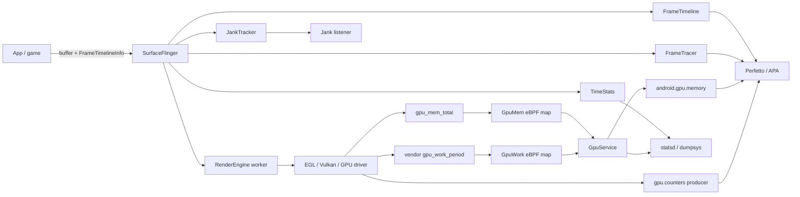

# 14.8 Android 17 GPU 可观测性与调试工具链

GPU 问题常被概括成“GPU 太慢”，这个结论对排查帮助很小。一次画面异常可能来自应用没有按 deadline 提交 buffer、SurfaceFlinger 等待 acquire fence、HWC 改走 client composition、RenderEngine 同步等待、GPU command queue 过载、显存压力，或驱动能力与工具采样不匹配。

本章以 Android 17 / API 37 / AOSP `android-17.0.0_r1` 为平台锚点，kernel 侧使用 `android17-6.18-2026-06_r6`。APA 与 AGI 属于独立发布工具，其定位以 2026-07-31 可访问的官方文档为准，不能从 Android 平台 tag 推导工具内部版本。

<!-- outline-start -->

## 按问题选择工具

| 要回答的问题 | 主工具 | 补充证据 |
|---|---|---|
| App 或 SurfaceFlinger 是否错过 deadline | APA System Profiler 或 Perfetto FrameTimeline | sched、CPU/GPU frequency、应用 trace |
| 某个 Layer 的 buffer 卡在何处 | Perfetto `android.surfaceflinger.frame` | `DEQUEUE`、`QUEUE`、acquire fence、latch、present fence |
| 一段时间内 jank、帧间隔、合成策略如何变化 | SurfaceFlinger TimeStats | statsd pull、`dumpsys SurfaceFlinger --timestats` |
| 运行时 jank listener 是否收到数据 | `JankTracker` 对应的 listener 路径 | layerId、vsyncId、批量回调 |
| GPU 忙在计算、片元、带宽还是缓存 | APA/AGI GPU counters | counter descriptor、GPU/driver、采样周期 |
| 某一帧有哪些 draw、pipeline、shader 和资源 | AGI Frame Profiler | 同时保留系统 trace 对齐 deadline |
| ANGLE/驱动加载或 feature override 是否异常 | `dumpsys gpu`、`cmd gpu` | GpuStats、vkjson、配置文件 |
| GPU 内存与每 UID 工作量是否可用 | GpuMem、GpuWork、Perfetto | kernel tracepoint、BPF 初始化状态 |
| HWC 异常会不会随 client composition 消失 | `sfdo force-client-composition` | 操作前后的同场景 trace |
| 设备早期 GPU 合成基线 | `flatland` | 固定频率、关闭系统服务的工程环境 |

工具负责回答不同层次的问题。系统时间线负责定位帧在哪个阶段迟到，counter 描述 GPU 资源活动，AGI Frame Profiler 检查单帧命令内容；三类证据需要按时间和复现场景对齐。

## Android 17 平台观测路径

下面的架构图用来标出数据的生产位置和消费端。



图中 `gpu_work_period` 由设备 GPU driver 提供。它不是 `android17-6.18-2026-06_r6` common kernel 的通用 `power.h` 事件，设备缺少该 tracepoint 时，GpuWork 会报告数据不可用。

## SurfaceFlinger 的四条帧观测通道

### FrameTimeline：判断谁错过 deadline

FrameTimeline 把应用 `SurfaceFrame` 与 SurfaceFlinger `DisplayFrame` 关联到 vsync token，保存 expected/actual 时间并计算 jank 类型。Android 17 注册的 Perfetto DataSource 名称为：

`android.surfaceflinger.frametimeline`

它适合回答：

- 应用帧是否 late；
- SurfaceFlinger 是否 late；
- 帧是 on-time present、late present、dropped，还是出现 buffer stuffing；
- App 和 SurfaceFlinger 的帧是否属于同一个 vsync 周期。

FrameTimeline 是定位 jank 归属的入口。看到 `SurfaceFlingerGpuDeadlineMissed` 后，还要结合 RenderEngine、GPU queue、fence 和 HWC composition strategy 判断耗时来源。

[源码锚点：`FrameTimeline::registerDataSource()` 与帧事件写入](https://android.googlesource.com/platform/frameworks/native/+/android-17.0.0_r1/services/surfaceflinger/Scheduler/FrameTimeline.cpp)

### FrameTracer：跟踪 Layer buffer 生命周期

Android 17 `FrameTracer` 注册的 DataSource 是：

`android.surfaceflinger.frame`

`Layer.cpp` 在 buffer 处理路径写入 `DEQUEUE`、`QUEUE`、`ACQUIRE_FENCE`、`LATCH`、`FALLBACK_COMPOSITION` 和 `PRESENT_FENCE` 等事件。fence 尚未 signal 时，FrameTracer 暂存记录；后续同 buffer 的 trace 调用会检查 pending fence。为防止旧 trace 的 fence 污染新会话，源码使用 60 秒的 signalling deadline 丢弃过旧记录。

分析时按 layerId、bufferId 和 frameNumber 关联事件：

- `QUEUE → ACQUIRE_FENCE` 长：producer 提交后，buffer 仍未可读；
- acquire fence 已 signal，但 `LATCH` 晚：继续检查 SurfaceFlinger 调度、transaction 和 latch 条件；
- `FALLBACK_COMPOSITION` 出现：该帧发生 client composition fallback，继续检查 HWC 决策；
- `PRESENT_FENCE` 晚：结合 DisplayFrame、HWC 和 GPU queue 判断显示侧完成时间。

旧资料常见的 `android.graphics.FrameLatency` 不是本 tag 的 FrameTracer DataSource 名称。Android 17 r1 应使用源码里的 `android.surfaceflinger.frame`。

[源码锚点：`FrameTracer` 注册与 fence 处理](https://android.googlesource.com/platform/frameworks/native/+/android-17.0.0_r1/services/surfaceflinger/FrameTracer/FrameTracer.cpp)

### TimeStats：聚合统计

`TimeStats` 面向较长时间窗口，记录全局帧数、missed frame、refresh-rate switch、present-to-present 分布、Layer 时序和 composition strategy 等数据。它有明确的 enabled 状态，大量 record 方法在未启用时直接返回。

Android 17 的启用路径包括：

- statsd 拉取 `SURFACEFLINGER_STATS_GLOBAL_INFO` 或 `SURFACEFLINGER_STATS_LAYER_INFO` 后启用；
- `dumpsys SurfaceFlinger --timestats -enable` 手动启用。

首轮 statsd pull 可能为空或数据很少，因为源码在本次 pull 结束时才启用采集。做实验时应先启用、运行固定场景，再 dump。

下面的命令用于控制并读取 TimeStats。

```bash
adb shell dumpsys SurfaceFlinger --timestats -enable
# 运行待测场景
adb shell dumpsys SurfaceFlinger --timestats -dump
adb shell dumpsys SurfaceFlinger --timestats -disable
adb shell dumpsys SurfaceFlinger --timestats -clear
```

`-dump` 给出聚合结果，不能替代 Perfetto 的逐帧时间线。不同命令的输出和权限还可能被 OEM 调整。

[源码锚点：`TimeStats::onPullAtom()`、`parseArgs()` 与 `enable()`](https://android.googlesource.com/platform/frameworks/native/+/android-17.0.0_r1/services/surfaceflinger/TimeStats/TimeStats.cpp)

### JankTracker：运行时 listener 分发

`JankTracker` 保存按 layerId 分类的 jank 数据并管理 listener。主线程入口先检查原子 listener count；没有 listener 时直接返回。有 listener 时，数据交给低优先级 `BackgroundExecutor`，同一 layer 累积到 50 条会触发一次批量 flush。

它服务于运行时 jank listener，不是 Perfetto FrameTimeline 的替代输出。排查 listener 丢数据时，需要同时确认 layerId、listener 生命周期、移除用的 `afterVsync` 和批量 flush 时机。

[源码锚点：`JankTracker::onJankData()` 与 `doFlushJankData()`](https://android.googlesource.com/platform/frameworks/native/+/android-17.0.0_r1/services/surfaceflinger/Jank/JankTracker.cpp)

## 一份可复查的 Perfetto 采集基线

下面的最小配置聚焦 FrameTimeline、Layer buffer、GPU 内存快照和常见 graphics ftrace。设备不提供某个可选 ftrace event 时，该轨道不会产生数据。

```textproto
buffers {
  size_kb: 32768
  fill_policy: RING_BUFFER
}
duration_ms: 10000

data_sources {
  config { name: "android.surfaceflinger.frametimeline" }
}
data_sources {
  config { name: "android.surfaceflinger.frame" }
}
data_sources {
  config { name: "android.gpu.memory" }
}
data_sources {
  config {
    name: "linux.ftrace"
    ftrace_config {
      atrace_categories: "gfx"
      ftrace_events: "gpu_mem/gpu_mem_total"
      ftrace_events: "power/gpu_frequency"
    }
  }
}
```

`android.gpu.memory` 在 trace 启动时把 GpuMem BPF map 的当前值写入 packet；持续变化可从 `gpu_mem/gpu_mem_total` ftrace event 观察。采集 GPU hardware counter 时不要抄一份通用 `counter_ids` 列表，counter ID 需要来自当前设备 producer 发布的 descriptor。

[源码锚点：`GpuMemTracer::kGpuMemDataSource`](https://android.googlesource.com/platform/frameworks/native/+/android-17.0.0_r1/services/gpuservice/tracing/include/tracing/GpuMemTracer.h)

## GPU counter：descriptor 决定语义

Perfetto `GpuCounterEvent` 支持在 packet 中携带 `GpuCounterDescriptor`，也支持用 interned descriptor ID 引用描述。descriptor 提供：

- counter ID、名称和说明；
- numerator / denominator unit；
- peak value；
- logical group；
- counter block 及同一 block 可同时启用的容量；
- producer 支持的最小、最大采样周期。

counter 名称相同也不能自动视为同一指标。跨设备比较前至少固定以下条件：

1. SoC、GPU 型号和 driver version；
2. descriptor 中的单位、说明和 block；
3. counter 选择集合与 sampling period；
4. 场景、分辨率、刷新率、温度和频率策略；
5. trace 中是否有 packet loss 或 producer 错误。

同一 counter block 可并行采样的数量可能受限。选择过多 counter 时，driver 可能轮转、拒绝或改变采样方式。报告中应保存 descriptor 和 trace config，单独记录派生公式。

当前官方文档把 APA 作为 system profiling 的推荐工具。APA 可以列出设备支持的 GPU counter，也允许使用自定义 Perfetto `TraceConfig`。AGI 的 System Profiler 仍可使用，但新采集流程应优先评估 APA。

[Perfetto 源码锚点：`GpuCounterEvent`](https://android.googlesource.com/platform/external/perfetto/+/android-17.0.0_r1/protos/perfetto/trace/gpu/gpu_counter_event.proto)

## GpuService 能观察什么

### GpuMem、GpuWork 与 GpuStats

| 组件 | 输入 | 输出 | 使用边界 |
|---|---|---|---|
| `GpuMem` | `gpu_mem/gpu_mem_total` tracepoint + BPF map | 全局和每 PID GPU addressable memory snapshot | 依赖 GPU driver 正确发出累计值 |
| `GpuMemTracer` | GpuMem map | Perfetto `android.gpu.memory` 起始快照 | 不是分配调用栈，也不负责回收 |
| `GpuWork` | driver 提供的 `power/gpu_work_period` + BPF map | 每 GPU、每 UID active duration 与统计 | tracepoint 缺失时不可用；protected GPU work 不上报 |
| `GpuStats` | GraphicsEnv 上报 | dumpsys 与 statsd pull | 驱动加载、ANGLE、Vulkan capability 统计，不是 GPU busy counter |

`android17-6.18-2026-06_r6` common kernel 在 `include/trace/events/gpu_mem.h` 定义 `gpu_mem_total(gpu_id, pid, size)`。driver 在分配、释放、导入或取消导入 GPU addressable memory 时更新累计量，GpuMem 的 eBPF 程序将结果写入只读 map。

GpuWork 的平台 BPF 程序则要求 driver 自行定义字段布局匹配的 `gpu_work_period`。Android 17 r1 源码会检查 `/sys/kernel/tracing/events/power/gpu_work_period/format`，初始化失败时 `dumpsys gpu --gpuwork` 显示 unavailable。不能仅凭 Android 版本假定该功能存在。

### dumpsys 与 cmd

下面的命令分别查看驱动、内存、工作量、加载统计和 feature override。

```bash
adb shell dumpsys gpu --gpudriverinfo
adb shell dumpsys gpu --gpumem
adb shell dumpsys gpu --gpuwork
adb shell dumpsys gpu --gpustats

adb shell cmd gpu featureOverrides
adb shell cmd gpu vkjson
adb shell cmd gpu vkprofiles
```

`featureOverrides` 属于 `cmd gpu` 子命令；写成 `dumpsys gpu featureOverrides` 会进入普通 dump 解析，不会调用 `cmdFeatureOverrides()`。输出涉及系统状态，通常需要 shell 或 `DUMP` 权限。

[源码锚点：`GpuService::shellCommand()` 与 `doDump()`](https://android.googlesource.com/platform/frameworks/native/+/android-17.0.0_r1/services/gpuservice/GpuService.cpp)

## ANGLE feature override 的 Android 17 模型

`GpuService` 构造时读取 `/system/etc/angle/feature_config_vk.binarypb`。`FeatureOverrideParser` 在 Binder 线程创建前解析一次并缓存，启动后修改文件不会自动重新读取。

Android 17 r1 的 protobuf schema 已经给出完整结构：

- `global_features`：对所有包生效的 `FeatureConfig`；
- `package_features`：按 package name 保存 feature 列表；
- `FeatureConfig.feature_name`：ANGLE Vulkan feature 名；
- `FeatureConfig.enabled`：启用或禁用；
- `FeatureConfig.gpu_vendor_ids`：限定适用 GPU vendor。

parser 当前只用 Vulkan vendor ID 判断条件，包级配置按 package name 组织。它支持启用和禁用 feature，统一称为 feature override 更符合源码；“ANGLE denylist”无法覆盖这套双向配置。

`toggleAngleAsSystemDriver()` 修改 `persist.graphics.egl`，调用者 appId 必须是 system，并持有 `android.permission.ACCESS_GPU_SERVICE`。这个 Binder 接口面向系统组件，普通应用和常规 shell 调试流程不能把它当成切换开关。

GpuStats 中的 `angleLoadingCount`、`angleLoadingFailureCount` 和 `angleDriverLoadingTime` 用来确认加载行为。加载成功不能证明渲染更快，性能结论仍需同场景 trace、frame time 和 GPU 指标。

[源码锚点：feature override schema 与 parser](https://android.googlesource.com/platform/frameworks/native/+/android-17.0.0_r1/services/gpuservice/feature_override/proto/feature_config.proto)

## RenderEngine：异步 worker 与同步回退

### worker 线程

`RenderEngineThreaded` 用独立 worker 执行任务。线程启动时尝试应用 `SFRenderEnginePolicy`，并在未被 flag 禁用时设置 `SCHED_FIFO`、优先级 2。设置失败会记录 warning，RenderEngine 继续创建和处理队列，所以日志里的 warning 不能直接解释为合成功能失败。

`drawLayers()` 把 display、layer、目标 buffer 和 fence 放入工作队列，用 promise/future 返回 `FenceResult`。`panopticon::share()` 把当前图形 workload 注册传到 worker，相关 slice 会汇入 Perfetto 的 SurfaceFlinger workload summary。调用返回 future 只说明任务已进入异步路径，GPU 是否完成仍由返回 fence 表达。

[源码锚点：`RenderEngineThreaded::threadMain()` 与 `drawLayers()`](https://android.googlesource.com/platform/frameworks/native/+/android-17.0.0_r1/libs/renderengine/threaded/RenderEngineThreaded.cpp)

### GL native fence 缺失时发生什么

下面的缩略控制流只保留同步路径的判断点。

```cpp
if (!waitGpuFence(fd)) sync_wait(fd, -1);
const bool requireSync = drawFence.get() < 0;
submit(requireSync ? GrSyncCpu::kYes : GrSyncCpu::kNo);
```

输入 fence 无法通过 `EGL_ANDROID_native_fence_sync` 和 wait-sync 交给 GPU 时，RenderEngine worker 调用 `sync_wait(fd, -1)`。输出 native fence 创建失败时，Skia submit 使用 CPU sync。两条路径都能维持正确性，但会缩小 CPU/GPU 并行空间。

Perfetto 中应检查 `SkiaGLRenderEngine::waitFenceImpl`、`Submit(sync=true)`、RenderEngine worker 调度和对应 FrameTimeline deadline。只有看到这些事件与迟到帧重合，才能把同步回退列为该次 jank 的证据。

[源码锚点：`SkiaGLRenderEngine::waitFenceImpl()` 与 `flushAndSubmit()`](https://android.googlesource.com/platform/frameworks/native/+/android-17.0.0_r1/libs/renderengine/skia/SkiaGLRenderEngine.cpp)

## APA、AGI 与 Android Studio Profiler 的边界

### APA：系统时间线入口

截至本章校验日期，Android 官方把 Android Performance Analyzer（APA）列为 system profiling 的推荐工具。它基于 Perfetto 数据，支持 CPU/GPU 时间线、SurfaceFlinger events、GPU counter、自定义 trace config、Vulkan timing layer 和 SQL 查询。

APA 适合多帧问题、CPU/GPU 关联、A/B trace 管理和跨轨道取证。它注入 Vulkan timing layer 时会有选择地跳过高频 API，以免采集开销改写测量结果。

[官方文档：APA 录制 system trace](https://developer.android.com/android-performance-analyzer/run)

### AGI：单帧命令和资源

AGI Frame Profiler 面向某一帧的 GPU API 内容，展示 Vulkan 调用、framebuffer、draw、pipeline、render state、texture、shader、RAM/GPU memory 和渲染事件性能数据。

官方当前路径为：

- Vulkan 应用：直接追踪 Vulkan 命令；
- OpenGL ES 应用：通过 AGI 的定制 ANGLE 转为 Vulkan 后追踪。

OpenGL-on-ANGLE 捕获环境可能与应用原生 GLES 驱动路径不同。AGI 捕获还会加入插桩和回放约束，适合开发期解释命令内容，不用于生产常驻监控。若要证明某个 shader 或 render pass 导致用户可见 jank，应把 AGI 结论与未捕获或低干扰的系统 trace 对照。

[官方文档：AGI Frame Profiler](https://developer.android.com/agi/frame-trace/frame-profiler)

### Android Studio Profiler

Android Studio Profiler 侧重应用 CPU、内存、功耗和网络等开发分析。它与 APA 是不同产品，也不提供 AGI Frame Profiler 的单帧 GPU command/state 视图。工具选择应按问题类型决定，不能把三者合成一个“通用 GPU Profiler”。

## sfdo 与 flatland

### sfdo：控制 SurfaceFlinger 调试动作

Android 17 r1 的 `sfdo` 是 Rust CLI，通过 `SurfaceFlingerAIDL` 调用受支持的调试动作。下面列出源码存在的主要命令。

```bash
adb shell sfdo --help
adb shell sfdo debug-flash --delay 0
adb shell sfdo force-client-composition enabled
adb shell sfdo frame-rate-indicator show
adb shell sfdo schedule-composite
adb shell sfdo schedule-commit
adb shell sfdo force-client-composition disabled
adb shell sfdo frame-rate-indicator hide
```

`force-client-composition` 用来检查现象是否依赖 HWC overlay 路径。它会改变合成方式和功耗，不应把强制 client composition 下的结果当成正常设备性能。测试结束要恢复 disabled，并在目标镜像上用 `which sfdo` 与 `sfdo --help` 确认可用性。

[源码锚点：`sfdo.rs`](https://android.googlesource.com/platform/frameworks/native/+/android-17.0.0_r1/cmds/sfdo/sfdo.rs)

### flatland：设备开发期基准

`flatland` 是 AOSP `cc_benchmark`，使用 OpenGL ES 2.0、gralloc 和 Android explicit synchronization 模拟 2D UI 与 window composition 场景。它面向设备早期评估，通常不会预装在量产 user build。

其 README 要求关闭显示和后台服务，并固定 CPU、GPU、memory bus 频率。动态调频下的结果混入 governor 行为，不能作为稳定 GPU 合成能力。固定频率又可能引入热问题，所以每次报告还应记录温度、sleep 参数和场景分辨率。

[源码锚点：`flatland` 测量条件](https://android.googlesource.com/platform/frameworks/native/+/android-17.0.0_r1/cmds/flatland/README.txt)

## 四类常见问题的排查顺序

### App deadline miss

1. 用 APA 或 Perfetto 确认 `SurfaceFrame` 的 expected/actual 边界和 jank type。
2. 对齐主线程、RenderThread、Binder、CPU frequency 与 runnable/sleep 状态。
3. 若 CPU 提交已按时，再查看 GPU queue、counter 和 fence。
4. 用 AGI Frame Profiler 解释异常帧的 draw、pipeline 或 shader；系统 trace 负责证明它影响了 deadline。

### SurfaceFlinger GPU deadline miss

1. 对齐 `DisplayFrame`、SurfaceFlinger 主线程和 RenderEngine worker。
2. 检查 FrameTracer 的 acquire、latch、fallback composition 和 present fence。
3. 查看 `Submit(sync=true)` 或 `waitFenceImpl` 是否与异常帧重合。
4. 用 `sfdo force-client-composition` 做对照实验，结束后恢复默认。

### GPU 内存增长

1. 用 `dumpsys gpu --gpumem` 确认全局和 PID 维度的累计量是否可用。
2. 在 Perfetto 同时采集起始快照与 `gpu_mem_total` 更新事件。
3. 将 PID 与进程生命周期对齐，避免把 PID 复用当成同一进程持续增长。
4. GpuMem 只能给出累计量；分配来源仍需 driver 工具、应用资源记录或 AGI 单帧资源视图。

### ANGLE 或 driver 加载异常

1. `dumpsys gpu --gpudriverinfo` 记录稳定/预发布 driver 配置。
2. `dumpsys gpu --gpustats` 检查 GL、Vulkan、ANGLE load count、failure 和 loading time。
3. `cmd gpu featureOverrides` 保存当前全局与包级 override。
4. `cmd gpu vkjson` 保存 Vulkan 设备与能力。
5. 用同一场景 trace 比较变化，避免从加载计数直接推导渲染性能。

## Review 结论

Android 17 GPU 调试可以按三层组织：

1. FrameTimeline、FrameTracer、TimeStats 和 JankTracker 描述 SurfaceFlinger 的帧、buffer 与 jank 事件。
2. Perfetto、APA、GpuService 和 kernel/driver tracepoint 提供系统时间线、counter、内存与工作量证据。
3. AGI Frame Profiler 解释某一帧的 GPU 命令、资源和 pipeline 状态。

诊断报告至少应保存设备、build fingerprint、GPU/driver、刷新率、温度、trace config、counter descriptor 和复现步骤。缺少这些条件时，跨设备 counter 数字和单次强制合成结果无法形成可复查的性能结论。

<!-- outline-end -->

## 参考资料

- [AOSP Android 17 FrameTimeline](https://android.googlesource.com/platform/frameworks/native/+/android-17.0.0_r1/services/surfaceflinger/Scheduler/FrameTimeline.cpp)
- [AOSP Android 17 FrameTracer](https://android.googlesource.com/platform/frameworks/native/+/android-17.0.0_r1/services/surfaceflinger/FrameTracer/FrameTracer.cpp)
- [AOSP Android 17 GpuService](https://android.googlesource.com/platform/frameworks/native/+/android-17.0.0_r1/services/gpuservice/GpuService.cpp)
- [AOSP Android 17 RenderEngineThreaded](https://android.googlesource.com/platform/frameworks/native/+/android-17.0.0_r1/libs/renderengine/threaded/RenderEngineThreaded.cpp)
- [Android 17 kernel `gpu_mem_total`](https://android.googlesource.com/kernel/common/+/refs/tags/android17-6.18-2026-06_r6/include/trace/events/gpu_mem.h)
- [Android Performance Analyzer](https://developer.android.com/android-performance-analyzer)
- [AGI Frame Profiler](https://developer.android.com/agi/frame-trace/frame-profiler)
