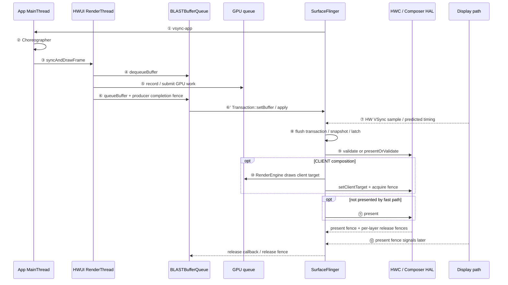

# 18.1 渲染管线分类与选择对照表

<!-- outline-start -->

**锚点（必须覆盖）：**
- [18.1.1 为什么需要理解渲染管线](#为什么需要理解渲染管线) — 性能调优的起点
- [18.1.2 用四个坐标识别出图类型](#用四个坐标识别出图类型) — Producer、输出目标、layer 与合成位置
- [18.1.3 版本与架构对照表](#版本与架构对照表) — Android 9 到 Android 17 的观测边界
- [18.1.4 典型模式对比](#典型模式对比) — 主要渲染路径的差异
- [18.1.5 公共显示主线](#公共显示主线从-vsync-到-present) — 12 个固定观察点
- [18.1.6 一帧的排查顺序](#一帧的排查顺序) — 从节奏到 present 的证据链

<!-- outline-end -->

## 为什么需要理解渲染管线

Perfetto 里出现一帧超时，定位工作不应从“最长的 slice”开始，而应先回答三个问题：

1. 谁在生产本帧 buffer？
2. buffer 进入哪个 `Surface`，是否形成独立 layer？
3. 本帧在哪里合成，又在哪个时间边界完成 present？

标准 App Window 的 Producer 通常是应用进程里的 HWUI RenderThread；SurfaceView、Camera、Video、WebView、Flutter、游戏和 React Native 可能把生产工作交给引擎线程、解码器或硬件模块。它们都可能经过 BufferQueue、SurfaceFlinger 和 HWC，但线程、layer 数量、合成位置与 FrameTimeline 覆盖程度并不相同。

`queueBuffer`、`latch` 和 `present fence` 分别属于提交、采纳和显示反馈阶段。看到其中一个事件，只能证明显示路径走到了对应位置，不能替代其他阶段的证据。总览篇先固定公共主线，后续章节再解释各出图类型从哪里分叉。

本文的当前实现锚点是 Android 17 / API 37 的 `android-17.0.0_r1`。涉及 dma-buf、sync_file、DRM/KMS 或调度器实现时，内核锚点统一为 `android17-6.18-2026-06_r6`；本文没有依靠某个 kernel 函数推导 framework 结论。

## 用四个坐标识别出图类型

`SurfaceView`、`TextureView`、WebView、Flutter 和 Compose 是 API 或框架名称。名称本身不足以确定 trace 中的图形路径。同一个 Flutter 页面可能使用 `SurfaceView` 或 `TextureView` 作为宿主，Platform View 还会改变 layer 拓扑；同一个播放器也可能在普通 buffer queue、SurfaceView 独立 layer 与 tunneled/sideband 路径之间切换。

每次分析先固定四个坐标：

| 坐标 | 要确认的对象 | Trace 或源码证据 |
|---|---|---|
| Producer | HWUI RenderThread、GL/Vulkan thread、Chromium、Flutter raster thread、Camera HAL、MediaCodec、游戏引擎或其他模块 | 线程 slice、GPU submission、decoder/camera 事件 |
| 输出目标 | App Window、独立 `Surface`、`SurfaceTexture`、swapchain、离屏 `HardwareBuffer` 或 sideband stream | BufferQueue、ANativeWindow、SurfaceControl、layer dump |
| layer 拓扑 | 内容进入宿主窗口，还是形成一个或多个独立 child layer | layer parent、relative layer、Z-order、`BufferTX` |
| 合成与 present | 宿主 HWUI 采样、SurfaceFlinger CLIENT composition、HWC DEVICE composition 或专用媒体路径 | RenderEngine、composition type、HWC、present fence |

线程名只说明某段代码在哪条线程执行。确认渲染类型还要把线程、swapchain/BufferQueue、SurfaceControl 和目标 layer 连到同一条路径。看到 `GLThread` 不足以证明页面一定存在独立 layer；看到 `SurfaceView` 对象也不足以证明本帧拿到了 overlay。

## 版本与架构对照表

Android 9 到 Android 17 的图形栈不能只用“Legacy”与“BLAST”二分。对 trace 更有帮助的写法，是标出哪个版本可以使用哪些对象和观测方法。

| 平台 | 公共显示主线 | Trace 判读要点 |
|---|---|---|
| Android 9 / API 28 | App Window 常见传统 BufferQueue producer/consumer 路径 | 不应期待 BLAST 或 FrameTimeline；以 `Choreographer`、HWUI、`queueBuffer`、SF/HWC slice 为主 |
| Android 10 / API 29 | `SurfaceControl.Transaction` 能力扩展，App Window 仍处于迁移前后混合期 | 不要只凭系统版本断定采用 BLAST，要以进程内对象和 trace 为证 |
| Android 11 / API 30 | BLAST 进入平台主线，窗口 buffer 与 layer transaction 的组织方式开始改变 | 旧资料中的 `BufferStateLayer` 只适合对应旧 tag，不能拿来解释 Android 17 的 FrontEnd |
| Android 12 / API 31 | BLAST 与 FrameTimeline 构成现代 trace 基线 | 标准 App Window 可用 SurfaceFrame/DisplayFrame token 对齐；独立 Surface 仍需 layer、BufferQueue 与 fence 证据 |
| Android 13 / API 33 | `AutoSingleLayer` 下的 latch-unsignaled 策略成为重要边界 | acquire fence 未 signal 不再等于 transaction 必定无法 latch；硬件读取仍要遵守同步约束 |
| Android 14 / API 34 | 公共 Choreographer→HWUI→BLAST→SF→HWC 骨架延续；SurfaceView 增加 alpha 与 lifecycle 能力 | 标准窗口仍按公共主线读，独立 Surface 的透明度与生命周期要单独核对 |
| Android 15 / API 35 | Window/SurfaceView 源码与 API 面开始提供 desired HDR headroom，r1 中仍带 feature flag 边界 | headroom 是请求；目标设备 flag、bit depth、面板与显示策略仍要核对 |
| Android 16 / API 36 | SurfaceView 源码增加整数 `compositionOrder`，r1 API 签名带 `@FlaggedApi`；公共主线延续 | 多 Surface 页面要记录 parent、relative layer、flag 状态与 Z-order |
| Android 17 / API 37 | 本文锚定 FrontEnd `RequestedLayerState` / `LayerSnapshot`、预测 present time、现行 BLAST/HWC 路径；SurfaceView blur region 与 `compositionOrder` 仍带 flag 边界 | 源码按 `android-17.0.0_r1` 的对象名解释；旧 `DispSync`、固定 phase offset 和逐个旧 Layer latch 模型不能直接套用 |

这张表描述的是观察边界，不表示每个版本都重做了一套渲染管线。BLAST 改变 buffer 与窗口状态进入 SurfaceFlinger 的组织方式，没有取消 Producer/Consumer 分工，也没有取消 acquire/release fence。

## 典型模式对比

先按 Producer、输出目标、layer 拓扑与合成位置区分主干模式：

| 模式 | 主要 Producer | Surface/layer 形态 | 主要合成位置 | 容易误判的点 | 章节 |
|---|---|---|---|---|---|
| 标准 Android View | MainThread 准备状态，HWUI RenderThread/GPU 产出 | 宿主 App Window | SF 选择 DEVICE 或 CLIENT | MainThread `draw()` 结束不等于 buffer 已提交 | [18.2](02-android-view-standard.md) |
| Software / 离屏 | `lockCanvas()` 线程、CPU raster 或离屏 GPU | 可见 Surface 或离屏 buffer | 可见目标进入 SF/HWC；离屏目标由下游消费 | “软件绘制”不等于没有 BufferQueue；离屏完成 fence 也不是 present fence | [18.3](03-android-view-software.md)、[18.17](17-hardware-buffer-renderer.md) |
| 混合渲染 | 宿主 HWUI + 一个或多个独立 Producer | App Window 与 child layer 并存 | SF/HWC 拼接多层 | 不能用宿主窗口一条 FrameTimeline 代表所有独立 Surface | [18.4](04-android-view-mixed.md) |
| 多窗口 | 每个 Window 各有 ViewRoot/Surface；线程可能同进程共享，也可能跨进程 | 多个 Window layer | 每个 display 分别组织输出 | “多窗口必定同一主线程串行”只适用于部分同进程场景 | [18.5](05-android-view-multi-window.md) |
| SurfaceView | 解码器、Camera、GL/Vulkan 或其他 Producer | 独立 child Surface/layer | 常由 SF/HWC 与宿主拼层 | 独立 layer 有利于 overlay，但不保证低延迟或 DEVICE composition | [18.6](06-surfaceview.md) |
| TextureView | 外部 Producer 写入 `SurfaceTexture` | 内容作为纹理进入宿主 View 树 | 宿主 HWUI 再采样到 App Window | 成本是额外采样/宿主合成，不宜笼统写成固定 CPU 拷贝 | [18.7](07-textureview.md) |
| OpenGL ES | GL thread / engine thread | EGL window surface 对应 BufferQueue | SF/HWC | `eglSwapBuffers()` 返回不代表 GPU 写完或已经 present | [18.8](08-opengl-es.md) |
| Vulkan | engine/render thread | `VkSwapchainKHR` 对接 ANativeWindow | SF/HWC | 显式 API 可以降低部分 driver 开销，但 CPU 成本取决于引擎、同步和驱动 | [18.9](09-vulkan-native.md) |
| WebView | Chromium renderer/compositor、Viz 与宿主进程协作 | Chromium surface 与宿主窗口组合，具体拓扑依实现而定 | Chromium 合成后进入 Android 显示链 | 只看 App MainThread 会漏掉 renderer/GPU 进程 | [18.13](13-webview-rendering.md) |
| Flutter | UI/raster/platform thread 与 Impeller/Skia backend | 宿主可用 SurfaceView 或 TextureView；Platform View 再增加分支 | 宿主 layer 与 Platform View 共同进入 SF/HWC | 框架名不能确定宿主 render mode | [18.12](12-flutter-rendering.md) |
| Camera | Camera HAL、ISP 与应用/系统消费者 | 预览 Surface、ImageReader、编码器等多消费者 | 预览常通过独立 layer 参与合成 | request/result 完成不等于预览已 present | [18.14](14-camera-pipeline.md) |
| Video / HWC | MediaCodec、解码器、播放器 | SurfaceView buffer queue 或 tunneled/sideband 路径 | HWC overlay、专用媒体路径或 CLIENT fallback | 解码完成、releaseOutputBuffer 与上屏时间不是同一边界 | [18.15](15-video-overlay-hwc.md)、[18.23](23-media-codec2-tunneled-media3-abr.md) |
| 游戏引擎 | game/render thread、GL/Vulkan queue | ANativeWindow swapchain，可能叠加独立 UI/video layer | SF/HWC | 平均 FPS 会掩盖 pacing、queue depth 与 present 抖动 | [18.16](16-game-engine.md) |
| Compose | Compose runtime 与 UI thread 生成状态，HWUI RenderThread/GPU 产出 | 默认仍是宿主 App Window | SF/HWC | recomposition、layout、draw 与 GPU 提交属于不同阶段 | [18.25](25-compose-rendering-pipeline.md) |
| React Native | JS、Fabric/UI、HWUI；第三方原生组件可另建 Surface | 标准 View 树或 SurfaceView/TextureView 分支 | 取决于宿主与原生组件拓扑 | JS thread 只是 Producer 链的一段，不能代表 present | 本章只给分型基线 |

[18.10 SurfaceControl API](10-surface-control-api.md) 与 [18.11 ANGLE](11-angle-gles-vulkan.md) 分别解释 layer 控制和 GLES→Vulkan 翻译。[18.18 PiP/Freeform](18-pip-freeform.md)、[18.19 VRR](19-variable-refresh-rate.md)、[18.22 XR](22-android-xr-spatial-ui-rendering.md) 继续分析 window/display 分支；[18.20 分析方法](20-pipeline-analysis-methodology.md) 提供跨类型的取证步骤。

### 快速识别当前管线

一段 trace 可以先做四项检查：

1. 找到目标 Window、Surface 和 layer，确认是一层还是多层。
2. 找到 Producer：MainThread/RenderThread、GL/Vulkan thread、解码器、Camera、Chromium、Flutter raster thread 或其他引擎线程。
3. 确认提交点：`queueBuffer`、BLAST buffer transaction、SurfaceControl transaction 或硬件模块输出。
4. 确认合成与显示：latch、composition type、RenderEngine、HWC、FrameTimeline 和 present feedback。

线程名只能提供线索。比如出现 GL thread 并不能单独证明它写入独立 Surface；还要把它的 swapchain、BufferQueue 与目标 layer 对上。

## 本章阅读指南

App 滑动卡顿从 [18.2 标准 Android View](02-android-view-standard.md) 开始；有视频、地图或相机预览时，再读 [18.4 混合渲染](04-android-view-mixed.md)、[18.6 SurfaceView](06-surfaceview.md) 和 [18.7 TextureView](07-textureview.md)。

音视频开发者可以按 [18.15 Video/HWC](15-video-overlay-hwc.md) → [18.23 MediaCodec2](23-media-codec2-tunneled-media3-abr.md) → [18.19 VRR](19-variable-refresh-rate.md) 阅读。播放器卡顿不能只查刷新率，还要对齐解码输出、buffer timestamp、acquire fence、latch 和 present。

游戏与自研引擎可以按 [18.8 OpenGL ES](08-opengl-es.md) / [18.9 Vulkan](09-vulkan-native.md) → [18.16 Game](16-game-engine.md) → [18.20 分析方法](20-pipeline-analysis-methodology.md) 阅读。要同时观察 game/render thread、GPU queue、swapchain 深度、FrameTimeline、Game Mode 与温控。

Framework 工程师建议先读本篇公共主线，再看 [18.10 SurfaceControl](10-surface-control-api.md)、[18.19 VRR](19-variable-refresh-rate.md) 和 [18.26 HWUI Vulkan 多队列](26-android17-hwui-vulkan-multi-queue.md)。遇到 vendor 显示问题时，还要补 Composer HAL、display driver 和面板证据。

## 公共显示主线：从 VSync 到 present

下面的时序图用来固定标准 App Window 的 12 个观察点：



图中 ①～⑥ 是应用生产阶段，⑦～⑫ 是系统合成与显示阶段。`⑥'` 是 SF server 侧观测点，不额外算一个主节点。这里的 ⑫ 是 Android 用户态可观察的 display-present 时间锚点，不等于 panel 完成扫描、像素完成响应或用户形成视觉感知。

这 12 个编号是第 18 章的公共坐标：

| 编号 | 节点 | 诊断含义 |
|:---:|---|---|
| ① | `vsync-app` | 应用侧计划起跑时间 |
| ② | `Choreographer#doFrame` | INPUT、ANIMATION、INSETS_ANIMATION、TRAVERSAL、COMMIT |
| ③ | `syncAndDrawFrame` | UI thread 与 RenderThread 的状态交接 |
| ④ | `dequeueBuffer` | 取得可写 slot，可能受 release fence 和队列深度影响 |
| ⑤ | Skia / GPU submission | 记录并提交图形命令 |
| ⑥ | `queueBuffer` | 提交 slot、元数据与 producer completion fence |
| ⑥' | BLAST transaction / `BufferTX` | buffer update 到达 SF server 并进入 pending |
| ⑦ | SF 调度起点 | 按预测 present time 与 SF 工作预算执行 |
| ⑧ | transaction、snapshot、latch | 决定本轮采纳哪个 buffer |
| ⑨ | HWC strategy | validate 或 presentOrValidate，确定 composition type |
| ⑩ | RenderEngine client target | CLIENT layer 需要的 GPU 合成 |
| ⑪ | present 与 release fence 收集 | 向显示后段提交本轮 frame |
| ⑫ | present fence feedback | Android 显示栈可观察的 present 时间边界 |

### ① `vsync-app`：应用起跑时间

Android 17 的 Scheduler 以预测 present time 为目标，根据 app 的 `workDuration` 与 `readyDuration` 安排 wakeup，再由 EventThread/DisplayEventReceiver 把事件送到应用。旧资料常写固定 `app offset`、`sf offset`；分析 Android 17 时应回到预测时间和工作预算。

SurfaceFlinger 进程里的 `vsync-app` track 有事件，不代表目标 App 已经执行。要在目标进程中找到 `Choreographer#doFrame`，再判断调度、runnable 等待或主线程工作是否造成起跑延迟。

### ② MainThread：五类 callback

Android 17 的 `Choreographer#doFrame()` 依次执行：

`INPUT → ANIMATION → INSETS_ANIMATION → TRAVERSAL → COMMIT`

这里的 INPUT 主要包括 batched motion event 的帧同步消费；普通输入事件还会通过 InputChannel/Looper 异步处理。Traversal 中的 `measure → layout → draw` 也不是每帧重算整棵 View 树。标准硬件加速路径里的 View `draw()` 主要更新 RenderNode/DisplayList，像素生成还要进入 RenderThread 和 GPU。

跟手滑动与 fling 的 trace 形态也不同。手指仍在屏幕上时，batched motion input 推动本帧位移；手指抬起后，`OverScroller` 一类动画对象在 ANIMATION 阶段继续推进位置，此时 INPUT slice 变轻或消失属于正常现象。

### ③ `syncAndDrawFrame`：UI 与 RenderThread 的交接

`ViewRootImpl.performDraw()` 经 `ThreadedRenderer` / `HardwareRenderer` 进入 `syncAndDrawFrame()`。native 侧由 `RenderProxy` 把 `DrawFrameTask` 投到 RenderThread。

UI 线程可能在这里等待 RenderThread 完成本帧状态同步；何时可以提前放行取决于 `syncFrameState()` 的结果。这个 slice 的结束时间不能当成 App frame 已经 present，也不能当成 GPU 已经完成。

### ④～⑥ Buffer 生产与提交

RenderThread 准备 RenderNode tree，录制并提交 Skia GL/Vulkan GPU 工作，然后通过 Surface/BufferQueue 周转 buffer：

- `dequeueBuffer` 获取可写 slot，必要时等待旧 buffer 可复用；
- GPU 命令可以在 CPU submission 返回后继续执行；
- `queueBuffer` 交回 slot、时间戳、dataspace、crop、transform 与 producer completion fence；
- Consumer 侧把这条 completion fence 当作 acquire fence。

`queueBuffer` 不会把整帧像素通过 Binder 复制到 SurfaceFlinger。它传递 slot、`GraphicBuffer`/handle 引用、元数据与同步对象。常说的“零拷贝”只表示这一步没有逐层复制整帧像素，不表示 TextureView、格式转换、截图或 CLIENT composition 不会产生额外采样和输出 buffer。

### ⑥' BLAST 与 `BufferTX`

标准 App Window 的 BLASTBufferQueue 位于应用进程。`onFrameAvailable()` 取得 `BufferItem` 后，用 `Transaction::setBuffer()` 写入 buffer、acquire fence、frame number 与 release callback，再 `apply()` 到 SurfaceFlinger；与窗口几何同步的 transaction 可以按 frame number 合并。

`BufferTX - <layerName>` 是 SurfaceFlinger server 侧的 pending-buffer counter：

- 含 buffer 的 transaction 到达 server 并计入 pending 后增加；
- buffer 被 latch 或 drop 后减少；
- 长期偏高说明 server 已收到更新，但没有及时 latch/drop；
- 接近 0 只说明 server 没有这类积压，不能证明 producer、HWC 或 display path 按期完成。

所以 App 侧 `queueBuffer` 与 SF 侧 `BufferTX` 不应按同一时间点理解。

### ⑦～⑧ Transaction、snapshot 与 latch

Android 17 的 SurfaceFlinger FrontEnd 把 transaction 合入 `RequestedLayerState`，由 `LayerLifecycleManager` 和 `LayerSnapshotBuilder` 生成当前帧 snapshot。CompositionEngine 使用 snapshot 中的可见性、几何、Z-order、buffer、dataspace 与效果状态准备各 display 的输出。

`latch` 表示本轮采纳了某个 layer 的新 buffer。一般情况下，transaction readiness 会检查 acquire fence；Android 13+ 的 latch-unsignaled 允许受限的简单单 layer update 先进入 latch。Android 17 中，`transactionReadyBufferCheck()`、`shouldLatchUnsignaled()`、`isSimpleBufferUpdate()` 和队列顺序共同限制该路径。

Android 17 的 `AutoSingleLayer` 条件包括：transaction 只更新一个 layer、它是当前队列中的第一笔 transaction、Scheduler 没有使用 early VSync config，并且 `RequestedLayerState::isSimpleBufferUpdate()` 返回 true。任一条件不满足，unsignaled fence 会让该 transaction 保持 not ready。

即使允许先 latch，RenderEngine 或 HWC 读取 buffer 时仍要遵守 acquire fence。优化改变的是等待位置，没有取消同步。

### ⑨～⑪ HWC strategy、CLIENT 与 DEVICE

SurfaceFlinger 为每个 output 准备 layer state，再与 HWC 协商 composition type：

- `DEVICE` 表示 layer 可以由显示硬件路径处理；
- `CLIENT` 表示 RenderEngine 先把相关 layer 合成到 client target，再用 `setClientTarget()` 交给 HWC；
- transform、format、dataspace、blend、color transform、protected content、overlay plane 与 vendor policy 都可能改变结果。

Android 17 不保证每轮都单独 `validate()`。`HWComposer::getDeviceCompositionChanges()` 只有在 `canSkipValidate` 成立时才尝试 `presentOrValidate()`：

- 返回 PresentSucceeded 时，本次组合调用已经 present 并保存 present/release fences，后面的 `presentAndGetReleaseFences()` 不会再次 present；
- 返回 Validated 时，validate 已完成，SF 继续读取 changed composition types/requests 并 `acceptChanges()`；
- 不能 skip validate 时走 `validate()`；
- 有 CLIENT layer 时，RenderEngine 生成 client target，并把 client-target acquire fence 传给 HWC；
- 尚未 present 的路径由 `presentAndGetReleaseFences()` 调用 `present()` 并收集 fences。

看到 CLIENT composition 不应立即归因于 App GPU 变慢。还要检查 overlay 资源、格式、变换、HDR/色彩、secure path 与 vendor HWC 决策。

FrameTimeline 的 SurfaceFlinger actual 区间覆盖 SF 工作与后续显示栈反馈，宽度可能包含 Composer/DisplayHAL 等时间。判断 `SurfaceFlingerCpuDeadlineMissed`、`SurfaceFlingerGpuDeadlineMissed` 或 DisplayHAL 延迟时，要把 SF 主线程 CPU slice、RenderEngine GPU 工作和 HWC 调用分开，不能把整段 actual duration 都记到 SF 主线程。

### ⑫ present feedback

HWC 返回的 fence 要分开：

| Fence | 方向与粒度 | 回答的问题 |
|---|---|---|
| acquire fence | Producer → Consumer，per-buffer | Producer 何时完成写入，Consumer 何时可以安全读取 |
| release fence | SF → Producer，per-layer/per-frame；完成信号可来自 HWC、RenderEngine 或合并结果 | 前一轮使用的 buffer 何时可以复用 |
| present fence | HWC → SF，per-display/per-frame | 本轮 display frame 何时到达 Android 显示栈的 present 时间边界 |

Present fence 比 `queueBuffer` 和 latch 更靠后，但仍不是 panel 光学响应证明。分析“App 为什么卡在 `dequeueBuffer`”应看 release fence；分析“Consumer 是否能安全读”应看 acquire fence；分析 display present timing 才看 present fence。

三条 fence 在 CLIENT 与 DEVICE composition 下的去向不同：

- DEVICE layer 的 acquire fence 随 layer buffer 交给 HWC；
- CLIENT layer 的原始 acquire fence 由 RenderEngine 消费或等待，RenderEngine 完成 client target 后再给 HWC 一条 client-target acquire fence；
- release fence 可能来自 HWC、RenderEngine 或合并结果，经 release callback/BufferQueue 回到 Producer；
- present fence 是 per-display、per-frame 的显示反馈，不能代替任一 layer 的 release fence。

## 一帧的排查顺序

总览篇推荐把一帧拆成四层：

1. 帧节奏：目标 App 是否按时收到并执行 `Choreographer#doFrame`？
2. 生产：MainThread、RenderThread、engine/decoder 与 GPU 是否按时交付 buffer？
3. 消费：transaction 是否到达，acquire fence 是否满足，buffer 是否被 latch？
4. 显示：composition type、HWC、FrameTimeline actual 与 present feedback 是否按期？

| 现象 | 需要确认的证据 | 不应直接得出的结论 |
|---|---|---|
| `doFrame` 起得晚 | wakeup、runnable、binder/锁、主线程前序消息 | Choreographer 自身一定算慢 |
| MainThread 超预算 | INPUT/ANIMATION/INSETS/TRAVERSAL/COMMIT、CPU state | GPU 一定是根因 |
| `dequeueBuffer` 长等 | 可用 slot、release fence、Consumer 持有数量、queue depth | Producer 只是“缺 buffer” |
| `BufferTX` 长期偏高 | transaction barrier、acquire readiness、latch/drop、SF actual | App 还没有提交 |
| CLIENT composition 增加 | composition type、overlay、format/transform/dataspace、secure path | App shader 一定退化 |
| latch 按时但 present 晚 | SF CPU/GPU、DisplayHAL、mode switch、HWC/driver | present fence 等于 panel 响应 |

FrameTimeline 对标准 HWUI App Window 很重要，但独立 Surface、Camera、Video 或游戏 layer 不一定都有同样完整的 App SurfaceFrame。先确认目标 token/layer 是否存在；缺少时回到 producer queue、`BufferTX`、latch、HWC 与 present timing。

### 用 PerfettoSQL 量化异常帧

下面的查询用于从 FrameTimeline 标准库视图中找出目标进程或 layer 的 jank frame：

```sql
SELECT
  a.ts,
  a.dur,
  a.surface_frame_token,
  a.display_frame_token,
  a.jank_type,
  a.on_time_finish,
  a.present_type,
  a.layer_name,
  p.name AS process_name
FROM actual_frame_timeline_slice AS a
LEFT JOIN process AS p USING (upid)
WHERE a.jank_type != 'None'
  AND (
    p.name = 'com.example.app'
    OR a.layer_name GLOB '*com.example.app*'
  )
ORDER BY a.ts;
```

结果可能同时包含 App SurfaceFrame、SurfaceFlinger DisplayFrame 和多个 layer 记录。统计前要按进程、layer、surface/display token 过滤与去重，再回到 token 附近检查线程、buffer、fence 和 HWC，不能直接把结果行数当作 App jank 帧数。

## Android 17 源码入口

下面的源码入口覆盖公共主线，全部固定到 `android-17.0.0_r1`：

- [`Choreographer.java`](https://android.googlesource.com/platform/frameworks/base/+/android-17.0.0_r1/core/java/android/view/Choreographer.java)：`scheduleFrameLocked()`、`doFrame()` 与五类 callback 顺序；
- [`ViewRootImpl.java`](https://android.googlesource.com/platform/frameworks/base/+/android-17.0.0_r1/core/java/android/view/ViewRootImpl.java)：`scheduleTraversals()`、batched input、`performTraversals()`、`performDraw()`；
- [`HardwareRenderer.java`](https://android.googlesource.com/platform/frameworks/base/+/android-17.0.0_r1/graphics/java/android/graphics/HardwareRenderer.java) 与 [`ThreadedRenderer.java`](https://android.googlesource.com/platform/frameworks/base/+/android-17.0.0_r1/core/java/android/view/ThreadedRenderer.java)：Java HWUI 入口；
- [`RenderProxy.cpp`](https://android.googlesource.com/platform/frameworks/base/+/android-17.0.0_r1/libs/hwui/renderthread/RenderProxy.cpp)、[`DrawFrameTask.cpp`](https://android.googlesource.com/platform/frameworks/base/+/android-17.0.0_r1/libs/hwui/renderthread/DrawFrameTask.cpp)、[`CanvasContext.cpp`](https://android.googlesource.com/platform/frameworks/base/+/android-17.0.0_r1/libs/hwui/renderthread/CanvasContext.cpp)：RenderThread 状态同步、绘制、dequeue/queue duration；
- [`BLASTBufferQueue.cpp`](https://android.googlesource.com/platform/frameworks/native/+/android-17.0.0_r1/libs/gui/BLASTBufferQueue.cpp)：`onFrameAvailable()`、`acquireNextBufferLocked()`、`Transaction::setBuffer()`；
- [`SurfaceFlinger FrontEnd`](https://android.googlesource.com/platform/frameworks/native/+/android-17.0.0_r1/services/surfaceflinger/FrontEnd/) 与 [`Layer.cpp`](https://android.googlesource.com/platform/frameworks/native/+/android-17.0.0_r1/services/surfaceflinger/Layer.cpp)：requested state、snapshot、`BufferTX`、latch 与 release callback；
- [`SurfaceFlinger.cpp`](https://android.googlesource.com/platform/frameworks/native/+/android-17.0.0_r1/services/surfaceflinger/SurfaceFlinger.cpp)：transaction readiness、latch-unsignaled、composite；
- [`HWComposer.cpp`](https://android.googlesource.com/platform/frameworks/native/+/android-17.0.0_r1/services/surfaceflinger/DisplayHardware/HWComposer.cpp) 与 [`HWC2.cpp`](https://android.googlesource.com/platform/frameworks/native/+/android-17.0.0_r1/services/surfaceflinger/DisplayHardware/HWC2.cpp)：validate/presentOrValidate/present 和 fences；
- [`FrameTimeline.cpp`](https://android.googlesource.com/platform/frameworks/native/+/android-17.0.0_r1/services/surfaceflinger/Scheduler/FrameTimeline.cpp)：SurfaceFrame、DisplayFrame 与 present feedback。
- [`events.sql`](https://android.googlesource.com/platform/external/perfetto/+/android-17.0.0_r1/src/trace_processor/perfetto_sql/stdlib/prelude/after_eof/events.sql)：`actual_frame_timeline_slice` 的列定义；查询字段应跟随采集端对应的 Perfetto schema。

内核侧按 [`android17-6.18-2026-06_r6`](https://android.googlesource.com/kernel/common/+/refs/tags/android17-6.18-2026-06_r6) 核对 dma-buf、dma-fence/sync_file、DRM atomic 与 vblank。Vendor GPU、Composer、display driver 和面板时序要用目标设备源码与 trace 补证。

## 总结：用角色和边界读 trace

看到任何 App 出图问题，先确定 Producer、Surface/layer、合成位置和 present 边界，再进入线程耗时。标准窗口从 `vsync-app → doFrame → RenderThread → BLAST → SurfaceFlinger → HWC` 建立基线；特殊框架与硬件 Producer 只是在某些节点替换角色或增加分支。

`queueBuffer` 说明内容已提交，`BufferTX` 说明 SF server 侧有 pending buffer update，latch 说明本轮采纳，present fence 提供 display-present 时间反馈。四者按顺序对齐，才能区分起帧晚、生产晚、消费等待、composition 回退和显示后段延迟。
