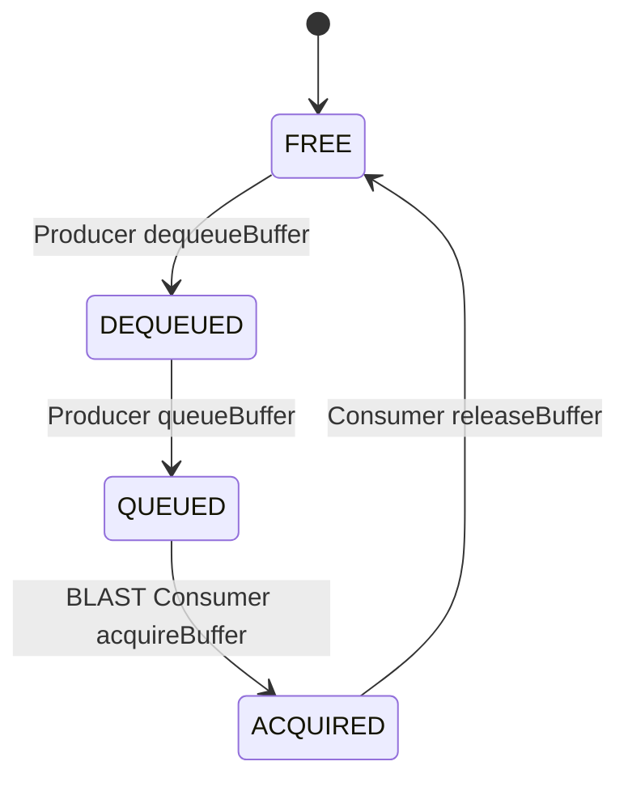
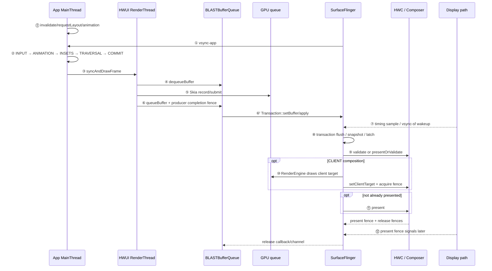

---


title: Android View 标准管线（BLAST 深入）
chapter: '18.2'
section: '18.2'
status: finalized
applicable_versions: Android 11 (API 30) - Android 17 (API 37)
last_verified: '2026-07-31'
last_verified_against: AOSP android-17.0.0_r1 Choreographer/ViewRootImpl/HWUI/BufferQueue/BLAST/SurfaceFlinger/HWComposer + Perfetto android-17.0.0_r1
confidence: high
sources:
  - type: internal-reference
    path: "/Users/gracker/Library/Mobile Documents/iCloud~md~obsidian/Documents/Writer/rendering_pipelines/S02_aosp_standard_type.md"
    role: "标准 HWUI 页面分型、完整证据链与版本演进"
  - type: aosp
    path: "https://android.googlesource.com/platform/frameworks/base/+/android-17.0.0_r1/core/java/android/view/Choreographer.java"
    role: "VSync callback、五阶段 doFrame 与 buffer stuffing recovery"
  - type: aosp
    path: "https://android.googlesource.com/platform/frameworks/base/+/android-17.0.0_r1/core/java/android/view/ViewRootImpl.java"
    role: "Traversal、同步屏障与 HWUI 入口"
  - type: aosp
    path: "https://android.googlesource.com/platform/frameworks/base/+/android-17.0.0_r1/libs/hwui/renderthread/DrawFrameTask.cpp"
    role: "UI thread unblock、syncFrameState 与 RenderThread draw"
  - type: aosp
    path: "https://android.googlesource.com/platform/frameworks/base/+/android-17.0.0_r1/libs/hwui/renderthread/CanvasContext.cpp"
    role: "HWUI draw、FrameTimeline 信息与 ADPF hint session"
  - type: aosp
    path: "https://android.googlesource.com/platform/frameworks/native/+/android-17.0.0_r1/libs/gui/BufferQueueProducer.cpp"
    role: "BufferQueue slot 状态与 dequeue/queue 约束"
  - type: aosp
    path: "https://android.googlesource.com/platform/frameworks/native/+/android-17.0.0_r1/libs/gui/BLASTBufferQueue.cpp"
    role: "BufferItem transaction、release channel 与 buffer wait callback"
  - type: aosp
    path: "https://android.googlesource.com/platform/frameworks/native/+/android-17.0.0_r1/services/surfaceflinger/Scheduler/FrameTimeline.cpp"
    role: "SurfaceFrame actual end、DisplayFrame 与 jank 分类"
  - type: aosp
    path: "https://android.googlesource.com/platform/frameworks/native/+/android-17.0.0_r1/services/surfaceflinger/DisplayHardware/HWComposer.cpp"
    role: "HWC skip-validate、present 与 release fence"
  - type: perfetto
    path: "https://android.googlesource.com/platform/external/perfetto/+/android-17.0.0_r1/src/trace_processor/perfetto_sql/stdlib/prelude/after_eof/events.sql"
    role: "FrameTimeline SQL table schema"
  - type: official
    path: "https://developer.android.com/develop/ui/compose/phases"
    role: "Compose Composition、Layout 与 Drawing 阶段"
  - type: kernel
    path: "https://android.googlesource.com/kernel/common/+/refs/tags/android17-6.18-2026-06_r6"
    role: "调度、cpuset、uclamp、cpufreq、dma-buf 与 sync_file 的统一 kernel 锚点"
tags:
- BLAST
- RenderThread
- HWUI
- DisplayList
- FrameTimeline
- Triple-Buffering
- Non-blocking-Sync
- Compose
related_chapters:
- '2.1'
- '2.5'
- '2.6'
- '2.7'
- '18.1'
pipeline_stage: ready-to-publish
task6_state: reviewed
task9_state: reviewed
task2b_state: fixed
---


# 18.2 Android View 标准管线（BLAST 深入）

本文只讨论标准 HWUI App Window：页面主体由普通 View 或 Compose host（Compose 宿主容器）组织，RenderThread 生成宿主窗口 buffer。承载主体内容的独立 Surface、浏览器 compositor（合成器）、游戏引擎 swapchain（轮换使用的一组可显示 buffer）、Camera HAL 或视频解码器 Producer 属于其他管线。

平台实现以 Android 17 / API 37 的 `android-17.0.0_r1` 为基线；涉及调度、cpuset（可运行的 CPU 集合）、uclamp（调度利用率上下限）、cpufreq（CPU 频率调节）、dma-buf（共享 buffer 的内核机制）和 fence（同步完成信号）时，内核以 `android17-6.18-2026-06_r6` 为基线。Compose 独立于 Android platform 发布，这里只说明它在标准 App Window 中的位置，不把某个 Jetpack 版本的行为归到 Android 17。

## 如何确认这是标准 HWUI 页面

分类依据是主体内容的生产与提交路径。普通 View、纯 Compose 或 `ComposeView` 页面通常属于标准类型，但页面中出现某个框架控件名不能单独作为结论。

| 条件 | 标准类型的证据 | 需要切换章节的信号 |
|---|---|---|
| 主体 Producer | `ViewRootImpl`、HWUI RenderThread 与 App GPU queue | Chromium、Flutter raster、Camera HAL、MediaCodec 或游戏引擎主导主体内容 |
| 输出目标 | 当前 App Window 的 `Surface` / BLAST BufferQueue | 独立 Surface、SurfaceTexture 输入、sideband stream 或另一条 swapchain |
| layer 拓扑 | 主体像素落在 App Window layer | 出现承载主体内容的 child layer 或多个独立 Producer layer |
| 帧节奏 | `Choreographer#doFrame` 与窗口 SurfaceFrame 能解释主体更新 | 引擎、解码器或硬件模块维护独立 cadence（输出间隔） |

常规列表页、详情页和设置页是典型标准页面。它们可能包含复杂布局、耗时较高的 shader（着色器）或大量 Compose 重组；“标准”只描述路径，不评价负载大小。页面嵌入视频、地图、相机预览或大型 WebView 后，应按实际占主体内容的 Producer 和 layer 重新分类。

## 一帧的完整旅程

标准页面可以按 12 个观察点还原。系统状态栏、导航栏、壁纸等 layer 仍会同时参加 display composition（显示合成）；下面只跟踪目标 App Window。

### ⓪ 帧为什么被安排

输入、动画、`invalidate()`、`requestLayout()`、Insets（系统栏等窗口边界信息）或窗口状态变化会让后续帧有工作。Android 17 的 `ViewRootImpl.scheduleTraversals()` 在尚未安排 traversal（测量、布局和绘制遍历）时注册 `CALLBACK_TRAVERSAL` 的 VSync callback，并插入同步屏障，让异步帧消息越过普通同步消息；`Choreographer` 用 `mFrameScheduled` 合并同一个 pending frame（已申请但尚未执行的帧）的重复申请。

`invalidate()` 会标记需要重绘的脏区域，并安排后续 traversal，不会立刻绘制；连续调用也不等于申请多份 VSync。

### ① `vsync-app` 唤醒目标进程

Android 17 的 Scheduler 根据预测 present time，以及描述工作时长和就绪余量的 app `workDuration`、`readyDuration` 参数计算应用 wakeup（唤醒时刻），再经 EventThread / DisplayEventReceiver 把 VSync 事件送到进程。

SurfaceFlinger 进程里的 `vsync-app` track 有事件，不表示目标 App 已经开始执行。Perfetto 中还要找到目标进程的 `Choreographer#doFrame`，区分事件送达、线程进入 runnable（已可运行但仍在等待 CPU）状态和主线程真正开始运行。

### ② MainThread 组织本帧

`Choreographer#doFrame()` 的 callback 顺序是：

`INPUT → ANIMATION → INSETS_ANIMATION → TRAVERSAL → COMMIT`

这里有三个边界：

- INPUT 中的重要工作之一是按帧集中消费 batched motion event（批量触摸事件）；普通输入事件也会通过 InputChannel 与 Looper 消息循环异步处理。
- Traversal 按本帧状态决定是否执行 measure、layout 与 draw，不会在每帧都完整遍历整棵 View 树。
- 硬件加速路径的 `draw()` 主要更新 RenderNode/DisplayList（可复用的绘制指令记录），描述“画什么”；像素生产发生在后面的 RenderThread/GPU 阶段。

### ③ `syncAndDrawFrame()` 交给 RenderThread

`ViewRootImpl.performDraw()` 经 `ThreadedRenderer` / `HardwareRenderer` 更新 root RenderNode（窗口绘制树的根节点），然后调用 `syncAndDrawFrame()`。native（C++）侧由 `RenderProxy` 把 `DrawFrameTask` 投递到 RenderThread。

UI 线程会在 `DrawFrameTask::postAndWait()` 等待 RenderThread 完成必要的同步。`DrawFrameTask::run()` 先执行 `syncFrameState()`；该函数在 Android 17 返回 `info.prepareTextures`，表示本轮纹理准备是否允许提前放行 UI 线程：

- 返回 true 时，RenderThread 可以在 draw 前 `unblockUiThread()`；
- 返回 false 时，UI 线程要等 draw 或 `waitOnFences()` 之后再被放行。

这解释的是 UI/RenderThread 同步边界，不能据此判断 GPU 是否完成，也不能把 `syncAndDrawFrame` 的结束时刻当成 present。

下面的源码骨架用于展示 UI thread 的等待与放行位置。它省略了 callback、skip-frame 和错误分支，不是可编译代码。

```text
RenderProxy::syncAndDrawFrame()
    DrawFrameTask::drawFrame()
        postAndWait()

DrawFrameTask::run()
    canUnblockUiThread = syncFrameState(info)
    if (canUnblockUiThread)
        unblockUiThread()
    if (canDrawThisFrame)
        CanvasContext::draw()
    else
        CanvasContext::waitOnFences()
    if (!canUnblockUiThread)
        unblockUiThread()
```

`syncFrameState()` 在 `CanvasContext::prepareTree()` 之后返回 `info.prepareTextures`。纹理准备成功时 UI thread 可在 draw 前继续；纹理缓存空间不足等情况会让 UI thread 保持等待，直到本轮 draw 或 fence wait 结束。

### ④～⑥ RenderThread 生产窗口 buffer

RenderThread 使用 App Window 的 `Surface` / BufferQueue Producer：

1. `dequeueBuffer()` 获取一个满足约束的 free slot（可写缓冲区槽位）；没有可用 slot、Producer 已达到 max-dequeued（可同时持有的 DEQUEUED 数量上限），或返回 slot 的 release fence 尚未满足时，可能等待。
2. HWUI 的 Skia OpenGL/Vulkan pipeline 录制并提交 GPU 命令。
3. `queueBuffer()` 提交 slot、frame number（帧序号）、timestamp（内容时间戳）、dataspace（颜色空间与范围）、crop/transform（裁剪与变换）等元数据，以及 producer completion fence（Producer 写入完成的同步信号）。

CPU command submission（命令提交）完成并且 `queueBuffer()` 返回时，GPU 仍可能继续写入。Producer completion fence 在 Consumer 侧作为 acquire fence，约束 Consumer 何时能安全读取这块 buffer。

### ⑥' BLAST 把 buffer 变成 transaction

标准 App Window 的 BLASTBufferQueue 位于应用进程，负责把队列中的 `BufferItem` 转成 `SurfaceControl.Transaction`。`onFrameAvailable()` 取得 `BufferItem` 后，`acquireNextBufferLocked()` 调用 `Transaction::setBuffer()`，写入 buffer、acquire fence、frame number 和 release callback（buffer 可复用时的通知）；需要同步的窗口 transaction 可以按 frame number 合并，随后通过 `apply()` 提交给 SurfaceFlinger。

SurfaceFlinger 进程收到含 buffer 的 transaction 并计入 pending（待处理）后，`BufferTX - <layerName>` 增加；buffer 被 latch（采纳）或 drop（丢弃）后减少。App 侧 `queueBuffer()` 与 SurfaceFlinger 侧 `BufferTX` 是两个不同的时间点。

下面的源码骨架用于标出 `queueBuffer()` 之后的 BLAST transaction 边界。它没有展开 callback 和同步事务合并。

```text
BufferQueueProducer::queueBuffer(slot, QueueBufferInput{fence, ...})
    slot.state = QUEUED
    frameAvailableListener.onFrameAvailable(BufferItem)

BLASTBufferQueue::onFrameAvailable(BufferItem)
    acquireNextBufferLocked()
        Transaction.setBuffer(
            surfaceControl, buffer, acquireFence, frameNumber, ...)
        Transaction.apply()

SurfaceFlinger::setTransactionState(...)
    TransactionHandler::queueTransaction(...)
```

这段路径传递 slot、buffer handle（缓冲区句柄）、元数据和同步对象，不会经 Binder（Android 进程间通信机制）复制整帧像素。SF 侧收到 transaction 后还要检查 readiness（事务是否具备处理条件），生成本轮 layer snapshot（状态快照），再执行 latch 和 composition；所以上述任一步完成都不能代替 present 证据。

### ⑦～⑧ SF FrontEnd 与 latch

SurfaceFlinger 在 `vsync-sf` 节奏下集中处理（flush）transaction。Android 17 FrontEnd 把请求合入 `RequestedLayerState`，再由 `LayerLifecycleManager` / `LayerSnapshotBuilder` 生成本轮 `LayerSnapshot`。

`latch` 表示本轮采纳了目标 layer 的新 buffer。一般路径会检查 acquire fence；符合 `shouldLatchUnsignaled()`、简单单 layer update、队列顺序等条件时，可以先 latch 尚未 signal 的 buffer，也就是先采纳 transaction，不等待 Producer 完成信号。RenderEngine 或 HWC 真正读取内容时仍要遵守 fence。

### ⑨～⑪ HWC composition 与 present

SurfaceFlinger 把所有可见 layer 交给 HWC 协商 composition type（CLIENT GPU 合成或 DEVICE 硬件合成等类型）。Android 17 的 `HWComposer::getDeviceCompositionChanges()` 只有满足 `canSkipValidate`（允许跳过独立验证）和 earliest-present（最早可呈现时间）条件时，才尝试 `presentOrValidate()`：

- `PresentSucceeded` 表示这次组合 HAL 调用已经走完 present 分支，并保存了 present/release fences；
- `Validated` 表示 validate 已在本次调用中完成；随后还要读取 HWC 要求改变的 composition type 或其他 request，并调用 `acceptChanges()`；
- 不能 skip 时，单独调用 `validate()` 检查当前 layer 组合能否由硬件处理；
- 有 CLIENT layer 时，RenderEngine 先生成 client target（GPU 合成后的显示目标），再通过 `setClientTarget()` 把 buffer 和对应的 acquire fence 交给 HWC；
- `presentAndGetReleaseFences()` 在 fast path（已由前一步完成 present 的快速路径）中只需 flush commands；其他路径调用 `present()`，并收集每个 layer 的 release fence。

`PresentSucceeded` 是 Composer/HWC 调用状态，不表示 panel（物理显示面板）已经完成扫描。

### ⑫ present 与 release feedback

HWC 返回每个 display 的 present fence 和每个 layer 的 release fence。SurfaceFlinger 还会根据 CLIENT/DEVICE composition 合并或替换 release 信息，再通过 callback/release channel（释放通知通道）回传 Producer。

Present fence 是 Android 显示栈的 display-present 时间锚点；panel 扫描、像素响应，以及从触摸输入到屏幕发光的完整延迟，还需要 driver trace（驱动追踪）或外部测量。Release fence 约束旧 buffer 何时能安全复用，不能用 present fence 替代。

## BLAST Buffer 生命周期

### Slot 状态机

下面的状态图用于理解一个 BufferQueue slot 的主要状态：



`releaseBuffer()` 把 slot 归还到可 dequeue 的状态，但 slot 仍可能携带上一轮 release fence。Producer 再次写入前必须遵守该 fence；`FREE` 只表示 slot 已成为候选，不保证硬件已经允许立即覆盖内容。

| 状态 | 主要持有方 | 含义 |
|---|---|---|
| `FREE` | BufferQueue | 可作为 dequeue 候选，可能带待遵守的 release fence |
| `DEQUEUED` | Producer/RenderThread | 已取出，准备写入或正在写入 |
| `QUEUED` | BufferQueue | Producer 已提交，等待 Consumer acquire；acquire fence 可能尚未 signal |
| `ACQUIRED` | BLAST/BufferItemConsumer | Consumer 已取得，后续通过 transaction 进入 SF pending/latch/release 路径 |

### 队列深度由运行时约束共同决定

“BLAST 始终维护三个 buffer”不符合 Android 17 源码。BufferQueue 有一组 slot，运行时可用数量由多项约束共同决定：

- `maxDequeuedBufferCount`：Producer 同时持有的 DEQUEUED 上限；
- `maxAcquiredBufferCount`：BLAST Consumer 同时持有的 ACQUIRED 上限；
- synchronous/async（同步/异步队列模式）、Producer 是否允许阻塞，以及 queued backlog（已经排队但尚未消费的数量）；
- 当前各 slot 的状态；
- release fence、BLAST pending release；
- 当前/最大刷新率对应的 acquired-count 策略。

Triple buffering（三缓冲）是常见运行状态，不代表每台设备、每个窗口都始终固定使用三个 slot。它可以减少 Producer 与 Consumer 相互等待，也可能让 in-flight frame（仍在处理链中的帧）增多；是否增加一整帧延迟取决于 pacing（帧节奏）、queue depth（排队深度）、latch 和 present，不能从“有第三个 slot”直接推导。

`dequeueBuffer()` 等待也不等于只等“上一帧那块 buffer”。Producer 可以选择任何满足约束的 FREE slot；只有所有候选都被状态、数量上限或 fence 挡住时才会等。

### BLAST 的 release 路径

Android 17 中，正常的 buffer 释放信息由 SF release callback/release channel 回到 BLAST，再由 `BLASTBufferItemConsumer::releaseBuffer()` 归还 slot。Transaction completed callback 还会对 stale submitted buffer（已被后续提交替代的旧 buffer）生成 fake release（用于完成资源归还的模拟释放通知），因此不能把所有 buffer 释放都归因到 transaction-completed 回调。

Release 信息携带与当前刷新率相关的 acquired count（Consumer 已取得的 buffer 数）；BLAST 对 EGL Producer 可以暂存一部分已 release buffer，以在当前刷新率低于设备最大刷新率时控制延迟和分配行为。诊断 queue depth 时要查看当时的 acquired/dequeued 上限和 pending release（等待处理的释放信息），不能只数 trace 上的三个 buffer 名称。

### Buffer stuffing recovery：缓解队列堆积

Android 17 的 `Choreographer`/HWUI 路径包含 buffer stuffing recovery，用于缓解 Producer 提交过快造成的队列堆积。`BBQBufferQueueProducer::waitForBufferRelease()` 记录等待，`ViewRootImpl` / `ThreadedRenderer` 把信号传到 `Choreographer.onWaitForBufferRelease()`；等待超过相应阈值时，后续 `doFrame()` 可以主动延后一帧，使 queued buffer 数下降。

Android 17 r1 的阈值是最近 frame interval（帧间隔）的一半。进入 recovery 后，`DELAY_FRAME` 会请求下一次 VSync 并跳过当前 `doFrame()`；后续 recovery 还可能对 animation frame time 应用一个 frame interval 的负 offset，即从动画帧时间中减去一个 frame interval。`buffer_stuffing_multi_recovery` 控制同一段动画是否允许多次恢复；`buffer_stuffing_recovery_threshold` 启用时，累计主动 delay 的上限为 100 ms。两项都是可变的 aconfig flag（平台配置开关），目标设备的取值必须从配置或 trace 确认。

这项机制用于降低队列过深带来的额外输入到显示延迟，不会提高单位时间内可完成的帧数。Perfetto 中看到 `Buffer stuffing recovery`、`buffer stuffed` 或 `Negative offset` 时，要同时检查 dequeue wait、FrameTimeline `Buffer Stuffing` 和 queue backlog 是否回落。

## 渲染时序图（BLAST Sequence）

下面的图把 App、BLAST、SurfaceFlinger 与 HWC 放在同一条时序线上：



图里 BLAST 消费 BufferItem 的位置在 App 进程，SF 侧消费的是 SurfaceControl transaction。`queueBuffer()` 返回不会等待 SF 合成；当队列没有可用 slot 时，如果 Consumer 消费或释放得较慢，后续 `dequeueBuffer()` 仍可能等待。

## Trace 视角

固定“正常耗时 < 1 ms / 2 ms / 8 ms”不适合跨刷新率、设备和场景复用。分析 Android 17 时，应把每个阶段与本帧的 expected timeline（预期时间线）、线程状态和当前 display budget（该帧可用的显示时间预算）对齐。

| 阶段 | 主要信号 | 需要回答的问题 |
|---|---|---|
| App 收帧 | `Choreographer#doFrame`、app FrameTimeline | App 是按时醒来，还是 runnable 等待或消息队列处理已经延误 |
| MainThread | INPUT、ANIMATION、INSETS_ANIMATION、TRAVERSAL、COMMIT | 哪个 callback 或业务工作先增加 |
| UI→RT | `syncAndDrawFrame`、RenderThread `DrawFrame` | UI 在等状态同步，还是 RT 已进入 draw |
| Buffer 生产 | `dequeueBuffer`、GPU slice/fence、`queueBuffer` | slot 等待、CPU submission、GPU completion、queue 中哪一段较晚 |
| App→SF | `BufferTX - <layerName>`、transaction、latch | buffer update 是否到达 SurfaceFlinger，是否被本轮采纳 |
| SF/HWC | SF actual、composition type、DisplayHAL、present feedback | 系统 CPU、CLIENT GPU、HWC/display 哪段晚 |

### MainThread、RenderThread 与 GPU 分开看

`DrawFrame` 是 RenderThread 的 CPU 工作区间，不能代表 GPU duration（GPU 执行时长）。线程状态还要区分：

- Running 长：线程获得 CPU 后工作量大；
- Runnable 长：线程已可运行但没有及时上 CPU；
- Sleeping/blocked 长：线程处于睡眠或阻塞状态，可能在等待 futex（线程同步原语）、Binder、buffer、fence 或其他资源。

提高 CPU 频率不能消除所有阻塞等待。应把 `sched_wakeup`、`sched_switch`、线程状态、CPU frequency 和目标 slice 对齐，再讨论调度、cpuset、uclamp 或 thermal（温控限制）。

### 四个关口

一帧可以按以下顺序排查：

1. `doFrame` 内哪个 callback 的耗时先变长？
2. RenderThread 是同步、绘制、GPU 提交，还是 `dequeueBuffer` 等待？
3. `queueBuffer` 之后，`BufferTX`、latch 是否按时？
4. App 按时交付后，SF actual、composition type、HWC/DisplayHAL 和 present 是否按时？

`主线程短 + RenderThread 短 + Jank` 不能直接写成“SurfaceFlinger 或 HWC 问题”。Jank 表示帧未满足预期时间，GPU completion、buffer transaction、acquire fence、display prediction error 都可能发生在两个 CPU slice 之外。

### 用 RecyclerView 滑动校准观察顺序

跟手滑动适合把上述关口连成一帧：

1. `ACTION_MOVE` 经输入通道到达应用，同一 VSync 周期积累的 batched motion event 在 INPUT callback 中消费；滚动容器据此更新偏移并请求 redraw（重绘）。
2. ANIMATION、INSETS_ANIMATION 与 TRAVERSAL 继续执行。RecyclerView 是复用 DisplayList，还是重新 bind（绑定数据）、measure、layout item，要以本帧 slice 和 layout request 为准。
3. `ThreadedRenderer.draw()` 更新 root RenderNode，RenderThread 取得窗口 buffer、提交 GPU 命令并 `queueBuffer()`。
4. BLAST 把 `BufferItem` 放入 transaction。SurfaceFlinger 计入待处理队列时 `BufferTX` 增加，latch 或 drop 后下降。
5. HWC 决定 composition type，DisplayFrame 与 present fence 给出显示栈时间边界；触摸到光子的完整时延还需要输入、driver 与外部测量。

手指抬起进入 fling（惯性滚动）后，驱动位移的来源转为 ANIMATION 阶段的 `OverScroller` 等对象；此时 INPUT 工作减少或消失属于正常变化，不能据此判断动画线程异常。

## FrameTimeline 与 Jank 检测

FrameTimeline 从 Android 12 起为标准 App Window 提供 `SurfaceFrame` 和 `DisplayFrame` 的 expected/actual（预期/实际）时间线。Android 17 中，App 通过 FrameTimeline VSync id 选择预期 present timeline；该信息沿 HWUI/BLAST transaction 进入 SurfaceFlinger。

需要分清两类 token（跨阶段关联帧记录的标识）：

- `surface_frame_token` 关联某个 layer/SurfaceFrame；
- `display_frame_token` 关联合成后的 DisplayFrame。

一个 DisplayFrame 可以包含多个进程、多个 layer 的 SurfaceFrame，不能把两种 token 合成一个“端到端 token”。

### Expected 与 Actual

比较 deadline 时，应使用完整区间：

- expected end = `expected.ts + expected.dur`；
- actual end = `actual.ts + actual.dur`；
- overrun = actual end - expected end，表示超出预期截止时间的时长。

Android 17 的 `SurfaceFrame::setAcquireFenceTime()` 把 App actual end 设置为 `max(acquire fence signal time, queue time)`；fence 仍处于 pending（尚未 signal）状态时，暂用 queue time。对标准 HWUI 窗口，actual end 因而反映 Producer 完成可读与 buffer post（提交入队）两个边界中较晚的一项，不能用 UI thread 返回时刻替代。

`jank_type` 是卡顿分类线索，不是根因结论。`Buffer Stuffing` 还要结合 dequeue wait、queued backlog、`BufferTX`、latch、release fence 和 recovery trace；`SurfaceFlingerCpuDeadlineMissed`、`SurfaceFlingerGpuDeadlineMissed`、`DisplayHAL`、`PredictionError` 分别指向 SF CPU、SF GPU、显示 HAL 或预测误差，也要与对应的线程或硬件证据对齐。

下面的 Perfetto SQL 用于按 SurfaceFrame token 对齐目标应用的 expected/actual 记录：

```sql
WITH app_actual AS (
  SELECT
    a.*,
    p.name AS process_name
  FROM actual_frame_timeline_slice AS a
  LEFT JOIN process AS p USING (upid)
  WHERE a.surface_frame_token != 0
),
app_expected AS (
  SELECT
    upid,
    surface_frame_token,
    ts AS expected_ts,
    dur AS expected_dur
  FROM expected_frame_timeline_slice
  WHERE surface_frame_token != 0
)
SELECT
  a.surface_frame_token,
  a.display_frame_token,
  a.ts AS actual_ts,
  a.dur AS actual_dur,
  e.expected_ts,
  e.expected_dur,
  (a.ts + a.dur) - (e.expected_ts + e.expected_dur) AS overrun_ns,
  a.jank_type,
  a.present_type,
  a.on_time_finish,
  a.layer_name
FROM app_actual AS a
LEFT JOIN app_expected AS e
  ON a.upid = e.upid
  AND a.surface_frame_token = e.surface_frame_token
WHERE a.process_name = 'com.example.app'
  AND a.layer_name GLOB '*com.example.app*'
ORDER BY a.ts;
```

`overrun_ns > 0` 只表示 Actual end 晚于 Expected end。相同 token 可能出现多个 layer 记录，统计前应按目标 `layer_name` 过滤或去重，再回到对应时间窗检查 MainThread、RenderThread、GPU、BufferQueue 与 SF/HWC；这个数值本身不能说明是哪一阶段导致超时。

### FrameTimeline 的覆盖边界

标准 HWUI App Window 是 FrameTimeline 覆盖较完整的场景。SurfaceView 主体、Camera、Video、游戏引擎或其他独立 Producer 不一定提供同样完整的 App actual slice。缺少目标 layer/token 时，应回到 producer queue、frame number、`BufferTX`、latch、HWC 和 present timing。

## Compose 在标准 App Window 中的位置

纯 Compose 或 `ComposeView` 不会因声明式 UI 自动创建独立 Surface。在普通宿主中，Compose 内容仍通过 Android owner（连接 Compose 与 Android View/HWUI 的宿主对象）写入当前 App Window；`syncAndDrawFrame()` 之后继续走 RenderThread、BLAST、SurfaceFlinger 与 HWC。

Compose 改变的是 MainThread 生成 UI 内容的方式：

- Composition 执行相关 composable，更新需要重新生成的 UI tree；
- Layout 测量节点尺寸并确定放置位置；
- Drawing 把绘制操作交给 Android Canvas/HWUI。

状态在不同阶段被读取时，可能只让对应阶段重新执行，不表示每帧都会完整执行三遍。Intrinsic measurement（固有尺寸测量）、`SubcomposeLayout`（布局期间执行子组合）、Lazy layout 和 Lookahead（前瞻布局）等路径也可能多次测量或组合，不能套用最简单的 single-pass（单次遍历）解释。

判断类型时看 Producer、Surface 和 layer：

| 页面结构 | 默认分类 |
|---|---|
| View 页面嵌 `ComposeView` | 标准 HWUI |
| Compose 页面嵌普通 `AndroidView` | 通常仍是标准 HWUI |
| Compose 中嵌 `SurfaceView`/视频/Camera | SurfaceView 或混合类型 |
| Compose 中嵌 `TextureView` | TextureView 或混合类型 |
| 页面主体为 WebView/Flutter 等引擎 | 对应引擎类型 |

Compose Runtime、Compiler、Kotlin、BOM（集中约束依赖版本的版本清单）和 tracing 版本必须单独记录，不能用 `android-17.0.0_r1` 推断 strong skipping（跳过输入未变化 composable 的优化）、slice 名或 compiler 行为。没有 composition tracing 时，可以判断窗口级 MainThread/HWUI 成本，但不能把宿主 slice 精确归因到某个 composable（Compose UI 函数）。

## 系统策略：能证明什么

### ADPF hint 不保证固定频率

ADPF（Android Dynamic Performance Framework，Android 动态性能框架）的 `PerformanceHintManager.Session` 可以报告 target/actual work duration（目标/实际工作时长）。Android 17 HWUI 的 `CanvasContext` / `HintSessionWrapper` 也会管理 hint session。提示交给 Power HAL（电源硬件抽象层）和 vendor 实现后，API 不承诺绑定固定 CPU、保持固定频率或每次都提升性能。

若要证明 ADPF 产生效果，至少应对齐 session 上报、vendor（设备或芯片厂商）hint 响应和后续调度/频率变化。只看到频率升高或只看到 API 调用，都不够。

### HWC 路径看 composition 结果

HWC 能否使用 overlay（独立硬件图层），以及是否支持某种 transform（变换）、format（像素格式）、dataspace（颜色空间与范围）、blend（混合）或 protected content（受保护内容），取决于设备实现和当时可用资源。应查看每个 layer 的 composition type、client composition、FrameTimeline GPU composition、HWC trace 或 dumpsys。

功耗下降、SF slice 变短或 present 提前，不能单独证明目标 layer 使用 DEVICE composition。

### 预取不等于预生成多帧

RecyclerView GapWorker、Compose Lazy prefetch（预取）、图片预热和 shader/pipeline cache 可以把能够提前确定的工作移到关键 deadline（截止时间）之前，但无法提前生成未知的后续 UI 状态，也不改变 `INPUT → ANIMATION → INSETS_ANIMATION → TRAVERSAL → COMMIT` 顺序。

证明预取有效，需要看到 prefetch 工作提前执行，并且后续关键帧的 bind/measure/upload 或 pipeline creation 成本下降；不能只凭滑动变顺就推断系统“提前补帧”。

### 结论与证据门槛

| 想确认的结论 | 至少要保存的证据 | 单独不足的信号 |
|---|---|---|
| UI/RenderThread 调度等待下降 | 同场景 runnable delay、线程状态、CPU 落点和优先级/cgroup（控制组）对比 | 单帧 duration 变短 |
| ADPF 产生设备侧响应 | HintSession 上报、vendor hint 响应、随后发生的调度或频率变化 | 只有 API 调用或只有 cpufreq 上升 |
| BufferQueue 深度改变 | max dequeued/acquired、slot/async 配置及 queue wait 对比 | `dequeueBuffer` 变短 |
| stuffing recovery 生效 | recovery trace、主动 delay 与 backlog 回落 | 只有 FrameTimeline `Buffer Stuffing` |
| HWC 使用 DEVICE composition | per-layer composition type、HWC 或 GPU composition 证据 | 功耗下降、SF slice 变短或 present 提前 |

## 版本边界

| 平台 | 标准页面相关节点 | 分析影响 |
|---|---|---|
| Android 11 / API 30 | BLAST 进入平台主线 | 旧 tag 仍需按当时 Layer/transaction 对象分析 |
| Android 12 / API 31 | App Window BLAST 与 FrameTimeline 形成现代基线；`PerformanceHintManager` 公开 | 可关联 SurfaceFrame/DisplayFrame，ADPF 仍只提供 hint |
| Android 13 / API 33 | `AutoSingleLayer` latch-unsignaled 成为默认策略 | transaction latch 与 acquire-fence signal 可以分离 |
| Android 14 / API 34 | 标准 Choreographer/HWUI/BLAST/SF/HWC 拓扑延续 | SurfaceView 的 alpha/lifecycle 变化不要套到 App Window |
| Android 15 / API 35 | Window 可表达 desired HDR headroom；edge-to-edge（内容延伸到系统栏区域）可能改变 Insets/Traversal 成本 | HDR/Insets 变化不自动改变标准页面分类 |
| Android 16 / API 36 | 标准主拓扑延续 | 跨版本实验要固定 vendor、刷新率、应用构建与 Jetpack 版本 |
| Android 17 / API 37 | 当前锚点：FrontEnd snapshot、现行 BLAST acquired-count、buffer stuffing recovery、预测 present time 与 HWC fast path | 方法名和 flag 以 `android-17.0.0_r1` 为准，不从当前 tag 反推首引版本 |

## Android 17 源码入口

平台源码全部固定到 `android-17.0.0_r1`：

- [`Choreographer.java`](https://android.googlesource.com/platform/frameworks/base/+/android-17.0.0_r1/core/java/android/view/Choreographer.java) 与 [`ViewRootImpl.java`](https://android.googlesource.com/platform/frameworks/base/+/android-17.0.0_r1/core/java/android/view/ViewRootImpl.java)：VSync 申请、五类 callback、buffer stuffing recovery、traversal；
- [view flags](https://android.googlesource.com/platform/frameworks/base/+/android-17.0.0_r1/core/java/android/view/flags/view_flags.aconfig)：`buffer_stuffing_multi_recovery` 与 `buffer_stuffing_recovery_threshold` 的可变 flag 定义；
- [`ThreadedRenderer.java`](https://android.googlesource.com/platform/frameworks/base/+/android-17.0.0_r1/core/java/android/view/ThreadedRenderer.java)、[`HardwareRenderer.java`](https://android.googlesource.com/platform/frameworks/base/+/android-17.0.0_r1/graphics/java/android/graphics/HardwareRenderer.java) 与 [HWUI JNI](https://android.googlesource.com/platform/frameworks/base/+/android-17.0.0_r1/libs/hwui/jni/android_graphics_HardwareRenderer.cpp)：Java 到 native HWUI；
- [`RenderProxy.cpp`](https://android.googlesource.com/platform/frameworks/base/+/android-17.0.0_r1/libs/hwui/renderthread/RenderProxy.cpp)、[`DrawFrameTask.cpp`](https://android.googlesource.com/platform/frameworks/base/+/android-17.0.0_r1/libs/hwui/renderthread/DrawFrameTask.cpp)、[`CanvasContext.cpp`](https://android.googlesource.com/platform/frameworks/base/+/android-17.0.0_r1/libs/hwui/renderthread/CanvasContext.cpp)：UI unblock、RenderThread draw、buffer duration、hint session；
- [`BufferQueueProducer.cpp`](https://android.googlesource.com/platform/frameworks/native/+/android-17.0.0_r1/libs/gui/BufferQueueProducer.cpp)、[`BufferQueueConsumer.cpp`](https://android.googlesource.com/platform/frameworks/native/+/android-17.0.0_r1/libs/gui/BufferQueueConsumer.cpp) 与 [`BLASTBufferQueue.cpp`](https://android.googlesource.com/platform/frameworks/native/+/android-17.0.0_r1/libs/gui/BLASTBufferQueue.cpp)：slot 状态、dequeued/acquired 上限、buffer transaction 与 release；
- [`SurfaceFlinger FrontEnd`](https://android.googlesource.com/platform/frameworks/native/+/android-17.0.0_r1/services/surfaceflinger/FrontEnd/)、[`Layer.cpp`](https://android.googlesource.com/platform/frameworks/native/+/android-17.0.0_r1/services/surfaceflinger/Layer.cpp) 与 [`SurfaceFlinger.cpp`](https://android.googlesource.com/platform/frameworks/native/+/android-17.0.0_r1/services/surfaceflinger/SurfaceFlinger.cpp)：requested state、snapshot、`BufferTX`、transaction readiness 与 latch；
- [`HWComposer.cpp`](https://android.googlesource.com/platform/frameworks/native/+/android-17.0.0_r1/services/surfaceflinger/DisplayHardware/HWComposer.cpp)、[`HWC2.cpp`](https://android.googlesource.com/platform/frameworks/native/+/android-17.0.0_r1/services/surfaceflinger/DisplayHardware/HWC2.cpp) 与 [`FrameTimeline.cpp`](https://android.googlesource.com/platform/frameworks/native/+/android-17.0.0_r1/services/surfaceflinger/Scheduler/FrameTimeline.cpp)：composition strategy、present/release fence、SurfaceFrame/DisplayFrame。
- [Perfetto `events.sql`](https://android.googlesource.com/platform/external/perfetto/+/android-17.0.0_r1/src/trace_processor/perfetto_sql/stdlib/prelude/after_eof/events.sql)：`actual_frame_timeline_slice` 与 `expected_frame_timeline_slice` 的字段定义。

Kernel 侧固定到 `android17-6.18-2026-06_r6`：

- [`kernel/sched/core.c`](https://android.googlesource.com/kernel/common/+/refs/tags/android17-6.18-2026-06_r6/kernel/sched/core.c)、[`kernel/cgroup/cpuset.c`](https://android.googlesource.com/kernel/common/+/refs/tags/android17-6.18-2026-06_r6/kernel/cgroup/cpuset.c)：调度、uclamp 与 cpuset；
- [`kernel/sched/cpufreq_schedutil.c`](https://android.googlesource.com/kernel/common/+/refs/tags/android17-6.18-2026-06_r6/kernel/sched/cpufreq_schedutil.c)：调度利用率到 schedutil；
- [`drivers/dma-buf/`](https://android.googlesource.com/kernel/common/+/refs/tags/android17-6.18-2026-06_r6/drivers/dma-buf/) 与 [`drivers/dma-buf/sync_file.c`](https://android.googlesource.com/kernel/common/+/refs/tags/android17-6.18-2026-06_r6/drivers/dma-buf/sync_file.c)：共享 buffer 和用户态 fence fd 的通用内核机制。

Vendor governor（厂商的频率调节策略）、Power HAL、GPU driver、Composer、display driver 与 panel 时序不在 common kernel 结论范围内，必须用目标设备源码和 trace 补充证据。

## 小结

标准 HWUI 页面的一帧由 MainThread 准备状态，RenderThread/GPU 生成 App Window buffer，BLAST 把 BufferItem 包装成 SurfaceControl transaction，SurfaceFlinger/HWC 完成合成与 present。

定位问题时依次对齐 `doFrame`、`syncAndDrawFrame`/`DrawFrame`、dequeue/GPU/queue、`BufferTX`、latch、FrameTimeline 和 present feedback。每个信号只回答一个阶段；只有按同一 SurfaceFrame、frame number 或明确的相邻时序对齐这些证据，才能区分 UI 工作量、调度等待、GPU 执行、BufferQueue 等待、SF 合成与 display 后段延迟。
