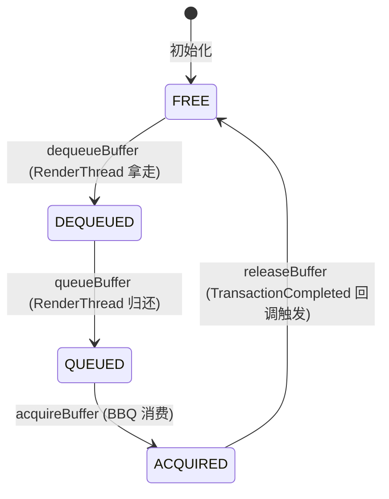
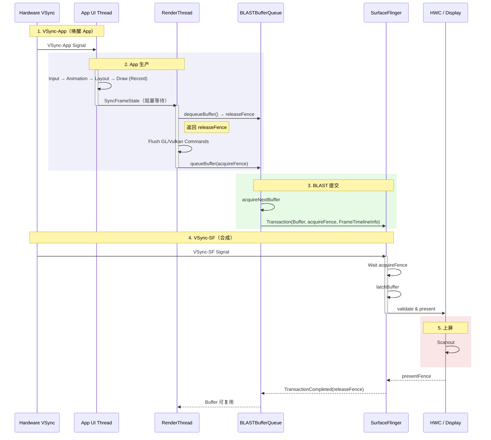

---

title: Android View 标准管线（BLAST 深入）
chapter: '18.2'
section: '18.2'
status: "finalized"
applicable_versions: Android 11 (API 30) - Android 17 (API 37)
last_verified: '2026-05-05'
last_verified_against: AOSP ViewRootImpl/HWUI/BLASTBufferQueue + Compose 官方 Phases
  of a frame + 2026-04-29 external review
confidence: medium
sources:
- type: aosp
  path: "frameworks/base/core/java/android/view/ViewRootImpl.java"
- type: aosp
  path: "frameworks/base/libs/hwui/"
- type: aosp
  path: "frameworks/native/libs/gui/BLASTBufferQueue.cpp"
- type: official
  path: "https://developer.android.com/develop/ui/compose/phases"
- type: research
  path: "DeepResearch/2026-05-15-android-view-blast-art-gc.md"
tags:
- BLAST
- RenderThread
- HWUI
- DisplayList
- FrameTimeline
- Triple-Buffering
- Non-blocking-Sync
- Compose
related_chapters:
- '2.1'
- '2.5'
- '2.6'
- '2.7'
- '18.1'
created_by: rendering-pipelines-merge
created_date: '2026-04-09'
pipeline_stage: "ready-to-publish"
task6_state: "reviewed"
task9_state: reviewed
task2b_state: fixed
task2b_result: fixed
last_task2b_at: 2026-06-04T02:57:11+08:00
reviewed_by: "openclaw-task6"
reviewed_date: "2026-06-04"
task6_result: "pass-light-edit"
task6_reviewed_date: "2026-05-26"
last_task6_at: "2026-06-04T03:10:02+08:00"
task9_result: pass-tech-review
task9_reviewed_date: 2026-06-05
task9_reviewed_by: openclaw-task9
last_task9_at: "2026-06-05T20:33:28+08:00"
task9_review_notes: "2026-06-05 Task9 deep-review: pass-tech-review. No P0/P1; existing P2 FrameTimeline wording remains non-blocking and already logged."
task6_review_notes: "2026-06-04 Task6 revisiting review: pass-light-edit。L1/L2 禁用词/高频词/AI填充词零命中。清除 1 处 [已修正] 编辑痕迹。无 B 类问题。自动晋升 finalized（task9 pass-tech-review + queue 无 pending + 无 B 类问题）。"
last_task6_review_log: "logs/review/2026-05-26-05-review.md"
last_task9_review_log: "logs/deep-review/2026-06-05-20-deep-review.md"
task9_p0_issues: 0
task9_p1_issues: 0
task9_p2_issues: 1
task6_l1_l2_fixes: 1
task6_l3_l4_issues: 0
task6_new_rework: false
review_type: "task6-writing-quality-review"
---


# Android View 标准管线（BLAST 深入）

<!-- outline-start -->

**锚点（必须覆盖）：**
- [18.2.1 一帧的完整旅程](#一帧的完整旅程) — 从 VSync 到上屏的完整路径
- [18.2.2 BLAST Buffer 生命周期](#blast-buffer-生命周期) — Buffer 状态机与 Triple Buffering
- [18.2.3 渲染时序图](#渲染时序图blast-sequence) — BLAST 模式下的跨进程交互
- [18.2.4 Trace 视角](#trace-视角) — Perfetto 中的关键 Slice
- [18.2.5 FrameTimeline 与 Jank 检测](#frametimeline-与-jank-检测) — Android 12+ 的帧判定机制

**扩展（可选深入）：**
- SyncFrameState 的阻塞语义
- Fence 在 App-SF 间的流转
- Thread Roles 与职责边界
- Jetpack Compose 在这条管线上的位置

<!-- outline-end -->

这是一条绝大多数 Android App 每一帧都在走的渲染管线：UI Thread 构建 DisplayList → RenderThread 翻译为 GPU 指令 → BLAST 提交 Transaction → SurfaceFlinger 合成上屏。理解这些环节，是做渲染性能优化的基本功。

## 一帧的完整旅程

### 第一阶段：UI Thread — 生产蓝图

`VSync-App` 信号到达时，主线程被 `Choreographer` 唤醒，开始构建这一帧的绘制蓝图。这个过程是纯 CPU 操作，不产生任何像素：

1. **Input**：处理触摸/按键事件。用户点击了按钮，View 状态改变（如 `setPressed(true)`），触发 `invalidate()` 请求重绘。
2. **Animation**：`ValueAnimator` 在这里计算当前帧的动画值（如按钮缩放比例从 1.0 到 1.1 的中间值）。
3. **Measure**：自顶向下递归，父 View 询问子 View 需要多大空间，子 View 计算后汇报。这是一次完整的视图树遍历。
4. **Layout**：根据测量结果，确定每个 View 的精确位置 `(x, y, width, height)`。
5. **Draw（记录）**：调用 `View.onDraw(Canvas)`，但这个 Canvas 是 `RecordingCanvas`——它不画像素，只记录绘制命令（画圆、画文字、画图片），存入 `DisplayList`（也称为 `RenderNode`）。

**产物**：一组绘制指令列表（DisplayList）。这就是"蓝图"——它描述了"画什么"，但没有实际像素数据。

### 第二阶段：Sync — 移交蓝图

UI 线程完成 Draw 后，会把这一帧封装成 `DrawFrameTask` 交给 RenderThread，然后主线程进入等待。执行 `syncFrameState()` 的是 RenderThread，它在 `DrawFrameTask::run()` 中把 DisplayList、Bitmap 引用、Path 数据和 Layer 更新同步到渲染上下文。

**跨版本一致的机制**：`DrawFrameTask::postAndWait()` 从 Android 5.0 引入 RenderThread 起即存在，android-11 到 android-16 结构一致。UI 线程提交后同步等待 RenderThread 完成状态同步。具体流程：`DrawFrameTask::run()` 中先执行 `syncFrameState(info)`，把 DisplayList、Bitmap 引用和 Layer 更新同步到渲染上下文；同步完成后，如果满足条件（`canUnblockUiThread` 为 true），RenderThread 通过 `mSyncCond.signal()` 提前释放 UI 线程，UI 线程就能返回处理下一帧的 Input / Animation，不必等到 GPU 绘制完成。如果不满足提前释放条件（如帧结构复杂、需要保持 Draw-RT 原子性的场景），UI 线程会继续等待直到绘制结束。AVP 视频播放相关事务属于后一种场景，仍走完整同步阻塞路径。

[已验证: AOSP `frameworks/base/libs/hwui/renderthread/DrawFrameTask.cpp` — postAndWait() + canUnblockUiThread + mSyncCond.signal()，android-11/14/15/16 结构一致]

`syncFrameState` 变长时，常见原因是 Bitmap 过大、脏区域过多或 Layer 更新量突然上升。

### 第三阶段：RenderThread — GPU 绘制

RenderThread 拿到蓝图后，开始将它翻译为 GPU 能理解的指令：

1. **dequeueBuffer**：向 BLASTBufferQueue 申请一个空白的 GraphicBuffer。如果三个槽位都被占用（Triple Buffering 满载），这里会阻塞等待。在 Trace 中这是排查 Buffer 瓶颈的关键锚点。
2. **Flush Commands（GPU Draw）**：遍历 DisplayList，将"画圆、画图片"翻译为 OpenGL 或 Vulkan 指令（`glDrawArrays` / `vkCmdDraw`）。这些指令被写入 GPU Command Buffer，**CPU 并不等待 GPU 执行完毕**。
3. **queueBuffer**：绘制指令提交完成后，将这个 Buffer 归还给 BLASTBufferQueue，附带一个 `acquireFence`（表示 GPU 何时画完）。

### 第四阶段：BLAST 提交与 SurfaceFlinger 合成

这是 BLAST 模型的核心变化点：

1. **acquireNextBuffer**：BBQ 在 App 进程内作为消费者，从队列中取出刚画好的 Buffer。
2. **Build Transaction**：创建 `SurfaceControl.Transaction`，把 Buffer、acquireFence 和窗口几何信息放进同一次提交。Android 12+ 还会在这里通过 `setFrameTimelineInfo()` 带上这一帧的 VSyncId。
3. **apply Transaction**：通过 Binder 将 Transaction 发送给 SurfaceFlinger。这个调用通常是**异步的**，RenderThread 不等 SF 完成处理就返回。
4. **VSync-SF 到达**：SurfaceFlinger 被唤醒，等待 acquireFence signal，执行 `latchBuffer`，将所有 App 的 Layer 按 Z-Order 叠加，交给 HWC 硬件合成，最终上屏。

## BLAST Buffer 生命周期

理解 BLAST 的关键在于理解 Buffer 在槽位池中的状态流转。BBQ 内部维护一个 Buffer 槽位池（通常 3 个槽位，对应 Triple Buffering）。

### Buffer 状态机



每一个 Buffer 在任意时刻处于以下状态之一：

| 状态 | 含义 | 占有者 |
|:---|:---|:---|
| **FREE** | 空闲，可被分配 | 无 |
| **DEQUEUED** | 被 RenderThread 拿走准备写 | RenderThread |
| **QUEUED** | 写完放回队列，等待消费 | BLASTBufferQueue |
| **ACQUIRED** | Buffer 已被 BBQ 取走，并已关联到待提交或已提交的 Transaction | App 进程内的 BBQ |

### Triple Buffering 的意义

为什么要三个槽位？考虑一个最坏情况：

```
时间 →
Slot 0:  [App Draw F0]  [SF Display F0]
Slot 1:       [App Draw F1]  [SF Display F1]
Slot 2:            [App Draw F2]  [SF Display F2]
```

双缓冲时，如果 App 画 F1 比 SF 消费 F0 快，App 必须等 SF 释放 Slot 0——这就是 `dequeueBuffer` 阻塞的原因。Triple Buffering 引入第三个 Slot，让 App 可以立即拿到空闲 Slot 开始画 F2，而不必等 SF。

**代价**：多了一个 Slot 的显存占用（一张 1080p RGBA Buffer 约 8MB），以及多一帧的显示延迟。但换来的 GPU 利用率提升和卡顿减少，在大多数场景下是值得的。

### Buffer 计数逻辑（槽位视角）

| 操作 | 触发者 | 槽位变化 | 关联 Fence |
|:---|:---|:---|:---|
| **dequeueBuffer** | RenderThread | FREE → DEQUEUED | 返回 releaseFence（前消费者释放信号） |
| **queueBuffer** | RenderThread | DEQUEUED → QUEUED | 传入 acquireFence（GPU 画完信号） |
| **acquireBuffer** | BBQ 内部 | QUEUED → ACQUIRED | — |
| **releaseBuffer** | BBQ（由 SF 的 TransactionCompleted 回调触发） | ACQUIRED → FREE | releaseFence |

`releaseBuffer` 这一行背后有一条跨进程回调链。BLAST 模式下，Consumer 驻留在 App 进程的 BBQ，而不是 SurfaceFlinger。SF 在 Transaction 完成后通过 `TransactionCompletedListener` 把 `ReleaseCallbackId` 和 `releaseFence` 回传给 App，BBQ 再调用 `releaseBufferCallbackLocked()` 与 `BLASTBufferItemConsumer::releaseBuffer()` 归还槽位。排查 `dequeueBuffer` 长等待时，这条释放链要一起看。

## 渲染时序图（BLAST Sequence）

这张图展示了 BLAST 模式下，App、RenderThread、BBQ、SurfaceFlinger 和 HWC 之间的完整交互。注意 Buffer 的提交变成了 Transaction 的一部分——这是 BLAST 区别于 Legacy BufferQueue 的核心变化。



### 关键时序特征

1. **App 与 SF 的解耦**：RenderThread 通过 `queueBuffer` 将 Buffer 提交给 BBQ 后，不等待 SF 处理。BBQ 在 App 进程内完成 `acquireNextBuffer` 并构造 Transaction，再通过异步 Binder 发给 SF。这使得 App 侧的帧生产不会被 SF 的合成节奏直接阻塞。
2. **Fence 同步**：CPU 不等 GPU。`acquireFence` 是 GPU 画完的信号，SF 在 `latchBuffer` 时等待这个 fence，而不是 CPU spin-wait。
3. **槽位循环**：Slot 0 画完进入 ACQUIRED 状态后，RenderThread 可以立即 dequeue Slot 1 开始画下一帧。
4. **释放回路**：Slot 回到 FREE，要等 SF 的 TransactionCompleted 回调把 `releaseFence` 带回 BBQ。`dequeueBuffer` 堵住时，问题也可能出在这条释放路径的后段。

## Trace 视角

在 Perfetto 中分析标准管线时，以下 Slice 和信号是关键锚点。注意：具体名称可能因 Android 版本和 OEM 而异，但功能语义是稳定的。

### UI Thread 关键 Slice

| Slice | 含义 | 正常耗时 | 异常信号 |
|:---|:---|:---|:---|
| `Choreographer#doFrame` | 一帧的完整 UI 处理 | < frame_interval / 2（60Hz 约 8ms） | 超过当前 display frame interval → 必定掉帧 |
| `measure` / `layout` | 视图树的测量和布局 | < 2ms | 递归层级过深或布局复杂 |
| `draw` | DisplayList 记录 | < 4ms | onDraw 中有耗时操作 |
| `syncAndDrawFrame` / `DrawFrame` | 把任务投递给 RenderThread 后进入等待 | < 2ms | 这里变长时，继续看 RenderThread 的 `syncFrameState`、`dequeueBuffer` 和 GPU 提交 |

### RenderThread 关键 Slice

| Slice | 含义 | 正常耗时 | 异常信号 |
|:---|:---|:---|:---|
| `DrawFrame` | 一帧渲染任务的入口 | < frame_interval / 2（60Hz 约 8ms） | 内部若出现长 `syncFrameState` 或长 `dequeueBuffer`，说明瓶颈在状态同步或 Buffer 供给 |
| `syncFrameState` | 同步 RenderNode、Bitmap、Layer 状态 | < 2ms | Bitmap 过大、Layer 更新突增、脏区域扩大 |
| `dequeueBuffer` | 申请空闲 Buffer | < 1ms | 长等待 → Buffer 释放链或 SF 节奏跟不上 |
| `queueBuffer` | 提交画好的 Buffer | < 1ms | 异常少见 |

### SurfaceFlinger 关键 Slice

| Slice | 含义 | 异常信号 |
|:---|:---|:---|
| `setTransactionState` / `applyTransactionState` | 收到并应用 App 的 Transaction | 排队过多说明 Transaction 提交密度过高 |
| `commit` / `latchBuffer` | 锁定 Buffer 并推进本帧合成 | 等待 acquireFence 久 → GPU 还没画完 |

### 快速定位口诀

- **主线程长条 + RenderThread 短条** → UI 负担重（measure/layout/draw 慢）
- **主线程短条 + RenderThread 长条 + dequeueBuffer 长等待** → GPU 瓶颈或 Buffer 瓶颈
- **主线程短条 + RenderThread 短条 + FrameTimeline 标记 Jank** → SF 合成瓶颈或 HWC 问题

## FrameTimeline 与 Jank 检测

Android 12 引入了 FrameTimeline 机制，改变了 Jank 的判定方式。在此之前，性能分析依赖简单的"VSync 周期"判断——如果一帧耗时超过 16.6ms 就算掉帧。但这种方式无法区分"故意降频"和"用户感知的卡顿"。

### 核心机制

1. **VSyncId**：每个 VSync 信号携带唯一 ID。`Choreographer` 收到 `VSyncId`（比如 1001）后，在 `doFrame` 开始时根据这个 ID 计算预期上屏时间（`ExpectedPresentTime`）。
2. **Propagation**：RenderThread 把 `VSyncId` 交给 BBQ，BBQ 在组装 `SurfaceControl.Transaction` 时调用 `setFrameTimelineInfo()`，再把这份信息跟着 Transaction 跨进程发给 SurfaceFlinger。
3. **Matching**：SF 以这份 FrameTimelineInfo 为索引，对照 Expected Present Time 和实际 present 结果判断这一帧是否超时。

### Perfetto 中的表现

在 Perfetto 的 FrameTimeline Track 中：

- **Expected Timeline（绿条）**：表示"这帧应该在什么时间点上屏"
- **Actual Timeline（实心条）**：表示"这帧实际在什么时间点上屏"
- **Jank Tag**：Actual 超过 Expected 时自动标记。分为 `Jank`（轻微）和 `BigJank`（严重）

这种基于 VSyncId 的判定方式比传统的 "16.6ms 阈值" 精确得多。一个 30fps 渲染的页面，每两帧才有一个 VSync，FrameTimeline 能正确识别这不是掉帧——而简单的周期判定会把它标记为 Jank。

## 补充：Jetpack Compose 在这条管线上的位置

Jetpack Compose 是 Android 原生的声明式 UI 框架。从出图路径看，Compose 和 View 系统没有区别——最终都走这条 HWUI / BLAST / SurfaceFlinger 主路径。Compose 的独立维度只有一个：**MainThread 上的工作形态不同**。RenderThread 之后的部分完全共用，Compose 相关分析应集中在 MainThread 侧。

### Compose 一帧的三阶段

Compose 一帧在 MainThread 侧分三个阶段：

1. **Composition**：执行 `@Composable` 函数树，生成或更新代表界面结构的 layout node tree；Slot Table 记录 composition group、`remember` 状态和重组定位信息。这一阶段只决定"写什么"，不做布局和绘制。
2. **Layout**：用 Compose 自己的 measure policy 计算每个节点的尺寸和位置。Compose **默认**是一次 measure/layout 遍历（single-pass），但 intrinsic measurements / `SubcomposeLayout` / Lookahead 这些机制会带来额外 pass。
3. **Drawing**：把 layout node tree 对应的绘制指令录到 DisplayList（与 View 系统共用 HWUI 的 DisplayList / RenderNode）。

三阶段执行完后，Compose 把结果挂到 Host View（`ComposeView` / `AbstractComposeView`）上。这个 Host View 对外仍是普通 Android View，继续走 `ViewRootImpl` 的 `performTraversals()` / `performDraw()` 路径。RenderThread 之后的一切和 View 标准管线完全相同。

**运行时层演进**：Android 17 的 Generational CMC（分代并发标记压缩）对 Compose Composition 阶段的 GC 停顿有潜在优化空间。Composition 阶段会产生大量 `Snapshot` 状态快照对象，属于短生命周期分配。分代 GC 的 young generation 回收范围更小，理论上停顿时间比全堆回收更短。

注意：Slot Table 条目不是简单的每帧短生命周期临时对象——它们在重组间持续存在，生命周期与 Composition group 绑定。GC 策略对 Composition 阶段分配停顿的实际影响取决于 ART 运行时版本、堆大小和具体 Composable 复杂度，需要按场景实测确认。[待验证: 目前缺少 ART generational CMC 与 Compose Composition 阶段的一手 benchmark 数据（设备、模型、量化配置和 jank 指标），无法确认具体收益幅度]

[已验证: AOSP `frameworks/base/core/java/android/view/ViewRootImpl.java` + Compose 官方文档 "Phases of a frame"]

### 重组与跳过机制

Compose 性能分析最先要盯的是**重组**（recomposition）——状态变化时只重新执行相关的 Composable，不整树重跑。重组的作用域和跳过由 Compose 编译器插入的代码决定：

- **skippable**：参数都 stable 且没变化时，Composable 可以被跳过（不重新执行函数体）。
- **restartable**：Composable 自身可以作为重组的起点，状态变化时从这里开始重跑。
- **stable**：类型满足 Compose 的稳定性判定（primitive 类型、带 `@Stable` 或 `@Immutable` 注解的类、`MutableState` 的 value 等）。

非 stable 参数（普通 `List<T>`、未加注解的 data class、捕获了不稳定状态的 lambda）会导致 Composable 每次都重组，即使参数内容没变。trace 上看到 MainThread 反复跑 Composition 阶段的大块 slice，多半是 skippability 出了问题。具体哪个 Composable 跑多了，用 Compose Compiler 的 stability report 或 Layout Inspector 的重组计数定位。

### Compose 特有的 Perfetto Slice

启用 Compose tracing（`androidx.compose.runtime:runtime-tracing`；具体环境门槛以官方 Compose tooling 文档为准）后，MainThread 上能看到几类 Compose 特有 slice：

- **重组阶段相关 slice**（具体命名随 Compose 运行时版本，常见 `Recomposer` / `Composition` / `ComposerImpl.doCompose`）。
- **Composable 函数调用 slice**（开启 source information 后能看到具体 `@Composable` 名字和位置）。
- **Layout 阶段 slice**（Compose 自己的 measure policy 执行）。
- **Drawing 阶段 slice**（录入 DisplayList，与 View 的 `onDraw` 共享 HWUI 底层）。

未开启 Compose tracing 的 trace 里只能看到笼统的 `ComposeView#onMeasure` / `onLayout` / `onDraw`。排查 Compose 性能问题前先确认 tracing 是否启用，没启用的话数据价值有限。

### Compose 与 View 在 Trace 上的对比

| 维度 | View 系统 | Compose |
|:---|:---|:---|
| UI 构建方式 | XML + `findViewById` + `setText` 命令式 | `@Composable` 函数声明式 |
| 变更触发 | `invalidate()` / `requestLayout()` | 状态（`MutableState` / `StateFlow` 等）变化 |
| 布局遍历 | measure + layout 两阶段，嵌套容器可能触发多次 | 默认 single-pass，intrinsic / `SubcomposeLayout` / Lookahead 会带来额外 pass |
| MainThread slice | `measure` / `layout` / `draw` / `onDraw` | `Composition` / `Layout` / `Drawing` / Composable 函数 |
| 跨帧并行度 | UI Thread + RenderThread 两级流水 | 与 View 相同（Compose 不改变流水深度） |
| RenderThread 之后 | 标准 BLAST 主路径 | 完全相同 |
| 特有性能陷阱 | 深嵌套 ViewGroup 多次 measure、over-invalidation | 非 stable 参数触发的非必要重组、`remember` 用错 |

性能差异主要落在 MainThread 上的工作效率——Compose 看重组跳过做得好不好，View 看 measure / layout 做得轻不轻。RenderThread 之后两者完全一致；瓶颈类型相同，只是 MainThread 侧的分析入口不同。

### ComposeView 与 AndroidView 的互嵌

Compose 与 View 系统可以互相嵌入：

- **Compose 内嵌 View**：用 `AndroidView { ... }` 在 Composable 里放原生 View。被嵌入的 View 走自己的 measure / layout / draw，Compose 负责把它挂在正确的位置。
- **View 内嵌 Compose**：在 XML 里放 `ComposeView`，调 `setContent { ... }` 加 Composable 内容。`ComposeView` 对外是 `AbstractComposeView`（继承 `ViewGroup`），走标准 View 路径被 `ViewRootImpl` 管理。

混合场景在 trace 上能看到 MainThread 交替出现 Compose 阶段 slice 和 View 的 measure / layout / draw slice。分析时先按外层容器判断整体驱动模型：外层是 `ViewRootImpl` 管的 View tree，内层 Compose 阶段在外层 `Traversal` 中间插入；外层是 `ComposeView`，Compose 阶段在其 `onMeasure` / `onLayout` / `onDraw` 回调里完成。

---

> **交叉引用**：
> - BufferQueue 的内部机制（Producer/Consumer 双端、Buffer Slot 管理）详见 [2.13 图形缓冲区管理](../../part1-fundamentals/ch02-rendering/13-buffer-queue.md)
> - SurfaceFlinger 的合成策略（GPU 合成 vs HWC 合成）详见 [2.6 SurfaceFlinger 与合成](../../part1-fundamentals/ch02-rendering/06-surfaceflinger.md)
> - Fence 同步原理详见 [2.16 Sync Fence 框架与帧同步机制](../../part1-fundamentals/ch02-rendering/16-sync-fence.md)
> - SurfaceControl 与 Transaction 的底层实现详见 [18.10 SurfaceControl API 深入](10-surface-control-api.md)

## 参考资料

- **BLASTBufferQueue 与 ViewRootImpl 异步 buffer 提交流程** — 解析 BBQ 从 `onFrameAvailable` 到 `Transaction.apply()` 的提交链路，以及 `releaseBuffer` 回调链中 ACQUIRED → FREE 的槽位释放时序。DeepResearch: `2026-05-15-android-view-blast-art-gc.md`
- **ART 分代 GC 与 Compose 性能** — Android 10+ CC collector 默认启用分代模式；Compose recomposition 产生的短期对象（lambda、state、LayoutNode）集中在 young generation，由 Sticky GC（kGcTypeSticky）以较低成本回收。source.android.com: "Debug ART garbage collection"；AOSP `art/runtime/gc/collector/concurrent_copying.cc`
- **DeliQueue（Android 17 MessageQueue 无锁优化）** — targetSdk >= 37 应用默认使用 Treiber Stack 无锁入队/出队，替代旧版链表按 when 排序插入。AOSP `frameworks/base/core/java/android/os/ConcurrentMessageQueue/MessageQueue.java`
