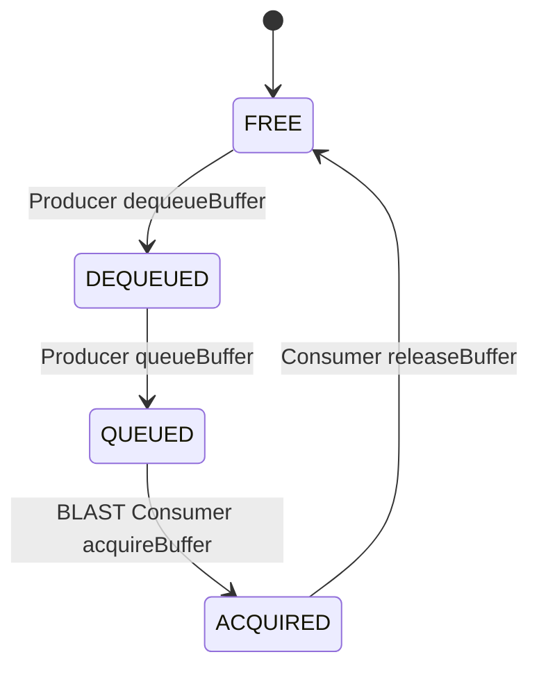
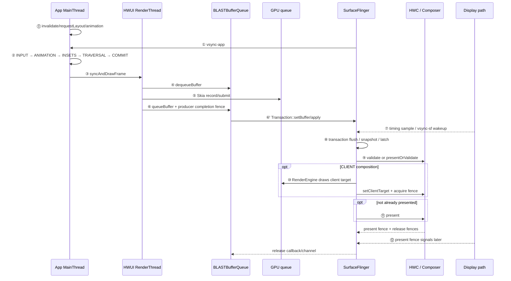

---


title: Android View 标准管线（BLAST 深入）
chapter: '18.2'
section: '18.2'
status: finalized
applicable_versions: Android 11 (API 30) - Android 17 (API 37)
last_verified: '2026-05-05'
last_verified_against: AOSP ViewRootImpl/HWUI/BLASTBufferQueue + Compose 官方 Phases
  of a frame + 2026-04-29 external review
confidence: medium
sources:
- type: aosp
  path: "frameworks/base/core/java/android/view/ViewRootImpl.java"
- type: aosp
  path: "frameworks/base/libs/hwui/"
- type: aosp
  path: "frameworks/native/libs/gui/BLASTBufferQueue.cpp"
- type: official
  path: "https://developer.android.com/develop/ui/compose/phases"
- type: research
  path: "DeepResearch/2026-05-15-android-view-blast-art-gc.md"
tags:
- BLAST
- RenderThread
- HWUI
- DisplayList
- FrameTimeline
- Triple-Buffering
- Non-blocking-Sync
- Compose
related_chapters:
- '2.1'
- '2.5'
- '2.6'
- '2.7'
- '18.1'
created_by: rendering-pipelines-merge
created_date: '2026-04-09'
pipeline_stage: ready-to-publish"
task6_state: reviewed
task9_state: reviewed
task2b_state: fixed
task2b_result: fixed
last_task2b_at: 2026-06-04T02:57:11+08:00
reviewed_by: "openclaw-task6"
reviewed_date: "2026-06-04"
task6_result: pass-light-edit
task6_reviewed_date: "2026-05-26"
last_task6_at: "2026-06-22T01:10:00+08:00"
task9_result: auto-fixed
task9_reviewed_date: 2026-06-21
task9_reviewed_by: openclaw-task9
last_task9_at: "2026-06-21T21:31:53+08:00"
task9_review_notes: "2026-06-21 Task9 idle audit auto-fix: corrected Android 16/17 BLAST libgui aconfig flag version table and removed unverified 5-15ms picture profile benefit."
task6_review_notes: "2026-06-22 01 Task6 revisiting-review (Task9 autofix 后复审): pass-light-edit。L1/L2 禁用词/高频词/AI填充词/翻译腔/元叙述零命中。无 B 类问题。自动晋升 finalized。"
last_task6_review_log: "logs/review/2026-06-22-01-review.md"
last_task9_review_log: "logs/deep-review/2026-06-21-21-audit.md"
task9_p0_issues: 0
task9_p1_issues: 0
task9_p2_issues: 1
task6_l1_l2_fixes: 0
task6_l3_l4_issues: 0
task6_new_rework: false
review_type: "task6-writing-quality-review"
deepseek_cn_review_state: done
last_deepseek_cn_review_at: 2026-06-26
last_task9_audit: 2026-06-21
last_task9_autofix_at: 2026-06-21
last_task9_audit_log: "logs/deep-review/2026-06-21-21-audit.md"
---


# Android View 标准管线（BLAST 深入）

<!-- outline-start -->

**锚点（必须覆盖）：**
- [18.2.1 一帧的完整旅程](#一帧的完整旅程) — 从 VSync 到上屏的完整路径
- [18.2.2 BLAST Buffer 生命周期](#blast-buffer-生命周期) — Buffer 状态机与 Triple Buffering
- [18.2.3 渲染时序图](#渲染时序图blast-sequence) — BLAST 模式下的跨进程交互
- [18.2.4 Trace 视角](#trace-视角) — Perfetto 中的关键 Slice
- [18.2.5 FrameTimeline 与 Jank 检测](#frametimeline-与-jank-检测) — Android 12+ 的帧判定机制

**扩展（可选深入）：**
- SyncFrameState 的阻塞语义
- Fence 在 App-SF 间的流转
- Thread Roles 与职责边界
- Jetpack Compose 在这条管线上的位置

<!-- outline-end -->

这篇只讨论标准 HWUI App Window：页面主体由普通 View 或 Compose host 组织，RenderThread 生成宿主窗口 buffer，没有承载主体内容的独立 Surface、浏览器 compositor、游戏引擎 swapchain、Camera HAL 或视频解码器 Producer。

平台实现固定到 Android 17 / API 37 的 `android-17.0.0_r1`；涉及调度、cpuset、uclamp、cpufreq、dma-buf 和 fence 时，内核固定到 `android17-6.18-2026-06_r6`。Compose 独立于 Android platform 发布，本篇只说明它在标准 App Window 中的位置，不把某个 Jetpack 版本的行为归到 Android 17。

## 一帧的完整旅程

标准页面可以按 12 个观察点还原。系统状态栏、导航栏、壁纸等 layer 仍会同时参加 display composition；下面只跟踪目标 App Window。

### ⓪ 帧为什么被安排

输入、动画、`invalidate()`、`requestLayout()`、Insets 或窗口状态变化会让后续帧有工作。Android 17 的 `ViewRootImpl.scheduleTraversals()` 在尚未安排 traversal 时注册 `CALLBACK_TRAVERSAL` 的 VSync callback，并插入同步屏障；`Choreographer` 用 `mFrameScheduled` 合并同一个 pending frame 的重复申请。

`invalidate()` 不是“立刻画一帧”，连续调用也不等于申请多份 VSync。它只是把脏状态和后续 traversal 安排好。

### ① `vsync-app` 唤醒目标进程

Android 17 的 Scheduler 根据预测 present time、app `workDuration` 与 `readyDuration` 计算应用 wakeup，再经 EventThread / DisplayEventReceiver 把 VSync 事件送到进程。

SurfaceFlinger 进程里的 `vsync-app` track 有事件，不表示目标 App 已经开始执行。Perfetto 中还要找到目标进程的 `Choreographer#doFrame`，区分事件送达、线程 runnable 等待和主线程开始运行。

### ② MainThread 组织本帧

`Choreographer#doFrame()` 的 callback 顺序是：

`INPUT → ANIMATION → INSETS_ANIMATION → TRAVERSAL → COMMIT`

这里有三个边界：

- INPUT 中的重要工作之一是 batched motion event 的帧同步消费；普通输入事件也会通过 InputChannel/Looper 异步处理。
- Traversal 按本帧状态决定是否执行 measure、layout 与 draw，不是每帧完整遍历整棵 View 树。
- 硬件加速路径的 `draw()` 主要更新 RenderNode/DisplayList，记录“画什么”；像素生产还在后面的 RenderThread/GPU。

### ③ `syncAndDrawFrame()` 交给 RenderThread

`ViewRootImpl.performDraw()` 经 `ThreadedRenderer` / `HardwareRenderer` 更新 root RenderNode，然后调用 `syncAndDrawFrame()`。native 侧由 `RenderProxy` 把 `DrawFrameTask` 投到 RenderThread。

UI 线程会在 `DrawFrameTask::postAndWait()` 等待 RenderThread。`DrawFrameTask::run()` 先执行 `syncFrameState()`；该函数在 Android 17 返回 `info.prepareTextures`：

- 返回 true 时，RenderThread 可以在 draw 前 `unblockUiThread()`；
- 返回 false 时，UI 线程要等 draw 或 `waitOnFences()` 之后再被放行。

这解释的是 UI/RenderThread 同步边界，不能据此判断 GPU 是否完成，也不能把 `syncAndDrawFrame` 的结束时刻当成 present。

### ④～⑥ RenderThread 生产窗口 buffer

RenderThread 使用 App Window 的 `Surface` / BufferQueue Producer：

1. `dequeueBuffer()` 获取一个满足约束的 free slot；没有可用 slot、Producer 已达到 max-dequeued，或返回 slot 的 release fence 尚未满足时，可能等待。
2. HWUI 的 Skia OpenGL/Vulkan pipeline 录制并提交 GPU 命令。
3. `queueBuffer()` 提交 slot、frame number、timestamp、dataspace、crop/transform 等元数据，以及 producer completion fence。

CPU command submission 与 `queueBuffer()` 返回时，GPU 仍可能继续写入。Producer completion fence 在 Consumer 侧作为 acquire fence，约束 Consumer 何时能安全读这块 buffer。

### ⑥' BLAST 把 buffer 变成 transaction

标准 App Window 的 BLASTBufferQueue 位于应用进程。`onFrameAvailable()` 取得 `BufferItem` 后，`acquireNextBufferLocked()` 调用 `Transaction::setBuffer()`，写入 buffer、acquire fence、frame number 和 release callback；需要同步的窗口 transaction 可以按 frame number 合并，随后 `apply()` 到 SurfaceFlinger。

SurfaceFlinger server 收到含 buffer 的 transaction 并计入 pending 后，`BufferTX - <layerName>` 增加；buffer 被 latch 或 drop 后减少。App 侧 `queueBuffer()` 与 server 侧 `BufferTX` 是两个时间点。

### ⑦～⑧ SF FrontEnd 与 latch

SurfaceFlinger 在 `vsync-sf` 节奏下 flush transaction。Android 17 FrontEnd 把请求合入 `RequestedLayerState`，再由 `LayerLifecycleManager` / `LayerSnapshotBuilder` 生成本轮 `LayerSnapshot`。

`latch` 表示本轮采纳了目标 layer 的新 buffer。一般路径会检查 acquire fence；符合 `shouldLatchUnsignaled()`、简单单 layer update、队列顺序等条件时，可以先 latch unsignaled buffer。即使 transaction 已被采纳，RenderEngine 或 HWC 读取内容时仍要遵守 fence。

### ⑨～⑪ HWC composition 与 present

SurfaceFlinger 把所有可见 layer 交给 HWC 协商 composition type。Android 17 的 `HWComposer::getDeviceCompositionChanges()` 只有满足 `canSkipValidate` 和 earliest-present 条件时才尝试 `presentOrValidate()`：

- PresentSucceeded 表示这次组合 HAL 调用已经走 present 分支并保存 present/release fences；
- Validated 表示 validate 已在本次调用完成，随后读取 changed composition types/requests，并 `acceptChanges()`；
- 不能 skip 时走独立 `validate()`；
- 有 CLIENT layer 时，RenderEngine 先生成 client target，再通过 `setClientTarget()` 把 buffer 和 client-target acquire fence 交给 HWC；
- `presentAndGetReleaseFences()` 在 fast path 已 present 时只 flush commands，否则调用 `present()`，并收集 per-layer release fences。

PresentSucceeded 是 Composer/HWC 调用状态，不表示 panel 已经完成扫描。

### ⑫ present 与 release feedback

HWC 返回 per-display present fence 和 per-layer release fences。SurfaceFlinger 还会根据 CLIENT/DEVICE composition 合并或替换 release 信息，再通过 callback/release channel 回传 Producer。

Present fence 是 Android 显示栈的 display-present 时间锚点；panel 扫描、像素响应和触摸到光子的完整延迟需要 driver trace 或外部测量。Release fence 约束旧 buffer 的安全复用，不能用 present fence 替代。

## BLAST Buffer 生命周期

### Slot 状态机

下面的状态图用于理解一个 BufferQueue slot 的主要状态：



`releaseBuffer()` 把 slot 归还到可 dequeue 的状态，但 slot 仍可能携带上一轮 release fence。Producer 再次写入前必须遵守该 fence；“状态为 FREE”和“硬件已经允许无条件覆盖”不能混为一谈。

| 状态 | 主要持有方 | 含义 |
|---|---|---|
| `FREE` | BufferQueue | 可作为 dequeue 候选，可能带待遵守的 release fence |
| `DEQUEUED` | Producer/RenderThread | 已取出，准备写入或正在写入 |
| `QUEUED` | BufferQueue | Producer 已提交，等待 Consumer acquire；acquire fence 可能尚未 signal |
| `ACQUIRED` | BLAST/BufferItemConsumer | Consumer 已取得，后续通过 transaction 进入 SF pending/latch/release 路径 |

### 队列深度不是固定三个槽

“BLAST 始终维护三个 buffer”不符合 Android 17 源码。BufferQueue 有 slot 数组，运行时可用数量由多项约束共同决定：

- `maxDequeuedBufferCount`：Producer 同时持有的 DEQUEUED 上限；
- `maxAcquiredBufferCount`：BLAST Consumer 同时持有的 ACQUIRED 上限；
- synchronous/async、producer 是否允许阻塞、queued backlog；
- 当前各 slot 的状态；
- release fence、BLAST pending release；
- 当前/最大刷新率对应的 acquired-count 策略。

Triple buffering 是常见运行状态，不是每台设备、每个窗口始终固定三个 slot 的契约。它可以减少 Producer 与 Consumer 互等，也可能让 in-flight frame 增多；是否增加一整帧延迟取决于 pacing、queue depth、latch 和 present，不能从“有第三个 slot”直接推导。

`dequeueBuffer()` 等待也不等于只等“上一帧那块 buffer”。Producer 可以选择任何满足约束的 FREE slot；只有所有候选都被状态、数量上限或 fence 挡住时才会等。

### BLAST 的 release 路径

Android 17 中正常 buffer 释放由 SF release callback/release channel 回到 BLAST，再由 `BLASTBufferItemConsumer::releaseBuffer()` 归还 slot。Transaction completed callback 里还有针对 stale submitted buffer 的 fake-release 处理，不能把所有 buffer 释放都归因到 transaction-completed 回调。

Release 信息携带当前刷新率相关的 acquired count；BLAST 对 EGL producer 可以暂存一部分已 release buffer，以在当前刷新率低于设备最大刷新率时控制延迟和分配行为。诊断 queue depth 时要看当时的 acquired/dequeued 上限和 pending release，不能只数 trace 上的三个 buffer 名称。

### Buffer stuffing recovery

Android 17 的 `Choreographer`/HWUI 路径包含 buffer stuffing recovery。`BBQBufferQueueProducer::waitForBufferRelease()` 记录等待，`ViewRootImpl` / `ThreadedRenderer` 把信号传到 `Choreographer.onWaitForBufferRelease()`；等待超过相应阈值时，后续 `doFrame()` 可以主动延后一帧，使 queued buffer 数下降。

这项机制处理的是队列过深造成的额外输入到显示延迟，不是提高吞吐。Perfetto 中看到 `Buffer stuffing recovery`、`buffer stuffed` 或 `Negative offset`，要与 dequeue wait、FrameTimeline `Buffer Stuffing`、queue backlog 回落共同分析。具体 aconfig flag 取值由设备配置决定。

## 渲染时序图（BLAST Sequence）

下面的图把 App、BLAST、SurfaceFlinger 与 HWC 放在同一条时序线上：



图里 BLAST 消费 BufferItem 的位置在 App 进程，SF 侧消费的是 SurfaceControl transaction。`queueBuffer()` 返回不会等待 SF 合成；当队列没有可用 slot 时，后续 `dequeueBuffer()` 仍可能因消费与释放速度受到反压。

## Trace 视角

固定“正常耗时 < 1 ms / 2 ms / 8 ms”不适合跨刷新率、设备和场景复用。Android 17 应把每个阶段与本帧的 expected timeline、线程状态和当前 display budget 对齐。

| 阶段 | 主要信号 | 需要回答的问题 |
|---|---|---|
| App 收帧 | `Choreographer#doFrame`、app FrameTimeline | App 是按时醒来，还是 runnable/消息队列已经晚了 |
| MainThread | INPUT、ANIMATION、INSETS_ANIMATION、TRAVERSAL、COMMIT | 哪个 callback 或业务工作先增加 |
| UI→RT | `syncAndDrawFrame`、RenderThread `DrawFrame` | UI 在等状态同步，还是 RT 已进入 draw |
| Buffer 生产 | `dequeueBuffer`、GPU slice/fence、`queueBuffer` | 等 slot、CPU submission、GPU completion、queue 哪段晚 |
| App→SF | `BufferTX - <layerName>`、transaction、latch | buffer update 是否到达 server，是否被本轮采纳 |
| SF/HWC | SF actual、composition type、DisplayHAL、present feedback | 系统 CPU、CLIENT GPU、HWC/display 哪段晚 |

### MainThread、RenderThread 与 GPU 分开看

`DrawFrame` 是 RenderThread CPU 工作区间，不是 GPU duration。线程状态还要区分：

- Running 长：线程获得 CPU 后工作量大；
- Runnable 长：线程已可运行但没有及时上 CPU；
- Sleeping/blocked 长：可能在等 futex、Binder、buffer、fence 或其他资源。

增加 CPU 频率不能解决所有 blocked wait。要把 `sched_wakeup`、`sched_switch`、线程状态、CPU frequency 和目标 slice 对齐，再讨论调度、cpuset、uclamp 或 thermal。

### 四个关口

一帧可以按以下顺序排查：

1. `doFrame` 内哪个 callback 先膨胀？
2. RenderThread 是同步、绘制、GPU 提交，还是 `dequeueBuffer` 等待？
3. `queueBuffer` 之后，`BufferTX`、latch 是否按时？
4. App 按时交付后，SF actual、composition type、HWC/DisplayHAL 和 present 是否按时？

`主线程短 + RenderThread 短 + Jank` 不能直接写成“SurfaceFlinger 或 HWC 问题”。GPU completion、buffer transaction、acquire fence、display prediction error 都可能落在两个 CPU slice 之外。

## FrameTimeline 与 Jank 检测

FrameTimeline 从 Android 12 起为标准 App Window 提供 `SurfaceFrame` 和 `DisplayFrame` 的 expected/actual 时间线。Android 17 里，App 通过 FrameTimeline VSync id 选择预期 present timeline；该信息沿 HWUI/BLAST transaction 进入 SurfaceFlinger。

需要分清两类 token：

- `surface_frame_token` 关联某个 layer/SurfaceFrame；
- `display_frame_token` 关联合成后的 DisplayFrame。

一个 DisplayFrame 可以包含多个进程、多个 layer 的 SurfaceFrame，不能把两种 token 合成一个“端到端 token”。

### Expected 与 Actual

比较 deadline 时，应使用完整区间：

- expected end = `expected.ts + expected.dur`；
- actual end = `actual.ts + actual.dur`；
- overrun = actual end - expected end。

`jank_type` 是分类线索，不是根因结论。`Buffer Stuffing` 还要结合 dequeue wait、queued backlog、`BufferTX`、latch、release fence 和 recovery trace；`SurfaceFlingerCpuDeadlineMissed`、`SurfaceFlingerGpuDeadlineMissed`、`DisplayHAL`、`PredictionError` 也要与相应线程/硬件证据对齐。

下面的 PerfettoSQL 用于按 SurfaceFrame token 对齐目标应用的 expected/actual 记录：

```sql
WITH app_actual AS (
  SELECT
    a.*,
    p.name AS process_name
  FROM actual_frame_timeline_slice AS a
  LEFT JOIN process AS p USING (upid)
  WHERE a.surface_frame_token != 0
),
app_expected AS (
  SELECT
    upid,
    surface_frame_token,
    ts AS expected_ts,
    dur AS expected_dur
  FROM expected_frame_timeline_slice
  WHERE surface_frame_token != 0
)
SELECT
  a.surface_frame_token,
  a.display_frame_token,
  a.ts AS actual_ts,
  a.dur AS actual_dur,
  e.expected_ts,
  e.expected_dur,
  (a.ts + a.dur) - (e.expected_ts + e.expected_dur) AS overrun_ns,
  a.jank_type,
  a.present_type,
  a.on_time_finish,
  a.layer_name
FROM app_actual AS a
LEFT JOIN app_expected AS e
  ON a.upid = e.upid
  AND a.surface_frame_token = e.surface_frame_token
WHERE a.process_name = 'com.example.app'
  AND a.layer_name GLOB '*com.example.app*'
ORDER BY a.ts;
```

`overrun_ns > 0` 只表示 Actual end 晚于 Expected end。相同 token 可能出现多个 layer 记录，统计前应按目标 `layer_name` 过滤或去重，再回到对应时间窗检查 MainThread、RenderThread、GPU、BufferQueue 与 SF/HWC。

### FrameTimeline 的覆盖边界

标准 HWUI App Window 是 FrameTimeline 覆盖较完整的场景。SurfaceView 主体、Camera、Video、游戏引擎或其他独立 Producer 不一定提供同样完整的 App actual slice。缺少目标 layer/token 时，应回到 producer queue、frame number、`BufferTX`、latch、HWC 和 present timing。

## Compose 在标准 App Window 中的位置

纯 Compose 或 `ComposeView` 不会因声明式 UI 自动创建独立 Surface。普通宿主下，Compose 内容仍经 Android owner/HWUI 写入当前 App Window；`syncAndDrawFrame()` 之后继续走 RenderThread、BLAST、SurfaceFlinger 与 HWC。

Compose 改变的是 MainThread 生成 UI 内容的方式：

- Composition 更新需要重新执行的 UI tree；
- Layout 测量与放置节点；
- Drawing 把绘制操作交给 Android Canvas/HWUI。

三个阶段可分别因状态读取位置而失效，不表示每帧完整执行三遍。Intrinsic measurement、`SubcomposeLayout`、Lazy layout、Lookahead 等路径也不能套用最简单的 single-pass 解释。

判断类型时看 Producer、Surface 和 layer：

| 页面结构 | 默认分类 |
|---|---|
| View 页面嵌 `ComposeView` | 标准 HWUI |
| Compose 页面嵌普通 `AndroidView` | 通常仍是标准 HWUI |
| Compose 中嵌 `SurfaceView`/视频/Camera | SurfaceView 或混合类型 |
| Compose 中嵌 `TextureView` | TextureView 或混合类型 |
| 页面主体为 WebView/Flutter 等引擎 | 对应引擎类型 |

Compose Runtime、Compiler、Kotlin、BOM 和 tracing 版本必须单独记录，不能用 `android-17.0.0_r1` 推断 strong skipping、slice 名或 compiler 行为。没有 composition tracing 时，可以判断窗口级 MainThread/HWUI 成本，不能把宿主 slice 精确归因到某个 composable。

## 系统策略：能证明什么

### ADPF 是 hint，不是频率保证

`PerformanceHintManager.Session` 可以报告 target/actual work duration。Android 17 HWUI 的 `CanvasContext` / `HintSessionWrapper` 也会管理 hint session。提示交给 Power HAL/vendor 实现后，API 不承诺固定 CPU、固定频率或每次提升性能。

若要证明 ADPF 产生效果，至少应对齐 session 上报、vendor hint 响应和后续调度/频率变化。只看到频率升高或只看到 API 调用，都不够。

### HWC 路径看 composition 结果

HWC 能否使用 overlay、支持某种 transform/format/dataspace/blend/protected content，取决于设备实现和当时资源。应看 per-layer composition type、client composition、FrameTimeline GPU composition、HWC trace 或 dumpsys。

功耗下降、SF slice 变短或 present 提前，不能单独证明目标 layer 使用 DEVICE composition。

### 预取不等于预生成多帧

RecyclerView GapWorker、Compose Lazy prefetch、图片预热和 shader/pipeline cache 可以把确定性工作移到关键 deadline 外，但不会伪造后续 UI 状态，也不改变 `INPUT → ANIMATION → INSETS_ANIMATION → TRAVERSAL → COMMIT` 顺序。

证明预取有效需要看到 prefetch 工作前移，以及后续关键帧 bind/measure/upload 或 pipeline creation 成本下降；不能只凭滑动变顺推断系统“提前补帧”。

## 版本边界

| 平台 | 标准页面相关节点 | 分析影响 |
|---|---|---|
| Android 11 / API 30 | BLAST 进入平台主线 | 旧 tag 仍需按当时 Layer/transaction 对象分析 |
| Android 12 / API 31 | App Window BLAST 与 FrameTimeline 形成现代基线；`PerformanceHintManager` 公开 | 可关联 SurfaceFrame/DisplayFrame，ADPF 仍只提供 hint |
| Android 13 / API 33 | `AutoSingleLayer` latch-unsignaled 成为默认策略 | transaction latch 与 acquire-fence signal 可以分离 |
| Android 14 / API 34 | 标准 Choreographer/HWUI/BLAST/SF/HWC 拓扑延续 | SurfaceView 的 alpha/lifecycle 变化不要套到 App Window |
| Android 15 / API 35 | Window 可表达 desired HDR headroom；edge-to-edge 可能改变 Insets/Traversal 成本 | HDR/Insets 变化不自动改变标准页面分类 |
| Android 16 / API 36 | 标准主拓扑延续 | 跨版本实验要固定 vendor、刷新率、应用构建与 Jetpack 版本 |
| Android 17 / API 37 | 本文当前锚点：FrontEnd snapshot、现行 BLAST acquired-count、buffer stuffing recovery、预测 present time 与 HWC fast path | 方法名和 flag 以 `android-17.0.0_r1` 为准，不从当前 tag 反推首引版本 |

## Android 17 源码入口

平台源码全部固定到 `android-17.0.0_r1`：

- [`Choreographer.java`](https://android.googlesource.com/platform/frameworks/base/+/android-17.0.0_r1/core/java/android/view/Choreographer.java) 与 [`ViewRootImpl.java`](https://android.googlesource.com/platform/frameworks/base/+/android-17.0.0_r1/core/java/android/view/ViewRootImpl.java)：VSync 申请、五类 callback、buffer stuffing recovery、traversal；
- [`ThreadedRenderer.java`](https://android.googlesource.com/platform/frameworks/base/+/android-17.0.0_r1/core/java/android/view/ThreadedRenderer.java)、[`HardwareRenderer.java`](https://android.googlesource.com/platform/frameworks/base/+/android-17.0.0_r1/graphics/java/android/graphics/HardwareRenderer.java) 与 [HWUI JNI](https://android.googlesource.com/platform/frameworks/base/+/android-17.0.0_r1/libs/hwui/jni/android_graphics_HardwareRenderer.cpp)：Java 到 native HWUI；
- [`RenderProxy.cpp`](https://android.googlesource.com/platform/frameworks/base/+/android-17.0.0_r1/libs/hwui/renderthread/RenderProxy.cpp)、[`DrawFrameTask.cpp`](https://android.googlesource.com/platform/frameworks/base/+/android-17.0.0_r1/libs/hwui/renderthread/DrawFrameTask.cpp)、[`CanvasContext.cpp`](https://android.googlesource.com/platform/frameworks/base/+/android-17.0.0_r1/libs/hwui/renderthread/CanvasContext.cpp)：UI unblock、RenderThread draw、buffer duration、hint session；
- [`BufferQueueProducer.cpp`](https://android.googlesource.com/platform/frameworks/native/+/android-17.0.0_r1/libs/gui/BufferQueueProducer.cpp)、[`BufferQueueConsumer.cpp`](https://android.googlesource.com/platform/frameworks/native/+/android-17.0.0_r1/libs/gui/BufferQueueConsumer.cpp) 与 [`BLASTBufferQueue.cpp`](https://android.googlesource.com/platform/frameworks/native/+/android-17.0.0_r1/libs/gui/BLASTBufferQueue.cpp)：slot 状态、dequeued/acquired 上限、buffer transaction 与 release；
- [`SurfaceFlinger FrontEnd`](https://android.googlesource.com/platform/frameworks/native/+/android-17.0.0_r1/services/surfaceflinger/FrontEnd/)、[`Layer.cpp`](https://android.googlesource.com/platform/frameworks/native/+/android-17.0.0_r1/services/surfaceflinger/Layer.cpp) 与 [`SurfaceFlinger.cpp`](https://android.googlesource.com/platform/frameworks/native/+/android-17.0.0_r1/services/surfaceflinger/SurfaceFlinger.cpp)：requested state、snapshot、`BufferTX`、transaction readiness 与 latch；
- [`HWComposer.cpp`](https://android.googlesource.com/platform/frameworks/native/+/android-17.0.0_r1/services/surfaceflinger/DisplayHardware/HWComposer.cpp)、[`HWC2.cpp`](https://android.googlesource.com/platform/frameworks/native/+/android-17.0.0_r1/services/surfaceflinger/DisplayHardware/HWC2.cpp) 与 [`FrameTimeline.cpp`](https://android.googlesource.com/platform/frameworks/native/+/android-17.0.0_r1/services/surfaceflinger/Scheduler/FrameTimeline.cpp)：composition strategy、present/release fence、SurfaceFrame/DisplayFrame。

Kernel 侧固定到 `android17-6.18-2026-06_r6`：

- [`kernel/sched/core.c`](https://android.googlesource.com/kernel/common/+/refs/tags/android17-6.18-2026-06_r6/kernel/sched/core.c)、[`kernel/cgroup/cpuset.c`](https://android.googlesource.com/kernel/common/+/refs/tags/android17-6.18-2026-06_r6/kernel/cgroup/cpuset.c)：调度、uclamp 与 cpuset；
- [`kernel/sched/cpufreq_schedutil.c`](https://android.googlesource.com/kernel/common/+/refs/tags/android17-6.18-2026-06_r6/kernel/sched/cpufreq_schedutil.c)：调度利用率到 schedutil；
- [`drivers/dma-buf/`](https://android.googlesource.com/kernel/common/+/refs/tags/android17-6.18-2026-06_r6/drivers/dma-buf/) 与 [`drivers/dma-buf/sync_file.c`](https://android.googlesource.com/kernel/common/+/refs/tags/android17-6.18-2026-06_r6/drivers/dma-buf/sync_file.c)：共享 buffer 和用户态 fence fd 的通用内核机制。

Vendor governor、Power HAL、GPU driver、Composer、display driver 与 panel 时序不在 common kernel 结论范围内，必须用目标设备源码和 trace 补证。

## 小结

标准 HWUI 页面的一帧由 MainThread 准备状态，RenderThread/GPU 生成 App Window buffer，BLAST 把 BufferItem 包装成 SurfaceControl transaction，SurfaceFlinger/HWC 完成 composition 与 present。

定位问题时依次对齐 `doFrame`、`syncAndDrawFrame`/`DrawFrame`、dequeue/GPU/queue、`BufferTX`、latch、FrameTimeline 和 present feedback。每个信号只回答一个阶段；只有沿同一 SurfaceFrame、frame number 或相邻时间关系把它们连起来，才能区分 UI 工作量、调度等待、GPU、BufferQueue 反压、SF composition 与 display 后段。
