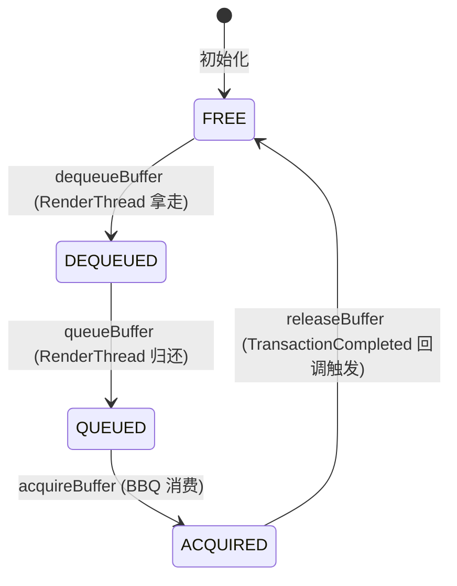
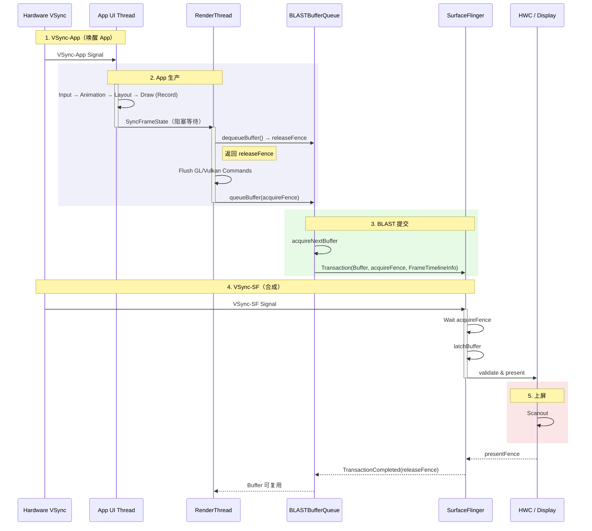

<!-- outline-start -->

**锚点（必须覆盖）：**
- [18.2.1 一帧的完整旅程](#一帧的完整旅程) — 从 VSync 到上屏的全链路
- [18.2.2 BLAST Buffer 生命周期](#blast-buffer-生命周期) — Buffer 状态机与 Triple Buffering
- [18.2.3 渲染时序图](#渲染时序图blast-sequence) — BLAST 模式下的跨进程交互
- [18.2.4 Trace 视角](#trace-视角) — Perfetto 中的关键 Slice
- [18.2.5 FrameTimeline 与 Jank 检测](#frametimeline-与-jank-检测) — Android 12+ 的帧判定机制

**扩展（可选深入）：**
- SyncFrameState 的阻塞语义
- Fence 在 App-SF 间的流转
- Thread Roles 与职责边界

<!-- outline-end -->

这是一条绝大多数 Android App 每一帧都在走的路：UI Thread 构建 DisplayList → RenderThread 翻译为 GPU 指令 → BLAST 提交 Transaction → SurfaceFlinger 合成上屏。理解这条链路的每一环，是做渲染性能优化的基本功。

## 一帧的完整旅程

### 第一阶段：UI Thread — 生产蓝图

`VSync-App` 信号到达时，主线程被 `Choreographer` 唤醒，开始构建这一帧的绘制蓝图。这个过程是纯 CPU 操作，不产生任何像素：

1. **Input**：处理触摸/按键事件。用户点击了按钮，View 状态改变（如 `setPressed(true)`），触发 `invalidate()` 请求重绘。
2. **Animation**：`ValueAnimator` 在这里计算当前帧的动画值（如按钮缩放比例从 1.0 到 1.1 的中间值）。
3. **Measure**：自顶向下递归，父 View 询问子 View "你需要多大"，子 View 计算后汇报。这是一次完整的视图树遍历。
4. **Layout**：根据测量结果，确定每个 View 的精确位置 `(x, y, width, height)`。
5. **Draw（记录）**：调用 `View.onDraw(Canvas)`，但这个 Canvas 是 `RecordingCanvas`——它不画像素，只记录绘制命令（画圆、画文字、画图片），存入 `DisplayList`（也称为 `RenderNode`）。

**产物**：一堆绘制指令列表（DisplayList）。这就是"蓝图"——它描述了"画什么"，但没有真正的像素数据。

### 第二阶段：Sync — 移交蓝图

UI 线程完成 Draw 后，会把这一帧封装成 `DrawFrameTask` 交给 RenderThread，然后主线程进入等待。真正执行 `syncFrameState()` 的线程是 RenderThread，它在 `DrawFrameTask::run()` 中把 DisplayList、Bitmap 引用、Path 数据和 Layer 更新同步到渲染上下文。

这个阶段仍然会表现为 UI 线程被阻塞，因为 `postAndWait()` 要等 RenderThread 至少完成这轮同步后才会返回。Perfetto 里通常能在 RenderThread 看到 `syncFrameState` slice，而 UI Thread 对应的是 `DrawFrame` 内的一段等待时间。`syncFrameState` 变长时，常见原因是 Bitmap 过大、脏区域过多或 Layer 更新量突然上升。

### 第三阶段：RenderThread — 真正的绘制

RenderThread 拿到蓝图后，开始将它翻译为 GPU 能理解的指令：

1. **dequeueBuffer**：向 BLASTBufferQueue 申请一个空白的 GraphicBuffer。如果三个槽位都被占用（Triple Buffering 满载），这里会阻塞等待。在 Trace 中这是排查 Buffer 瓶颈的关键锚点。
2. **Flush Commands（GPU Draw）**：遍历 DisplayList，将"画圆、画图片"翻译为 OpenGL 或 Vulkan 指令（`glDrawArrays` / `vkCmdDraw`）。这些指令被写入 GPU Command Buffer，**CPU 并不等待 GPU 执行完毕**。
3. **queueBuffer**：绘制指令提交完成后，将这个 Buffer 归还给 BLASTBufferQueue，附带一个 `acquireFence`（表示 GPU 何时画完）。

### 第四阶段：BLAST 提交与 SurfaceFlinger 合成

这是 BLAST 模型的核心变化点：

1. **acquireNextBuffer**：BBQ 在 App 进程内作为消费者，从队列中取出刚画好的 Buffer。
2. **Build Transaction**：创建 `SurfaceControl.Transaction`，把 Buffer、acquireFence 和窗口几何信息放进同一次提交。Android 12+ 还会在这里通过 `setFrameTimelineInfo()` 带上这一帧的 VSyncId。
3. **apply Transaction**：通过 Binder 将 Transaction 发送给 SurfaceFlinger。这个调用通常是**异步的**，RenderThread 不等 SF 完成处理就返回。
4. **VSync-SF 到达**：SurfaceFlinger 被唤醒，等待 acquireFence signal，执行 `latchBuffer`，将所有 App 的 Layer 按 Z-Order 叠加，交给 HWC 硬件合成，最终上屏。

## BLAST Buffer 生命周期

理解 BLAST 的关键在于理解 Buffer 在槽位池中的状态流转。BBQ 内部维护一个 Buffer 槽位池（通常 3 个槽位，对应 Triple Buffering）。

### Buffer 状态机



每一个 Buffer 在任意时刻处于以下状态之一：

| 状态 | 含义 | 占有者 |
|:---|:---|:---|
| **FREE** | 空闲，可被分配 | 无 |
| **DEQUEUED** | 被 RenderThread 拿走准备写 | RenderThread |
| **QUEUED** | 写完放回队列，等待消费 | BLASTBufferQueue |
| **ACQUIRED** | Buffer 已被 BBQ 取走，并已关联到待提交或已提交的 Transaction | App 进程内的 BBQ |

### Triple Buffering 的意义

为什么要三个槽位？考虑一个最坏情况：

```
时间 →
Slot 0:  [App Draw F0]  [SF Display F0]
Slot 1:       [App Draw F1]  [SF Display F1]
Slot 2:            [App Draw F2]  [SF Display F2]
```

双缓冲时，如果 App 画 F1 比 SF 消费 F0 快，App 必须等 SF 释放 Slot 0——这就是 `dequeueBuffer` 阻塞的原因。Triple Buffering 引入第三个 Slot，让 App 可以立即拿到空闲 Slot 开始画 F2，而不必等 SF。

**代价**：多了一个 Slot 的显存占用（一张 1080p RGBA Buffer 约 8MB），以及多一帧的显示延迟。但换来的 GPU 利用率提升和卡顿减少，在大多数场景下是值得的。

### Buffer 计数逻辑（槽位视角）

| 操作 | 触发者 | 槽位变化 | 关联 Fence |
|:---|:---|:---|:---|
| **dequeueBuffer** | RenderThread | FREE → DEQUEUED | 返回 releaseFence（前消费者释放信号） |
| **queueBuffer** | RenderThread | DEQUEUED → QUEUED | 传入 acquireFence（GPU 画完信号） |
| **acquireBuffer** | BBQ 内部 | QUEUED → ACQUIRED | — |
| **releaseBuffer** | BBQ（由 SF 的 TransactionCompleted 回调触发） | ACQUIRED → FREE | releaseFence |

`releaseBuffer` 这一行背后有一条跨进程回调链。BLAST 模式下，Consumer 驻留在 App 进程的 BBQ，而不是 SurfaceFlinger。SF 在 Transaction 完成后通过 `TransactionCompletedListener` 把 `ReleaseCallbackId` 和 `releaseFence` 回传给 App，BBQ 再调用 `releaseBufferCallbackLocked()` 与 `BLASTBufferItemConsumer::releaseBuffer()` 归还槽位。排查 `dequeueBuffer` 长等待时，这条释放链要一起看。

## 渲染时序图（BLAST Sequence）

这张图展示了 BLAST 模式下，App、RenderThread、BBQ、SurfaceFlinger 和 HWC 之间的完整交互。注意 Buffer 的提交变成了 Transaction 的一部分——这是 BLAST 区别于 Legacy BufferQueue 的核心变化。



### 关键时序特征

1. **App 与 SF 的解耦**：RenderThread 通过 `queueBuffer` 将 Buffer 提交给 BBQ 后，不等待 SF 处理。BBQ 在 App 进程内完成 `acquireNextBuffer` 并构造 Transaction，再通过异步 Binder 发给 SF。这使得 App 侧的帧生产不会被 SF 的合成节奏直接阻塞。
2. **Fence 同步**：CPU 不等 GPU。`acquireFence` 是 GPU 画完的信号，SF 在 `latchBuffer` 时等待这个 fence，而不是 CPU spin-wait。
3. **槽位循环**：Slot 0 画完进入 ACQUIRED 状态后，RenderThread 可以立即 dequeue Slot 1 开始画下一帧。
4. **释放回路**：Slot 真正回到 FREE，要等 SF 的 TransactionCompleted 回调把 `releaseFence` 带回 BBQ。`dequeueBuffer` 堵住时，问题也可能出在这条释放链的后段。

## Trace 视角

在 Perfetto 中分析标准链路时，以下 Slice 和信号是关键锚点。注意：具体名称可能因 Android 版本和 OEM 而异，但功能语义是稳定的。

### UI Thread 关键 Slice

| Slice | 含义 | 正常耗时 | 异常信号 |
|:---|:---|:---|:---|
| `Choreographer#doFrame` | 一帧的完整 UI 处理 | < 8ms | 超过 16ms → 必定掉帧 |
| `measure` / `layout` | 视图树的测量和布局 | < 2ms | 递归层级过深或布局复杂 |
| `draw` | DisplayList 记录 | < 4ms | onDraw 中有耗时操作 |
| `syncAndDrawFrame` / `DrawFrame` | 把任务投递给 RenderThread 后进入等待 | < 2ms | 这里变长时，继续看 RenderThread 的 `syncFrameState`、`dequeueBuffer` 和 GPU 提交 |

### RenderThread 关键 Slice

| Slice | 含义 | 正常耗时 | 异常信号 |
|:---|:---|:---|:---|
| `DrawFrame` | 一帧渲染任务的入口 | < 8ms | 内部若出现长 `syncFrameState` 或长 `dequeueBuffer`，说明瓶颈在状态同步或 Buffer 供给 |
| `syncFrameState` | 同步 RenderNode、Bitmap、Layer 状态 | < 2ms | Bitmap 过大、Layer 更新突增、脏区域扩大 |
| `dequeueBuffer` | 申请空闲 Buffer | < 1ms | 长等待 → Buffer 释放链或 SF 节奏跟不上 |
| `queueBuffer` | 提交画好的 Buffer | < 1ms | 异常少见 |

### SurfaceFlinger 关键 Slice

| Slice | 含义 | 异常信号 |
|:---|:---|:---|
| `setTransactionState` / `applyTransactionState` | 收到并应用 App 的 Transaction | 排队过多说明 Transaction 提交密度过高 |
| `commit` / `latchBuffer` | 锁定 Buffer 并推进本帧合成 | 等待 acquireFence 久 → GPU 还没画完 |

### 快速定位口诀

- **主线程长条 + RenderThread 短条** → UI 负担重（measure/layout/draw 慢）
- **主线程短条 + RenderThread 长条 + dequeueBuffer 长等待** → GPU 瓶颈或 Buffer 瓶颈
- **主线程短条 + RenderThread 短条 + FrameTimeline 标记 Jank** → SF 合成瓶颈或 HWC 问题

## FrameTimeline 与 Jank 检测

Android 12 引入了 FrameTimeline 机制，彻底改变了 Jank 的判定方式。在此之前，性能分析依赖简单的"VSync 周期"判断——如果一帧耗时超过 16.6ms 就算掉帧。但这种方式无法区分"故意降频"和"真正的卡顿"。

### 核心机制

1. **VSyncId**：每个 VSync 信号携带唯一 ID。`Choreographer` 收到 `VSyncId`（比如 1001）后，在 `doFrame` 开始时根据这个 ID 计算预期上屏时间（`ExpectedPresentTime`）。
2. **Propagation**：RenderThread 把 `VSyncId` 交给 BBQ，BBQ 在组装 `SurfaceControl.Transaction` 时调用 `setFrameTimelineInfo()`，再把这份信息跟着 Transaction 跨进程发给 SurfaceFlinger。
3. **Matching**：SF 以这份 FrameTimelineInfo 为索引，对照 Expected Present Time 和实际 present 结果判断这一帧是否超时。

### Perfetto 中的表现

在 Perfetto 的 FrameTimeline Track 中：

- **Expected Timeline（绿条）**：表示"这帧应该在什么时间点上屏"
- **Actual Timeline（实心条）**：表示"这帧实际在什么时间点上屏"
- **Jank Tag**：Actual 超过 Expected 时自动标记。分为 `Jank`（轻微）和 `BigJank`（严重）

这种基于 VSyncId 的判定方式比传统的 "16.6ms 阈值" 精确得多。一个 30fps 渲染的页面，每两帧才有一个 VSync，FrameTimeline 能正确识别这不是掉帧——而简单的周期判定会把它标记为 Jank。

---

> **交叉引用**：
> - BufferQueue 的内部机制（Producer/Consumer 双端、Buffer Slot 管理）详见 [2.1 BufferQueue 机制](13-buffer-queue.md)
> - SurfaceFlinger 的合成策略（GPU 合成 vs HWC 合成）详见 [2.5 SurfaceFlinger](06-surfaceflinger.md)
> - Fence 同步原理详见 [2.6 同步机制](16-sync-fence.md)
> - SurfaceControl 与 Transaction 的底层实现详见 [18.10 SurfaceControl API 深入](10-surface-control-api.md)
