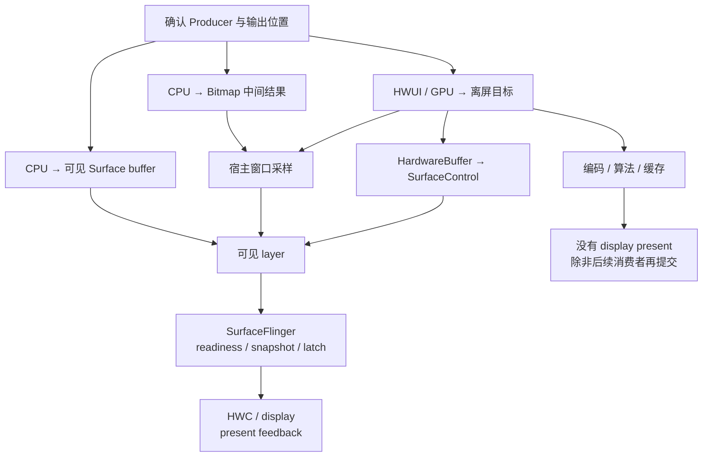
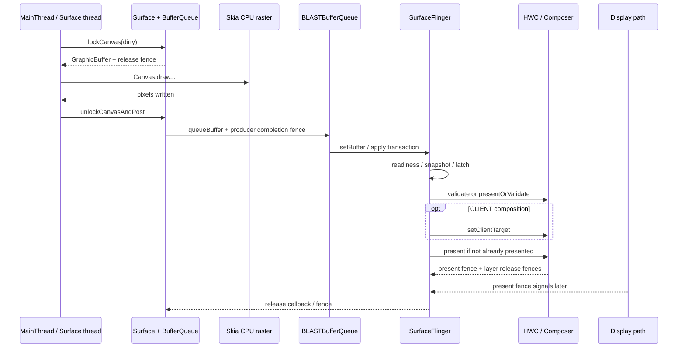

# 18.3 Android 17 软件与离屏渲染路径

软件渲染回答“谁生成像素”，离屏渲染回答“像素先写到哪里”。这是两个独立维度：CPU 可以直接写可见 `Surface`，GPU 也可以先画进离屏纹理或 `HardwareBuffer`（可在 CPU、GPU 和硬件模块之间共享的图形 buffer）。诊断时要依次确认 Producer、输出位置、Consumer 和最终可见 layer。

平台实现以 Android 17 / API 37 的 `android-17.0.0_r1` 为基线；涉及 dma-buf（共享 buffer 的内核机制）、dma-fence（内核同步对象）、sync_file（把 fence 暴露为文件描述符的接口）、调度与内存回收时，内核以 `android17-6.18-2026-06_r6` 为基线。

## 软件与离屏路径的分类

### 先按“生产方式 × 结果去向”分类

常见路径可以归纳成四组：

| 生产者 | 结果先写到 | 最终可见对象 | 典型入口 |
|---|---|---|---|
| CPU | 当前窗口或独立 `Surface` buffer | 对应 SurfaceFlinger layer | `ViewRootImpl.drawSoftware()`、`SurfaceHolder.lockCanvas()` |
| CPU | Bitmap 中间结果 | 宿主 App Window | `LAYER_TYPE_SOFTWARE`、显式 Bitmap Canvas |
| HWUI / GPU | GPU render target（渲染目标）或 `HardwareBuffer` | 取决于后续消费者 | 硬件 Canvas 的 `saveLayer()`、`RenderEffect`、`HardwareBufferRenderer` |
| App GPU | `HardwareBuffer` | 独立 `SurfaceControl` layer | EGL / Vulkan 生产后调用 `Transaction#setBuffer()` |

前两行属于 CPU 软件栅格化，也就是由 CPU 把绘制指令转换成像素。后两行属于 GPU 离屏渲染，并非软件渲染。中间结果若只交给编码器、算法或缓存，就不会自然出现 SurfaceFlinger latch、HWC present 和 display present fence。

下面的图用于确认中间结果的消费者以及它是否进入显示链。



纯离屏分支停在编码、算法或缓存消费者，不会自动产生 SF layer。通过宿主窗口采样时，显示证据属于宿主 App Window；通过 `Transaction#setBuffer()` 提交时，才继续跟踪目标 `SurfaceControl` layer 的 transaction、latch、composition、present 与 release。

### 整窗口软件绘制

应用或 Activity 关闭硬件加速时，普通 View 树由 `ViewRootImpl.drawSoftware()` 绘制。Android 17 的实现会锁住窗口 `Surface`，取得 software Canvas，调用 `mView.draw(canvas)`，再执行 `unlockCanvasAndPost()`。

这条路径通常仍由 `ViewRootImpl` traversal（测量、布局和绘制遍历）与 `Choreographer#doFrame()` 驱动，只是改由 CPU Canvas 生成窗口 buffer，没有使用 HWUI RenderThread 的 GPU 绘制。软件渲染仍可能受 VSync 调度；缺少 RenderThread slice 也不能单独证明当前使用软件路径。

### 业务线程直接写 `Surface`

`Surface.lockCanvas()`、`SurfaceHolder.lockCanvas()` 或 `lockHardwareCanvas()` 是显式 Surface 生产接口：

- `lockCanvas()` 返回 CPU Canvas；
- `lockHardwareCanvas()` 返回硬件加速 Canvas，不能归入 CPU 软件路径；
- `SurfaceHolder` 的生产循环可以放在业务线程中，节奏由应用决定，不一定跟随宿主窗口 `Choreographer`。

看到 lock/post（取得 Canvas 后提交）循环时，要同时确认线程、Surface/layer 和 Canvas 类型。它可能是软件 Producer，也可能是独立硬件 Canvas Producer。

### 单个 View 的 software layer

`View#setLayerType(LAYER_TYPE_SOFTWARE, paint)` 只改变该 View 子树。Android 17 的公开语义仍是“software layer 由 Bitmap 承载”，即先把子树画成一张 CPU Bitmap；`View.buildLayer()` 的 software 分支调用 `buildDrawingCache(true)`。宿主窗口若开启硬件加速，后续仍有 RenderThread、窗口 BufferQueue、BLAST transaction 和 SurfaceFlinger layer。

SurfaceFlinger 看不到独立的“software View layer”。这块 Bitmap 已经在应用侧与其他 View 内容合并到宿主窗口 buffer，SF 只能观察 App Window。

公开的 `buildDrawingCache()` 从 API 28 起已弃用。业务代码不应依赖它；源码出现内部 drawing-cache 分支，也不意味着所有设备都会提供名为 `uploadToTexture` 的固定 Perfetto slice。稳定证据是 CPU Bitmap 栅格化、缓存失效、宿主 HWUI 帧以及可能的纹理上传成本。

### 三种常被混淆的 layer

| 入口 | 软件 Canvas | 硬件 Canvas |
|---|---|---|
| `LAYER_TYPE_SOFTWARE` | Bitmap 软件层 | 子树先栅格化到 Bitmap，再由宿主硬件帧采样 |
| `LAYER_TYPE_HARDWARE` | 硬件加速关闭时按 software layer 行为处理 | HWUI/GPU 中间层 |
| `Canvas.saveLayer()` | 软件离屏像素存储 | GPU render target/FBO（Framebuffer Object，帧缓冲对象）类中间目标 |

`saveLayer()` 由 CPU 还是 GPU 执行，取决于当前 Canvas 类型，不能只看 API 名。`Canvas.isHardwareAccelerated()` 回答当前 Canvas 是否硬件加速；`View.isHardwareAccelerated()` 只说明 View 所在窗口是否开启硬件加速。硬件加速窗口中的 View 仍可能被画到 Bitmap software Canvas。

GPU 驱动错误、Surface 失效或资源不足有各自的恢复和错误处理，不能笼统写成“系统会自动把整个窗口降级为软件渲染”。如果 trace 显示软件路径，应回到窗口配置、Canvas 类型、`setLayerType()` 和调用栈确认入口。

## 完整执行流程

### 整窗口 `drawSoftware()` 主链

下面的调用关系用于定位 Android 17 中 CPU 直写窗口 Surface 的阶段：

```text
ViewRootImpl.drawSoftware(...)
  → Surface.lockCanvas(dirty)
    → android_view_Surface.nativeLockCanvas(...)
      → Surface::lock(...)
        → dequeueBuffer(...)
        → GraphicBuffer::lockAsync(..., fenceFd)
  → View.draw(canvas)
  → Surface.unlockCanvasAndPost(canvas)
    → Surface::unlockAndPost()
      → GraphicBuffer::unlockAsync(&fenceFd)
      → queueBuffer(buffer, fenceFd)
```

这条链不使用 App HWUI RenderThread 绘制窗口 buffer，但仍受 BufferQueue slot、release fence、内存映射和下游消费速度约束。CPU 栅格化只发生在 lock 成功到 unlock 之间，不能代表整条提交和显示路径。

### Lock：取得可写 buffer

`Surface::lock()` 会以 `NATIVE_WINDOW_API_CPU` 连接 Surface，通过 `dequeueBuffer()` 取得候选 `GraphicBuffer` 和 fence fd（承载同步 fence 的文件描述符），再调用 `GraphicBuffer::lockAsync()`。此时可能出现三类成本：

- 没有满足约束的 FREE slot，Producer 等待 Consumer 释放；
- slot 已返回，但 release fence 尚未允许 CPU 写入；
- buffer 首次映射、page fault（访问页尚未映射）或 reclaim（内存回收）使映射路径变慢。

`lockCanvas()` 除了可能执行 mmap（把 buffer 映射到进程地址空间），还要经过 dequeue、fence 等步骤，因此没有跨设备有效的固定正常耗时。16KB page size（内存页大小）可能改变页表和 fault 行为，但无法仅凭页大小推导某次 GraphicBuffer 映射必然更快；gralloc（图形 buffer 分配器）、buffer 复用、访问模式和内存压力都要纳入测量。

### Draw：CPU 生成像素

software Canvas 的 `drawPath()`、`drawText()`、`drawBitmap()` 等操作由 Skia CPU backend（CPU 绘制后端）栅格化，并写入锁定的像素内存。硬件 Canvas 会先录制宿主窗口 DisplayList，再由 RenderThread 提交 GPU draw；software Canvas 在当前线程直接生成像素。

CPU 栅格化成本由脏区面积、像素格式、混合、clip（裁剪区域）、路径复杂度、文字与图片采样共同决定。“每条命令逐像素串行执行”也过于绝对；Skia 和 vendor 库可以使用 SIMD（单条指令并行处理多个数据）、专用实现或内部任务，但不能据此假设 Android View software Canvas 会自动把一帧均匀分摊到多个 CPU。

### Unlock & Post：把 buffer 交给 Consumer

`Surface::unlockAndPost()` 调用 `GraphicBuffer::unlockAsync(&fd)`，再用该 fd 构造 fence 并 `queueBuffer()`。CPU 路径没有 HWUI GPU draw completion fence；不过 gralloc unlock 仍可能返回有效 fd，因此软件渲染也可能携带同步 fence。

下游把 Producer 完成信号作为 acquire 边界：Consumer 在读取 buffer 前必须遵守它。SurfaceFlinger/HWC 完成消费后，再通过 release fence 约束 Producer 何时可以复用旧 buffer。

下面的时序图以 Android 17 App Window 的 `drawSoftware()` 为主，把 CPU 生产、BLAST/SF transaction 和显示消费分开：



图中 `queueBuffer()` 返回不表示已经上屏；latch 也不表示 panel（物理显示面板）已完成扫描。CPU buffer 可能被 HWC 直接消费，也可能由 RenderEngine 采样进 client target（GPU 合成后的显示目标），取决于 format（像素格式）、dataspace（颜色空间与范围）、transform（变换）、crop（裁剪）、alpha（透明度）、保护属性、设备能力和本轮其他 layer。

自定义 Surface Producer 可能连接自己的 BufferQueue/layer，不一定经过图中同一个 App Window BLAST adapter（适配层）；它的生产线程和节奏也要单独确认。

### Dirty Rect 与 copyback

software Canvas 支持 dirty region（需要重画的区域），但分析不能停在“只重画脏区”。Android 17 的 `Surface::lock()` 会比较本轮 back buffer（待写入的后备 buffer）与上一块已提交的 `mPostedBuffer`：

- 尺寸和 format 兼容时，计算上一轮有效区域与本轮新脏区的差集，并通过 `copyBlt()` 执行 copyback，把需要保留的像素复制到当前 back buffer；
- 无法 copyback（从旧 buffer 补回复用区域）时，把新脏区扩成整个 bounds（buffer 边界），并清理 slot 的 dirty-region 状态；
- 随后用最终 dirty bounds 执行 `lockAsync()`。

因此，小脏区可能减少 CPU 重画，也可能增加旧 buffer 到新 buffer 的内存复制。resize（尺寸变化）、format 变化、Surface 重建、buffer discard（内容被丢弃）或大范围脏区会削弱收益。判断 Dirty Rect 是否有效，要同时测量 CPU draw 与 copyback 的内存流量。

### 单 View software layer 的链路

宿主窗口开启硬件加速时，单个 software layer 可以概括为：

`View 子树 → CPU Bitmap 栅格化/缓存 → 宿主 RenderNode/DisplayList 引用 → RenderThread/GPU 采样 → App Window buffer`

该路径同时存在 CPU 和 GPU 成本。只看到 RenderThread 不能排除 software layer；只看到 Bitmap draw 也不能说明整个窗口退出 HWUI。缓存没有失效时可以复用结果，频繁 invalidate、尺寸变化或大面积内容变化则会重复栅格化和上传。

### GPU 离屏与 `HardwareBuffer`

`HardwareBufferRenderer` 属于 GPU 离屏生产，不是整窗口 software Canvas。它把 RenderNode 输出到调用方持有的 `HardwareBuffer`，completion fence（完成同步信号）只证明像素生产结束，不代表结果已经送显；复用、清屏、所有权和后续提交的完整规则统一见 [18.17 HardwareBufferRenderer](17-hardware-buffer-renderer.md)。本节只用它说明“离屏”与“软件”是两个独立维度。

### `SurfaceControl.Transaction#setBuffer()` 直接提交

`Transaction#setBuffer()` 可以绕过该 layer 的常规 `dequeueBuffer()` / `queueBuffer()` 循环，但不会绕过 SurfaceFlinger。仍在生产的 buffer 要携带 production/acquire fence，连续复用还要等待 release callback；usage（buffer 的允许用途标志）只表示哪些消费者可以使用它，不保证 HWC 选择 DEVICE composition。完整提交与回收协议由 [18.10 SurfaceControl API](10-surface-control-api.md) 和 [18.17](17-hardware-buffer-renderer.md) 维护。

## 与硬件加速路径的核心差异

这里把“CPU 直写可见 Surface”和标准 HWUI App Window 对比；单 View software layer 是两者的混合。

| 维度 | CPU 直写可见 Surface | 标准 HWUI App Window |
|---|---|---|
| 窗口像素生产者 | App 线程上的 Skia CPU raster | HWUI RenderThread / GPU |
| 主线程职责 | 整窗口软件 draw 时直接生成像素 | 更新状态、measure/layout、录制 RenderNode/DisplayList |
| RenderThread | 窗口 buffer 生产不依赖 HWUI RenderThread | 执行 sync、draw 与 GPU submission |
| 主要 Producer 等待 | `dequeueBuffer()`、release fence、CPU buffer lock | UI↔RT sync、dequeue、GPU queue/fence |
| 提交后 | 仍经 BLAST/SF/HWC 显示 | 经 BLAST/SF/HWC 显示 |
| 部分更新 | dirty region 可能触发 copyback | RenderNode/display list 复用、damage（内容变化区域）与 GPU/HWC 策略 |
| 适合的证据 | App 线程 Running、lock/post、CPU memory traffic | `doFrame`、`syncAndDrawFrame`、`DrawFrame`、GPU、queue |

GPU 也有 setup（初始化）、同步和资源转换成本。极小、低频、一次性的 Bitmap 生成可能更适合 CPU；持续窗口动画、大面积混合、模糊和高分辨率重绘通常更适合硬件路径。结论要由目标设备的 CPU/GPU 时间、内存流量、功耗和 deadline（截止时间）数据支持。

### 三类 fence 不可互换

| fence | 保护的边界 | 典型等待方 |
|---|---|---|
| production / acquire fence | Producer 已写完，Consumer 可以读 | 宿主 GPU、SurfaceFlinger、编码器或算法模块 |
| display present fence | 本轮 display frame 到达显示 present 边界 | SurfaceFlinger 显示时间线 |
| layer release fence | Consumer 不再读取该 buffer，可以回池复用 | Producer / buffer pool |

纯离屏任务通常只有生产完成与消费者 release 边界。没有可见 layer，就没有该结果对应的 SF latch、HWC present 和 display present fence。

进入内核后，共享图形 buffer 通常由 dma-buf 表示，生产与消费依赖 dma-fence；sync_file 把 fence 暴露为 fd。上层 `SyncFence`、native fence fd 和内核 dma-fence 位于同一条同步路径的不同接口层，但它们各自保护的生命周期阶段仍要根据调用上下文判断。

## Trace 视角

固定“`lockCanvas < 1ms`、draw 占 80%、`doFrame < 16ms`”无法覆盖不同刷新率、分辨率、设备和业务。Perfetto 诊断应从四个问题开始：

1. 谁生产像素：MainThread、Surface thread、HWUI RenderThread、App GL/Vulkan thread，还是外部硬件？
2. 结果写到哪里：可见 Surface buffer、Bitmap、GPU render target 还是 `HardwareBuffer`？
3. 谁消费结果：宿主窗口、SurfaceFlinger、编码器、ImageReader、算法模块还是缓存？
4. 结果是否进入显示链：有没有目标 layer 的 transaction、latch、composition 与 present？

### 识别整窗口软件路径

较强的组合证据包括：

- 窗口配置关闭硬件加速，或调用栈进入 `ViewRootImpl.drawSoftware()`；
- MainThread traversal 内出现 `Surface.lockCanvas()`、`mView.draw()`、`unlockCanvasAndPost()`；
- 目标 App Window 仍有 buffer transaction / latch；
- 同一窗口帧没有对应 HWUI `DrawFrame` 和 GPU window draw。

“没有 `DrawFrame`”本身不够。trace 可能漏采、窗口可能没有重绘，主体也可能来自 SurfaceView、游戏引擎、Camera 或视频 Producer。

### 识别单 View software layer

这类路径应同时出现宿主 HWUI 帧和前置 CPU Bitmap 工作。可关注：

- software layer 的创建、缓存失效和 Bitmap 分配；
- App 线程 CPU raster、Bitmap upload 或 texture update；
- 宿主 `syncAndDrawFrame` / RenderThread `DrawFrame`；
- 最终 App Window 的 transaction、latch 和 present。

slice 名会随渲染后端、vendor（设备或芯片厂商）和 trace 配置变化。没有固定 `uploadToTexture` 字符串时，可用调用栈、buffer/texture id、线程和明确的相邻时序建立证据。

### 拆开 lock、draw 与 post

`lockCanvas()` 变长时先看线程状态：

- Sleeping/blocked 且落在 dequeue、futex（线程同步原语）或 fence wait：优先查 slot、release 和 Consumer 节奏；
- Running 且伴随 page fault、reclaim 或高内存流量：查映射、copyback 和内存压力；
- lock 成功后 `View.draw()` / Canvas draw 长时间 Running：再归因到 CPU 栅格化与业务绘制。

`unlockCanvasAndPost()` 变长也不能直接写成“CPU 画慢”。要检查 gralloc unlock、queueBuffer、Binder/transaction、队列是否因 Consumer 处理较慢而阻塞，以及线程调度。

### 离屏结果的证据链

`HardwareBufferRenderer` callback 变晚时，要区分 common RenderThread 排队、GPU 执行与 completion fence signal。`setBuffer()` 已 apply 但 layer 未更新时，再查 production fence、transaction readiness（事务是否满足处理条件）、desired present time（期望呈现时间）、layer 可见性和旧 buffer 是否被沿用。

纯离屏任务没有目标 SF layer 是正常现象。此时要寻找编码器、ImageReader、缓存或算法 Consumer，并用 buffer id、fence 和 request/callback 关联生产与消费。

### 连续帧量化

至少记录多帧的请求、拿到可写 buffer、生产完成、提交、latch、present 和 release 时间。用 buffer id、frame number、SurfaceFrame token 或 transaction id 关联同一份内容，才能区分：

- Producer 工作变慢；
- Consumer 间隔变长；
- buffer 池耗尽后迫使 Producer 等待；
- App 按时提交，但 SF/HWC/display 后段错过 deadline。

FrameTimeline 只覆盖进入相应可见 SurfaceFrame/DisplayFrame 的部分。Bitmap、纯离屏 GPU pass（一次离屏渲染过程）或编码输入不会因为生成完成而自动得到 FrameTimeline present 结论。

## 性能特征与适用场景

### 先估算像素存储

RGBA_8888 的红、绿、蓝、透明度通道各占 8 bit，因此每个像素占 4 byte，像素存储可以用下式估算：

`width × height × 4 × 同时存活的 buffer 数`

1440 × 3200 的单块 RGBA_8888 buffer 约为 17.6 MiB。若某个具体配置同时存活三块，像素存储约 52.7 MiB；“三块”只是示例，不能反推 BufferQueue 或 buffer pool 固定为三缓冲。

此外还可能有 dirty copyback、CPU 写入、纹理上传、GPU 采样、client target 和编码/算法 Consumer。单块 buffer 的字节数只能表示存储容量，不能代表一帧在各阶段读写产生的总内存流量。

### 常见成本

- 大面积 CPU raster：路径、模糊、复杂 clip、图片缩放和多层 alpha 会增加算术与访存；
- copyback：小脏区减少重画时，也可能产生旧 buffer 到新 buffer 的内存复制；
- software layer 失效：重复生成 Bitmap、CPU draw、上传，以及 GC/native allocation（Java 垃圾回收或原生内存分配）；
- GPU 离屏 pass：中间 render target 过大、渲染次数过多或 completion fence 较晚；
- buffer 池过深：内存占用和 in-flight（仍在处理链中）延迟一起增加；
- format/transform/alpha 不匹配：可能增加 RenderEngine CLIENT composition。

CPU 高占用不能直接推出 thermal throttling（温控降频）。若要写温控结论，应同时看到温度/thermal event、频率上限变化、调度状态和持续负载；单帧 CPU raster 只能证明该帧存在 CPU 绘制工作。

### 适用边界

可以合理使用 CPU software 或离屏路径的场景包括：

- 生成小尺寸、低频、一次性的 Bitmap 快照；
- 兼容性验证，需要比较 software 与 hardware Canvas 行为；
- 明确由 CPU 算法写入、随后交给非显示 Consumer 的 buffer；
- 简单、低刷新率的独立 Surface 绘制，且实测满足功耗和 deadline；
- 需要 `HardwareBufferRenderer`、EGL/Vulkan 离屏或 `setBuffer()` 直接提交的系统级处理路径。

不应仅为“解决一次硬件绘制问题”长期关闭整个窗口硬件加速，也不应把 `LAYER_TYPE_SOFTWARE` 当作通用性能开关。发现意外软件路径时，检查 Manifest/Activity 的 `hardwareAccelerated`、`setLayerType()`、实际 Canvas 类型和 Surface Producer 调用栈。

### Android 12—17 版本边界

| 平台 | 相关公开能力 | 诊断影响 |
|---|---|---|
| Android 12 / API 31 | CPU Surface、View software layer、HWUI 离屏路径已成熟；`RenderEffect` 公开 | BLAST/FrameTimeline 是现代显示分析背景，纯离屏结果仍没有显示时间线 |
| Android 13 / API 33 | `SurfaceControl.Transaction#setBuffer()`、`SyncFence` 与 Java release callback 公开 | 可用公开 Java API 表达 production fence 和 buffer 回收 |
| Android 14 / API 34 | `HardwareBufferRenderer` 公开 | `RenderNode → HardwareBuffer` 可通过 common HWUI render thread 完成 |
| Android 15 / API 35 | `setFrameTimeline()`、`setDesiredPresentTimeNanos()`、transaction listener 进入公开 API，并受 flag/API 条件约束 | 直接提交可以表达目标显示周期；事务反馈仍不等于 buffer release |
| Android 16 / API 36 | NDK `ASurfaceTransaction_setBufferWithRelease()` | Native producer 获得专门的 buffer release callback |
| Android 17 / API 37 | 源码基线；四条主路径延续，SF 使用当前 FrontEnd snapshot、CompositionEngine 与 AIDL（Android Interface Definition Language，接口定义语言）Composer 流程 | 方法名与 flag 按 `android-17.0.0_r1` 解读，不用旧 HWC2 教程替代当前完整路径 |

### Android 17 源码入口

平台源码统一固定到 `android-17.0.0_r1`：

- [`ViewRootImpl.java`](https://android.googlesource.com/platform/frameworks/base/+/android-17.0.0_r1/core/java/android/view/ViewRootImpl.java)：`drawSoftware()`、窗口 Surface lock/draw/post；
- [`Surface.java`](https://android.googlesource.com/platform/frameworks/base/+/android-17.0.0_r1/core/java/android/view/Surface.java) 与 [`android_view_Surface.cpp`](https://android.googlesource.com/platform/frameworks/base/+/android-17.0.0_r1/core/jni/android_view_Surface.cpp)：Java Canvas 到 native Surface；
- [`Surface.cpp`](https://android.googlesource.com/platform/frameworks/native/+/android-17.0.0_r1/libs/gui/Surface.cpp) 与 [`GraphicBuffer.cpp`](https://android.googlesource.com/platform/frameworks/native/+/android-17.0.0_r1/libs/ui/GraphicBuffer.cpp)：dequeue、copyback、`lockAsync()`、`unlockAsync()`、queue；
- [`View.java`](https://android.googlesource.com/platform/frameworks/base/+/android-17.0.0_r1/core/java/android/view/View.java) 与 [View layer 官方说明](https://developer.android.com/develop/ui/views/graphics/hardware-accel)：`LAYER_TYPE_SOFTWARE` 的 Bitmap 语义和 Canvas 判断；
- [`HardwareBufferRenderer.java`](https://android.googlesource.com/platform/frameworks/base/+/android-17.0.0_r1/graphics/java/android/graphics/HardwareBufferRenderer.java)：common render thread、completion fence、清屏和所有权边界；
- [`SurfaceControl.java`](https://android.googlesource.com/platform/frameworks/base/+/android-17.0.0_r1/core/java/android/view/SurfaceControl.java)：`setBuffer()`、usage、production fence、release callback 和 present-time API；
- [`include/android/surface_control.h`](https://android.googlesource.com/platform/frameworks/native/+/android-17.0.0_r1/include/android/surface_control.h)：NDK acquire fence 与 API 36 `ASurfaceTransaction_setBufferWithRelease()`；
- [`SurfaceFlinger.cpp`](https://android.googlesource.com/platform/frameworks/native/+/android-17.0.0_r1/services/surfaceflinger/SurfaceFlinger.cpp) 与 [`HWComposer.cpp`](https://android.googlesource.com/platform/frameworks/native/+/android-17.0.0_r1/services/surfaceflinger/DisplayHardware/HWComposer.cpp)：可见 layer 的 transaction、composition、present 和 release。

Kernel 固定到 `android17-6.18-2026-06_r6`：

- [`Documentation/driver-api/dma-buf.rst`](https://android.googlesource.com/kernel/common/+/refs/tags/android17-6.18-2026-06_r6/Documentation/driver-api/dma-buf.rst)：共享 buffer；
- [`Documentation/driver-api/sync_file.rst`](https://android.googlesource.com/kernel/common/+/refs/tags/android17-6.18-2026-06_r6/Documentation/driver-api/sync_file.rst) 与 [`drivers/dma-buf/sync_file.c`](https://android.googlesource.com/kernel/common/+/refs/tags/android17-6.18-2026-06_r6/drivers/dma-buf/sync_file.c)：dma-fence 到 fence fd；
- [`mm/`](https://android.googlesource.com/kernel/common/+/refs/tags/android17-6.18-2026-06_r6/mm/)：page fault、reclaim、Pressure Stall Information（PSI，压力停顿信息）等内存侧证据。实际 gralloc、GPU driver 和 dma-buf heap 行为仍需用目标设备补充证据。

交叉阅读：

- [18.2 Android View 标准管线](02-android-view-standard.md)
- [18.10 SurfaceControl API](10-surface-control-api.md)
- [18.17 HardwareBufferRenderer](17-hardware-buffer-renderer.md)
- [2.13 BufferQueue](../../part1-fundamentals/ch02-rendering/13-buffer-queue.md)
- [2.14 图形 API 演进](../../part1-fundamentals/ch02-rendering/14-graphics-api-evolution.md)

### 小结

CPU `lockCanvas()` 可以直接生成可见 Surface buffer；`LAYER_TYPE_SOFTWARE` 只把 View 子树栅格化成 Bitmap；硬件 Canvas、`HardwareBufferRenderer`、EGL/Vulkan 可以生成 GPU 离屏结果；`Transaction#setBuffer()` 能把 `HardwareBuffer` 接入独立 layer。

定位问题时，按 Producer、intermediate buffer（中间 buffer）、Consumer、visible layer（可见图层）的顺序收集证据，再分别对齐 production fence、display present fence 和 layer release fence。这样才能区分像素生成、buffer 等待、Consumer 处理与 SF/HWC/display 后段延迟。
