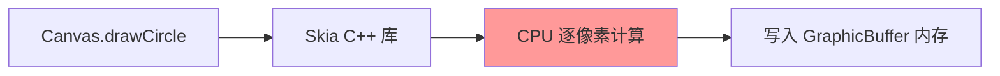
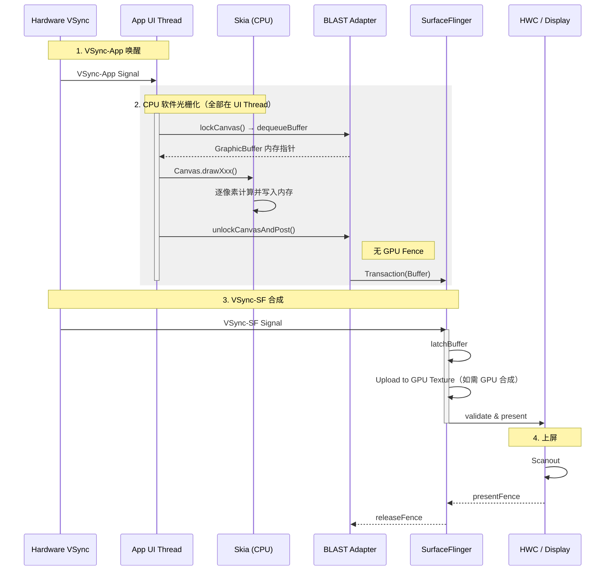

<!-- outline-start -->

**锚点（必须覆盖）：**
- [18.3.1 软件渲染的触发条件](#软件渲染的触发条件) — 什么时候会走这条链路
- [18.3.2 全链路执行流程](#全链路执行流程) — 从 lockCanvas 到 unlockCanvasAndPost
- [18.3.3 与硬件加速链路的核心差异](#与硬件加速链路的核心差异) — CPU vs GPU 的本质区别
- [18.3.4 Trace 视角](#trace-视角) — Perfetto 中的识别特征
- [18.3.5 性能特征与适用场景](#性能特征与适用场景) — 什么时候该用，什么时候不该用

**扩展（可选深入）：**
- Dirty Rect 局部刷新机制
- 软件渲染下 BLAST 的行为差异

<!-- outline-end -->

软件渲染是 Android 最古老的绘制方式，全程由 CPU 完成所有像素计算。在硬件加速成为默认选项的今天，它已不再是主流链路，但在特定场景下仍然会被触发，理解它的存在对 Trace 分析有重要价值——当你看到 UI Thread 长时间满载而 RenderThread 毫无活动时，大概率就是走入了这条链路。

## 软件渲染的触发条件

软件渲染在以下几种情况下会被激活：

1. **View 层级关闭硬件加速**：在 AndroidManifest 中对特定 Activity 设置 `android:hardwareAccelerated="false"`，或在代码中调用 `View.setLayerType(LAYER_TYPE_SOFTWARE, null)` [已验证: Android Developer 文档]。
2. **直接使用 `Surface.lockCanvas()`**：当你通过 `Surface.lockCanvas()` / `Surface.unlockCanvasAndPost()` 手动绘制时，走的是纯 CPU 路径。
3. **系统降级**：极少数情况下，GPU 驱动崩溃或设备不支持硬件加速时，系统会自动降级到软件渲染。
4. **小型 Overlay/Widget**：部分系统组件（如 Toast、部分 Notification）出于兼容性考虑使用软件渲染。

**判断方法**：在代码中通过 `View.isHardwareAccelerated()` 检查当前 Canvas 是否启用了硬件加速。返回 `false` 即走软件链路。

## 全链路执行流程

软件渲染的核心特征是**没有 RenderThread 参与**。所有操作都在 UI Thread 上完成，从锁定画布到像素填充到提交 Buffer，全流程串行。

### 第一阶段：Lock — 锁定画布

1. **`Surface.lockCanvas()`**：App 向系统请求一块可写的内存区域。底层调用 `dequeueBuffer` 获取一个 GraphicBuffer，然后通过 `mmap` 将其内存地址映射到 App 进程空间。
2. **返回 Canvas**：这个 Canvas 直接指向 GraphicBuffer 的像素内存。你在上面调用的每一个 `draw` 方法，都会**立即**写入像素数据。

在 Trace 中你会看到 `lockCanvas` slice，正常耗时很短（< 1ms），因为它只是内存映射操作。

### 第二阶段：Draw — CPU 光栅化

这是软件渲染最耗时的阶段。当你在 Canvas 上调用 `drawCircle()`、`drawText()`、`drawBitmap()` 时，底层是 Skia 库用 **CPU 指令**逐像素计算颜色值并写入内存。

关键点：这个过程中**每一条绘制指令都会立刻产生像素**。不存在"先记录再回放"的 DisplayList 机制——这是与硬件加速链路最本质的区别。

**CPU 密集的原因**：复杂图形操作（路径裁剪、高斯模糊、大图缩放、文字排版）都需要大量浮点运算和内存读写。一张 1080p 的 Bitmap 有 207 万个像素，每个像素 4 字节（RGBA），意味着单次全屏填充就要读写 8MB 数据。

### 第三阶段：Unlock & Post — 提交

1. **`unlockCanvasAndPost()`**：通知系统"这块内存我写好了"。底层执行 `queueBuffer`，将 GraphicBuffer 提交给 BLASTBufferQueue。
2. **Transaction 提交**：在现代 Android 上，软件渲染的 Buffer 提交同样走 BLAST Transaction 路径。BBQ 在 App 进程内构造 Transaction，通过 Binder 异步发送给 SurfaceFlinger。
3. **无 GPU Fence**：软件渲染没有 GPU 参与，因此不需要 acquireFence 等待。Buffer 的内容在 `unlockCanvasAndPost` 返回时已经是完整的。

### 时序图

## 与硬件加速链路的核心差异

理解软件渲染最好的方式是与标准硬件加速链路（[18.2](02-android-view-standard.md)）做对比：

| 维度 | 软件渲染 | 硬件加速渲染 |
|:---|:---|:---|
| **执行线程** | 全程 UI Thread | UI Thread + RenderThread |
| **绘制机制** | 立即产生像素 | 先记录 DisplayList，再翻译为 GPU 指令 |
| **光栅化** | CPU（Skia） | GPU（OpenGL / Vulkan） |
| **同步开销** | 无（串行） | SyncFrameState 阻塞 |
| **Buffer 提交** | unlockCanvasAndPost → BLAST | queueBuffer → BLAST |
| **Fence** | 无 acquireFence | 需要 acquireFence（GPU 完成信号） |
| **部分更新** | 支持 Dirty Rect | Android 12+ 逐步废弃 |
| **复杂图形** | 极慢（阴影、模糊、大图） | GPU 并行计算，快几个数量级 |

最核心的差异在于"谁在做光栅化"。GPU 天生适合并行计算——一张 1080p 的图片有 207 万个像素，GPU 可以同时在成百上千个核心上计算；CPU 只能串行处理，哪怕主频再高，像素数摆在那里。

另一个关键差异是**同步模型**。软件渲染没有 RenderThread，不需要 `SyncFrameState` 这个阻塞点。但这个"优势"毫无意义——因为它省下来的同步开销，被 CPU 光栅化的巨大耗时远远覆盖了。

## Trace 视角

软件渲染在 Perfetto 中的识别特征非常鲜明，几乎是"一眼可辨"：

### 识别特征

1. **UI Thread 长条**：整个帧处理（包括像素填充）都在 UI Thread 上，你会看到一个很长的 `doFrame` 条，且内部没有 `syncFrameState`。
2. **RenderThread 闲置**：几乎看不到 `DrawFrame`、`dequeueBuffer`、`queueBuffer` 等 RenderThread 的 slice。
3. **CPU 占用飙升**：UI Thread 的 CPU 使用率显著高于正常情况，可能接近 100%。
4. **lockCanvas / unlockCanvasAndPost**：这两个 slice 是软件渲染的标志性锚点。

### 关键 Slice

| Slice | 含义 | 关注点 |
|:---|:---|:---|
| `lockCanvas` | 锁定 GraphicBuffer | 正常 < 1ms |
| `draw` | CPU 光栅化 | 可能占总帧时间的 80%+ |
| `unlockCanvasAndPost` | 提交 Buffer | 正常 < 1ms |
| `doFrame` | 整帧处理 | 总时长，关注是否超过 16ms |

### 与卡顿的关联

软件渲染场景下的卡顿根因通常非常直接：**CPU 光栅化太慢**。没有什么复杂的同步问题、Buffer 瓶颈或 GPU 竞争——就是像素算不过来。解决方案也不是在软件渲染链路内优化，而是**切到硬件加速**。

## 性能特征与适用场景

### 性能瓶颈

1. **CPU 算力瓶颈**：复杂图形（阴影、模糊、Path 裁剪、大尺寸 Bitmap 缩放）在 CPU 上极慢。一个带高斯模糊的圆角矩形，在 GPU 上可能 < 0.1ms，在 CPU 上可能 > 10ms。
2. **内存带宽瓶颈**：1080p 屏幕的 GraphicBuffer 约 8MB。每次 `lockCanvas` / `unlockCanvasAndPost` 都涉及数据搬运。更高分辨率（2K/4K）下这个问题更严重。
3. **主线程阻塞**：所有绘制都在 UI Thread，直接挤压输入事件和动画的执行时间。

### 软件渲染唯一的优势：Dirty Rect

软件渲染支持"脏矩形"（Dirty Rect）优化——只重绘屏幕上发生变化的那一小块区域。如果只有一个按钮改变了颜色，软件渲染只处理那个按钮对应的矩形区域，而硬件加速通常需要重绘整个 Surface [已验证: Android Graphics 源码]。

但在实际开发中，这个优势已经被现代硬件加速的各种优化（硬件层缓存、RenderNode 复用等）所覆盖。Android 12+ 更是进一步弱化了 Dirty Rect 的作用。

### 什么时候会遇到软件渲染？

在日常开发中，你遇到软件渲染的场景主要有：

1. **排查问题时故意关闭硬件加速**：某些绘制 Bug 只在软件渲染下复现，开发时会临时关闭。
2. **第三方库或老代码**：部分使用 `Canvas` 直接绘制的老库可能没有适配硬件加速。
3. **系统组件**：Toast、部分 Overlay 窗口可能在软件渲染下运行。
4. **多进程共享 Surface**：某些 IPC 场景下通过 `Surface.lockCanvas()` 直接写入共享内存。

**建议**：除非有明确的需求（如需要 Dirty Rect、需要兼容特殊硬件），否则不要主动使用软件渲染。如果 Trace 中意外发现 App 走了软件渲染链路，第一件事是检查 `hardwareAccelerated` 配置和 `setLayerType` 调用。

---

> **交叉引用**：
> - 标准 BLAST 硬件加速链路详见 [18.2 Android View 标准链路](02-android-view-standard.md)
> - BufferQueue 机制详见 [2.1 BufferQueue](../../part1-foundation/ch02-graphics-foundation/)
> - Skia 渲染引擎的内部机制详见 [2.14 图形 API 演进](../../part1-foundation/ch02-graphics-foundation/)
