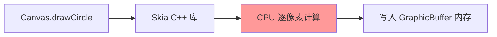
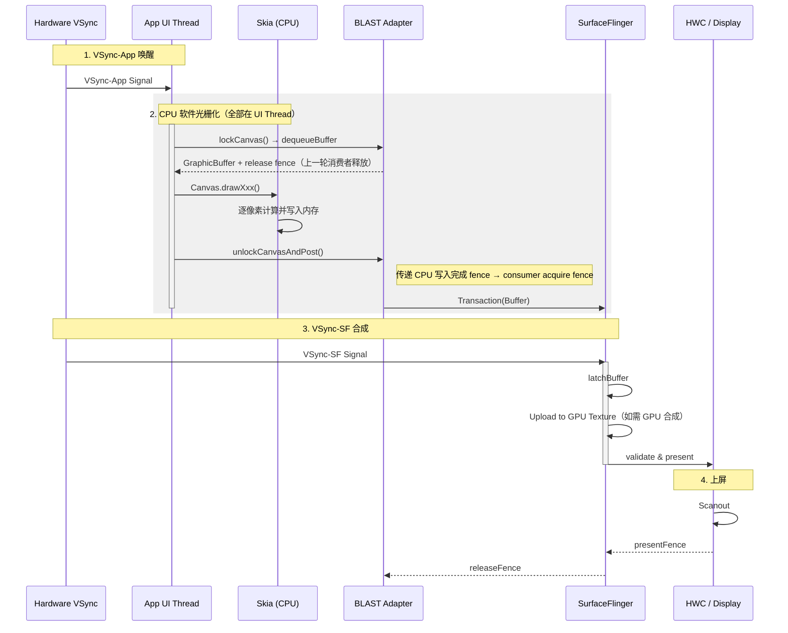

# 18.3 Android View 软件渲染路径

<!-- outline-start -->

**锚点（必须覆盖）：**
- [18.3.1 软件渲染的触发条件](#软件渲染的触发条件) — 什么时候会走这条路径
- [18.3.2 完整执行流程](#完整执行流程) — 从 lockCanvas 到 unlockCanvasAndPost
- [18.3.3 与硬件加速路径的核心差异](#与硬件加速路径的核心差异) — CPU vs GPU 的主要区别
- [18.3.4 Trace 视角](#trace-视角) — Perfetto 中的识别特征
- [18.3.5 性能特征与适用场景](#性能特征与适用场景) — 什么时候该用，什么时候不该用

**扩展（可选深入）：**
- Dirty Rect 局部刷新机制
- 软件渲染下 BLAST 的行为差异

<!-- outline-end -->

软件渲染是 Android 最古老的绘制方式，全程由 CPU 完成所有像素计算。在硬件加速成为默认选项的今天，它已不再是主流路径，但在特定场景下仍然会被触发。Trace 中如果出现 UI Thread 长时间满载、RenderThread 毫无活动，大概率就是走入了这条路径。但要注意：持续 CPU 栅格化的能效远低于 GPU 路径，长时间高负载运行会加速温控触发，导致 CPU 频率压制，拖累整机响应。除非有明确的兼容性需求，否则不应主动选择软件渲染。

## 软件渲染的触发条件

软件渲染在以下几种情况下会被激活：

1. **View 层级关闭硬件加速**：在 AndroidManifest 中对特定 Activity 设置 `android:hardwareAccelerated="false"`，或在代码中调用 `View.setLayerType(LAYER_TYPE_SOFTWARE, null)` [已验证: Android Developer 文档]。
2. **直接使用 `Surface.lockCanvas()`**：当代码通过 `Surface.lockCanvas()` / `Surface.unlockCanvasAndPost()` 手动绘制时，走的是纯 CPU 路径。
3. **系统降级**：极少数情况下，GPU 驱动崩溃或设备不支持硬件加速时，系统会自动降级到软件渲染。
4. **小型 Overlay/Widget**：部分系统组件（如 Toast、部分 Notification）出于兼容性考虑使用软件渲染。

**判断方法**：如果要判断当前这次 `draw()` 拿到的是不是硬件 Canvas，看 `Canvas.isHardwareAccelerated()`；`View.isHardwareAccelerated()` 只说明这个 View 所在窗口是否开启了硬件加速。官方文档写得很直接，挂在硬件加速窗口上的 View 仍可能被绘制到 software Canvas，例如绘制到 Bitmap 缓存时。[已验证: Android hardware acceleration 文档]

### 整窗口软件渲染 vs 单 View software layer

上一段的两类入口在 trace 上的表现完全不同，分析时要先认清楚是哪一类：

| 触发方式 | 范围 | RenderThread 在 trace 上的表现 |
|:---|:---|:---|
| `android:hardwareAccelerated="false"` 或 GPU 不可用 | 整个窗口走软件渲染 | **完全看不到 `DrawFrame`**——`ThreadedRenderer` 不会被初始化 |
| `View.setLayerType(LAYER_TYPE_SOFTWARE, null)` | 单个 View 子树走 software layer | `RenderThread` 仍在，`DrawFrame` 仍出现，但会额外伴随 Bitmap 分配 + `uploadToTexture` 纹理上传 slice |

`View.buildDrawingCache()` 在 API 28 已经弃用且基本 no-op，现代 `LAYER_TYPE_SOFTWARE` 走的是 RenderNode 软件 layer 路径，不要再用旧缓存语义解读相关 slice。

### LAYER_TYPE_SOFTWARE / LAYER_TYPE_HARDWARE / Canvas.saveLayer 的区别

这三类离屏机制经常被混在一起讨论，但底层完全不同：

| 机制 | 触发位置 | 离屏承载 | Trace 上的特征 slice |
|:---|:---|:---|:---|
| `LAYER_TYPE_SOFTWARE` | View 属性 | CPU 在离屏 `Bitmap` 上栅格化，再上传为 GPU 纹理 | Bitmap 分配 + `uploadToTexture` |
| `LAYER_TYPE_HARDWARE` | View 属性 | HWUI 直接在独立 GPU 离屏 buffer / FBO 上渲染子树，不经 CPU Bitmap | `eglCreateImage` / FBO 绑定 / `renderTargetBind` 等 GPU 侧 slice |
| `Canvas.saveLayer()`（硬件加速路径下） | Canvas API | GPU FBO（不是 Bitmap），用于复杂合成效果（带透明度的子树合成、非 SRC_OVER 的 blend mode 等） | 同 hardware layer 风格的 GPU slice |

看到一堆离屏相关 slice 集中出现时，先按这三类机制对号入座。如果某个 View 开了 software layer 又特别复杂，瓶颈往往就在 CPU 栅格化 + 纹理上传这一段。

[已验证: AOSP `frameworks/base/core/java/android/view/View.java` `setLayerType()` + `frameworks/base/libs/hwui/Layer.h` + Android Developers Canvas API]

## 完整执行流程

整窗口软件渲染或 `Surface.lockCanvas()` 的执行链没有 RenderThread 参与。所有操作都在 UI Thread 上完成，从锁定画布到像素填充再到提交 Buffer，全流程串行。

单 View 的 `LAYER_TYPE_SOFTWARE` 走另一条执行链：CPU 在离屏 Bitmap 上栅格化 → 纹理上传 → RenderThread 合成进 GPU 帧流。上一节“整窗口软件渲染 vs 单 View software layer”的表格已经把两类路径区分开，后文提到的 `lockCanvas`、`unlockCanvasAndPost` 和 BufferQueue 等待，指的是整窗口软件渲染或 `Surface.lockCanvas()` 路径。

### 第一阶段：Lock — 锁定画布

1. **`Surface.lockCanvas()`**：App 向系统请求一块可写的内存区域。底层先调用 `dequeueBuffer()` 取回一个可写的 `GraphicBuffer`，同时拿到 consumer 侧返回的 `fenceFd`；随后 `Surface::lock()` 再调用 `GraphicBuffer::lockAsync(..., fenceFd)`，等这块 buffer 可写之后才把地址映射给 App。软件渲染没有 GPU 指令提交，但这里仍然会受 BufferQueue 槽位和 fence 等待影响。[已验证: `Surface.cpp::lock()`]
2. **返回 Canvas**：这个 Canvas 直接指向 GraphicBuffer 的像素内存。Canvas 上调用的每一个 `draw` 方法，都会**立即**写入像素数据。

在 Trace 中会看到 `lockCanvas` slice，正常耗时很短（< 1ms），因为它只是内存映射操作。

16KB Page Size 设备上，`lockCanvas` 首帧映射的开销会进一步降低。从 4KB 切到 16KB 后，单个页覆盖的地址空间扩大到 4 倍，同等大小的 GraphicBuffer 所需页表条目减少约 75%，`mmap` 映射像素地址时产生的 Page Fault 数量相应减少。首次 `lockAsync()` 的耗时和 CPU 微小卡顿都有改善，分辨率较高的设备（2K/4K）体感更明显。[理论推导，尚缺 AOSP 实测数据对照]

### 第二阶段：Draw — CPU 光栅化

这是软件渲染最耗时的阶段。当代码在 Canvas 上调用 `drawCircle()`、`drawText()`、`drawBitmap()` 时，底层是 Skia 库用 **CPU 指令**逐像素计算颜色值并写入内存。

这个阶段的特征是：**每一条绘制指令都会立刻产生像素**。不存在"先记录再回放"的 DisplayList 机制——这是与硬件加速路径最主要的区别。

**CPU 密集的原因**：复杂图形操作（路径裁剪、高斯模糊、大图缩放、文字排版）都需要大量浮点运算和内存读写。一张 1080p 的 Bitmap 有 207 万个像素，每个像素 4 字节（RGBA），意味着单次全屏填充就要读写 8MB 数据。

### 第三阶段：Unlock & Post — 提交

1. **`unlockCanvasAndPost()`**：通知系统"这块内存我写好了"。底层先执行 `GraphicBuffer::unlockAsync()`，拿到一个表示 CPU 写入完成的 fd，再把它交给 `queueBuffer()`。[已验证: `Surface.cpp::unlockAndPost()`]
2. **提交路径要按版本看**：Android 9 仍是 Legacy BufferQueue 视角，`queueBuffer()` 把 buffer 交给传统 consumer 路径；Android 10-11 进入 BLAST / SurfaceControl 过渡期，设备上可能同时看到旧模型和新事务模型；Android 12+ 再把 BLASTBufferQueue + `SurfaceControl.Transaction` 当成主视角。
3. **没有 GPU 渲染 fence，不等于没有 fence**：软件渲染不会生成 GPU completion fence，但 `dequeueBuffer()` 取回 buffer 时仍要接收 consumer 侧的 **release fence**（消费者释放该 buffer 的信号），`unlockAsync()` 产出的 fd 经 `queueBuffer()` 传给下游消费者后，成为 consumer 侧的 **acquire fence**（消费者开始读取前需要等待的信号）。BufferQueue 槽位占满时，App 一样可能卡在 `dequeueBuffer()` 上。

### 时序图

下图以 Android 12+ 的 BLAST 视角为主。分析 Android 9 时，需要把 `BLASTBufferQueue` / `Transaction` 替换成 Legacy BufferQueue；Android 10-11 处在过渡期，两类观测点都可能出现。

## 与硬件加速路径的核心差异

理解软件渲染，可以与标准硬件加速路径（[18.2](02-android-view-standard.md)）做对比：

| 维度 | 软件渲染 | 硬件加速渲染 |
|:---|:---|:---|
| **执行线程** | 全程 UI Thread | UI Thread + RenderThread |
| **绘制机制** | 立即产生像素 | 先记录 DisplayList，再翻译为 GPU 指令 |
| **光栅化** | CPU（Skia） | GPU（OpenGL / Vulkan） |
| **同步开销** | 没有 RenderThread，同步点集中在 `dequeueBuffer()` / fence / BufferQueue 槽位 | `SyncFrameState` + GPU / BufferQueue 同步 |
| **Buffer 提交** | Android 9: `unlockCanvasAndPost()` → Legacy BufferQueue；Android 10-11: 过渡期；Android 12+: `unlockCanvasAndPost()` → BLAST | `queueBuffer()` → BLAST |
| **Fence** | 没有 GPU 渲染 fence，但仍有 acquire/release fence | GPU fence + BufferQueue fence |
| **部分更新** | 支持 Dirty Rect | Android 12+ 逐步废弃 |
| **复杂图形** | 极慢（阴影、模糊、大图） | GPU 并行计算，快几个数量级 |

两条路径的差异落在"谁在做光栅化"。GPU 天生适合并行计算——一张 1080p 的图片有 207 万个像素，GPU 可以同时在成百上千个核心上计算；CPU 只能串行处理，哪怕主频再高，像素数摆在那里。

同步模型也不同。软件渲染没有 RenderThread，因此看不到 `SyncFrameState`；等待点主要落在 `dequeueBuffer()`、`lockAsync()`、`queueBuffer()` 和 BufferQueue 槽位背压上。分析 Trace 时，不能因为没有 GPU slice 就把所有卡顿都归到 CPU 计算。先看 UI Thread 的 `draw` 段，再看 `lockCanvas` / `unlockCanvasAndPost` 前后有没有等待。

## Trace 视角

软件渲染在 Perfetto 中有几个稳定特征：

### 识别特征

1. **UI Thread 长条**：整个帧处理（包括像素填充）都在 UI Thread 上，会出现一个很长的 `doFrame` 条，且内部没有 `syncFrameState`。
2. **RenderThread 闲置**：几乎看不到 `DrawFrame`、`dequeueBuffer`、`queueBuffer` 等 RenderThread 的 slice。
3. **CPU 占用飙升**：UI Thread 的 CPU 使用率显著高于正常情况，可能接近 100%。
4. **lockCanvas / unlockCanvasAndPost**：这两个 slice 是软件渲染的标志性锚点。

### 关键 Slice

| Slice | 含义 | 关注点 |
|:---|:---|:---|
| `lockCanvas` | 锁定 GraphicBuffer | 正常 < 1ms |
| `draw` | CPU 光栅化 | 可能占总帧时间的 80%+ |
| `unlockCanvasAndPost` | 提交 Buffer | 正常 < 1ms |
| `doFrame` | 整帧处理 | 总时长，关注是否超过 16ms |

### 与卡顿的关联

软件渲染场景下，首要矛盾通常是 **CPU 光栅化太慢**，但不能把所有卡顿都归成"像素算不过来"。如果 `lockCanvas` 或 `unlockCanvasAndPost` 被拉长，还要继续检查 `dequeueBuffer()` 背压、BufferQueue 槽位是否被占满，以及 fence 返回是否滞后。定位完等待点之后，再决定是改绘制逻辑、减小脏区，还是切回硬件加速。

## 性能特征与适用场景

### 性能瓶颈

1. **CPU 算力瓶颈**：复杂图形（阴影、模糊、Path 裁剪、大尺寸 Bitmap 缩放）在 CPU 上极慢。一个带高斯模糊的圆角矩形，在 GPU 上可能 < 0.1ms，在 CPU 上可能 > 10ms。
2. **内存带宽瓶颈**：1080p 屏幕的 GraphicBuffer 约 8MB。每次 `lockCanvas` / `unlockCanvasAndPost` 都涉及数据搬运。更高分辨率（2K/4K）下这个问题更严重。
3. **主线程阻塞**：所有绘制都在 UI Thread，直接挤压输入事件和动画的执行时间。
4. **能效代价**：CPU 栅格化的每瓦性能远低于 GPU 路径，长时间运行会加速温控触发，导致更激进的频率压制。高负载 CPU 绘制不仅自身慢，频率压制后还会拖累整机的输入响应、动画流畅度和其他进程的调度。

Skia 内部长期提供 `SkTaskGroup` 用于并行任务分发（`external/skia/src/core/SkTaskGroup.cpp` 自 Android 9 起已存在），但 View software Canvas 路径是否默认走多线程 CPU 栅格化，取决于 HWUI 对 Skia 的集成配置。截至 Android 16，AOSP 中未找到 View software Canvas 默认启用并行栅格化的证据——软件渲染仍然以单线程 CPU 串行为主。即便未来启用多线程，也不改变"CPU 做像素计算"的本质；对于复杂的模糊、路径裁剪、大图缩放操作，GPU 的并行计算优势仍然是数量级差距。

**工程判断**：软件渲染在 2026 年的定位是能效劣势明显的应急路径，不是性能优化的可选项。如果 Trace 显示 App 持续走这条路径，应该视为一个需要修复的问题，而不是需要"优化"的路径。

### 软件渲染里的 Dirty Rect 为什么能成立

Dirty Rect 不是简单地"只画变化区域"。`Surface::lock()` 会先比较当前 back buffer 和上一帧 `mPostedBuffer` 的尺寸、格式；如果可以复用，就把本轮未失效但又不会重画的区域算成 `copyback`，再通过 `copyBlt()` 从上一帧拷回当前 buffer。App 只需要重画新的 dirty region，其余像素沿用上一帧的结果。[已验证: `Surface.cpp::lock()` / `copyBlt()`]

一旦前一帧 buffer 不可用、尺寸变化、像素格式变化，或者 buffer 被丢弃，`Surface::lock()` 就会把 dirty region 扩成整屏，直接回到 full redraw。resize、surface 重建、buffer discard 之后 Dirty Rect 收益会明显下降。

放到今天的系统里，Dirty Rect 仍然是 software Canvas 的一个能力，但它已经不是默认优化手段。现代硬件加速路径更常依赖 layer 缓存、RenderNode 复用和更稳定的 GPU 合成。

### 什么时候会遇到软件渲染？

日常开发中常遇到软件渲染的场景主要有：

1. **排查问题时故意关闭硬件加速**：某些绘制 Bug 只在软件渲染下复现，开发时会临时关闭。
2. **第三方库或老代码**：部分使用 `Canvas` 直接绘制的老库可能没有适配硬件加速。
3. **系统组件**：Toast、部分 Overlay 窗口可能在软件渲染下运行。
4. **多进程共享 Surface**：某些 IPC 场景下通过 `Surface.lockCanvas()` 直接写入共享内存。

**建议**：除非有明确的需求（如需要 Dirty Rect、需要兼容特殊硬件），否则不要主动使用软件渲染。如果 Trace 中意外发现 App 走了软件渲染路径，第一步是检查 `hardwareAccelerated` 配置和 `setLayerType` 调用。

---

> **交叉引用**：
> - 标准 BLAST 硬件加速路径详见 [18.2 Android View 标准路径](02-android-view-standard.md)
> - BufferQueue 机制详见 [2.13 BufferQueue](13-buffer-queue.md)
> - Skia 渲染引擎的内部机制详见 [2.14 图形 API 演进](14-graphics-api-evolution.md)
