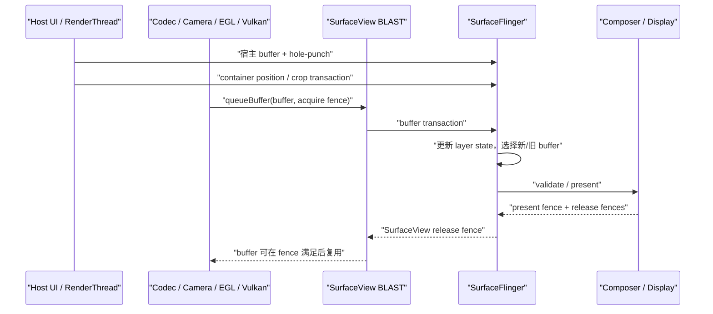
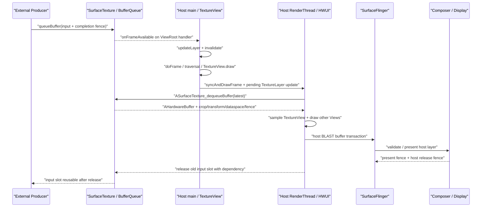

# SurfaceView 与 TextureView 渲染管线

SurfaceView 拥有独立 Surface 和 layer，TextureView 把外部纹理合入宿主 View。前者利于独立合成，后者便于 View 变换；代价分别落在窗口同步和宿主 GPU 合成。

## SurfaceView 的独立 Layer 与同步

### 为什么需要 SurfaceView

SurfaceView 让主体内容无须先画进宿主窗口的 buffer。这里的宿主窗口，是包含 SurfaceView 和其他普通 View 的 App Window；视频解码器、Camera 或 EGL/Vulkan 渲染线程等 Producer（内容生产方）可以向另一条独立的 buffer 队列提交内容。控制条、遮罩等普通 View 仍由宿主窗口的主线程与 RenderThread 生成。下面的简图用于区分两条内容生产线：

```text
宿主窗口：Choreographer → UI Thread → RenderThread → Host BufferQueue
主体内容：Codec / Camera / EGL / Vulkan Producer → SurfaceView BufferQueue
                                                    ↓
                                      SurfaceFlinger → HWC → Display
```

这张简图划分的是像素归属。SurfaceView 页面仍有主线程、RenderThread 和宿主窗口；“独立”表示主体像素拥有自己的 Surface、BufferQueue 和 SF layer。页面本身仍受 ViewRoot 管理，内容 Producer 也可能就在应用进程内。

这套结构带来三项直接收益：

- 主体内容可以采用与宿主 UI 不同的帧率。低帧率视频无须迫使宿主窗口按同样节奏重画，宿主窗口刷新时也不要求视频每轮都提供新 buffer。
- 主体内容不经过宿主 RenderThread 的纹理采样。对视频、相机等大面积内容，这可能减少 GPU 工作和内存带宽。
- SurfaceFlinger 能把主体作为独立 layer 交给 HWC（Hardware Composer，硬件合成器）评估。设备条件满足时可使用 DEVICE composition，由显示硬件直接参与合成；条件不满足时则可能进入 CLIENT composition，由 RenderEngine 先生成整屏合成所需的 client target。

这些收益都有适用边界。主线程卡住时，已有视频帧仍可能继续更新，但 SurfaceView 的布局、裁剪、透明洞、控制条和生命周期处理可能停在旧状态。独立 layer 只获得被 HWC 单独评估的机会，不保证一定使用 Overlay（硬件叠加层），也不保证功耗或时延一定更低。分析时要分别回答三个问题：内容是否继续生产、宿主几何是否更新、本轮采用何种合成方式。

SurfaceView 适合主体像素由独立 Producer 持续提供的场景，例如：

- MediaCodec 或 Codec2 的视频输出；
- Camera preview stream（相机预览流）；
- 游戏、地图或可视化引擎的 EGL/Vulkan 输出；
- 需要 secure/protected（防截取并受硬件保护）显示链路的内容；
- 通过 `SurfaceControlViewHost` 嵌入的远端 View 层级。

如果内容需要频繁参与普通 View 的旋转、复杂裁剪、着色器效果或父子透明度动画，TextureView 往往更容易实现。选型依据应是像素归属、变换需求和目标设备的合成能力，不能套用“视频用 SurfaceView、动画用 TextureView”这样的固定规则。

### 独立 Surface 与挖洞机制

#### Android 17 的对象结构

在 `android-17.0.0_r1` 中，`SurfaceView.createBlastSurfaceControls()` 维护的主要对象如下：

```text
ViewRootImpl bounds layer
  └─ mSurfaceControl：SurfaceView container
       ├─ mBlastSurfaceControl：BLAST buffer layer
       └─ mBackgroundControl：background color layer
```

这里要区分组织层和内容层。`mSurfaceControl` 是不携带像素的 container，负责 SurfaceView 子树的位置、变换、裁剪、相对层级和部分视觉状态；`mBlastSurfaceControl` 是承载 Producer buffer 的内容层；`mBackgroundControl` 是 container 下方的纯色背景层。Android 17 的 `updateBackgroundVisibility()` 只在 `mSubLayer < 0`（内容位于宿主下方）、内容层带 `OPAQUE`（不透明）标志且背景层未被禁用时显示它。`mBlastBufferQueue` 通过 `update()` 把内容层的尺寸、格式与生产端 `Surface` 关联起来。

Java `SurfaceView` 位于应用进程，但 buffer 填充者不一定也在该进程。应用内游戏线程可以直接使用 `Surface`，MediaCodec、Camera 或嵌入式层级也可能由系统服务和厂商组件参与生产。确认 Producer 身份时，应沿目标 BufferQueue 的 connect、dequeue、queue、fence 和 layer id 回溯，不能根据常见进程名猜测。

#### 默认 Z-below 与透明洞

SurfaceView 默认采用 Z-below，即内容层位于宿主窗口下方。如果宿主窗口仍在同一矩形内绘制不透明像素，下面的内容就会被遮住，因此 HWUI 需要在宿主 buffer 中留出透明区域，也就是 hole-punch（挖洞）。Android 17 的关键实现包括：

- `gatherTransparentRegion()` 把 SurfaceView 的可见矩形加入宿主窗口的透明区域；
- `draw()` 或 `dispatchDraw()` 在 `mDrawFinished && !isAboveParent()` 时调用 `clearSurfaceViewPort()`；
- `clearSurfaceViewPort()` 使用 `Canvas.punchHole()` 清理对应像素，并把圆角、clip bounds 与 alpha 纳入透明区域参数；
- `mDrawFinished` 为 `false` 时不会打洞；`surfaceRedrawNeededAsync` 要求的所有重绘回调结束后，该字段才会变为 `true`。

“挖洞”不会创建一个黑色 View，也不会把视频像素复制到宿主窗口。宿主 buffer 只在对应区域保留透明度，SurfaceFlinger 随后按 layer 层级合成宿主与 SurfaceView 内容。

`mDrawFinished` 只能证明 framework 认为 redraw callback 阶段已经结束，无法证明 Producer 已 queue 第一块 buffer，也无法证明 SurfaceFlinger 已经 latch（为本次合成选中）该 buffer 或 HWC 已 present。分析首帧时，仍要依次检查 Producer connection、第一笔 buffer transaction、acquire fence、layer 可见性和目标 Display 的 present。

Z-above 时，SurfaceView 位于宿主窗口之上，无须在宿主 buffer 中打洞；相应地，宿主窗口里的普通 View 也无法覆盖在它上面。Android 17 推荐用 `setCompositionOrder(int)` 表达层叠关系：负数位于宿主下方，非负数位于宿主上方；同级 SurfaceView 中数值更大的 peer 更高，相同值的顺序未定义。旧的 `setZOrderMediaOverlay()` 与 `setZOrderOnTop()` 已标记为 deprecated，阅读遗留代码时仍需理解其语义。

#### alpha、HDR、composition order 与 blur

Android 12 到 Android 17 的现代主线可按下表理解：

| 平台 | SurfaceView 相关变化 | 分析含义 |
|---|---|---|
| Android 12 / API 31 | container、BLAST child、background 与 RenderNode 位置同步成为稳定分析基线 | 几何 transaction 与内容 buffer 要按不同 layer 观察 |
| Android 13 / API 33 | 主体结构延续 | 设备差异仍要核对厂商 Composer、gralloc（图形内存分配器）与 Producer，不能预设 AOSP 拓扑已经换代 |
| Android 14 / API 34 | 支持任意 alpha；公开 `setSurfaceLifecycle()` | Z-below 的 alpha 调节透明洞的混合比例，Z-above 的 alpha 作用于 Surface 内容；生命周期可以跟随 visibility 或 attachment |
| Android 15 / API 35 | 增加 `setDesiredHdrHeadroom()` | 该值表达 SurfaceView 期望的 HDR 亮度余量，结果仍受面板、bit depth（位深）、环境和系统策略约束 |
| Android 16 / API 36 | 增加 `setCompositionOrder()` | 多个 SurfaceView 的相对关系可以用整数表达；相同 order 没有稳定顺序 |
| Android 17 / API 37 | 增加 `setBlurRegions()` | blur 坐标相对 SurfaceView bounds，尺寸变化后调用方需要更新；最终位置还受 scale、crop 与几何 transaction 影响 |

Z-below 的 alpha 不会改写内容 buffer 中的 alpha 通道，而会调节宿主透明洞与内容层之间的混合比例。多个位于宿主下方的 SurfaceView 相互重叠时，其结果也不同于普通 View 按父子顺序逐层混合。排查叠加异常时，要同时记录 composition order、宿主 hole-punch、内容层 alpha 与 HWC composition type（DEVICE 或 CLIENT 等合成类型）。

#### 生命周期是 Producer 的硬边界

Activity 可见、View 已 attach（接入 View 层级）和底层 `Surface` 有效，是三个不同状态。Producer 只能在 `surfaceCreated()` 到 `surfaceDestroyed()` 之间使用当前 Surface；`surfaceDestroyed()` 返回后，渲染线程不得继续访问它。如果 Producer 位于工作线程或远端服务，销毁回调必须等到旧连接停止使用 Surface，不能只异步发送一条 stop 消息就返回。

下面的代码用应用自有接口表达所有权边界，`FrameProducer` 不是 Android SDK 类型：

```kotlin
private interface FrameProducer {
    fun attach(surface: Surface)
    fun resize(width: Int, height: Int, format: Int)
    fun detachAndWaitUntilIdle()
}

surfaceView.holder.addCallback(object : SurfaceHolder.Callback {
    override fun surfaceCreated(holder: SurfaceHolder) {
        producer.attach(holder.surface)
    }

    override fun surfaceChanged(
        holder: SurfaceHolder,
        format: Int,
        width: Int,
        height: Int,
    ) {
        producer.resize(width, height, format)
    }

    override fun surfaceDestroyed(holder: SurfaceHolder) {
        producer.detachAndWaitUntilIdle()
    }
})
```

这段骨架强调 `detachAndWaitUntilIdle()` 必须同步等到旧 Surface 不再被使用。EGL/Vulkan 线程要停止对旧 native window 的 swap/present；MediaCodec 或 Camera 要撤销旧 output；具体停止 API 取决于 Producer。Android 14 的 attachment 生命周期策略允许 Surface 在 View 暂时不可见时继续存在，同时也会延长 buffer、连接和硬件资源的持有时间。

### 完整渲染路径

#### 从 Producer 到显示设备

一块 SurfaceView 内容 buffer 会依次经过以下阶段：

1. Producer 从目标 Surface 对应的 BufferQueue `dequeue`（取出）一块可写 buffer。
2. Codec、Camera、CPU、GLES 或 Vulkan 填充内容，并生成描述写入完成条件的 fence。
3. Producer 把 buffer `queue`（放回待消费队列），同时提交时间戳、crop、transform、dataspace（颜色空间等解释信息）和 HDR metadata。
4. BLAST consumer 取得描述该帧的 `BufferItem`，在 `BLASTBufferQueue::acquireNextBufferLocked()` 周围把 buffer、acquire fence、frame number 与 layer 状态写入 `SurfaceComposerClient::Transaction`。
5. SurfaceFlinger 接收 transaction，更新 FrontEnd 的 requested state（请求状态）、layer hierarchy 与 snapshot，再根据当前 latch 条件选用新 buffer 或继续使用旧 buffer。
6. CompositionEngine 为目标 Display 构造可见 layer 集合，HWC 对整屏合成方案执行 validate；CLIENT layer 由 RenderEngine 先合成到 client target，DEVICE layer 交由显示硬件处理。
7. HWC present 后返回 present fence 与每个 layer 的 release fence。release fence 沿 BLAST/BufferQueue 返回对应 Producer，决定该 buffer 何时可以安全复用。

下面的时序图把宿主几何和内容提交画在两条线上：



图中的三次提交无须在同一时刻发生。宿主 buffer、container 几何和主体 buffer 可以具有不同的 frame number 与更新节奏。分析问题时，要确认用户看到的那次 Display present 使用了哪一组状态。

#### 内容节奏不由单一时钟规定

MediaCodec 可以按媒体时间戳释放输出帧，Camera 受 sensor 与 HAL stream 节奏约束，游戏线程则可能由 `Choreographer`、`AChoreographer`、Swappy 或引擎时钟驱动。SurfaceView 不要求 Producer 经过宿主的 `ViewRootImpl#doTraversal()`；具体 Producer 是否跟随 VSync 或 Choreographer，要看它采用的 pacing（供帧节奏控制）机制。

宿主刷新率与内容帧率不同很常见。多个 DisplayFrame 使用同一块视频 buffer，不足以证明发生了丢帧；需要确认新内容是否在目标 present deadline 前可用、旧 buffer 是否符合媒体节奏，以及控制层与主体是否使用相容的几何状态。

#### 几何 transaction 与内容 transaction

Android 17 至少有三种常见对齐边界：

- `SurfaceViewPositionUpdateListener` 从记录 View 绘制属性的 RenderNode 取得宿主 frame number，再通过 `ViewRootImpl.mergeWithNextTransaction()`，把 container 的 position、matrix、crop 等状态与对应的宿主 buffer transaction 合并。
- UI 线程发起的部分状态更新通过 `ViewRootImpl.applyTransactionOnDraw()`，绑定到宿主窗口的下一次 draw。
- 公共 API `applyTransactionToFrame()` 通过 `mBlastBufferQueue.mergeWithNextTransaction()`，把 transaction 绑定到 SurfaceView 的下一块内容 buffer。

第三种方式有明确限制：连续渲染时，API 不保证 transaction 对应哪一帧；调用后没有新内容帧时，transaction 也可能一直无法应用。低帧率视频暂停期间，如果把窗口位置变化全部绑定到“下一块内容”，几何更新就可能长时间等待。位置和裁剪通常应跟随宿主帧；只有必须与某块主体 buffer 同时生效的 child transaction，才适合绑定到内容帧边界。

#### fence：fd、依赖与所有权

`queueBuffer()` 返回时，像素未必已经可读。Producer 可以随 buffer 提交一个尚未 signal（触发）的完成 fence；从 BLAST 或 SurfaceFlinger 的角度看，这就是 acquire fence。SurfaceFlinger 使用 buffer 前必须遵守该依赖。即使启用了允许 unsignaled latch 的受限优化，真正开始硬件读取前仍要满足 fence。

三类 fence 不应混用：

- acquire fence：说明上游 Producer 何时写完这块内容 buffer，消费者何时可以读取；
- per-layer release fence：说明 HWC 或合成路径何时用完某个 layer buffer，Producer 何时可以复用；
- present fence：标记一次 Display present 的同步完成边界，用于显示时序反馈，不能作为面板光学扫描完成时刻的测量值。

在内核基线 `android17-6.18-2026-06_r6` 中，`drivers/dma-buf/sync_file.c` 负责把 fence 暴露为 fd（文件描述符），`drivers/dma-buf/dma-fence.c` 提供 signal、callback 与 wait 等基础语义。这些文件只能说明同步机制，无法单独解释 GPU、codec、camera 或 DPU（Display Processing Unit，显示处理单元）中的哪项工作延迟了 signal。责任归属还要结合用户空间 Producer、厂商 HAL、驱动 timeline 与调度轨迹。

### BufferQueue 行为与 Triple Buffering

“Triple Buffering”标题沿用目录名称，但 Android 17 并不存在适用于所有 SurfaceView 场景的固定三槽模型。

`BufferQueueCore` 维护一组 slot，也就是记录 GraphicBuffer 所有权和状态的槽位。`mMaxDequeuedBufferCount`、`mMaxAcquiredBufferCount`、`mAsyncMode`、`mDequeueBufferCannotBlock` 与配置上限会共同决定当前队列可使用多少块 buffer。源码中的 `NUM_BUFFER_SLOTS` 只是 slot 表的最大容量，不代表每个 SurfaceView 都会同时分配或流转这么多 GraphicBuffer。某段 trace 中出现三块活跃 buffer，只能说明该连接在当时表现为三缓冲。

#### 状态与背压

通用状态流如下：

```text
FREE → DEQUEUED → QUEUED → ACQUIRED → FREE
          Producer          Consumer
```

这个状态图展示 buffer 所有权的变化：Producer 取出可写 buffer 后进入 DEQUEUED，提交后进入 QUEUED；Consumer 取得它时进入 ACQUIRED。buffer 从 ACQUIRED 回到可复用状态还受 release fence 约束，因此“Consumer 已执行 release”和“Producer 已能安全写入”可能发生在不同时间。

Producer 阻塞在 `dequeueBuffer()`，说明当前配置下没有可以立即返回的可写 slot，或者相关 release 条件尚未满足。常见原因包括：

- Consumer/HWC 仍在使用 buffer，release fence 迟到；
- GPU、codec 或 camera 的前序工作使队列周转变慢；
- Producer 生成速度长期高于 Display/Consumer 的消费能力；
- resize、格式变化或重新分配期间出现额外等待；
- queue 要求保留帧顺序，旧帧无法按异步策略丢弃。

一条较长的 `dequeueBuffer` slice 不足以证明“队列深度太小”。还要核对目标 layer 的 queued/acquired 状态、release fence、Consumer 消费节奏、Producer timestamp，以及当时是否正在分配 buffer。

#### 两套队列独立，但仍共享设备资源

宿主窗口与 SurfaceView 内容拥有各自的 Producer/Consumer 状态和 release fence 返回路径。宿主 `dequeueBuffer()` 发生等待，无法证明 SurfaceView 队列也被阻塞；SurfaceView Producer 遭遇背压，即生产速度受消费速度限制，也不要求宿主按钮停止刷新。

两条队列仍共享系统资源：CPU 调度、GPU、内存带宽、SurfaceFlinger、HWC plane/scaler、Display deadline 与功耗策略都可能相互影响。准确的边界是“队列所有权和背压状态相互独立”，但资源竞争与最终合成仍然相关。

增加可用 buffer 数量可能降低 Producer 阻塞概率，也可能增加内存占用和排队时延。实时交互更关注旧帧是否堆积，离线处理更关注 Producer 是否会被短暂抖动打断。调整 buffer count 或 async 行为前，要先确定业务优先保障吞吐、时延还是逐帧顺序。

### SurfaceView vs TextureView

两者都可以向应用提供供 Producer 使用的 `Surface`，主要差异在于谁消费这条内容流，以及主体像素最终落在哪个 buffer 中：

```text
SurfaceView:
Producer → SurfaceView BufferQueue → BLAST buffer transaction
         → SurfaceFlinger 独立 layer → HWC / Display

TextureView:
Producer → SurfaceTexture BufferQueue → App RenderThread 纹理采样
         → Host Window BufferQueue → SurfaceFlinger 宿主 layer → HWC / Display
```

TextureView 路径的附加工作，是宿主 RenderThread 对输入纹理采样，再把结果绘入宿主 buffer；这通常不是 CPU 逐像素拷贝。GPU 采样、颜色转换、混合和宿主 buffer 写出会增加工作量与带宽，具体代价取决于分辨率、变换、格式、刷新率和 GPU 实现。

| 维度 | SurfaceView | TextureView |
|---|---|---|
| 主体像素的最终位置 | 独立的 BLAST child layer | 通常进入宿主窗口 buffer |
| 宿主 RenderThread | 不采样主体内容；仍负责普通 View 和几何相关工作 | 消费 SurfaceTexture，并把它作为 TextureLayer 参与宿主绘制 |
| 帧节奏 | 内容可与宿主不同；SF 可复用旧内容 buffer | 新内容要经过宿主 draw 才能出现在新的宿主 buffer 中 |
| 变换与混合 | 受 SurfaceControl、composition order、crop 和 hole-punch 语义约束 | 作为 View/纹理参与父层变换、alpha、clip 和效果 |
| HWC 视角 | 主体 layer 可独立判断 DEVICE/CLIENT | HWC 通常只看到已包含主体像素的宿主窗口 layer |
| secure/protected 内容 | 可以建立独立的受保护显示链路 | 受宿主纹理采样和保护能力限制，不能假定两者等价 |
| trace 重点 | host、container、BLAST child、两套 buffer 与 fence | Producer queue、SurfaceTexture 更新、RenderThread 和 host buffer |

选型可以按下面的顺序判断：

1. 主体是否必须成为独立 secure layer，或者是否希望 HWC 单独评估大面积视频/相机内容？优先评估 SurfaceView。
2. 是否需要普通 View 语义下的连续旋转、复杂裁剪、shader 效果或父子透明度？评估 TextureView。
3. 主体更新能否接受等待宿主 RenderThread？不能接受时，SurfaceView 的独立内容流更合适。
4. 页面是否大量依赖普通 View 覆盖内容？SurfaceView 的 Z-below 允许宿主 View 覆盖，但要验证 hole-punch、alpha 与设备合成代价；Z-above 会让宿主 View 无法盖在内容上方。
5. 是否已有目标设备 trace 和功耗数据？没有数据时，不应预设“SurfaceView 一定省电”或“TextureView 一定卡”。

### HWC Overlay 与合成策略

SurfaceView 提供独立 layer，因此 HWC 可以单独评估其 buffer；这只代表该 layer 有机会使用硬件 Overlay plane，并非必然结果。HWC 的 validate 面向整屏可见 layer 集合，判断会受以下条件共同影响：

- buffer format、内存布局 modifier、用途标志 usage、颜色解释 dataspace 与 HDR metadata；
- source crop（源裁剪区域）、destination frame（屏幕目标区域）、缩放、旋转、alpha 与 blending；
- secure/protected 要求和外接显示保护状态；
- 同屏其他 layer 对 plane、scaler、bandwidth 和颜色处理单元的占用；
- Display mode、刷新率、面板能力与厂商 Composer 限制。

YUV 内容经常适合硬件视频 plane，但格式本身不能证明 HWC 最终选择了 DEVICE composition。SurfaceView 上方存在控制条，也不会自动导致 CLIENT composition：有些硬件可以叠加多个 plane，某些变换或混合条件则会让部分 layer 进入 client target。Overlay plane 的数量和能力属于设备实现细节，不能固定写成“三到四个”。

普通 layer 无法使用 DEVICE composition 时，SurfaceFlinger 可以让 RenderEngine 先把 CLIENT layers 合成到 client target，再交给 HWC。protected buffer 不能像普通 RGBA 内容一样无条件改走非保护 GPU 路径；设备无法建立合规保护链路时，可能黑屏、拒绝显示或播放失败。

Android 17 的 SF 侧入口集中在 `HWComposer::getDeviceCompositionChanges()` 周围的 `presentOrValidate()`、`validate()` 和 `present()`；ComposerHal 对应 `presentOrValidateDisplay()`、`validateDisplay()` 和 `presentDisplay()`。`presentOrValidate()` 可能直接进入 present，也可能只返回 validated 结果。函数返回或 present fence 创建，只说明显示栈越过了相应的软件/硬件同步边界，无法证明面板已经完成物理扫描。

#### 怎样验证 composition type

一次 `dumpsys SurfaceFlinger` 只能给出采样时刻的状态，适合快速确认 layer 树和 composition type；分析动画或瞬时回退时，应使用 layer trace/HWC 轨迹。下面的命令先保存完整输出，避免用硬编码 layer 名的 `grep` 漏掉 BLAST child：

```bash
adb shell dumpsys SurfaceFlinger > /data/local/tmp/sf.txt
adb pull /data/local/tmp/sf.txt
```

在输出中应先根据 parent-child 关系、buffer 尺寸、dataspace 和 layer id 确认目标 `mBlastSurfaceControl`，再读取 DEVICE、CLIENT 或 SOLID_COLOR 等类型。如果 composition type 发生变化，要比较同一 DisplayFrame 的整屏 layer 条件，不能只比较 SurfaceView 自身属性。

### Trace 视角

#### 采集前提与支持边界

建议同时采集应用 `gfx/view` 事件、线程调度、SurfaceFlinger transactions/layers、FrameTimeline、sync/fence，以及与场景对应的 GPU、codec、camera、Binder 或厂商数据源。Perfetto 官方文档说明 FrameTimeline 尚未完整覆盖 SurfaceView，因此缺少主体内容独立的 App FrameTimeline slice，无法证明 Producer 没有提交新帧。

主体内容的时间线要通过 layer trace、目标 BufferQueue/BLAST、Producer queue、acquire fence、SurfaceFlinger 状态和 Display present 共同复原。宿主窗口和 SurfaceFlinger 的 FrameTimeline 仍可用来定位宿主帧与最终显示帧。

#### 建立 layer 身份表

trace 分析应先记录对象身份：

| 对象 | 建议记录 | 用途 |
|---|---|---|
| Host App Window | layer id、name、buffer layer、parent | 对齐普通 View、hole-punch 与宿主 buffer |
| SurfaceView container | layer id、parent、relative-Z（相对层级）、position、crop | 对齐布局和几何 transaction |
| SurfaceView BLAST child | layer id、parent、buffer size、dataspace、composition type | 对齐主体 buffer 与 Producer |
| background/embedded child | layer id、parent、visible region | 避免把辅助层误认为主体 |

Android 17 的 layer 名可能包含 Java tag、`(BLAST)`、SurfaceFlinger 分配的序号或 transaction 前缀；不同 trace 配置下，slice 名也可能变化。识别对象时应依赖 parent-child 关系、buffer 属性、Producer connection、frame number 和 transaction id，不能把某个固定字符串当作稳定 API。

#### 分开观察宿主组和内容组

宿主组关注：

- `Choreographer#doFrame`、Input/Animation/Traversal；
- `syncAndDrawFrame`、RenderThread 与宿主 GPU work；
- 宿主窗口的 buffer transaction；
- SurfaceView position/crop transaction；
- 包含 hole-punch 的宿主 buffer。

内容组关注：

- Codec、Camera、EGL/Vulkan 或其他 Producer 的工作；
- 目标 Surface 的 connect、dequeue 与 queue；
- BLAST child 的 buffer transaction；
- buffer frame number、timestamp、dataspace、crop、transform；
- acquire fence 与对应 layer 的 release fence。

不能按相同的帧号配对宿主与视频内容，因为视频、相机和宿主刷新可能处于不同节奏。分析一次异常显示帧时，至少要确认：宿主使用哪块 buffer、container 使用哪组几何、主体使用哪块 buffer、对应 acquire fence 何时 ready，以及 HWC 选择了哪种 composition type。

#### 常见证据模式

| 现象 | 需要对照的证据 | 容易误判的点 |
|---|---|---|
| 控制条卡，视频继续更新 | main/RenderThread、宿主 BufferTX、SV BufferTX | 视频流畅不代表布局与 hole-punch 也在更新 |
| 视频卡，按钮流畅 | Producer queue、SV acquire fence、BLAST child buffer | 主线程空闲无法排除 codec、camera、GPU、SF 或 HWC 问题 |
| resize 时错位 | Traversal bounds、PositionUpdateListener frame、宿主透明洞、container transaction、内容 buffer | Android 7 以前的异步窗口模型不能解释所有现代错位 |
| Producer 长时间 dequeue | 目标队列状态、release fence、HWC/Consumer 节奏 | 较长的 slice 无法证明固定三槽数量不够 |
| 功耗升高 | 每层的 DEVICE/CLIENT、RenderEngine、client target 面积和 Display mode | composition type 变化是结果，还要查明触发条件 |
| 首帧黑屏 | SurfaceHolder callbacks、Producer connect、first queue/fence、layer show、background | `surfaceCreated()` 只代表 Surface 有效，不代表已有可显示 buffer |

#### fence wait 的读法

遇到 `sync_wait` 或 fence timeline 时，应依次确认：

1. 等待者属于哪个线程和 layer；
2. fence 是内容 acquire、client target acquire、per-layer release，还是 Display present；
3. fence 创建者来自 GPU、codec、camera、RenderEngine，还是显示设备；
4. signal 时刻是否越过目标 present deadline；
5. 同期 CPU 线程处于 running（正在运行）、runnable（可运行但在等 CPU）还是 blocked（等待依赖）状态。

“线程在等 fence”只能说明它依赖上游工作完成，无法直接确定责任模块。内容 acquire fence 迟到，说明 Producer 或其上游工作没有及时完成；HWC release fence 迟到，则会延后 Producer 复用旧 buffer。两者都可能让画面或 Producer 变慢，但排查方向不同。

### 常见性能问题与优化

#### 主线程卡住，内容仍动

这种现象说明主体内容没有依赖本轮宿主 draw，但 SurfaceView 页面仍可能存在问题。应检查宿主控制层是否停止更新、container 是否还在使用旧几何、hole-punch 是否匹配当前位置。此时通常要优化主线程工作、宿主 RenderThread 或布局更新，视频仍在播放不能掩盖交互卡顿。

#### Producer 阻塞或主体掉帧

先确认阻塞发生在目标 SurfaceView 队列，排除宿主窗口队列。随后对齐 `dequeueBuffer()`、queue timestamp、acquire/release fence、BLAST child 是否采用新 buffer，以及 HWC present 周期。降低 Producer 帧率、减少 GPU/codec 工作或调整队列行为都可能有效，但选择应由证据决定；盲目增加 buffer 数量，可能用更高的显示时延换取较少的阻塞。

#### resize、滚动和转场错位

把以下三个对象放到同一时间轴上：

1. 宿主 buffer 中透明洞的新位置；
2. container 的 position/matrix/crop transaction；
3. BLAST child 的新 buffer 和 destination frame。

BLAST 提供 transaction 同步能力，但无法保证 Producer 按时给出新尺寸内容，也不会让所有状态自动绑定到同一帧。频繁 resize 时，应减少没有实际作用的尺寸往返，明确 Producer 切换 buffer size 的时刻，并用宿主 frame number 验证几何 transaction 与哪一帧合并。

#### 首帧延迟和生命周期竞态

Android 12—17 的 SurfaceView 首帧会经过以下边界：

```text
ViewRoot/bounds layer 就绪
→ SurfaceControl 与 BLASTBufferQueue 创建
→ SurfaceHolder callback
→ Producer connect
→ 第一块 buffer queue 与 acquire fence ready
→ layer 可见并进入一次 display present
```

这条路径用于定位首帧耗时。应分别测量每个边界，避免把整段时间都归给 `surfaceCreated()` 或 SurfaceFlinger。`surfaceDestroyed()` 后仍向旧 Surface 提交、重建后复用旧 EGLSurface/ANativeWindow，或者只在 `onResume()` 启动 Producer，都可能造成生命周期竞态：回调顺序与异步生产线程的实际状态不一致。

#### Z-order、alpha、圆角与 blur 异常

先记录 composition order 的正负和值，再判断 alpha 作用于内容层还是 hole-punch。圆角和 clip 同时涉及宿主透明洞与 container crop；API 37 的 blur region 还要随 SurfaceView bounds 更新。`setZOrderOnTop(true)` 会让宿主普通 View 无法覆盖内容，因此不能作为通用性能修复。

#### DEVICE 变成 CLIENT

对比变化前后的整屏 layer 集合、buffer format/dataspace、alpha、crop、scale、rotation、HDR、secure flag、Display mode 和厂商 HWC 日志。弹幕、圆角或 YUV 等单一条件都不能直接证明原因。业务允许时，可以尝试减小 client target 面积、降低混合复杂度或调整层级结构；是否值得采用，要根据目标设备的 GPU、带宽、功耗和视觉要求验证。

#### protected 内容黑屏

检查 secure/protected usage、目标 Display 的保护能力、HDCP（数字内容保护协议）/外接屏状态、HWC composition 和厂商错误。此类问题无法通过普通的非保护 CLIENT composition 规避。如果同一内容在内屏正常、外接屏黑屏，应优先排查显示设备的内容保护能力与系统策略。

#### 输入延迟

SurfaceView 改变的是内容生产和合成拓扑，不会绕过 InputDispatcher 到应用窗口的输入路径。端到端输入时延应分为：

- InputDispatcher 到应用主线程；
- 主线程把输入状态交给内容 Producer；
- Producer 生成并 queue 下一块受影响的 buffer；
- acquire fence 满足、SF latch、HWC present，直至画面可见。

游戏或地图的 Producer 可能受 frame pacing 约束；视频和 Camera 的内容节奏通常不会因一次触摸而改变。只看 `doFrame` 或 `queueBuffer` 的一段耗时，无法代表完整的输入到显示时延。

#### 复核清单

每次分析至少回答这些问题：

1. 主体像素是否位于独立 BLAST child，而非宿主 buffer？
2. Producer 是谁，在哪个线程或服务填充 buffer？
3. 当前 Surface 的有效期由哪套 callback 与 lifecycle strategy 控制？
4. 宿主 hole-punch 在哪里形成，何时随 draw 更新？
5. container 的 parent、position、crop 与 composition order 是什么？
6. 几何跟宿主 frame 对齐，还是绑定到下一块内容 buffer？
7. acquire、release 与 present fence 分别属于哪个对象？
8. SurfaceFlinger 本轮采用新 buffer 还是复用旧 buffer？
9. HWC 把主体判为 DEVICE 还是 CLIENT，前后条件有何变化？
10. 用户看到的异常对应哪次 display present？

这些问题都有源码或 trace 证据后，才能把“SurfaceView 卡了一帧”定位到 Producer、宿主、BLAST/SF、HWC 或显示设备中的具体边界。

#### Android 17 源码锚点

源码以平台版本 `android-17.0.0_r1` 和内核版本 `android17-6.18-2026-06_r6` 为准：

- [`SurfaceView.java`](https://android.googlesource.com/platform/frameworks/base/+/refs/tags/android-17.0.0_r1/core/java/android/view/SurfaceView.java)：hole-punch、container/BLAST/background 创建、生命周期、位置回调、composition order、blur 和 transaction 对齐；
- [`BLASTBufferQueue.cpp`](https://android.googlesource.com/platform/frameworks/native/+/refs/tags/android-17.0.0_r1/libs/gui/BLASTBufferQueue.cpp)：buffer acquire、buffer transaction、`mergeWithNextTransaction()` 与 release callback；
- [`BufferQueueCore.cpp`](https://android.googlesource.com/platform/frameworks/native/+/refs/tags/android-17.0.0_r1/libs/gui/BufferQueueCore.cpp)、[`BufferQueueProducer.cpp`](https://android.googlesource.com/platform/frameworks/native/+/refs/tags/android-17.0.0_r1/libs/gui/BufferQueueProducer.cpp)：队列容量计算、dequeue 与背压；
- [`SurfaceFlinger.cpp`](https://android.googlesource.com/platform/frameworks/native/+/refs/tags/android-17.0.0_r1/services/surfaceflinger/SurfaceFlinger.cpp) 与 [`FrontEnd`](https://android.googlesource.com/platform/frameworks/native/+/refs/tags/android-17.0.0_r1/services/surfaceflinger/FrontEnd/)：transaction、layer state、snapshot 与 hierarchy；
- [`HWComposer.cpp`](https://android.googlesource.com/platform/frameworks/native/+/refs/tags/android-17.0.0_r1/services/surfaceflinger/DisplayHardware/HWComposer.cpp)、[`HWC2.cpp`](https://android.googlesource.com/platform/frameworks/native/+/refs/tags/android-17.0.0_r1/services/surfaceflinger/DisplayHardware/HWC2.cpp)：validate、present、composition type 与 fences；
- [`sync_file.c`](https://android.googlesource.com/kernel/common/+/refs/tags/android17-6.18-2026-06_r6/drivers/dma-buf/sync_file.c)、[`dma-fence.c`](https://android.googlesource.com/kernel/common/+/refs/tags/android17-6.18-2026-06_r6/drivers/dma-buf/dma-fence.c)：内核 fence fd 与等待语义；
- [Perfetto FrameTimeline](https://perfetto.dev/docs/data-sources/frametimeline)：SurfaceView 支持边界；
- [Android Graphics Architecture](https://source.android.com/docs/core/graphics/architecture) 与 [BufferQueue/Gralloc](https://source.android.com/docs/core/graphics/arch-bq-gralloc)：平台图形模型。

相关章节：

- [18.3 SurfaceView 与 TextureView 渲染管线](03-surfaceview-textureview-pipelines.md)
- [18.4 OpenGL ES、EGL 与 ANGLE](04-opengl-egl-angle.md)
- [18.5 Vulkan 原生管线与 HWUI 多队列](05-vulkan-hwui-multi-queue.md)
- [2.8 BufferQueue、Gralloc 与 Sync Fence](../../part1-fundamentals/ch02-rendering/08-bufferqueue-gralloc-sync-fence.md)
- [2.5 SurfaceFlinger 合成、FrontEnd 与事务队列](../../part1-fundamentals/ch02-rendering/05-surfaceflinger-frontend-transaction.md)


## TextureView 的 SurfaceTexture 与宿主合成

SurfaceView 的 buffer 直接形成独立 layer，TextureView 的 buffer 先成为纹理再进入宿主 DisplayList。选择时要比较变换需求、延迟和合成方式。

### 为什么要理解 TextureView 的链路

TextureView 参与普通 View 的布局与绘制顺序，可以跟随父布局应用 alpha、scale、rotation、clip 和 transition，也能与兄弟 View 混合。不过，它显示的主体像素不由普通 `onDraw()` 直接生成。Camera、MediaCodec、EGL/Vulkan 或其他 Producer（内容生产方）先向 `SurfaceTexture` 背后的 BufferQueue 提交 buffer，宿主 HWUI 再把最新输入作为纹理采样，绘入 App Window buffer。

因此，一次可见更新包含两次 buffer 生产：外部 Producer 生成输入内容，宿主 HWUI 再生成包含该内容的最终窗口 buffer。

```text
外部内容：Producer → SurfaceTexture BufferQueue
宿主窗口：SurfaceTexture → HWUI / RenderThread → App Window BufferQueue
```

这张简图区分了两套队列。外部 `queueBuffer()` 只表示内容进入应用侧 Consumer（消费方）的输入队列；宿主 `queueBuffer()` 只表示最终窗口 buffer 已交给 SurfaceFlinger。用户看到新内容，还要经过宿主帧调度、输入 acquire fence、HWUI 采样、宿主 GPU 绘制、SurfaceFlinger/HWC 合成和 Display present。

TextureView 的价值是让外部内容遵循普通 View 的合成语义。业务需要连续旋转、父级裁剪、交叉淡入淡出、滤镜，或者要把内容与 UI 一起截图时，这种结构比独立 Surface 更直接。相应成本也来自这条宿主合成链路：

- 新内容需要等待宿主 View 帧把 TextureLayer 更新送到 RenderThread；
- 宿主 GPU 要读取外部 image，再写出包含 TextureView 的窗口 buffer；
- SurfaceFlinger 只能看到最终的 App Window layer，无法把其中的 TextureView 区域重新分离为 video overlay（视频硬件叠加层）；
- 输入队列与宿主窗口队列各有 fence、slot（记录 buffer 所有权的槽位）和背压，任一段迟到都可能导致旧内容被复用，或者整个窗口延迟提交。

这两种组件没有固定的性能排名。小尺寸、低帧率 TextureView 的采样成本可能很低；SurfaceView 也可能因为整屏 layer 条件复杂而进入 CLIENT composition。选型时应比较目标分辨率、帧率、视觉变换、protected 内容要求、功耗，以及设备的 HWC/GPU 能力。

#### 硬件加速是前提

`TextureView` 只能在硬件加速窗口中显示内容。Android 17 的 `onAttachedToWindow()` 会在硬件加速关闭时记录警告，`draw()` 也只在 `canvas.isHardwareAccelerated()` 返回 `true` 时创建并绘制 `TextureLayer`。

即使 TextureView 无法显示，外部 Producer 仍可能继续 queue。因此，“Camera/codec 正常输出”无法排除 TextureView 黑屏。排查时要同时确认 Window/ViewRoot 是否启用硬件加速、SurfaceTexture 是否处于有效生命周期、Producer 是否正确连接，以及宿主窗口是否绘制。

### 三阶段链路详解

#### 第一阶段：外部 Producer

Producer 可以是 Camera、codec、GLES、Vulkan、Canvas 或业务引擎。它从 `SurfaceTexture` 背后的 BufferQueue 取得可写 buffer，填充内容，再随时间戳、crop、transform、dataspace（颜色空间等解释信息）、HDR metadata 和完成 fence 一起提交。从应用侧 Consumer 的角度看，这个用于说明写入何时完成的同步条件就是输入 acquire fence。

Producer 没有统一的线程或进程模式。MediaCodec、Camera 的生产链路可能跨越应用、系统服务、provider/HAL 和厂商组件；EGL/Vulkan Producer 也可能就在应用进程内。识别责任对象时，要沿目标 BufferQueue、frame number 和 fence 回溯，不能用固定进程名代替证据。

#### 第二阶段：TextureView 与宿主 HWUI

Android 17 的消费过程分为 UI 线程记录更新，以及 RenderThread 实际取得并绘制输入：

1. 新 buffer 触发 `SurfaceTexture.OnFrameAvailableListener`。
2. `TextureView` 把 listener 绑定到 `mAttachInfo.mHandler`，也就是宿主 ViewRoot 所在线程的消息处理器。
3. listener 调用 `updateLayer()` 与 `invalidate()`：前者设置 `mUpdateLayer` 待更新标志，后者把 View 标记为需要重绘。
4. 宿主 `Choreographer#doFrame()` 进入 traversal；`TextureView.draw()` 在硬件 Canvas 上执行 `applyUpdate()`。
5. `TextureLayer.updateSurfaceTexture()` 通过 `HardwareRenderer.pushLayerUpdate()`，把 native updater 加入 RenderThread 的 pending layer updates（待处理 layer 更新）列表。
6. `DrawFrameTask::syncFrameState()` 处理这些待更新对象；`DeferredLayerUpdater::apply()` 调用 `ASurfaceTexture_dequeueBuffer()` 取得最新 `AHardwareBuffer`，即可以跨图形组件共享的硬件 buffer。
7. HWUI 按 slot 建立或复用 `SkImage`，应用 crop、transform、dataspace、HDR metadata、alpha 和过滤，再把内容与其他 View 一起绘入 App Window buffer。

这里有两个容易混淆的入口。公共 `SurfaceTexture.updateTexImage()` 适用于应用自行管理 GLConsumer 的路径；Android 12—17 中，HWUI TextureView 的主要消费入口则是 `DeferredLayerUpdater::apply()` 与 `ASurfaceTexture_dequeueBuffer()`。`onSurfaceTextureUpdated()` 发生在 UI 线程执行 `applyUpdate()` 之后，此时 RenderThread 未必已经取得新 buffer，更无法证明用户已经看到新帧。

#### 第三阶段：宿主 BLAST、SurfaceFlinger 与 HWC

RenderThread 完成宿主窗口绘制后，把 App Window buffer 和完成 fence 交给宿主 BLAST。SurfaceFlinger 服务端收到的是宿主 layer 的 buffer transaction；外部 SurfaceTexture stream 只在应用内被消费，没有成为独立可见的 SF layer。

SurfaceFlinger 更新 FrontEnd layer state 和 snapshot，再选择宿主的新 buffer，或者继续使用旧 buffer，随后由 CompositionEngine/HWC 处理整屏 layer 集合。HWC 可以把整个 App Window layer 判为 DEVICE 或 CLIENT composition，却无法只为窗口内部的 TextureView 矩形分配独立 Overlay plane。

下面的时序图把外部提交和宿主提交放在同一条时间线上：



图中的 `onFrameAvailable()`、RenderThread acquire 和宿主 `BufferTX` 是三个不同边界。即使回调进入了当前 traversal，也可能已经错过本轮 RenderThread 的 layer apply；此时宿主仍会使用旧输入，直到下一帧才消费新内容。

### SurfaceTexture 机制深入

#### 两套 Producer/Consumer

TextureView 页面至少有两套 buffer 周转：

```text
External Producer
  → SurfaceTexture BufferQueue
  → app-process HWUI Consumer / DeferredLayerUpdater
  → GPU image sampling
  → App Window buffer Producer
  → host BLASTBufferQueue
  → SurfaceFlinger / HWC
```

第一套队列由应用进程中的 HWUI 消费，第二套队列负责把宿主窗口交给显示系统。两套队列各有 frame number、slot、acquire/release fence 和背压状态。宿主 `BufferTX` 无法说明 SurfaceTexture 输入队列是否堆积；外部 Producer 的 `dequeueBuffer()` 出现等待，也无法说明宿主 BLAST 缺少可写 buffer。

#### Android 17 的对象关系

- `TextureView`：管理 View 生命周期、dirty（待重绘）状态、listener、opaque、内容变换和绘制入口。
- `SurfaceTexture`：向 Producer 提供 BufferQueue 的生产端，并向应用发送 frame-available 通知。
- `TextureLayer`：Java 层的 HWUI 对象，持有 native `DeferredLayerUpdater`，通过 `pushLayerUpdate()` 把更新交给 RenderThread。
- `DeferredLayerUpdater`：取得最新 `AHardwareBuffer`，按 slot 维护对应的 `SkImage` 包装，并处理 crop、transform、dataspace、buffer format 和 HDR 最大亮度。
- App Window `Surface`/BLAST：接收宿主 HWUI 生成的最终 buffer，再把宿主 layer 提交给 SurfaceFlinger。

HWUI `TextureLayer` 属于应用内的绘制对象，SurfaceFlinger layer 则属于系统合成树。两者名称都含有 “layer”，但位于不同进程和 Consumer 体系中；trace 报告必须注明对象属于应用 HWUI 还是系统合成。

#### 最新帧选择

Android 17 的 `DeferredLayerUpdater.cpp` 对 `ASurfaceTexture_dequeueBuffer()` 有明确说明：同步模式下无法提前获知队列模式，因此会丢弃最新一帧之外的 pending frame（已排队待消费帧）。该策略避免宿主逐帧显示已经过时的内容，但无法保证端到端时延一定较低。

以下环节仍可能增加延迟：

- Producer 在目标时间之后才 queue；
- frame-available 回调被宿主线程上的其他工作延迟；
- 回调到达时，本轮 RenderThread layer apply 已经结束；
- 输入 acquire fence 迟到；
- image import（把硬件 buffer 映射为 GPU 可采样图像）、颜色处理、缩放或宿主 GPU 过载；
- App Window BLAST/HWC 尚未释放宿主 buffer；
- Display present 使用了上一块宿主 buffer。

丢弃旧 pending frame 也说明 TextureView 不适合要求每一输入帧都被显示或处理的任务。需要逐帧消费时，应选择具有明确 acquire 语义的 ImageReader、MediaCodec buffer 模式或应用自管队列；TextureView 的目标是显示最新内容，不是逐帧处理 API。

#### image import、GL 与 Vulkan

输入 buffer 通常通过 `AHardwareBuffer` 导入为 GPU 可采样 image，从而避免 CPU 逐像素复制整帧。Android 17 的 `DeferredLayerUpdater` 同时支持 SkiaGL 与 SkiaVulkan：

- SkiaGL 分支通过 `EglManager` 建立 wait/release fence；
- SkiaVulkan 分支通过 `VulkanManager` 建立 wait/release fence，并管理 image 的 queue ownership（队列所有权）；
- 两条分支最终都把输入 image 交给 HWUI layer，再写入宿主窗口。

因此，TextureView 并不固定使用 OES/SkiaGL 后端。应用自行管理 `SurfaceTexture.updateTexImage()` 时常用 `GL_TEXTURE_EXTERNAL_OES`；Android 17 HWUI 路径更准确的描述是 `ASurfaceTexture_dequeueBuffer()`、`AHardwareBuffer`、Skia image 和当前 `RenderPipelineType`。切换 GL/Vulkan backend 不会消除宿主采样这项结构成本，但会改变 image import、同步、shader/颜色处理和驱动行为。

#### 生命周期与所有权

`TextureView.SurfaceTextureListener` 是应用可用的生命周期边界：

| 回调 | 含义 | 应用责任 |
|---|---|---|
| `onSurfaceTextureAvailable()` | 当前 SurfaceTexture 及其尺寸可用 | 创建并保存 `Surface`，连接一个 Producer |
| `onSurfaceTextureSizeChanged()` | View 尺寸改变，默认 buffer size 已更新 | 更新输出尺寸、viewport、crop 或内容变换 |
| `onSurfaceTextureUpdated()` | UI 线程已把 TextureLayer update 加入宿主流程 | 只能作为更新请求通知，不能当作 acquire、GPU 完成或画面可见时刻 |
| `onSurfaceTextureDestroyed()` | TextureView 将放弃当前 SurfaceTexture | 返回 `true` 时由 TextureView release；返回 `false` 时由调用方接管并负责 release |

同一个 TextureView 在同一时刻只能连接一个 Producer。Camera preview、MediaCodec output 和 `lockCanvas()` 不能并发写入同一 SurfaceTexture。

下面的代码用应用自有接口表达停止与资源释放，`FrameProducer` 不是 Android SDK 类型：

```kotlin
private interface FrameProducer {
    fun attach(surface: Surface, width: Int, height: Int)
    fun resize(width: Int, height: Int)
    fun detachAndWaitUntilIdle()
}

private var producerSurface: Surface? = null

textureView.surfaceTextureListener = object : TextureView.SurfaceTextureListener {
    override fun onSurfaceTextureAvailable(st: SurfaceTexture, width: Int, height: Int) {
        producerSurface = Surface(st).also {
            frameProducer.attach(it, width, height)
        }
    }

    override fun onSurfaceTextureSizeChanged(st: SurfaceTexture, width: Int, height: Int) {
        frameProducer.resize(width, height)
    }

    override fun onSurfaceTextureUpdated(st: SurfaceTexture) = Unit

    override fun onSurfaceTextureDestroyed(st: SurfaceTexture): Boolean {
        frameProducer.detachAndWaitUntilIdle()
        producerSurface?.release()
        producerSurface = null
        return true
    }
}
```

这段骨架强调两项所有权责任：destroyed 回调返回前，Producer 必须停止访问旧目标；应用创建的 `Surface` 也要由应用 release。如果 destroyed 返回 `false`，TextureView 不会释放 SurfaceTexture，调用方必须保存该对象，并在不再使用时自行释放。

`setSurfaceTexture(newTexture)` 是另一个容易出现所有权错误的入口：TextureView 会立即 release 旧对象，也不会为旧对象调用 `onSurfaceTextureDestroyed()`；传入的新对象同样不会触发 `onSurfaceTextureAvailable()`。调用前，新对象必须从所有 GL context detach，旧 Producer 也要先停止使用旧目标。

TextureView 不可见时，Android 17 的 `onVisibilityChanged()` 会移除内部 frame-available listener；重新可见时再注册，并调用 `updateLayerAndInvalidate()`。Producer 在不可见期间继续 queue，也不代表宿主会持续消费。Tab、RecyclerView 或前后台切换后卡在旧帧时，应同时检查 listener 是否恢复、SurfaceTexture 是否被替换、Producer 是否重连，以及队列中的最新 buffer。

### 额外纹理采样的性能代价

#### 采样与宿主 render pass

TextureView 的额外成本通常不是 CPU 把整块像素 `memcpy` 到宿主窗口。常见路径会把 `AHardwareBuffer` 导入为 GPU image，再由 HWUI 采样，成本主要来自：

- image import、缓存和所有权转换；
- 输入 acquire fence 等待；
- 纹理过滤、缩放、rotation、crop 和其他内容变换；
- buffer format/dataspace 相关的颜色转换；
- alpha、blend、clip、color filter 和其他 View 的组合；
- 高分辨率输入的读取带宽；
- 宿主 App Window render pass（一次渲染过程）和最终 buffer 写出。

不能把这条路径固定描述为“每帧上传 YUV”，也不能认定内存一定翻倍。输入可能是多平面 external format、RGBA 或驱动支持的其他形式；队列中的 buffer 数量、宿主尺寸、像素格式、保留策略和 GPU 缓存都会改变内存占用。估算时应读取目标设备上的实际 buffer format、尺寸、slot 状态和 `gfx/meminfo` 数据。

#### 宿主调度门槛

`onFrameAvailable()` 只会设置待更新标记并调用 `invalidate()`。如果宿主已有 pending traversal（待执行的遍历），请求会并入该帧；如果没有，ViewRoot 会再申请 VSync。外部 buffer 能否进入当前宿主帧，取决于回调、UI `applyUpdate()` 和 RenderThread pending layer apply 的先后顺序。

因此，TextureView 不会固定增加一个刷新周期，也无法脱离宿主帧独立刷新。回调足够早并赶上当前宿主帧时，额外等待可能小于一个刷新周期；错过 RenderThread 获取输入的截止点时，新内容至少要等到下一次宿主 draw。

#### 两套同步与背压

需要分开四类边界：

- 输入 acquire fence：外部 Producer 何时完成当前内容 buffer；
- 输入 release fence：HWUI 何时不再读取旧输入 slot，Producer 何时可以复用；
- 宿主 acquire/release fence：宿主 GPU 何时写完 App Window buffer，以及 SF/HWC 何时不再读取；
- present fence：一次 Display present 的显示栈同步边界，属于 Display，不属于某个 TextureView 输入 slot。

同一可见帧可能先等待外部 acquire fence，又受到宿主 GPU 和 App Window release 返回路径的约束。报告里只写“GPU fence 慢”，会遗漏等待者、创建者和对应队列的所有权，无法据此定位责任。

内核版本 `android17-6.18-2026-06_r6` 中，`drivers/dma-buf/sync_file.c` 提供 fence fd（文件描述符）接口，`drivers/dma-buf/dma-fence.c` 提供 signal、callback 和 wait 语义。这些实现只能解释同步机制，无法说明某台设备上的 GPU、codec、camera 或 Display fence 为何迟到；还要结合驱动 timeline、vendor service 和硬件轨迹。

#### Android 12—17 的版本边界

| 平台 | 已核实变化 | 分析含义 |
|---|---|---|
| Android 12 / API 31 | `DeferredLayerUpdater` 已使用 `ASurfaceTexture_dequeueBuffer()`、`AHardwareBuffer` 与 `SkImage` | Android 12 已是当前 HWUI 消费模型的基线，不能只用旧 `updateTexImage()` 名称描述 |
| Android 13 / API 33 | 增加 CTA-861.3 / SMPTE 2086 HDR metadata 读取 | HDR 分析还要检查 dataspace、metadata、宿主颜色策略和 Display 能力 |
| Android 14 / API 34 | listener→TextureLayer→DeferredLayerUpdater→App Window 主拓扑延续 | SurfaceView 的 API 34 alpha/lifecycle 变化不能套到 TextureView |
| Android 15 / API 35 | flag 启用后，`OnSetFrameRateListener` 可把输入流请求传给 View requested frame rate | 这是传递刷新率提示的桥梁，不保证系统切换到指定刷新率 |
| Android 16 / API 36 | AHardwareBuffer/SkImage 消费与 frame-rate bridge 延续 | 跨版本差异应核对应用、Skia backend、驱动和刷新率策略 |
| Android 17 / API 37 | 当前实现继续处理 crop、transform、dataspace、HDR 和 slot image cache | 现有机制延续到 API 37，不代表它们都在 API 37 新增 |

### 链路级对比：SurfaceView vs TextureView

两者都能向 Producer 提供 `Surface`，差异在于谁消费主体像素，以及它们何时进入 SF layer：

```text
SurfaceView:
Producer → independent BufferQueue/BLAST child → SurfaceFlinger → HWC

TextureView:
Producer → SurfaceTexture → app HWUI sampling → host App Window
         → SurfaceFlinger → HWC
```

这张对比图表明，TextureView 增加的是应用内 Consumer 与宿主采样阶段，通常不会增加一次 CPU 逐像素拷贝。SurfaceView 的主体保持为独立 layer，TextureView 的主体则进入宿主窗口 buffer。

| 维度 | SurfaceView | TextureView |
|---|---|---|
| 主体最终可见对象 | 独立 BLAST child layer | 宿主 App Window buffer 中的一部分 |
| 宿主 RenderThread | 不采样主体；仍处理普通 View 与几何相关工作 | acquire 输入 image，并与其他 View 一起绘制 |
| View 变换 | 受 SurfaceControl、composition order、crop 和 hole-punch 语义约束 | 支持普通 View 的 transform、alpha、clip 与绘制顺序 |
| 帧节奏 | 内容可与宿主 UI 不同 | 新内容要经过一次宿主 HWUI frame |
| HWC | 可以独立评估主体采用 DEVICE 或 CLIENT composition | 只能评估整个宿主 layer |
| protected 内容 | 可建立 secure/protected 独立路径 | 普通 HWUI Consumer 通常不适合读取受保护 buffer |
| 队列 | 内容队列与宿主队列在 SF 汇合 | 输入队列先由应用消费，再生成宿主队列 |
| trace 重点 | host、container、BLAST child、HWC | 输入 queue、listener、TextureLayer、RT acquire、host BufferTX |

SurfaceView 不一定更快，TextureView 也不会固定增加一个刷新周期。迁移前应回答：

1. 是否需要普通 View 级的旋转、裁剪、滤镜和交叉混合？
2. 是否要求 protected/secure 内容？
3. 主体分辨率和更新频率带来的宿主 GPU/带宽成本能否接受？
4. 页面是否需要主体内容绕开宿主 UI 卡顿继续更新？
5. 目标设备上的 SurfaceView 能否满足层级和动画要求，HWC composition type 是否稳定？

游戏引擎、WebView、Flutter、React Native 或地图框架的名称无法直接说明渲染路径。它们可能使用 TextureView、SurfaceView、普通 App Window 或嵌入式 SurfaceControl。应先确认 layer/BufferQueue 拓扑，再分析引擎线程。

### onFrameAvailable 回调模型

Android 17 的内部 listener 骨架如下：

```text
SurfaceTexture.setOnFrameAvailableListener(mUpdateListener, mAttachInfo.mHandler)

mUpdateListener.onFrameAvailable(surfaceTexture)
  updateLayer()   // mUpdateLayer = true
  invalidate()    // mark TextureView dirty
```

这段结构说明回调会投递到宿主 ViewRoot 的 handler。回调到达不代表 RenderThread 已 acquire 输入，也不代表系统产生了一条独立的 VSync 回调。应用直接使用裸 SurfaceTexture 时可以自行选择 listener handler；讨论 TextureView 内部行为时，则应以 `mAttachInfo.mHandler` 为准。

#### invalidate 的合并

`invalidate()` 把 dirty region（待重绘区域）交给 ViewRoot。已有 traversal 时，新请求可以并入该帧；没有 pending frame 时，`scheduleTraversals()` 会注册 traversal 回调，再由 Choreographer 申请下一次 VSync。一次外部 queue 不会产生一条独立的 `vsync-app`。

常见时序有三种：

- 新 buffer 在 RenderThread 处理 TextureLayer 之前就绪，本轮可能采到新内容；
- 回调进入当前 traversal，但晚于 pending layer apply，本轮继续使用旧内容；
- 宿主当时没有 pending frame，回调触发下一次宿主帧。

判断新输入是否赶上当前宿主帧，截止点是 RenderThread 对该 `DeferredLayerUpdater` 执行 `apply()` 的时刻。`queueBuffer()`、回调到达或 `Choreographer#doFrame()` 中的任何一个单点，都不足以独立作出判断。

#### 尺寸、opaque 与 transform

`onSizeChanged()` 会调用 `SurfaceTexture.setDefaultBufferSize()`、标记 layer 更新，并通知 `onSurfaceTextureSizeChanged()`。这只能设置 BufferQueue 建议使用的默认 buffer size；Producer 仍需按自身 API 更新输出，避免长期生成与 View bounds 相差很大的 buffer。

TextureView 默认假设内容 opaque（不透明）。`setOpaque(false)` 会改变 HWUI 的 blending 方式，但不会替 Producer 生成正确的 alpha 通道。`setTransform()` 只改变内容在 TextureView bounds 内的采样变换，不改变 View layout 或触摸命中区域；Camera 方向、镜像、center-crop 和触摸坐标应使用同一套映射关系。

#### frame-rate hint

Android 15—17 在相关 flag 开启时会注册 `SurfaceTexture.OnSetFrameRateListener`，把输入流的 frame-rate 请求转换为 TextureView 的 requested frame rate 与 compatibility。该机制只向系统刷新率策略提供提示，不保证 Display mode 会切换到请求值。trace 应同时检查 flag、Producer 请求、Window requested rate、FrameRateOverride、Display mode 和其他 layer 的请求。

### Trace 视角

#### 证明 TextureView 拓扑

需要组合以下证据，才能确认实际使用了 TextureView 宿主合成链路：

1. 外部 Producer 的目标是 SurfaceTexture 或由它创建的 `Surface`；
2. 应用 HWUI 中存在 `TextureView`、`TextureLayer`、pending layer update 或 `DeferredLayerUpdater` 相关行为；
3. 新输入沿 `onFrameAvailable → updateLayer/invalidate → 宿主 frame` 传播；
4. RenderThread 取得输入 image，再提交宿主 App Window buffer；
5. SurfaceFlinger layer tree 中没有与该输入 stream 对应的独立可见 buffer layer。

单独出现 SurfaceTexture、EGL swap、MediaCodec、Camera 或宿主 GPU 繁忙，都不足以确认这条拓扑。普通 HWUI 页面也可能只有一个 App Window layer，应用自行管理的 GLConsumer 同样会使用 SurfaceTexture。

#### 建立对象与时间表

| 对象 | 身份字段 | 时间点 |
|---|---|---|
| 外部 Producer | 进程/线程、目标 queue、frame number | dequeue、填充、queue 和 completion fence |
| SurfaceTexture 队列 | Producer/Consumer、slot、queued/acquired | frame available、acquire latest 和 release old |
| TextureView/TextureLayer | ViewRoot、handler、updater | callback、invalidate、applyUpdate、pending update |
| Host App Window | layer id/name、BLAST queue | doFrame、DrawFrame、宿主 queue、BufferTX 和 latch |
| DisplayFrame | Display token、composition | validate、client target、present/release fence |

SurfaceFlinger layer tree 通常只能帮助确认宿主窗口，无法直接列出应用内的 SurfaceTexture slot。第一套队列要从应用/Producer trace、BufferQueue 名、frame callback 或业务 instrumentation（插桩记录）中回溯。

#### 对齐两次生产

把以下时间点放在同一条时间轴上：

1. 外部 Producer queue；
2. frame-available callback；
3. `invalidate()` / `scheduleTraversals()`；
4. 宿主 `Choreographer#doFrame()`；
5. UI `TextureView.draw()` / `applyUpdate()`；
6. RenderThread `syncFrameState()` 与 pending layer apply；
7. `ASurfaceTexture_dequeueBuffer()` 选择的输入 frame；
8. 宿主 GPU draw 与 host queue；
9. 宿主 BufferTX、SF/HWC 与 Display present。

如果回调较早到达，但 RenderThread 仍取得旧 frame，应检查 pending update 是否进入该宿主帧、输入 acquire fence 是否已经可用，以及 frame number 是否配对正确。如果回调晚于 layer apply，到下一宿主帧才更新符合当前实现。

#### 分开等待位置

| 等待位置 | 所属队列 | 常见上游 |
|---|---|---|
| 外部 Producer dequeue/swap | SurfaceTexture 输入队列 | HWUI 消费较慢、旧 slot release fence 未完成、Producer 生产过快 |
| RenderThread input wait/import | SurfaceTexture 输入队列 | codec/camera/GPU 未完成、driver ownership/import |
| 宿主 RenderThread dequeue | App Window BLAST 队列 | SF/HWC 未释放宿主 buffer、Display 消费形成背压 |
| SF/HWC 等宿主 acquire fence | App Window BLAST 队列 | 宿主 GPU 尚未完成 TextureView 与 UI 绘制 |

报告“卡在 `dequeueBuffer()`”时，必须注明目标队列和 layer；报告“等待 fence”时，必须注明 acquire/release/present 类型和创建者。两套背压可以在同一个可见帧中同时出现。

#### FrameTimeline 与 HWC

FrameTimeline 主要覆盖宿主 App Window 与 SurfaceFlinger DisplayFrame。它能回答宿主帧是否 late、是否出现 buffer stuffing（应用持续提交过多帧造成排队），以及哪个 `surface_frame_token` 对应哪个 `display_frame_token`。外部 SurfaceTexture 输入 frame 仍要用 queue frame number、timestamp、回调和 fence 关联。

TextureView 没有独立的 composition type。宿主 layer 显示 DEVICE，只说明 HWC 把已经包含 TextureView 像素的整个窗口作为一个 layer 处理，不能据此认定视频矩形获得了 Overlay。`presentOrValidate()` 返回 `PresentSucceeded`，也只说明 Composer HAL 调用已经执行 present 并保存 fence，无法证明显示面板已经完成扫描。

### 常见性能问题与优化

#### Producer 已 queue，画面仍旧

依次检查回调是否进入宿主 handler、View 是否可见、`invalidate()` 是否并入目标 traversal、UI 是否执行 `applyUpdate()`、RenderThread 选择了哪个输入 frame，以及输入 acquire fence 何时 ready。Producer 按时 queue，只能证明第一套队列已经收到内容。

#### 主线程或宿主帧迟到

TextureView 的新内容要经过宿主帧，因此主线程 I/O、锁竞争、GC 和复杂布局都会延迟 listener 与 traversal。优化时应先定位具体的主线程工作；如果业务不需要 View 级混合，也可以根据目标设备数据评估 SurfaceView。`doFrame` 的预算不能固定为 16 ms，高刷新率与动态刷新率设备具有不同 deadline，应使用 FrameTimeline 的 expected/actual 时间判断。

#### RenderThread 或输入 fence 慢

先区分 CPU slice、GPU wait 和 driver queue。`DeferredLayerUpdater::fenceWait()` 会根据 SkiaGL/SkiaVulkan 使用不同的 manager；等待可能直接出现在 CPU 上，也可能表现为 GPU-side dependency（GPU 任务间依赖）。随后沿 fence 创建方继续检查 codec、camera、外部 GPU 或 image import，不能只优化 TextureView draw。

#### 外部 Producer dequeue 变长

检查 SurfaceTexture 输入 slot、旧 buffer 的 release fence 和 HWUI 消费节奏。宿主不可见时，内部 listener 会被移除；Producer 继续全速输出，可能改变输入队列的阻塞或丢帧行为。盲目增加 buffer 数量会增加内存占用或旧帧排队，应先确定业务更重视吞吐还是时延。

#### 宿主窗口背压

如果宿主 RenderThread 卡在 App Window dequeue，问题位于第二套队列。应检查宿主 release fence、SF/HWC composition、Display mode、buffer stuffing 和其他窗口；此时外部输入队列可能完全正常。

#### 高分辨率内容导致 GPU/带宽上升

读取输入 buffer 的尺寸、format、dataspace、缩放比例和宿主刷新率，并结合 GPU counter（硬件性能计数器）与功耗测量判断。减少无效超采样、按 View 尺寸配置 Producer、降低不必要的 alpha/滤镜，或迁移到独立 Surface，都可能有效。不能用固定的“1080p 每帧多少 MB × 三缓冲”估算代替设备证据。

#### 黑屏、旧帧与生命周期泄漏

黑屏时优先检查硬件加速、SurfaceTexture available/destroyed 状态、Producer connection、Surface 是否已 release、View visibility 和 protected usage。destroyed 返回 `false` 后一直没有 release，会保留 native 队列与 GraphicBuffer；调用 `setSurfaceTexture()` 前未停止旧 Producer，则可能留下无效连接或引发生命周期竞态。

普通 HWUI TextureView Consumer 通常不适合读取 protected DRM buffer。播放器可能拒绝配置、显示黑屏，或者切换到 secure SurfaceView；具体行为取决于 DRM、codec、gralloc 和设备能力，没有统一的错误表现。

#### 预览跳帧但交互延迟较低

核对 `ASurfaceTexture_dequeueBuffer()` 是否持续选择最新 frame，以及 Producer 供帧频率是否高于宿主消费频率。对于显示预览，这可能是主动丢弃过时内容；对于逐帧处理，则说明 API 选型不合适。中间 frame 没有显示，不足以证明 BufferQueue 损坏。

#### HDR、折叠与坐标错位

HDR 要同时检查 buffer format、dataspace、CTA-861.3/SMPTE 2086 metadata、宿主 Window color mode、Skia backend 和 Display policy。折叠、多窗口或 cutout（屏幕挖孔）不会为 TextureView 增加专用渲染路径；Window bounds 变化仍通过普通 View layout 与 `onSizeChanged()` 传播。排查画面方向、crop 和触摸坐标时，要一起核对 View layout、TextureView content transform 与 Producer transform。

#### 复核清单

1. TextureView 是否处于硬件加速窗口？
2. 谁创建 SurfaceTexture、谁创建并 release `Surface`？
3. destroyed 返回值与资源所有权是否一致？
4. 同一时刻是否只有一个 Producer？
5. 输入 buffer 尺寸、format、dataspace、crop 与 View bounds 是否匹配？
6. frame-available 投递到哪个 Looper，是否被宿主线程延迟？
7. 输入 frame 是否赶上目标 RenderThread layer apply？
8. 输入、宿主与 display 三类 fence 分别属于谁？
9. HWC 看到哪个宿主 layer，是否有人把它误称为 TextureView Overlay？
10. 结论是否限定到具体 Android、应用和 vendor 版本，并有源码或 trace 证据？

#### Android 17 源码锚点

TextureView 部分沿用同一组平台与内核版本锚点，重点查阅以下对象：

- [`TextureView.java`](https://android.googlesource.com/platform/frameworks/base/+/refs/tags/android-17.0.0_r1/core/java/android/view/TextureView.java)：硬件加速、listener、lifecycle、draw/applyUpdate、visibility 和 frame-rate bridge；
- [`SurfaceTexture.java`](https://android.googlesource.com/platform/frameworks/base/+/refs/tags/android-17.0.0_r1/graphics/java/android/graphics/SurfaceTexture.java)：公共 Producer/Consumer、callback、release 和应用自管 GLConsumer 的语义；
- [`TextureLayer.java`](https://android.googlesource.com/platform/frameworks/base/+/refs/tags/android-17.0.0_r1/graphics/java/android/graphics/TextureLayer.java)：native updater、`pushLayerUpdate()` 与 SurfaceTexture 绑定；
- [`DeferredLayerUpdater.cpp`](https://android.googlesource.com/platform/frameworks/base/+/refs/tags/android-17.0.0_r1/libs/hwui/DeferredLayerUpdater.cpp)：latest buffer、AHardwareBuffer/SkImage、SkiaGL/SkiaVulkan fence、crop、transform、dataspace 和 HDR；
- [`DrawFrameTask.cpp`](https://android.googlesource.com/platform/frameworks/base/+/refs/tags/android-17.0.0_r1/libs/hwui/renderthread/DrawFrameTask.cpp)、[`CanvasContext.cpp`](https://android.googlesource.com/platform/frameworks/base/+/refs/tags/android-17.0.0_r1/libs/hwui/renderthread/CanvasContext.cpp)：pending layer updates、prepareTree、draw 和宿主 swap；
- [`BufferQueueProducer.cpp`](https://android.googlesource.com/platform/frameworks/native/+/refs/tags/android-17.0.0_r1/libs/gui/BufferQueueProducer.cpp)、[`BufferQueueConsumer.cpp`](https://android.googlesource.com/platform/frameworks/native/+/refs/tags/android-17.0.0_r1/libs/gui/BufferQueueConsumer.cpp)：输入队列 slot、acquire/release 与背压；
- [`BLASTBufferQueue.cpp`](https://android.googlesource.com/platform/frameworks/native/+/refs/tags/android-17.0.0_r1/libs/gui/BLASTBufferQueue.cpp)、[SurfaceFlinger FrontEnd](https://android.googlesource.com/platform/frameworks/native/+/refs/tags/android-17.0.0_r1/services/surfaceflinger/FrontEnd/)、[`HWComposer.cpp`](https://android.googlesource.com/platform/frameworks/native/+/refs/tags/android-17.0.0_r1/services/surfaceflinger/DisplayHardware/HWComposer.cpp)：宿主 BufferTX、layer state、validate/present 和 fence；
- [`sync_file.c`](https://android.googlesource.com/kernel/common/+/refs/tags/android17-6.18-2026-06_r6/drivers/dma-buf/sync_file.c)、[`dma-fence.c`](https://android.googlesource.com/kernel/common/+/refs/tags/android17-6.18-2026-06_r6/drivers/dma-buf/dma-fence.c)：内核 fence fd 与等待语义；
- [Perfetto FrameTimeline](https://perfetto.dev/docs/data-sources/frametimeline)：宿主 SurfaceFrame、DisplayFrame、expected/actual 与 jank 字段。

相关章节：

- [18.3 SurfaceView 与 TextureView 渲染管线](03-surfaceview-textureview-pipelines.md)
- [18.4 OpenGL ES、EGL 与 ANGLE](04-opengl-egl-angle.md)
- [2.8 BufferQueue、Gralloc 与 Sync Fence](../../part1-fundamentals/ch02-rendering/08-bufferqueue-gralloc-sync-fence.md)
- [2.5 SurfaceFlinger 合成、FrontEnd 与事务队列](../../part1-fundamentals/ch02-rendering/05-surfaceflinger-frontend-transaction.md)
