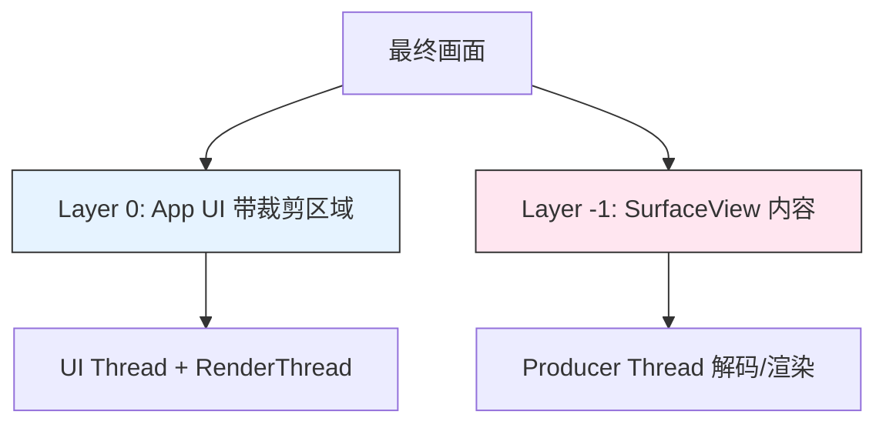
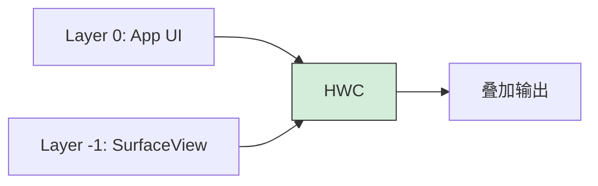
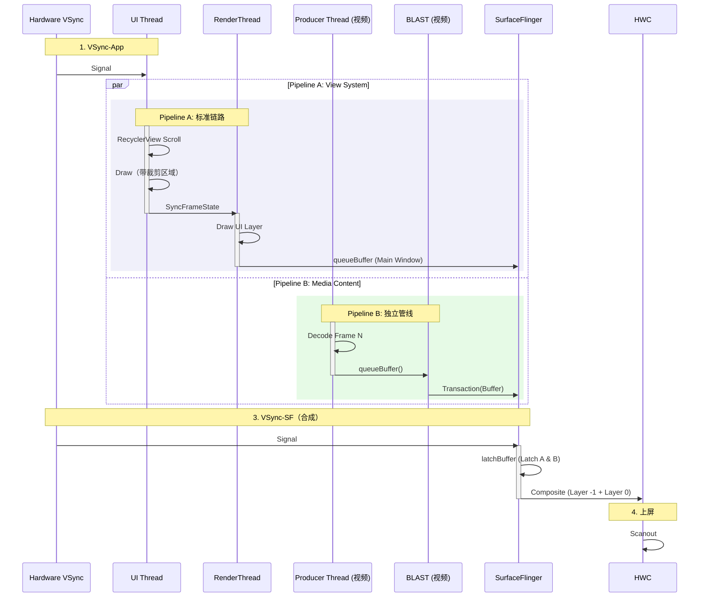

<!-- outline-start -->

**锚点（必须覆盖）：**
- [18.4.1 什么是混合渲染](#什么是混合渲染) — 两条并行管线的基本模型
- [18.4.2 并行生产机制](#并行生产机制) — View Pipeline 与 Media Pipeline 的独立运行
- [18.4.3 打洞与合成](#打洞与合成) — 两个 Layer 的视觉融合
- [18.4.4 渲染时序图](#渲染时序图) — 双管线的完整交互
- [18.4.5 跨 Surface 同步机制](#跨-surface-同步机制) — 受控 Surface / Transaction 之间的同步原语
- [18.4.6 SurfaceFlinger 在多 Layer 时的 latch 行为](#surfaceflinger-在多-layer-时的-latch-行为) — per-layer 推进与"视觉错位"的根因
- [18.4.7 性能特征与陷阱](#性能特征与陷阱) — 同步挑战与优化方向

**扩展（可选深入）：**
- 混合渲染中的 BLAST 同步语义
- 视频"飘移"问题的根因与解法

<!-- outline-end -->

当你的界面上同时有 RecyclerView 列表和视频播放器时——比如短视频 Feed 流、直播 App、或者带视频预览的社交应用——你面对的就是混合渲染场景。它的核心特征是 App 内部同时运行两条独立的渲染管线，最终由 SurfaceFlinger 将两个 Layer 合成为一张画面。

## 什么是混合渲染

混合渲染（Hybrid Composition）指的是标准的 Android View 系统（UI Thread + RenderThread）与一个独立的内容生产者（视频解码线程、游戏渲染线程等）在同一个界面中并行运行。两者各自拥有独立的 Surface 和 BufferQueue，通过 SurfaceFlinger 的 Layer 合成机制完成视觉融合。

最常见的结构是：

- **Layer 0（App 主窗口）**：RecyclerView、Toolbar、按钮、文字等 UI 元素。由 UI Thread 构建蓝图、RenderThread 执行 GPU 绘制。
- **Layer -1（SurfaceView 层）**：视频画面、直播流、3D 模型等内容。由独立的解码/渲染线程直接提交 Buffer。

关键点：**两个 Layer 的生产者是独立的线程，互不阻塞**。这是混合渲染最大的性能优势——主线程卡顿不会直接影响视频播放的流畅度。

## 并行生产机制

### Pipeline A：View System（标准链路）

这条管线走的就是 [18.2](02-android-view-standard.md) 中描述的标准链路：

1. **VSync-App 唤醒** UI Thread
2. 处理 Input → Animation → Measure → Layout → Draw（记录 DisplayList）
3. **SyncFrameState** 同步给 RenderThread
4. RenderThread 执行 GPU 绘制，通过 BLAST 提交 Main Window 的 Buffer

### Pipeline B：Media Content（独立管线）

这条管线完全独立于 VSync-App 的节奏：

1. **视频解码线程**解码出一帧图像（MediaCodec → GPU/CPU 解码）
2. 解码线程直接向 SurfaceView 的 BufferQueue 执行 `dequeueBuffer` → 填充 → `queueBuffer`
3. BBQ 构造 Transaction，提交给 SurfaceFlinger

**与 Pipeline A 的区别**：Pipeline B 不经过 UI Thread，不经过 RenderThread，不受 `Choreographer` 调度。它的帧率取决于视频源（24/30/60fps）和解码速度，而不是系统的 VSync 频率。

## 打洞与合成

两个独立的 Layer 要在屏幕上看起来像一张完整的界面，需要解决两个问题：

### 1. 挖洞（Hole Punching）

App 主窗口需要为 SurfaceView 留出显示区域。常见实现方式是让宿主窗口在 SurfaceView 对应区域不再绘制最终内容——这个区域对主窗口来说是"透明的"，底下的 SurfaceView Layer 自然就露出来了。

具体机制不应简单固化为某个 `clipOut()` 调用。在不同 Android 版本和 OEM 实现中，可能是：
- WMS 侧的 Z-Order 配置让 SurfaceView Layer 自动穿透显示
- App 侧在 Draw 时对 SurfaceView 区域设置透明/跳过
- SurfaceFlinger 侧通过 Layer 叠加策略处理

### 2. SurfaceFlinger 合成

在 VSync-SF 到达时，SurfaceFlinger 同时收到两个 Layer 的 Buffer 更新：

- **Layer Z=0（App UI）**：带裁剪区域的主窗口 Buffer
- **Layer Z=-1（SurfaceView）**：视频内容 Buffer

HWC 将这两层叠加，用户看到的是一张完整的界面。这个过程通常由硬件合成器完成，不需要额外的 GPU 操作——这是混合渲染低功耗的关键。

## 渲染时序图

这张图展示了双管线并行运行的特征。注意 Pipeline B 完全不被 UI Thread 阻塞，两个管线在时间轴上是并行的。

## 跨 Surface 同步机制

混合渲染的核心难题不在每条管线本身，而在两条管线如何**在同一帧里完成同步**。两个 Layer 由不同线程驱动、不同 BufferQueue 周转、有各自的 fence，要让它们在 SurfaceFlinger 这一轮被一起 latch、用同一组逻辑帧内容合成，需要专门的跨 Surface 同步原语。下面这些机制各自解决的问题不同，不能混用。

| 机制 | 适用范围 | 解决什么问题 |
|:---|:---|:---|
| `SurfaceComposerClient::Transaction::merge` | 已有 `SurfaceControl.Transaction` | 把多个受控 Layer 的几何 / alpha / buffer 状态合并到同一个事务边界 |
| `Transaction::setDesiredPresentTime` | per-transaction | 让 SF 在更合适的 vsync 周期 latch（**显示调度**，不消除 fence 等待） |
| Native `Surface::setBuffersTimestamp()` / EGL `eglPresentationTimeANDROID` | per-buffer | 在 producer 端为单块 buffer 设置期望 present 时间戳（native/EGL 层能力，非 Java `Surface` 公共 API） |
| `SurfaceControl.Transaction#addTransactionCommittedListener` | Android 13 / API 33+ | 通知 transaction 已提交（**不等于** buffer release，**不等于** present） |
| `SurfaceSyncGroup` | Android 14 / API 34+ | 把多个受控 Surface 包进一个同步组。公开 API 支持 `AttachedSurfaceControl`（TextureView）和 `SurfaceControlViewHost.SurfacePackage`；SurfaceView 的 `add(SurfaceView, ...)` 和 `SurfaceViewFrameCallback` 为 framework/internal `@hide` 路径，普通应用不可直接调用 |
| `latch unsignaled buffer` | 单 Layer 局部优化 | 满足 AutoSingleLayer 等条件时把 fence 等待时机后移；**不是跨 Surface 同步** |

**重要边界**：上面这些原语只能协调**受控 Surface / Transaction**，不能让外部 Producer（Camera / MediaCodec / Flutter Engine）的下一块 buffer 在期望帧准时到达。当跨进程 Producer 节奏不可控时，这些机制能**缓解**不同步压力，但**不会自动解决**它——最终仍然需要一个时刻让各条 Surface 同时满足"可以参与这一轮合成"的条件，等待时机可以后移，同步要求没有消失。

[已验证: AOSP `frameworks/native/libs/gui/SurfaceComposerClient.cpp` `Transaction::merge` / `setDesiredPresentTime` + `frameworks/native/libs/gui/Surface.cpp` `Surface::setBuffersTimestamp()` + Android Developers `SurfaceSyncGroup` (API 34) / `addTransactionCommittedListener` (API 33)]

## SurfaceFlinger 在多 Layer 时的 latch 行为

SurfaceFlinger 是按 **per-layer** 节奏推进合成的，并不等所有 Layer 都有新 buffer。每一轮 `vsync-sf` 到来时，SF 逐个检查每个 Layer：

- 有新 buffer 且 fence / transaction 条件满足 → latch 新的；
- 没有新 buffer → 沿用该 Layer 上一帧已经 latch 的 buffer；
- 任一 Layer 有新内容需要合成时，SF 就会本轮合成，对其他 Layer 沿用旧 buffer。

这是混合渲染最容易产生"视觉错位"的根因：系统已经合成了，但拼出来的结果里宿主部分和独立内容部分**不属于同一个逻辑帧**。常见症状：

- 外层 UI 已经是新状态，视频还是旧帧（SF 用了宿主的新 buffer + 视频的旧 buffer）；
- 视频帧已经到了，但遮罩 / 控制条还在旧位置；
- 页面已经滚动了，但视频 SurfaceView 几何还没跟上。

排查时不能只看 FrameTimeline 是否偏，要分别确认 SF 这一轮**对哪几个 Layer 用了新 buffer**——`dumpsys SurfaceFlinger` 的 `activeBuffer` / `latched buffer` 字段可以给到这一信息。

[已验证: AOSP `frameworks/native/services/surfaceflinger/SurfaceFlinger.cpp` `commitTransactions` / `latchBuffers`]

## 性能特征与陷阱

### 优势

1. **UI 与内容解耦**：主线程卡顿不直接拖慢视频播放。这是混合渲染的主要价值：Trace 中会同时出现 UI Thread 掉帧和 SurfaceView 帧率稳定的现象。
2. **HWC 直出**：如果 SurfaceView 的 Buffer 格式和分辨率与 HWC 兼容，SurfaceFlinger 可以直接将两个 Layer 交给 HWC 硬件叠加，不经过 GPU 合成。这是功耗最优的路径。
3. **帧率独立**：视频可以按 24fps 输出，UI 可以按 60fps 渲染，互不影响。

### 性能陷阱

#### 陷阱一：视频"飘移"

当用户快速滚动列表时，SurfaceView 的位置（由 UI Thread 控制）需要与视频帧内容（由解码线程控制）保持同步。如果位置更新和内容更新不在同一个 VSync 周期内着陆，就会出现视频画面与 UI 容器不对齐的情况——看起来像视频在"飘"。

**解法**：Android 12+ 上 BLAST / Transaction 模型允许将 SurfaceView 的几何位置更新与**受控 Surface** 的 Buffer 内容更新放入同一个 Transaction，减少两者分开发送带来的竞态。但这只适用于 App 侧能控制的 Surface（如自绘内容）；对 MediaCodec / Camera 等外部 Producer，App 无法把解码产出的下一帧 buffer 也放进 Transaction，同步仍依赖 Producer 的 buffer 到达时机和 fence。[已验证: Android 12 BLAST 文档]

#### 陷阱二：Layer 过多导致 GPU 合成

如果界面上的 Layer 数量超过了 HWC 支持的最大 Overlay 数量（通常 4-8 个，取决于硬件），SurfaceFlinger 会被迫回退到 GPU 合成。这不仅增加了 GPU 负担，还可能引入额外的延迟。

**排查方法**：`dumpsys SurfaceFlinger` 查看每个 Layer 的合成方式。如果看到 `GLES` 而不是 `HWC` 或 `OVERLAY`，说明 Layer 过多或格式不兼容。

#### 陷阱三：Buffer 压力

两个独立的 Surface 意味着两套 Buffer 槽位。在内存紧张的设备上（低端机、后台进程多），可能出现 Buffer 分配失败或回收不及时的情况，表现为视频播放突然卡顿。

#### 陷阱四：几何变换的开销

SurfaceView 的缩放、旋转等变换需要 SurfaceFlinger 在合成时处理。如果变换复杂（如画中画缩小动画），可能增加合成延迟。

### Trace 中如何识别

1. **两个 Surface**：在 Perfetto 的 SurfaceFlinger track 或 `dumpsys SurfaceFlinger` 中看到同一个 App 有两个 Layer。
2. **并行线程活动**：UI Thread + RenderThread 活动（Pipeline A）的同时，有一个独立的解码线程在持续 `queueBuffer`（Pipeline B）。
3. **HWC 合成**：在 SurfaceFlinger 的合成阶段，两个 Layer 被 Latch 并叠加。

---

> **交叉引用**：
> - 标准 BLAST 链路详见 [18.2 Android View 标准链路](02-android-view-standard.md)
> - SurfaceView 的独立 Surface 机制详见 [18.6 SurfaceView 直出路径](06-surfaceview.md)
> - SurfaceFlinger 的 Layer 合成策略详见 [2.6 SurfaceFlinger](06-surfaceflinger.md)
> - HWC 硬件合成原理详见 [2.7 Hardware Layer](07-hardware-layer.md)
