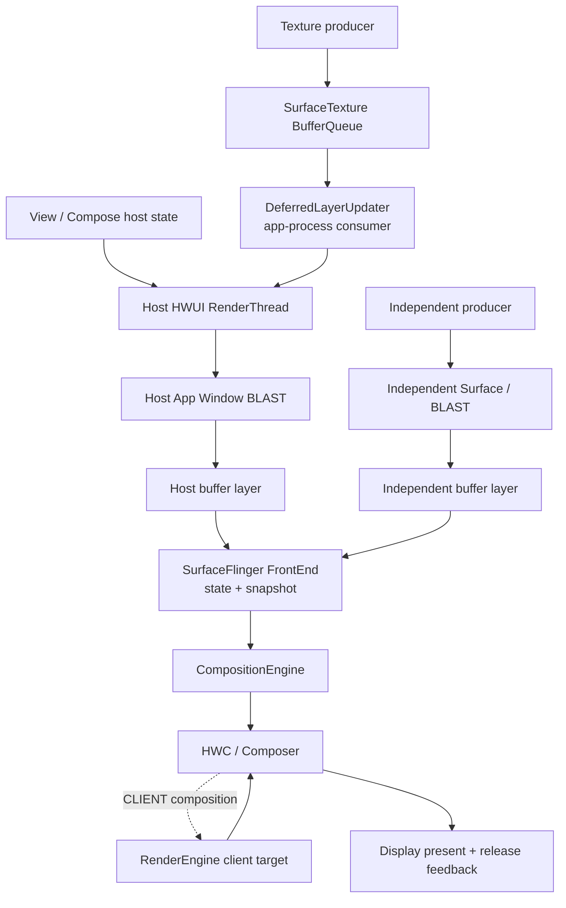
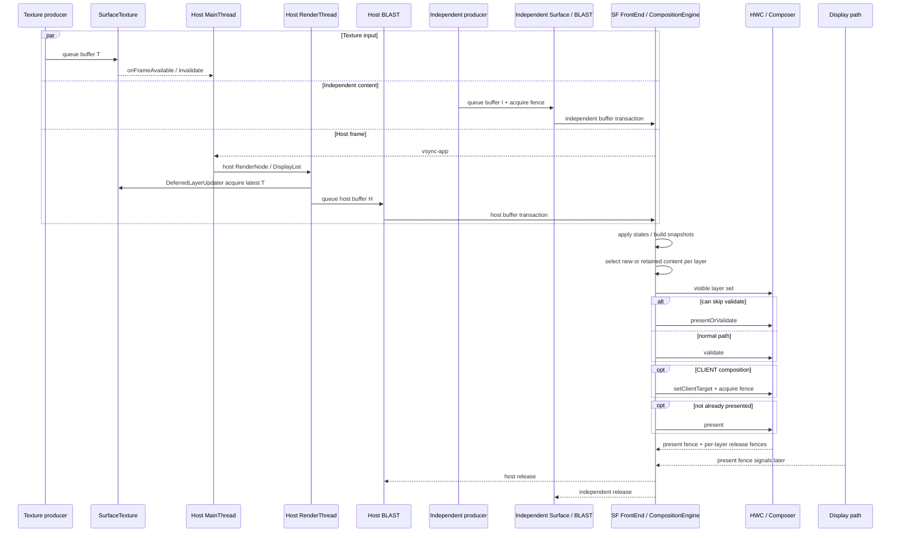

# 18.4 Android 17 混合渲染链路

混合出图页面同时存在两条以上可区分的内容生产路径，并且这些路径共同影响同一个最终画面。普通 View、Compose、`TextureView`、`SurfaceView`、嵌入式 `SurfaceControlViewHost`、视频、Camera、地图或游戏引擎都可能参与。

平台实现固定到 Android 17 / API 37 的 `android-17.0.0_r1`；kernel 固定到 `android17-6.18-2026-06_r6`。AOSP 能证明公共接口与系统合成行为，目标应用采用哪种 Producer、buffer format 和 layer 拓扑，仍要从当前 trace、layer tree 与业务配置确认。

## 什么是混合渲染

“混合渲染”是诊断分类，不是 Android framework 中的某个类。页面满足下面两个条件时，应使用这里的方法：

- 存在两条以上能区分 Producer 或 Consumer 的内容路径；
- 这些路径共同影响同一屏的可见结果。

只看到多个线程、多个 `queueBuffer()` 或多个 SurfaceFlinger layer 还不够。SystemUI、壁纸、输入法和导航栏本来就会参与 display composition；这里关注的是目标页面引入的多路内容关系。

### 三种拓扑

#### 宿主回流型

外部 Producer 把 buffer 交给 `SurfaceTexture`，应用进程内的 HWUI Consumer 取得内容，再采样进宿主 App Window。`TextureView` 是典型入口。

SurfaceFlinger 通常只看到最终宿主 layer，看不到与该 Texture 输入一一对应的独立可见 layer。错帧可能发生在外部 queue、宿主 acquire、GPU 采样或 host BLAST 提交中的任一阶段。

#### 独立 layer 型

`SurfaceView`、应用自管 `SurfaceControl` 或嵌入式 Surface hierarchy 保留独立 buffer layer。宿主与独立内容各自提交，SurfaceFlinger/HWC 决定目标 display frame 使用哪块 buffer 和哪组几何状态。

#### 组合型

页面既有 Texture 回流，也有独立 layer。宿主 buffer 已经包含多路输入，SurfaceFlinger 又把宿主与独立内容组合。此时至少有三道 deadline：

1. Texture buffer 是否赶上宿主 RenderThread acquire；
2. 宿主 App Window 是否赶上目标 SF display frame；
3. 独立 layer 的 buffer 与几何是否赶上同一个 display frame。

下面的拓扑图用于区分“回流到宿主”和“保持独立 layer”：



图中 Texture 输入在 App RenderThread 中变成宿主窗口像素；独立 Surface 保持单独的 SF buffer layer。分析前必须先判断内容走了哪条线。

### 一次 display 更新怎样汇合

以“宿主控制层 + TextureView 地图 + SurfaceView 视频”为例，一次可见更新要经过这些阶段：

1. 地图 Producer 向 `SurfaceTexture` 提交 buffer，frame-available 回调请求宿主更新；
2. 宿主 MainThread 在 `Choreographer#doFrame()` 中更新 View/Compose 状态和 RenderNode；
3. RenderThread 在 `DrawFrameTask::syncFrameState()` 处理 pending `DeferredLayerUpdater`，取得 Texture 输入的最新可用 buffer；
4. HWUI 将地图、普通 View、遮罩和控制层画入宿主 App Window buffer；
5. 宿主 BLAST 把 host buffer transaction 交给 SurfaceFlinger；
6. 视频 Producer 按自己的 cadence 向 SurfaceView BLAST child 提交独立 buffer 和 acquire fence；
7. SurfaceView container 的 position、crop、alpha、visibility 与 relative Z 由相应 Transaction 更新；
8. SurfaceFlinger FrontEnd 处理各路状态和 buffer readiness；没有选中新 buffer 的 layer 可以沿用已选中的旧内容；
9. CompositionEngine/HWC 针对整屏可见 layer 集合协商 DEVICE/CLIENT，必要时由 RenderEngine 生成 client target；
10. present 路径返回 display 级 present fence 和各 layer 的 release fence，信号稍后异步完成。

这十步没有共享的“业务帧”对象。目标 present 可能组合新宿主、旧视频，也可能让新视频配上旧 container 几何；需要同步的业务关系必须由应用或受控 Surface 的同步机制表达。

### 常见组合

| 页面组合 | SurfaceFlinger 侧常见形态 | 诊断入口 |
|---|---|---|
| 普通 View + `TextureView` | 通常只有宿主 App Window 主体 layer | 外部 queue、SurfaceTexture acquire、宿主 GPU、host BLAST |
| 普通 View + `SurfaceView` | 宿主 layer + SurfaceView container/content hierarchy | 宿主帧、独立 buffer、几何、hole-punch、per-layer selection |
| `TextureView` + `SurfaceView` | Texture 内容进入宿主，另有独立 SurfaceView layer | 两套输入队列、宿主采样、独立 layer、HWC |
| 多个 `SurfaceView` / `SurfaceControl` | 宿主 + 多个独立 layer | parent/Z-order、每路 `BufferTX`、同步组、composition type |
| `SurfaceControlViewHost` 嵌入 | 宿主 hierarchy 下有跨进程 child | `SurfacePackage`、`AttachedSurfaceControl`、sync group、可见性 |
| WebView / Flutter / 游戏 + 原生 Surface | 取决于引擎承载模式 | 先恢复真实 layer/BufferQueue 拓扑，再分析引擎线程 |

框架名不能直接决定拓扑。同一个播放器可能在不同模式下使用 `TextureView` 或 `SurfaceView`，同一个 Camera 页面也可能输出到预览 Surface、ImageReader 和编码 Surface。

### 生命周期会改变拓扑

播放器切换承载模式、Camera 重建 output、WebView 进入全屏视频、Surface hierarchy reparent 都会让旧 trace 对象失效。

| 对象 | 生命周期信号 | 常见失败 |
|---|---|---|
| `SurfaceView` | `surfaceCreated/Changed/Destroyed`、lifecycle strategy | Producer 仍写旧 Surface、container 已显示但 content child 无首帧 |
| `TextureView` | `onSurfaceTextureAvailable/Destroyed`、visibility、`setSurfaceTexture()` | Producer 已换队列，分析仍跟旧 `SurfaceTexture` |
| `SurfaceControlViewHost` | `SurfacePackage` attach/clear/reparent、远端 Binder | child hierarchy 断开、同步组对象退出 |
| Media/Camera output | session/output config、codec surface switch、secure 属性 | 切换期无 buffer、旧 buffer 保留、保护能力不匹配 |
| App Window | attach/detach、relayout、window Surface replacement | host layer id、BLAST queue、FrameTimeline token 改变 |

黑屏排查应按“对象存在 → Producer 连接 → 首 buffer 提交 → acquire fence 完成 → layer 可见 → HWC 接受”检查。`surfaceCreated()` 已回调只说明对象生命周期走到该阶段，不证明已有可显示 buffer。

## 并行生产机制

以“宿主控制层 + TextureView 地图 + SurfaceView 视频”为例，三路内容各有节奏。

### 宿主 View / Compose

宿主按 `vsync-app` 驱动 MainThread 与 RenderThread：

1. `Choreographer#doFrame()` 处理 INPUT、ANIMATION、INSETS_ANIMATION、TRAVERSAL、COMMIT；
2. View/Compose 更新 RenderNode/DisplayList；
3. RenderThread 生成宿主窗口 buffer；
4. host BLAST 把 buffer transaction 送到 SurfaceFlinger。

### TextureView 回流

地图或视频 Producer 向 `SurfaceTexture` queue buffer。Android 17 的 `TextureView` 在 frame-available 回调中安排 layer update 和 View invalidation；宿主硬件 draw 记录 `TextureLayer`。`DrawFrameTask::syncFrameState()` 随后遍历 pending layer，并调用 `DeferredLayerUpdater::apply()`；该方法再通过 `ASurfaceTexture_dequeueBuffer()` 取得当前内容。

源码注释明确指出，`ASurfaceTexture_dequeueBuffer()` 会丢弃此前未消费帧，只保留最新一帧。外部 Producer 已 queue 不表示宿主本帧一定采到了它；要继续对齐 frame-available、宿主 traversal、`DeferredLayerUpdater` acquire 与 host draw。

### 独立 Surface

视频、Camera、游戏或嵌入式 UI 可以向独立 Surface 提交 buffer。它可能由应用线程、codec、provider/HAL、引擎或远端进程生产，也不保证统一经过 App UI Thread、HWUI RenderThread 或同一个 BLAST adapter。

内容 cadence 可以是 24/30/60 fps、sensor 节奏或引擎 VSync。它与宿主 `vsync-app` 不同，但仍共享：

- SurfaceFlinger/HWC 的 display composition；
- overlay plane、scaler、bandwidth、GPU 与内存资源；
- container 的 position、crop、alpha、visibility 和 Z-order；
- display mode、present 与 release 节奏。

因此，“两路独立”只表示 Producer 和队列可独立推进，不表示彼此没有资源或状态依赖。主线程卡顿未必停止视频解码，但可能让遮罩、container 几何、hole-punch 或可见性留在旧状态。

### 先建立对象清单

每条内容路径至少记录一行：

| 字段 | 要记录的内容 | 常用证据 |
|---|---|---|
| 内容 | 视频、预览、地图、控制层、远端 UI | 页面结构、layer name、业务配置 |
| Producer | 应用线程、codec、camera provider/HAL、引擎、远端进程 | BufferQueue connect、queue、调用栈、进程/线程 |
| Consumer | HWUI SurfaceTexture Consumer、BLAST/SF、ImageReader、编码器 | layer tree、BufferQueue 名、源码路径 |
| 最终 SF layer | 宿主、独立 content child、color/effect layer | layer trace、dumpsys |
| 几何所有者 | ViewRoot、SurfaceView container、应用 Transaction、远端 host | parent、crop、matrix、relative-Z transaction |
| 帧节奏 | `vsync-app`、媒体 timestamp、sensor cadence、引擎 VSync | Choreographer、Producer timestamp、业务 trace |
| fence | acquire/release 属于哪块 buffer 和哪条队列 | fence fd、sync wait、release callback、driver trace |
| 同步约束 | 同一 Transaction、SurfaceSyncGroup、frame number、desired present | API 调用、transaction id、sync trace |

Producer 进程不能靠固定名单判断。应从目标 BufferQueue connection、queue 调用和 completion fence 回溯，进程名只能帮助缩小范围。

## 打洞与合成

### SurfaceView 的 hole-punch

默认位于宿主下方的 SurfaceView 需要让宿主窗口对应区域透明。Android 17 不是模糊的“OEM 可能自行裁剪”：`SurfaceView.draw()` / `dispatchDraw()` 在 `mDrawFinished` 且 Surface 位于 parent 下方时调用 `clearSurfaceViewPort()`，后者通过 `Canvas.punchHole()` 处理矩形或圆角区域及 alpha。

`mDrawFinished` 在 `surfaceRedrawNeededAsync` 的回调集合完成后置为 `true`。它表示 framework 认为 Surface redraw 回调阶段已经结束，不能单独证明 Producer 已提交首 buffer，更不能证明该 buffer 已被 latch 或 present。黑屏分析仍要继续检查 Producer connection、首个 buffer transaction、acquire fence、layer 可见性和目标 present。

SurfaceView 还要分清三个对象：

- `mSurfaceControl`：container，管理几何、crop、alpha、blur 等状态；
- `mBlastSurfaceControl`：承载 Producer buffer 的 BLAST child；
- `mBackgroundControl`：按 format、Z-order 和配置决定显隐的背景 color layer。

只看到 container 的 position 更新，不能证明 content child 已经使用新 buffer。Android 17 的 position update listener 还会把 parent scale、child buffer scale 与 crop 同步提交，以降低缩放和移动时的闪烁。

SurfaceView 位于宿主上方时不需要对宿主打洞；API 34 起 alpha 规则也区分 Z-above 与 Z-below。`TextureView` 则没有独立可见 SurfaceView child：它的内容被宿主 GPU 采样，不使用相同的 hole-punch 模型。

### SurfaceFlinger/HWC 合成

SurfaceFlinger 为当前 display 构造可见 layer 集合，再由 HWC 协商 DEVICE/CLIENT composition。CPU/GPU 生产者类型、YUV format 或 `SurfaceView` 名称都不能保证 overlay。

影响 strategy 的条件包括：

- format、modifier、dataspace、HDR metadata；
- protected/secure usage 与目标 display 的保护能力；
- crop、destination frame、scale、rotation、alpha、blend；
- overlay plane、scaler、bandwidth 和 vendor 限制；
- 同屏其他 layer 对硬件资源的占用；
- display mode、color mode 与全局 color transform。

新增 layer 可能让视频从宿主 GPU 采样改为 DEVICE composition，也可能占用 plane，使其他 layer 转为 CLIENT。成本不随 layer 数固定线性增长，也不存在可跨设备套用的“最多 4～8 个 overlay”阈值。

protected 内容若不能走目标设备的受保护路径，不能简单交给普通非保护 RenderEngine 兜底。黑屏或 composition failure 要检查 usage、secure flag、display capability 与 vendor Composer 结果。

## 渲染时序图

下面的时序图同时画出 Texture 回流、宿主窗口和独立 Surface：



同一个 display frame 可以合法地组合“新宿主 + 旧独立内容”或“旧宿主 + 新独立内容”。如果宿主中还包含 TextureView，还要注明宿主 buffer H 采到了哪个 Texture buffer T。业务上的字幕、遮罩、位置与内容可能要求同一逻辑时刻，系统却无法从像素推断这种关系。

`presentOrValidate()` 的 PresentSucceeded 只表示该 Composer/HWC 调用已执行 present 分支并保存 fences；不表示 panel 已扫描。Validated 或普通 validate 路径还要处理 composition changes，必要时生成 client target，再调用 present。

## 跨 Surface 同步机制

混合页的同步要分成“状态原子提交”“等待受控 Surface”“调度目标”和“buffer 生命周期”四类。一个 API 不能替代另外三类。

### 同一 Transaction

`SurfaceControl.Transaction` 可以同时更新多个 SurfaceControl 的 position、crop、alpha、layer、reparent，也可以通过公开 `setBuffer()` 提交调用方掌握的 `HardwareBuffer`。同一次 `apply()` 内的状态原子提交。

下面的职责模型用于区分同一 Transaction 内的状态与外部 BufferQueue 事件；它只表达边界，不是可编译代码。

```text
Transaction T
  setPosition(surfaceA)
  setCrop(surfaceA)
  setAlpha(surfaceB)
  optional setBuffer(surfaceC, hardwareBuffer, acquireFence)
  apply T atomically

external producer
  queueBuffer(surfaceB)
  remains a separate BufferQueue event
```

`surfaceB` 的 alpha 属于 Transaction T，外部 Producer 之后提交的 buffer 仍是另一项事件。若业务要求新 alpha、新几何和新内容出现在同一逻辑帧，还要把对应 buffer transaction 纳入控制，或使用能够等待目标 Surface 的同步机制。

原子性只覆盖已经加入 Transaction 的状态。Camera、codec 或游戏 Producer 之后向另一个 BufferQueue queue 的“下一帧”不会自动加入。两个 container 几何同帧生效、某个 child 仍沿用旧 buffer，并不表示 Transaction 丢了状态。

### SurfaceSyncGroup

API 34 的 `SurfaceSyncGroup` 可以收集 `AttachedSurfaceControl`、`SurfaceControlViewHost.SurfacePackage` 和附加 Transaction，也能协调跨进程 child sync。调用 `markSyncReady()` 后，组等待已注册 child 提供同步结果，再应用 merged transaction。

它只等待加入组的对象。MediaCodec、Camera HAL 或引擎 Producer 若没有通过受控 Surface 的同步接口进入组，系统无法替业务预测它何时生成下一逻辑帧。`SurfaceView` 的部分直接 sync 接口属于 framework/internal 路径，普通应用不能把隐藏 API 当成公开契约。

### committed、completed 与 release

| 回调/信号 | 能证明什么 | 不能证明什么 |
|---|---|---|
| API 33 committed listener | transaction 已应用，update ready to be presented | display 已 present、buffer 已 release |
| API 35 completed listener | transaction 已 presented，并返回 `TransactionStats` | panel 光学完成、旧 buffer 可无条件写 |
| buffer release callback/fence | Consumer 不再读取目标 buffer，可以按 fence 复用 | 新内容已在目标时间显示 |
| display present fence | 本轮 display 到达 Android 显示栈 present 边界 | panel 扫描/像素响应完成 |

### desired present 与 FrameTimeline

API 35 的 `setDesiredPresentTimeNanos()` 请求 transaction 在指定单调时钟时间或之后显示。`setFrameTimeline(vsyncId)` 把 Choreographer 提供的 VSync id 交给 SurfaceFlinger，选择对应 expected presentation timeline。

它们提供调度目标，不生成 buffer，也不消除 fence wait。Android 17 Java 文档明确要求：所有 acquire fence signal 前，transaction 不能因更早的 desired present time 而被强制显示。相关 API 仍受平台 flag 与设备构建配置约束。

### 三类 fence

| fence | 粒度 | 回答的问题 |
|---|---|---|
| acquire / production fence | 每块输入 buffer | Producer 何时写完，Consumer 何时可读 |
| release fence | 每个被消费的 layer/buffer | Consumer/HWC 何时不再读取，旧 buffer 何时可复用 |
| present fence | 每个 display present | 本轮 display 何时到达显示栈 present 边界 |

TextureView 回流多一套 SurfaceTexture acquire/release；宿主窗口还有 host BLAST acquire/release。报告中的 fence 必须注明队列、layer、buffer 与方向。

### AutoSingleLayer 不是跨 Surface 同步

Android 13 的 `AutoSingleLayer` latch-unsignaled 模式只适用于满足条件的单 layer 简单 buffer update。跨 layer、geometry change 和 sync transaction 正是它的限制边界。

它可以把某次 acquire-fence wait 后移到内容读取阶段，不能让多个 Producer 的逻辑帧自动一致，也不能替代 Transaction 或 SurfaceSyncGroup。

## SurfaceFlinger 在多 Layer 时的 latch 行为

### Android 17 FrontEnd 对象

Android 17 收到 transaction 后，把请求合入 `RequestedLayerState`，由 `LayerLifecycleManager` 管理 layer 生命周期和 hierarchy，再由 `LayerSnapshotBuilder` 生成当前可见性、几何和效果 snapshot。buffer layer 的 transaction readiness、buffer readiness 与 fence 还要单独判断。

旧资料把流程简化成 `SurfaceFlinger::commit()` 逐层调用 `Layer::latchBuffer()`，已经不足以解释 Android 17 的 container/content child、FrontEnd state 与 snapshot。

### 没有新 buffer 时可以沿用旧内容

SurfaceFlinger 不要求每个可见 layer 在每个 display frame 都有新 buffer。某一路没有新内容时，可以继续使用已选中的上次内容；低帧率视频与高刷新率 UI 的组合会自然出现这种复用。

视觉错位来自业务关联，而不是“SF 必须等所有 layer”：

- 新宿主 UI + 旧视频：字幕或遮罩已经更新，视频仍是上一帧；
- 新视频 + 旧宿主几何：内容推进，container/crop 仍在旧位置；
- 新地图标记 + 旧 Texture 输入：宿主 UI 与被采样底图属于不同业务时刻。

定位时要回答目标 present 对每个对象使用了什么：

1. 宿主 App Window 使用哪次 `BufferTX`；
2. 每个独立 content child 使用新 buffer 还是 retained previous content；
3. container position/crop/relative-Z 是否已更新；
4. 宿主内部的 TextureView 采到了哪个输入 buffer；
5. 哪些 layer 为 DEVICE，哪些进入 CLIENT。

`BufferTX - <layerName>` 只表示 SF server 侧 pending buffer transaction 计数变化。计数增加不提供 acquire fence、sync barrier、desired present 或 HWC strategy 的完整状态。

### transaction ready 不等于 fence 不再重要

SurfaceFlinger 可能因 sync group、barrier、desired present、acquire fence 或其他条件推迟更新。满足 latch-unsignaled 条件时，transaction 可以先通过部分 readiness；RenderEngine 或 HWC 读取 buffer 前仍要遵守 fence。

看到 transaction committed、`BufferTX` 增加或 snapshot 更新，都不能单独证明目标 display 已使用新 buffer。

### HWC present 路径

Android 17 的 `HWComposer::getDeviceCompositionChanges()` 只有本轮没有 client composition、且满足 earliest-present 条件时，才尝试 `presentOrValidate()`：

- PresentSucceeded：本次组合调用已执行 present，保存 present/release fences，并令 `validateWasSkipped` 为 true；
- Validated：validate 已完成，随后读取 changed composition types/requests 并 `acceptChanges()`；
- 不能 skip：走普通 `validate()`，再处理 changes 与 `acceptChanges()`。

存在 CLIENT layer 时，RenderEngine 生成 client target，`setClientTarget()` 携带 output acquire fence。`presentAndGetReleaseFences()` 在 fast path 只 flush commands，否则调用 present 并取得 release fences。

## 性能特征与陷阱

### 解耦不等于零影响

独立 Producer 的价值是内容生产不必跟随宿主 MainThread。主线程短暂卡顿时，已有 Surface 和稳定几何下的视频仍可能继续推进；反过来，视频解码迟到也不必阻止宿主按钮动画。

但它们共享显示和硬件资源，container 状态通常仍由宿主控制。不能把“视频帧率稳定”扩写成“主线程问题与视频无关”，也不能把“UI 帧率稳定”当成独立 layer 已按时 present。

### 常见故障

| 现象 | 优先检查 | 不应直接下的结论 |
|---|---|---|
| 新字幕配旧视频 | host buffer、视频 child buffer、目标 present | SF 会自动理解逻辑帧关系 |
| 视频已动，遮罩位置旧 | container geometry、hole-punch、sync transaction | 视频 Producer 慢 |
| 地图标记与底图错位 | Texture queue、宿主 acquire、标记所在 host frame | SF 多 layer latch 错 |
| 首屏局部黑 | lifecycle、Producer connect、首 buffer、visibility | 主线程已画完，所以所有内容已存在 |
| GPU 功耗跳升 | DEVICE→CLIENT、client target、透明/transform/layer 集合 | layer 数增加必然线性增成本 |
| Producer dequeue 很长 | 对应队列 slot 与 release fence | 所有 Producer 被同一个 display fence 卡住 |
| committed 后画面未变 | completed/present、buffer readiness、目标 display | committed 等于 present |
| desired present 仍迟到 | acquire fence、cadence、transaction 顺序、display mode | API 会强制指定纳秒显示 |
| protected 视频黑屏 | secure/protected path、display、HWC capability | 普通 GPU fallback 能解决 |

### Perfetto 复原顺序

从用户看到异常的 display present 反向查，比从最长 CPU slice 开始更容易识别错帧组合：

1. 锁定异常 present time 与 `display_frame_token`；
2. 列出该 display 的可见 layer、parent 和 hierarchy；
3. 标记每个 layer 使用的新/旧 buffer 与几何状态；
4. 展开宿主 buffer 内的 TextureView、WebView functor 或引擎纹理；
5. 对齐 Transaction、SurfaceSyncGroup、desired present 和 FrameTimeline；
6. 标明每个 acquire/release/present fence 的所有者；
7. 比较 DEVICE/CLIENT strategy、client target、display mode 和 color mode；
8. 找到最早偏离业务期望的 Producer 或同步边界。

FrameTimeline 的 host SurfaceFrame 适合判断 App Window，SF DisplayFrame 适合判断整屏。独立 Surface 或 TextureView 输入不一定有完整 app actual slice，必须补 `BufferTX`、queue/acquire、fence、layer 与 HWC 证据。

### HWC strategy 前后对比

发生 GPU、功耗或延迟跳变时，选择变化前后相邻 display frame，记录：

- 可见 layer 集合与 Z-order；
- format、dataspace、protected、alpha、transform、crop；
- 每个 layer 的 DEVICE/CLIENT composition type；
- client target 面积和 GPU duration；
- display mode、刷新率、color mode；
- vendor Composer request、error 或 fallback。

静止与动画期间可能使用不同 strategy，测试必须覆盖出现问题的动态状态。

### Android 12—17 版本边界

| 平台 | 混合出图相关变化 | 诊断影响 |
|---|---|---|
| Android 12 / API 31 | BLAST 与 FrameTimeline 构成现代窗口/Surface 基线 | 可用 host SurfaceFrame、SF DisplayFrame、layer/`BufferTX` 复原多路显示 |
| Android 13 / API 33 | Composer HAL 转向 AIDL；`AutoSingleLayer` 默认；committed listener 与 Java `setBuffer()` 公开 | binder/trace 入口变化；latch-unsignaled 不解决跨 layer 同步 |
| Android 14 / API 34 | `SurfaceSyncGroup`、SurfaceView lifecycle strategy 与任意 alpha 公开 | 受控跨进程 Surface 可同步；保留/销毁与半透明规则改变 |
| Android 15 / API 35 | desired present、transaction FrameTimeline、completed listener、desired HDR headroom | 调度和完成反馈更明确，buffer/fence 与设备能力仍决定结果 |
| Android 16 / API 36 | `SurfaceView.setCompositionOrder(int)` 公开 | 负值在宿主下，非负值在宿主上；同值 peer 顺序未定义 |
| Android 17 / API 37 | SurfaceView blur region API；固定到当前 FrontEnd、BLAST、CompositionEngine/HWC | blur、crop、transform、位置和 flag 状态要一起检查 |

历史边界可从这些一手入口复核：[Android 13 release notes](https://source.android.com/docs/whatsnew/android-13-release)、[unsignaled buffer latch](https://source.android.com/docs/core/graphics/unsignaled-buffer-latch)、[API 33 Transaction diff](https://developer.android.com/sdk/api_diff/33/changes/android.view.SurfaceControl.Transaction)、[API 34 SurfaceSyncGroup diff](https://developer.android.com/sdk/api_diff/34/changes/android.window.SurfaceSyncGroup)、[API 35 Transaction diff](https://developer.android.com/sdk/api_diff/35/changes/android.view.SurfaceControl.Transaction)、[API 36 SurfaceView diff](https://developer.android.com/sdk/api_diff/36/changes/android.view.SurfaceView) 与 [API 37 SurfaceView diff](https://developer.android.com/sdk/api_diff/37/changes/android.view.SurfaceView)。

### Android 17 源码入口

平台固定到 `android-17.0.0_r1`：

- [`ViewRootImpl.java`](https://android.googlesource.com/platform/frameworks/base/+/android-17.0.0_r1/core/java/android/view/ViewRootImpl.java) 与 [`Choreographer.java`](https://android.googlesource.com/platform/frameworks/base/+/android-17.0.0_r1/core/java/android/view/Choreographer.java)：宿主 traversal、VSync 与 window transaction；
- [`TextureView.java`](https://android.googlesource.com/platform/frameworks/base/+/android-17.0.0_r1/core/java/android/view/TextureView.java) 与 [`DeferredLayerUpdater.cpp`](https://android.googlesource.com/platform/frameworks/base/+/android-17.0.0_r1/libs/hwui/DeferredLayerUpdater.cpp)：SurfaceTexture frame-available、App Consumer 与宿主 GPU 采样；
- [`SurfaceView.java`](https://android.googlesource.com/platform/frameworks/base/+/android-17.0.0_r1/core/java/android/view/SurfaceView.java)：container/BLAST child、hole-punch、几何、lifecycle、composition order 与 blur；
- [`BLASTBufferQueue.cpp`](https://android.googlesource.com/platform/frameworks/native/+/android-17.0.0_r1/libs/gui/BLASTBufferQueue.cpp)：buffer transaction、frame-number merge 与 release；
- [`SurfaceControl.java`](https://android.googlesource.com/platform/frameworks/base/+/android-17.0.0_r1/core/java/android/view/SurfaceControl.java) 与 [`SurfaceComposerClient.cpp`](https://android.googlesource.com/platform/frameworks/native/+/android-17.0.0_r1/libs/gui/SurfaceComposerClient.cpp)：multi-Surface state、listeners、desired present、FrameTimeline 与 fence；
- [`SurfaceSyncGroup.java`](https://android.googlesource.com/platform/frameworks/base/+/android-17.0.0_r1/core/java/android/window/SurfaceSyncGroup.java)：child sync、跨进程 `SurfacePackage` 与 merged transaction；
- [SurfaceFlinger FrontEnd](https://android.googlesource.com/platform/frameworks/native/+/android-17.0.0_r1/services/surfaceflinger/FrontEnd/)、[`SurfaceFlinger.cpp`](https://android.googlesource.com/platform/frameworks/native/+/android-17.0.0_r1/services/surfaceflinger/SurfaceFlinger.cpp)：state、lifecycle、snapshot 与 transaction readiness；
- [CompositionEngine](https://android.googlesource.com/platform/frameworks/native/+/android-17.0.0_r1/services/surfaceflinger/CompositionEngine/)、[`HWComposer.cpp`](https://android.googlesource.com/platform/frameworks/native/+/android-17.0.0_r1/services/surfaceflinger/DisplayHardware/HWComposer.cpp) 与 [`HWC2.cpp`](https://android.googlesource.com/platform/frameworks/native/+/android-17.0.0_r1/services/surfaceflinger/DisplayHardware/HWC2.cpp)：visible layer、DEVICE/CLIENT、present/release fence。

Kernel 固定到 `android17-6.18-2026-06_r6`：

- [`drivers/dma-buf/sync_file.c`](https://android.googlesource.com/kernel/common/+/refs/tags/android17-6.18-2026-06_r6/drivers/dma-buf/sync_file.c)：fence fd；
- [`drivers/dma-buf/dma-fence.c`](https://android.googlesource.com/kernel/common/+/refs/tags/android17-6.18-2026-06_r6/drivers/dma-buf/dma-fence.c)：signal、callback 与 wait；
- [`drivers/dma-buf/dma-buf.c`](https://android.googlesource.com/kernel/common/+/refs/tags/android17-6.18-2026-06_r6/drivers/dma-buf/dma-buf.c)：dma-buf attach/map 与引用管理。

common kernel 不能解释 vendor GPU、codec、Camera 或 DPU 的 fence 创建和 signal 原因，这部分需要目标设备驱动与 vendor trace。

交叉阅读：

- [18.2 Android View 标准管线](02-android-view-standard.md)
- [18.6 SurfaceView](06-surfaceview.md)
- [18.7 TextureView](07-textureview.md)
- [2.6 SurfaceFlinger](../../part1-fundamentals/ch02-rendering/06-surfaceflinger.md)
- [2.7 Hardware Composer](../../part1-fundamentals/ch02-rendering/07-hardware-layer.md)

### 小结

混合页的分析单位是内容对象。每个对象都要确认 Producer、Consumer、最终 SF layer、几何所有者、帧节奏、buffer 与 fence；宿主窗口内部还可能包含 TextureView 等二次输入。

同一 Transaction 保证已加入状态的原子应用，`SurfaceSyncGroup` 等待已注册的受控 Surface，desired present 与 FrameTimeline 提供调度目标。它们都不会自动控制外部 Producer 的下一帧。

定位错帧时，从异常 display present 反向列出每个 layer 使用的新旧 buffer 与几何状态，再展开宿主内部输入，直到找到最早偏离业务期望的 Producer 或同步边界。
