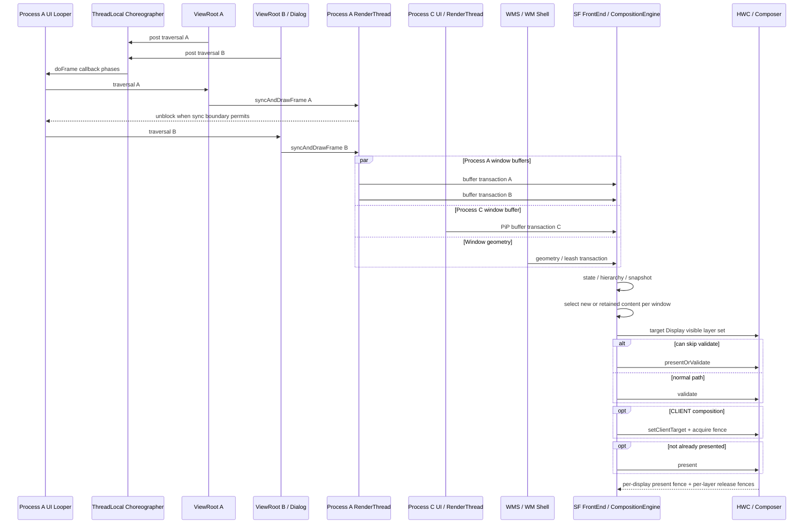

# 18.5 Android 17 多窗口、PiP 与自由窗口渲染

多窗口分析要同时区分 Window、进程和 Display。两个窗口可能共享 UI Looper 与 HWUI RenderThread，也可能来自不同进程；它们还可能位于不同 Display，拥有不同 mode、deadline 和 present fence。

平台实现固定到 Android 17 / API 37 的 `android-17.0.0_r1`，kernel 固定到 `android17-6.18-2026-06_r6`。用户看到的 Dialog、分屏、PiP 或桌面形态不能直接推出执行拓扑，结论必须落到 `pid/tid/Looper/ViewRootImpl/WindowState/SurfaceControl/displayId`。

## 多窗口场景分析

### 先判断是不是多个 Window

视觉上有两个 pane，不一定存在两个窗口。同一个 Activity 内的 `RecyclerView`、Compose、`SlidingPaneLayout` 或普通双栏布局，可能只有一个 `ViewRootImpl` 和一块 App Window buffer。

较强的多窗口证据包括：

- 多个顶层 `ViewRootImpl`；
- WMS 中多个 `WindowState` / Window token；
- 各自的 App Window Surface/BLAST 与 SF buffer layer；
- 明确的 Task、TaskFragment、PiP 或不同 `displayId`。

系统栏、壁纸、输入法和 transition leash 会增加 SF layer 数量，也不能单独证明应用有多个 Window。

### 常见窗口形态

| 形态 | 需要继续确认 |
|---|---|
| Dialog / PopupWindow | 是否产生独立 ViewRoot、WindowState 与 Surface；归属哪个 pid/UI tid |
| 同 App 多 Activity 可见 | Activity 是否同进程、同 UI Looper；各自属于哪个 Task/TaskFragment |
| Activity Embedding | primary/secondary container 的 TaskFragment、pid/tid 和 split support |
| split screen | 两侧是同 App 还是不同 App；是否同进程 |
| PiP | pinned Task 的进程、目标 Display、视频是否另有 SurfaceView |
| freeform / desktop | 设备是否启用、Task bounds、caption/leash、窗口所在 Display |
| multi-display | 每个 Window 的 `displayId`、mode、focus、SystemUI 与 present timeline |

“同 App”也不等于“同进程”，应用可以通过 `android:process` 拆分组件；“不同 Activity”也不等于不同 UI 线程。trace 中应以实际 pid/tid 为准。

### WMS 与 SF 是两棵相关但不同的树

Android 17 的 WMS 逻辑层级包含：

- `RootWindowContainer` / `DisplayContent`；
- `DisplayArea` / `TaskDisplayArea`；
- `Task` / `TaskFragment`；
- `ActivityRecord` / `WindowToken` / `WindowState`；
- 共同抽象 `WindowContainer`。

SurfaceFlinger 侧则有 container、leash、effect、buffer layer 和 display Output。Shell transition 可能把 Task/Activity/window surface 临时 reparent 到 leash；动画属性落在 leash 上，不表示 child App Window 没有 geometry。

### 生命周期、输入和 Insets 先于渲染归因

窗口 attach、relayout、visibility、Surface replacement、remove 或 Display 移除会改变 ViewRoot、WindowState、SurfaceControl、layer id 与 BufferQueue。跨生命周期 trace 应拆段，同名 layer 不保证是同一个对象。

用户看到窗口但无法点击时，应检查 focused window/app、input window handle、touchable region、transform、PiP/embedded input policy 和 Display 路由。`doFrame()` 正常只能证明窗口在绘制，不能证明 InputDispatcher 把事件发给它。

IME、状态栏、caption、cutout 与导航栏还会带来 Insets dispatch、应用 traversal、Shell/WMS geometry transaction 和独立系统 layer。键盘弹出后的 resize、平移或遮挡不能只看应用 layout。

## 同进程 vs 跨进程:拓扑判断决定了分析入口

| 证据 | 执行拓扑 | 直接影响 |
|---|---|---|
| 同 pid、同 UI tid、多个 ViewRoot | 共享 Looper 和该线程的 Choreographer | 到期 callback 在同一 UI 线程串行 |
| 同 pid、多个 HWUI CanvasContext | 共享进程级 RenderThread | 多个 `DrawFrameTask` / layer update 进入同一任务系统 |
| 不同 pid | UI Looper 与 RenderThread 独立 | 应用 CPU 任务不直接排在同一线程，设备资源与显示阶段仍共享 |
| 不同 `displayId` | 不同可见 layer set 与 present | mode、deadline、HWC capability 和 fence 必须分屏分析 |

### 同进程不等于只有一个 Choreographer

`Choreographer` 使用 ThreadLocal。多个 `ViewRootImpl` 若创建在同一 UI Looper，会取得同一个实例，并分别向 `CALLBACK_TRAVERSAL` 队列提交 callback。

同一 callback 批次中已经到期的任务在 UI 线程按队列顺序执行。某个 callback 在批次结束后才加入，则进入后续 frame。应用也可以在其他带 Looper 的线程创建 Choreographer，所以判断单位是 Looper/tid，不是 pid。

### 每个窗口状态与 buffer 独立

同进程多个顶层 Window 仍各有：

- `ViewRootImpl`、AttachInfo、Insets 与 dirty state；
- `ThreadedRenderer` / `CanvasContext`；
- App Window Surface、BLAST/BufferQueue；
- SF buffer layer、`BufferTX`、release callback。

共享主线程和 RenderThread 不会合并 Window A 与 Dialog B 的 buffer 周转。A 的 release fence 直接约束 A 的 buffer 复用，但 A 在共享 RenderThread 上等待时，会间接推迟 B 的任务。

### 跨进程也不是完全隔离

不同进程各有 UI Looper、Choreographer pending state、RenderThread、App Surface、GC 与 Binder pool。它们从各自 connection 接收 VSync 预测，应用任务不会直接排在同一线程。

同一 Display 上仍共享：

- SurfaceFlinger transaction/layer 处理预算；
- CompositionEngine 与 RenderEngine client composition；
- HWC plane、scaler、bandwidth 和 protected path；
- display mode、color mode、present deadline 和 panel；
- GPU、CPU、内存带宽、thermal/power 等设备资源。

App A 和 App B 的 `doFrame()` 都正常，也可能因为 Shell transition、CLIENT composition、HWC 或 display 阶段导致目标 DisplayFrame 迟到。

### 多 Display 要分别计时

每个 Display 有自己的 visible layer set、mode、HWC output 与 present fence。窗口从内屏移动到外接屏后，不能用默认屏的 FrameTimeline 或 present fence 解释外屏延迟。

同一个 layer 还可能通过 mirror、virtual display 或 projection 出现在多个 Output。要看目标 Display 的 output layer state，而不只是全局 layer 是否存在。

## 核心瓶颈:串行化

串行化是同 Looper、同 RenderThread 多窗口的重要瓶颈，不是所有多窗口问题的唯一原因。

### UI callback 串行

多个 ViewRoot 在同一 UI 线程上时，到期 traversal 依次执行。Window A 的 input、animation、Insets、relayout 或 `performTraversals()` 占用 CPU，会推迟队列中的 Window B。

不能假设一个 `doFrame` 必然出现两次完整 traversal：某个 Window 没有 dirty/layout 工作就可能不绘制；callback 也可能进入不同 frame。trace 应按 ViewRoot/Window identity 标记每段工作。

### RenderThread 队列共享

Android 17 的 `RenderThread::getInstance()` 提供进程级 HWUI RenderThread。每个硬件窗口各有 CanvasContext，但任务进入同一 RenderThread 系统：

- A 的 CPU render preparation 长，B 的任务排队；
- A 的 `dequeueBuffer()` / release wait 占用 RenderThread，B 不能及时进入；
- A 提交大量 GPU 工作后，B 即使 CPU task 短，也可能受 GPU queue 与带宽影响。

`DrawFrameTask::run()` 在 `syncFrameState()` 后，根据 `info.prepareTextures` 决定是否先解除 UI 线程等待；UI 可能开始处理 B，而 RenderThread 仍在画 A。主线程 callback 串行、RenderThread task 串行和 GPU 执行依赖必须分开观察。

### GL/Vulkan 后端不能套同一解释

SkiaGL 可能涉及不同 EGLSurface 的 current/buffer swap 与 GL context 状态；SkiaVulkan 使用另一套 surface、queue 和同步路径。不能从“两个窗口”直接推导固定的 `eglMakeCurrent` 开销，也不能把 Vulkan 简化成没有切换成本。

如果 trace 显示窗口切换附近变慢，应核对当前 HWUI backend、对应 context/surface、GPU queue、fence 和 vendor driver slice。

### 跨进程窗口的竞争位置

跨进程不会共享 App RenderThread，但可能分别在 CPU 调度、GPU queue、内存和同一 Display HWC 阶段竞争。瓶颈可能位于任一应用进程，也可能位于 SurfaceFlinger、HWC 或设备资源。

正确顺序是分别完成每个窗口的应用侧判断，再检查同一 Display 的 geometry、SF/HWC 与 present。

## 完整执行流程

下面以同一 Display 上的主应用 A、同进程 Dialog B 和跨进程 PiP C 为例。

### ① WMS/Shell 维护窗口状态

WMS 与 WM Shell 管理 Task、Window、transition leash、bounds、Z-order、focus 和 Insets。每个对象归属于 `DisplayContent`。

`WindowContainerTransaction` 描述高层 WindowContainer 变化，例如 bounds、windowing mode、TaskFragment 和 hierarchy 操作。WMS/Shell 再通过 `SurfaceControl.Transaction` 更新 leash/window layer 的 position、crop、matrix、alpha、visibility 与 reparent。应用内容由各自 BLAST buffer transaction 提交。

三者不能混为一谈：

| 状态来源 | 主要内容 |
|---|---|
| WCT | Task/TaskFragment bounds、windowing mode、hierarchy |
| SurfaceControl transaction | leash/window layer 几何、alpha、Z、visibility、reparent |
| App BLAST transaction | App Window buffer、acquire fence、frame number |

### ② 同 UI Looper 执行 A/B callback

A 与 Dialog B 若共享 UI Looper，会共享该线程 Choreographer。已到期的 traversal callback 在 UI 线程依次运行，各自调用自己的 `syncAndDrawFrame()`。

稳定绘制帧不一定调用 WMS。`ViewRootImpl.performTraversals()` 只在首帧、尺寸/可见性、Insets、LayoutParams 或强制 relayout 等条件命中时，经 `IWindowSession.relayout()` 进入 system_server。

### ③ 同 RenderThread 处理 A/B

A/B 的 `DrawFrameTask` 进入进程级 RenderThread。UI 线程可以在 sync 边界允许时提前继续，RenderThread 仍按任务队列处理 draw、dequeue、GPU submission 和 queue。

### ④ 跨进程 C 独立生产

PiP C 在另一进程时，拥有自己的 UI/RenderThread/BLAST。它可能按 24/30 fps 更新，而 Display 以更高频率 present。SurfaceFlinger 在多个 DisplayFrame 中复用 C 的旧 buffer 可以是正常 cadence，不应仅因没有每 VSync `BufferTX` 就判为丢帧。

### ⑤ geometry 与 buffer 在 SF 会合

SurfaceFlinger FrontEnd 接收 WMS/Shell geometry 与各窗口 buffer，更新 state、hierarchy 和 snapshot。新 geometry 与新 App buffer 来自不同模块，可出现：

- 新 geometry + 旧 buffer：transition 临时缩放旧内容；
- 新 geometry + 新 buffer：resize draw 已赶上；
- 旧 geometry + 新 buffer：若同步设计不允许，可能造成错误组合；
- snapshot/splash/starting window：替代 layer 覆盖重绘间隙。

允许哪种组合取决于 transition/sync 约束，不能写成“一路没 ready 就阻塞整个 Display”。

### ⑥ 每个 Display 独立 composition/present

CompositionEngine 为每个 Display 构造可见 layer set，HWC 再协商 DEVICE/CLIENT。present fence 按 Display 产生，release fence 按窗口/layer 返回。

下面的时序图说明 A/B 的共享执行与 C 的独立执行：

图只表达任务和状态关系，不承诺 A/B 每帧都同时绘制。PresentSucceeded 表示 HWC 组合调用已走 present 分支并保存 fences，不表示 panel 已完成扫描。

### resize 与 transition 的同步

WMS `BLASTSyncEngine` 等待一组 WindowContainer 的 draw/surface transaction，再把 ready 结果交给 transition 或调用方。API 34 `SurfaceSyncGroup` 则面向应用与嵌入 Surface。两者参与对象、权限和调用方不同。

`AutoSingleLayer` 只适用于单 layer 简单 buffer update，跨 layer、geometry 和 sync transaction 不适用，不能完成 PiP/resize/多窗口同步。

## PiP 与 Freeform 的特殊边界

PiP 和 Freeform 没有另起一套应用绘制引擎。普通 View 仍由 ViewRoot/HWUI 生产窗口 buffer，视频或 Camera 的独立 Surface 仍由各自 Producer 供帧；变化主要发生在 Task/Window bounds、transition leash、layer geometry 和同屏合成策略。

### PiP 进入流程与参数

应用请求进入 PiP 后，WindowManager 把目标 Task 切到 pinned windowing mode，WM Shell 取得 Task leash 并连续应用 position、crop、scale、round 和 alpha 等 transaction；动画结束再提交最终 WindowContainerTransaction。系统可以先变换旧内容，因此不要求应用在每个动画采样点都生成新 buffer。视频以 24/30 fps 供帧而 Display 以 60/90/120 Hz present 时，重复使用同一视频 buffer 也是正常行为。

`PictureInPictureParams` 会直接改变 transition 质量：

| 参数或回调 | 正确边界 |
| --- | --- |
| `sourceRectHint` | 指向进入小窗后仍可见的内容区域；它是进出动画提示，不是持续阶段的 crop API |
| `setAutoEnterEnabled(true)` | API 31+ 手势回桌面时让系统更早知道进入意图，避免依赖较晚的生命周期回调 |
| `setSeamlessResizeEnabled(true)` | 只适合可连续缩放的内容，典型是视频；复杂 UI 应明确设为 `false` 并验证 snapshot/cross-fade |
| `onPictureInPictureUiStateChanged()` | target API 35+ 可在进入动画开始时隐藏标题、推荐卡片等非必要 UI |

Android 17 r1 中，未设置的 `autoEnterEnabled` 返回 `false`。`seamlessResizeEnabled` 的注释与运行路径存在差异：getter 对空值返回 `false`，`PipTaskOrganizer` 又直接用该 getter 决定 resize 结束时是否走 snapshot cross-fade。因此应用不要依赖隐式默认值；视频明确传 `true`，复杂 UI 明确传 `false`，并在旋转、折叠或内容 bounds 变化后更新 params。

PiP 的常见风险包括：leash geometry 已变化但新 buffer 还没到、圆角/alpha/HDR 组合改变 HWC strategy、旧大 buffer 未 release 而新尺寸 buffer 已分配，以及进入小窗后仍维持不必要的高分辨率或高帧率。SurfaceFlinger 缩小 layer 不会自动改变 Producer 的分辨率和 cadence。

### Freeform resize：分开 geometry 与 buffer

把旧几何/内容记为 `G0/B0`，新几何/内容记为 `G1/B1`：

| 组合 | 视觉结果 |
| --- | --- |
| `G0 + B0` | 旧窗口仍一致 |
| `G1 + B0` | 旧内容被缩放、裁剪或 letterbox；不一定是错误 |
| `G1 + B1` | 新几何与新内容一致 |
| `G0 + B1` | 新内容落在旧几何中，通常是需要避免的错拍 |
| snapshot / starting layer | 系统内容覆盖应用重绘间隙 |

WMS `BLASTSyncEngine` 收集加入 sync group 的 WindowContainer transaction；应用窗口的 `BLASTBufferQueue` 把下一块 buffer 变成 SurfaceControl transaction；API 34+ 的 `SurfaceSyncGroup` 面向应用和嵌入 Surface。三者目的相关，但参与对象、权限和 ready 条件不同。独立 codec、Camera 或游戏 Producer 没有加入同步关系时，不会被 WMS 自动等待。

Android 17 还改变了部分配置变化的重建边界：键盘、键盘可见性、导航设备、触摸屏、颜色模式，以及进出 `UI_MODE_TYPE_DESK`，默认可跳过 Activity 重建并派发 `onConfigurationChanged()`。`AppCompatRecreateOnConfigChangePolicy` 会检查限定资源，应用也可通过 `android:recreateOnConfigChanges` 明确选择。排查时以实际生命周期回调和 ActivityRecord 决策为准，不能只按 manifest 推测。

## Trace 视角

### 按 Display 分组

记录目标 `displayId`、mode/刷新率、分辨率、color mode、物理/虚拟类型和 present timeline。跨屏问题分别选择 DisplayFrame。

### 建立 Window 表

| 字段 | 记录内容 |
|---|---|
| 归属 | uid、pid、package、Activity/Dialog/Popup/PiP/SystemUI |
| 执行 | UI tid/Looper、Choreographer、RenderThread tid、ViewRoot identity |
| WMS | displayId、Task/TaskFragment、WindowToken/WindowState、mode、bounds |
| SF | container/leash/buffer layer id、parent、Z、crop、visibility |
| Buffer | BLAST/BufferQueue、`BufferTX`、frame number、fence |
| FrameTimeline | SurfaceFrame/DisplayFrame token、layer name、present type |

这张表可以发现同名窗口已重建、Dialog 与主窗共享线程、PiP 位于另一 Display 等情况。

### 同进程：排序两个队列

在 UI tid 上列出目标 frame 的 callback、`performTraversals()`、relayout Binder 和 `syncAndDrawFrame()`，按 ViewRoot 标记开始顺序。再到 RenderThread 列出每个 CanvasContext/窗口的 `DrawFrame`、dequeue、GPU submit 与 queue。

Window B 的自身 draw 很短，也可能因为排在 A 后面错过 deadline。固定“Traversal >10ms”“两窗合计 >16.6ms”“RT >8ms”无法覆盖不同刷新率和 timeline，应与本窗口 expected end、actual end 和目标 present 对齐。

### 跨进程：逐个完成 App 判断

对每个应用检查：

- 是否按本窗口 expected timeline 起帧；
- MainThread、RenderThread、GPU 是否按时提交；
- App Window `BufferTX` 是否进入 SF；
- acquire fence 与 release backpressure 是否属于本窗口。

各 App 都按时而 DisplayFrame 迟到时，再重点检查 Shell geometry、SurfaceFlinger、client composition、HWC 和 display。

### 对齐 WMS/Shell

移动、resize、PiP 或 transition 期间记录 WCT 变化、`BLASTSyncEngine` sync id、Shell transition id、leash reparent/动画、应用 relayout/configuration/traversal 和 SF geometry/buffer 生效时刻。

窗口抖动的录屏不能区分 App layout 与 leash animation；transaction flow、parent chain 和生效的 DisplayFrame 才能定位。

### 分开 buffer、geometry 与 present

| 信号 | 粒度 | 能回答什么 |
|---|---|---|
| `BufferTX - <layerName>` | buffer layer | SF server 的 pending buffer transaction |
| SurfaceControl state | container/leash/window layer | position、crop、alpha、Z、visibility、reparent |
| acquire fence | 单块 buffer | Producer 何时写完 |
| release fence | layer/buffer | 旧 buffer 何时可复用 |
| present fence | 单个 Display | 该 Display 到达显示栈 present 边界 |

present fence 不属于某个 Window。`BufferTX` 只在一个窗口积压，也不能推出整个进程的 BufferQueue 都堵塞。

### 检查整个 Display 的 HWC strategy

Dialog、caption、IME、dim、transition leash、HDR/SDR、protected layer、scale 和 rounded corner 都可能改变 DEVICE/CLIENT。窗口多不保证 CLIENT，单个复杂窗口也可能触发 CLIENT。

`FLAG_SECURE` 约束截图、录屏与非安全 Display；protected buffer usage 要求硬件保护路径。它们常一起出现，但不是同一个标志。设备无法满足 protected path 时可能黑屏或拒绝显示，不能交给普通非保护 RenderEngine 处理。

### 可复用排查顺序

1. 选择目标 Display 和异常 present；
2. 列出该 Display 的 Window、leash 与可见 SF layer；
3. 标记每个 Window 的 pid/UI tid/RenderThread/ViewRoot；
4. 同进程窗口检查 UI callback 与 RenderThread 顺序；
5. 跨进程窗口分别检查 App 提交；
6. 对齐 WCT、sync id、transition leash、relayout 与 Insets；
7. 检查每个窗口 buffer、geometry、fence 和新旧选择；
8. 比较 HWC strategy，找到最早偏离目标 frame 的对象。

## 优化策略

优化应针对已经确认的责任边界，不应把“减少 Window 数”当作唯一答案。

### 同 UI Looper

- 停止被遮挡窗口中不必要的动画、定时刷新和持续 invalidate；
- 缩小实际需要更新的 View 子树，避免无关 `requestLayout()`；
- 把非 UI 计算移出主线程，但保留 View 访问的线程约束；
- Dialog/Popup 首帧提前准备数据、图片与布局输入，避免 show 时同步 I/O；
- 若浮层不需要独立 Window 的 focus、Insets、安全或系统行为，可评估放入现有 View hierarchy。

把 Dialog 改成宿主内 overlay 会减少一个 ViewRoot/Surface，但可能扩大宿主重绘、改变输入/Insets、无障碍和生命周期。需要用目标场景验证，不能只按窗口数量决定。

### 共享 RenderThread / GPU

- 找出占队列的具体 CanvasContext、dequeue/fence wait 或 GPU pass；
- 减少背景 Window 的无效 draw、全屏模糊、大面积透明和离屏 layer；
- 检查各窗口 buffer 尺寸是否随 bounds 收敛，避免小窗仍长期生产全尺寸内容；
- 结合实际 SkiaGL/SkiaVulkan backend 分析，不套 EGL 固定结论。

### resize、PiP 与 transition

- 正确处理 configuration、window bounds、Insets 与状态保存；
- 不在 resize loop 中反复分配大 Bitmap/buffer 或重建重量级资源；
- 让 geometry transaction 与新尺寸 buffer 进入既定 sync/transition 边界；
- 记录 starting/snapshot/letterbox 的预期策略，避免把合法旧 buffer 缩放误判成应用黑屏。

### 跨进程与 HWC

- 分别修复每个 App 的 late frame，不把一个进程的 slice 代替另一进程证据；
- 比较问题前后的 visible layer set、DEVICE/CLIENT、client target 和 display mode；
- 对 protected/HDR/外接屏使用目标设备能力和 vendor trace；
- 低帧率 PiP 按媒体 cadence 判断，不要求每个 Display VSync 产生新 buffer。

### Android 12—17 版本边界

| 平台 | 多窗口相关节点 | 分析影响 |
|---|---|---|
| Android 12 / API 31 | BLAST/FrameTimeline 现代基线 | Window buffer、SF layer 与 DisplayFrame 可按当前模型分析 |
| Android 12L / API 32 | 大屏多任务增强，Activity Embedding 广泛可用 | split container 不等于跨进程，运行时仍要查询支持 |
| Android 13 / API 33 | Composer HAL 转向 AIDL；`AutoSingleLayer` 默认 | HAL 入口变化；unsignaled latch 不负责多窗口同步 |
| Android 14 / API 34 | `SurfaceSyncGroup` 公开 | 应用/跨进程嵌入 Surface 可收集同步结果；WMS 仍有内部 sync engine |
| Android 15 / API 35 | target 35 edge-to-edge；transaction present-time/FrameTimeline/completed API | Insets/content area 变化；调度 API 不消除 buffer fence |
| Android 16 / API 36 | OEM 可启用 desktop windowing；target 36 大屏 resizability/orientation 规则变化并有阶段性 opt-out | 更频繁 resize/rotation/freeform；设备配置必须确认 |
| Android 17 / API 37 | target 37、`sw ≥ 600dp` 移除上述开发者 opt-out；小屏和 game category 豁免 | 固定方向/不可调整不再是大屏前提；BLAST/SF 主路径没有换代 |

历史边界可查 [AOSP multi-window](https://source.android.com/docs/core/display/multi-window)、[multi-display](https://source.android.com/docs/core/display/multi_display)、[Activity Embedding](https://developer.android.com/develop/ui/views/layout/activity-embedding)、[Android 15 edge-to-edge](https://developer.android.com/develop/ui/views/layout/edge-to-edge)、[Android 16 summary](https://developer.android.com/about/versions/16/summary) 与 [Android 17 release notes](https://developer.android.com/about/versions/17/release-notes)。

### Android 17 源码入口

App/HWUI 固定到 `android-17.0.0_r1`：

- [`ViewRootImpl.java`](https://android.googlesource.com/platform/frameworks/base/+/android-17.0.0_r1/core/java/android/view/ViewRootImpl.java)：每窗口 traversal、relayout 条件、draw 与 Surface；
- [`Choreographer.java`](https://android.googlesource.com/platform/frameworks/base/+/android-17.0.0_r1/core/java/android/view/Choreographer.java)：ThreadLocal、callback queue、pending frame；
- [`RenderThread.cpp`](https://android.googlesource.com/platform/frameworks/base/+/android-17.0.0_r1/libs/hwui/renderthread/RenderThread.cpp) 与 [`DrawFrameTask.cpp`](https://android.googlesource.com/platform/frameworks/base/+/android-17.0.0_r1/libs/hwui/renderthread/DrawFrameTask.cpp)：进程级线程、任务队列、UI unblock 与 draw；
- [`BLASTBufferQueue.cpp`](https://android.googlesource.com/platform/frameworks/native/+/android-17.0.0_r1/libs/gui/BLASTBufferQueue.cpp)：每窗口 buffer transaction 与 release。

WindowManager/Shell：

- [`WindowContainer.java`](https://android.googlesource.com/platform/frameworks/base/+/android-17.0.0_r1/services/core/java/com/android/server/wm/WindowContainer.java)、[`DisplayContent.java`](https://android.googlesource.com/platform/frameworks/base/+/android-17.0.0_r1/services/core/java/com/android/server/wm/DisplayContent.java)、[`WindowState.java`](https://android.googlesource.com/platform/frameworks/base/+/android-17.0.0_r1/services/core/java/com/android/server/wm/WindowState.java)：Display/Task/Window 组织、relayout、visibility、Insets/input；
- [`Task.java`](https://android.googlesource.com/platform/frameworks/base/+/android-17.0.0_r1/services/core/java/com/android/server/wm/Task.java) 与 [`TaskFragment.java`](https://android.googlesource.com/platform/frameworks/base/+/android-17.0.0_r1/services/core/java/com/android/server/wm/TaskFragment.java)：bounds、windowing mode、embedding container；
- [`WindowContainerTransaction.java`](https://android.googlesource.com/platform/frameworks/base/+/android-17.0.0_r1/core/java/android/window/WindowContainerTransaction.java)：organizer 高层状态；
- [`BLASTSyncEngine.java`](https://android.googlesource.com/platform/frameworks/base/+/android-17.0.0_r1/services/core/java/com/android/server/wm/BLASTSyncEngine.java) 与 [`TransitionController.java`](https://android.googlesource.com/platform/frameworks/base/+/android-17.0.0_r1/services/core/java/com/android/server/wm/TransitionController.java)：WMS sync、transition 与 Shell handoff。

SurfaceFlinger/Display：

- [FrontEnd](https://android.googlesource.com/platform/frameworks/native/+/android-17.0.0_r1/services/surfaceflinger/FrontEnd/) 与 [`SurfaceFlinger.cpp`](https://android.googlesource.com/platform/frameworks/native/+/android-17.0.0_r1/services/surfaceflinger/SurfaceFlinger.cpp)：state、snapshot、transaction readiness 与 per-display output；
- [CompositionEngine](https://android.googlesource.com/platform/frameworks/native/+/android-17.0.0_r1/services/surfaceflinger/CompositionEngine/)、[`HWComposer.cpp`](https://android.googlesource.com/platform/frameworks/native/+/android-17.0.0_r1/services/surfaceflinger/DisplayHardware/HWComposer.cpp) 与 [`HWC2.cpp`](https://android.googlesource.com/platform/frameworks/native/+/android-17.0.0_r1/services/surfaceflinger/DisplayHardware/HWC2.cpp)：Output layer、DEVICE/CLIENT、present/release。

Kernel 固定到 `android17-6.18-2026-06_r6`：

- [`kernel/sched/core.c`](https://android.googlesource.com/kernel/common/+/refs/tags/android17-6.18-2026-06_r6/kernel/sched/core.c) 与 [`kernel/cgroup/cpuset.c`](https://android.googlesource.com/kernel/common/+/refs/tags/android17-6.18-2026-06_r6/kernel/cgroup/cpuset.c)：UI/RenderThread 调度与 cpuset；
- [`drivers/dma-buf/sync_file.c`](https://android.googlesource.com/kernel/common/+/refs/tags/android17-6.18-2026-06_r6/drivers/dma-buf/sync_file.c) 与 [`drivers/dma-buf/dma-fence.c`](https://android.googlesource.com/kernel/common/+/refs/tags/android17-6.18-2026-06_r6/drivers/dma-buf/dma-fence.c)：窗口 fence fd、signal 与 wait。

common kernel 无法说明具体设备的 HWC plane、DPU、GPU 和 Display driver 延迟，设备结论需要 vendor trace 与驱动。

交叉阅读：

- [18.2 Android View 标准管线](02-android-view-standard.md)
- [18.4 混合出图](04-android-view-mixed.md)
- 本节“PiP 与 Freeform 的特殊边界”
- [2.6 SurfaceFlinger](../../part1-fundamentals/ch02-rendering/06-surfaceflinger.md)
- [2.14 图形 API 演进](../../part1-fundamentals/ch02-rendering/14-graphics-api-evolution.md)

### 小结

多窗口分析按 Display、Window、执行线程分层。相同 UI Looper 上的多个 ViewRoot 共享 Choreographer callback 队列，同进程硬件窗口共享进程级 RenderThread；每个窗口仍有独立 Surface/BLAST 与 SF buffer layer。

跨进程窗口的应用任务独立，但同一 Display 的 SF/HWC、GPU、带宽与 present deadline 仍共享。WCT 管理高层 WindowContainer，SurfaceControl transaction 管理 layer 几何，BLAST transaction 提交窗口内容，三类状态要分别对齐。
