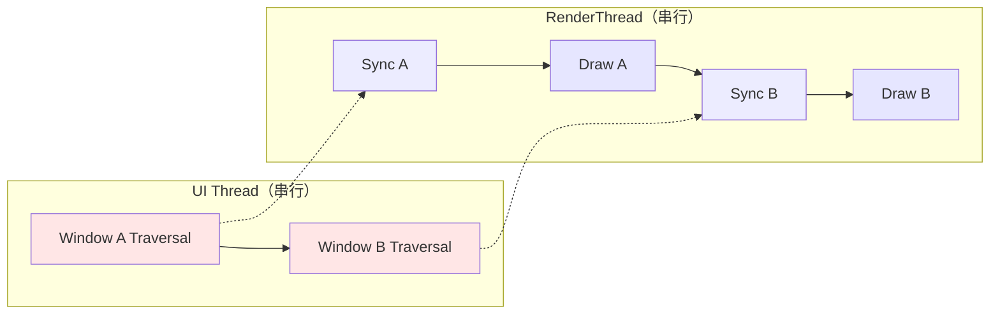
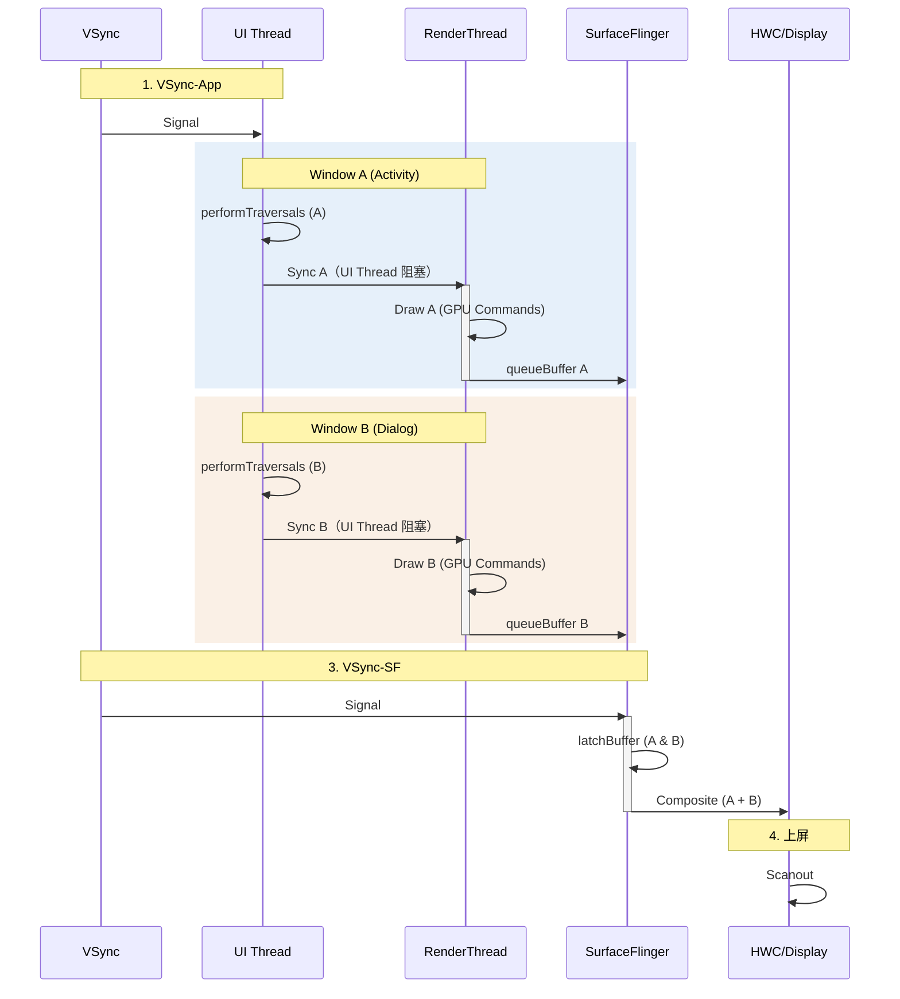

<!-- outline-start -->

**锚点（必须覆盖）：**
- [18.5.1 多窗口场景分析](#多窗口场景分析) — 什么时候会出现双窗口
- [18.5.2 核心瓶颈：串行化](#核心瓶颈串行化) — UI Thread 与 RenderThread 的争抢
- [18.5.3 全链路执行流程](#全链路执行流程) — 双窗口的完整时序
- [18.5.4 Trace 视角](#trace-视角) — 识别多窗口瓶颈
- [18.5.5 优化策略](#优化策略) — 减少串行开销

**扩展（可选深入）：**
- EGLContext 切换开销
- 分屏模式下的资源竞争

<!-- outline-end -->

这是一个在性能分析中极易被忽视的场景：同一个 App 进程同时显示两个窗口。表面上看起来只是"弹了个 Dialog"，但在底层渲染链路中，这意味着同一个 UI Thread 和同一个 RenderThread 需要串行处理两套完全独立的绘制任务。理解这个瓶颈，是排查"为什么弹 Dialog 后 Activity 也卡了"这类问题的关键。

## 多窗口场景分析

在 Android 中，以下场景会导致同一进程内同时存在两个活跃窗口：

1. **Dialog / AlertDialog / BottomSheetDialog**：打开 Dialog 时，背后的 Activity 依然可见且仍在绘制。虽然 Dialog 不是独立 Window（在某些实现中），但 `WindowManager` 会为它创建独立的 Surface [已验证: Android WindowManager 源码]。
2. **分屏/多窗口模式**：Android 10+ 支持 Multi-resume，两个 Activity 同时处于 `RESUMED` 状态，都在持续绘制。
3. **悬浮窗（System Alert Window）**：通过 `WindowManager.addView()` 添加的 Overlay 窗口，覆盖在 Activity 之上。
4. **PopupWindow**：虽然不是独立 Window，但在某些实现中会有独立的 Surface。

这些场景的共同特征是：**两个窗口共享同一个进程内的渲染资源**——一个 UI Thread、一个 RenderThread、一个 EGLContext。

## 核心瓶颈：串行化

多窗口的性能瓶颈不在于"画的东西多了一倍"，而在于**串行化执行**。两个窗口的绘制任务不能并行，只能排队。

### UI Thread 争抢

Android 的 `Choreographer` 是线程单例的。当 VSync-App 信号到来时，主线程收到**一次**回调，但它必须串行处理**所有**活跃窗口的 Input → Animation → Traversal：

```
doFrame() {
    处理 Window A 的 Input/Animation/Traversal  // 可能 8ms
    处理 Window B 的 Input/Animation/Traversal  // 可能 5ms
}
```

如果 Window A（比如一个复杂的 Activity）耗时过长，Window B（比如一个 Dialog）的更新就会被直接推迟，甚至导致掉帧。

**Trace 中的表现**：在 `doFrame` 内部，你会看到连续出现两个 `performTraversals`——第一个对应 Activity，第二个对应 Dialog。如果第一个耗时超过 10ms，第二个几乎必然导致掉帧。

### RenderThread 争抢

更致命的瓶颈在 RenderThread。一个 App 进程只有**一个** RenderThread，它需要串行处理所有窗口的 GPU 命令生成：

1. **Sync Window A**：同步 Window A 的 DisplayList
2. **Draw Window A**：生成 GPU 指令 → `queueBuffer` (Surface A)
3. **Sync Window B**：同步 Window B 的 DisplayList
4. **Draw Window B**：生成 GPU 指令 → `queueBuffer` (Surface B)

而且，RenderThread 中**共享同一个 EGLContext**，但每个 Window 有独立的 EGLSurface。切换窗口时需要调用 `eglMakeCurrent` 绑定不同的 EGLSurface，这意味着 GL 状态机的切换和资源绑定开销不可避免 [已验证: EGL 规范]。



### 为什么两个窗口不能并行？

因为共享了关键资源：
- **UI Thread** 是单线程的，VSync 回调只能串行执行
- **RenderThread** 也是单线程的，GPU 命令只能串行生成
- **EGLContext** 不是线程安全的，不能同时被两个线程使用

要并行，就需要创建第二个进程——这正是 Android 多进程架构的设计意图，但 Dialog 和分屏场景做不到这一点。

## 全链路执行流程

### 阶段一：VSync 唤醒与分发

1. **VSync-App** 到达，`Choreographer` 触发 `doFrame`
2. 两个 `ViewRootImpl` 都注册了 Traversal 回调，按注册顺序排队执行

### 阶段二：UI Thread 串行执行

1. **Window A（Activity）**：执行 `performTraversals`（Measure → Layout → Draw 记录 DisplayList）
2. **Window B（Dialog）**：紧接着执行 `performTraversals`

如果 Window A 的 Traversal 耗时 10ms，Window B 的 Traversal 在第 10ms 才开始。两者加起来超过 16.6ms，就会掉帧。

### 阶段三：RenderThread 串行执行

1. **Sync A**：RenderThread 同步 Window A 的 DisplayList 和资源
2. **Draw A**：生成 Window A 的 GPU 指令，`eglSwapBuffers` → `queueBuffer`（提交 Surface A 的 Buffer）
3. **Sync B**：RenderThread 同步 Window B 的 DisplayList 和资源（**此时 UI Thread 才被释放**）
4. **Draw B**：生成 Window B 的 GPU 指令，`eglSwapBuffers` → `queueBuffer`（提交 Surface B 的 Buffer）

注意：UI Thread 在 Sync A 时被阻塞（`syncFrameState`），直到 RenderThread 完成同步。这意味着 Window B 的 Traversal 可能需要等 Window A 的 Sync 完成后才能开始——形成了更深的串行依赖链。

### 时序图



## Trace 视角

### 识别多窗口的关键信号

1. **doFrame 内两个 performTraversals**：这是最直接的标志。如果 `doFrame` 中出现两次完整的 Traversal 序列，说明有两个活跃窗口。
2. **RenderThread 连续两轮 DrawFrame**：在 RenderThread track 中看到两次 `DrawFrame` → `dequeueBuffer` → `queueBuffer` 序列。
3. **两个 Surface 的 queueBuffer**：在 `dumpsys SurfaceFlinger` 或 Perfetto 中看到同一个 App 有两个活跃 Surface 同时提交 Buffer。

### 瓶颈定位

| 现象 | 根因 | 优化方向 |
|:---|:---|:---|
| Window B 的 Traversal 开始时间晚 | Window A 的 Traversal 耗时过长 | 简化 Window A 的布局 |
| doFrame 总时长 > 16ms | 两个 Traversal 串联超出预算 | 合并窗口（见下文优化策略） |
| RenderThread 中两次 DrawFrame 总时长 > 8ms | 两个窗口的 GPU 负担过重 | 减少背景窗口的绘制 |
| eglMakeCurrent 耗时过长 | EGL Surface 切换开销 | — |

### 典型 Trace 模式

```
UI Thread:     |--Traversal A (10ms)--|--Traversal B (5ms)--|
RenderThread:  |--Sync A--|--Draw A (4ms)--|--Sync B--|--Draw B (3ms)--|
```

在这种模式下，UI Thread 总耗时 15ms，RenderThread 总耗时约 8ms，两者加起来勉强控制在 16ms 以内。但如果 Window A 的布局再复杂一点，就会直接掉帧。

## 优化策略

### 策略一：合并窗口

**最有效的优化**。如果可能，用 View 的方式实现（如 Fragment、BottomSheetBehavior），而不是真正的 Window Dialog。这样两个窗口会合并到同一个 Surface，`doFrame` 中只有一次 Traversal、一次 SyncFrameState、一次 DrawFrame。

```java
// 避免：真正的 Window Dialog
Dialog dialog = new Dialog(this);
dialog.setContentView(R.layout.dialog_layout);
dialog.show();

// 推荐：View 级别的 BottomSheet
BottomSheetDialogFragment fragment = new MyBottomSheet();
fragment.show(getSupportFragmentManager(), "tag");
```

### 策略二：冻结背景窗口

如果背景窗口（Activity）在 Dialog 打开后不需要更新，确保它不参与绘制：

1. 设置不可见的 View 为 `View.GONE`（不是 `INVISIBLE`），避免 measure/layout
2. Dialog 显示时，Activity 的 `onPause()` 中停止动画和定时刷新
3. 确保 Activity 没有 `setKeepScreenOn` 等持续触发重绘的标志

### 策略三：简化 Dialog 布局

Dialog 的布局越简单，第二个 Traversal 的耗时越短。避免：
- 过深的嵌套层级
- 复杂的自定义 View
- 大量的 Bitmap 加载

### 策略四：延迟 Dialog 渲染

如果 Dialog 出现的时机可以控制，尽量在 Activity 空闲时弹出：

```java
// 在 Activity 渲染完成后再显示 Dialog
getWindow().getDecorView().post(() -> {
    dialog.show();
});
```

这能避免 Dialog 和 Activity 的 Traversal 在同一帧内竞争。

### 分屏模式的特殊考虑

分屏模式下，两个 Activity 同时 RESUMED，UI Thread 的竞争更加激烈。Android 10+ 的 Multi-resume 机制让两个 Activity 都能接收 VSync 回调，但底层仍然是同一个 Choreographer 串行分发。

对于分屏场景，除了上述优化策略外，还应该关注：
- 两个 Activity 的布局复杂度是否可以各自简化
- 是否有不必要的全屏重绘
- 后台 Activity 是否可以在 `onPause` 后暂停不必要的渲染

---

> **交叉引用**：
> - 标准 BLAST 链路中的 Choreographer 和 SyncFrameState 详见 [18.2 Android View 标准链路](02-android-view-standard.md)
> - EGLContext 与 EGLSurface 的管理详见 [2.14 图形 API 演进](../../part1-foundation/ch02-graphics-foundation/)
> - SurfaceFlinger 多 Layer 合成详见 [2.5 SurfaceFlinger](../../part1-foundation/ch02-graphics-foundation/)
