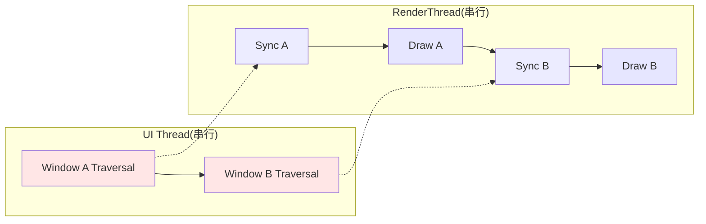
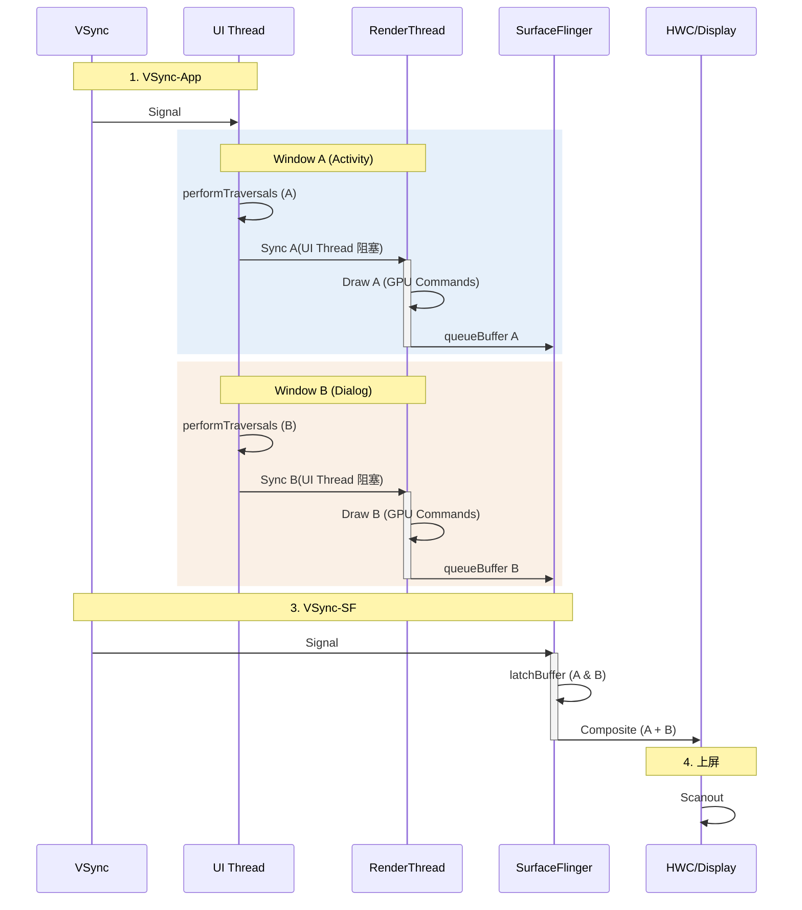

# 18.5 Android View 多窗口渲染路径

<!-- outline-start -->

**锚点(必须覆盖):**
- [18.5.1 多窗口场景分析](#多窗口场景分析) - 什么时候会出现双窗口
- [18.5.2 同进程 vs 跨进程](#同进程-vs-跨进程拓扑判断决定了分析入口) - 拓扑决定瓶颈位置
- [18.5.3 核心瓶颈:串行化](#核心瓶颈串行化) - UI Thread 与 RenderThread 的争抢
- [18.5.4 完整执行流程](#完整执行流程) - 双窗口的完整时序
- [18.5.5 Trace 视角](#trace-视角) - 识别多窗口瓶颈
- [18.5.6 优化策略](#优化策略) - 减少串行开销

**扩展(可选深入):**
- EGLContext 切换开销
- 分屏模式下的资源竞争

<!-- outline-end -->

同一个 App 进程同时显示两个窗口——表面看起来只是弹了个 Dialog，底层渲染路径里却变成同一个 UI Thread 和同一个 RenderThread 串行处理两套独立绘制任务。理解这个瓶颈，是排查"为什么弹 Dialog 后 Activity 也卡了"这类问题的关键。

多窗口性能分析的第一步是判断拓扑：同进程还是跨进程。这两种拓扑产生的瓶颈位置完全不同——同进程卡在 App 内部的串行竞争，跨进程卡在 SurfaceFlinger 合成侧。下文先列出常见场景并标注拓扑归属，再分别展开分析。

## 多窗口场景分析

下面这些场景都会在屏幕上同时显示多个窗口,但它们落在"同进程"还是"跨进程"两类拓扑里的判断标准不同:按 pid / `ViewRootImpl` / `Choreographer#doFrame` 归属判断,而不是只看窗口形态(split-screen / PiP / Dialog 看起来类似,底层归属可能差很远)。

### 同进程多窗口

以下场景中,多个活跃窗口共享同一个进程的 UI Thread 和 RenderThread:

1. **Dialog / AlertDialog / BottomSheetDialog**:打开 Dialog 时,背后的 Activity 依然可见且仍在绘制。`WindowManager` 会为 Dialog 创建独立的 Surface,但绘制仍然排在同一个 UI Thread 上 [已验证: Android WindowManager 源码]。
2. **PopupWindow**:通过 `WindowManager.addView()` 创建独立 Window，拥有独立 Surface。与 Dialog 同理——两者都走 `WindowManager.addView()` 路径挂载窗口，均产生独立 Window 和 Surface。
3. **同 App 多 Activity 可见**:同一 App 内两个 Activity 同时处于可见/RESUMED 状态(如 TaskFragment / Activity Embedding)。
4. **Activity Embedding(Android 12L+)**:在同一个 Task 内嵌入多个 Activity,常用于大屏 / 折叠屏的 list-detail 布局。仍然是同进程,串行竞争规则适用;WMS 层把这些 Activity 组织进同一个 `Task`,几何变化要用 `WindowContainerTransaction` 协调。

这些场景共享渲染资源--一个 UI Thread、一个 RenderThread、一个 EGLContext(OpenGL 后端)。瓶颈表现为窗口之间的绘制串行竞争。

### 跨进程多窗口

以下场景中,各窗口属于不同进程,各自拥有独立的 UI Thread / RenderThread / `BLASTBufferQueue`:

1. **不同 App 的分屏(split-screen)**:两个不同 App 各自一个 Activity 同屏显示。各 App 独立订阅 `vsync-app`,帧绘制互不干扰;瓶颈转移到 SurfaceFlinger 合成侧(各窗口帧率可能不同,SF 要在每轮 `vsync-sf` 协调多份不同节奏的 Surface)。
2. **PiP(画中画)**:一个 App 缩小到角落播放,另一个 App 占据主屏。两个进程独立渲染。
3. **Freeform / Desktop Windowing(Android 16+)**:Android 16 引入的原生桌面窗口管理,允许多个应用窗口同时显示。桌面窗口数量可变、尺寸自由,SystemUI 需同时渲染 Taskbar 和 Universal Cursor。连接外部显示器时,SystemUI 进程的 CPU 和显存会出现明显阶跃。对 App 侧来说,桌面模式下的多窗口同时可见时间更长,渲染压力从"短暂共存"变成了"持续并存"。

跨进程多窗口的瓶颈不在 App 进程内部,而在 SurfaceFlinger:各窗口的 `BufferTX` / `acquire fence` 节奏不同步,SF 每一轮 `vsync-sf` 要在多份窗口状态里选出可以一起合成的一组(per-layer latch)。读跨进程多窗口 trace 时,App 进程内部的 slice 可能都很健康--问题要到 SurfaceFlinger 进程里去找。

### 同 App 分屏:介于两者之间

同一 App 的两个 Activity 在分屏模式下同时 RESUMED,属于同进程多窗口的特殊情况:共享同一个 UI Thread 和 RenderThread,串行竞争规则仍然适用。但与 Dialog 场景不同,两个 Activity 各自拥有完整的 `ViewRootImpl` 和 Surface,`Choreographer#doFrame` 内会出现两套完整的 `performTraversals` 序列。

## 同进程 vs 跨进程:拓扑判断决定了分析入口

上面的场景分类已经按拓扑拆开了。这里补充一张对照表,方便在 trace 里快速判断归属:

| 拓扑类型 | 典型场景 | 主要瓶颈位置 | 对应分析章节 |
|:---|:---|:---|:---|
| **同进程多窗口** | Dialog、PopupWindow、同 App 多可见 Activity、Activity Embedding(Android 12L+) | 应用进程内的串行竞争(同一个 MainThread、同一个 RenderThread 进程单例) | 本章主体 |
| **跨进程多窗口** | split-screen、PiP、freeform / desktop windowing、不同 App 同屏 | SurfaceFlinger 合成侧(各 App 帧率可能不同,SF 要在每轮 `vsync-sf` 协调多份不同节奏的 Surface) | 见 [18.2](02-android-view-standard.md) + 本章末尾 |

### 同进程:串行挤占同一段调度时间

同进程多窗口里，多个 `ViewRootImpl` 共享同一个 `Choreographer`（`Choreographer.getInstance()` 是 `ThreadLocal<Choreographer>`，同一主线程上的所有 `ViewRootImpl` 天然共享）。同一帧 `doFrame` 内，多个 `performTraversals` 按 callback 注册顺序**串行**执行；RenderThread 是进程级单例（`RenderThread::getInstance()`），`DrawFrame` 也按窗口先后串行排队。某个窗口的 `performTraversals` 长了，后续窗口的起跑点直接往后挪。

### 跨进程：各自独立跑流水线，但共享一份 SF 帧节奏

跨进程多窗口里，每个进程独立订阅 `vsync-app`，独立跑自己的 MainThread / RenderThread / `BLASTBufferQueue`。Perfetto 里能看到不同进程的 `Choreographer#doFrame` 各自独立出现，不挤在同一个线程里。问题集中在：

- 各窗口帧率可能不同（比如主窗口 120 Hz、PiP 30 Hz）；
- 各窗口的 `BufferTX` / `acquire fence` 节奏不同步；
- SF 每一轮 `vsync-sf` 要在多份窗口状态里选出可以一起合成的一组（per-layer latch，详见 [18.4 混合渲染](04-android-view-mixed.md#surfaceflinger-在多-layer-时的-latch-行为)）。

读跨进程多窗口 trace 时，应用进程内部的 slice 可能都很健康——问题要到 SurfaceFlinger 进程里去找。

[已验证: AOSP `frameworks/base/core/java/android/view/Choreographer.java` (`sThreadLocal`) + `frameworks/base/libs/hwui/renderthread/RenderThread.cpp` (`getInstance`) + Android Developers Activity Embedding (API 32+)]

## 核心瓶颈:串行化

多窗口的性能瓶颈不在于"画的东西翻倍"，而在于**串行化执行**——两个窗口的绘制任务不能并行，只能排队。

SurfaceFlinger 合成侧已经并行化了--多个 Layer 可以由 HWC 硬件同时合成,跨进程多窗口的帧率互不干扰(见 [18.2](02-android-view-standard.md))。因此,同进程多窗口的压力主要落在生产侧:App 进程内部的 UI Thread 和 RenderThread 排队。

### UI Thread 争抢

Android 的 `Choreographer` 是线程单例的。当 VSync-App 信号到来时,主线程收到**一次**回调,但它必须串行处理**所有**活跃窗口的 Input → Animation → Traversal:

```text
doFrame() {
    处理 Window A 的 Input/Animation/Traversal  // 可能 8ms
    处理 Window B 的 Input/Animation/Traversal  // 可能 5ms
}
```

如果 Window A(比如一个复杂的 Activity)耗时过长,Window B(比如一个 Dialog)的更新就会被直接推迟,甚至导致掉帧。

**Trace 中的表现**:在 `doFrame` 内部,你会看到连续出现两个 `performTraversals`--第一个对应 Activity,第二个对应 Dialog。如果第一个耗时超过 10ms,第二个大概率会掉帧。

### RenderThread 争抢

更严重的瓶颈在 RenderThread。一个 App 进程只有**一个** RenderThread,它需要串行处理所有窗口的 GPU 命令生成:

1. **Sync Window A**:同步 Window A 的 DisplayList
2. **Draw Window A**:生成 GPU 指令 → `queueBuffer` (Surface A)
3. **Sync Window B**:同步 Window B 的 DisplayList
4. **Draw Window B**:生成 GPU 指令 → `queueBuffer` (Surface B)

OpenGL 后端下,RenderThread 共享同一个 `EGLContext`,每个 Window 有独立的 `EGLSurface`,切换窗口时调用 `eglMakeCurrent` 绑定不同的 EGLSurface,GL 状态机的切换和资源绑定开销不可避免 [已验证: EGL 规范]。Vulkan 后端走不同的资源模型(`VkSurface` / Swapchain / `vkQueueSubmit`),没有 EGLContext 切换成本,但 surface 切换本身仍有代价,需要从 VulkanManager 路径单独观察。



### 为什么两个窗口不能并行?

因为共享了关键资源:
- **UI Thread** 是单线程的,VSync 回调只能串行执行
- **RenderThread** 也是单线程的,GPU 命令只能串行生成
- **EGLContext**(OpenGL 后端)不是线程安全的,不能同时被两个线程使用

要并行,就需要拆到不同进程。不同 App 的分屏、PiP、桌面窗口本身已经跨进程,帧绘制互不干扰;瓶颈转移到了 SurfaceFlinger 合成侧。只有同进程内的多窗口(Dialog、同 App 多 Activity、Activity Embedding)才受制于上述串行约束,无法通过进程隔离来解耦。

## 完整执行流程

### 阶段一:VSync 唤醒与分发

1. **VSync-App** 到达,`Choreographer` 触发 `doFrame`
2. 两个 `ViewRootImpl` 都注册了 Traversal 回调,按注册顺序排队执行

### 阶段二:UI Thread 串行执行

1. **Window A(Activity)**:执行 `performTraversals`(Measure → Layout → Draw 记录 DisplayList)
2. **Window B(Dialog)**:紧接着执行 `performTraversals`

如果 Window A 的 Traversal 耗时 10ms,Window B 的 Traversal 在第 10ms 才开始。两者加起来超过 16.6ms,就会掉帧。

### 阶段三:RenderThread 串行执行

1. **Sync A**:RenderThread 同步 Window A 的 DisplayList 和资源,UI Thread 在这段 `syncFrameState` 中等待
2. **Draw A**:生成 Window A 的 GPU 指令,`eglSwapBuffers` → `queueBuffer`(提交 Surface A 的 Buffer)
3. **Sync B**:Window B 进入 `ThreadedRenderer` 后,继续在同一个 RenderThread 上同步 DisplayList 和资源
4. **Draw B**:生成 Window B 的 GPU 指令,`eglSwapBuffers` → `queueBuffer`(提交 Surface B 的 Buffer)

UI Thread 的阻塞边界在 `syncFrameState`。AOSP `DrawFrameTask::run()` 会在 `syncFrameState(info)` 后根据 `canUnblockUiThread` 决定是否先释放 UI Thread,再继续执行 `context->draw()`。因此 Window B 的 Traversal 通常只需要等 Window A 的同步阶段结束,不一定要等 Window A 的 GPU draw 完成。串行约束落在同一 UI Thread 上的多个 Traversal,以及同一 RenderThread 队列里的多个 `DrawFrameTask`。

`syncFrameState` 的阻塞时长因 Android 版本和帧内容而异。`DrawFrameTask::drawFrame()` 通过 `postAndWait()` 向 RenderThread 发起绘制请求,UI Thread 的阻塞时长取决于 RenderThread 完成引用交换和资源同步的速度。不同版本的内部实现会有调整,但 AOSP `DrawFrameTask.cpp` 中未发现 "push 模式" 架构变更--`postAndWait()` 在 android-16.0.0\_r1 中仍然是主要同步机制。判断阻塞时长不要依赖固定数值,直接看 Trace 中 `syncFrameState` / `postAndWait` slice 的持续时间。[已验证: AOSP android-16.0.0_r1, `frameworks/base/libs/hwui/renderthread/DrawFrameTask.cpp`]

### 时序图



这张图只表达同一 RenderThread 上的任务顺序。实际 trace 中,UI Thread 可能在 Window A 完成同步后开始 Window B 的 Traversal,同时 RenderThread 继续执行 Window A 的 draw。

## Trace 视角

### 识别多窗口的关键信号

1. **doFrame 内两个 performTraversals**:这是最直接的标志。如果 `doFrame` 中出现两次完整的 Traversal 序列,说明有两个活跃窗口。
2. **RenderThread 连续两轮 DrawFrame**:在 RenderThread track 中看到两次 `DrawFrame` → `dequeueBuffer` → `queueBuffer` 序列。
3. **两个 Surface 的 queueBuffer**:在 `dumpsys SurfaceFlinger` 或 Perfetto 中看到同一个 App 有两个活跃 Surface 同时提交 Buffer。

### 瓶颈定位

| 现象 | 根因 | 优化方向 |
|:---|:---|:---|
| Window B 的 Traversal 开始时间晚 | Window A 的 Traversal 耗时过长 | 简化 Window A 的布局 |
| doFrame 总时长 > 16ms | 两个 Traversal 串行超出预算 | 合并窗口(见下文优化策略) |
| RenderThread 中两次 DrawFrame 总时长 > 8ms | 两个窗口的 GPU 负担过重 | 减少背景窗口的绘制 |
| eglMakeCurrent 耗时过长 | EGL Surface 切换开销 | - |

### 典型 Trace 模式

```text
UI Thread:     |--Traversal A (10ms)--|--Traversal B (5ms)--|
RenderThread:  |--Sync A--|--Draw A (4ms)--|--Sync B--|--Draw B (3ms)--|
```

这种 trace 不能把 UI Thread 的 15ms 和 RenderThread 的 8ms 简单相加。两条线程之间存在同步等待和部分重叠,是否掉帧要看 Window B 的 `syncFrameState`、`queueBuffer` 是否错过目标 `vsync-sf`,再结合 FrameTimeline 的 present/jank 结果判断。

## 优化策略

### 策略一:合并窗口

首选方案是把 Dialog 这类浮层合并进现有 View 层级。可以用 Fragment、BottomSheetBehavior 这类方式实现,避免创建独立 Window Dialog。这样两个窗口会合并到同一个 Surface,`doFrame` 中只有一次 Traversal、一次 SyncFrameState、一次 DrawFrame。

```java
// 避免:独立 Window Dialog(创建独立 Window/Surface)
Dialog dialog = new Dialog(this);
dialog.setContentView(R.layout.dialog_layout);
dialog.show();

// 注意:BottomSheetDialogFragment 继承自 AppCompatDialogFragment,
// 仍然创建独立 Window 和 Surface,只是布局上模拟了 BottomSheet 效果

// 推荐:无额外 Window 的方案--BottomSheetBehavior + CoordinatorLayout
// 在 Activity 的布局 XML 中嵌入 BottomSheet 容器
// <CoordinatorLayout>
//   <FrameLayout android:id="@+id/bottom_sheet"
//     app:layout_behavior="com.google.android.material.bottomsheet.BottomSheetBehavior" />
// </CoordinatorLayout>
```

### 策略二:冻结背景窗口

如果背景窗口(Activity)在 Dialog 打开后不需要更新,确保它不参与绘制:

1. 设置不可见的 View 为 `View.GONE`(不是 `INVISIBLE`),避免 measure/layout
2. Dialog 显示时,Activity 的 `onPause()` 中停止动画和定时刷新
3. 确保 Activity 没有 `setKeepScreenOn` 等持续触发重绘的标志

### 策略三:简化 Dialog 布局

Dialog 的布局越简单,第二个 Traversal 的耗时越短。避免:
- 过深的嵌套层级
- 复杂的自定义 View
- 大量的 Bitmap 加载

### 策略四:延迟 Dialog 渲染

如果 Dialog 出现的时机可以控制,尽量在 Activity 空闲时弹出:

```java
// 在 Activity 渲染完成后再显示 Dialog
getWindow().getDecorView().post(() -> {
    dialog.show();
});
```

这能避免 Dialog 和 Activity 的 Traversal 在同一帧内竞争。

### 分屏模式的特殊考虑

分屏场景要区分同 App 还是跨 App:

**同 App 分屏**:两个 Activity 同进程,共享同一个 `Choreographer` 和 RenderThread。`doFrame` 内出现两套完整的 `performTraversals`,串行竞争加剧。排查重点在 App 进程内部的 UI Thread / RenderThread 竞争。

**跨 App 分屏**:两个不同 App 各自独立进程,各自有独立的 UI Thread / RenderThread / `BLASTBufferQueue`。App 进程内部的 slice 可能都很健康--瓶颈在 SurfaceFlinger 侧。排查重点转移到 SF 进程的 per-layer latch、HWC composition 和 `vsync-sf` 调度。

对两种分屏都适用的是:两个 Activity 的布局复杂度是否可以各自简化、是否有不必要的全屏重绘、非活跃 Activity 是否可以暂停渲染。

---

> **交叉引用**:
> - 标准 BLAST 管线中的 Choreographer 和 SyncFrameState 详见 [18.2 Android View 标准管线](02-android-view-standard.md)
> - EGLContext 与 EGLSurface 的管理详见 [2.14 图形 API 演进](../../part1-fundamentals/ch02-rendering/14-graphics-api-evolution.md)
> - SurfaceFlinger 多 Layer 合成详见 [2.6 SurfaceFlinger](../../part1-fundamentals/ch02-rendering/06-surfaceflinger.md)
