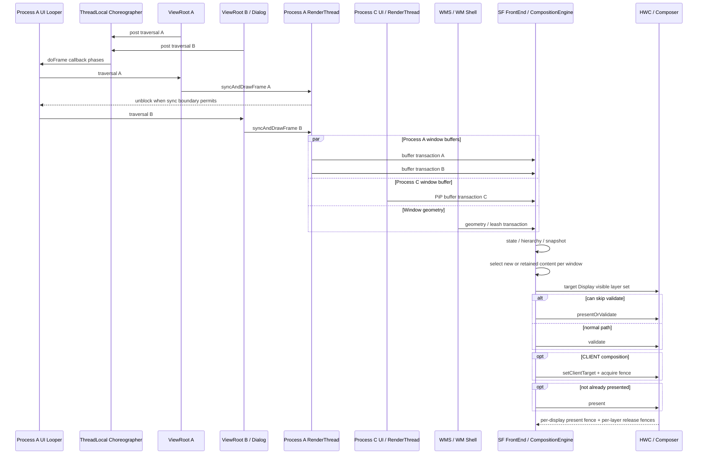

# 18.5 Android 17 多窗口、PiP 与自由窗口渲染

分析多窗口问题，先把三个维度分开：Window 是应用或系统提交内容的顶层窗口单元，进程决定 UI Looper 与 HWUI RenderThread 是否共享，Display 则是最终参与合成和显示的输出设备。两个窗口可能共享执行线程，也可能来自不同进程；它们还可能位于不同 Display，使用各自的 mode（刷新模式）、deadline（本次显示帧的提交时限）和 present fence（HWC 为该 Display 返回的显示同步信号）。

本文以 Android 17 / API 37 的 `android-17.0.0_r1` 为平台基线，以 `android17-6.18-2026-06_r6` 为内核基线。用户看到的 Dialog（对话框）、分屏、PiP（Picture-in-Picture，画中画）或桌面窗口形态，无法直接说明内部如何执行。结论需要对应到 `pid`（进程号）、`tid`（线程号）、Looper、`ViewRootImpl`、`WindowState`、`SurfaceControl` 和 `displayId` 等实际对象。

## 多窗口场景分析

### 先判断是不是多个 Window

视觉上有两个 pane（窗口内分栏），不一定存在两个 Window。同一个 Activity 内的 `RecyclerView`、Compose、`SlidingPaneLayout` 或普通双栏布局，可能只有一个负责连接 View 树与窗口系统的 `ViewRootImpl`，也只通过一条 App Window buffer 链路提交内容。

较强的多窗口证据包括：

- 多个顶层 `ViewRootImpl`；
- WMS 中有多个表示服务端窗口状态的 `WindowState`，或者多个用于标识窗口归属的 Window token；
- 每个窗口都有自己的 App Window Surface/BLAST 提交链路和 SF buffer layer；
- WMS 层级中能区分 Task、TaskFragment、PiP，或者窗口具有不同的 `displayId`。

系统栏、壁纸、输入法和 `transition leash` 也会增加 SF layer 数量。其中 leash 是动画期间临时承载位移、缩放等属性的父 layer，因此 layer 数量本身不能证明应用创建了多个 Window。

### 常见窗口形态

| 形态 | 需要继续确认 |
|---|---|
| Dialog / PopupWindow | 是否产生独立的 ViewRoot、WindowState 与 Surface；归属哪个 pid/UI tid |
| 同 App 多 Activity 可见 | Activity 是否处于同一进程、是否共享 UI Looper；各自属于哪个 Task/TaskFragment |
| Activity Embedding | 主、次容器对应的 TaskFragment、pid/tid，以及设备是否支持该分屏能力 |
| split screen | 两侧属于同一 App 还是不同 App；是否处于同一进程 |
| PiP | pinned Task（固定在画中画模式的任务）属于哪个进程和 Display；视频是否另有 SurfaceView |
| freeform / desktop | 设备是否启用自由窗口或桌面模式；Task bounds、标题栏、leash 和所在 Display |
| multi-display | 每个 Window 的 `displayId`、mode、焦点、SystemUI 和 present timeline |

“同 App”不等同于“同进程”：应用可以通过 `android:process` 把组件放到不同进程。“不同 Activity”也不等同于不同 UI 线程。trace 中应以实际 pid/tid 为准。

### WMS 与 SF 是两棵相关但不同的树

WMS（WindowManagerService）维护窗口、任务和显示设备之间的逻辑层级。Android 17 中，主要对象包括：

- `RootWindowContainer` / `DisplayContent`：全局根节点与单个 Display 的逻辑根节点；
- `DisplayArea` / `TaskDisplayArea`：Display 内的分区，以及承载 Task 的区域；
- `Task` / `TaskFragment`：任务与任务内部可独立组织 Activity 的片段；
- `ActivityRecord` / `WindowToken` / `WindowState`：Activity 服务端记录、窗口归属令牌和单个窗口的服务端状态；
- `WindowContainer`：上述层级节点共用的容器抽象。

SurfaceFlinger（SF）维护的是合成层级，其中有只组织子节点的 container、承载过渡动画的 leash、表达视觉效果的 effect layer、携带应用内容的 buffer layer，以及每个 Display 对应的 Output。Shell transition 可能把 Task、Activity 或 window surface 临时 `reparent`（更换父节点）到 leash。动画几何属性落在 leash 上时，子 App Window 仍有自己的 geometry，分析时要沿父子链合并判断。

### 生命周期、输入和 Insets 先于渲染归因

窗口的 attach（接入窗口系统）、relayout（重新协商尺寸和 Surface）、可见性变化、Surface replacement（替换）、remove 或 Display 移除，都会改变 ViewRoot、WindowState、SurfaceControl、layer id 与 BufferQueue。跨生命周期阅读 trace 时应按对象创建和销毁分段；同名 layer 可能已经换成另一个实例。

用户看到窗口却无法点击时，应检查 focused window/app、向 InputDispatcher 描述接收方的 input window handle、可触摸区域 touchable region、坐标变换 transform、PiP/嵌入式窗口输入策略和 Display 路由。`doFrame()` 正常只能证明窗口正在处理帧回调，无法证明 InputDispatcher 已把事件路由给它。

IME（输入法）、状态栏、caption（桌面窗口标题栏）、cutout（屏幕挖孔）与导航栏还会触发 Insets 分发、应用 traversal、Shell/WMS geometry transaction，并引入独立的系统 layer。键盘弹出后的 resize、平移或遮挡涉及窗口可用区域和系统 layer，不能只看应用 layout。

## 同进程与跨进程：拓扑决定分析入口

| 证据 | 执行拓扑 | 直接影响 |
|---|---|---|
| 同 pid、同 UI tid、多个 ViewRoot | 共享 Looper 和该线程的 Choreographer | 到期 callback（回调）在同一 UI 线程串行执行 |
| 同 pid、多个 HWUI CanvasContext | 共享进程级 RenderThread | 多个窗口的 `DrawFrameTask` 和 layer update 进入同一任务系统 |
| 不同 pid | UI Looper 与 RenderThread 独立 | 应用 CPU 任务不排在同一线程，设备资源与显示阶段仍可能竞争 |
| 不同 `displayId` | 各有可见 layer 集合和 present 流程 | mode、deadline、HWC 能力和 fence 必须按 Display 分析 |

### 同进程不等于只有一个 Choreographer

`Choreographer` 使用 ThreadLocal，即每个线程保存自己的实例。多个 `ViewRootImpl` 若创建在同一个 UI Looper 上，会取得同一个 Choreographer，并分别向 `CALLBACK_TRAVERSAL` 队列提交 traversal 回调。

同一批次中已经到期的回调会在 UI 线程上按队列顺序执行；批次结束后才加入的回调会进入后续 frame。应用也可以在其他带 Looper 的线程创建 Choreographer，因此判断单位是 Looper/tid，不能只看 pid。

### 每个窗口状态与 buffer 独立

同进程多个顶层 Window 仍各有：

- `ViewRootImpl`、保存窗口附着信息的 AttachInfo、Insets，以及标记待重绘区域的 dirty state；
- `ThreadedRenderer` / `CanvasContext`，即该硬件加速窗口的渲染入口与上下文；
- App Window Surface、BLAST/BufferQueue，也就是应用向 SF 交付 buffer 的队列；
- SF buffer layer、表示新 buffer 到达的 `BufferTX`，以及 buffer 可复用时触发的 release callback。

共享主线程和 RenderThread 不会合并 Window A 与 Dialog B 的 buffer 周转。A 的 release fence 直接决定 A 的旧 buffer 何时可以复用；如果 A 在共享 RenderThread 上等待，排在后面的 B 也会被推迟。

### 跨进程也不是完全隔离

不同进程各有 UI Looper、Choreographer 待处理帧状态、RenderThread、App Surface、GC 和处理 Binder 调用的线程池。它们通过各自的 display event connection 接收 VSync 预测，应用任务不会直接排在同一线程。

同一 Display 上仍共享：

- SurfaceFlinger 处理 transaction 和 layer 的时间预算；
- CompositionEngine，以及由 RenderEngine 执行的 CLIENT composition（客户端合成）；
- HWC 的 plane（硬件叠加层）、scaler（缩放器）、带宽和 protected path（受保护内容显示路径）；
- display mode、color mode、present deadline 和显示面板；
- GPU、CPU、内存带宽、温控与功耗等设备资源。

即使 App A 和 App B 的 `doFrame()` 都正常，Shell transition、CLIENT composition、HWC 或 Display 阶段仍可能让目标 DisplayFrame 迟到。

### 多 Display 要分别计时

每个 Display 都有自己的可见 layer 集合、mode、HWC output 与 present fence。窗口从内屏移动到外接屏后，不能用默认屏的 FrameTimeline 或 present fence 解释外屏延迟。

同一个 layer 还可能通过镜像、virtual display（虚拟显示）或投屏出现在多个 Output。Output 表示 SF 面向某个 Display 构造的合成输出，因此要检查目标 Display 的 output layer state，不能只确认全局 layer 是否存在。

## 共享线程上的串行执行

同一 Looper 或 RenderThread 上的串行执行，是多窗口场景中的常见瓶颈。跨进程资源竞争、SF/HWC 合成和 Display 输出同样可能造成延迟，不能只检查应用线程。

### UI callback 串行

多个 ViewRoot 位于同一 UI 线程时，到期的 traversal 会依次执行。Window A 的输入处理、动画、Insets、relayout 或 `performTraversals()` 占用 CPU，都会推迟队列中的 Window B。

一个 `doFrame` 不一定包含两次完整 traversal：某个 Window 没有 dirty 或 layout 工作时可能不绘制，两个回调也可能进入不同 frame。阅读 trace 时，应按 ViewRoot/Window identity 标记每段工作，不能只数 traversal 次数。

### RenderThread 队列共享

Android 17 的 `RenderThread::getInstance()` 提供进程级 HWUI RenderThread。每个硬件窗口各有 CanvasContext，但任务进入同一 RenderThread 系统：

- A 的 CPU 渲染准备耗时较长时，B 的任务只能排队；
- A 的 `dequeueBuffer()` 或 release fence 等待占用 RenderThread 时，B 无法及时开始；
- A 提交大量 GPU 工作后，即使 B 的 CPU 任务很短，仍可能受 GPU 队列与带宽影响。

`DrawFrameTask::run()` 在 `syncFrameState()` 后，会根据 `info.prepareTextures` 决定是否先解除 UI 线程的等待。此时 UI 线程可能已经开始处理 B，RenderThread 却仍在绘制 A。主线程回调、RenderThread 任务和 GPU 工作是三段不同的时间线，应分别判断排队与依赖。

### GL/Vulkan 后端不能套同一解释

SkiaGL 可能涉及不同 EGLSurface 的 current 状态、buffer swap 和 GL context；SkiaVulkan 使用另一套 surface、queue 与同步路径。仅凭“两个窗口”无法推出固定的 `eglMakeCurrent` 开销，也不能据此认定 Vulkan 没有上下文或队列切换成本。

如果 trace 显示窗口切换附近变慢，应核对当前 HWUI backend（后端）、对应的 context/surface、GPU queue、fence 和厂商驱动 slice。

### 跨进程窗口的竞争位置

跨进程窗口不会共享 App RenderThread，但仍会在 CPU 调度、GPU 队列、内存和同一 Display 的 HWC 阶段竞争。瓶颈可能位于任一应用进程，也可能位于 SurfaceFlinger、HWC 或底层设备资源。

正确顺序是分别完成每个窗口的应用侧判断，再检查同一 Display 的 geometry、SF/HWC 与 present。

## 完整执行流程

下面以同一 Display 上的主应用 A、同进程 Dialog B 和跨进程 PiP C 为例。

### ① WMS/Shell 维护窗口状态

WMS 管理服务端窗口状态，WM Shell 负责分屏、PiP、桌面窗口和过渡动画等系统级窗口交互。它们共同处理 Task、Window、transition leash、bounds（边界）、Z-order（层叠顺序）、焦点和 Insets；每个对象最终归属于某个 `DisplayContent`。

`WindowContainerTransaction`（WCT）描述 WindowContainer 层级中的高层变化，例如 bounds、windowing mode、TaskFragment 和父子关系操作。WMS/Shell 再通过 `SurfaceControl.Transaction` 更新 leash 或 window layer 的位置、裁剪、变换矩阵、透明度、可见性和父节点。应用绘制出的内容则由各窗口自己的 BLAST buffer transaction 提交。

这三类 transaction 作用在不同对象上：

| 状态来源 | 主要内容 |
|---|---|
| WCT | Task/TaskFragment 的 bounds、windowing mode 和层级关系 |
| SurfaceControl transaction | leash/window layer 的几何、透明度、Z、可见性和父节点 |
| App BLAST transaction | App Window buffer、表示生产完成的 acquire fence，以及 frame number |

### ② 同 UI Looper 执行 A/B callback

A 与 Dialog B 若共享 UI Looper，也会共享该线程的 Choreographer。已经到期的 traversal 回调在 UI 线程依次运行，再分别调用各自窗口的 `syncAndDrawFrame()`。

稳定绘制帧不一定调用 WMS。只有首帧、尺寸或可见性变化、Insets、LayoutParams、强制 relayout 等条件触发重新布局时，`ViewRootImpl.performTraversals()` 才会通过 `IWindowSession.relayout()` 进入 system_server。

### ③ 同 RenderThread 处理 A/B

A/B 的 `DrawFrameTask` 进入进程级 RenderThread。同步边界允许时，UI 线程可以先解除等待并继续运行；RenderThread 仍按任务队列处理绘制、dequeue、GPU 提交和 buffer 入队。

### ④ 跨进程 C 独立生产

PiP C 位于另一个进程时，拥有自己的 UI 线程、RenderThread 和 BLAST 链路。它可能按 24/30 fps 更新，而 Display 以更高刷新率 present。此时 SurfaceFlinger 会在多个 DisplayFrame 中继续使用 C 最近提交的 buffer，这是正常的内容更新节奏。不能仅凭每次 VSync 都没有新的 `BufferTX` 就判定丢帧。

### ⑤ geometry 与 buffer 在 SF 会合

SurfaceFlinger FrontEnd 接收 WMS/Shell 提交的 geometry（layer 几何状态）和各窗口的 buffer，再更新 layer state、父子层级与 snapshot。新 geometry 和新 App buffer 来自不同模块，因此可能出现以下组合：

- 新 geometry + 旧 buffer：transition 临时缩放或裁剪旧内容；
- 新 geometry + 新 buffer：resize 后的应用绘制已经赶上几何变化；
- 旧 geometry + 新 buffer：同步协议未允许该组合时，可能出现尺寸或位置错配；
- snapshot、splash 或 starting window：由替代 layer 覆盖应用重绘间隙。

允许哪种组合取决于 transition/sync 约束。这里的 `ready` 表示同步组要求的窗口已经提交 draw 或 surface transaction；单个对象尚未 ready 是否影响其他 layer，要看它属于哪个同步组和该组的完成条件。

### ⑥ 每个 Display 独立 composition/present

CompositionEngine 为每个 Display 构造可见 layer 集合，HWC 再决定各 layer 走 DEVICE composition（硬件直接合成）还是 CLIENT composition（由 RenderEngine 先合成）。present fence 按 Display 产生，release fence 则按 layer/buffer 返回。

下面的时序图说明 A/B 的共享执行与 C 的独立执行：

图中只表达任务和状态的关系，不代表 A/B 每一帧都会同时绘制。`PresentSucceeded` 表示 HWC 调用已经进入 present 分支并保存相关 fence，不能据此认定显示面板已经扫描到该帧。

### resize 与 transition 的同步

WMS 的 `BLASTSyncEngine` 会等待一组 WindowContainer 提交 draw/surface transaction，满足该同步组的完成条件后，再把 ready 结果交给 transition 或调用方。API 34 引入的 `SurfaceSyncGroup` 面向应用和嵌入式 Surface。两者要同步的对象、调用权限和使用方都不同。

`AutoSingleLayer` 只适用于单个 layer 的简单 buffer update；涉及多个 layer、geometry 或 sync transaction 时不适用，也无法替代 PiP、resize 或多窗口所需的同步组。

## PiP 与 Freeform 的特殊边界

PiP 和 Freeform（可自由移动、调整尺寸的窗口）仍使用常规的应用绘制链路。普通 View 由 ViewRoot/HWUI 生产窗口 buffer，视频或 Camera 的独立 Surface 由各自的 Producer（内容生产方）供帧；主要变化发生在 Task/Window bounds、transition leash、layer geometry 和同屏合成策略上。

### PiP 进入流程与参数

应用请求进入 PiP 后，WindowManager 会把目标 Task 切换到 pinned windowing mode（画中画专用窗口模式）。WM Shell 取得 Task leash，并在动画过程中持续更新 position、crop、scale、round 和 alpha，结束时再提交最终的 WindowContainerTransaction。系统可以先对已有内容做缩放和裁剪，无须等待应用在每个动画采样点都生成新 buffer。视频以 24/30 fps 供帧、Display 以 60/90/120 Hz present 时，多次使用同一视频 buffer 属于正常行为。

`PictureInPictureParams` 会直接改变 transition 质量：

| 参数或回调 | 正确边界 |
| --- | --- |
| `sourceRectHint` | 指出切换到小窗后仍可见的源内容区域；它只为进出动画提供取景提示，不是持续裁剪内容的 API |
| `setAutoEnterEnabled(true)` | API 31+ 中，用户通过手势回到桌面时，系统可更早获知进入 PiP 的意图，不必依赖较晚的生命周期回调 |
| `setSeamlessResizeEnabled(true)` | 适合视频等可连续缩放的内容；复杂 UI 应明确设为 `false`，并验证 snapshot 或 cross-fade（交叉淡入淡出）的效果 |
| `onPictureInPictureUiStateChanged()` | target API 35+ 可在进入动画开始时隐藏标题、推荐卡片等不需要出现在小窗中的 UI |

Android 17 r1 中，未设置的 `autoEnterEnabled` 返回 `false`。`seamlessResizeEnabled` 的注释与实际调用路径存在差异：getter 遇到空值会返回 `false`，`PipTaskOrganizer` 又直接用该 getter 决定 resize 结束时是否执行 snapshot cross-fade。因此应用不应依赖隐式默认值：视频场景明确传 `true`，复杂 UI 明确传 `false`，并在旋转、折叠或内容 bounds 变化后更新 params。

PiP 的常见风险包括：leash geometry 已经变化，新 buffer 仍未到达；圆角、alpha、HDR 的组合改变 HWC strategy；旧的大尺寸 buffer 尚未 release，新尺寸 buffer 已开始分配；进入小窗后，Producer 仍维持不必要的高分辨率或高帧率。SurfaceFlinger 缩小 layer，只会改变合成时的几何，不会自动调整 Producer 的分辨率和供帧节奏。

### Freeform resize：分开 geometry 与 buffer

为便于对照，把旧 geometry 与旧 buffer 记为 `G0/B0`，新 geometry 与新 buffer 记为 `G1/B1`：

| 组合 | 视觉结果 |
| --- | --- |
| `G0 + B0` | 旧窗口仍一致 |
| `G1 + B0` | 旧内容被缩放、裁剪或以 letterbox（留黑边）方式适配；这可能是过渡期的预期结果 |
| `G1 + B1` | 新几何与新内容一致 |
| `G0 + B1` | 新内容落在旧几何中，通常属于需要避免的时序错配 |
| snapshot / starting layer | 系统提供的替代内容覆盖应用重绘间隙 |

WMS 的 `BLASTSyncEngine` 收集已加入 sync group 的 WindowContainer transaction；应用窗口的 `BLASTBufferQueue` 把下一块 buffer 封装进 SurfaceControl transaction；API 34+ 的 `SurfaceSyncGroup` 则让应用和嵌入式 Surface 协调提交。三者都与同步有关，但参与对象、调用权限和 ready 条件不同。独立的 codec、Camera 或游戏 Producer 没有加入同步关系时，WMS 不会自动等待它们。

Android 17 还改变了部分配置变化触发 Activity 重建的规则。键盘类型、键盘可见性、导航设备、触摸屏、颜色模式，以及进入或退出 `UI_MODE_TYPE_DESK`（桌面 UI 模式）时，系统默认可以保留 Activity，并派发 `onConfigurationChanged()`。`AppCompatRecreateOnConfigChangePolicy` 会检查按这些配置限定的资源，应用也可以通过 manifest 中的 `android:recreateOnConfigChanges` 明确选择。排查时应核对实际生命周期回调和 ActivityRecord 的决策，不能只根据 manifest 推测。

## Trace 视角

### 按 Display 分组

先记录目标 `displayId`、显示 mode/刷新率、分辨率、color mode、物理或虚拟类型，以及 present timeline（该 Display 预计和实际完成 present 的时间线）。跨屏问题要为每个 Display 分别选择对应的 DisplayFrame。

### 建立 Window 表

| 字段 | 记录内容 |
|---|---|
| 归属 | uid（应用身份）、pid、package，以及 Activity/Dialog/Popup/PiP/SystemUI 类型 |
| 执行 | UI tid/Looper、Choreographer、RenderThread tid 和 ViewRoot identity（实例标识） |
| WMS | displayId、Task/TaskFragment、WindowToken/WindowState、windowing mode 和 bounds |
| SF | container/leash/buffer layer id、父节点、Z、crop 和可见性 |
| Buffer | BLAST/BufferQueue、`BufferTX`、frame number 和相关 fence |
| FrameTimeline | SurfaceFrame/DisplayFrame token、layer 名称和 present type |

这张表可以识别同名窗口已经重建、Dialog 与主窗口共享线程、PiP 位于另一个 Display 等情况，避免把名称相同的 slice 当成同一对象。

### 同进程：排序两个队列

先在 UI tid 上列出目标 frame 的回调、`performTraversals()`、relayout Binder 调用和 `syncAndDrawFrame()`，按 ViewRoot 标记开始顺序。再到 RenderThread 上列出每个 CanvasContext/窗口的 `DrawFrame`、dequeue、GPU submit 和 buffer queue。

Window B 自身的 draw 即使很短，也可能因为排在 A 后面而错过 deadline。固定使用“Traversal > 10 ms”“两窗合计 > 16.6 ms”或“RT > 8 ms”无法覆盖不同刷新率和 FrameTimeline；应把本窗口的 expected end（预计完成时刻）、actual end（实际完成时刻）与目标 Display 的 present 对齐。

### 跨进程：逐个完成 App 判断

对每个应用检查：

- 是否按本窗口 expected timeline 起帧；
- MainThread、RenderThread、GPU 是否按时提交；
- App Window `BufferTX` 是否进入 SF；
- acquire fence 是否按时 signal，以及旧 buffer 的 release 等待是否发生在本窗口。

如果各 App 都按时提交而 DisplayFrame 仍然迟到，再重点检查 Shell geometry、SurfaceFlinger、CLIENT composition、HWC 和 Display 输出阶段。

### 对齐 WMS/Shell

移动、resize、PiP 或 transition 期间，应记录 WCT 变化、`BLASTSyncEngine` sync id、Shell transition id、leash 的 reparent 和动画，以及应用 relayout/configuration/traversal、SF geometry/buffer 的生效时刻。

窗口抖动的录屏无法区分 App layout 和 leash animation。需要沿 transaction flow（事务从提交到应用的链路）与 parent chain（layer 父子链）追踪，并确认它们在哪个 DisplayFrame 生效。

### 分开 buffer、geometry 与 present

| 信号 | 粒度 | 能回答什么 |
|---|---|---|
| `BufferTX - <layerName>` | buffer layer | SF 服务端是否还有待处理的 buffer transaction |
| SurfaceControl state | container/leash/window layer | position、crop、alpha、Z、visibility 和 reparent 何时生效 |
| acquire fence | 单块 buffer | Producer 何时完成写入，消费者何时可以读取 |
| release fence | layer/buffer | 消费者何时用完旧 buffer，Producer 何时可以复用 |
| present fence | 单个 Display | 该 Display 何时越过 HWC 的 present 同步边界 |

present fence 属于 Display，不属于某个 Window。只有一个窗口的 `BufferTX` 出现积压，也无法说明整个进程的 BufferQueue 都被阻塞。

### 检查整个 Display 的 HWC strategy

Dialog、caption、IME、dim layer（变暗遮罩）、transition leash、HDR/SDR、protected layer、缩放和圆角，都可能改变 HWC 对 DEVICE/CLIENT composition 的选择。窗口数量多不一定触发 CLIENT composition，单个复杂窗口也可能触发。

`FLAG_SECURE` 限制截图、录屏和向非安全 Display 输出；protected buffer usage 则要求 buffer 始终经过硬件保护路径。两者经常同时出现，但含义不同。设备无法满足 protected path 时，可能黑屏或拒绝显示，也不能改由普通、非保护的 RenderEngine 路径处理。

### 可复用排查顺序

1. 选择目标 Display 和异常 present；
2. 列出该 Display 的 Window、leash 与可见 SF layer；
3. 标记每个 Window 的 pid/UI tid/RenderThread/ViewRoot；
4. 同进程窗口检查 UI callback 与 RenderThread 顺序；
5. 跨进程窗口分别检查 App 提交；
6. 对齐 WCT、sync id、transition leash、relayout 与 Insets；
7. 检查每个窗口 buffer、geometry、fence 和新旧选择；
8. 比较 HWC strategy，找出最早偏离目标 frame 时间线的对象。

## 优化策略

优化要对应已经确认的责任边界。“减少 Window 数”只能解决一部分共享线程或合成开销，不能替代对迟到阶段的定位。

### 同 UI Looper

- 停止被遮挡窗口中不必要的动画、定时刷新和持续 invalidate；
- 缩小实际需要更新的 View 子树，避免无关 `requestLayout()`；
- 把非 UI 计算移出主线程，但保留 View 访问的线程约束；
- Dialog/Popup 首帧提前准备数据、图片与布局输入，避免 show 时同步 I/O；
- 如果浮层不需要独立 Window 提供焦点、Insets、安全策略或系统行为，可以评估把它放进现有 View hierarchy。

把 Dialog 改为宿主窗口内的 overlay（覆盖层），会减少一个 ViewRoot/Surface，但也可能扩大宿主重绘范围，并改变输入、Insets、无障碍和生命周期行为。是否采用要在目标场景中验证，不能只看窗口数量。

### 共享 RenderThread / GPU

- 找出长期占用队列的具体 CanvasContext、dequeue/fence wait 或 GPU pass；
- 减少背景 Window 的无效 draw、全屏模糊、大面积透明和离屏 layer；
- 检查各窗口的 buffer 尺寸是否随 bounds 调整，避免小窗长期生产全尺寸内容；
- 根据实际使用的 SkiaGL/SkiaVulkan backend 分析，不能套用固定的 EGL 结论。

### resize、PiP 与 transition

- 正确处理 configuration、window bounds、Insets 和状态保存；
- 避免在 resize loop（连续尺寸变化的回调周期）中反复分配大 Bitmap/buffer 或重建重量级资源；
- 让 geometry transaction 与新尺寸 buffer 进入既定的 sync/transition 边界；
- 记录 starting window、snapshot 和 letterbox 的预期策略，避免把过渡期的旧 buffer 缩放误判成应用黑屏。

### 跨进程与 HWC

- 分别修复每个 App 的 late frame，不用一个进程的 slice 代替另一个进程的证据；
- 比较问题前后的 visible layer set、DEVICE/CLIENT、client target 和 display mode；
- 分析 protected、HDR 或外接屏问题时，结合目标设备能力和 vendor trace；
- 低帧率 PiP 要按媒体内容的供帧节奏判断，无须要求每次 Display VSync 都产生新 buffer。

### Android 12—17 版本边界

| 平台 | 多窗口相关节点 | 分析影响 |
|---|---|---|
| Android 12 / API 31 | BLAST/FrameTimeline 成为当前分析基线 | 可以用 Window buffer、SF layer 与 DisplayFrame 串起当前模型 |
| Android 12L / API 32 | 增强大屏多任务，Activity Embedding 广泛可用 | split container 仍可能位于同一进程；运行时需要查询设备支持 |
| Android 13 / API 33 | Composer HAL 转向 AIDL（稳定的进程间接口定义）；默认启用 `AutoSingleLayer` | HAL 入口发生变化；unsignaled latch 优化不负责多窗口同步 |
| Android 14 / API 34 | 公开 `SurfaceSyncGroup` | 应用或跨进程嵌入式 Surface 可以收集同步结果；WMS 仍使用内部 sync engine |
| Android 15 / API 35 | target 35 默认 edge-to-edge；增加 transaction present-time、FrameTimeline 和 completed API | Insets 和内容区域发生变化；调度 API 仍受 buffer fence 约束 |
| Android 16 / API 36 | OEM 可启用 desktop windowing；target 36 调整大屏 resizability/orientation 规则，并保留阶段性 opt-out | resize、rotation 和 freeform 更常见；分析前必须确认设备配置 |
| Android 17 / API 37 | 对 target 37 且 `sw ≥ 600dp`（最小可用宽度至少 600 dp）的设备移除上述开发者 opt-out；小屏与 game category（游戏类别）仍豁免 | 大屏 App 不能再以固定方向或不可调整尺寸为前提；BLAST/SF 主链路没有换代 |

历史边界可查 [AOSP multi-window](https://source.android.com/docs/core/display/multi-window)、[multi-display](https://source.android.com/docs/core/display/multi_display)、[Activity Embedding](https://developer.android.com/develop/ui/views/layout/activity-embedding)、[Android 15 edge-to-edge](https://developer.android.com/develop/ui/views/layout/edge-to-edge)、[Android 16 summary](https://developer.android.com/about/versions/16/summary) 与 [Android 17 release notes](https://developer.android.com/about/versions/17/release-notes)。

### Android 17 源码入口

App/HWUI 固定到 `android-17.0.0_r1`：

- [`ViewRootImpl.java`](https://android.googlesource.com/platform/frameworks/base/+/android-17.0.0_r1/core/java/android/view/ViewRootImpl.java)：每窗口 traversal、relayout 条件、draw 与 Surface；
- [`Choreographer.java`](https://android.googlesource.com/platform/frameworks/base/+/android-17.0.0_r1/core/java/android/view/Choreographer.java)：ThreadLocal、回调队列与待处理帧状态；
- [`RenderThread.cpp`](https://android.googlesource.com/platform/frameworks/base/+/android-17.0.0_r1/libs/hwui/renderthread/RenderThread.cpp) 与 [`DrawFrameTask.cpp`](https://android.googlesource.com/platform/frameworks/base/+/android-17.0.0_r1/libs/hwui/renderthread/DrawFrameTask.cpp)：进程级线程、任务队列、UI 线程解除等待的边界与绘制；
- [`BLASTBufferQueue.cpp`](https://android.googlesource.com/platform/frameworks/native/+/android-17.0.0_r1/libs/gui/BLASTBufferQueue.cpp)：每窗口 buffer transaction 与 release。

WindowManager/Shell：

- [`WindowContainer.java`](https://android.googlesource.com/platform/frameworks/base/+/android-17.0.0_r1/services/core/java/com/android/server/wm/WindowContainer.java)、[`DisplayContent.java`](https://android.googlesource.com/platform/frameworks/base/+/android-17.0.0_r1/services/core/java/com/android/server/wm/DisplayContent.java)、[`WindowState.java`](https://android.googlesource.com/platform/frameworks/base/+/android-17.0.0_r1/services/core/java/com/android/server/wm/WindowState.java)：Display/Task/Window 组织、relayout、visibility、Insets/input；
- [`Task.java`](https://android.googlesource.com/platform/frameworks/base/+/android-17.0.0_r1/services/core/java/com/android/server/wm/Task.java) 与 [`TaskFragment.java`](https://android.googlesource.com/platform/frameworks/base/+/android-17.0.0_r1/services/core/java/com/android/server/wm/TaskFragment.java)：bounds、windowing mode、embedding container；
- [`WindowContainerTransaction.java`](https://android.googlesource.com/platform/frameworks/base/+/android-17.0.0_r1/core/java/android/window/WindowContainerTransaction.java)：organizer 提交的高层窗口状态；
- [`BLASTSyncEngine.java`](https://android.googlesource.com/platform/frameworks/base/+/android-17.0.0_r1/services/core/java/com/android/server/wm/BLASTSyncEngine.java) 与 [`TransitionController.java`](https://android.googlesource.com/platform/frameworks/base/+/android-17.0.0_r1/services/core/java/com/android/server/wm/TransitionController.java)：WMS 同步、过渡动画，以及向 Shell 移交控制的过程。

SurfaceFlinger/Display：

- [FrontEnd](https://android.googlesource.com/platform/frameworks/native/+/android-17.0.0_r1/services/surfaceflinger/FrontEnd/) 与 [`SurfaceFlinger.cpp`](https://android.googlesource.com/platform/frameworks/native/+/android-17.0.0_r1/services/surfaceflinger/SurfaceFlinger.cpp)：layer state、snapshot、transaction ready 条件与每个 Display 的输出；
- [CompositionEngine](https://android.googlesource.com/platform/frameworks/native/+/android-17.0.0_r1/services/surfaceflinger/CompositionEngine/)、[`HWComposer.cpp`](https://android.googlesource.com/platform/frameworks/native/+/android-17.0.0_r1/services/surfaceflinger/DisplayHardware/HWComposer.cpp) 与 [`HWC2.cpp`](https://android.googlesource.com/platform/frameworks/native/+/android-17.0.0_r1/services/surfaceflinger/DisplayHardware/HWC2.cpp)：Output layer、DEVICE/CLIENT、present/release。

Kernel 固定到 `android17-6.18-2026-06_r6`：

- [`kernel/sched/core.c`](https://android.googlesource.com/kernel/common/+/refs/tags/android17-6.18-2026-06_r6/kernel/sched/core.c) 与 [`kernel/cgroup/cpuset.c`](https://android.googlesource.com/kernel/common/+/refs/tags/android17-6.18-2026-06_r6/kernel/cgroup/cpuset.c)：UI/RenderThread 调度，以及 cpuset 对可运行 CPU 集合的限制；
- [`drivers/dma-buf/sync_file.c`](https://android.googlesource.com/kernel/common/+/refs/tags/android17-6.18-2026-06_r6/drivers/dma-buf/sync_file.c) 与 [`drivers/dma-buf/dma-fence.c`](https://android.googlesource.com/kernel/common/+/refs/tags/android17-6.18-2026-06_r6/drivers/dma-buf/dma-fence.c)：窗口 fence 的文件描述符、信号触发和等待。

common kernel 无法说明具体设备的 HWC plane、DPU（Display Processing Unit，显示处理单元）、GPU 和 Display 驱动延迟。要得出设备级结论，还需要 vendor trace 与对应驱动信息。

交叉阅读：

- [18.2 Android View 标准管线](02-android-view-standard.md)
- [18.4 混合出图](04-android-view-mixed.md)
- 本节“PiP 与 Freeform 的特殊边界”
- [2.6 SurfaceFlinger](../../part1-fundamentals/ch02-rendering/06-surfaceflinger.md)
- [2.14 图形 API 演进](../../part1-fundamentals/ch02-rendering/14-graphics-api-evolution.md)

### 小结

多窗口分析应按 Display、Window 和执行线程分层。位于同一 UI Looper 的多个 ViewRoot 共享 Choreographer 回调队列，同进程的硬件加速窗口共享进程级 RenderThread；每个窗口仍保留独立的 Surface/BLAST 和 SF buffer layer。

跨进程窗口的应用任务彼此独立，但同一 Display 上的 SF/HWC、GPU、带宽和 present deadline 仍由各窗口共同竞争。WCT 管理高层 WindowContainer 状态，SurfaceControl transaction 管理 layer 几何，BLAST transaction 提交窗口内容；分析时要分别对齐三条时间线。
