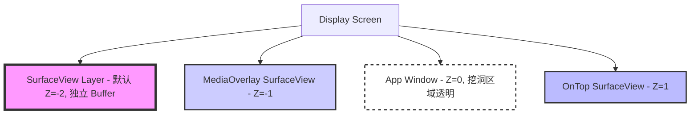
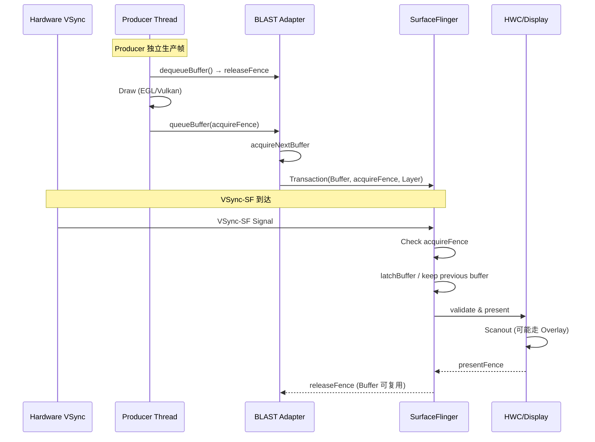

<!-- outline-start -->

**锚点（必须覆盖）：**
- [18.6.1 为什么需要 SurfaceView](#为什么需要-surfaceview) — 去耦设计的核心动机
- [18.6.2 独立 Surface 与挖洞机制](#独立-surface-与挖洞机制) — 双 Layer 架构
- [18.6.3 完整渲染链路](#完整渲染链路) — Producer → BLAST → SurfaceFlinger → HWC
- [18.6.4 BufferQueue 行为与 Triple Buffering](#bufferqueue-行为与-triple-buffering) — 独立队列的流转细节
- [18.6.5 SurfaceView vs TextureView](#surfaceview-vs-textureview) — 链路级对比与选型
- [18.6.6 HWC Overlay 与合成策略](#hwc-overlay-与合成策略) — 零 GPU 参与的直出路径
- [18.6.7 Trace 视角](#trace-视角) — Perfetto 中的识别方法
- [18.6.8 常见性能问题与优化](#常见性能问题与优化) — 实战瓶颈分析

**扩展（可选深入）：**
- BLAST 对 SurfaceView 同步问题的改善
- Camera 预览与 MediaCodec 解码的场景差异
- SurfaceView 的 resize 与几何同步

<!-- outline-end -->

## 为什么需要 SurfaceView

当你在 Perfetto 中看到 App 主线程卡了 50ms，但视频画面依然在流畅播放——你正在看的就是 SurfaceView 的效果。

SurfaceView 是 Android 历史上最高效的视图组件之一，它的核心设计理念只有一个字：**去耦**。普通 View 的渲染必须经过 App 主线程的 Measure/Layout/Draw 流程，再由 RenderThread 提交给 SurfaceFlinger。这意味着如果主线程被阻塞——比如做了一次数据库查询或 JSON 解析——整帧画面都会卡住。

SurfaceView 打破了这个限制。它拥有独立的 Surface，Producer 线程把帧送进自己的 BufferQueue，App 主线程不参与逐帧绘制。现代 Android 上，这条路通常会先经过 App 进程内的 BLASTBufferQueue / BLASTBufferItemConsumer，再由 `SurfaceControl.Transaction` 提交给 SurfaceFlinger。这就是为什么视频播放器、游戏引擎、Camera 预览几乎清一色使用 SurfaceView。[已验证: AOSP SurfaceView 实现]

SurfaceView 的代价也很明确。它在 View 树里的能力一直弱于 TextureView。旧版本里的平移、缩放和透明度支持都很受限，圆角、复杂变换、特效叠加也不自然。Android 7.0 起位置更新会和 View 渲染同步，Android 14 起支持任意 alpha 混合，但涉及复杂动画、裁剪和多层混合时，TextureView 仍然更省心。

## 独立 Surface 与挖洞机制

SurfaceView 在 WMS（Window Manager Service）侧注册为一个**独立的图层（Layer）**，与 App 的主窗口并行存在。App 的主窗口会在 SurfaceView 所在区域"挖一个洞"（Punch Through），让 SurfaceView 的独立 Layer 从下面透出来。

这种双 Layer 架构是从 Android 1.0 就存在的设计。在当时的硬件条件下，这个设计允许 SurfaceView 的内容直接走硬件 Overlay 合成，完全不消耗 GPU 资源。

### Z-Order 与图层结构

SurfaceView 的独立 Layer 默认位于 App 主窗口下方，对应 `mSubLayer = -2`。`setZOrderMediaOverlay(true)` 会把它抬到 `-1`，常用于视频之上的字幕或弹幕 Surface；`setZOrderOnTop(true)` 会把它放到 `1`，让整个 Surface 出现在宿主窗口前面：



默认的 `Z=-2` 给 `MediaOverlay` 预留了 `-1` 这一层。多 SurfaceView 叠加时，这个细节会直接影响字幕、弹幕、画中画的层级判断。

Z-Order 的位置决定了 HWC Overlay 的可行性。如果 SurfaceView 上方没有其他 UI 元素遮挡（即"挖洞"区域只有 App 主窗口的透明部分），HWC 可以将 SurfaceView Layer 作为独立 Overlay 直接输出到屏幕，这就是最省 GPU 的路径。

一旦在 SurfaceView 上方叠加了 UI 元素（比如弹幕、控制按钮），Overlay 可能失效，退化为 GPU 合成。如果你的视频播放器需要悬浮控件，就要把这部分代价算进去。

### 挖洞的实现

挖洞这件事本身一直没有消失。`SurfaceView` 在宿主 window 的绘制阶段仍会用 `CLEAR` 模式把对应矩形区域清成透明，让独立 surface 从下面露出来。版本差异主要在“洞”和 surface 内容怎么同步：

- **Android 10 及以下**：透明洞的绘制、窗口位置变化、Surface buffer 更新更容易错拍，resize / move 时更容易看到黑边、拉伸或短闪
- **Android 11+（BLASTBufferQueue）**：App 进程内的 BLAST 层先 acquire buffer，再把 buffer、fence 和几何信息打进 `SurfaceControl.Transaction` 提交给 SurfaceFlinger。它解决的是事务同步问题，不是把 `CLEAR` 挖洞替换掉

## 完整渲染链路

SurfaceView 的渲染链路可以分为三个阶段，每个阶段对应不同的线程和系统组件。与标准 Android View 链路最大的区别在于：**Producer Thread 完全独立于 App UI Thread**。

### 第一阶段：Producer Thread（生产者）

这通常是视频解码线程（MediaCodec）、Camera 数据线程或游戏逻辑线程：

1. **dequeueBuffer**：从 BufferQueue 申请一个空闲 Buffer。如果队列满了（Consumer 没来得及消费），这里会阻塞。[已验证: AOSP BufferQueue]
2. **Draw（绘制）**：
   - **Canvas 模式**：`lockCanvas()` → 在 Bitmap 上绘制 → `unlockCanvasAndPost()`。这种模式适合简单的 2D 绘制，如 AR 贴纸
   - **GLES 模式**：`eglMakeCurrent()` → `glDraw*()` → `eglSwapBuffers()`。游戏、地图常用
   - **Vulkan 模式**：`vkCmdDraw()` → `vkQueuePresentKHR()`。高性能游戏引擎使用
3. **queueBuffer**：绘制完成，将 Buffer 放回队列，通知 Consumer

Producer Thread 的关键特征是**不受 Choreographer 调度**。它不等待 VSync-App 信号，而是按照自己的节奏（视频帧率、游戏帧率、Camera 采样率）生产帧。这意味着 SurfaceView 的帧率可以与 App UI 帧率完全不同——视频以 24fps 播放时，App UI 仍然以 60fps 流畅刷新。

### 第二阶段：BLASTBufferQueue 与事务提交

在现代 Android 设备上（Android 11+），`queueBuffer()` 之后的流转通常会经过 BLASTBufferQueue：

1. **queueBuffer 到 BufferQueueProducer**：Producer 把刚画好的 Buffer 连同 `acquireFence` 送回队列
2. **BLASTBufferItemConsumer acquireNextBuffer**：App 进程内的 BLAST consumer 先取出最新 Buffer
3. **Build Transaction**：BLASTBufferQueue 组装 `SurfaceControl.Transaction`，把 Buffer、Fence、Layer 几何和可见性一并打包
4. **apply Transaction**：Transaction 通过 Binder 交给 SurfaceFlinger，等待下一次合成

BLAST 解决的是几何变化和 Buffer 更新的同步问题。旧架构里，SurfaceView resize 或移动时，主窗口里的透明洞和 Surface 自身 Buffer 往往不是同一拍提交，所以容易看到黑边、拉伸和闪烁。BLAST 把这些状态放进同一套事务里协调，问题少了很多，但在窗口频繁变化、Producer 掉帧或系统负载高时，仍然可能看到短暂抖动。[已验证: AOSP BLASTBufferQueue]

### 第三阶段：SurfaceFlinger 合成

SurfaceFlinger 在收到 Transaction 后，等待下一个 VSync-SF 信号：

1. **Check acquireFence**：确认 Producer 的绘制是否完成。如果 Fence 还没 signal，SurfaceFlinger 会跳过这个 Layer 本帧的新 Buffer，继续显示上一帧
2. **latchBuffer**：Fence 就绪后锁定当前帧的 Buffer，准备合成
3. **Composite**：将 SurfaceView Layer 与 App 主窗口（含挖洞区域）按 Z-Order 叠加
4. **HWC Present**：将合成结果提交给 Hardware Composer，最终输出到屏幕



## BufferQueue 行为与 Triple Buffering

SurfaceView 拥有独立的 BufferQueue，与 App 主窗口的 BufferQueue 完全分离。这意味着两者的 Buffer 流转互不影响——App 主线程卡顿不会占用 SurfaceView 的 Buffer，反之亦然。

### Buffer 状态流转

SurfaceView 的 BufferQueue 通常配置为 3 个 Slot（Triple Buffering）：

1. **Slot A**：正在被 Display 使用（Display 持有，Producer 不能写）
2. **Slot B**：正在被 SurfaceFlinger 持有（等待 VSync-SF 合成）
3. **Slot C**：空闲，Producer 可以 dequeue 并写入

Triple Buffering 的优势在于：当 Producer 生产速度偶尔超过 Display 刷新率时，Producer 不需要等待——它可以直接拿 Slot C 继续画。这比 Double Buffering 的吞吐量更高。

### Buffer Starvation 场景

尽管 Triple Buffering 缓解了 Buffer 压力，以下场景仍可能导致 Buffer Starvation：

- **高帧率 Producer + 低刷新率 Display**：比如 Camera 以 60fps 输出，但屏幕刷新率为 60Hz 且 SF 合成耗时较长。此时 3 个 Slot 可能全部被占用，Producer 阻塞在 `dequeueBuffer`
- **SurfaceFlinger 连续跳过新 Buffer**：如果某个 Layer 的 `acquireFence` 长时间未 ready，SF 会连续复用上一帧，Buffer 归还也会变慢

在 Trace 中，Buffer Starvation 的表现是：Producer Thread 的 `dequeueBuffer` Slice 持续很长时间，期间没有其他有效工作。

## SurfaceView vs TextureView

这是性能分析中最常被问到的问题。理解两者的架构差异，就能理解为什么 SurfaceView 在大多数场景下性能更好。

### 链路级对比

从数据流的角度，两者的核心差异可以用一句话概括：

```
SurfaceView:  Producer → BufferQueueProducer → BLASTBufferQueue / Transaction → SurfaceFlinger → HWC → Display
TextureView:  Producer → SurfaceTexture → App RenderThread → App Window BufferQueue → SurfaceFlinger → HWC → Display
                                                               ↑
                                                            多一次纹理采样与合成
```

SurfaceView 的帧数据不需要先被 App RenderThread 采样到主窗口，但现代系统里仍会经过 App 进程内的 BLAST consumer 和 transaction 提交；TextureView 的帧数据则需要经过 SurfaceTexture → App RenderThread → SurfaceFlinger 的两跳，多了一次纹理采样和同步。

### 详细对比表

| 维度 | SurfaceView | TextureView |
|:---|:---|:---|
| **Surface 类型** | 独立 Layer，有自己的 BufferQueue | 共享 App 主窗口的 Layer |
| **Buffer 消费位置** | App 进程内 BLASTBufferItemConsumer，随后以 Transaction 提交给 SF | App RenderThread 消费 SurfaceTexture，再画进主窗口 |
| **合成路径** | BufferQueue → BLAST → SF → HWC（可能走 Overlay） | SurfaceTexture → App RT → SF → HWC |
| **额外拷贝** | 无额外 App 侧拷贝 | 有一次纹理采样和再合成 |
| **主线程影响** | 主线程不参与逐帧绘制，但窗口几何变化仍会影响事务同步 | 受主线程和 RenderThread 卡顿影响 |
| **GPU 参与** | 可能完全不参与（Overlay） | 必须参与（纹理采样） |
| **灵活性** | 较低，复杂裁剪、圆角、特效不友好；N+/U+ 改善了几何同步和 alpha | 高，可当普通 View 使用 |
| **内存** | 1 个独立 BufferQueue（通常 2-3 个 Slot） | 2 个 BufferQueue（Producer 侧 + App 主窗口侧） |
| **帧率独立性** | 可独立于 App UI 帧率 | 绑定到 App UI 帧率 |
| **适用场景** | 视频/游戏/Camera 预览 | 动画/变换/嵌入复杂层级 |

### 选型建议

- **视频/游戏/Camera 预览** → **SurfaceView**（性能优先）
- **需要动画/变换/嵌入复杂层级** → **TextureView**（灵活性优先）
- **不确定** → 默认 SurfaceView，遇到限制再换

Android 11+ BLAST 同步机制成熟后，SurfaceView 的同步问题已大幅改善。若需要连续 alpha 动画、复杂变换、圆角裁剪或特效叠加，TextureView 更直接；其余视频、游戏、Camera 预览场景，SurfaceView 仍然更省功耗。

## HWC Overlay 与合成策略

SurfaceView 最强大的性能优势在于它可以走 **HWC Overlay** 路径——完全不经过 GPU 合成，直接由 Hardware Composer 将 SurfaceView Layer 输出到屏幕。

### Overlay 的条件

SurfaceView 能走 Overlay 需要满足以下条件：

1. **Z-Order 无遮挡**：SurfaceView 上方没有其他不透明的 UI 元素
2. **HWC 支持**：设备的 Hardware Composer 支持足够的 Overlay Layer（通常 3-4 个）
3. **格式兼容**：SurfaceView 的 Buffer 格式（如 NV21、RGBA8888）被 HWC 支持
4. **缩放比例合理**：如果 SurfaceView 的 Buffer 尺寸与显示区域差异过大，HWC 可能拒绝

### Overlay 失效的常见原因

1. **弹幕叠加**：在 SurfaceView 上方绘制弹幕控件 → Z-Order 有遮挡 → 退化为 GPU 合成
2. **圆角/阴影**：使用 `OutlineProvider` 设置圆角 → 不符合 Overlay 条件
3. **半透明 Activity**：SurfaceView 上方有半透明 Activity → Alpha 混合需要 GPU
4. **HWC Layer 数量超限**：设备的 HWC Overlay 数量有限（通常 3-4 个），如果 Status Bar、Navigation Bar 已经占用了 Overlay Slot，SurfaceView 可能没有位置

### 验证 Overlay 状态

通过 `adb shell dumpsys SurfaceFlinger` 可以检查 Layer 的 Composition Type：

- `Device` / `DEVICE`：HWC 硬件合成（Overlay），最优路径
- `Client` / `CLIENT`：GPU 合成，退化为普通合成
- `SOLID_COLOR`：纯色 Layer，不需要 Buffer

```bash
# 查看 SurfaceView 是否走 Overlay
adb shell dumpsys SurfaceFlinger | grep -A 5 "SurfaceView"
# 输出中寻找 "Composition type: Device" 或 "Composition type: DEVICE"
```

## Trace 视角

### 识别 SurfaceView 链路

在 Perfetto 中确认 SurfaceView 链路，看两个信号：**独立的 BufferQueue** 和 **Producer Thread 的独立性**：

1. **多个 BufferQueue Track**：在 SurfaceFlinger 进程中，你会看到至少两个 Layer——一个是 App 主窗口，一个是 SurfaceView 的独立 Layer
2. **Producer Thread 不在 App 主线程**：视频播放场景下，Producer 可能是 MediaCodec 的解码线程；游戏场景下，可能是 Unity 的 RenderThread
3. **App 主线程空闲不影响 SurfaceView**：这是最明显的特征——如果 App 主线程出现长时间阻塞（比如 GC 或 I/O 等待），但视频/Camera 画面仍在流畅更新，说明走的是 SurfaceView 的独立链路
4. **Composition Type**：在 `dumpsys SurfaceFlinger` 中查看对应 Layer 的 Composition Type

### 关键 Slice

| 位置 | 可能的 Slice/Track | 说明 |
|:---|:---|:---|
| Producer Thread | `queueBuffer`, `dequeueBuffer` | Buffer 流转状态 |
| SurfaceFlinger | `setTransactionState`, `latchBuffer` | Transaction 处理 |
| SurfaceFlinger | Layer Count > 1 | 多 Layer 存在 |
| HWC | Composition Type = DEVICE | Overlay 模式 |

### 典型场景的 Trace 模式

**视频播放**：Producer Thread 以稳定的帧间隔（24fps = ~41ms）queueBuffer。App 主线程的 `Choreographer#doFrame` 与 Producer Thread 完全解耦。

**Camera 预览**：Producer Thread 以 Camera 采样率（通常 30fps）queueBuffer。如果 Camera 处理耗时突然增大（如自动对焦），你会看到 `dequeueBuffer` 的等待时间增大。

**游戏渲染**：Producer Thread 通常以 60fps 运行，通过 EGL/Vulkan 提交。在 Perfetto 中可以看到 GLES 的 `eglSwapBuffers` 或 Vulkan 的 `vkQueuePresentKHR` 作为帧提交标记。

## 常见性能问题与优化

### 1. Buffer Starvation

**现象**：Producer Thread 频繁阻塞在 `dequeueBuffer`，Trace 中表现为长时间等待。

**原因**：BufferQueue 深度不够（默认 3 个 Slot），或者 SurfaceFlinger 消费太慢（合成压力大）。

**优化方向**：
- 降低 Producer 的生产频率（如从 60fps 降到 30fps）
- 检查 SurfaceFlinger 的合成负载，减少其他 Layer 的复杂度
- 确认 HWC Overlay 是否生效，Overlay 路径的 SF 消费速度更快

### 2. Resize 闪烁

**现象**：SurfaceView 尺寸变化时出现短暂的黑屏或内容拉伸。

**原因**：Buffer 更新和窗口几何更新没有在同一 Transaction 中提交。

**改善**：BLAST 模式（Android 11+）显著改善了这个问题。如果你在 Android 10 及以下设备上遇到此问题，延迟 Buffer 更新或减少频繁 resize 仍然是常见缓解手段。

### 3. Z-Order 冲突导致 Overlay 失效

**现象**：SurfaceView 的性能突然下降，Trace 中 Composition Type 从 `DEVICE` 变为 `CLIENT`。

**原因**：在 SurfaceView 上方叠加了 UI 元素（如弹幕、控制按钮），导致 Z-Order 不满足 Overlay 条件。

**优化方向**：
- 将叠加的 UI 元素也放到独立的 Surface 中（增加 Overlay Layer）
- 或者接受 GPU 合成的开销，改用 TextureView（如果变换需求多）
- 使用 `setZOrderOnTop(true)` 调整 Z-Order，但这会影响其他 UI 元素的显示

### 4. 首帧延迟

**现象**：SurfaceView 创建后到第一帧显示有明显延迟。

**原因**：SurfaceView 的独立 Layer 创建需要经过 WMS 的跨进程调用，加上 BufferQueue 的初始化。

**优化**：使用 `SurfaceView.getHolder().addCallback()` 监听 `surfaceCreated` 回调，在回调后才启动 Producer，避免在 Surface 就绪前就开始绘制。

---

> **交叉引用**：
> - TextureView 的 App 侧合成链路详见 [18.7 TextureView 合成链路](07-textureview.md)
> - GLES 在 SurfaceView 上的集成详见 [18.8 OpenGL ES 渲染链路](08-opengl-es.md)
> - Vulkan 在 SurfaceView 上的集成详见 [18.9 Vulkan 原生渲染链路](09-vulkan-native.md)
> - BufferQueue 机制详解详见 [2.13 BufferQueue](../../part1-fundamentals/ch02-rendering/13-buffer-queue.md)
> - SurfaceFlinger 合成策略详见 [2.6 SurfaceFlinger](../../part1-fundamentals/ch02-rendering/06-surfaceflinger.md)
> - 图形 API 演进历史详见 [2.14 图形 API 演进](../../part1-fundamentals/ch02-rendering/14-graphics-api-evolution.md)
