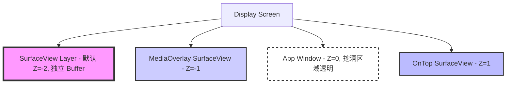
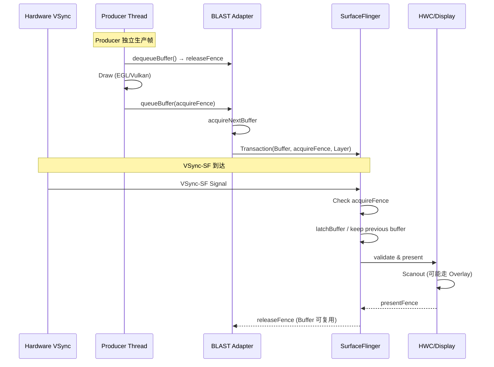

# 18.6 SurfaceView 直出路径

<!-- outline-start -->

**锚点（必须覆盖）：**
- [18.6.1 为什么需要 SurfaceView](#为什么需要-surfaceview) — 去耦设计的核心动机
- [18.6.2 独立 Surface 与挖洞机制](#独立-surface-与挖洞机制) — 双 Layer 架构
- [18.6.3 完整渲染路径](#完整渲染路径) — Producer → BLAST → SurfaceFlinger → HWC
- [18.6.4 BufferQueue 行为与 Triple Buffering](#bufferqueue-行为与-triple-buffering) — 独立队列的流转细节
- [18.6.5 SurfaceView vs TextureView](#surfaceview-vs-textureview) — 数据流对比与选型
- [18.6.6 HWC Overlay 与合成策略](#hwc-overlay-与合成策略) — 零 GPU 参与的直出路径
- [18.6.7 Trace 视角](#trace-视角) — Perfetto 中的识别方法
- [18.6.8 常见性能问题与优化](#常见性能问题与优化) — 实战瓶颈分析

**扩展（可选深入）：**
- BLAST 对 SurfaceView 同步问题的改善
- Camera 预览与 MediaCodec 解码的场景差异
- SurfaceView 的 resize 与几何同步

<!-- outline-end -->

## 为什么需要 SurfaceView

Perfetto 中如果出现 App 主线程卡了 50ms、视频画面仍然流畅播放的现象，背后通常就是 SurfaceView 的独立路径。

SurfaceView 是 Android 里效率很高的视图组件之一，设计目标是 **去耦**。普通 View 的渲染必须经过 App 主线程的 Measure/Layout/Draw 流程，再由 RenderThread 提交给 SurfaceFlinger。如果主线程被阻塞——比如做了一次数据库查询或 JSON 解析——整帧画面都会卡住。

SurfaceView 打破了这个限制。它拥有独立的 Surface，Producer 线程把帧送进自己的 BufferQueue，App 主线程不参与逐帧绘制。现代 Android 上，这条路通常会先经过 App 进程内的 BLASTBufferQueue / BLASTBufferItemConsumer，再由 `SurfaceControl.Transaction` 提交给 SurfaceFlinger。这也是视频播放器、游戏引擎、Camera 预览通常优先使用 SurfaceView 的原因。[已验证: AOSP SurfaceView 实现]

SurfaceView 的代价也很明确。它在 View 树里的能力一直弱于 TextureView。旧版本里的平移、缩放和透明度支持都很受限，圆角、复杂变换、特效叠加也不自然。Android 7.0 起位置更新会和 View 渲染同步，Android 14 起支持任意 alpha 混合。圆角能力需要按 Android 11/12+ 的 `setCornerRadius()` 与具体设备合成能力判断；缺少源码差异时，不把它归因到 Android 15 的新增同步机制。涉及复杂动画、裁剪和多层混合时，TextureView 的实现成本仍然更低。

## 独立 Surface 与挖洞机制

SurfaceView 在 WMS（Window Manager Service）侧注册为一个**独立的图层（Layer）**，与 App 的主窗口并行存在。App 的主窗口会在 SurfaceView 所在区域"挖一个洞"（Punch Through），让 SurfaceView 的独立 Layer 从下面透出来。

双 Layer 架构从 Android 1.0 就存在。早期版本里 Layer 注册和 Buffer 管理完全由 WMS 的 `WindowState` / `WindowSurfacePlacer` 控制。Android 12（S）起，SurfaceView 的 Layer 创建路径切换到 `SurfaceView.updateSurface()` → `createBlastSurfaceControls()`，通过 `SurfaceControl.Builder()` 创建 container layer、BLAST layer 和 background layer，并 parent 到 ViewRootImpl 的 bounds layer。Android 11 虽然为 ViewRootImpl 引入了 BLASTBufferQueue，但 SurfaceView 在 Android 11 上仍使用旧窗口模型创建 Layer——WMS 侧的 `WindowState` 仍然参与 SurfaceView 的 Surface 分配。现代结构为：

```text
ViewRootImpl bounds layer
  └─ SurfaceView container layer
       ├─ BLAST layer (SurfaceView 内容)
       └─ background layer (挖洞背景色)
```

BLASTBufferQueue 在 App 进程内 acquire buffer，再通过 `SurfaceControl.Transaction` 提交给 SurfaceFlinger。这种模式下 Layer 的创建和 buffer 流转都在 SurfaceControl 框架内完成，不再依赖 WMS 的独立窗口模型。[已验证: AOSP `android-12.0.0_r1` SurfaceView.updateSurface / createBlastSurfaceControls；`android-11.0.0_r1` SurfaceView 仍使用旧 Window 模型]

### Z-Order 与图层结构

SurfaceView 的独立 Layer 默认位于 App 主窗口下方，对应 `mSubLayer = -2`。`setZOrderMediaOverlay(true)` 会把它抬到 `-1`，常用于视频之上的字幕或弹幕 Surface；`setZOrderOnTop(true)` 会把它放到 `1`，让整个 Surface 出现在宿主窗口前面：



默认的 `Z=-2` 给 `MediaOverlay` 预留了 `-1` 这一层。多 SurfaceView 叠加时，这个细节会直接影响字幕、弹幕、画中画的层级判断。

#### Android 14 起的 alpha 语义

Android 14 起，`SurfaceView#setAlpha()` 支持 0 到 1 之间的连续透明度。alpha 的作用位置取决于 Z-Order：

- **默认 Z-Below / MediaOverlay**：Surface 位于宿主窗口下方，alpha 作用在宿主 window 的 punch-through 区域。系统改变的是透明洞的混合比例，独立 Surface 内容仍按自己的 buffer 输出。
- **`setZOrderOnTop(true)`**：Surface 位于宿主窗口上方，alpha 作用在 Surface 内容本身。这个模式适合让 Surface 内容半透明覆盖在 UI 上，但宿主窗口里的普通 View 不能再盖到它上面。

排查半透明 SurfaceView 时，要同时看 `setZOrderOnTop()`、Surface buffer 格式和 `dumpsys SurfaceFlinger` 中的 Composition Type。alpha 混合可能让原本可走 DEVICE 的 layer 退回 CLIENT，具体结果取决于 SoC 的 HWC 能力、上层遮挡和 buffer 格式。

Z-Order 的位置决定了 HWC Overlay 的可行性。如果 SurfaceView 上方没有其他 UI 元素遮挡（即"挖洞"区域只有 App 主窗口的透明部分），HWC 可以将 SurfaceView Layer 作为独立 Overlay 直接输出到屏幕，这是 GPU 成本最低的路径。

一旦在 SurfaceView 上方叠加了 UI 元素（比如弹幕、控制按钮），Overlay 可能失效，退化为 GPU 合成。视频播放器需要悬浮控件时，需要把这部分合成代价算进去。

### 挖洞的实现

挖洞这件事本身一直没有消失。旧资料常用 `CLEAR` / transparent region 理解宿主 window 的透明洞；Android 11 的 `clearSurfaceViewPort()` 仍走 `drawColor(..., PorterDuff.Mode.CLEAR)`，Android 12+ 对圆角洞改用 `Canvas.punchHole(...)`，Android 14+ 再把 alpha 参数纳入 punch-hole 路径。版本差异主要在“洞”和 surface 内容怎么同步：

- **Android 11（R）**：ViewRootImpl 已引入 BLASTBufferQueue，但 SurfaceView 仍通过 WMS 的 `WindowState` 分配 Surface；透明洞和 Buffer 更新错拍问题改善有限
- **Android 12+（S，BLASTBufferQueue）**：SurfaceView 正式采用 `createBlastSurfaceControls()` 在 App 进程内创建 container layer / BLAST layer / background layer。App 进程内的 BLAST 层先 acquire buffer，再把 buffer、fence 和几何信息打进 `SurfaceControl.Transaction` 提交给 SurfaceFlinger。SurfaceFlinger 侧的 BufferStateLayer/Layer 状态更新会在同一个事务边界里处理 buffer 与几何变化。它解决事务同步问题，宿主窗口的挖洞语义仍保留

## 完整渲染路径

SurfaceView 的渲染路径可以分为三个阶段，每个阶段对应不同的线程和系统组件。与标准 Android View 路径最大的区别在于：**Producer Thread 完全独立于 App UI Thread**。

### 第一阶段：Producer Thread（生产者）

这通常是视频解码线程（MediaCodec）、Camera 数据线程或游戏逻辑线程：

1. **dequeueBuffer**：从 BufferQueue 申请一个空闲 Buffer。如果队列满了（Consumer 没来得及消费），这里会阻塞。[已验证: AOSP BufferQueue]
   - **内部锁机制**：`BufferQueueProducer::waitForFreeSlotThenRelock()`（行 297）持有 `BufferQueueCore::mMutex` 的情况下等待——这把互斥锁同时保护 `mSlots[]`、`mFreeSlots`/`mFreeBuffers`/`mActiveBuffers` 三套 Slot 集合，以及 `mQueue` FIFO。Consumer 的 `releaseBuffer()`（行 480）通过 `mDequeueCondition.notify_all()` 唤醒等待中的 Producer。[已验证: AOSP BufferQueueProducer.cpp]
   - **O(n) 热点**：每次 `waitForFreeSlotThenRelock` 重试都要遍历 `mActiveBuffers` 集合统计 dequeued/acquired 数量（默认 Slot=4），n 越大竞争越激烈
   - **Android 16+ 变化**：`BUFFER_RELEASE_CHANNEL` flag 引入 `notifyBufferReleased()` 包装点；但 `android-16.0.0_r1` / master 中 `BufferQueueCore::notifyBufferReleased()` 仍调用 `mDequeueCondition.notify_all()`，不能写成已经实现的精确唤醒优化
   - **Allocation 期间释放锁**：`mIsAllocating=true` 时 `waitWhileAllocatingLocked()` 主动释放 `mMutex`，避免 GraphicBuffer 分配 I/O 导致全局阻塞——这能防止分配期间整个 BufferQueue 冻结
2. **Draw（绘制）**：
   - **Canvas 模式**：`lockCanvas()` → 在 Bitmap 上绘制 → `unlockCanvasAndPost()`。这种模式适合简单的 2D 绘制，如 AR 贴纸
   - **GLES 模式**：`eglMakeCurrent()` → `glDraw*()` → `eglSwapBuffers()`。游戏、地图常用
   - **Vulkan 模式**：`vkCmdDraw()` → `vkQueuePresentKHR()`。高性能游戏引擎使用
3. **queueBuffer**：绘制完成，将 Buffer 放回队列，通知 Consumer

SurfaceView 解耦的是独立 Surface/BufferQueue 与 View hierarchy 的逐帧绘制——Producer Thread 不需要经过 App 主窗口的 RenderThread 采样。但 Producer 本身的帧节奏取决于内容类型：

- **视频硬解**（MediaCodec）：按媒体时钟推帧，帧率由视频源决定（24/30/60fps），与 App 的 Choreographer 完全独立
- **Camera 预览**：按 sensor/HAL cadence 输出（通常 30fps），同样独立于 App 的 VSync 节奏
- **游戏/地图**（App 内 EGL/Vulkan Producer）：虽然不经过 App 主窗口 RenderThread，但 Producer 本身仍可由 Choreographer、AChoreographer、Swappy/Frame Pacing 或引擎内部时钟驱动——Producer 与 VSync 的关系取决于内容类型

因此 SurfaceView 的帧率可以与 App UI 帧率不同（视频以 24fps 播放时，App UI 仍以 60fps 刷新），但「Producer 不受 Choreographer 调度」这个说法只对视频和 Camera 成立，对游戏类 Producer 过于绝对。

### 第二阶段：BLASTBufferQueue 与事务提交

在现代 Android 设备上（Android 12+，SurfaceView BLAST 路径），`queueBuffer()` 之后的流转会经过 BLASTBufferQueue：

1. **queueBuffer 到 BufferQueueProducer**：Producer 把刚画好的 Buffer 连同 `acquireFence` 送回队列
2. **BLASTBufferItemConsumer acquireNextBuffer**：App 进程内的 BLAST consumer 先取出最新 Buffer
3. **Build Transaction**：BLASTBufferQueue 组装 `SurfaceControl.Transaction`，把 Buffer、Fence、Layer 几何和可见性一并打包
4. **apply Transaction**：Transaction 通过 Binder 交给 SurfaceFlinger，等待下一次合成

BLAST 解决的是几何变化和 Buffer 更新的同步问题。旧架构里，SurfaceView resize 或移动时，主窗口里的透明洞和 Surface 自身 Buffer 往往不是同一拍提交，所以容易看到黑边、拉伸和闪烁。BLAST 把这些状态放进同一套事务里协调，问题少了很多，但在窗口频繁变化、Producer 掉帧或系统负载高时，仍然可能看到短暂抖动。[已验证: AOSP BLASTBufferQueue]

### 第三阶段：SurfaceFlinger 合成

SurfaceFlinger 在收到 Transaction 后，等待下一个 VSync-SF 信号：

1. **Check acquireFence**：确认 Producer 的绘制是否完成。如果 Fence 还没 signal，SurfaceFlinger 会跳过这个 Layer 本帧的新 Buffer，继续显示上一帧
2. **latchBuffer**：Fence 就绪后锁定当前帧的 Buffer，准备合成
3. **Composite**：将 SurfaceView Layer 与 App 主窗口（含挖洞区域）按 Z-Order 叠加
4. **HWC Present**：将合成结果提交给 Hardware Composer，最终输出到屏幕



## BufferQueue 行为与 Triple Buffering

SurfaceView 拥有独立的 BufferQueue，与 App 主窗口的 BufferQueue 完全分离。两者的 Buffer 流转互不影响——App 主线程卡顿不会占用 SurfaceView 的 Buffer，反之亦然。

### Buffer 状态流转

SurfaceView 的 BufferQueue 通常配置为 3 个 Slot（Triple Buffering）：

1. **Slot A**：正在被 Display 使用（Display 持有，Producer 不能写）
2. **Slot B**：正在被 SurfaceFlinger 持有（等待 VSync-SF 合成）
3. **Slot C**：空闲，Producer 可以 dequeue 并写入

Triple Buffering 的优势在于：当 Producer 生产速度偶尔超过 Display 刷新率时，Producer 不需要等待——它可以直接拿 Slot C 继续画。这比 Double Buffering 的吞吐量更高。

### Buffer Starvation 场景

尽管 Triple Buffering 缓解了 Buffer 压力，以下场景仍可能导致 Buffer Starvation：

- **高帧率 Producer + 低刷新率 Display**：比如 Camera 以 60fps 输出，但屏幕刷新率为 60Hz 且 SF 合成耗时较长。此时 3 个 Slot 可能全部被占用，Producer 阻塞在 `dequeueBuffer`
- **SurfaceFlinger 连续跳过新 Buffer**：如果某个 Layer 的 `acquireFence` 长时间未 ready，SF 会连续复用上一帧，Buffer 归还也会变慢

在 Trace 中，Buffer Starvation 的表现是：Producer Thread 的 `dequeueBuffer` Slice 持续很长时间，期间没有其他有效工作。

## SurfaceView vs TextureView

这是性能分析中的高频问题。理解两者的架构差异，就能理解为什么 SurfaceView 在大多数场景下性能更好。

### 数据流对比

从数据流看，两者的差异如下：

```text
SurfaceView:  Producer → BufferQueueProducer → BLASTBufferQueue / Transaction → SurfaceFlinger → HWC → Display
TextureView:  Producer → SurfaceTexture → App RenderThread → App Window BufferQueue → SurfaceFlinger → HWC → Display
                                                               ↑
                                                            多一次纹理采样与合成
```

SurfaceView 的帧数据不需要先被 App RenderThread 采样到主窗口，但现代系统里仍会经过 App 进程内的 BLAST consumer 和 transaction 提交；TextureView 的帧数据则需要经过 SurfaceTexture → App RenderThread → SurfaceFlinger 的两跳，多了一次纹理采样和同步。

### 详细对比表

| 维度 | SurfaceView | TextureView |
|:---|:---|:---|
| **Surface 类型** | 独立 Layer，有自己的 BufferQueue | 共享 App 主窗口的 Layer |
| **Buffer 消费位置** | App 进程内 BLASTBufferItemConsumer，随后以 Transaction 提交给 SF | App RenderThread 消费 SurfaceTexture，再画进主窗口 |
| **合成路径** | BufferQueue → BLAST → SF → HWC（可能走 Overlay） | SurfaceTexture → App RT → SF → HWC |
| **额外拷贝** | 无额外 App 侧拷贝 | 有一次纹理采样和再合成 |
| **主线程影响** | 主线程不参与逐帧绘制，但窗口几何变化仍会影响事务同步 | 受主线程和 RenderThread 卡顿影响 |
| **GPU 参与** | 可能完全不参与（Overlay） | 必须参与（纹理采样） |
| **灵活性** | 较低，复杂裁剪、圆角、特效不友好；N+/U+ 改善了几何同步和 alpha | 高，可当普通 View 使用 |
| **内存** | 1 个独立 BufferQueue（通常 2-3 个 Slot） | 2 个 BufferQueue（Producer 侧 + App 主窗口侧） |
| **帧率独立性** | 可独立于 App UI 帧率 | 绑定到 App UI 帧率 |
| **适用场景** | 视频/游戏/Camera 预览 | 动画/变换/嵌入复杂层级 |

### 选型建议

- **视频/游戏/Camera 预览** → **SurfaceView**（性能优先）
- **需要动画/变换/嵌入复杂层级** → **TextureView**（灵活性优先）
- **不确定** → 默认 SurfaceView，遇到限制再换

Android 12+ BLAST 路径成熟后，SurfaceView 的同步问题已改善。若需要连续 alpha 动画、复杂变换、圆角裁剪或特效叠加，TextureView 更直接；其余视频、游戏、Camera 预览场景，SurfaceView 仍然更省功耗。

## HWC Overlay 与合成策略

SurfaceView 的主要性能优势在于它可以走 **HWC Overlay** 路径——完全不经过 GPU 合成，直接由 Hardware Composer 将 SurfaceView Layer 输出到屏幕。

### Overlay 的条件

SurfaceView 能走 Overlay 需要同时满足下面这几条。视频和相机这两类典型场景，HWC 的判断会比普通 RGBA layer 更严格：

1. **Z-Order 无遮挡**：SurfaceView 上方没有其他不透明的 UI 元素。
2. **Buffer 格式兼容**：YUV 格式（如 NV12 / NV21 / P010）通常比 RGBA 更容易被 overlay plane 直接接受，是视频路径的常态；不在 HWC 支持列表里的格式会回退。
3. **DRM / HDCP 保护内容**：必须走 secure overlay 或 secure composition 路径；路径错了会直接表现为黑屏或拒播。
4. **Overlay plane 数量上限**：HWC 提供的 plane 通常 3-4 个，同屏活跃 layer 超过上限时多出来的会回退为 client composition。Status Bar / Navigation Bar 已经占用 slot 时，留给 SurfaceView 的余量更小。
5. **缩放比例与旋转**：超出 HWC scaler 能力或不支持的旋转会触发回退。
6. **色彩空间与 HDR**：不在 HWC 支持列表里的色域 / HDR 元数据会触发 GPU 端的 tone mapping，结果也是回退到 client 合成。

[已验证: AOSP `frameworks/native/services/surfaceflinger/DisplayHardware/HWComposer.cpp` `validateLayerCompositionTypes` 条件 + Android Graphics Architecture overlay 章节]

### Overlay 失效的常见原因

1. **弹幕叠加**：在 SurfaceView 上方绘制弹幕控件 → Z-Order 有遮挡 → 退化为 GPU 合成
2. **圆角/阴影**：使用 `OutlineProvider` 设置圆角 → 不符合 Overlay 条件
3. **半透明 Activity**：SurfaceView 上方有半透明 Activity → Alpha 混合需要 GPU
4. **HWC Layer 数量超限**：设备的 HWC Overlay 数量有限（通常 3-4 个），如果 Status Bar、Navigation Bar 已经占用了 Overlay Slot，SurfaceView 可能没有位置

### 验证 Overlay 状态

通过 `adb shell dumpsys SurfaceFlinger` 可以检查 Layer 的 Composition Type：

- `Device` / `DEVICE`：HWC 硬件合成（Overlay），最优路径
- `Client` / `CLIENT`：GPU 合成，退化为普通合成
- `SOLID_COLOR`：纯色 Layer，不需要 Buffer

```bash
# 查看 SurfaceView 是否走 Overlay
adb shell dumpsys SurfaceFlinger | grep -A 5 "SurfaceView"
# 输出中寻找 "Composition type: Device" 或 "Composition type: DEVICE"
```

## Trace 视角

### 识别 SurfaceView 路径

在 Perfetto 中确认 SurfaceView 路径，看两个信号：**独立的 BufferQueue** 和 **Producer Thread 的独立性**：

1. **多个 BufferQueue Track**：在 SurfaceFlinger 进程中，通常能看到至少两个 Layer——一个是 App 主窗口，一个是 SurfaceView 的独立 Layer
2. **Producer Thread 不在 App 主线程**：Producer 出现的进程取决于内容来源——
   - **MediaCodec / 视频硬解**：常见在 `media.codec` / `media.swcodec`、Codec2 vendor service、厂商 codec HAL 进程，应用进程往往只看到 output Surface 的回调
   - **Camera 预览**：常见在 `cameraserver`、camera provider / HAL 或厂商 camera 进程
   - **游戏引擎 / 地图 / 原生图形**：常见在应用进程内自己的渲染线程，也可能再分出引擎线程或 native 线程池
   
   排查时不要只盯应用主进程，要按 Producer 身份切到对应进程再看 `dequeueBuffer` / `queueBuffer` slice
3. **App 主线程空闲不影响 SurfaceView**：这是典型特征——如果 App 主线程出现长时间阻塞（比如 GC 或 I/O 等待），但视频/Camera 画面仍在流畅更新，说明走的是 SurfaceView 的独立路径
4. **Composition Type**：在 `dumpsys SurfaceFlinger` 中查看对应 Layer 的 Composition Type

### 关键 Slice

| 位置 | 可能的 Slice/Track | 说明 |
|:---|:---|:---|
| Producer Thread | `queueBuffer`, `dequeueBuffer` | Buffer 流转状态 |
| SurfaceFlinger | `setTransactionState`, `latchBuffer` | Transaction 处理 |
| SurfaceFlinger | Layer Count > 1 | 多 Layer 存在 |
| HWC | Composition Type = DEVICE | Overlay 模式 |

### 典型场景的 Trace 模式

**视频播放**：Producer Thread 以稳定的帧间隔（24fps = ~41ms）queueBuffer。App 主线程的 `Choreographer#doFrame` 与 Producer Thread 完全解耦。

**Camera 预览**：Producer Thread 以 Camera 采样率（通常 30fps）queueBuffer。如果 Camera 处理耗时突然增大（如自动对焦），Trace 中会出现 `dequeueBuffer` 等待时间增长。

**游戏渲染**：Producer Thread 通常以 60fps 运行，通过 EGL/Vulkan 提交。在 Perfetto 中，GLES 的 `eglSwapBuffers` 或 Vulkan 的 `vkQueuePresentKHR` 可以作为帧提交标记。

## 常见性能问题与优化

### 1. Buffer Starvation

**现象**：Producer Thread 频繁阻塞在 `dequeueBuffer`，Trace 中表现为长时间等待。

**原因**：BufferQueue 深度不够（默认 3 个 Slot），或者 SurfaceFlinger 消费太慢（合成压力大）。

**优化方向**：
- 降低 Producer 的生产频率（如从 60fps 降到 30fps）
- 检查 SurfaceFlinger 的合成负载，减少其他 Layer 的复杂度
- 确认 HWC Overlay 是否生效，Overlay 路径的 SF 消费速度更快

### 2. Resize 闪烁

**现象**：SurfaceView 尺寸变化时出现短暂的黑屏或内容拉伸。

**原因**：Buffer 更新和窗口几何更新没有在同一 Transaction 中提交。

**改善**：BLAST 模式（Android 12+）减少了 resize 错拍问题。Android 11 及以下设备出现此问题时，延迟 Buffer 更新或减少频繁 resize 仍然是常见缓解手段。

### 3. Z-Order 冲突导致 Overlay 失效

**现象**：SurfaceView 的性能突然下降，Trace 中 Composition Type 从 `DEVICE` 变为 `CLIENT`。

**原因**：在 SurfaceView 上方叠加了 UI 元素（如弹幕、控制按钮），导致 Z-Order 不满足 Overlay 条件。

**优化方向**：
- 将叠加的 UI 元素也放到独立的 Surface 中（增加 Overlay Layer）
- 或者接受 GPU 合成的开销，改用 TextureView（如果变换需求多）
- 使用 `setZOrderOnTop(true)` 调整 Z-Order，但这会影响其他 UI 元素的显示

### 4. 首帧延迟

**现象**：SurfaceView 创建后到第一帧显示有明显延迟。

**原因**（按版本拆开）：

- **Android 10 及以下**：SurfaceView 的独立 Layer 注册和位置同步依赖 WMS 的 `WindowState` / `WindowSurfacePlacer` 跨进程协调。Layer 创建、BufferQueue 初始化、窗口位置同步分别由不同模块处理，容易错拍——首帧延迟主要来自这个跨进程窗口模型的协调开销
- **Android 11**：App 主窗口已有 ViewRootImpl BLAST，但 SurfaceView 仍走旧窗口模型创建 Layer。排查首帧时要把 App Window BLAST 和 SurfaceView BLAST 分开看
- **Android 12+（BLAST/SurfaceControl）**：SurfaceView 通过 `updateSurface()` → `createBlastSurfaceControls()` 在 App 进程内创建 container layer、BLAST layer 和 background layer，并 parent 到 ViewRootImpl 的 bounds layer。首帧延迟的构成变成：ViewRoot/window 就绪 → SurfaceControl/BLASTBufferQueue 初始化 → Transaction 提交到 SurfaceFlinger → Producer 第一帧 buffer/fence 就绪。每一步都有明确的边界，但 BLAST 模式下的同步协调比旧模型可靠得多

**优化**：使用 `SurfaceView.getHolder().addCallback()` 监听 `surfaceCreated` 回调，在回调后才启动 Producer，避免在 Surface 就绪前就开始绘制。

### 5. 输入延迟分析

SurfaceView 本身不改变输入事件的基础路径——触控事件仍然走 InputDispatcher → App 主线程 → View 树遍历这条标准路径。SurfaceView 解耦的是渲染，不是输入。

但输入延迟最终会反映到画面更新上，这个端到端路径可以拆成四段来分析：

1. **InputDispatcher → App 主线程**：InputDispatcher 将触控事件分发到 App 的 InputConsumer，App 主线程从 NativeInputEventReceiver 读事件。这一段的延迟取决于 InputDispatcher 的 ANR 超时配置、App 主线程是否被阻塞、以及是否有其他窗口优先消费事件
2. **App 主线程处理 → Producer 帧提交**：App 收到输入后更新状态（如游戏角色位置、Camera 对焦区域），Producer Thread 根据新状态生成下一帧。这一段的延迟取决于 Producer 的帧节奏和 App→Producer 的数据传递方式
3. **Producer 帧节奏**：视频按媒体时钟、Camera 按 sensor/HAL cadence 推帧，这两类 Producer 与输入事件无直接关系——用户触控不会改变视频帧率或 Camera 输出节奏。但游戏/地图类 App 内的 EGL/Vulkan Producer 通常由 Choreographer 或引擎时钟驱动，输入事件可能触发下一帧提前提交
4. **BufferQueue 堆积**：如果 Producer 生产速度超过 SurfaceFlinger 消费速度，队列中堆积的帧会增加「从 Producer 画完到用户看到」的延迟。Triple Buffering 缓解了 Producer 阻塞，但不会减少已有帧的等待时间

排查 SurfaceView 场景下的输入延迟，应按这四段分别找瓶颈：主线程卡顿在 Perfetto 中看 doFrame 耗时，Producer 帧节奏看 queueBuffer 间隔，BufferQueue 堆积看 acquire fence signal 时间与 VSync-SF 的关系。

---

> **交叉引用**：
> - TextureView 的 App 侧合成路径详见 [18.7 TextureView 合成路径](07-textureview.md)
> - GLES 在 SurfaceView 上的集成详见 [18.8 OpenGL ES 渲染路径](08-opengl-es.md)
> - Vulkan 在 SurfaceView 上的集成详见 [18.9 Vulkan 原生渲染路径](09-vulkan-native.md)
> - BufferQueue 机制详解详见 [2.13 BufferQueue](../../part1-fundamentals/ch02-rendering/13-buffer-queue.md)
> - SurfaceFlinger 合成策略详见 [2.6 SurfaceFlinger](../../part1-fundamentals/ch02-rendering/06-surfaceflinger.md)
> - 图形 API 演进历史详见 [2.14 图形 API 演进](../../part1-fundamentals/ch02-rendering/14-graphics-api-evolution.md)
