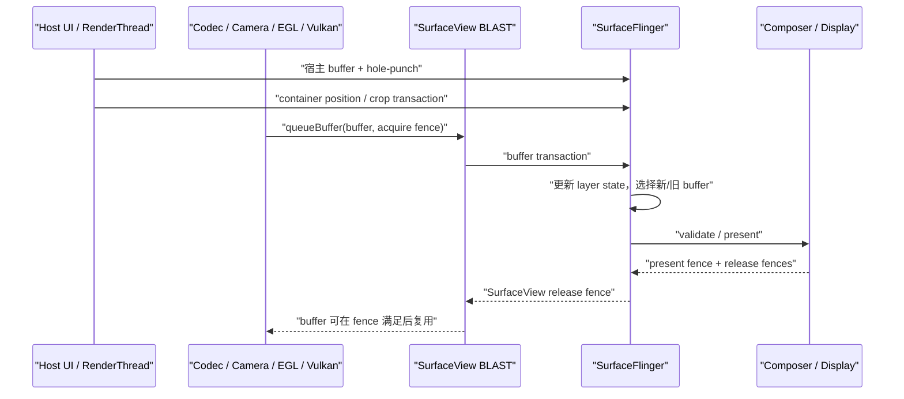

# 18.6 Android 17 SurfaceView 独立 Surface 路径

## 为什么需要 SurfaceView

SurfaceView 让主体内容无须先画进宿主窗口的 buffer。这里的宿主窗口，是包含 SurfaceView 和其他普通 View 的 App Window；视频解码器、Camera 或 EGL/Vulkan 渲染线程等 Producer（内容生产方）可以向另一条独立的 buffer 队列提交内容。控制条、遮罩等普通 View 仍由宿主窗口的主线程与 RenderThread 生成。下面的简图用于区分两条内容生产线：

```text
宿主窗口：Choreographer → UI Thread → RenderThread → Host BufferQueue
主体内容：Codec / Camera / EGL / Vulkan Producer → SurfaceView BufferQueue
                                                    ↓
                                      SurfaceFlinger → HWC → Display
```

这张简图划分的是像素归属。SurfaceView 页面仍有主线程、RenderThread 和宿主窗口；“独立”表示主体像素拥有自己的 Surface、BufferQueue 和 SF layer。页面本身仍受 ViewRoot 管理，内容 Producer 也可能就在应用进程内。

这套结构带来三项直接收益：

- 主体内容可以采用与宿主 UI 不同的帧率。低帧率视频无须迫使宿主窗口按同样节奏重画，宿主窗口刷新时也不要求视频每轮都提供新 buffer。
- 主体内容不经过宿主 RenderThread 的纹理采样。对视频、相机等大面积内容，这可能减少 GPU 工作和内存带宽。
- SurfaceFlinger 能把主体作为独立 layer 交给 HWC（Hardware Composer，硬件合成器）评估。设备条件满足时可使用 DEVICE composition，由显示硬件直接参与合成；条件不满足时则可能进入 CLIENT composition，由 RenderEngine 先生成整屏合成所需的 client target。

这些收益都有适用边界。主线程卡住时，已有视频帧仍可能继续更新，但 SurfaceView 的布局、裁剪、透明洞、控制条和生命周期处理可能停在旧状态。独立 layer 只获得被 HWC 单独评估的机会，不保证一定使用 Overlay（硬件叠加层），也不保证功耗或时延一定更低。分析时要分别回答三个问题：内容是否继续生产、宿主几何是否更新、本轮采用何种合成方式。

SurfaceView 适合主体像素由独立 Producer 持续提供的场景，例如：

- MediaCodec 或 Codec2 的视频输出；
- Camera preview stream（相机预览流）；
- 游戏、地图或可视化引擎的 EGL/Vulkan 输出；
- 需要 secure/protected（防截取并受硬件保护）显示链路的内容；
- 通过 `SurfaceControlViewHost` 嵌入的远端 View 层级。

如果内容需要频繁参与普通 View 的旋转、复杂裁剪、着色器效果或父子透明度动画，TextureView 往往更容易实现。选型依据应是像素归属、变换需求和目标设备的合成能力，不能套用“视频用 SurfaceView、动画用 TextureView”这样的固定规则。

## 独立 Surface 与挖洞机制

### Android 17 的对象结构

在 `android-17.0.0_r1` 中，`SurfaceView.createBlastSurfaceControls()` 维护的主要对象如下：

```text
ViewRootImpl bounds layer
  └─ mSurfaceControl：SurfaceView container
       ├─ mBlastSurfaceControl：BLAST buffer layer
       └─ mBackgroundControl：background color layer
```

这里要区分组织层和内容层。`mSurfaceControl` 是不携带像素的 container，负责 SurfaceView 子树的位置、变换、裁剪、相对层级和部分视觉状态；`mBlastSurfaceControl` 是承载 Producer buffer 的内容层；`mBackgroundControl` 是 container 下方的纯色背景层。Android 17 的 `updateBackgroundVisibility()` 只在 `mSubLayer < 0`（内容位于宿主下方）、内容层带 `OPAQUE`（不透明）标志且背景层未被禁用时显示它。`mBlastBufferQueue` 通过 `update()` 把内容层的尺寸、格式与生产端 `Surface` 关联起来。

Java `SurfaceView` 位于应用进程，但 buffer 填充者不一定也在该进程。应用内游戏线程可以直接使用 `Surface`，MediaCodec、Camera 或嵌入式层级也可能由系统服务和厂商组件参与生产。确认 Producer 身份时，应沿目标 BufferQueue 的 connect、dequeue、queue、fence 和 layer id 回溯，不能根据常见进程名猜测。

### 默认 Z-below 与透明洞

SurfaceView 默认采用 Z-below，即内容层位于宿主窗口下方。如果宿主窗口仍在同一矩形内绘制不透明像素，下面的内容就会被遮住，因此 HWUI 需要在宿主 buffer 中留出透明区域，也就是 hole-punch（挖洞）。Android 17 的关键实现包括：

- `gatherTransparentRegion()` 把 SurfaceView 的可见矩形加入宿主窗口的透明区域；
- `draw()` 或 `dispatchDraw()` 在 `mDrawFinished && !isAboveParent()` 时调用 `clearSurfaceViewPort()`；
- `clearSurfaceViewPort()` 使用 `Canvas.punchHole()` 清理对应像素，并把圆角、clip bounds 与 alpha 纳入透明区域参数；
- `mDrawFinished` 为 `false` 时不会打洞；`surfaceRedrawNeededAsync` 要求的所有重绘回调结束后，该字段才会变为 `true`。

“挖洞”不会创建一个黑色 View，也不会把视频像素复制到宿主窗口。宿主 buffer 只在对应区域保留透明度，SurfaceFlinger 随后按 layer 层级合成宿主与 SurfaceView 内容。

`mDrawFinished` 只能证明 framework 认为 redraw callback 阶段已经结束，无法证明 Producer 已 queue 第一块 buffer，也无法证明 SurfaceFlinger 已经 latch（为本次合成选中）该 buffer 或 HWC 已 present。分析首帧时，仍要依次检查 Producer connection、第一笔 buffer transaction、acquire fence、layer 可见性和目标 Display 的 present。

Z-above 时，SurfaceView 位于宿主窗口之上，无须在宿主 buffer 中打洞；相应地，宿主窗口里的普通 View 也无法覆盖在它上面。Android 17 推荐用 `setCompositionOrder(int)` 表达层叠关系：负数位于宿主下方，非负数位于宿主上方；同级 SurfaceView 中数值更大的 peer 更高，相同值的顺序未定义。旧的 `setZOrderMediaOverlay()` 与 `setZOrderOnTop()` 已标记为 deprecated，阅读遗留代码时仍需理解其语义。

### alpha、HDR、composition order 与 blur

Android 12 到 Android 17 的现代主线可按下表理解：

| 平台 | SurfaceView 相关变化 | 分析含义 |
|---|---|---|
| Android 12 / API 31 | container、BLAST child、background 与 RenderNode 位置同步成为稳定分析基线 | 几何 transaction 与内容 buffer 要按不同 layer 观察 |
| Android 13 / API 33 | 主体结构延续 | 设备差异仍要核对厂商 Composer、gralloc（图形内存分配器）与 Producer，不能预设 AOSP 拓扑已经换代 |
| Android 14 / API 34 | 支持任意 alpha；公开 `setSurfaceLifecycle()` | Z-below 的 alpha 调节透明洞的混合比例，Z-above 的 alpha 作用于 Surface 内容；生命周期可以跟随 visibility 或 attachment |
| Android 15 / API 35 | 增加 `setDesiredHdrHeadroom()` | 该值表达 SurfaceView 期望的 HDR 亮度余量，结果仍受面板、bit depth（位深）、环境和系统策略约束 |
| Android 16 / API 36 | 增加 `setCompositionOrder()` | 多个 SurfaceView 的相对关系可以用整数表达；相同 order 没有稳定顺序 |
| Android 17 / API 37 | 增加 `setBlurRegions()` | blur 坐标相对 SurfaceView bounds，尺寸变化后调用方需要更新；最终位置还受 scale、crop 与几何 transaction 影响 |

Z-below 的 alpha 不会改写内容 buffer 中的 alpha 通道，而会调节宿主透明洞与内容层之间的混合比例。多个位于宿主下方的 SurfaceView 相互重叠时，其结果也不同于普通 View 按父子顺序逐层混合。排查叠加异常时，要同时记录 composition order、宿主 hole-punch、内容层 alpha 与 HWC composition type（DEVICE 或 CLIENT 等合成类型）。

### 生命周期是 Producer 的硬边界

Activity 可见、View 已 attach（接入 View 层级）和底层 `Surface` 有效，是三个不同状态。Producer 只能在 `surfaceCreated()` 到 `surfaceDestroyed()` 之间使用当前 Surface；`surfaceDestroyed()` 返回后，渲染线程不得继续访问它。如果 Producer 位于工作线程或远端服务，销毁回调必须等到旧连接停止使用 Surface，不能只异步发送一条 stop 消息就返回。

下面的代码用应用自有接口表达所有权边界，`FrameProducer` 不是 Android SDK 类型：

```kotlin
private interface FrameProducer {
    fun attach(surface: Surface)
    fun resize(width: Int, height: Int, format: Int)
    fun detachAndWaitUntilIdle()
}

surfaceView.holder.addCallback(object : SurfaceHolder.Callback {
    override fun surfaceCreated(holder: SurfaceHolder) {
        producer.attach(holder.surface)
    }

    override fun surfaceChanged(
        holder: SurfaceHolder,
        format: Int,
        width: Int,
        height: Int,
    ) {
        producer.resize(width, height, format)
    }

    override fun surfaceDestroyed(holder: SurfaceHolder) {
        producer.detachAndWaitUntilIdle()
    }
})
```

这段骨架强调 `detachAndWaitUntilIdle()` 必须同步等到旧 Surface 不再被使用。EGL/Vulkan 线程要停止对旧 native window 的 swap/present；MediaCodec 或 Camera 要撤销旧 output；具体停止 API 取决于 Producer。Android 14 的 attachment 生命周期策略允许 Surface 在 View 暂时不可见时继续存在，同时也会延长 buffer、连接和硬件资源的持有时间。

## 完整渲染路径

### 从 Producer 到显示设备

一块 SurfaceView 内容 buffer 会依次经过以下阶段：

1. Producer 从目标 Surface 对应的 BufferQueue `dequeue`（取出）一块可写 buffer。
2. Codec、Camera、CPU、GLES 或 Vulkan 填充内容，并生成描述写入完成条件的 fence。
3. Producer 把 buffer `queue`（放回待消费队列），同时提交时间戳、crop、transform、dataspace（颜色空间等解释信息）和 HDR metadata。
4. BLAST consumer 取得描述该帧的 `BufferItem`，在 `BLASTBufferQueue::acquireNextBufferLocked()` 周围把 buffer、acquire fence、frame number 与 layer 状态写入 `SurfaceComposerClient::Transaction`。
5. SurfaceFlinger 接收 transaction，更新 FrontEnd 的 requested state（请求状态）、layer hierarchy 与 snapshot，再根据当前 latch 条件选用新 buffer 或继续使用旧 buffer。
6. CompositionEngine 为目标 Display 构造可见 layer 集合，HWC 对整屏合成方案执行 validate；CLIENT layer 由 RenderEngine 先合成到 client target，DEVICE layer 交由显示硬件处理。
7. HWC present 后返回 present fence 与每个 layer 的 release fence。release fence 沿 BLAST/BufferQueue 返回对应 Producer，决定该 buffer 何时可以安全复用。

下面的时序图把宿主几何和内容提交画在两条线上：



图中的三次提交无须在同一时刻发生。宿主 buffer、container 几何和主体 buffer 可以具有不同的 frame number 与更新节奏。分析问题时，要确认用户看到的那次 Display present 使用了哪一组状态。

### 内容节奏不由单一时钟规定

MediaCodec 可以按媒体时间戳释放输出帧，Camera 受 sensor 与 HAL stream 节奏约束，游戏线程则可能由 `Choreographer`、`AChoreographer`、Swappy 或引擎时钟驱动。SurfaceView 不要求 Producer 经过宿主的 `ViewRootImpl#doTraversal()`；具体 Producer 是否跟随 VSync 或 Choreographer，要看它采用的 pacing（供帧节奏控制）机制。

宿主刷新率与内容帧率不同很常见。多个 DisplayFrame 使用同一块视频 buffer，不足以证明发生了丢帧；需要确认新内容是否在目标 present deadline 前可用、旧 buffer 是否符合媒体节奏，以及控制层与主体是否使用相容的几何状态。

### 几何 transaction 与内容 transaction

Android 17 至少有三种常见对齐边界：

- `SurfaceViewPositionUpdateListener` 从记录 View 绘制属性的 RenderNode 取得宿主 frame number，再通过 `ViewRootImpl.mergeWithNextTransaction()`，把 container 的 position、matrix、crop 等状态与对应的宿主 buffer transaction 合并。
- UI 线程发起的部分状态更新通过 `ViewRootImpl.applyTransactionOnDraw()`，绑定到宿主窗口的下一次 draw。
- 公共 API `applyTransactionToFrame()` 通过 `mBlastBufferQueue.mergeWithNextTransaction()`，把 transaction 绑定到 SurfaceView 的下一块内容 buffer。

第三种方式有明确限制：连续渲染时，API 不保证 transaction 对应哪一帧；调用后没有新内容帧时，transaction 也可能一直无法应用。低帧率视频暂停期间，如果把窗口位置变化全部绑定到“下一块内容”，几何更新就可能长时间等待。位置和裁剪通常应跟随宿主帧；只有必须与某块主体 buffer 同时生效的 child transaction，才适合绑定到内容帧边界。

### fence：fd、依赖与所有权

`queueBuffer()` 返回时，像素未必已经可读。Producer 可以随 buffer 提交一个尚未 signal（触发）的完成 fence；从 BLAST 或 SurfaceFlinger 的角度看，这就是 acquire fence。SurfaceFlinger 使用 buffer 前必须遵守该依赖。即使启用了允许 unsignaled latch 的受限优化，真正开始硬件读取前仍要满足 fence。

三类 fence 不应混用：

- acquire fence：说明上游 Producer 何时写完这块内容 buffer，消费者何时可以读取；
- per-layer release fence：说明 HWC 或合成路径何时用完某个 layer buffer，Producer 何时可以复用；
- present fence：标记一次 Display present 的同步完成边界，用于显示时序反馈，不能作为面板光学扫描完成时刻的测量值。

在内核基线 `android17-6.18-2026-06_r6` 中，`drivers/dma-buf/sync_file.c` 负责把 fence 暴露为 fd（文件描述符），`drivers/dma-buf/dma-fence.c` 提供 signal、callback 与 wait 等基础语义。这些文件只能说明同步机制，无法单独解释 GPU、codec、camera 或 DPU（Display Processing Unit，显示处理单元）中的哪项工作延迟了 signal。责任归属还要结合用户空间 Producer、厂商 HAL、驱动 timeline 与调度轨迹。

## BufferQueue 行为与 Triple Buffering

“Triple Buffering”标题沿用目录名称，但 Android 17 并不存在适用于所有 SurfaceView 场景的固定三槽模型。

`BufferQueueCore` 维护一组 slot，也就是记录 GraphicBuffer 所有权和状态的槽位。`mMaxDequeuedBufferCount`、`mMaxAcquiredBufferCount`、`mAsyncMode`、`mDequeueBufferCannotBlock` 与配置上限会共同决定当前队列可使用多少块 buffer。源码中的 `NUM_BUFFER_SLOTS` 只是 slot 表的最大容量，不代表每个 SurfaceView 都会同时分配或流转这么多 GraphicBuffer。某段 trace 中出现三块活跃 buffer，只能说明该连接在当时表现为三缓冲。

### 状态与背压

通用状态流如下：

```text
FREE → DEQUEUED → QUEUED → ACQUIRED → FREE
          Producer          Consumer
```

这个状态图展示 buffer 所有权的变化：Producer 取出可写 buffer 后进入 DEQUEUED，提交后进入 QUEUED；Consumer 取得它时进入 ACQUIRED。buffer 从 ACQUIRED 回到可复用状态还受 release fence 约束，因此“Consumer 已执行 release”和“Producer 已能安全写入”可能发生在不同时间。

Producer 阻塞在 `dequeueBuffer()`，说明当前配置下没有可以立即返回的可写 slot，或者相关 release 条件尚未满足。常见原因包括：

- Consumer/HWC 仍在使用 buffer，release fence 迟到；
- GPU、codec 或 camera 的前序工作使队列周转变慢；
- Producer 生成速度长期高于 Display/Consumer 的消费能力；
- resize、格式变化或重新分配期间出现额外等待；
- queue 要求保留帧顺序，旧帧无法按异步策略丢弃。

一条较长的 `dequeueBuffer` slice 不足以证明“队列深度太小”。还要核对目标 layer 的 queued/acquired 状态、release fence、Consumer 消费节奏、Producer timestamp，以及当时是否正在分配 buffer。

### 两套队列独立，但仍共享设备资源

宿主窗口与 SurfaceView 内容拥有各自的 Producer/Consumer 状态和 release fence 返回路径。宿主 `dequeueBuffer()` 发生等待，无法证明 SurfaceView 队列也被阻塞；SurfaceView Producer 遭遇背压，即生产速度受消费速度限制，也不要求宿主按钮停止刷新。

两条队列仍共享系统资源：CPU 调度、GPU、内存带宽、SurfaceFlinger、HWC plane/scaler、Display deadline 与功耗策略都可能相互影响。准确的边界是“队列所有权和背压状态相互独立”，但资源竞争与最终合成仍然相关。

增加可用 buffer 数量可能降低 Producer 阻塞概率，也可能增加内存占用和排队时延。实时交互更关注旧帧是否堆积，离线处理更关注 Producer 是否会被短暂抖动打断。调整 buffer count 或 async 行为前，要先确定业务优先保障吞吐、时延还是逐帧顺序。

## SurfaceView vs TextureView

两者都可以向应用提供供 Producer 使用的 `Surface`，主要差异在于谁消费这条内容流，以及主体像素最终落在哪个 buffer 中：

```text
SurfaceView:
Producer → SurfaceView BufferQueue → BLAST buffer transaction
         → SurfaceFlinger 独立 layer → HWC / Display

TextureView:
Producer → SurfaceTexture BufferQueue → App RenderThread 纹理采样
         → Host Window BufferQueue → SurfaceFlinger 宿主 layer → HWC / Display
```

TextureView 路径的附加工作，是宿主 RenderThread 对输入纹理采样，再把结果绘入宿主 buffer；这通常不是 CPU 逐像素拷贝。GPU 采样、颜色转换、混合和宿主 buffer 写出会增加工作量与带宽，具体代价取决于分辨率、变换、格式、刷新率和 GPU 实现。

| 维度 | SurfaceView | TextureView |
|---|---|---|
| 主体像素的最终位置 | 独立的 BLAST child layer | 通常进入宿主窗口 buffer |
| 宿主 RenderThread | 不采样主体内容；仍负责普通 View 和几何相关工作 | 消费 SurfaceTexture，并把它作为 TextureLayer 参与宿主绘制 |
| 帧节奏 | 内容可与宿主不同；SF 可复用旧内容 buffer | 新内容要经过宿主 draw 才能出现在新的宿主 buffer 中 |
| 变换与混合 | 受 SurfaceControl、composition order、crop 和 hole-punch 语义约束 | 作为 View/纹理参与父层变换、alpha、clip 和效果 |
| HWC 视角 | 主体 layer 可独立判断 DEVICE/CLIENT | HWC 通常只看到已包含主体像素的宿主窗口 layer |
| secure/protected 内容 | 可以建立独立的受保护显示链路 | 受宿主纹理采样和保护能力限制，不能假定两者等价 |
| trace 重点 | host、container、BLAST child、两套 buffer 与 fence | Producer queue、SurfaceTexture 更新、RenderThread 和 host buffer |

选型可以按下面的顺序判断：

1. 主体是否必须成为独立 secure layer，或者是否希望 HWC 单独评估大面积视频/相机内容？优先评估 SurfaceView。
2. 是否需要普通 View 语义下的连续旋转、复杂裁剪、shader 效果或父子透明度？评估 TextureView。
3. 主体更新能否接受等待宿主 RenderThread？不能接受时，SurfaceView 的独立内容流更合适。
4. 页面是否大量依赖普通 View 覆盖内容？SurfaceView 的 Z-below 允许宿主 View 覆盖，但要验证 hole-punch、alpha 与设备合成代价；Z-above 会让宿主 View 无法盖在内容上方。
5. 是否已有目标设备 trace 和功耗数据？没有数据时，不应预设“SurfaceView 一定省电”或“TextureView 一定卡”。

## HWC Overlay 与合成策略

SurfaceView 提供独立 layer，因此 HWC 可以单独评估其 buffer；这只代表该 layer 有机会使用硬件 Overlay plane，并非必然结果。HWC 的 validate 面向整屏可见 layer 集合，判断会受以下条件共同影响：

- buffer format、内存布局 modifier、用途标志 usage、颜色解释 dataspace 与 HDR metadata；
- source crop（源裁剪区域）、destination frame（屏幕目标区域）、缩放、旋转、alpha 与 blending；
- secure/protected 要求和外接显示保护状态；
- 同屏其他 layer 对 plane、scaler、bandwidth 和颜色处理单元的占用；
- Display mode、刷新率、面板能力与厂商 Composer 限制。

YUV 内容经常适合硬件视频 plane，但格式本身不能证明 HWC 最终选择了 DEVICE composition。SurfaceView 上方存在控制条，也不会自动导致 CLIENT composition：有些硬件可以叠加多个 plane，某些变换或混合条件则会让部分 layer 进入 client target。Overlay plane 的数量和能力属于设备实现细节，不能固定写成“三到四个”。

普通 layer 无法使用 DEVICE composition 时，SurfaceFlinger 可以让 RenderEngine 先把 CLIENT layers 合成到 client target，再交给 HWC。protected buffer 不能像普通 RGBA 内容一样无条件改走非保护 GPU 路径；设备无法建立合规保护链路时，可能黑屏、拒绝显示或播放失败。

Android 17 的 SF 侧入口集中在 `HWComposer::getDeviceCompositionChanges()` 周围的 `presentOrValidate()`、`validate()` 和 `present()`；ComposerHal 对应 `presentOrValidateDisplay()`、`validateDisplay()` 和 `presentDisplay()`。`presentOrValidate()` 可能直接进入 present，也可能只返回 validated 结果。函数返回或 present fence 创建，只说明显示栈越过了相应的软件/硬件同步边界，无法证明面板已经完成物理扫描。

### 怎样验证 composition type

一次 `dumpsys SurfaceFlinger` 只能给出采样时刻的状态，适合快速确认 layer 树和 composition type；分析动画或瞬时回退时，应使用 layer trace/HWC 轨迹。下面的命令先保存完整输出，避免用硬编码 layer 名的 `grep` 漏掉 BLAST child：

```bash
adb shell dumpsys SurfaceFlinger > /data/local/tmp/sf.txt
adb pull /data/local/tmp/sf.txt
```

在输出中应先根据 parent-child 关系、buffer 尺寸、dataspace 和 layer id 确认目标 `mBlastSurfaceControl`，再读取 DEVICE、CLIENT 或 SOLID_COLOR 等类型。如果 composition type 发生变化，要比较同一 DisplayFrame 的整屏 layer 条件，不能只比较 SurfaceView 自身属性。

## Trace 视角

### 采集前提与支持边界

建议同时采集应用 `gfx/view` 事件、线程调度、SurfaceFlinger transactions/layers、FrameTimeline、sync/fence，以及与场景对应的 GPU、codec、camera、Binder 或厂商数据源。Perfetto 官方文档说明 FrameTimeline 尚未完整覆盖 SurfaceView，因此缺少主体内容独立的 App FrameTimeline slice，无法证明 Producer 没有提交新帧。

主体内容的时间线要通过 layer trace、目标 BufferQueue/BLAST、Producer queue、acquire fence、SurfaceFlinger 状态和 Display present 共同复原。宿主窗口和 SurfaceFlinger 的 FrameTimeline 仍可用来定位宿主帧与最终显示帧。

### 建立 layer 身份表

trace 分析应先记录对象身份：

| 对象 | 建议记录 | 用途 |
|---|---|---|
| Host App Window | layer id、name、buffer layer、parent | 对齐普通 View、hole-punch 与宿主 buffer |
| SurfaceView container | layer id、parent、relative-Z（相对层级）、position、crop | 对齐布局和几何 transaction |
| SurfaceView BLAST child | layer id、parent、buffer size、dataspace、composition type | 对齐主体 buffer 与 Producer |
| background/embedded child | layer id、parent、visible region | 避免把辅助层误认为主体 |

Android 17 的 layer 名可能包含 Java tag、`(BLAST)`、SurfaceFlinger 分配的序号或 transaction 前缀；不同 trace 配置下，slice 名也可能变化。识别对象时应依赖 parent-child 关系、buffer 属性、Producer connection、frame number 和 transaction id，不能把某个固定字符串当作稳定 API。

### 分开观察宿主组和内容组

宿主组关注：

- `Choreographer#doFrame`、Input/Animation/Traversal；
- `syncAndDrawFrame`、RenderThread 与宿主 GPU work；
- 宿主窗口的 buffer transaction；
- SurfaceView position/crop transaction；
- 包含 hole-punch 的宿主 buffer。

内容组关注：

- Codec、Camera、EGL/Vulkan 或其他 Producer 的工作；
- 目标 Surface 的 connect、dequeue 与 queue；
- BLAST child 的 buffer transaction；
- buffer frame number、timestamp、dataspace、crop、transform；
- acquire fence 与对应 layer 的 release fence。

不能按相同的帧号配对宿主与视频内容，因为视频、相机和宿主刷新可能处于不同节奏。分析一次异常显示帧时，至少要确认：宿主使用哪块 buffer、container 使用哪组几何、主体使用哪块 buffer、对应 acquire fence 何时 ready，以及 HWC 选择了哪种 composition type。

### 常见证据模式

| 现象 | 需要对照的证据 | 容易误判的点 |
|---|---|---|
| 控制条卡，视频继续更新 | main/RenderThread、宿主 BufferTX、SV BufferTX | 视频流畅不代表布局与 hole-punch 也在更新 |
| 视频卡，按钮流畅 | Producer queue、SV acquire fence、BLAST child buffer | 主线程空闲无法排除 codec、camera、GPU、SF 或 HWC 问题 |
| resize 时错位 | Traversal bounds、PositionUpdateListener frame、宿主透明洞、container transaction、内容 buffer | Android 7 以前的异步窗口模型不能解释所有现代错位 |
| Producer 长时间 dequeue | 目标队列状态、release fence、HWC/Consumer 节奏 | 较长的 slice 无法证明固定三槽数量不够 |
| 功耗升高 | 每层的 DEVICE/CLIENT、RenderEngine、client target 面积和 Display mode | composition type 变化是结果，还要查明触发条件 |
| 首帧黑屏 | SurfaceHolder callbacks、Producer connect、first queue/fence、layer show、background | `surfaceCreated()` 只代表 Surface 有效，不代表已有可显示 buffer |

### fence wait 的读法

遇到 `sync_wait` 或 fence timeline 时，应依次确认：

1. 等待者属于哪个线程和 layer；
2. fence 是内容 acquire、client target acquire、per-layer release，还是 Display present；
3. fence 创建者来自 GPU、codec、camera、RenderEngine，还是显示设备；
4. signal 时刻是否越过目标 present deadline；
5. 同期 CPU 线程处于 running（正在运行）、runnable（可运行但在等 CPU）还是 blocked（等待依赖）状态。

“线程在等 fence”只能说明它依赖上游工作完成，无法直接确定责任模块。内容 acquire fence 迟到，说明 Producer 或其上游工作没有及时完成；HWC release fence 迟到，则会延后 Producer 复用旧 buffer。两者都可能让画面或 Producer 变慢，但排查方向不同。

## 常见性能问题与优化

### 主线程卡住，内容仍动

这种现象说明主体内容没有依赖本轮宿主 draw，但 SurfaceView 页面仍可能存在问题。应检查宿主控制层是否停止更新、container 是否还在使用旧几何、hole-punch 是否匹配当前位置。此时通常要优化主线程工作、宿主 RenderThread 或布局更新，视频仍在播放不能掩盖交互卡顿。

### Producer 阻塞或主体掉帧

先确认阻塞发生在目标 SurfaceView 队列，排除宿主窗口队列。随后对齐 `dequeueBuffer()`、queue timestamp、acquire/release fence、BLAST child 是否采用新 buffer，以及 HWC present 周期。降低 Producer 帧率、减少 GPU/codec 工作或调整队列行为都可能有效，但选择应由证据决定；盲目增加 buffer 数量，可能用更高的显示时延换取较少的阻塞。

### resize、滚动和转场错位

把以下三个对象放到同一时间轴上：

1. 宿主 buffer 中透明洞的新位置；
2. container 的 position/matrix/crop transaction；
3. BLAST child 的新 buffer 和 destination frame。

BLAST 提供 transaction 同步能力，但无法保证 Producer 按时给出新尺寸内容，也不会让所有状态自动绑定到同一帧。频繁 resize 时，应减少没有实际作用的尺寸往返，明确 Producer 切换 buffer size 的时刻，并用宿主 frame number 验证几何 transaction 与哪一帧合并。

### 首帧延迟和生命周期竞态

Android 12—17 的 SurfaceView 首帧会经过以下边界：

```text
ViewRoot/bounds layer 就绪
→ SurfaceControl 与 BLASTBufferQueue 创建
→ SurfaceHolder callback
→ Producer connect
→ 第一块 buffer queue 与 acquire fence ready
→ layer 可见并进入一次 display present
```

这条路径用于定位首帧耗时。应分别测量每个边界，避免把整段时间都归给 `surfaceCreated()` 或 SurfaceFlinger。`surfaceDestroyed()` 后仍向旧 Surface 提交、重建后复用旧 EGLSurface/ANativeWindow，或者只在 `onResume()` 启动 Producer，都可能造成生命周期竞态：回调顺序与异步生产线程的实际状态不一致。

### Z-order、alpha、圆角与 blur 异常

先记录 composition order 的正负和值，再判断 alpha 作用于内容层还是 hole-punch。圆角和 clip 同时涉及宿主透明洞与 container crop；API 37 的 blur region 还要随 SurfaceView bounds 更新。`setZOrderOnTop(true)` 会让宿主普通 View 无法覆盖内容，因此不能作为通用性能修复。

### DEVICE 变成 CLIENT

对比变化前后的整屏 layer 集合、buffer format/dataspace、alpha、crop、scale、rotation、HDR、secure flag、Display mode 和厂商 HWC 日志。弹幕、圆角或 YUV 等单一条件都不能直接证明原因。业务允许时，可以尝试减小 client target 面积、降低混合复杂度或调整层级结构；是否值得采用，要根据目标设备的 GPU、带宽、功耗和视觉要求验证。

### protected 内容黑屏

检查 secure/protected usage、目标 Display 的保护能力、HDCP（数字内容保护协议）/外接屏状态、HWC composition 和厂商错误。此类问题无法通过普通的非保护 CLIENT composition 规避。如果同一内容在内屏正常、外接屏黑屏，应优先排查显示设备的内容保护能力与系统策略。

### 输入延迟

SurfaceView 改变的是内容生产和合成拓扑，不会绕过 InputDispatcher 到应用窗口的输入路径。端到端输入时延应分为：

- InputDispatcher 到应用主线程；
- 主线程把输入状态交给内容 Producer；
- Producer 生成并 queue 下一块受影响的 buffer；
- acquire fence 满足、SF latch、HWC present，直至画面可见。

游戏或地图的 Producer 可能受 frame pacing 约束；视频和 Camera 的内容节奏通常不会因一次触摸而改变。只看 `doFrame` 或 `queueBuffer` 的一段耗时，无法代表完整的输入到显示时延。

### 复核清单

每次分析至少回答这些问题：

1. 主体像素是否位于独立 BLAST child，而非宿主 buffer？
2. Producer 是谁，在哪个线程或服务填充 buffer？
3. 当前 Surface 的有效期由哪套 callback 与 lifecycle strategy 控制？
4. 宿主 hole-punch 在哪里形成，何时随 draw 更新？
5. container 的 parent、position、crop 与 composition order 是什么？
6. 几何跟宿主 frame 对齐，还是绑定到下一块内容 buffer？
7. acquire、release 与 present fence 分别属于哪个对象？
8. SurfaceFlinger 本轮采用新 buffer 还是复用旧 buffer？
9. HWC 把主体判为 DEVICE 还是 CLIENT，前后条件有何变化？
10. 用户看到的异常对应哪次 display present？

这些问题都有源码或 trace 证据后，才能把“SurfaceView 卡了一帧”定位到 Producer、宿主、BLAST/SF、HWC 或显示设备中的具体边界。

### Android 17 源码锚点

源码以平台版本 `android-17.0.0_r1` 和内核版本 `android17-6.18-2026-06_r6` 为准：

- [`SurfaceView.java`](https://android.googlesource.com/platform/frameworks/base/+/refs/tags/android-17.0.0_r1/core/java/android/view/SurfaceView.java)：hole-punch、container/BLAST/background 创建、生命周期、位置回调、composition order、blur 和 transaction 对齐；
- [`BLASTBufferQueue.cpp`](https://android.googlesource.com/platform/frameworks/native/+/refs/tags/android-17.0.0_r1/libs/gui/BLASTBufferQueue.cpp)：buffer acquire、buffer transaction、`mergeWithNextTransaction()` 与 release callback；
- [`BufferQueueCore.cpp`](https://android.googlesource.com/platform/frameworks/native/+/refs/tags/android-17.0.0_r1/libs/gui/BufferQueueCore.cpp)、[`BufferQueueProducer.cpp`](https://android.googlesource.com/platform/frameworks/native/+/refs/tags/android-17.0.0_r1/libs/gui/BufferQueueProducer.cpp)：队列容量计算、dequeue 与背压；
- [`SurfaceFlinger.cpp`](https://android.googlesource.com/platform/frameworks/native/+/refs/tags/android-17.0.0_r1/services/surfaceflinger/SurfaceFlinger.cpp) 与 [`FrontEnd`](https://android.googlesource.com/platform/frameworks/native/+/refs/tags/android-17.0.0_r1/services/surfaceflinger/FrontEnd/)：transaction、layer state、snapshot 与 hierarchy；
- [`HWComposer.cpp`](https://android.googlesource.com/platform/frameworks/native/+/refs/tags/android-17.0.0_r1/services/surfaceflinger/DisplayHardware/HWComposer.cpp)、[`HWC2.cpp`](https://android.googlesource.com/platform/frameworks/native/+/refs/tags/android-17.0.0_r1/services/surfaceflinger/DisplayHardware/HWC2.cpp)：validate、present、composition type 与 fences；
- [`sync_file.c`](https://android.googlesource.com/kernel/common/+/refs/tags/android17-6.18-2026-06_r6/drivers/dma-buf/sync_file.c)、[`dma-fence.c`](https://android.googlesource.com/kernel/common/+/refs/tags/android17-6.18-2026-06_r6/drivers/dma-buf/dma-fence.c)：内核 fence fd 与等待语义；
- [Perfetto FrameTimeline](https://perfetto.dev/docs/data-sources/frametimeline)：SurfaceView 支持边界；
- [Android Graphics Architecture](https://source.android.com/docs/core/graphics/architecture) 与 [BufferQueue/Gralloc](https://source.android.com/docs/core/graphics/arch-bq-gralloc)：平台图形模型。

相关章节：

- [18.7 TextureView 合成路径](07-textureview.md)
- [18.8 OpenGL ES 渲染路径](08-opengl-es.md)
- [18.9 Vulkan 原生渲染路径](09-vulkan-native.md)
- [2.13 BufferQueue](../../part1-fundamentals/ch02-rendering/13-buffer-queue.md)
- [2.6 SurfaceFlinger](../../part1-fundamentals/ch02-rendering/06-surfaceflinger.md)
