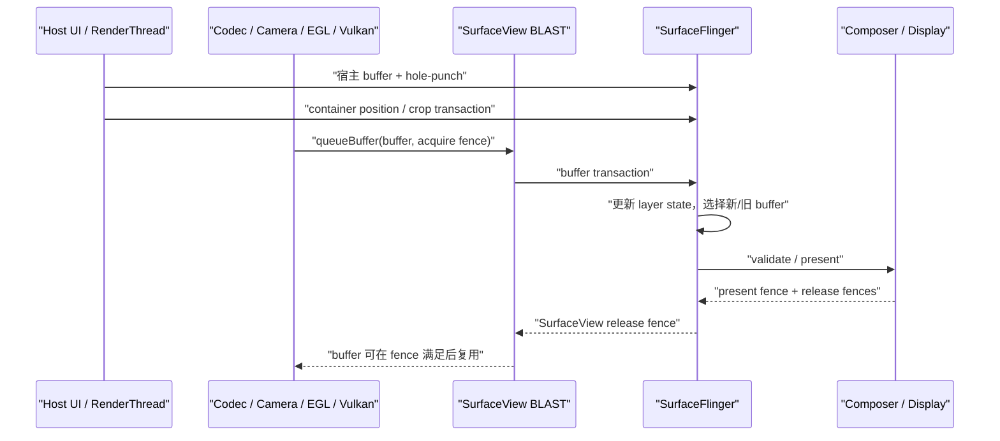

# 18.6 Android 17 SurfaceView 独立 Surface 路径

## 为什么需要 SurfaceView

SurfaceView 让一部分像素不必先画进宿主窗口的 buffer。视频解码器、Camera、EGL/Vulkan 渲染线程可以向一条独立的 buffer 流提交内容；普通 View、控制条和遮罩仍由宿主窗口的主线程与 RenderThread 生成。下面的简图用于分开两条生产线：

```text
宿主窗口：Choreographer → UI Thread → RenderThread → Host BufferQueue
主体内容：Codec / Camera / EGL / Vulkan Producer → SurfaceView BufferQueue
                                                    ↓
                                      SurfaceFlinger → HWC → Display
```

这张简图用于划分像素归属。SurfaceView 页面仍有主线程、RenderThread 和宿主窗口；“独立”只表示主体像素拥有单独的 Surface、队列和可见 layer，不表示整个页面脱离 ViewRoot，也不表示内容 Producer 一定运行在应用进程外。

这套结构带来三项直接收益：

- 主体内容可以采用与宿主 UI 不同的帧率。低帧率视频不必迫使宿主窗口以同样节奏重画，宿主刷新也不要求视频每轮都提供新 buffer。
- 主体内容不经过宿主 RenderThread 的纹理采样。对视频、相机等大面积内容，这可能减少 GPU 工作和内存带宽。
- SurfaceFlinger 能把主体作为独立 layer 交给 HWC 评估。设备条件满足时可使用 DEVICE composition；条件不满足时仍可能进入 CLIENT composition。

这些收益都带有边界。主线程卡住时，已有视频帧仍可能继续更新，但 SurfaceView 的布局、裁剪、透明洞、控制条和生命周期处理可能停在旧状态。独立 layer 也只获得被 HWC 单独评估的机会，不保证 Overlay、低功耗或更低时延。分析时应把“内容是否继续生产”“宿主几何是否更新”“本轮怎样合成”当成三个问题。

SurfaceView 适合主体像素由独立 Producer 持续提供的场景，例如：

- MediaCodec 或 Codec2 视频输出；
- Camera preview stream；
- 游戏、地图或可视化引擎的 EGL/Vulkan 输出；
- 需要 secure/protected 显示链路的内容；
- 通过 `SurfaceControlViewHost` 嵌入的远端层级。

如果内容需要频繁参与普通 View 的旋转、复杂裁剪、着色器效果或父子透明度动画，TextureView 往往更容易实现。选型依据应是像素归属、变换需求和目标设备的合成能力，不能只按“视频用 SurfaceView、动画用 TextureView”套模板。

## 独立 Surface 与挖洞机制

### Android 17 的对象结构

在 `android-17.0.0_r1` 中，`SurfaceView.createBlastSurfaceControls()` 维护的主要对象如下：

```text
ViewRootImpl bounds layer
  └─ mSurfaceControl：SurfaceView container
       ├─ mBlastSurfaceControl：BLAST buffer layer
       └─ mBackgroundControl：background color layer
```

这里要区分 container 与内容层。`mSurfaceControl` 负责 SurfaceView 子树的位置、变换、裁剪、相对层级和部分视觉状态；`mBlastSurfaceControl` 承载 Producer 提交的 buffer；`mBackgroundControl` 是 container 下的背景 color layer。Android 17 的 `updateBackgroundVisibility()` 只在 `mSubLayer < 0`、内容层带 `OPAQUE` 且背景层未被禁用时显示它。`mBlastBufferQueue` 通过 `update()` 关联内容层的尺寸、格式与生产端 `Surface`。

Java `SurfaceView` 位于应用进程，并不限定 buffer 填充者的进程。应用内游戏线程可以直接使用 `Surface`，MediaCodec、Camera 或嵌入式层级也可能让系统服务和厂商组件参与生产。可靠的 Producer 身份应从目标 BufferQueue 的 connect、dequeue、queue、fence 和 layer id 回溯，不能按常见进程名猜测。

### 默认 Z-below 与透明洞

SurfaceView 默认位于宿主窗口下方。宿主窗口如果仍在相同矩形内绘制不透明像素，下面的内容层就不可见，因此 HWUI 需要在宿主 buffer 中为它留出透明区域。Android 17 的关键实现是：

- `gatherTransparentRegion()` 把 SurfaceView 的可见矩形加入透明区域；
- `draw()` 或 `dispatchDraw()` 在 `mDrawFinished && !isAboveParent()` 时调用 `clearSurfaceViewPort()`；
- `clearSurfaceViewPort()` 使用 `Canvas.punchHole()`，并把圆角、clip bounds 与 alpha 纳入洞的参数；
- `mDrawFinished` 为 `false` 时不会打洞；该字段在 `surfaceRedrawNeededAsync` 的回调集合结束后置为 `true`。

所以“挖洞”不是创建一个黑色 View，也不是把视频像素复制到宿主窗口。宿主 buffer 在对应区域保留透明度，SurfaceFlinger 再按 layer 层级组合宿主与 SurfaceView 内容。

`mDrawFinished` 只能证明 framework 认为 redraw callback 阶段完成，不能证明 Producer 已 queue 首 buffer，也不能证明 buffer 已被 latch 或 present。首帧分析仍要依次检查 Producer connection、首 buffer transaction、acquire fence、layer visibility 和目标 display present。

Z-above 时，SurfaceView 位于宿主窗口之上，不需要在宿主 buffer 中打洞。代价是宿主窗口里的普通 View 无法覆盖到它上面。Android 17 推荐用 `setCompositionOrder(int)` 表达关系：负数位于宿主下方，非负数位于宿主上方，数值更大的 peer 更高；相同值的 peer 顺序未定义。旧的 `setZOrderMediaOverlay()` 与 `setZOrderOnTop()` 已标记为 deprecated，阅读遗留代码时仍需理解其语义。

### alpha、HDR、composition order 与 blur

Android 12 到 Android 17 的现代主线可按下表理解：

| 平台 | SurfaceView 相关变化 | 分析含义 |
|---|---|---|
| Android 12 / API 31 | container、BLAST child、background 与 RenderNode 位置同步成为稳定分析基线 | 几何 transaction 与内容 buffer 要分层观察 |
| Android 13 / API 33 | 主体结构延续 | 设备差异应继续核对厂商 Composer、gralloc 与 Producer，而非假定 AOSP 拓扑换代 |
| Android 14 / API 34 | 支持任意 alpha；公开 `setSurfaceLifecycle()` | Z-below 的 alpha 调制透明洞，Z-above 的 alpha 作用于 Surface 内容；生命周期可以跟随 visibility 或 attachment |
| Android 15 / API 35 | 增加 `setDesiredHdrHeadroom()` | 这是 SurfaceView 自己的期望值，结果仍受面板、bit depth、环境和系统策略约束 |
| Android 16 / API 36 | 增加 `setCompositionOrder()` | 多个 SurfaceView 的相对关系可以用整数表达，不能把相同 order 当成稳定顺序 |
| Android 17 / API 37 | 增加 `setBlurRegions()` | blur 坐标相对 SurfaceView bounds，尺寸变化后调用方需要更新；其位置还依赖 scale、crop 与几何 transaction |

Z-below 的 alpha 并不直接修改内容 buffer 的 alpha，而是修改宿主透明洞的混合程度。多个位于宿主下方的 SurfaceView 互相重叠时，这种语义不等同于普通 View 的逐层 alpha 混合。排查叠加异常时，要同时记录 composition order、宿主 hole-punch、内容层 alpha 与 HWC composition type。

### 生命周期是 Producer 的硬边界

Activity 可见、View 已 attach 和底层 `Surface` 有效是不同状态。Producer 只能在 `surfaceCreated()` 到 `surfaceDestroyed()` 之间使用当前 Surface；`surfaceDestroyed()` 返回后，渲染线程不得继续访问它。若 Producer 在工作线程或远端服务，回调必须等待旧连接停止使用 Surface，不能只异步发送一条 stop 消息。

下面的代码用应用自有接口表达所有权边界，`FrameProducer` 不是 Android SDK 类型：

```kotlin
private interface FrameProducer {
    fun attach(surface: Surface)
    fun resize(width: Int, height: Int, format: Int)
    fun detachAndWaitUntilIdle()
}

surfaceView.holder.addCallback(object : SurfaceHolder.Callback {
    override fun surfaceCreated(holder: SurfaceHolder) {
        producer.attach(holder.surface)
    }

    override fun surfaceChanged(
        holder: SurfaceHolder,
        format: Int,
        width: Int,
        height: Int,
    ) {
        producer.resize(width, height, format)
    }

    override fun surfaceDestroyed(holder: SurfaceHolder) {
        producer.detachAndWaitUntilIdle()
    }
})
```

这段骨架强调 `detachAndWaitUntilIdle()` 的同步责任。EGL/Vulkan 线程要停止对旧 native window 的 swap/present；MediaCodec 或 Camera 要撤销旧 output；具体停止 API 取决于 Producer。Android 14 的 attachment 生命周期策略可以在暂时不可见时保留 Surface，但也会延长 buffer、连接和硬件资源的持有时间。

## 完整渲染路径

### 从 Producer 到显示设备

一块 SurfaceView 内容 buffer 的主路径可拆成以下阶段：

1. Producer 从目标 Surface 对应的 BufferQueue dequeue 可写 buffer。
2. Codec、Camera、CPU、GLES 或 Vulkan 填充内容，并生成描述写入完成条件的 fence。
3. Producer queue buffer，提交时间戳、crop、transform、dataspace、HDR metadata 等状态。
4. BLAST consumer 取得 `BufferItem`，在 `BLASTBufferQueue::acquireNextBufferLocked()` 周围把 buffer、acquire fence、frame number 与 layer 状态写入 `SurfaceComposerClient::Transaction`。
5. SurfaceFlinger 接收 transaction，更新 FrontEnd 的 requested state、layer hierarchy 与 snapshot，并依据当前 latch 条件选择新 buffer 或复用旧 buffer。
6. CompositionEngine 为目标 display 构造可见 layer 集合，HWC 对整屏策略进行 validate；CLIENT layer 由 RenderEngine 生成 client target，DEVICE layer 交给硬件合成。
7. HWC present 后返回 present fence 与 per-layer release fence。release fence 沿 BLAST/BufferQueue 回到对应 Producer，约束 buffer 何时可以安全复用。

下面的时序图把宿主几何和内容提交画在两条线上：



图中三次提交不要求同一时刻发生。宿主 buffer、container 几何和主体 buffer 可以具有不同 frame number 与节奏；问题分析的重点，是用户看到的某次 display present 采用了哪一组状态。

### 内容节奏不由单一时钟规定

MediaCodec 可以按媒体时间戳释放输出帧，Camera 受 sensor 与 HAL stream 节奏约束，游戏线程可能由 `Choreographer`、`AChoreographer`、Swappy 或引擎时钟驱动。SurfaceView 不要求 Producer 经由宿主 `ViewRootImpl#doTraversal()`，但这不能写成“Producer 不受 VSync 或 Choreographer 影响”。

宿主刷新率与内容帧率不同是常态。多个 display frame 复用同一块视频 buffer 不等于丢帧；需要确认的是新内容是否在目标 present deadline 前可用、旧 buffer 是否符合内容节奏，以及控制层与主体是否采用了相容的几何状态。

### 几何 transaction 与内容 transaction

Android 17 至少有三种常见对齐边界：

- `SurfaceViewPositionUpdateListener` 从 RenderNode 获得宿主 frame number，经 `ViewRootImpl.mergeWithNextTransaction()` 把 container 的 position、matrix、crop 等状态与宿主 buffer transaction 合并。
- UI 线程发起的部分状态更新经 `ViewRootImpl.applyTransactionOnDraw()` 绑定到下一次宿主 draw。
- 公共 API `applyTransactionToFrame()` 通过 `mBlastBufferQueue.mergeWithNextTransaction()` 绑定到 SurfaceView 下一块内容 buffer。

第三种方式有明确限制：连续渲染时，transaction 对应哪一帧未定义；调用后没有新内容帧时，transaction 可能不应用。低帧率视频暂停期间若把窗口位置变化一律绑定到“下一块内容”，几何更新可能长时间等待。位置和裁剪通常应跟宿主帧走，只有必须与某块主体 buffer 同时生效的 child transaction 才适合内容帧边界。

### fence：fd、依赖与所有权

`queueBuffer()` 返回不代表像素已经可读。Producer 可以提交尚未 signal 的完成 fence；站在 BLAST 或 SurfaceFlinger 一侧，这就是 acquire fence。SurfaceFlinger 在使用 buffer 前必须遵守该依赖，即使启用了允许 unsignaled latch 的受限优化，硬件读取前的等待也没有消失。

三类 fence 不应混用：

- acquire fence：上游 Producer 何时写完这块内容 buffer；
- per-layer release fence：HWC 或合成路径何时不再读取某个 layer buffer；
- present fence：一次 display present 工作的完成边界，用于显示时序反馈，不是面板光学扫描的测量值。

kernel 锚点 `android17-6.18-2026-06_r6` 中，`drivers/dma-buf/sync_file.c` 负责把 fence 暴露为 fd，`drivers/dma-buf/dma-fence.c` 提供 signal、callback 与 wait 等基础语义。它们不能单独解释某块 GPU、codec、camera 或 DPU 工作为何延迟 signal；责任归属仍需结合用户空间 Producer、厂商 HAL、驱动 timeline 与调度轨迹。

## BufferQueue 行为与 Triple Buffering

“Triple Buffering”标题沿用目录名称，但 Android 17 的结论是：SurfaceView 不存在可用于所有场景的固定三槽模型。

`BufferQueueCore` 维护一组可用 slot，并用 `mMaxDequeuedBufferCount`、`mMaxAcquiredBufferCount`、`mAsyncMode`、`mDequeueBufferCannotBlock` 与配置上限共同计算本次队列允许使用的 buffer 数量。源码中的 `NUM_BUFFER_SLOTS` 是 slot 表容量，不等于每个 SurfaceView 都同时分配或流转这么多 GraphicBuffer。某次 trace 看见三块活跃 buffer，只能说明该连接在那段时间呈现出三缓冲效果。

### 状态与背压

通用状态流如下：

```text
FREE → DEQUEUED → QUEUED → ACQUIRED → FREE
          Producer          Consumer
```

这个状态图用于理解所有权变化。buffer 从 ACQUIRED 回到可复用状态还受 release fence 约束；“Consumer 已 release”与“Producer 已能安全写入”在时间上可以不同。

Producer 阻塞在 `dequeueBuffer()`，说明当前配置下没有可立即返回的可写 slot，或相关 release 条件尚未满足。常见原因包括：

- Consumer/HWC 仍持有 buffer，release fence 迟到；
- GPU、codec 或 camera 的前序工作使队列周转变慢；
- Producer 生成速度长期高于 display/consumer 消费能力；
- resize、格式变化或重新分配期间出现额外等待；
- queue 采用保留顺序的模式，旧帧不能按异步策略丢弃。

不能只看一条长 `dequeueBuffer` slice 就断言“队列深度太小”。应同时核对目标 layer 的 queued/acquired 状态、release fence、consumer cadence、Producer timestamp 与是否发生 buffer allocation。

### 两套队列独立，但仍共享设备资源

宿主窗口与 SurfaceView 内容拥有不同的 Producer/Consumer 状态和 release channel。宿主 `dequeueBuffer()` 等待不证明 SurfaceView 队列堵塞，SurfaceView Producer 被背压也不要求宿主按钮停止刷新。

两条队列仍共享系统资源：CPU 调度、GPU、内存带宽、SurfaceFlinger、HWC plane/scaler、display deadline 与功耗策略都可能互相影响。更准确的说法是“队列所有权和背压状态分离”，不是“两条渲染路径互不影响”。

增加可用 buffer 数量可能降低 Producer 阻塞概率，也可能增加内存占用和排队时延。实时交互更关心旧帧不要堆积，离线吞吐更关心 Producer 不被短暂抖动打断；调节 buffer count 或 async 行为前，要先写清楚业务希望保吞吐、保时延还是保每帧顺序。

## SurfaceView vs TextureView

两者都可以向应用暴露可供 Producer 使用的 `Surface`，差异发生在 Consumer 和最终像素归属：

```text
SurfaceView:
Producer → SurfaceView BufferQueue → BLAST buffer transaction
         → SurfaceFlinger 独立 layer → HWC / Display

TextureView:
Producer → SurfaceTexture BufferQueue → App RenderThread 纹理采样
         → Host Window BufferQueue → SurfaceFlinger 宿主 layer → HWC / Display
```

TextureView 路径的附加成本应描述为“宿主 RenderThread 对输入纹理采样并绘入宿主 buffer”，不宜笼统写成 CPU 像素拷贝。GPU 采样、颜色转换、混合和宿主 buffer 写出会增加工作量与带宽，但具体代价取决于分辨率、变换、格式、刷新率和 GPU 实现。

| 维度 | SurfaceView | TextureView |
|---|---|---|
| 主体像素的最终位置 | 独立 BLAST child layer | 通常进入宿主窗口 buffer |
| 宿主 RenderThread | 不采样主体内容；仍负责普通 View 与几何相关工作 | 消费 SurfaceTexture，并把它作为 TextureLayer 参与宿主绘制 |
| 帧节奏 | 内容可与宿主不同；SF 可复用旧内容 buffer | 新内容要经过宿主 draw 才能出现在新的宿主 buffer 中 |
| 变换与混合 | 由 SurfaceControl、composition order、crop 与 hole-punch 语义约束 | 作为 View/纹理参与父层变换、alpha、clip 和效果 |
| HWC 视角 | 主体 layer 可独立判断 DEVICE/CLIENT | HWC 通常只看到已包含主体像素的宿主窗口 layer |
| secure/protected 内容 | 可建立独立的受保护显示链路 | 受宿主纹理采样与保护能力限制，不能默认等价 |
| trace 重点 | host、container、BLAST child、两套 buffer 与 fence | Producer queue、SurfaceTexture 更新、RenderThread 和 host buffer |

选型可以按下面的顺序判断：

1. 是否必须让主体成为独立 secure layer，或希望 HWC 单独评估大面积视频/相机内容？优先评估 SurfaceView。
2. 是否需要普通 View 语义下的连续旋转、复杂裁剪、shader 效果或父子透明度？评估 TextureView。
3. 主体更新能否接受等待宿主 RenderThread？不能接受时，SurfaceView 的独立内容流更合适。
4. 页面是否大量依赖普通 View 覆盖内容？SurfaceView 的 Z-below 可以覆盖，但要验证 hole-punch、alpha 与设备合成代价；Z-above 会让宿主 View 无法盖在上面。
5. 是否已有目标设备 trace 和功耗数据？没有数据时，不应把“SurfaceView 一定省电”或“TextureView 一定卡”写进结论。

## HWC Overlay 与合成策略

SurfaceView 提供独立 layer，所以 HWC 可以单独评估其 buffer；这不等于该 layer 必然得到硬件 Overlay plane。HWC 的 validate 面向整屏可见 layer 集合，判断会受以下条件共同影响：

- buffer format、modifier、usage、dataspace 与 HDR metadata；
- source crop、destination frame、缩放、旋转、alpha 与 blending；
- secure/protected 要求和外接显示保护状态；
- 同屏其它 layer 对 plane、scaler、bandwidth 和颜色处理单元的占用；
- display mode、刷新率、面板能力与厂商 Composer 限制。

YUV 内容经常适合硬件视频 plane，但格式本身不是 DEVICE composition 的证明。SurfaceView 上方存在控制条也不自动导致 CLIENT：有些硬件可以让多个 plane 叠加，有些变换或混合条件则会迫使部分 layer 进入 client target。Overlay plane 数量和能力是设备实现细节，不能写成固定的“三到四个”。

普通 layer 无法使用 DEVICE composition 时，SurfaceFlinger 可以让 RenderEngine 把 CLIENT layers 合成到 client target，再交给 HWC。protected buffer 不应被当作普通 RGBA 内容无条件回退到非保护 GPU 路径；设备无法建立合规保护链路时，可能黑屏、拒绝显示或播放失败。

Android 17 的 SF 侧入口以 `HWComposer::getDeviceCompositionChanges()` 周围的 `presentOrValidate()`、`validate()`、`present()` 为主；ComposerHal 对应 `presentOrValidateDisplay()`、`validateDisplay()`、`presentDisplay()`。`presentOrValidate()` 可能直接完成 present，也可能只得到 validated 结果。函数返回或 present fence 创建，不表示面板已经完成物理扫描。

### 怎样验证 composition type

一次 `dumpsys SurfaceFlinger` 只能给出采样时刻的状态，适合快速确认 layer 树和 composition type；动画或瞬时回退应使用 layer trace/HWC 轨迹。下面的命令先保留完整输出，避免用一条硬编码 layer 名的 `grep` 漏掉 BLAST child：

```bash
adb shell dumpsys SurfaceFlinger > /data/local/tmp/sf.txt
adb pull /data/local/tmp/sf.txt
```

在输出中应先用 parent-child、buffer 尺寸、dataspace 和 layer id 确认目标 `mBlastSurfaceControl`，再读取 DEVICE、CLIENT 或 SOLID_COLOR 等类型。若类型发生变化，要比较同一 display frame 的整屏 layer 条件，而非只比较 SurfaceView 自身属性。

## Trace 视角

### 采集前提与支持边界

建议同时采集 app `gfx/view`、调度、SurfaceFlinger transactions/layers、FrameTimeline、sync/fence，以及与场景相符的 GPU、codec、camera、binder 或厂商数据源。Perfetto 官方文档说明 FrameTimeline 对 SurfaceView 尚无完整支持，所以缺少独立的 app FrameTimeline slice 不能证明主体没有提交新帧。

主体内容应通过 layer trace、目标 BufferQueue/BLAST、Producer queue、acquire fence、SurfaceFlinger 状态与 display present 共同复原；宿主窗口和 SurfaceFlinger 的 FrameTimeline 仍可用来定位宿主帧。

### 建立 layer 身份表

trace 分析应先记录对象身份：

| 对象 | 建议记录 | 用途 |
|---|---|---|
| Host App Window | layer id、name、buffer layer、parent | 对齐普通 View、hole-punch 与宿主 buffer |
| SurfaceView container | layer id、parent、relative-Z、position、crop | 对齐布局和几何 transaction |
| SurfaceView BLAST child | layer id、parent、buffer size、dataspace、composition type | 对齐主体 buffer 与 Producer |
| background/embedded child | layer id、parent、visible region | 避免把辅助层误认为主体 |

Android 17 的 layer 名可能包含 Java tag、`(BLAST)`、SurfaceFlinger 分配的序号或事务前缀。不同 trace 配置下 slice 名也可能变化。应依赖 parent-child 关系、buffer 属性、Producer connection、frame number 与 transaction id，不要把固定字符串当成稳定 API。

### 分开观察宿主组和内容组

宿主组关注：

- `Choreographer#doFrame`、Input/Animation/Traversal；
- `syncAndDrawFrame`、RenderThread 与宿主 GPU work；
- host buffer transaction；
- SurfaceView position/crop transaction；
- 包含 hole-punch 的宿主 buffer。

内容组关注：

- Codec、Camera、EGL/Vulkan 或其它 Producer 的工作；
- 目标 Surface 的 connect、dequeue 与 queue；
- BLAST child buffer transaction；
- buffer frame number、timestamp、dataspace、crop、transform；
- acquire fence 与对应 layer 的 release fence。

不要用“宿主第 N 帧等于视频第 N 帧”配对。视频、相机和宿主刷新可能处于不同节奏。一次异常帧至少要回答：宿主采用哪块 buffer、container 采用哪组几何、主体采用哪块 buffer、对应 acquire fence 何时 ready、HWC 选了何种 composition type。

### 常见证据模式

| 现象 | 需要对照的证据 | 容易误判的点 |
|---|---|---|
| 控制条卡，视频继续更新 | main/RenderThread、host BufferTX、SV BufferTX | 视频流畅不代表布局与 hole-punch 也在更新 |
| 视频卡，按钮流畅 | Producer queue、SV acquire fence、BLAST child buffer | 主线程空闲不能排除 codec、camera、GPU、SF 或 HWC 问题 |
| resize 时错位 | Traversal bounds、PositionUpdateListener frame、host hole、container transaction、内容 buffer | 不能用 Android 7 以前的异步窗口说明所有现代错位 |
| Producer 长时间 dequeue | 目标队列状态、release fence、HWC/consumer cadence | 长 slice 不等于固定三槽不够 |
| 功耗升高 | per-layer DEVICE/CLIENT、RenderEngine、client target 面积、display mode | composition type 变化是结果，还要找触发条件 |
| 首帧黑屏 | SurfaceHolder callbacks、Producer connect、first queue/fence、layer show、background | `surfaceCreated()` 不等于已有可显示 buffer |

### fence wait 的读法

遇到 `sync_wait` 或 fence timeline 时，按以下信息定位：

1. 等待者属于哪个线程和 layer；
2. fence 是内容 acquire、client target acquire、per-layer release 还是 present；
3. 创建者可能属于 GPU、codec、camera、RenderEngine 还是 display；
4. signal 是否越过目标 present deadline；
5. 同期 CPU 线程是 running、runnable 还是 blocked。

“线程在等 fence”只描述依赖关系，不会自动给出责任模块。内容 acquire fence 迟到与 HWC release fence 迟到都可能让画面或 Producer 变慢，修复方向完全不同。

## 常见性能问题与优化

### 主线程卡住，内容仍动

这种现象可以证明主体内容未依赖本轮宿主 draw，但不能证明 SurfaceView 页面没有问题。检查宿主控制层是否停住、container 几何是否仍是旧值、hole-punch 是否匹配当前位置。修复对象通常是主线程工作、宿主 RenderThread 或布局更新，不要因为视频仍动就忽略交互卡顿。

### Producer 阻塞或主体掉帧

先确认阻塞发生在目标 SurfaceView 队列，而非宿主窗口队列。对齐 `dequeueBuffer()`、queue timestamp、acquire/release fence、BLAST child 是否采用新 buffer，以及 HWC present 周期。降低 Producer 帧率、减少 GPU/codec 工作或调整队列行为都可能有效，但必须由证据决定；盲目增加 buffer 数量可能把阻塞换成更高显示时延。

### resize、滚动和转场错位

把以下三个对象放在同一时间轴：

1. 宿主 buffer 中透明洞的新位置；
2. container 的 position/matrix/crop transaction；
3. BLAST child 的新 buffer 与 destination frame。

BLAST 能改善 transaction 同步，但不能保证 Producer 按时给出新尺寸内容，也不能让所有状态天然绑定同一帧。频繁 resize 时应减少无意义的尺寸往返，明确 Producer 何时切换 buffer size，并用宿主 frame number 验证几何 transaction。

### 首帧延迟和生命周期竞态

Android 12—17 的现代首帧可拆成：

```text
ViewRoot/bounds layer 就绪
→ SurfaceControl 与 BLASTBufferQueue 创建
→ SurfaceHolder callback
→ Producer connect
→ 第一块 buffer queue 与 acquire fence ready
→ layer 可见并进入一次 display present
```

这条分段路径用于定位首帧耗时。应分别测量每个边界，避免把所有时间归给 `surfaceCreated()` 或 SurfaceFlinger。`surfaceDestroyed()` 后仍向旧 Surface 提交、重建后复用旧 EGLSurface/ANativeWindow、只在 `onResume()` 启动 Producer，都会制造竞态。

### Z-order、alpha、圆角与 blur 异常

先记录 composition order 是正数还是负数，再判断 alpha 作用于内容层还是 hole-punch。圆角和 clip 同时涉及宿主洞与 container crop；API 37 blur region 还要随 SurfaceView bounds 更新。`setZOrderOnTop(true)` 会让宿主普通 View 无法覆盖内容，不能作为通用性能修复。

### DEVICE 变成 CLIENT

对比变化前后的整屏 layer 集合、buffer format/dataspace、alpha、crop、scale、rotation、HDR、secure flag、display mode 与厂商 HWC 日志。不要把弹幕、圆角或 YUV 中的任一条件单独写成必然原因。若业务允许，可以减小 client target 面积、降低复杂混合、改变层级结构；是否值得调整要以目标设备的 GPU、带宽、功耗和视觉要求为准。

### protected 内容黑屏

检查 secure/protected usage、目标 display 的保护能力、HDCP/外接屏状态、HWC composition 和厂商错误。此类问题不能靠普通非保护 CLIENT composition 规避。若同一内容在内屏正常、外接屏黑屏，显示保护能力与策略是优先排查方向。

### 输入延迟

SurfaceView 改变的是内容生产和合成拓扑，不会绕开 InputDispatcher 到应用窗口的输入路径。端到端分析应拆成：

- InputDispatcher 到应用主线程；
- 主线程把输入状态交给内容 Producer；
- Producer 生成并 queue 下一块受影响的 buffer；
- acquire fence、latch、HWC present 到用户可见。

游戏或地图的 Producer 可能受 frame pacing 约束；视频和 Camera 的内容节奏通常不会因一次触摸而改变。不能只看 `doFrame` 或 `queueBuffer` 中的一段时间就代表完整输入时延。

### 复核清单

每次分析至少回答这些问题：

1. 主体像素是否位于独立 BLAST child，而非宿主 buffer？
2. Producer 是谁，在哪个线程或服务填充 buffer？
3. 当前 Surface 的有效期由哪套 callback 与 lifecycle strategy 控制？
4. 宿主 hole-punch 在哪里形成，何时随 draw 更新？
5. container 的 parent、position、crop 与 composition order 是什么？
6. 几何跟宿主 frame 对齐，还是绑定到下一块内容 buffer？
7. acquire、release 与 present fence 分别属于哪个对象？
8. SurfaceFlinger 本轮采用新 buffer 还是复用旧 buffer？
9. HWC 把主体判为 DEVICE 还是 CLIENT，前后条件有何变化？
10. 用户看到的异常对应哪次 display present？

这些问题都有源码或 trace 证据后，才能把“SurfaceView 卡了一帧”收敛到 Producer、宿主、BLAST/SF、HWC 或显示设备中的具体边界。

### Android 17 源码锚点

源码以 Platform `android-17.0.0_r1` 和 Kernel `android17-6.18-2026-06_r6` 为准：

- [`SurfaceView.java`](https://android.googlesource.com/platform/frameworks/base/+/refs/tags/android-17.0.0_r1/core/java/android/view/SurfaceView.java)：hole-punch、container/BLAST/background 创建、生命周期、位置回调、composition order、blur 与 transaction 对齐；
- [`BLASTBufferQueue.cpp`](https://android.googlesource.com/platform/frameworks/native/+/refs/tags/android-17.0.0_r1/libs/gui/BLASTBufferQueue.cpp)：buffer acquire、buffer transaction、`mergeWithNextTransaction()` 与 release callback；
- [`BufferQueueCore.cpp`](https://android.googlesource.com/platform/frameworks/native/+/refs/tags/android-17.0.0_r1/libs/gui/BufferQueueCore.cpp)、[`BufferQueueProducer.cpp`](https://android.googlesource.com/platform/frameworks/native/+/refs/tags/android-17.0.0_r1/libs/gui/BufferQueueProducer.cpp)：队列容量计算、dequeue 与 backpressure；
- [`SurfaceFlinger.cpp`](https://android.googlesource.com/platform/frameworks/native/+/refs/tags/android-17.0.0_r1/services/surfaceflinger/SurfaceFlinger.cpp) 与 [`FrontEnd`](https://android.googlesource.com/platform/frameworks/native/+/refs/tags/android-17.0.0_r1/services/surfaceflinger/FrontEnd/)：transaction、layer state、snapshot 与 hierarchy；
- [`HWComposer.cpp`](https://android.googlesource.com/platform/frameworks/native/+/refs/tags/android-17.0.0_r1/services/surfaceflinger/DisplayHardware/HWComposer.cpp)、[`HWC2.cpp`](https://android.googlesource.com/platform/frameworks/native/+/refs/tags/android-17.0.0_r1/services/surfaceflinger/DisplayHardware/HWC2.cpp)：validate、present、composition type 与 fences；
- [`sync_file.c`](https://android.googlesource.com/kernel/common/+/refs/tags/android17-6.18-2026-06_r6/drivers/dma-buf/sync_file.c)、[`dma-fence.c`](https://android.googlesource.com/kernel/common/+/refs/tags/android17-6.18-2026-06_r6/drivers/dma-buf/dma-fence.c)：kernel fence fd 与等待语义；
- [Perfetto FrameTimeline](https://perfetto.dev/docs/data-sources/frametimeline)：SurfaceView 支持边界；
- [Android Graphics Architecture](https://source.android.com/docs/core/graphics/architecture) 与 [BufferQueue/Gralloc](https://source.android.com/docs/core/graphics/arch-bq-gralloc)：平台图形模型。

相关章节：

- [18.7 TextureView 合成路径](07-textureview.md)
- [18.8 OpenGL ES 渲染路径](08-opengl-es.md)
- [18.9 Vulkan 原生渲染路径](09-vulkan-native.md)
- [2.13 BufferQueue](../../part1-fundamentals/ch02-rendering/13-buffer-queue.md)
- [2.6 SurfaceFlinger](../../part1-fundamentals/ch02-rendering/06-surfaceflinger.md)
