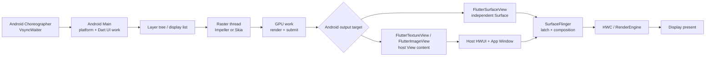
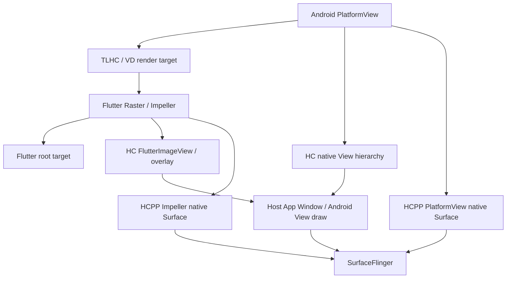

# Flutter 渲染管线：Engine、Impeller 与 Surface

Flutter 在 Android 上既遵循平台的 VSync、Surface 与合成规则，又有 Engine、Dart isolate 和 Impeller 自己的调度边界。定位掉帧时要先确认当前 RenderMode 和外部纹理路径，再把 UI、Raster、平台线程与显示帧对齐。

## 为什么 Flutter 的渲染链需要单独分析

Flutter framework 在 Dart 侧完成 widget 更新、layout、paint 和 scene 构建；Android View 体系主要负责承载 `FlutterView`、处理输入与生命周期、嵌入 PlatformView，以及提供最终输出对象。因此，原生 View 页面常用的 `ViewRootImpl.performTraversals()` → HWUI `DrawFrame` 观察法，只能覆盖 Flutter 页面的一部分链路。

诊断 Flutter 卡顿时至少要区分四段：

1. platform/Dart UI work 是否按时生成 scene；
2. Raster thread 是否按时把 layer tree/display list 转换为 GPU 工作；
3. Flutter root、external texture 和 PlatformView 分别写入什么 Android 对象；
4. SurfaceFlinger 是否按时 latch（选中用于本次合成）对应 buffer，并完成本次 Display present。

“Dart 帧已经结束”只说明 framework 已交出 scene；“Raster 已完成”也无法证明画面已经显示。Root RenderMode、PlatformView 策略和宿主窗口的消费节奏会继续改变后半段路径。

## Android 与 Flutter 的双版本锚点

分析采用两套互相独立的版本坐标：

- Android 平台：Android 17/API 37/`android-17.0.0_r1`；
- kernel：`android17-6.18-2026-06_r6`；
- Flutter：官方版本号、App 携带的 engine revision（引擎代码版本）、Impeller backend 和插件版本。

Flutter framework、engine 和 Android embedding 不属于 AOSP，也不会随 Android 17 自动更新。同一台 Android 17 设备可以运行携带不同 Flutter engine 的 App。因此，分析报告只写 “Android 17 + Flutter” 仍缺少决定线程、renderer 和嵌入行为的版本信息。

### 三条容易混淆的 Flutter 版本线

| 能力 | 可靠边界 | 分析口径 |
|---|---|---|
| UI 与 platform thread 合并 | Flutter 3.27 release notes 已出现 Android/iOS 支持；当前架构文档写 3.29 起合并；Flutter issue #150525 的维护者更新则写 3.32 stable 起默认合并并可 opt-out | 以 3.32 stable+ 作为保守的默认合并基线；3.29—3.31 按 engine revision 和启动配置核对 |
| Android 默认启用 Impeller | Flutter 3.27，Android API 29+ | API 29+ 仍要核对 Impeller 是否被关闭，以及运行时选择 Vulkan 还是 GLES |
| HCPP | Flutter 3.44 起提供，当前为实验性 opt-in（显式选择加入） | 还需 Android API 34+、Impeller、Vulkan 和运行时 SurfaceControl swapchain 可用 |

本文以 3.32 stable+ 为主线，因为它与维护者对 stable 默认值的说明一致；官方架构文档同时把 Android/iOS 的合并起点写为 3.29。分析 3.29—3.31 的 trace 时，不能只凭 SDK 版本猜测线程映射，应记录 engine revision，并在 Perfetto 中确认 Dart UI work 与平台回调是否位于同一线程。

## 一帧的公共前半段

下面的图用于说明普通 Flutter 帧从 Android vsync 到显示设备的公共路径。Root render mode 与 PlatformView 会在 Raster 之后改变输出对象，因此图中把这一步单独画出。



图中最重要的分叉位于 `Android output target`。`FlutterSurfaceView` 生成独立 Surface buffer；`FlutterTextureView` 和 `FlutterImageView` 的内容还要经过宿主 View/HWUI，再进入 App Window。即使 Dart 和 Raster 耗时相同，两类输出路径的显示时延也可能不同。

### Platform / Dart UI work

VSync callback 驱动 Flutter engine 开始一帧。Dart framework 依次处理 animation、build、layout 和 paint，再通过 `dart:ui` 提交 scene。`Animator::BeginFrame` 标记 build 起点，`Animator::Render` 接收本帧的 `LayerTree`，`Animator::EndFrame` 再把任务放入 raster pipeline（UI 线程向 Raster 线程交付 scene 的队列）。

在 3.32 stable+ 的主线模型中，UI task runner 与 Android platform task runner 都映射到宿主 Main thread。MethodChannel 回调、Activity 生命周期、输入事件和 Dart frame work 会在同一线程上串行竞争。耗时较长的插件回调会推迟 Dart build；过重的 Dart work 也会拖慢平台消息和输入处理。

Raster thread 通常仍然独立。它从 pipeline 取出 layer tree，在 `Rasterizer::DrawToSurfaces` 中执行 preroll（绘制前遍历与范围准备）、paint、render target 获取和提交。IO task runner 负责图片或资源相关的异步工作，但图片解码、纹理上传和 Raster 实际使用之间仍可能出现依赖等待。

### 两种“线程合并”不要混为一谈

Flutter Android 上存在两个不同语境：

- 新版 engine 的 UI + platform 合并：Dart UI work 与 Android 平台工作共享 Main thread，Raster thread 通常保持独立；
- 原始 Hybrid Composition 的 raster + UI/platform 协调：官方 PlatformView 文档说明，HC 为同步原生 View 与 Flutter canvas，会让 raster 与 UI 工作在同一线程执行，可能降低 Flutter FPS。

看到 “merged thread” 时，先确认上下文指的是哪一种合并。把两者画成同一个固定线程模型，会误判 PlatformView 页面上的主线程竞争来源。

### 与原生 Android HWUI 的边界

原生 View 页面的一般路径是：

```text
Choreographer
  → ViewRootImpl traversal
  → View measure / layout / draw
  → RenderNode / DisplayList
  → HWUI RenderThread
  → App Window buffer
```

Flutter 自绘 UI 的路径跳过 `ViewRootImpl.performTraversals()` 对 Widget tree 的绘制，也没有 App HWUI 的 RenderThread 分工。它由 Flutter framework 生成 DisplayList，再由 Flutter Raster thread 写入 root target。

两条路径仍共享 Android 显示后半段：

- engine 通过 `Surface`/`ANativeWindow` 连接 BufferQueue；
- SurfaceFlinger latch（取得并选定用于本轮合成的 buffer）可见 layer 的新 buffer；
- HWC（Hardware Composer，硬件合成器）尝试 DEVICE composition，即让显示硬件直接合成；必要时由 RenderEngine 做 CLIENT composition，即先由 GPU 合成 client target；
- dma-buf 负责在进程和设备之间共享 buffer，dma-fence 表示异步硬件工作完成与否，sync_file 则把 fence 封装成可跨进程传递的文件描述符。

PlatformView、`RenderMode.texture`、`RenderMode.image` 和宿主 Android UI 会重新引入 ViewRoot/HWUI，因此上述区别只适用于纯 Flutter root 主路径。

## Flutter 怎样接入 Android VSync

固定 Flutter 源码中的 `VsyncWaiterAndroid::AwaitVSync()` 会先判断 NDK `AChoreographer` 是否可用。符号可用时，它在 UI task runner 上注册 NDK frame callback；否则就在 platform task runner 上调用 Java `VsyncWaiter.asyncWaitForVsync()`，再由 `Choreographer.FrameCallback` 回调 `FlutterJNI.onVsync()`。

两条入口随后汇合到 `VsyncWaiter::FireCallback()`。这段代码会产生 `VsyncFireCallback` flow（跨线程事件关联），并把带有 `VsyncProcessCallback` trace event 的任务投递给 UI task runner，继而进入 `Animator::BeginFrame`。Flutter 复用 Android 帧时钟，但回调仍可能在 task runner 中排队。

可用下面这条调用关系检查 trace，箭头表示逻辑先后，不保证每个 slice 都紧挨出现：

`PlatformVsync` → `VsyncFireCallback` → `VsyncProcessCallback` → `Animator::BeginFrame` → `Animator::Render` → `Rasterizer::DrawToSurfaces`

如果 `PlatformVsync` 已经出现，而 `VsyncProcessCallback` 很晚才运行，应检查 UI task runner 所在线程的 Running/Runnable 状态和前序任务。如果 `Animator::BeginFrame` 及时开始，但 `Animator::Render` 很晚，问题更接近 Dart build/layout/paint；如果 Raster slice 很长，再检查 layer、shader、纹理上传和 GPU。

## Root RenderMode：surface、texture、image

固定源码中的 `io.flutter.embedding.android.RenderMode` 有 `surface`、`texture` 和 `image` 三个值。它描述 Flutter root 内容如何接入 Android View 与显示链路，不描述 PlatformView 的合成策略。

### `RenderMode.surface`

`FlutterSurfaceView` 持有 `SurfaceHolder`。`surfaceCreated()` 之后，embedding 把 `Surface` 交给 `FlutterRenderer.startRenderingToSurface()`，engine 直接向该 Producer target 渲染。Android 17 的 SurfaceView 对应独立 child layer，SurfaceFlinger 可以直接观察该 layer 的 buffer 更新。

这条路径少一次宿主 HWUI 的纹理采样，适合不透明的全屏 Flutter 页面。代价来自独立 layer：

- 无法像普通 View 那样自由夹在两个 Android View 之间；
- View 级 rotation、scale、复杂 clip 和 alpha 动画受限；
- Surface 创建、尺寸变化、暂停和销毁必须与 engine target 切换同步；
- z-order 调整会改变 SurfaceFlinger layer 关系。

透明 SurfaceView 是特殊配置。固定源码中的 `FlutterSurfaceView(renderTransparently=true)` 会设置透明 pixel format，并调用 `setZOrderOnTop(true)`。不过，`FlutterActivity` 使用透明背景时默认选择 `RenderMode.texture`；SurfaceView 支持透明，不代表透明 FlutterActivity 默认使用 SurfaceView。

### `RenderMode.texture`

`FlutterTextureView` 把底层 `SurfaceTexture` 包装成 `Surface`，再交给 `FlutterRenderer`。Flutter Raster/GPU 先生成 SurfaceTexture image，宿主 HWUI 随后把它作为 `TextureLayer` 采样并绘入 App Window buffer。

Android 17 `TextureView` 的 `SurfaceTexture.OnFrameAvailableListener` 会标记 layer 需要更新并调用 `invalidate()`。宿主 draw 时，`TextureView.draw()` 通过 `TextureLayer` 应用新 image 和 transform。因此，这条路径有两段独立的生产/消费节奏：

1. Flutter Producer 让 SurfaceTexture 获得新 image；
2. 宿主 Main/RenderThread 在窗口帧中消费它并提交 App Window buffer。

TextureView 便于参与普通 View 的 alpha、rotation、scale、clip 和 z-order，同时也增加宿主 traversal、HWUI 采样与同步成本。Flutter Raster 已提交而页面仍晚一帧时，应继续检查 `TextureView#draw()`、宿主 `DrawFrame` 和 App Window buffer 更新，不能在 Flutter Raster slice 处停止分析。

### `RenderMode.image`

`FlutterImageView` 使用 `ImageReader` 接收 engine 输出，再在 `onDraw()` 中把 image 绘回 Android Canvas。它主要服务 Hybrid Composition 的 root/overlay 转换和少数 embedding 场景，常规页面默认不会使用这一模式。

API 29+ 的固定源码会取得 `Image.getHardwareBuffer()`，再用 `Bitmap.wrapHardwareBuffer()` 包装为 hardware bitmap；这样可以避免 pre-29 分支中的逐像素 CPU copy，但仍存在 ImageReader acquire、image 生命周期管理、Canvas/HWUI 采样和宿主窗口提交成本，不能把它概括为零成本路径。

### `FlutterActivity` 的默认选择

| `BackgroundMode` | 默认 `RenderMode` | 承载对象 |
|---|---|---|
| `opaque` | `surface` | `FlutterSurfaceView` |
| `transparent` | `texture` | `FlutterTextureView` |

这一映射来自 `FlutterActivity.getRenderMode()`。`FlutterFragment`、add-to-app 或直接构造 `FlutterView` 时，调用方可能显式选择其他模式，诊断时应从对象树确认。

### Root 模式对照

| Root mode | 中间对象 | SurfaceFlinger 侧主要对象 | 常见等待 |
|---|---|---|---|
| `surface` | 独立 Surface buffer | Flutter root child layer | dequeue、GPU completion fence、SF latch |
| `texture` | SurfaceTexture image | Host App Window | image ready、host invalidate/draw、HWUI sample、window queue |
| `image` | ImageReader image | Host App Window | image acquire、HardwareBuffer/Bitmap 包装、Canvas/HWUI、window queue |

## External texture 与 `SurfaceProducer`

相机、视频或 native renderer 可以通过 `TextureRegistry` 向 Flutter scene 提供 external texture。插件 Producer 先写入 Android `Surface`，Flutter Raster 在生成 root scene 时采样该 image，随后仍按 root RenderMode 输出最终内容。

这会形成两个生产阶段：

- 插件侧生成 camera、codec 或 native graphics buffer；
- Flutter engine 采样 external texture，再生产 root buffer。

插件帧率与 Flutter 帧率可以不同。相机 buffer ready 只说明输入可供消费，不代表 Flutter 已经采样；Flutter 触发新帧时，插件也未必恰好提供了新 image。

在固定 Flutter 源码中，`FlutterRenderer.createSurfaceProducer()` 的选择规则很明确：

- 未强制使用 GL texture、API 29+ 且设备不在已知 HardwareBuffer 缺陷列表时，使用 `ImageReaderSurfaceProducer`；
- 其他情况使用 `SurfaceTextureSurfaceProducer`。

`TextureRegistry.SurfaceProducer` 在 Flutter 3.22 进入源码，官方迁移文档把 3.24 定为插件可以采用的最低稳定版本。`onSurfaceAvailable()` 与 `handlesCropAndRotation()` 的新契约在 3.27 提供，`onSurfaceCleanup()` 在 3.29 取代旧的 `onSurfaceDestroyed()`。审计插件时，要核对其声明的 Flutter 最低版本和实际实现的回调，不能用当前 API 文档倒推旧插件行为。

`createSurfaceProducer()` 默认采用 `SurfaceLifecycle.manual`。只有请求 `resetInBackground` 且选择 ImageReader backing（底层承载实现）的调用方，才会注册相应的内存压力清理行为。固定源码中的 `SurfaceTextureSurfaceProducer.setCallback()` 是空实现，不能期待它收到与 ImageReader backing 相同的清理和恢复通知。插件还要检查 `handlesCropAndRotation()`：ImageReader backing 返回 `false`，SurfaceTexture backing 返回 `true`。相机画面方向或裁剪错误可能来自插件没有遵守该契约，不能直接归因于 SurfaceFlinger transform。

在 Perfetto 中分析 external texture 卡顿时，应分别记录 texture id、Producer queue、Flutter frame 和 root buffer。中间 texture 通常只在 Flutter 内部被采样，未必会作为独立可见 layer 出现在 SurfaceFlinger 树中。

## Impeller 与 Skia：先辨认 renderer，再讨论成本

Flutter 3.27 起在 Android API 29+ 默认启用 Impeller。固定源码中的运行时选择并非简单的“Vulkan 不可用就改用 Skia”：

1. Impeller 启用且达到最低 API 条件时，`SelectedRenderingAPI()` 返回动态选择；
2. `AndroidContextDynamicImpeller` 尝试创建 Vulkan context；
3. 模拟器、已知问题 SoC、缺失能力或无效 Vulkan context 会让它改用 **Impeller OpenGLES**；
4. 低于最低 API、显式关闭 Impeller，或者使用软件渲染等路径时，才会选择 Skia OpenGLES/software。

因此，没有 Vulkan backend 时，仍可能使用 Impeller OpenGLES。性能报告应分别记录 renderer 与 backend，例如 `Impeller/Vulkan`、`Impeller/OpenGLES` 或 `Skia/OpenGLES`。

### Impeller 解决了什么

Impeller 的 shader 资产在 engine 构建期生成并打包。固定 Android Vulkan context 会把编入二进制的 shader mappings 交给 `ContextVK::Create()`，同时把 App cache directory 传给 pipeline cache。Vulkan cache 文件名是 `flutter.impeller.vkcache`，读取时会校验 driver version、vendor/device id、ABI 和 pipeline cache UUID，避免复用不兼容的数据。

这些设计减少了不可预测的运行时 shader 工作，并允许兼容的 Vulkan pipeline cache 跨进程复用。它们不会消除：

- blur、saveLayer、overdraw 与大面积半透明带来的像素成本；
- 大图解码、上传与 external texture 同步；
- 首次创建尚未命中的 pipeline；
- GPU 频率、带宽、thermal throttling（温控降频）和驱动 fence wait。

固定 shader 变体数量、固定毫秒耗时、固定帧率跌幅以及特定 GPU cache 命中率都没有一手基准支持，不能作为通用结论。这里仅讨论源码能够证明的编译、选择与缓存机制。

## PlatformView：TLHC、HC 与 HCPP

Flutter root RenderMode 与 PlatformView composition mode 是两组配置。一个页面可以使用 `FlutterSurfaceView` 作为 root，同时把 WebView 通过 TLHC 转成 texture；也可以在 HC/HCPP 中同时出现 Flutter image/overlay 和原生 View/Surface。

下面的图用于区分三种 PlatformView 的主要数据流。图中省略输入和无障碍桥接，只关注像素如何进入最终显示链路。



TLHC 把 PlatformView 结果转换成 texture，交给 Flutter Raster 采样；原始 HC 把原生 View 保留在 Android View hierarchy，并通过 `FlutterImageView`/overlay 协调 Flutter 内容；HCPP 则明确使用 SurfaceControl/native Surface 和 transaction synchronization。三者的中间 buffer、SF layer 数量、线程竞争与 fence 关系都不同。

### Texture Layer Hybrid Composition（TLHC）

固定源码中的 `configureForTextureLayerComposition()` 会把 PlatformView 放入 `PlatformViewWrapper`，记录它的绘制结果，再交给 Flutter texture target。当前实现根据 API、flag 和设备条件选择 `SurfaceProducer`、ImageReader 或 SurfaceTexture backing；条件不支持时，还可能按创建请求改用 Virtual Display（VD）或 HC fallback。

TLHC 的优点是 Flutter transform、clip 和 opacity 更容易保持一致，Flutter Raster 可以把 PlatformView texture 与其他 Flutter 内容一起合成。代价包括中间 buffer、texture acquire、invalidate、输入坐标映射和无障碍桥接。快速滚动 WebView 可能出现抖动；PlatformView 内含 `SurfaceView` 时，如何转接独立 Surface 像素与 accessibility 也更复杂。

### 原始 Hybrid Composition（HC）

HC 会把原生 View 加入 Android View hierarchy。固定源码中的 `PlatformViewsController` 在需要同步时调用 `FlutterView.convertToImageView()`，把 Flutter root 临时切换到 `FlutterImageView`；Flutter overlay 也通过 ImageReader-backed View 绘回宿主层级。`FlutterMutatorView` 负责对原生 View 应用位置、变换、裁剪和可见性。

这条路径保留了较完整的原生 View 行为，但增加了 Flutter image、overlay、宿主 View 与 PlatformView 的同步。Flutter 官方文档还指出：

- HC 会让 raster 与 UI 工作合并执行，复杂 Flutter 内容会与 OS message 和插件回调竞争；
- Android 10 之前每帧存在 graphics memory → main memory → GPU texture 的往返 copy；
- Android 10+ 把这部分 graphics memory copy 降为一次，但 HC 的线程协调和同步成本仍然存在。

因此，Android 10+ 的普通 HC 不能按 SurfaceControl 多 Surface 直出理解。固定源码中，原始 HC 的 Java 主路径仍包含 `convertToImageView()`、ImageReader overlay 和宿主 View hierarchy。

### Hybrid Composition++（HCPP）

HCPP 从 Flutter 3.44 起提供，当前仍是实验性 opt-in。运行或测试时可以使用 `--enable-hcpp`；release 构建则应在 `<application>` 下设置 `io.flutter.embedding.android.EnableHcpp=true`。

配置存在只代表应用请求 HCPP，固定源码还会继续检查运行时条件：

- Android API 34+；
- Impeller 已启用；
- backend 是否为 `kImpellerVulkan`；
- Vulkan context 允许 SurfaceControl swapchain。

条件全部满足时，`PlatformViewsController2` 使用 `SurfaceControl.Transaction`、root `AttachedSurfaceControl` 和独立 overlay SurfaceControl；Flutter root 与 PlatformView 可以作为 native Surface 交给 SurfaceFlinger，再通过 transaction synchronization 协调状态。条件不满足时，官方文档说明会回到 App 原先配置的 PlatformView 策略。

HCPP 可以减少原始 HC 的 copy 与同步成本，但仍可能产生多个 Surface/layer，也存在复杂透明 overlay 的叠放限制。Android 14、15、16 或 17 都不会替旧 Flutter App 自动开启 HCPP。

### PlatformView 选型

| 模式 | 像素路径 | 长处 | 重点代价 |
|---|---|---|---|
| TLHC | Native View → texture → Flutter Raster → root | Flutter transform、clip、opacity 较完整；普通 Flutter 渲染性能较稳定 | 快速滚动可能抖动；存在中间 texture；SurfaceView、a11y（无障碍）、text magnifier 有限制 |
| HC | Native View 保留在宿主 hierarchy；Flutter root/overlay 可转 ImageReader View | 原生输入、无障碍与 View 行为较完整 | raster/UI 合并、Flutter image/overlay 同步；Android 10 前 copy 很重 |
| HCPP | PlatformView native Surface + Impeller native Surface → SurfaceFlinger | 减少原始 HC 的 copy 和同步负担 | Flutter 3.44+ 实验性；API 34+、Vulkan、Impeller；透明 overlay 限制 |
| VD fallback | Native View → VirtualDisplay → 中转 texture → Flutter | 兼容部分无法使用 TLHC 的对象 | buffer、内存、延迟和输入/a11y 桥接成本更高 |

### Z-order、手势与无障碍

Flutter widget tree 与 Android View hierarchy 是两套不同的对象树。PlatformView 的视觉位置、输入命中和无障碍节点需要分别协调：

- TLHC 由 Flutter scene 决定视觉叠放，触摸事件经过 Flutter hit test（命中测试）后映射回 Android View；
- HC 由 `FlutterMutatorView` 和宿主 View hierarchy 参与 z-order，Flutter overlay 还要遮盖 PlatformView 上方的 Flutter 内容；
- HCPP 还要检查 SurfaceControl layer 与 transaction，不能只看 View hierarchy；
- 嵌入 `SurfaceView` 的 PlatformView 拥有自己的 child Surface，普通 View 的 clip、alpha 与 accessibility 结论不能直接套用。

遇到画面位置正确、触摸位置错误时，应同时检查 Flutter transform、Android View bounds 和 MotionEvent 坐标映射。遇到视觉遮挡时，再对照 Flutter overlay、宿主 View z-order 和 SurfaceFlinger layer tree。

## Android 17 的 buffer、fence 与显示边界

Android 17 的平台侧仍按 Producer buffer → acquire fence → SurfaceFlinger latch → HWC/RenderEngine composition → Display present 分析。Flutter 改变的是 Producer 与 target 的组织方式，不会绕过 BufferQueue、dma-buf 或 fence 约束。

- `RenderMode.surface`：Flutter root 有独立 Producer queue、acquire fence 和 SurfaceFlinger layer；
- `RenderMode.texture`：SurfaceTexture 是中间 image，宿主 HWUI 采样后再为 App Window 生成新的 GPU completion fence；
- `RenderMode.image`/HC：ImageReader image 被宿主 Canvas/HWUI 消费，overlay 可能拥有额外 image 与 View；
- external texture：插件 Producer fence 要先满足，Flutter Raster 才能安全采样；
- HCPP：Flutter root、PlatformView 与 overlay 可能各自拥有 SurfaceControl layer 和 transaction。

FrameTimeline 也要按输出对象解释。Host App Window、Flutter root Surface 和 HCPP PlatformView 可能使用不同的 frame number/token；external texture 中间帧只在 Flutter 内部消费，未必拥有可直接对齐的 App FrameTimeline。较可靠的关联键包括 engine frame number、texture id、buffer id、SurfaceFlinger layer id 和时间窗口。

内核版本 `android17-6.18-2026-06_r6` 提供 dma-buf 和 dma-fence/sync_file 基础。GPU、camera、codec 和 HWC 驱动的具体 tracepoint 由设备实现决定。看到 fence wait 时，先确认等待者位于插件 Producer、Flutter GPU、宿主 HWUI、SurfaceFlinger 还是 HWC。

## 在 Perfetto 中识别 Flutter 渲染管线

### 采样前记录配置

建议使用 profile 或 release 构建复现问题，并记录：

- Android build fingerprint（系统构建标识）和刷新率；
- Flutter SDK 版本和 engine revision；
- UI/platform task runner 是否合并；
- renderer 和 backend；
- root RenderMode；
- PlatformView mode、HCPP flag 与插件版本；
- 复现页面是否包含相机、视频、WebView、地图或其他 external texture。

Flutter trace event 会随 build mode、engine revision 和 trace 配置变化。某个关键词没有出现，只能说明当前 trace 没有记录到该事件，不能单独证明对应阶段不存在。

### 从对象树决定观察对象

先看 Android View hierarchy 与 SurfaceFlinger layer tree：

- 出现独立 Flutter child layer 时，通常对应 `FlutterSurfaceView` 或 HCPP Surface；
- 只看到 Host App Window，而 Flutter 内容位于其中，通常是 TextureView/ImageView/HC 宿主消费路径；
- 有 WebView/Map/SurfaceView child layer，再确认它来自普通 HC、HCPP 或 PlatformView 内部 Surface；
- 相机或 codec 的 Producer layer 不一定直接可见，因为它可能只是由 Flutter Raster 消费的 external texture。

### Engine 侧常用事件

| 事件/轨道 | 源码含义 | 诊断用途 |
|---|---|---|
| `PlatformVsync` | NDK/Java VSync 入口记录 frame start/target | 判断帧时钟何时到达 engine |
| `VsyncFireCallback` / `VsyncProcessCallback` | callback flow 与 UI task runner 上的处理任务 | 判断任务排队和线程映射 |
| `Animator::BeginFrame` | Dart frame build 起点 | 对齐 UI phase |
| `Animator::Render` | framework 把本帧 layer tree 交给 engine | 估算 build/layout/paint 区间 |
| `PipelineFull` | raster pipeline 没有空位 | 表示 Raster 侧尚未及时消费前序 scene |
| `Rasterizer::DrawToSurfaces` | Raster 取得 scene、绘制并提交 target | 判断 Raster CPU 和提交区间 |
| Impeller/GPU events | render pass、command buffer、queue work | 区分 CPU 录制与 GPU 执行 |

新版 merged model 下，`VsyncProcessCallback` 和 `Animator::BeginFrame` 应位于 UI task runner 对应的宿主 Main thread；旧版、opt-out 或定制 engine 可能仍有独立 UI thread。线程名也可能被 engine 改写，因此应结合 tid、task runner 映射和相邻事件判断。

### 四类常见卡顿的证据顺序

| 现象 | 检查顺序 | 常见方向 |
|---|---|---|
| Dart/UI work 晚 | `PlatformVsync` → `VsyncProcessCallback` → `Animator::BeginFrame` → `Animator::Render` | Main Runnable/Running、plugin callback、build/layout/paint |
| Raster 晚 | `Animator::Render` → `Rasterizer::DrawToSurfaces` → GPU submit | saveLayer、blur、图片上传、pipeline 创建、raster pipeline 满 |
| Flutter 已提交但 root 晚 | root buffer/fence → SF latch → present | GPU fence、dequeue backpressure、SurfaceView lifecycle |
| Texture/Image root 晚 | 中间 image ready → host invalidate/draw → App Window buffer → SF | Host Main、RenderThread、TextureView/ImageReader acquire |
| PlatformView 错位或掉帧 | Flutter frame + host traversal + overlay/PlatformView layer + transaction | HC thread merge、image/overlay 缺帧、HCPP transaction、TLHC texture |

### SurfaceView 与 TextureView 的 trace 差异

`FlutterSurfaceView` 路径中，宿主 RenderThread 不负责采样 Flutter root。宿主 Main 仍会影响 VSync、Dart work、插件和生命周期，但 root buffer 可以直接进入独立 Surface layer。

`FlutterTextureView` 路径中，Flutter Producer 先把新 image 放入 SurfaceTexture。Android 17 `TextureView` 的 frame-available 回调会在 View attach handler 上触发更新和 invalidation，宿主 HWUI 随后采样。如果 `Rasterizer::DrawToSurfaces` 已完成，而 Host App Window 没有及时更新，瓶颈位于宿主消费阶段。

### DevTools：先区分 Framework 与 Raster

性能测试应使用 Profile 或 Release build：Profile 保留性能分析能力，Release 更接近正式发布配置。Debug build 使用 JIT（即时编译），还带有 assert、service protocol（调试工具通信协议）和额外工具插桩，会明显改变时序。

DevTools 适合回答：

- 哪一帧的 UI/Framework 或 Raster 时间超预算；
- 哪些 Dart 函数占 CPU；
- Widget rebuild、layout、paint 是否异常；
- 内存/GC、图片与 shader 事件是否相关。

DevTools 的“帧完成”不等于 panel 已显示。它不能单独解释 CPU 调度、GPU fence、SurfaceFlinger、HWC 与 present。

### 自定义 Trace：关联 Dart、Native 与系统事件

Dart 可用 `dart:developer` 的 `Timeline.startSync()` / `finishSync()` 或 `TimelineTask` 标注业务阶段。标记应覆盖可验证的工作边界，例如“解析一页数据”“等待插件返回”“生成一批列表模型”。

事件名保持稳定，并附 request/frame id，才能与 native callback、buffer id 和 FrameTimeline 对齐。request/frame id 是把同一次业务请求和同一帧跨语言关联起来的标识。不要把整次交互包成一个大 slice，否则仍无法判断内部等待。

### 单变量 A/B 与验收

可控制的变量包括：

- Widget 更新范围；
- 图片 decode 尺寸；
- blur/saveLayer/opacity/clip；
- PlatformView 数量与策略；
- Impeller opt-out；
- root RenderMode；
- external texture 帧率与尺寸；
- 页面分辨率和刷新率。

比较 P50/P95/P99 frame time（分别有 50%、95%、99% 的帧不超过该耗时）、missed deadline（错过显示截止时间的次数）、input-to-present（从输入事件到画面显示的延迟）、内存、功耗和画面正确性。平均 FPS 会掩盖少量长帧。

## 从慢帧证据到优化动作

Trace 已经把延迟定位到 Framework、Raster、GPU、插件或宿主消费阶段后，再选择对应动作；先改代码再找证据，容易把等待转移到下一段。

### Widget rebuild 范围过大

先用 DevTools 的 rebuild/layout/paint 信息确认哪一阶段超时。常见修复包括：

- 把状态放到最小更新范围；
- 对稳定子树使用 `const`；
- 避免在构建阶段做同步 I/O、JSON 解析或大计算；
- 把大计算移到额外 isolate（独立 Dart 执行单元）前，评估消息复制与调度成本；
- 不为减少 rebuild 引入更昂贵的 layout 或 repaint。

rebuild 数量只是线索。一个很小但高频的 Widget rebuild 可能便宜，一个触发全屏 layout/paint 的单次更新可能更贵。

### 列表滚动卡顿

列表问题常混合多种成本：

- item build/layout 过重；
- intrinsic layout（为取得内容固有尺寸而增加的布局计算）或高度反复变化；
- 图片解码、缩放、上传和 cache miss；
- blur、clip、opacity、`saveLayer` 与大阴影；
- PlatformView、WebView 或地图；
- GC（垃圾回收）、Dart heap（Dart 对象堆）与 native/GPU 内存压力；
- 合并线程上的 Android 回调与插件竞争。

排查时固定列表数据与滚动手势，分别关闭图片、复杂效果、PlatformView 和业务计算。一次只改变一个变量，再比较 UI/Raster/GPU/display。

### Raster 或 GPU 慢

Raster thread 上的长 slice（trace 中的一段持续事件）不一定表示 GPU 正在执行；线程也可能在准备 DisplayList、上传资源、创建 pipeline、提交工作或等待下游解除 back-pressure。

证据上要分开：

- Raster CPU Running/Runnable；
- driver/pipeline 相关 slice；
- GPU submission（提交）与 completion（完成）；
- root producer fence；
- SurfaceFlinger latch 与 display present。

降低特效覆盖面积或 render target 像素数后，GPU completion 时间同步下降，才支持 fragment shader（逐像素着色）或带宽成为瓶颈的判断。只看到 Raster thread 忙，不能直接归因 GPU。

### Platform Channel 与 plugin

同步 Platform Channel、只能在主线程执行的插件代码、FFI 和 native callback 都可能占用合并后的 platform/Dart UI 线程。需要记录：

- 调用方向与 payload（消息携带的数据）；
- serialization/deserialization（序列化与反序列化）；
- Dart 与 Java/Kotlin/native 执行时间；
- task 是否处于 Runnable、但尚未得到 CPU 的状态；
- 是否等待 Surface、Binder IPC、锁或 I/O。

异步 API 只能释放调用方等待，不会自动减少总工作量。高频小消息还可能被调度和序列化成本放大。

## 容易出现的误判

| 误判 | 应改成的检查方式 |
|---|---|
| Flutter 固定有独立 UI、platform、Raster 三线程 | 3.32 stable+ 先按 UI+platform 合并分析；3.29—3.31、opt-out 与定制 engine 查实际 task runner |
| `PlatformVsync` 出现就会立即执行 Dart | 继续看 `VsyncFireCallback`、`VsyncProcessCallback` 与 UI task runner 排队 |
| 没有 Vulkan 就一定回退 Skia | API 29+ 的当前动态选择可能使用 Impeller OpenGLES |
| Impeller 消除了所有 shader/pipeline 卡顿 | 区分离线 shader、运行时 pipeline、cache 命中与 GPU 像素成本 |
| `RenderMode.texture` 只有一条 BufferQueue | 分开 SurfaceTexture producer 与 Host App Window producer |
| Flutter Raster 结束就是上屏 | 继续追 target buffer、fence、SF latch 和 Display present |
| `AndroidView` 固定使用 HC | 核对 TLHC、VD fallback、HC、HCPP 与运行时回退 |
| Android 10+ 的 HC 等同于 HCPP | 原始 HC 仍可使用 FlutterImageView/overlay；HCPP 从 Flutter 3.44 起且需要显式启用 |
| Android 14+ 自动开启 HCPP | 还需 Flutter 3.44+、flag、API 34+、Impeller Vulkan 与 SurfaceControl swapchain |
| external texture 更新等于相机帧已显示 | 继续追踪 Flutter Raster 采样、root 提交和 Display present |

## Android 12—17 与 Flutter 的版本演进

Android 与 Flutter 的变化应分开记录。Android 决定 View、Surface、HWUI、SurfaceFlinger/HWC 和内核语义；Flutter 决定 engine、thread、renderer、embedding 和 PlatformView 策略。

| 版本 | 相关边界 |
|---|---|
| Android 12 / API 31 | BLAST 与 FrameTimeline 已形成现代分析基线；仍不能用 OS 版本推断 Flutter renderer |
| Android 13 / API 33 | Image fence API 可供较新的 ImageReader Consumer 使用；是否采用仍由 App 携带的 Flutter engine 决定 |
| Android 14 / API 34 | 提供 HCPP 需要的 transaction synchronization 平台条件；不会自动启用 HCPP |
| Android 15 / API 35 | 16 KB page size 设备要求 Flutter engine 与 native plugin 满足 ELF/APK 对齐；Flutter 3.27 同期默认启用 Impeller 属于 Flutter 发布决策 |
| Android 16 / API 36 | 旧 Flutter App 仍可保留旧线程/renderer；GPU syscall filtering 场景要测试定制 engine 和旧 native plugin |
| Android 17 / API 37 | 平台锚点；按 `android-17.0.0_r1` 的 TextureView、SurfaceView、SurfaceFlinger 与 AIDL Composer 解释显示端 |
| Flutter 3.27 | Android API 29+ 默认启用 Impeller；Android/iOS 合并线程能力进入 release notes |
| Flutter 3.29—3.31 | 官方架构文档把 3.29 写为合并起点；对这段版本核对 engine revision 与 opt-out |
| Flutter 3.32 stable | issue #150525 明确写为 Android/iOS 默认合并且可 opt-out；作为保守分析基线 |
| Flutter 3.44 | HCPP 作为 API 34+、Impeller Vulkan 条件下的实验性 opt-in 能力 |

### 16 KB Page Size 与 Flutter 插件

Android 15 起支持 16 KB page-size（内存页大小）设备。Flutter App 中的 engine、AOT native library（Dart 提前编译生成的原生库）、FFI library 和含 `.so` 的插件都要同时满足：

- APK 中未压缩 `.so` 的 ZIP 对齐；
- ELF load segment（可执行文件的装载段）的 `p_align` 对齐要求；
- native 代码不能假定 `PAGE_SIZE == 4096`；
- `mmap`（内存映射）、shared memory 与自定义 allocator 按运行时 page size 工作。

工程检查可按下面执行：

- 使用支持 16 KB 打包对齐的 AGP（Android Gradle Plugin）；Android 官方建议 AGP 8.5.1+；
- 使用 NDK r28+ 让新构建的 shared library 默认适配 16 KB；
- 旧 NDK 明确配置 linker（链接器）的 page-size 选项，并用 ELF 工具复核；
- 检查所有预编译 plugin `.so` 与 `libc++_shared.so`；
- 在 16 KB emulator/真机运行启动、PlatformView、camera/video、FFI 和后台恢复测试。

`packagingOptions` 只能影响 APK 打包方式，不能修复 ELF `p_align` 或 native 代码中的 4 KB 常量。Android 17 平台锚点也不会替未重新编译的插件修复这些问题。

## 固定源码入口

### Flutter

本文的 Flutter 源码固定到 commit `8a9f61cfd67396fb2f9afc3cd7854035e9cd6fc2`。分析线上问题时，仍应切换到 App 实际携带的 engine revision。

- [`VsyncWaiterAndroid`](https://github.com/flutter/flutter/blob/8a9f61cfd67396fb2f9afc3cd7854035e9cd6fc2/engine/src/flutter/shell/platform/android/vsync_waiter_android.cc)、[`VsyncWaiter`](https://github.com/flutter/flutter/blob/8a9f61cfd67396fb2f9afc3cd7854035e9cd6fc2/engine/src/flutter/shell/common/vsync_waiter.cc) 与 [`Animator`](https://github.com/flutter/flutter/blob/8a9f61cfd67396fb2f9afc3cd7854035e9cd6fc2/engine/src/flutter/shell/common/animator.cc)：VSync、UI task runner 和 frame trace；
- [`Rasterizer`](https://github.com/flutter/flutter/blob/8a9f61cfd67396fb2f9afc3cd7854035e9cd6fc2/engine/src/flutter/shell/common/rasterizer.cc)：Raster 和 target 提交；
- [`RenderMode`](https://github.com/flutter/flutter/blob/8a9f61cfd67396fb2f9afc3cd7854035e9cd6fc2/engine/src/flutter/shell/platform/android/io/flutter/embedding/android/RenderMode.java)、[`FlutterSurfaceView`](https://github.com/flutter/flutter/blob/8a9f61cfd67396fb2f9afc3cd7854035e9cd6fc2/engine/src/flutter/shell/platform/android/io/flutter/embedding/android/FlutterSurfaceView.java)、[`FlutterTextureView`](https://github.com/flutter/flutter/blob/8a9f61cfd67396fb2f9afc3cd7854035e9cd6fc2/engine/src/flutter/shell/platform/android/io/flutter/embedding/android/FlutterTextureView.java) 与 [`FlutterImageView`](https://github.com/flutter/flutter/blob/8a9f61cfd67396fb2f9afc3cd7854035e9cd6fc2/engine/src/flutter/shell/platform/android/io/flutter/embedding/android/FlutterImageView.java)：root target；
- [`FlutterRenderer`](https://github.com/flutter/flutter/blob/8a9f61cfd67396fb2f9afc3cd7854035e9cd6fc2/engine/src/flutter/shell/platform/android/io/flutter/embedding/engine/renderer/FlutterRenderer.java)、[`TextureRegistry`](https://github.com/flutter/flutter/blob/8a9f61cfd67396fb2f9afc3cd7854035e9cd6fc2/engine/src/flutter/shell/platform/android/io/flutter/view/TextureRegistry.java) 与 [`SurfaceTextureSurfaceProducer`](https://github.com/flutter/flutter/blob/8a9f61cfd67396fb2f9afc3cd7854035e9cd6fc2/engine/src/flutter/shell/platform/android/io/flutter/embedding/engine/renderer/SurfaceTextureSurfaceProducer.java)：external texture backing 和 lifecycle；
- [`PlatformViewsController`](https://github.com/flutter/flutter/blob/8a9f61cfd67396fb2f9afc3cd7854035e9cd6fc2/engine/src/flutter/shell/platform/android/io/flutter/plugin/platform/PlatformViewsController.java) 与 [`PlatformViewsController2`](https://github.com/flutter/flutter/blob/8a9f61cfd67396fb2f9afc3cd7854035e9cd6fc2/engine/src/flutter/shell/platform/android/io/flutter/plugin/platform/PlatformViewsController2.java)：TLHC、HC、VD fallback 和 HCPP；
- [`AndroidContextDynamicImpeller`](https://github.com/flutter/flutter/blob/8a9f61cfd67396fb2f9afc3cd7854035e9cd6fc2/engine/src/flutter/shell/platform/android/android_context_dynamic_impeller.cc) 与 [`pipeline_cache_data_vk.cc`](https://github.com/flutter/flutter/blob/8a9f61cfd67396fb2f9afc3cd7854035e9cd6fc2/engine/src/flutter/impeller/renderer/backend/vulkan/pipeline_cache_data_vk.cc)：Impeller backend 选择和 Vulkan cache。

版本与行为说明以 [Flutter architecture](https://docs.flutter.dev/resources/architectural-overview)、[issue #150525](https://github.com/flutter/flutter/issues/150525)、[Impeller](https://docs.flutter.dev/perf/impeller) 和 [Android Platform Views/HCPP](https://docs.flutter.dev/platform-integration/android/platform-views) 为准。

### Android 17 与 kernel

- Android 17 [`TextureView.java`](https://android.googlesource.com/platform/frameworks/base/+/android-17.0.0_r1/core/java/android/view/TextureView.java) 与 [`SurfaceView.java`](https://android.googlesource.com/platform/frameworks/base/+/android-17.0.0_r1/core/java/android/view/SurfaceView.java)：宿主 View、SurfaceTexture 更新和独立 Surface；
- Android 17 [`SurfaceFlinger.cpp`](https://android.googlesource.com/platform/frameworks/native/+/android-17.0.0_r1/services/surfaceflinger/SurfaceFlinger.cpp)：latch、composition 和 present 主线；
- 内核 [`dma-buf.c`](https://android.googlesource.com/kernel/common/+/refs/tags/android17-6.18-2026-06_r6/drivers/dma-buf/dma-buf.c)、[`dma-fence.c`](https://android.googlesource.com/kernel/common/+/refs/tags/android17-6.18-2026-06_r6/drivers/dma-buf/dma-fence.c) 与 [`sync_file.c`](https://android.googlesource.com/kernel/common/+/refs/tags/android17-6.18-2026-06_r6/drivers/dma-buf/sync_file.c)：共享 buffer、fence signal/wait 和 sync_file fd 接口。

## 与其他章节的关系

- [18.7 Flutter 渲染管线：Engine、Impeller 与 Surface](07-flutter-rendering-pipeline.md)：framework/engine 原理与性能视角；
- [18.3 SurfaceView 与 TextureView 渲染管线](03-surfaceview-textureview-pipelines.md) 与 [18.3 SurfaceView 与 TextureView 渲染管线](03-surfaceview-textureview-pipelines.md)：Android 容器的源码细节；
- [18.9 Android 17 WebView 渲染管线](09-webview-rendering.md)：WebView 作为 PlatformView 时的 Chromium 与 Android 显示路径。

## 小结

Flutter 页面要按三组对象展开：

- root RenderMode 决定 Flutter 主画面使用独立 Surface，还是由宿主 View/HWUI 消费；
- external texture 增加插件 Producer 与 Flutter Raster 采样阶段；
- PlatformView 策略决定原生 View 被转成 texture、保留在宿主 hierarchy，还是通过 HCPP 作为 native Surface 参与 SurfaceFlinger 合成。

使用 Perfetto 分析时，先固定 Android 与 Flutter 两套版本，再确认 View/Surface/layer 对象树；随后对齐 VSync、platform/Dart UI work、Raster、GPU fence、root/host queue、SurfaceFlinger latch 和 Display present。这样才能区分 Flutter framework、Raster/GPU、插件 Producer、宿主消费和系统合成分别在哪一段变慢。
