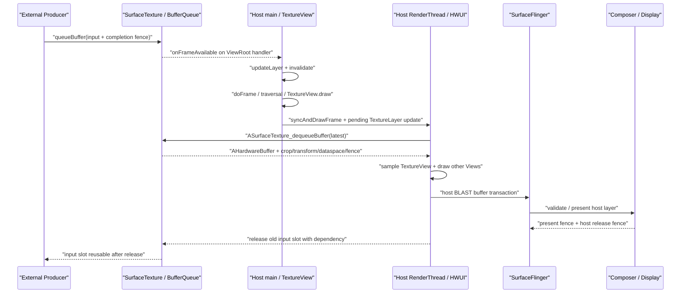

# 18.7 Android 17 TextureView 宿主合成链路

## 为什么要理解 TextureView 的链路

TextureView 参与普通 View 的布局与绘制顺序，可以跟随父布局应用 alpha、scale、rotation、clip 和 transition，也能与兄弟 View 混合。不过，它显示的主体像素不由普通 `onDraw()` 直接生成。Camera、MediaCodec、EGL/Vulkan 或其他 Producer（内容生产方）先向 `SurfaceTexture` 背后的 BufferQueue 提交 buffer，宿主 HWUI 再把最新输入作为纹理采样，绘入 App Window buffer。

因此，一次可见更新包含两次 buffer 生产：外部 Producer 生成输入内容，宿主 HWUI 再生成包含该内容的最终窗口 buffer。

```text
外部内容：Producer → SurfaceTexture BufferQueue
宿主窗口：SurfaceTexture → HWUI / RenderThread → App Window BufferQueue
```

这张简图区分了两套队列。外部 `queueBuffer()` 只表示内容进入应用侧 Consumer（消费方）的输入队列；宿主 `queueBuffer()` 只表示最终窗口 buffer 已交给 SurfaceFlinger。用户看到新内容，还要经过宿主帧调度、输入 acquire fence、HWUI 采样、宿主 GPU 绘制、SurfaceFlinger/HWC 合成和 Display present。

TextureView 的价值是让外部内容遵循普通 View 的合成语义。业务需要连续旋转、父级裁剪、交叉淡入淡出、滤镜，或者要把内容与 UI 一起截图时，这种结构比独立 Surface 更直接。相应成本也来自这条宿主合成链路：

- 新内容需要等待宿主 View 帧把 TextureLayer 更新送到 RenderThread；
- 宿主 GPU 要读取外部 image，再写出包含 TextureView 的窗口 buffer；
- SurfaceFlinger 只能看到最终的 App Window layer，无法把其中的 TextureView 区域重新分离为 video overlay（视频硬件叠加层）；
- 输入队列与宿主窗口队列各有 fence、slot（记录 buffer 所有权的槽位）和背压，任一段迟到都可能导致旧内容被复用，或者整个窗口延迟提交。

这两种组件没有固定的性能排名。小尺寸、低帧率 TextureView 的采样成本可能很低；SurfaceView 也可能因为整屏 layer 条件复杂而进入 CLIENT composition。选型时应比较目标分辨率、帧率、视觉变换、protected 内容要求、功耗，以及设备的 HWC/GPU 能力。

### 硬件加速是前提

`TextureView` 只能在硬件加速窗口中显示内容。Android 17 的 `onAttachedToWindow()` 会在硬件加速关闭时记录警告，`draw()` 也只在 `canvas.isHardwareAccelerated()` 返回 `true` 时创建并绘制 `TextureLayer`。

即使 TextureView 无法显示，外部 Producer 仍可能继续 queue。因此，“Camera/codec 正常输出”无法排除 TextureView 黑屏。排查时要同时确认 Window/ViewRoot 是否启用硬件加速、SurfaceTexture 是否处于有效生命周期、Producer 是否正确连接，以及宿主窗口是否绘制。

## 三阶段链路详解

### 第一阶段：外部 Producer

Producer 可以是 Camera、codec、GLES、Vulkan、Canvas 或业务引擎。它从 `SurfaceTexture` 背后的 BufferQueue 取得可写 buffer，填充内容，再随时间戳、crop、transform、dataspace（颜色空间等解释信息）、HDR metadata 和完成 fence 一起提交。从应用侧 Consumer 的角度看，这个用于说明写入何时完成的同步条件就是输入 acquire fence。

Producer 没有统一的线程或进程模式。MediaCodec、Camera 的生产链路可能跨越应用、系统服务、provider/HAL 和厂商组件；EGL/Vulkan Producer 也可能就在应用进程内。识别责任对象时，要沿目标 BufferQueue、frame number 和 fence 回溯，不能用固定进程名代替证据。

### 第二阶段：TextureView 与宿主 HWUI

Android 17 的消费过程分为 UI 线程记录更新，以及 RenderThread 实际取得并绘制输入：

1. 新 buffer 触发 `SurfaceTexture.OnFrameAvailableListener`。
2. `TextureView` 把 listener 绑定到 `mAttachInfo.mHandler`，也就是宿主 ViewRoot 所在线程的消息处理器。
3. listener 调用 `updateLayer()` 与 `invalidate()`：前者设置 `mUpdateLayer` 待更新标志，后者把 View 标记为需要重绘。
4. 宿主 `Choreographer#doFrame()` 进入 traversal；`TextureView.draw()` 在硬件 Canvas 上执行 `applyUpdate()`。
5. `TextureLayer.updateSurfaceTexture()` 通过 `HardwareRenderer.pushLayerUpdate()`，把 native updater 加入 RenderThread 的 pending layer updates（待处理 layer 更新）列表。
6. `DrawFrameTask::syncFrameState()` 处理这些待更新对象；`DeferredLayerUpdater::apply()` 调用 `ASurfaceTexture_dequeueBuffer()` 取得最新 `AHardwareBuffer`，即可以跨图形组件共享的硬件 buffer。
7. HWUI 按 slot 建立或复用 `SkImage`，应用 crop、transform、dataspace、HDR metadata、alpha 和过滤，再把内容与其他 View 一起绘入 App Window buffer。

这里有两个容易混淆的入口。公共 `SurfaceTexture.updateTexImage()` 适用于应用自行管理 GLConsumer 的路径；Android 12—17 中，HWUI TextureView 的主要消费入口则是 `DeferredLayerUpdater::apply()` 与 `ASurfaceTexture_dequeueBuffer()`。`onSurfaceTextureUpdated()` 发生在 UI 线程执行 `applyUpdate()` 之后，此时 RenderThread 未必已经取得新 buffer，更无法证明用户已经看到新帧。

### 第三阶段：宿主 BLAST、SurfaceFlinger 与 HWC

RenderThread 完成宿主窗口绘制后，把 App Window buffer 和完成 fence 交给宿主 BLAST。SurfaceFlinger 服务端收到的是宿主 layer 的 buffer transaction；外部 SurfaceTexture stream 只在应用内被消费，没有成为独立可见的 SF layer。

SurfaceFlinger 更新 FrontEnd layer state 和 snapshot，再选择宿主的新 buffer，或者继续使用旧 buffer，随后由 CompositionEngine/HWC 处理整屏 layer 集合。HWC 可以把整个 App Window layer 判为 DEVICE 或 CLIENT composition，却无法只为窗口内部的 TextureView 矩形分配独立 Overlay plane。

下面的时序图把外部提交和宿主提交放在同一条时间线上：



图中的 `onFrameAvailable()`、RenderThread acquire 和宿主 `BufferTX` 是三个不同边界。即使回调进入了当前 traversal，也可能已经错过本轮 RenderThread 的 layer apply；此时宿主仍会使用旧输入，直到下一帧才消费新内容。

## SurfaceTexture 机制深入

### 两套 Producer/Consumer

TextureView 页面至少有两套 buffer 周转：

```text
External Producer
  → SurfaceTexture BufferQueue
  → app-process HWUI Consumer / DeferredLayerUpdater
  → GPU image sampling
  → App Window buffer Producer
  → host BLASTBufferQueue
  → SurfaceFlinger / HWC
```

第一套队列由应用进程中的 HWUI 消费，第二套队列负责把宿主窗口交给显示系统。两套队列各有 frame number、slot、acquire/release fence 和背压状态。宿主 `BufferTX` 无法说明 SurfaceTexture 输入队列是否堆积；外部 Producer 的 `dequeueBuffer()` 出现等待，也无法说明宿主 BLAST 缺少可写 buffer。

### Android 17 的对象关系

- `TextureView`：管理 View 生命周期、dirty（待重绘）状态、listener、opaque、内容变换和绘制入口。
- `SurfaceTexture`：向 Producer 提供 BufferQueue 的生产端，并向应用发送 frame-available 通知。
- `TextureLayer`：Java 层的 HWUI 对象，持有 native `DeferredLayerUpdater`，通过 `pushLayerUpdate()` 把更新交给 RenderThread。
- `DeferredLayerUpdater`：取得最新 `AHardwareBuffer`，按 slot 维护对应的 `SkImage` 包装，并处理 crop、transform、dataspace、buffer format 和 HDR 最大亮度。
- App Window `Surface`/BLAST：接收宿主 HWUI 生成的最终 buffer，再把宿主 layer 提交给 SurfaceFlinger。

HWUI `TextureLayer` 属于应用内的绘制对象，SurfaceFlinger layer 则属于系统合成树。两者名称都含有 “layer”，但位于不同进程和 Consumer 体系中；trace 报告必须注明对象属于应用 HWUI 还是系统合成。

### 最新帧选择

Android 17 的 `DeferredLayerUpdater.cpp` 对 `ASurfaceTexture_dequeueBuffer()` 有明确说明：同步模式下无法提前获知队列模式，因此会丢弃最新一帧之外的 pending frame（已排队待消费帧）。该策略避免宿主逐帧显示已经过时的内容，但无法保证端到端时延一定较低。

以下环节仍可能增加延迟：

- Producer 在目标时间之后才 queue；
- frame-available 回调被宿主线程上的其他工作延迟；
- 回调到达时，本轮 RenderThread layer apply 已经结束；
- 输入 acquire fence 迟到；
- image import（把硬件 buffer 映射为 GPU 可采样图像）、颜色处理、缩放或宿主 GPU 过载；
- App Window BLAST/HWC 尚未释放宿主 buffer；
- Display present 使用了上一块宿主 buffer。

丢弃旧 pending frame 也说明 TextureView 不适合要求每一输入帧都被显示或处理的任务。需要逐帧消费时，应选择具有明确 acquire 语义的 ImageReader、MediaCodec buffer 模式或应用自管队列；TextureView 的目标是显示最新内容，不是逐帧处理 API。

### image import、GL 与 Vulkan

输入 buffer 通常通过 `AHardwareBuffer` 导入为 GPU 可采样 image，从而避免 CPU 逐像素复制整帧。Android 17 的 `DeferredLayerUpdater` 同时支持 SkiaGL 与 SkiaVulkan：

- SkiaGL 分支通过 `EglManager` 建立 wait/release fence；
- SkiaVulkan 分支通过 `VulkanManager` 建立 wait/release fence，并管理 image 的 queue ownership（队列所有权）；
- 两条分支最终都把输入 image 交给 HWUI layer，再写入宿主窗口。

因此，TextureView 并不固定使用 OES/SkiaGL 后端。应用自行管理 `SurfaceTexture.updateTexImage()` 时常用 `GL_TEXTURE_EXTERNAL_OES`；Android 17 HWUI 路径更准确的描述是 `ASurfaceTexture_dequeueBuffer()`、`AHardwareBuffer`、Skia image 和当前 `RenderPipelineType`。切换 GL/Vulkan backend 不会消除宿主采样这项结构成本，但会改变 image import、同步、shader/颜色处理和驱动行为。

### 生命周期与所有权

`TextureView.SurfaceTextureListener` 是应用可用的生命周期边界：

| 回调 | 含义 | 应用责任 |
|---|---|---|
| `onSurfaceTextureAvailable()` | 当前 SurfaceTexture 及其尺寸可用 | 创建并保存 `Surface`，连接一个 Producer |
| `onSurfaceTextureSizeChanged()` | View 尺寸改变，默认 buffer size 已更新 | 更新输出尺寸、viewport、crop 或内容变换 |
| `onSurfaceTextureUpdated()` | UI 线程已把 TextureLayer update 加入宿主流程 | 只能作为更新请求通知，不能当作 acquire、GPU 完成或画面可见时刻 |
| `onSurfaceTextureDestroyed()` | TextureView 将放弃当前 SurfaceTexture | 返回 `true` 时由 TextureView release；返回 `false` 时由调用方接管并负责 release |

同一个 TextureView 在同一时刻只能连接一个 Producer。Camera preview、MediaCodec output 和 `lockCanvas()` 不能并发写入同一 SurfaceTexture。

下面的代码用应用自有接口表达停止与资源释放，`FrameProducer` 不是 Android SDK 类型：

```kotlin
private interface FrameProducer {
    fun attach(surface: Surface, width: Int, height: Int)
    fun resize(width: Int, height: Int)
    fun detachAndWaitUntilIdle()
}

private var producerSurface: Surface? = null

textureView.surfaceTextureListener = object : TextureView.SurfaceTextureListener {
    override fun onSurfaceTextureAvailable(st: SurfaceTexture, width: Int, height: Int) {
        producerSurface = Surface(st).also {
            frameProducer.attach(it, width, height)
        }
    }

    override fun onSurfaceTextureSizeChanged(st: SurfaceTexture, width: Int, height: Int) {
        frameProducer.resize(width, height)
    }

    override fun onSurfaceTextureUpdated(st: SurfaceTexture) = Unit

    override fun onSurfaceTextureDestroyed(st: SurfaceTexture): Boolean {
        frameProducer.detachAndWaitUntilIdle()
        producerSurface?.release()
        producerSurface = null
        return true
    }
}
```

这段骨架强调两项所有权责任：destroyed 回调返回前，Producer 必须停止访问旧目标；应用创建的 `Surface` 也要由应用 release。如果 destroyed 返回 `false`，TextureView 不会释放 SurfaceTexture，调用方必须保存该对象，并在不再使用时自行释放。

`setSurfaceTexture(newTexture)` 是另一个容易出现所有权错误的入口：TextureView 会立即 release 旧对象，也不会为旧对象调用 `onSurfaceTextureDestroyed()`；传入的新对象同样不会触发 `onSurfaceTextureAvailable()`。调用前，新对象必须从所有 GL context detach，旧 Producer 也要先停止使用旧目标。

TextureView 不可见时，Android 17 的 `onVisibilityChanged()` 会移除内部 frame-available listener；重新可见时再注册，并调用 `updateLayerAndInvalidate()`。Producer 在不可见期间继续 queue，也不代表宿主会持续消费。Tab、RecyclerView 或前后台切换后卡在旧帧时，应同时检查 listener 是否恢复、SurfaceTexture 是否被替换、Producer 是否重连，以及队列中的最新 buffer。

## 额外纹理采样的性能代价

### 采样与宿主 render pass

TextureView 的额外成本通常不是 CPU 把整块像素 `memcpy` 到宿主窗口。常见路径会把 `AHardwareBuffer` 导入为 GPU image，再由 HWUI 采样，成本主要来自：

- image import、缓存和所有权转换；
- 输入 acquire fence 等待；
- 纹理过滤、缩放、rotation、crop 和其他内容变换；
- buffer format/dataspace 相关的颜色转换；
- alpha、blend、clip、color filter 和其他 View 的组合；
- 高分辨率输入的读取带宽；
- 宿主 App Window render pass（一次渲染过程）和最终 buffer 写出。

不能把这条路径固定描述为“每帧上传 YUV”，也不能认定内存一定翻倍。输入可能是多平面 external format、RGBA 或驱动支持的其他形式；队列中的 buffer 数量、宿主尺寸、像素格式、保留策略和 GPU 缓存都会改变内存占用。估算时应读取目标设备上的实际 buffer format、尺寸、slot 状态和 `gfx/meminfo` 数据。

### 宿主调度门槛

`onFrameAvailable()` 只会设置待更新标记并调用 `invalidate()`。如果宿主已有 pending traversal（待执行的遍历），请求会并入该帧；如果没有，ViewRoot 会再申请 VSync。外部 buffer 能否进入当前宿主帧，取决于回调、UI `applyUpdate()` 和 RenderThread pending layer apply 的先后顺序。

因此，TextureView 不会固定增加一个刷新周期，也无法脱离宿主帧独立刷新。回调足够早并赶上当前宿主帧时，额外等待可能小于一个刷新周期；错过 RenderThread 获取输入的截止点时，新内容至少要等到下一次宿主 draw。

### 两套同步与背压

需要分开四类边界：

- 输入 acquire fence：外部 Producer 何时完成当前内容 buffer；
- 输入 release fence：HWUI 何时不再读取旧输入 slot，Producer 何时可以复用；
- 宿主 acquire/release fence：宿主 GPU 何时写完 App Window buffer，以及 SF/HWC 何时不再读取；
- present fence：一次 Display present 的显示栈同步边界，属于 Display，不属于某个 TextureView 输入 slot。

同一可见帧可能先等待外部 acquire fence，又受到宿主 GPU 和 App Window release 返回路径的约束。报告里只写“GPU fence 慢”，会遗漏等待者、创建者和对应队列的所有权，无法据此定位责任。

内核版本 `android17-6.18-2026-06_r6` 中，`drivers/dma-buf/sync_file.c` 提供 fence fd（文件描述符）接口，`drivers/dma-buf/dma-fence.c` 提供 signal、callback 和 wait 语义。这些实现只能解释同步机制，无法说明某台设备上的 GPU、codec、camera 或 Display fence 为何迟到；还要结合驱动 timeline、vendor service 和硬件轨迹。

### Android 12—17 的版本边界

| 平台 | 已核实变化 | 分析含义 |
|---|---|---|
| Android 12 / API 31 | `DeferredLayerUpdater` 已使用 `ASurfaceTexture_dequeueBuffer()`、`AHardwareBuffer` 与 `SkImage` | Android 12 已是当前 HWUI 消费模型的基线，不能只用旧 `updateTexImage()` 名称描述 |
| Android 13 / API 33 | 增加 CTA-861.3 / SMPTE 2086 HDR metadata 读取 | HDR 分析还要检查 dataspace、metadata、宿主颜色策略和 Display 能力 |
| Android 14 / API 34 | listener→TextureLayer→DeferredLayerUpdater→App Window 主拓扑延续 | SurfaceView 的 API 34 alpha/lifecycle 变化不能套到 TextureView |
| Android 15 / API 35 | flag 启用后，`OnSetFrameRateListener` 可把输入流请求传给 View requested frame rate | 这是传递刷新率提示的桥梁，不保证系统切换到指定刷新率 |
| Android 16 / API 36 | AHardwareBuffer/SkImage 消费与 frame-rate bridge 延续 | 跨版本差异应核对应用、Skia backend、驱动和刷新率策略 |
| Android 17 / API 37 | 当前实现继续处理 crop、transform、dataspace、HDR 和 slot image cache | 现有机制延续到 API 37，不代表它们都在 API 37 新增 |

## 链路级对比：SurfaceView vs TextureView

两者都能向 Producer 提供 `Surface`，差异在于谁消费主体像素，以及它们何时进入 SF layer：

```text
SurfaceView:
Producer → independent BufferQueue/BLAST child → SurfaceFlinger → HWC

TextureView:
Producer → SurfaceTexture → app HWUI sampling → host App Window
         → SurfaceFlinger → HWC
```

这张对比图表明，TextureView 增加的是应用内 Consumer 与宿主采样阶段，通常不会增加一次 CPU 逐像素拷贝。SurfaceView 的主体保持为独立 layer，TextureView 的主体则进入宿主窗口 buffer。

| 维度 | SurfaceView | TextureView |
|---|---|---|
| 主体最终可见对象 | 独立 BLAST child layer | 宿主 App Window buffer 中的一部分 |
| 宿主 RenderThread | 不采样主体；仍处理普通 View 与几何相关工作 | acquire 输入 image，并与其他 View 一起绘制 |
| View 变换 | 受 SurfaceControl、composition order、crop 和 hole-punch 语义约束 | 支持普通 View 的 transform、alpha、clip 与绘制顺序 |
| 帧节奏 | 内容可与宿主 UI 不同 | 新内容要经过一次宿主 HWUI frame |
| HWC | 可以独立评估主体采用 DEVICE 或 CLIENT composition | 只能评估整个宿主 layer |
| protected 内容 | 可建立 secure/protected 独立路径 | 普通 HWUI Consumer 通常不适合读取受保护 buffer |
| 队列 | 内容队列与宿主队列在 SF 汇合 | 输入队列先由应用消费，再生成宿主队列 |
| trace 重点 | host、container、BLAST child、HWC | 输入 queue、listener、TextureLayer、RT acquire、host BufferTX |

SurfaceView 不一定更快，TextureView 也不会固定增加一个刷新周期。迁移前应回答：

1. 是否需要普通 View 级的旋转、裁剪、滤镜和交叉混合？
2. 是否要求 protected/secure 内容？
3. 主体分辨率和更新频率带来的宿主 GPU/带宽成本能否接受？
4. 页面是否需要主体内容绕开宿主 UI 卡顿继续更新？
5. 目标设备上的 SurfaceView 能否满足层级和动画要求，HWC composition type 是否稳定？

游戏引擎、WebView、Flutter、React Native 或地图框架的名称无法直接说明渲染路径。它们可能使用 TextureView、SurfaceView、普通 App Window 或嵌入式 SurfaceControl。应先确认 layer/BufferQueue 拓扑，再分析引擎线程。

## onFrameAvailable 回调模型

Android 17 的内部 listener 骨架如下：

```text
SurfaceTexture.setOnFrameAvailableListener(mUpdateListener, mAttachInfo.mHandler)

mUpdateListener.onFrameAvailable(surfaceTexture)
  updateLayer()   // mUpdateLayer = true
  invalidate()    // mark TextureView dirty
```

这段结构说明回调会投递到宿主 ViewRoot 的 handler。回调到达不代表 RenderThread 已 acquire 输入，也不代表系统产生了一条独立的 VSync 回调。应用直接使用裸 SurfaceTexture 时可以自行选择 listener handler；讨论 TextureView 内部行为时，则应以 `mAttachInfo.mHandler` 为准。

### invalidate 的合并

`invalidate()` 把 dirty region（待重绘区域）交给 ViewRoot。已有 traversal 时，新请求可以并入该帧；没有 pending frame 时，`scheduleTraversals()` 会注册 traversal 回调，再由 Choreographer 申请下一次 VSync。一次外部 queue 不会产生一条独立的 `vsync-app`。

常见时序有三种：

- 新 buffer 在 RenderThread 处理 TextureLayer 之前就绪，本轮可能采到新内容；
- 回调进入当前 traversal，但晚于 pending layer apply，本轮继续使用旧内容；
- 宿主当时没有 pending frame，回调触发下一次宿主帧。

判断新输入是否赶上当前宿主帧，截止点是 RenderThread 对该 `DeferredLayerUpdater` 执行 `apply()` 的时刻。`queueBuffer()`、回调到达或 `Choreographer#doFrame()` 中的任何一个单点，都不足以独立作出判断。

### 尺寸、opaque 与 transform

`onSizeChanged()` 会调用 `SurfaceTexture.setDefaultBufferSize()`、标记 layer 更新，并通知 `onSurfaceTextureSizeChanged()`。这只能设置 BufferQueue 建议使用的默认 buffer size；Producer 仍需按自身 API 更新输出，避免长期生成与 View bounds 相差很大的 buffer。

TextureView 默认假设内容 opaque（不透明）。`setOpaque(false)` 会改变 HWUI 的 blending 方式，但不会替 Producer 生成正确的 alpha 通道。`setTransform()` 只改变内容在 TextureView bounds 内的采样变换，不改变 View layout 或触摸命中区域；Camera 方向、镜像、center-crop 和触摸坐标应使用同一套映射关系。

### frame-rate hint

Android 15—17 在相关 flag 开启时会注册 `SurfaceTexture.OnSetFrameRateListener`，把输入流的 frame-rate 请求转换为 TextureView 的 requested frame rate 与 compatibility。该机制只向系统刷新率策略提供提示，不保证 Display mode 会切换到请求值。trace 应同时检查 flag、Producer 请求、Window requested rate、FrameRateOverride、Display mode 和其他 layer 的请求。

## Trace 视角

### 证明 TextureView 拓扑

需要组合以下证据，才能确认实际使用了 TextureView 宿主合成链路：

1. 外部 Producer 的目标是 SurfaceTexture 或由它创建的 `Surface`；
2. 应用 HWUI 中存在 `TextureView`、`TextureLayer`、pending layer update 或 `DeferredLayerUpdater` 相关行为；
3. 新输入沿 `onFrameAvailable → updateLayer/invalidate → 宿主 frame` 传播；
4. RenderThread 取得输入 image，再提交宿主 App Window buffer；
5. SurfaceFlinger layer tree 中没有与该输入 stream 对应的独立可见 buffer layer。

单独出现 SurfaceTexture、EGL swap、MediaCodec、Camera 或宿主 GPU 繁忙，都不足以确认这条拓扑。普通 HWUI 页面也可能只有一个 App Window layer，应用自行管理的 GLConsumer 同样会使用 SurfaceTexture。

### 建立对象与时间表

| 对象 | 身份字段 | 时间点 |
|---|---|---|
| 外部 Producer | 进程/线程、目标 queue、frame number | dequeue、填充、queue 和 completion fence |
| SurfaceTexture 队列 | Producer/Consumer、slot、queued/acquired | frame available、acquire latest 和 release old |
| TextureView/TextureLayer | ViewRoot、handler、updater | callback、invalidate、applyUpdate、pending update |
| Host App Window | layer id/name、BLAST queue | doFrame、DrawFrame、宿主 queue、BufferTX 和 latch |
| DisplayFrame | Display token、composition | validate、client target、present/release fence |

SurfaceFlinger layer tree 通常只能帮助确认宿主窗口，无法直接列出应用内的 SurfaceTexture slot。第一套队列要从应用/Producer trace、BufferQueue 名、frame callback 或业务 instrumentation（插桩记录）中回溯。

### 对齐两次生产

把以下时间点放在同一条时间轴上：

1. 外部 Producer queue；
2. frame-available callback；
3. `invalidate()` / `scheduleTraversals()`；
4. 宿主 `Choreographer#doFrame()`；
5. UI `TextureView.draw()` / `applyUpdate()`；
6. RenderThread `syncFrameState()` 与 pending layer apply；
7. `ASurfaceTexture_dequeueBuffer()` 选择的输入 frame；
8. 宿主 GPU draw 与 host queue；
9. 宿主 BufferTX、SF/HWC 与 Display present。

如果回调较早到达，但 RenderThread 仍取得旧 frame，应检查 pending update 是否进入该宿主帧、输入 acquire fence 是否已经可用，以及 frame number 是否配对正确。如果回调晚于 layer apply，到下一宿主帧才更新符合当前实现。

### 分开等待位置

| 等待位置 | 所属队列 | 常见上游 |
|---|---|---|
| 外部 Producer dequeue/swap | SurfaceTexture 输入队列 | HWUI 消费较慢、旧 slot release fence 未完成、Producer 生产过快 |
| RenderThread input wait/import | SurfaceTexture 输入队列 | codec/camera/GPU 未完成、driver ownership/import |
| 宿主 RenderThread dequeue | App Window BLAST 队列 | SF/HWC 未释放宿主 buffer、Display 消费形成背压 |
| SF/HWC 等宿主 acquire fence | App Window BLAST 队列 | 宿主 GPU 尚未完成 TextureView 与 UI 绘制 |

报告“卡在 `dequeueBuffer()`”时，必须注明目标队列和 layer；报告“等待 fence”时，必须注明 acquire/release/present 类型和创建者。两套背压可以在同一个可见帧中同时出现。

### FrameTimeline 与 HWC

FrameTimeline 主要覆盖宿主 App Window 与 SurfaceFlinger DisplayFrame。它能回答宿主帧是否 late、是否出现 buffer stuffing（应用持续提交过多帧造成排队），以及哪个 `surface_frame_token` 对应哪个 `display_frame_token`。外部 SurfaceTexture 输入 frame 仍要用 queue frame number、timestamp、回调和 fence 关联。

TextureView 没有独立的 composition type。宿主 layer 显示 DEVICE，只说明 HWC 把已经包含 TextureView 像素的整个窗口作为一个 layer 处理，不能据此认定视频矩形获得了 Overlay。`presentOrValidate()` 返回 `PresentSucceeded`，也只说明 Composer HAL 调用已经执行 present 并保存 fence，无法证明显示面板已经完成扫描。

## 常见性能问题与优化

### Producer 已 queue，画面仍旧

依次检查回调是否进入宿主 handler、View 是否可见、`invalidate()` 是否并入目标 traversal、UI 是否执行 `applyUpdate()`、RenderThread 选择了哪个输入 frame，以及输入 acquire fence 何时 ready。Producer 按时 queue，只能证明第一套队列已经收到内容。

### 主线程或宿主帧迟到

TextureView 的新内容要经过宿主帧，因此主线程 I/O、锁竞争、GC 和复杂布局都会延迟 listener 与 traversal。优化时应先定位具体的主线程工作；如果业务不需要 View 级混合，也可以根据目标设备数据评估 SurfaceView。`doFrame` 的预算不能固定为 16 ms，高刷新率与动态刷新率设备具有不同 deadline，应使用 FrameTimeline 的 expected/actual 时间判断。

### RenderThread 或输入 fence 慢

先区分 CPU slice、GPU wait 和 driver queue。`DeferredLayerUpdater::fenceWait()` 会根据 SkiaGL/SkiaVulkan 使用不同的 manager；等待可能直接出现在 CPU 上，也可能表现为 GPU-side dependency（GPU 任务间依赖）。随后沿 fence 创建方继续检查 codec、camera、外部 GPU 或 image import，不能只优化 TextureView draw。

### 外部 Producer dequeue 变长

检查 SurfaceTexture 输入 slot、旧 buffer 的 release fence 和 HWUI 消费节奏。宿主不可见时，内部 listener 会被移除；Producer 继续全速输出，可能改变输入队列的阻塞或丢帧行为。盲目增加 buffer 数量会增加内存占用或旧帧排队，应先确定业务更重视吞吐还是时延。

### 宿主窗口背压

如果宿主 RenderThread 卡在 App Window dequeue，问题位于第二套队列。应检查宿主 release fence、SF/HWC composition、Display mode、buffer stuffing 和其他窗口；此时外部输入队列可能完全正常。

### 高分辨率内容导致 GPU/带宽上升

读取输入 buffer 的尺寸、format、dataspace、缩放比例和宿主刷新率，并结合 GPU counter（硬件性能计数器）与功耗测量判断。减少无效超采样、按 View 尺寸配置 Producer、降低不必要的 alpha/滤镜，或迁移到独立 Surface，都可能有效。不能用固定的“1080p 每帧多少 MB × 三缓冲”估算代替设备证据。

### 黑屏、旧帧与生命周期泄漏

黑屏时优先检查硬件加速、SurfaceTexture available/destroyed 状态、Producer connection、Surface 是否已 release、View visibility 和 protected usage。destroyed 返回 `false` 后一直没有 release，会保留 native 队列与 GraphicBuffer；调用 `setSurfaceTexture()` 前未停止旧 Producer，则可能留下无效连接或引发生命周期竞态。

普通 HWUI TextureView Consumer 通常不适合读取 protected DRM buffer。播放器可能拒绝配置、显示黑屏，或者切换到 secure SurfaceView；具体行为取决于 DRM、codec、gralloc 和设备能力，没有统一的错误表现。

### 预览跳帧但交互延迟较低

核对 `ASurfaceTexture_dequeueBuffer()` 是否持续选择最新 frame，以及 Producer 供帧频率是否高于宿主消费频率。对于显示预览，这可能是主动丢弃过时内容；对于逐帧处理，则说明 API 选型不合适。中间 frame 没有显示，不足以证明 BufferQueue 损坏。

### HDR、折叠与坐标错位

HDR 要同时检查 buffer format、dataspace、CTA-861.3/SMPTE 2086 metadata、宿主 Window color mode、Skia backend 和 Display policy。折叠、多窗口或 cutout（屏幕挖孔）不会为 TextureView 增加专用渲染路径；Window bounds 变化仍通过普通 View layout 与 `onSizeChanged()` 传播。排查画面方向、crop 和触摸坐标时，要一起核对 View layout、TextureView content transform 与 Producer transform。

### 复核清单

1. TextureView 是否处于硬件加速窗口？
2. 谁创建 SurfaceTexture、谁创建并 release `Surface`？
3. destroyed 返回值与资源所有权是否一致？
4. 同一时刻是否只有一个 Producer？
5. 输入 buffer 尺寸、format、dataspace、crop 与 View bounds 是否匹配？
6. frame-available 投递到哪个 Looper，是否被宿主线程延迟？
7. 输入 frame 是否赶上目标 RenderThread layer apply？
8. 输入、宿主与 display 三类 fence 分别属于谁？
9. HWC 看到哪个宿主 layer，是否有人把它误称为 TextureView Overlay？
10. 结论是否限定到具体 Android、应用和 vendor 版本，并有源码或 trace 证据？

### Android 17 源码锚点

源码以平台版本 `android-17.0.0_r1` 和内核版本 `android17-6.18-2026-06_r6` 为准：

- [`TextureView.java`](https://android.googlesource.com/platform/frameworks/base/+/refs/tags/android-17.0.0_r1/core/java/android/view/TextureView.java)：硬件加速、listener、lifecycle、draw/applyUpdate、visibility 和 frame-rate bridge；
- [`SurfaceTexture.java`](https://android.googlesource.com/platform/frameworks/base/+/refs/tags/android-17.0.0_r1/graphics/java/android/graphics/SurfaceTexture.java)：公共 Producer/Consumer、callback、release 和应用自管 GLConsumer 的语义；
- [`TextureLayer.java`](https://android.googlesource.com/platform/frameworks/base/+/refs/tags/android-17.0.0_r1/graphics/java/android/graphics/TextureLayer.java)：native updater、`pushLayerUpdate()` 与 SurfaceTexture 绑定；
- [`DeferredLayerUpdater.cpp`](https://android.googlesource.com/platform/frameworks/base/+/refs/tags/android-17.0.0_r1/libs/hwui/DeferredLayerUpdater.cpp)：latest buffer、AHardwareBuffer/SkImage、SkiaGL/SkiaVulkan fence、crop、transform、dataspace 和 HDR；
- [`DrawFrameTask.cpp`](https://android.googlesource.com/platform/frameworks/base/+/refs/tags/android-17.0.0_r1/libs/hwui/renderthread/DrawFrameTask.cpp)、[`CanvasContext.cpp`](https://android.googlesource.com/platform/frameworks/base/+/refs/tags/android-17.0.0_r1/libs/hwui/renderthread/CanvasContext.cpp)：pending layer updates、prepareTree、draw 和宿主 swap；
- [`BufferQueueProducer.cpp`](https://android.googlesource.com/platform/frameworks/native/+/refs/tags/android-17.0.0_r1/libs/gui/BufferQueueProducer.cpp)、[`BufferQueueConsumer.cpp`](https://android.googlesource.com/platform/frameworks/native/+/refs/tags/android-17.0.0_r1/libs/gui/BufferQueueConsumer.cpp)：输入队列 slot、acquire/release 与背压；
- [`BLASTBufferQueue.cpp`](https://android.googlesource.com/platform/frameworks/native/+/refs/tags/android-17.0.0_r1/libs/gui/BLASTBufferQueue.cpp)、[SurfaceFlinger FrontEnd](https://android.googlesource.com/platform/frameworks/native/+/refs/tags/android-17.0.0_r1/services/surfaceflinger/FrontEnd/)、[`HWComposer.cpp`](https://android.googlesource.com/platform/frameworks/native/+/refs/tags/android-17.0.0_r1/services/surfaceflinger/DisplayHardware/HWComposer.cpp)：宿主 BufferTX、layer state、validate/present 和 fence；
- [`sync_file.c`](https://android.googlesource.com/kernel/common/+/refs/tags/android17-6.18-2026-06_r6/drivers/dma-buf/sync_file.c)、[`dma-fence.c`](https://android.googlesource.com/kernel/common/+/refs/tags/android17-6.18-2026-06_r6/drivers/dma-buf/dma-fence.c)：内核 fence fd 与等待语义；
- [Perfetto FrameTimeline](https://perfetto.dev/docs/data-sources/frametimeline)：宿主 SurfaceFrame、DisplayFrame、expected/actual 与 jank 字段。

相关章节：

- [18.6 SurfaceView 独立 Surface 路径](06-surfaceview.md)
- [18.8 OpenGL ES 渲染路径](08-opengl-es.md)
- [2.13 BufferQueue](../../part1-fundamentals/ch02-rendering/13-buffer-queue.md)
- [2.6 SurfaceFlinger](../../part1-fundamentals/ch02-rendering/06-surfaceflinger.md)
