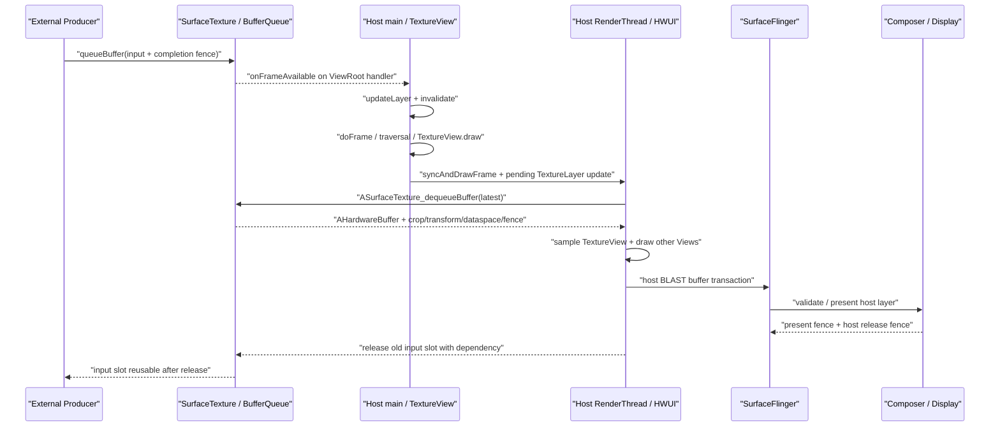

# 18.7 Android 17 TextureView 宿主合成链路

## 为什么要理解 TextureView 的链路

TextureView 看起来是普通 View：它能跟随父布局做 alpha、scale、rotation、clip 和 transition，也能与兄弟 View 按宿主绘制顺序混合。它的像素来源却不是普通 `onDraw()`。Camera、MediaCodec、EGL/Vulkan 或其它 Producer 先向 `SurfaceTexture` 提交 buffer，宿主 HWUI 再把最新输入作为纹理采样进 App Window buffer。

因此，一次可见更新包含两次生产：

```text
外部内容：Producer → SurfaceTexture BufferQueue
宿主窗口：SurfaceTexture → HWUI / RenderThread → App Window BufferQueue
```

这张简图用于划分两套队列。外部 `queueBuffer()` 只表示内容到达应用侧 Consumer；宿主 `queueBuffer()` 只表示最终窗口到达 SurfaceFlinger。用户看到新内容还依赖宿主帧调度、输入 acquire fence、HWUI 采样、宿主 GPU、SurfaceFlinger/HWC 与 display present。

TextureView 的价值是把外部内容纳入普通 View 的合成语义。业务需要连续旋转、父级裁剪、交叉淡入淡出、滤镜或与 UI 一起截图时，这种结构比独立 Surface 更直接。代价也来自同一结构：

- 新内容需要等宿主 View 帧把 TextureLayer 更新送到 RenderThread；
- 宿主 GPU 要读取外部 image，再写出包含 TextureView 的窗口 buffer；
- SurfaceFlinger 只看到最终 App Window layer，不能把其中的 TextureView 区域重新拆成独立 video overlay；
- 输入队列与宿主窗口队列各有 fence、slot 和背压，任一段迟到都可能复用旧内容或让整窗晚交。

这不是固定性能排名。小尺寸、低帧率 TextureView 的采样成本可能很低；SurfaceView 也可能因为复杂 layer 集合进入 CLIENT composition。选型应比较目标分辨率、帧率、视觉变换、protected 内容要求、功耗和设备 HWC/GPU 能力。

### 硬件加速是前提

`TextureView` 只能在硬件加速窗口中显示内容。Android 17 的 `onAttachedToWindow()` 会在硬件加速关闭时记录 warning，`draw()` 也只在 `canvas.isHardwareAccelerated()` 时创建并绘制 `TextureLayer`。

外部 Producer 仍可能继续 queue，所以“Camera/codec 正常输出”不能排除 TextureView 黑屏。排查时要同时确认 Window/ViewRoot 的硬件加速、SurfaceTexture 生命周期、Producer connection 和宿主绘制。

## 三阶段链路详解

### 第一阶段：外部 Producer

Producer 可以是 Camera、codec、GLES、Vulkan、Canvas 或业务引擎。它从 `SurfaceTexture` 背后的 BufferQueue 获取可写 buffer，填充内容，再随时间戳、crop、transform、dataspace、HDR metadata 与完成 fence 提交。站在应用侧 Consumer 看，这条完成依赖是输入 acquire fence。

Producer 的线程和进程没有统一模式。MediaCodec、Camera 可能跨应用、系统服务、provider/HAL 和厂商组件；EGL/Vulkan Producer 也可能就在应用进程。识别责任对象要沿目标 BufferQueue、frame number 与 fence 回溯，不能用某个固定进程名代替证据。

### 第二阶段：TextureView 与宿主 HWUI

Android 17 的消费过程可分成 UI 线程记录和 RenderThread 执行：

1. 新 buffer 触发 `SurfaceTexture.OnFrameAvailableListener`。
2. `TextureView` 把 listener 绑定到 `mAttachInfo.mHandler`，也就是宿主 ViewRoot 所在线程。
3. listener 调用 `updateLayer()` 与 `invalidate()`：前者设置 `mUpdateLayer`，后者把 View 标脏。
4. 宿主 `Choreographer#doFrame()` 进入 traversal；`TextureView.draw()` 在硬件 Canvas 上执行 `applyUpdate()`。
5. `TextureLayer.updateSurfaceTexture()` 通过 `HardwareRenderer.pushLayerUpdate()` 把 native updater 加入 RenderThread pending layer updates。
6. `DrawFrameTask::syncFrameState()` 处理 pending updates；`DeferredLayerUpdater::apply()` 调用 `ASurfaceTexture_dequeueBuffer()` 取得最新 `AHardwareBuffer`。
7. HWUI 按 slot 建立或复用 `SkImage`，应用 crop、transform、dataspace、HDR metadata、alpha 与过滤，把内容和其它 View 一起画进 App Window buffer。

这里有两个容易混淆的名字。公共 `SurfaceTexture.updateTexImage()` 仍适用于应用自管 GLConsumer 的语义说明，但 Android 12—17 的 HWUI TextureView 主消费点是 `DeferredLayerUpdater::apply()` 与 `ASurfaceTexture_dequeueBuffer()`。`onSurfaceTextureUpdated()` 发生在 UI 线程的 `applyUpdate()` 之后，此时 RenderThread 未必已经取得新 buffer，更不能证明用户看到新帧。

### 第三阶段：宿主 BLAST、SurfaceFlinger 与 HWC

RenderThread 完成宿主窗口绘制后，把 App Window buffer 和完成 fence 交给宿主 BLAST。SurfaceFlinger server 收到的是宿主 layer 的 buffer transaction；外部 SurfaceTexture stream 没有成为一个独立可见 SF layer。

SurfaceFlinger 更新 FrontEnd layer state 和 snapshot，选择宿主新 buffer 或复用旧 buffer，再让 CompositionEngine/HWC 处理整屏 layer 集合。HWC 可以把整个 App Window layer 判为 DEVICE 或 CLIENT，却无法只对窗口内部的 TextureView 矩形分配独立 Overlay plane。

下面的时序图把外部提交和宿主提交放在同一条时间线上：



图中 `onFrameAvailable()`、RenderThread acquire 和宿主 BufferTX 是三个不同边界。回调赶上当前 traversal，也可能晚于当前 RenderThread layer apply；这种情况下本轮仍使用旧输入，下一宿主帧再消费新内容。

## SurfaceTexture 机制深入

### 两套 Producer/Consumer

TextureView 页面至少有两套 buffer 周转：

```text
External Producer
  → SurfaceTexture BufferQueue
  → app-process HWUI Consumer / DeferredLayerUpdater
  → GPU image sampling
  → App Window buffer Producer
  → host BLASTBufferQueue
  → SurfaceFlinger / HWC
```

第一套队列的 Consumer 位于应用 HWUI，第二套队列把宿主窗口交给显示系统。两套队列拥有各自的 frame number、slot、acquire/release fence 与背压。宿主 `BufferTX` 不能说明 SurfaceTexture 输入队列是否堆积，外部 Producer 的 `dequeueBuffer()` 也不能说明宿主 BLAST 没有可写 buffer。

### Android 17 的对象关系

- `TextureView`：管理 View 生命周期、dirty 状态、listener、opaque、内容变换和绘制入口。
- `SurfaceTexture`：向 Producer 提供 BufferQueue producer 端，并向应用发送 frame-available 通知。
- `TextureLayer`：Java HWUI 对象，持有 native `DeferredLayerUpdater`，通过 `pushLayerUpdate()` 进入 RenderThread。
- `DeferredLayerUpdater`：取得最新 `AHardwareBuffer`，维护按 slot 的 `SkImage` 包装，处理 crop、transform、dataspace、buffer format 与 HDR 最大亮度。
- App Window `Surface`/BLAST：接收宿主 HWUI 最终 buffer，并把宿主 layer 提交给 SurfaceFlinger。

HWUI `TextureLayer` 不是 SurfaceFlinger layer。“layer”这个词出现在两个进程和两个 Consumer 体系中；trace 报告必须写明对象属于应用 HWUI 还是系统合成。

### 最新帧选择

Android 17 的 `DeferredLayerUpdater.cpp` 对 `ASurfaceTexture_dequeueBuffer()` 有明确注释：同步模式下无法提前知道队列模式，因此丢弃除最新一帧外的 pending frame。这个策略能避免宿主依次显示已经过时的排队帧，但不保证端到端低时延。

以下环节仍可能增加延迟：

- Producer 在目标时间后才 queue；
- frame-available callback 被宿主线程工作延迟；
- callback 到达晚于当前 RenderThread layer apply；
- 输入 acquire fence 迟到；
- image import、颜色处理、缩放或宿主 GPU 过载；
- App Window BLAST/HWC 尚未释放宿主 buffer；
- display present 采用了上一块宿主 buffer。

“丢弃旧 pending frame”也意味着 TextureView 不适合依赖每一输入帧都被显示或处理的任务。需要逐帧消费时，应选择提供明确 acquire 语义的 ImageReader、MediaCodec buffer 模式或应用自管队列，而非把显示型 TextureView 当成帧处理 API。

### image import、GL 与 Vulkan

输入 buffer 通常通过 `AHardwareBuffer` 导入为 GPU 可采样 image，避免 CPU 逐像素复制整帧。Android 17 的 `DeferredLayerUpdater` 同时处理 SkiaGL 与 SkiaVulkan：

- SkiaGL 分支通过 `EglManager` 建立 wait/release fence；
- SkiaVulkan 分支通过 `VulkanManager` 建立 wait/release fence，并管理 image queue ownership；
- 两条分支最终都把输入 image 交给 HWUI layer，再写入宿主窗口。

因此，TextureView 不能被描述为固定 OES/SkiaGL 后端。应用自管 `SurfaceTexture.updateTexImage()` 常用 `GL_TEXTURE_EXTERNAL_OES`；HWUI Android 17 的准确抽象则是 `ASurfaceTexture_dequeueBuffer()`、`AHardwareBuffer`、Skia image 与当前 RenderPipelineType。切换 GL/Vulkan backend 不会消除宿主采样这一结构成本，但会改变 image import、同步、shader/颜色处理和驱动行为。

### 生命周期与所有权

`TextureView.SurfaceTextureListener` 是应用可用的生命周期边界：

| 回调 | 含义 | 应用责任 |
|---|---|---|
| `onSurfaceTextureAvailable()` | 当前 SurfaceTexture 和尺寸可用 | 创建并保存 `Surface`，连接一个 Producer |
| `onSurfaceTextureSizeChanged()` | View 尺寸改变，默认 buffer size 已更新 | 更新输出尺寸、viewport、crop 或内容变换 |
| `onSurfaceTextureUpdated()` | UI 线程已把 TextureLayer update 加入宿主流程 | 只能作更新请求通知，不能当作 acquire、GPU 完成或可见时间 |
| `onSurfaceTextureDestroyed()` | TextureView 将放弃当前 SurfaceTexture | 返回 true 由 TextureView release；返回 false 由调用方接管并负责 release |

同一 TextureView 同时只能连接一个 Producer。Camera preview、MediaCodec output 与 `lockCanvas()` 不能并发写同一 SurfaceTexture。

下面的代码用应用自有接口表达停止与资源释放，`FrameProducer` 不是 Android SDK 类型：

```kotlin
private interface FrameProducer {
    fun attach(surface: Surface, width: Int, height: Int)
    fun resize(width: Int, height: Int)
    fun detachAndWaitUntilIdle()
}

private var producerSurface: Surface? = null

textureView.surfaceTextureListener = object : TextureView.SurfaceTextureListener {
    override fun onSurfaceTextureAvailable(st: SurfaceTexture, width: Int, height: Int) {
        producerSurface = Surface(st).also {
            frameProducer.attach(it, width, height)
        }
    }

    override fun onSurfaceTextureSizeChanged(st: SurfaceTexture, width: Int, height: Int) {
        frameProducer.resize(width, height)
    }

    override fun onSurfaceTextureUpdated(st: SurfaceTexture) = Unit

    override fun onSurfaceTextureDestroyed(st: SurfaceTexture): Boolean {
        frameProducer.detachAndWaitUntilIdle()
        producerSurface?.release()
        producerSurface = null
        return true
    }
}
```

这段骨架强调两个所有权：Producer 停止触碰旧目标后，destroyed 回调才能返回；应用创建的 `Surface` 由应用 release。若 destroyed 返回 false，TextureView 不会释放 SurfaceTexture，调用方必须保存并在合适时机释放。

`setSurfaceTexture(newTexture)` 是另一处高风险入口：TextureView 会立即 release 旧对象，且不回调旧对象的 `onSurfaceTextureDestroyed()`；传入的新对象也不会触发 `onSurfaceTextureAvailable()`。新对象在传入前必须从所有 GL context detach，旧 Producer 也应先停止使用旧目标。

不可见时，Android 17 的 `onVisibilityChanged()` 会移除内部 frame-available listener；重新可见时再注册并调用 `updateLayerAndInvalidate()`。Producer 在不可见期间继续 queue，不保证宿主持续消费。Tab、RecyclerView、前后台切换恢复后卡在旧帧，应一起检查 listener、SurfaceTexture 是否替换、Producer 是否重连和队列中最新 buffer。

## 额外纹理采样的性能代价

### 采样与宿主 render pass

TextureView 的额外成本不是 CPU 把整块像素 memcpy 到宿主窗口。常见路径会导入 `AHardwareBuffer` 并让 GPU 采样，成本来自：

- image import、缓存与所有权转换；
- 输入 acquire fence 等待；
- 纹理过滤、缩放、rotation、crop 和内容变换；
- buffer format/dataspace 相关的颜色转换；
- alpha、blend、clip、color filter 和其它 View 的组合；
- 高分辨率输入的读取带宽；
- 宿主 App Window render pass 和最终 buffer 写出。

不能固定写成“每帧上传 YUV”或“内存一定翻倍”。输入可能是多平面 external format、RGBA 或驱动支持的其它形式；队列 buffer 数、宿主尺寸、像素格式、保留策略和 GPU 缓存都会改变内存占用。估算时应读取目标设备的实际 buffer format、尺寸、slot 状态和 gfx/meminfo 数据。

### 宿主调度门槛

`onFrameAvailable()` 只设置待更新标记并 `invalidate()`。若宿主已有 pending traversal，请求会合入该帧；若没有，ViewRoot 再申请 VSync。外部 buffer 能否进入当前宿主帧，取决于回调、UI `applyUpdate()` 和 RenderThread pending layer apply 的先后关系。

因此，TextureView 不保证“固定多一帧”，也不能与 Producer 完全独立刷新。回调足够早并赶上当前宿主帧时，额外等待可能小于一个刷新周期；错过 acquire 截止点时，新内容至少要等下一次宿主 draw。

### 两套同步与背压

需要分开四类边界：

- 输入 acquire fence：外部 Producer 何时完成当前内容 buffer；
- 输入 release fence：HWUI 何时不再读取旧输入 slot，Producer 何时可以复用；
- 宿主 acquire/release fence：宿主 GPU 何时写完 App Window，SF/HWC 何时不再读取；
- present fence：一次 display present 的显示栈时间边界，不属于某个 TextureView 输入 slot。

同一可见帧可能先等外部 acquire fence，又受宿主 GPU 和 App Window release channel 约束。报告里只写“GPU fence 慢”会丢失等待者、创建者和队列所有权。

kernel `android17-6.18-2026-06_r6` 的 `drivers/dma-buf/sync_file.c` 提供 fence fd 接口，`drivers/dma-buf/dma-fence.c` 提供 signal、callback 和 wait 语义。它们不能说明某台设备上的 GPU、codec、camera 或 display fence 为何迟到；还需结合驱动 timeline、vendor service 与硬件轨迹。

### Android 12—17 的版本边界

| 平台 | 已核实变化 | 分析含义 |
|---|---|---|
| Android 12 / API 31 | `DeferredLayerUpdater` 已使用 `ASurfaceTexture_dequeueBuffer()`、`AHardwareBuffer` 与 `SkImage` | Android 12 已是当前 HWUI 消费模型基线，不能只用旧 `updateTexImage()` 名称描述 |
| Android 13 / API 33 | 增加 CTA-861.3 / SMPTE 2086 HDR metadata 读取 | HDR 还要检查 dataspace、metadata、宿主颜色策略与 display 能力 |
| Android 14 / API 34 | listener→TextureLayer→DeferredLayerUpdater→App Window 主拓扑延续 | SurfaceView 的 API 34 alpha/lifecycle 变化不能套到 TextureView |
| Android 15 / API 35 | gated `OnSetFrameRateListener` 可把输入流请求传给 View requested frame rate | 这是 hint bridge，不保证系统切换到指定刷新率 |
| Android 16 / API 36 | AHardwareBuffer/SkImage 消费与 frame-rate bridge 延续 | 跨版本差异应核对应用、Skia backend、driver 和刷新率策略 |
| Android 17 / API 37 | 当前实现继续处理 crop、transform、dataspace、HDR 与 slot image cache | 当前存在的机制不能自动写成 API 37 新增 |

## 链路级对比：SurfaceView vs TextureView

两者都能向 Producer 暴露 `Surface`，差异在主体像素由谁消费：

```text
SurfaceView:
Producer → independent BufferQueue/BLAST child → SurfaceFlinger → HWC

TextureView:
Producer → SurfaceTexture → app HWUI sampling → host App Window
         → SurfaceFlinger → HWC
```

这张对比图说明 TextureView 多的是应用内 Consumer 与宿主采样，不是额外的 CPU 像素拷贝。SurfaceView 主体保持独立 layer，TextureView 主体进入宿主窗口。

| 维度 | SurfaceView | TextureView |
|---|---|---|
| 主体最终可见对象 | 独立 BLAST child layer | 宿主 App Window buffer 中的一部分 |
| 宿主 RenderThread | 不采样主体；仍处理普通 View 与几何相关工作 | acquire 输入 image，并与其它 View 一起绘制 |
| View 变换 | 受 SurfaceControl、composition order、crop 和 hole-punch 语义约束 | 支持普通 View 的 transform、alpha、clip 与绘制顺序 |
| 帧节奏 | 内容可与宿主 UI 不同 | 新内容要经过一次宿主 HWUI frame |
| HWC | 可独立评估主体 DEVICE/CLIENT | 只能评估整个宿主 layer |
| protected 内容 | 可建立 secure/protected 独立路径 | 普通 HWUI Consumer 通常不适合读取受保护 buffer |
| 队列 | 内容队列与宿主队列在 SF 汇合 | 输入队列先由应用消费，再生成宿主队列 |
| trace 重点 | host、container、BLAST child、HWC | 输入 queue、listener、TextureLayer、RT acquire、host BufferTX |

SurfaceView 不保证更快，TextureView 也不保证固定多一个刷新周期。迁移前应回答：

1. 是否需要普通 View 级的旋转、裁剪、滤镜和交叉混合？
2. 是否要求 protected/secure 内容？
3. 主体分辨率和更新频率带来的宿主 GPU/带宽成本能否接受？
4. 页面是否需要主体内容绕开宿主 UI 卡顿继续更新？
5. 目标设备上 SurfaceView 能否满足层级和动画要求，HWC 是否稳定？

游戏引擎、WebView、Flutter、React Native 或地图框架的名称不能直接决定路径。它们可能使用 TextureView、SurfaceView、普通 App Window 或嵌入式 SurfaceControl。应先确认 layer/BufferQueue 拓扑，再分析引擎线程。

## onFrameAvailable 回调模型

Android 17 的内部 listener 骨架如下：

```text
SurfaceTexture.setOnFrameAvailableListener(mUpdateListener, mAttachInfo.mHandler)

mUpdateListener.onFrameAvailable(surfaceTexture)
  updateLayer()   // mUpdateLayer = true
  invalidate()    // mark TextureView dirty
```

这段结构说明回调进入宿主 ViewRoot handler。它不是 RenderThread acquire，也不是独立 VSync callback。应用直接使用裸 SurfaceTexture 时可以自行选择 listener handler；讨论 TextureView 内部行为时，应以 `mAttachInfo.mHandler` 为准。

### invalidate 的合并

`invalidate()` 把 dirty region 交给 ViewRoot。已有 traversal 时，新请求可被合并；没有 pending frame 时，`scheduleTraversals()` 注册 traversal callback，Choreographer 才申请下一次 VSync。一个外部 queue 不对应一个独立 `vsync-app`。

常见时序有三种：

- 新 buffer 在 RenderThread 处理 TextureLayer 前就绪，本轮可能采到新内容；
- callback 进入了当前 traversal，但晚于 pending layer apply，本轮复用旧内容；
- 宿主当时没有 pending frame，callback 触发下一次宿主帧。

判断是否“赶上这一帧”的截止点，是 RenderThread 对该 `DeferredLayerUpdater` 执行 apply 的时间，不是 `queueBuffer()`、callback 或 `Choreographer#doFrame()` 的任一单点。

### 尺寸、opaque 与 transform

`onSizeChanged()` 会调用 `SurfaceTexture.setDefaultBufferSize()`、标记 layer 更新，并通知 `onSurfaceTextureSizeChanged()`。这只能设置默认 buffer size；Producer 仍需按自己的 API 更新输出，避免持续生成与 View bounds 差异很大的 buffer。

TextureView 默认假设内容 opaque。`setOpaque(false)` 改变 HWUI blending 语义，不会替 Producer 生成正确 alpha。`setTransform()` 只改变内容在 TextureView bounds 内的采样变换，不改变 View layout 或触摸命中区域；Camera 方向、镜像、center-crop 和触摸坐标应使用同一套映射关系。

### frame-rate hint

Android 15—17 在 flag 开启时会注册 `SurfaceTexture.OnSetFrameRateListener`，把输入流的 frame-rate 请求转换为 TextureView 的 requested frame rate 与 compatibility。它只提供系统刷新率策略的输入，不保证显示模式按请求值切换。trace 应同时检查 flag、Producer 请求、Window requested rate、FrameRateOverride、display mode 和其它 layer。

## Trace 视角

### 证明 TextureView 拓扑

以下证据组合起来才能定型：

1. 外部 Producer 的目标是 SurfaceTexture 或由它创建的 `Surface`；
2. 应用 HWUI 存在 `TextureView`、`TextureLayer`、pending layer update 或 `DeferredLayerUpdater` 相关行为；
3. 新输入沿 `onFrameAvailable → updateLayer/invalidate → 宿主 frame` 传播；
4. RenderThread 取得输入 image，再提交宿主 App Window buffer；
5. SurfaceFlinger layer tree 没有与该输入 stream 对应的独立可见 buffer layer。

单独出现 SurfaceTexture、EGL swap、MediaCodec、Camera 或宿主 GPU 忙都不能定型。普通 HWUI 页面也可能只有一个 App Window layer，应用自管 GLConsumer 也会使用 SurfaceTexture。

### 建立对象与时间表

| 对象 | 身份字段 | 时间点 |
|---|---|---|
| 外部 Producer | 进程/线程、目标 queue、frame number | dequeue、填充、queue、completion fence |
| SurfaceTexture 队列 | producer/consumer、slot、queued/acquired | frame available、acquire latest、release old |
| TextureView/TextureLayer | ViewRoot、handler、updater | callback、invalidate、applyUpdate、pending update |
| Host App Window | layer id/name、BLAST queue | doFrame、DrawFrame、host queue、BufferTX、latch |
| DisplayFrame | display token、composition | validate、client target、present/release fence |

SurfaceFlinger layer tree 通常只能帮助确认宿主窗口，不能直接列出应用内 SurfaceTexture slot。第一套队列需要从应用/Producer trace、BufferQueue 名、frame callback 或业务 instrumentation 回溯。

### 对齐两次生产

把以下点放在同一时间轴：

1. 外部 Producer queue；
2. frame-available callback；
3. `invalidate()` / `scheduleTraversals()`；
4. 宿主 `Choreographer#doFrame()`；
5. UI `TextureView.draw()` / `applyUpdate()`；
6. RenderThread `syncFrameState()` 与 pending layer apply；
7. `ASurfaceTexture_dequeueBuffer()` 选择的输入 frame；
8. 宿主 GPU draw 与 host queue；
9. 宿主 BufferTX、SF/HWC 与 display present。

如果 callback 早到但 RenderThread 仍取得旧 frame，应检查 pending update 是否进入该宿主帧、输入 acquire fence 是否可用、frame number 是否配对正确。callback 到得晚于 layer apply，下一宿主帧才更新符合实现。

### 分开等待位置

| 等待位置 | 所属队列 | 常见上游 |
|---|---|---|
| 外部 Producer dequeue/swap | SurfaceTexture 输入队列 | HWUI 消费慢、旧 slot release fence 未完成、Producer 过快 |
| RenderThread input wait/import | SurfaceTexture 输入队列 | codec/camera/GPU 未完成、driver ownership/import |
| 宿主 RenderThread dequeue | App Window BLAST 队列 | SF/HWC 未释放 host buffer、display backpressure |
| SF/HWC 等宿主 acquire fence | App Window BLAST 队列 | 宿主 GPU 尚未完成 TextureView 与 UI 绘制 |

“卡在 dequeueBuffer”必须附带目标队列和 layer；“等待 fence”必须附带 acquire/release/present 类型和创建者。两套背压可以在同一可见帧同时出现。

### FrameTimeline 与 HWC

FrameTimeline 主要覆盖宿主 App Window 与 SurfaceFlinger display frame。它能回答宿主帧是否 late、是否 buffer stuffing、哪个 `surface_frame_token` 对应哪个 `display_frame_token`；外部 SurfaceTexture 输入 frame 仍要用 queue frame number、timestamp、callback 和 fence 关联。

TextureView 没有独立 composition type。宿主 layer 显示 DEVICE，只说明已经包含 TextureView 像素的整块窗口由 HWC 作为一个 layer 处理，不表示视频矩形获得 Overlay。`presentOrValidate()` 返回 PresentSucceeded 也只说明组合 HAL 调用已完成 present 并保存 fences，不表示 panel 已完成扫描。

## 常见性能问题与优化

### Producer 已 queue，画面仍旧

依次检查 callback 是否进入宿主 handler、View 是否可见、`invalidate()` 是否合入目标 traversal、UI 是否执行 `applyUpdate()`、RenderThread 选择了哪个输入 frame、输入 acquire fence 何时 ready。Producer queue 按时只能证明第一套队列收到了内容。

### 主线程或宿主帧迟到

TextureView 的新内容要经过宿主帧，因此主线程 I/O、锁竞争、GC、复杂布局会延迟 listener 和 traversal。修复应落在具体主线程工作；若业务不需要 View 级混合，也可以用目标设备数据评估 SurfaceView。不要把 `doFrame` 一律要求成固定 16 ms，高刷新率与动态刷新率设备的 deadline 不同，应使用 FrameTimeline expected/actual。

### RenderThread 或输入 fence 慢

区分 CPU slice、GPU wait 与 driver queue。`DeferredLayerUpdater::fenceWait()` 会根据 SkiaGL/SkiaVulkan 使用不同 manager；等待可能出现在 CPU，也可能以 GPU-side dependency 体现。继续向上查 codec、camera、外部 GPU 或 image import，不能只优化 TextureView draw。

### 外部 Producer dequeue 变长

检查 SurfaceTexture 输入 slot、旧 buffer release fence 与 HWUI 消费 cadence。宿主不可见时内部 listener 会被移除，Producer 继续满速输出可能让输入队列表现改变。盲目增加 buffer 数量会增加内存或旧帧排队，应先确定业务更重视吞吐还是时延。

### 宿主窗口背压

如果宿主 RenderThread 卡在 App Window dequeue，问题属于第二套队列。检查 host release fence、SF/HWC composition、display mode、buffer stuffing 和其它窗口；外部输入队列此时可能完全正常。

### 高分辨率内容导致 GPU/带宽上升

读取输入 buffer 尺寸、format、dataspace、缩放比例和宿主刷新率，结合 GPU counter 与功耗测量。减少无效超采样、按 View 尺寸配置 Producer、降低不必要的 alpha/滤镜或迁移独立 Surface，都可能有效。不要用固定“1080p 每帧多少 MB × 三缓冲”代替设备证据。

### 黑屏、旧帧与生命周期泄漏

黑屏优先检查硬件加速、SurfaceTexture available/destroyed、Producer connection、Surface 是否 release、View visibility 与 protected usage。destroyed 返回 false 后未 release，会保留 native 队列和 GraphicBuffer；`setSurfaceTexture()` 前未停止旧 Producer，可能形成无效连接或竞态。

普通 HWUI TextureView Consumer 通常不适合读取 protected DRM buffer。播放器可能拒绝配置、显示黑屏或切换到 secure SurfaceView，行为取决于 DRM、codec、gralloc 和设备能力，不能承诺统一错误表现。

### 预览跳帧但交互延迟较低

核对 `ASurfaceTexture_dequeueBuffer()` 是否持续选最新 frame，以及 Producer cadence 是否高于宿主消费 cadence。对显示预览，这可能是主动丢弃旧内容；对逐帧处理则说明 API 选型不合适。不要把中间 frame 未显示直接归因于 BufferQueue 损坏。

### HDR、折叠与坐标错位

HDR 要同时检查 buffer format、dataspace、CTA-861.3/SMPTE 2086 metadata、宿主 Window color mode、Skia backend 和 display policy。折叠、多窗口或 cutout 本身不会给 TextureView 增加专用渲染路径；Window bounds 变化会触发普通 View layout 与 `onSizeChanged()`。画面方向、crop 和触摸坐标要把 View layout、TextureView content transform 与 Producer transform 一起核对。

### 复核清单

1. TextureView 是否处于硬件加速窗口？
2. 谁创建 SurfaceTexture、谁创建并 release `Surface`？
3. destroyed 返回值与资源所有权是否一致？
4. 同一时刻是否只有一个 Producer？
5. 输入 buffer 尺寸、format、dataspace、crop 与 View bounds 是否匹配？
6. frame-available 投递到哪个 looper，是否被宿主线程延迟？
7. 输入 frame 是否赶上目标 RenderThread layer apply？
8. 输入、宿主与 display 三类 fence 分别属于谁？
9. HWC 看到哪个宿主 layer，是否有人把它误称为 TextureView Overlay？
10. 结论是否固定到 Android、应用和 vendor 版本，并有源码或 trace 证据？

### Android 17 源码锚点

源码以 Platform `android-17.0.0_r1` 与 Kernel `android17-6.18-2026-06_r6` 为准：

- [`TextureView.java`](https://android.googlesource.com/platform/frameworks/base/+/refs/tags/android-17.0.0_r1/core/java/android/view/TextureView.java)：hardware acceleration、listener、lifecycle、draw/applyUpdate、visibility 与 frame-rate bridge；
- [`SurfaceTexture.java`](https://android.googlesource.com/platform/frameworks/base/+/refs/tags/android-17.0.0_r1/graphics/java/android/graphics/SurfaceTexture.java)：公共 Producer/Consumer、callback、release 与自管 GLConsumer 语义；
- [`TextureLayer.java`](https://android.googlesource.com/platform/frameworks/base/+/refs/tags/android-17.0.0_r1/graphics/java/android/graphics/TextureLayer.java)：native updater、`pushLayerUpdate()` 与 SurfaceTexture 绑定；
- [`DeferredLayerUpdater.cpp`](https://android.googlesource.com/platform/frameworks/base/+/refs/tags/android-17.0.0_r1/libs/hwui/DeferredLayerUpdater.cpp)：latest buffer、AHardwareBuffer/SkImage、SkiaGL/SkiaVulkan fence、crop、transform、dataspace 与 HDR；
- [`DrawFrameTask.cpp`](https://android.googlesource.com/platform/frameworks/base/+/refs/tags/android-17.0.0_r1/libs/hwui/renderthread/DrawFrameTask.cpp)、[`CanvasContext.cpp`](https://android.googlesource.com/platform/frameworks/base/+/refs/tags/android-17.0.0_r1/libs/hwui/renderthread/CanvasContext.cpp)：pending layer updates、prepareTree、draw 与 host swap；
- [`BufferQueueProducer.cpp`](https://android.googlesource.com/platform/frameworks/native/+/refs/tags/android-17.0.0_r1/libs/gui/BufferQueueProducer.cpp)、[`BufferQueueConsumer.cpp`](https://android.googlesource.com/platform/frameworks/native/+/refs/tags/android-17.0.0_r1/libs/gui/BufferQueueConsumer.cpp)：输入队列 slot、acquire/release 与背压；
- [`BLASTBufferQueue.cpp`](https://android.googlesource.com/platform/frameworks/native/+/refs/tags/android-17.0.0_r1/libs/gui/BLASTBufferQueue.cpp)、[SurfaceFlinger FrontEnd](https://android.googlesource.com/platform/frameworks/native/+/refs/tags/android-17.0.0_r1/services/surfaceflinger/FrontEnd/)、[`HWComposer.cpp`](https://android.googlesource.com/platform/frameworks/native/+/refs/tags/android-17.0.0_r1/services/surfaceflinger/DisplayHardware/HWComposer.cpp)：host BufferTX、layer state、validate/present 与 fences；
- [`sync_file.c`](https://android.googlesource.com/kernel/common/+/refs/tags/android17-6.18-2026-06_r6/drivers/dma-buf/sync_file.c)、[`dma-fence.c`](https://android.googlesource.com/kernel/common/+/refs/tags/android17-6.18-2026-06_r6/drivers/dma-buf/dma-fence.c)：kernel fence fd 与等待语义；
- [Perfetto FrameTimeline](https://perfetto.dev/docs/data-sources/frametimeline)：宿主 SurfaceFrame、DisplayFrame、expected/actual 与 jank 字段。

相关章节：

- [18.6 SurfaceView 独立 Surface 路径](06-surfaceview.md)
- [18.8 OpenGL ES 渲染路径](08-opengl-es.md)
- [2.13 BufferQueue](../../part1-fundamentals/ch02-rendering/13-buffer-queue.md)
- [2.6 SurfaceFlinger](../../part1-fundamentals/ch02-rendering/06-surfaceflinger.md)
