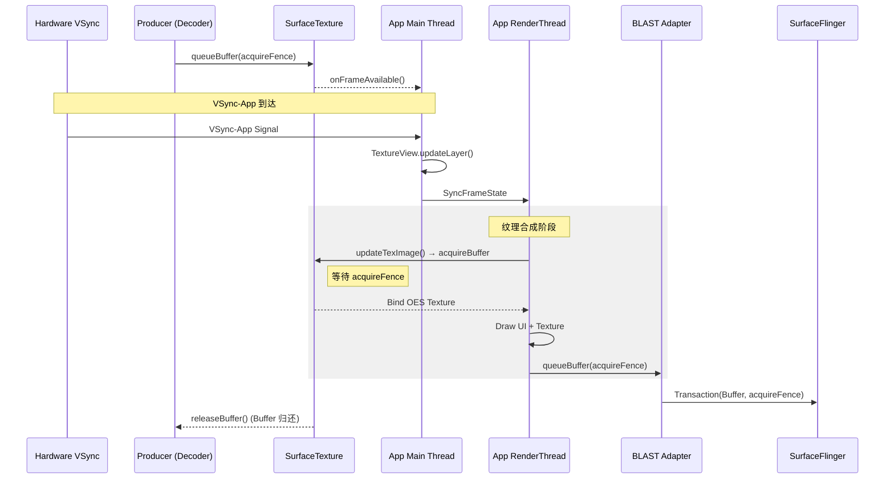

<!-- outline-start -->

**锚点（必须覆盖）：**
- [18.7.1 为什么理解 TextureView 的链路](#为什么理解-textureview-的链路) — "伪装者"的本质
- [18.7.2 三阶段链路详解](#三阶段链路详解) — Producer → SurfaceTexture → RenderThread → SF
- [18.7.3 SurfaceTexture 机制深入](#surfacetexture-机制深入) — 双角色组件的核心
- [18.7.4 额外拷贝的性能代价](#额外拷贝的性能代价) — updateTexImage 的开销分析
- [18.7.5 链路级对比](#链路级对比surfaceview-vs-textureview) — 与 SurfaceView 的架构差异
- [18.7.6 onFrameAvailable 回调模型](#onframeavailable-回调模型) — 线程绑定与延迟
- [18.7.7 Trace 视角](#trace-视角) — Perfetto 中的识别方法
- [18.7.8 常见性能问题与优化](#常见性能问题与优化) — 实战瓶颈分析

**扩展（可选深入）：**
- OES External Texture 的 GPU 管线
- Flutter TextureView render mode 的关系
- 从 TextureView 迁移到 SurfaceView 的路径

<!-- outline-end -->

## 为什么理解 TextureView 的链路

TextureView 是一个"伪装者"——它表面上是普通的 View，可以设置透明度、做动画、裁剪圆角，和其他 View 一样参与 View 树的绘制流程。但在渲染层面，它背后走了一套复杂的"转手"流程：帧数据先到 SurfaceTexture，再由 App 的 RenderThread 采样合成，最后才提交给 SurfaceFlinger。

这个"转手"过程就是 TextureView 性能不如 SurfaceView 的根本原因。理解这条链路，你就能在 Perfetto 中区分"帧数据卡在 SurfaceTexture 等待"和"帧数据卡在 GPU 绘制"两种完全不同的问题。[已验证: AOSP TextureView 实现]

TextureView 是 Android 4.0（API 14）引入的，初衷是弥补 SurfaceView 的灵活性不足——SurfaceView 不支持动画变换、不能嵌入 View 层级做裁剪旋转。但随着 Android 11+ BLAST 同步机制的成熟，SurfaceView 的很多老问题已经解决，TextureView 的使用频率在下降。但在特效场景（视频滤镜、直播美颜、画中画动画）中，TextureView 仍然是唯一选择。

## 三阶段链路详解

TextureView 的渲染链路比 SurfaceView 多了一个关键环节——App 侧的纹理合成。这个额外的环节就是它性能劣势的来源。

### 第一阶段：Producer（生产者）

和 SurfaceView 一样，这里有一个独立的线程在画图（视频解码、Camera、游戏等）：

1. **Produce**：解码器或 Camera 生成一帧图像
2. **queueBuffer**：提交给 `SurfaceTexture`（TextureView 的私有 BufferQueue）
3. **Callback**：触发 `onFrameAvailable` 回调，通知有新帧可用

Producer 向 SurfaceTexture 提交帧的方式与向普通 BufferQueue 提交完全相同——SurfaceTexture 本身就是一个 BufferQueue 的 Consumer 端。区别在于后续的消费方式。

### 第二阶段：App RenderThread（中转站）

这是 TextureView 性能问题的核心环节。帧数据到达 App 进程后，需要经过一次"中转"才能最终提交：

1. **Receive Callback**：`onFrameAvailable` 在 listener 绑定的线程收到通知，很多实现最终会回到 UI 线程触发 `invalidate()`
2. **Invalidate**：告诉 View 系统"TextureView 脏了，下一帧重画"
3. **SyncFrameState**：等待下一个 VSync-App 信号唤醒 RenderThread
4. **updateTexImage()**：RenderThread 在绘制 TextureView 时消费 SurfaceTexture 的最新图像
5. **GPU Draw**：把这个纹理当作一张普通贴图，画在 App 的主窗口 Buffer 上

这个"等待下一帧再消费"的机制意味着 TextureView 的帧更新频率被绑定到了 App UI 的帧率上——即使 Producer 以 60fps 生产帧，如果 App UI 只有 30fps，TextureView 也只能展示 30fps 的内容。

### 第三阶段：BLAST 提交

1. **queueBuffer**：App RenderThread 将包含 TextureView 内容的主窗口 Buffer 提交给 BLAST Adapter
2. **Transaction**：通过 BLAST Transaction 发送给 SurfaceFlinger
3. **Composite**：SurfaceFlinger 将 App 主窗口合成到屏幕



## SurfaceTexture 机制深入

SurfaceTexture 是 TextureView 链路的核心组件，它同时扮演了两个角色：

- **对 Producer**：它是一个 BufferQueue 的 Consumer 端，接收解码器等生产者的帧数据
- **对 Consumer（App RenderThread）**：它是一个纹理对象，通过 `updateTexImage()` 将最新帧绑定为 GL 可采样的纹理

这种双角色设计让 SurfaceTexture 成为 Android 图形栈中最独特的组件之一。

### SurfaceTexture 内部结构

SurfaceTexture 内部维护了两个关键队列：

1. **BufferQueue**：接收 Producer 的帧，管理 Buffer 的流转
2. **Texture Name**：一个 GL 纹理 ID，通过 EGLImage 绑定到最新的 Buffer

当 `updateTexImage()` 被调用时，SurfaceTexture 做了这些事：

1. **acquireBuffer**：从 BufferQueue 取出最新帧（丢弃中间帧，只保留最新的）
2. **EGLImage 创建/绑定**：将 GraphicBuffer 封装为 GL 可识别的外部纹理（OES Texture）
3. **releaseBuffer**：将旧的 Buffer 归还给 Producer

### OES External Texture

`updateTexImage()` 创建的是 **GL_OES_EGL_image_external** 类型的纹理。这是一种特殊的纹理类型，允许 GPU 直接采样来自 BufferQueue 的 GraphicBuffer，而不需要将其拷贝到标准的 GL 纹理中。

但"直接采样"不等于"零开销"。OES 纹理的采样路径取决于 GPU 驱动实现——在某些 GPU 上，它可能需要做一次格式转换或布局调整。无论如何，这都比 SurfaceView 的"零采样"路径多了一步。[已验证: AOSP SurfaceTexture]

## 额外拷贝的性能代价

TextureView 的性能代价不仅仅是"多一步"那么简单。从链路视角分析，它引入了三重开销：

### 1. 额外的 GPU 合成

SurfaceView 的帧数据直出给 SurfaceFlinger，可能走 HWC Overlay 完全不消耗 GPU。而 TextureView 的帧数据必须在 App 进程内被 GPU 采样一次，合成到 App 主窗口的 Buffer 中。

这意味着：
- **GPU 负载增加**：如果 App 的 UI 本身已经很复杂（复杂 RecyclerView、大量图片），TextureView 的额外纹理采样会进一步增加 GPU 压力
- **RenderThread 时间增加**：`updateTexImage` + Shader 采样需要时间，这个时间会加到 `DrawFrame` 的总耗时中

### 2. 帧率绑定

SurfaceView 的帧率独立于 App UI。TextureView 的帧率被绑定到 App 的 Choreographer 帧率：

- 如果 App 主线程卡顿 → `Choreographer#doFrame` 延迟 → `updateTexImage` 延迟 → TextureView 内容卡顿
- 即使 Producer 在正常生产帧，如果 App 的 VSync 回调被延迟，TextureView 的内容也会跟着延迟

这就是为什么在低端设备上，TextureView 播放视频比 SurfaceView 更容易卡——不是视频解码慢了，而是 App 主线程拖了后腿。

### 3. 内存翻倍

SurfaceView 只需要 Producer 的 Buffer（1x）。TextureView 需要：
- Producer Buffer（SurfaceTexture 内部的 BufferQueue）
- App 主窗口 Buffer（包含 TextureView 内容的合成结果）

内存占用大约是 SurfaceView 的 2 倍。在 4K 视频播放场景下，这个差异尤其明显。

## 链路级对比：SurfaceView vs TextureView

从链路视角，两者的核心差异可以用一张图说清楚：

```
SurfaceView:  Producer → BufferQueue → SurfaceFlinger → HWC → Display
TextureView:  Producer → SurfaceTexture → App RenderThread → SurfaceFlinger → HWC → Display
                                       ↑
                                    多一次合成
```

| 维度 | SurfaceView | TextureView |
|:---|:---|:---|
| **帧数据跳数** | 1 跳（Producer → SF） | 2 跳（Producer → RT → SF） |
| **App 主线程影响** | 不受影响 | 直接受影响 |
| **额外 GPU 采样** | 无 | 有（updateTexImage） |
| **内存占用** | 1x Producer Buffer | 1x Producer + 1x App Buffer |
| **延迟** | 低（直出） | 高（多一跳） |
| **HWC Overlay** | 可能 | 不可能 |
| **变换能力** | 无 | 完整支持（旋转/缩放/透明度/圆角） |
| **帧率独立性** | 独立 | 绑定到 App UI 帧率 |

## onFrameAvailable 回调模型

`onFrameAvailable` 是 Producer 与 App 之间的桥梁，它的线程绑定模型直接影响帧的传递延迟。

### 默认行为

`onFrameAvailable` 的回调线程取决于 SurfaceTexture 创建时的配置：

```java
// 默认：回调在任意线程（通常是 Producer 所在线程）
SurfaceTexture texture = new SurfaceTexture(texName);

// 指定回调线程
HandlerThread ht = new HandlerThread("STCallback");
ht.start();
SurfaceTexture texture = new SurfaceTexture(texName, true); // detached
texture.setOnFrameAvailableListener(listener, new Handler(ht.getLooper()));
```

### 回调延迟的来源

1. **线程切换**：如果回调在非 UI 线程触发，最终需要 post 到 UI 线程执行 `invalidate()`
2. **VSync 对齐**：`invalidate()` 只是请求重绘，真正的 `updateTexImage` 要等到下一个 VSync-App 唤醒 RenderThread
3. **Producer → Consumer → App → RenderThread → SF**：至少 2-3 帧的管线延迟

### 帧丢弃行为

SurfaceTexture 默认只保留最新的一帧。如果 Producer 生产了 3 帧，但 App 只消费了 1 次 `updateTexImage`，中间的 2 帧会被丢弃。这在视频播放场景下是合理的（永远显示最新帧），但在需要逐帧处理的场景（如视频编辑预览）中可能导致帧丢失。

## Trace 视角

### 识别 TextureView 链路

识别 TextureView 链路的关键是确认**帧数据经过了 App RenderThread**：

1. **App RenderThread 中的 TextureView 绘制**：在 RenderThread 的 Track 中，你会看到 `DrawFrame` 包含了 TextureView 的纹理采样操作
2. **updateTexImage 耗时**：如果 SurfaceTexture 的 acquireFence 还未 signal（GPU 还在画），`updateTexImage` 可能阻塞等待
3. **单一 BufferQueue Track**：与 SurfaceView 不同，TextureView 不会创建额外的 Layer——所有内容都在 App 主窗口的 Buffer 中
4. **onFrameAvailable 回调**：如果 Trace 配置包含回调追踪，可以看到从 Producer queueBuffer 到 App 收到回调的延迟

### 关键 Slice

| 位置 | 可能的 Slice | 说明 |
|:---|:---|:---|
| App RenderThread | `DrawFrame`, `updateTexImage` | 纹理采样耗时 |
| App Main Thread | `Choreographer#doFrame` | VSync 唤醒和 invalidate |
| Producer Thread | `queueBuffer` | 帧提交到 SurfaceTexture |
| SurfaceFlinger | 单一 App Layer | 没有 SurfaceView 的独立 Layer |

### 与 SurfaceView 的 Trace 差异

| 特征 | SurfaceView | TextureView |
|:---|:---|:---|
| SurfaceFlinger Layer 数量 | ≥2（App + SV） | 1（只有 App） |
| App 主线程卡顿时 | SV 内容继续更新 | TV 内容跟着卡 |
| RenderThread 职责 | 只处理 App UI | 还要处理 TextureView 纹理 |
| Composition Type | 可能是 DEVICE（Overlay） | 总是 CLIENT |

## 常见性能问题与优化

### 1. 主线程卡顿传导

**现象**：视频/Camera 画面与 App UI 同步卡顿，而不是独立刷新。

**原因**：TextureView 的帧更新绑定到 App 的 Choreographer 帧循环。主线程卡顿 → `Choreographer#doFrame` 延迟 → `updateTexImage` 延迟 → 内容卡顿。

**优化方向**：
- 检查主线程的耗时操作，确保 `doFrame` 在 16ms 内完成
- 如果可能，迁移到 SurfaceView 以解除帧率绑定

### 2. updateTexImage 延迟

**现象**：RenderThread 的 `DrawFrame` 耗时增大，瓶颈在 `updateTexImage`。

**原因**：Producer 的 acquireFence 未 signal（GPU 还在渲染上一帧），`updateTexImage` 等待 fence。

**优化方向**：
- 减少 Producer 的 GPU 工作量（降低分辨率、简化着色器）
- 增加 BufferQueue 深度（虽然 SurfaceTexture 的深度不可直接配置）

### 3. 内存压力

**现象**：低端设备上 OOM 或 GC 频繁触发。

**原因**：TextureView 需要同时持有 Producer Buffer 和 App 主窗口 Buffer，内存约为 SurfaceView 的 2 倍。

**优化方向**：
- 在低端设备上降级到 SurfaceView
- 降低视频/Camera 的输出分辨率

### 4. 帧丢弃导致画面跳跃

**现象**：视频播放时偶尔出现画面跳跃（跳过了一些帧）。

**原因**：SurfaceTexture 只保留最新帧，App 的帧率低于 Producer 帧率时，中间帧被丢弃。

**优化方向**：
- 确保 App UI 帧率足够高（避免主线程卡顿）
- 如果需要逐帧处理，考虑使用 ImageReader 替代 SurfaceTexture

## 参考资料

- AOSP `frameworks/base/core/java/android/view/TextureView.java`
- AOSP `frameworks/base/graphics/java/android/graphics/SurfaceTexture.java`
- Android 官方文档：TextureView
- Android 性能优化指南：SurfaceView vs TextureView

## 何时从 TextureView 迁移到 SurfaceView

如果你的应用当前使用 TextureView，但实际并不需要变换能力（旋转、缩放、透明度动画），迁移到 SurfaceView 可以获得显著的性能提升。以下是迁移检查清单：

1. **是否有变换需求**：如果需要动画变换、圆角裁剪、透明度调节 → 保留 TextureView
2. **是否有弹幕/悬浮控件**：如果在视频上方需要叠加 UI → 两者都可以，但 SurfaceView 需要考虑 Overlay 失效问题
3. **是否在低端设备运行**：如果目标设备 GPU 性能有限 → 强烈建议迁移到 SurfaceView
4. **帧率是否需要独立**：如果视频/Camera 需要独立于 App UI 帧率 → 迁移到 SurfaceView

迁移时需要注意：SurfaceView 不支持 `setRotation()`、`setAlpha()`、`setPivotX/Y()` 等 View 变换方法，也不支持 `clipPath` 裁剪。如果你的 UI 设计依赖这些特性，迁移后需要调整设计方案。

---

> **交叉引用**：
> - SurfaceView 直出链路（对比参考）详见 [18.6 SurfaceView 直出链路](06-surfaceview.md)
> - OpenGL ES 链路详见 [18.8 OpenGL ES 渲染链路](08-opengl-es.md)
> - BufferQueue 与 SurfaceTexture 机制详见 [2.1 BufferQueue](../../part1-foundation/ch02-graphics-foundation/)
> - SurfaceFlinger 合成策略详见 [2.6 SurfaceFlinger 与合成](../../part1-foundation/ch02-graphics-foundation/)
