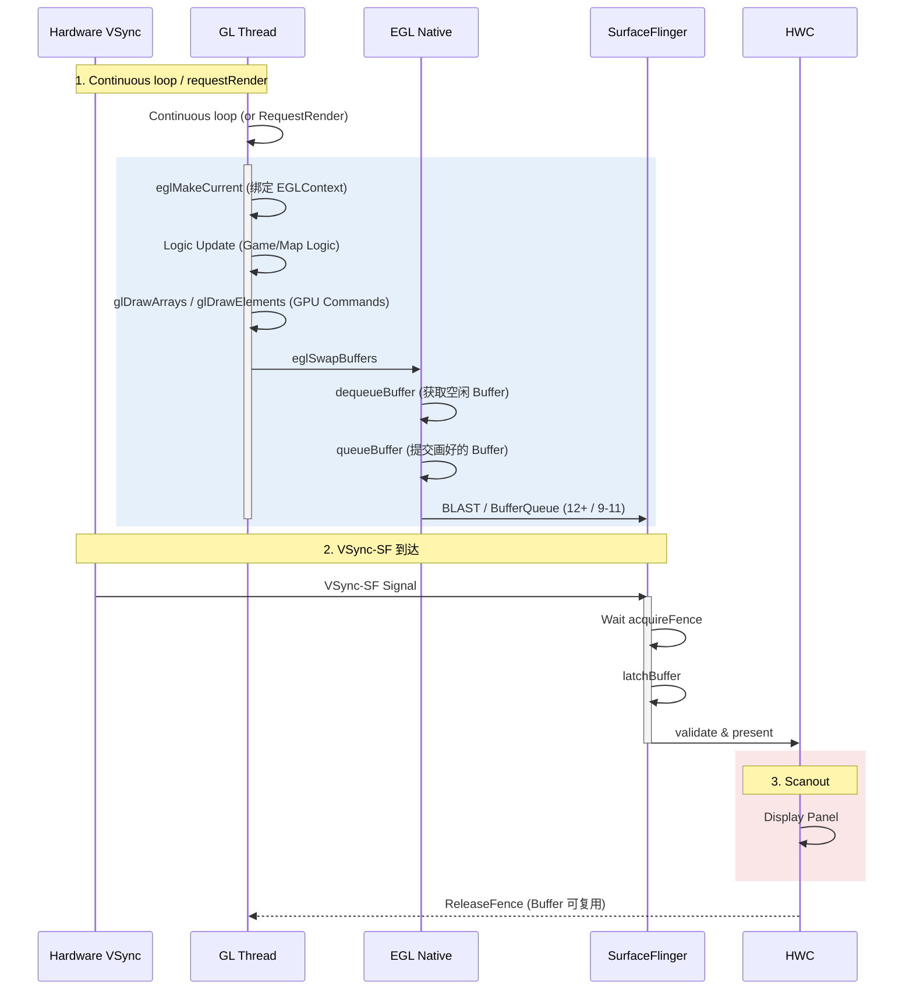

<!-- outline-start -->

**锚点（必须覆盖）：**
- [18.8.1 核心架构](#核心架构) — EGL 与 GLThread 的职责划分
- [18.8.2 渲染循环时序](#渲染循环时序) — Continuous vs Dirty 模式
- [18.8.3 eglSwapBuffers 详解](#eglswapbuffers-详解) — 最关键的提交点
- [18.8.4 Buffer 流转与 Triple Buffering](#buffer-流转与-triple-buffering) — 为什么 GLES 通常用 3 个 Slot
- [18.8.5 Fence 机制](#fence-机制) — Release Fence 与 Acquire Fence
- [18.8.6 ANGLE 路径](#angle-路径) — GLES-over-Vulkan 的 Trace 差异
- [18.8.7 Trace 视角](#trace-视角) — Perfetto 中的 GLES 链路识别

**扩展（可选深入）：**
- EGLContext 共享与多线程渲染
- Android 15+ 上 GLES 的前景与迁移策略
- GLSurfaceView vs 原生 EGL 集成

<!-- outline-end -->

当 App 需要高频自定义渲染——地图应用、3D 游戏、数据可视化——标准的 Android View 链路就不够用了。OpenGL ES（GLES）给了开发者直接控制 GPU 的能力，通过 EGL 与 Android 的 Surface 系统对接。这条链路的核心是**独立的 GLThread** 和 **`eglSwapBuffers`** 这个关键提交点。

> **边界**：Android 15+ 将 Vulkan 继续作为主低层图形 API 推进，并把 ANGLE 作为重要可选层纳入生态方向；设备侧仍会同时存在 native GLES、ANGLE 和旧设备 fallback。依赖 GLES 的 App 需要三条路径都验证。[已验证: Android 15 图形变更说明]

## 核心架构

### EGL：连接 GLES 与 Android 的桥梁

EGL 是 Khronos 定义的窗口系统绑定层，它在 Android 上的作用是充当 OpenGL ES API 与本地窗口系统（Surface）之间的桥梁。理解 EGL 的三个核心对象是分析 GLES 链路的基础：

- **EGLContext**：GPU 上下文，存储着色器程序、纹理、顶点缓冲等资源。一个 App 可以有多个 EGLContext（比如后台加载纹理用一个，前台渲染用另一个），但每个线程同时只能绑定一个
- **EGLSurface**：对应一个可绘目标。`EGLWindowSurface` 对应一个 Android `Surface`（可以通过 `eglCreateWindowSurface` 从 SurfaceView 获取），`EGLPbufferSurface` 用于离屏渲染
- **EGLDisplay**：对应物理显示器的抽象连接

```mermaid
graph LR
    subgraph "App Process"
        GLES[OpenGL ES API]
        EGL[EGL 调度层]
        GLThread[GL Thread]
    end
    
    subgraph "GPU"
        GPU[(GPU Hardware)]
    end
    
    subgraph "System"
        SF[SurfaceFlinger]
        HWC[HWC]
    end
    
    GLES --> EGL
    EGL --> GLThread
    GLThread --> |"eglSwapBuffers"| SF
    GLThread --> |"GPU Commands"| GPU
    SF --> HWC
```

### GLThread：独立的渲染生命周期

`GLSurfaceView` 内部维护一个 `GLThread`，它负责渲染循环的全生命周期管理。这个线程完全独立于 UI Thread 和 RenderThread——它不受 Choreographer 调度，不参与 View 树的 Traversal，不受 UI 线程卡顿影响。[已验证: AOSP GLSurfaceView]

GLThread 的常规生命周期：

1. **首次创建**：`GLSurfaceView.setRenderer()` 内部会执行 `mGLThread = new GLThread(...)` 和 `mGLThread.start()`
2. **Surface 创建**：渲染线程拿到 `Surface` 后调用 `eglCreateWindowSurface`，把 EGLSurface 绑定到 `SurfaceView`
3. **渲染循环**：持续运行，等待 Continuous 模式的紧凑循环或 `requestRender()` 信号
4. **暂离与销毁**：`onDetachedFromWindow()` 会调用 `requestExitAndWait()`，Surface 变化时也可能触发 EGLSurface 重建
5. **重新 attach**：只有 View 先 detach 再 attach 时，`onAttachedToWindow()` 才会按旧 renderMode 重建并启动新的 GLThread

`GLSurfaceView` 基于 `SurfaceView`。所以 GLES 链路在底层走的是 SurfaceView 的独立 Surface 直出路径——GLThread 向 SurfaceView 的 BufferQueue 提交 Buffer，SurfaceFlinger 直接消费。GLES 链路因此继承了 SurfaceView 独立 Surface 直出的性能特征。

## 渲染循环时序

### Continuous vs Dirty 模式

GLThread 有两种唤醒方式，对应不同的使用场景：

| 模式 | 触发条件 | 功耗 | 适用场景 |
|:---|:---|:---|:---|
| **Continuous** | 紧凑循环持续渲染 | 高 | 游戏、动画 |
| **Dirty / On-demand** | 依赖 `requestRender()` 调用 | 低 | 静态渲染、需要手动控制帧率 |

Continuous 模式下，GLThread 在紧凑循环中持续执行 `onDrawFrame()` + `eglSwapBuffers()`，不等待 VSync 信号。帧率受 `eglSwapBuffers` 内部 `dequeueBuffer` 的 BufferQueue 可用性限制，而非 VSync 驱动。适合需要持续渲染的场景（如 3D 游戏）。Dirty 模式下，线程在没有任务时会 `wait()`，只在 App 调用 `requestRender()` 时才被唤醒，适合静态或事件驱动的渲染（如数据图表更新）。

### 完整时序图

下面这张图把 GLThread 提交、SurfaceFlinger latch 和 HWC present 分成三段看，重点是 `eglSwapBuffers` 之后 Buffer 与 fence 的交接。



### 渲染步骤详解

#### 步骤 1：等待（Idle/Wait）

GLThread 在 Dirty 模式下没有任务时会 `wait()` 休眠，等待 `requestRender()` 唤醒。Continuous 模式下不存在这个等待步骤——线程在紧凑循环中持续执行渲染和提交。在 Perfetto 中，Dirty 模式下 GL Thread 在两帧之间会有一段空白；Continuous 模式下帧间的短暂间隔来自 `eglSwapBuffers` 内部 `dequeueBuffer` 等待空闲 Buffer 的耗时。

#### 步骤 2：eglMakeCurrent

将 EGLContext 绑定到当前线程。如果 Surface 尺寸发生变化（比如 Activity 旋转），这里会触发 `eglCreateWindowSurface` 重建。

```java
eglMakeCurrent(display, drawSurface, readSurface, context);
```

**成本**：这个调用有开销——它涉及 GL 状态机的切换和缓存失效。如果频繁切换多个 Surface 和 EGLContext，会成为性能瓶颈。多 Surface 场景（如分屏游戏）优先使用共享 EGLContext，减少 `makeCurrent` 反复切换。

#### 步骤 3：User Draw（onDrawFrame）

执行用户的 OpenGL 指令。此时指令被写入 GPU Command Buffer，**CPU 并不等 GPU 执行完毕**。这和标准 View 链路中 RenderThread 的行为类似——都是异步的。GPU 会在后续某个时刻实际执行这些命令。

```java
shader.use();
glVertexAttribPointer(...);
glDrawArrays(GL_TRIANGLES, 0, vertexCount);
```

这段代码返回时，命令通常只进入驱动队列；是否已经在 GPU 上完成，要结合 fence 或后续同步点判断。

### eglSwapBuffers 详解

这是 GLES 渲染链路里的关键提交点。它在 Perfetto 中通常占据了单帧最大时间片，**大部分时间花在等待空闲 Buffer 上**。具体做了两件事：

1. **Flush**：强制将所有 GL 指令发送给 GPU（`glFlush` 的等价操作）
2. **Buffer 交换**：将画好的帧（Back Buffer）提交给 SurfaceFlinger，同时获取一个新的空闲 Buffer

**版本差异**：Android 12+ 的 `eglSwapBuffers` 内部走 BLAST Transaction 路径，通过 `BLASTBufferQueue` 将 Buffer 提交给 SurfaceFlinger。Android 9-11 走传统 `BufferQueueProducer` 路径，由 SurfaceFlinger 主动 `acquireBuffer`。两条路径的最终效果相同——Buffer 都会到达 SurfaceFlinger 进行合成——但在 Perfetto 中看到的调用栈不同。[已验证: Android EGL 实现源码]

## Buffer 流转与 Triple Buffering

GLES 的 BufferQueue 通常配置为 3 个 Slot（Triple Buffering）。理解 Buffer 的流转是分析 `eglSwapBuffers` 耗时的关键。

### Double Buffer vs Triple Buffer

**Double Buffering（双缓冲）**：
- 只有 2 个 Buffer：一个正在被 Display 使用，一个正在被 App 使用
- 如果 App 画完了（`eglSwapBuffers`），但 Display 还在用另一个 Buffer → App 阻塞等待
- 结果：App 被迫等待 Display 释放 Buffer，GPU 利用率低

**Triple Buffering（三缓冲）**：
- 3 个 Buffer：Display 用一个、SurfaceFlinger 持有一个、App 用一个
- App 画完后可以立即获取第三个 Buffer，不需要等 Display 释放
- 结果：GPU 利用率更高，App 更不容易卡在 `dequeueBuffer`

### 在 Trace 中的表现

在 Perfetto 中，`eglSwapBuffers` 占据大部分时间条，**主要等待空闲 Buffer 重新可用**：

- 如果 `dequeueBuffer` 耗时短 → Buffer 充足，流水线顺畅
- 如果 `dequeueBuffer` 耗时长 → Buffer 压力大，需要分层排查：可用 slot 不足、outstanding buffer 达到上限、或返回 fence 等待时间长

## Fence 机制

Fence（同步栅栏）是跨 GPU/CPU/Display 的关键同步原语。在 GLES 链路上，Fence 用于处理"生产者"（GL Thread）和"消费者"（SurfaceFlinger/Display）之间的速度差异。理解 Fence 是读懂 Trace 中等待行为的基础。

### Release Fence（释放栅栏）

- **来源**：`eglSwapBuffers` 内部调用 `dequeueBuffer` 时，如果所有 buffer 都在流转中（被 consumer 持有或 outstanding buffer 数量达到上限），`dequeueBuffer` 会阻塞到有 buffer 释放为止。返回时可能附带一个 release fence
- **含义**：返回的 fence 表示该 Buffer 的前序消费者操作已完成，fence signal 后才能安全写入新内容
- **Trace 表现**：`dequeueBuffer` 耗时长的原因不只有 release fence。需要分层判断：① BufferQueue 可用 slot 是否充足（可用 buffer 不足 = 生产者跑太快或消费者太慢）；② outstanding buffer 数量是否达到 `maxDequeuedBufferCount` 限制；③ 返回的 fence 是否还需要额外等待。Perfetto 中可以同时观察 `BufferQueue` 的 queue/dequeue 计数和 `fence_wait` 片段来区分

### Acquire Fence（获取栅栏）

- **来源**：`eglSwapBuffers` 内部调用 `queueBuffer` 时，App 传递一个 acquire fence 给 SurfaceFlinger
- **含义**：GPU 还没画完这个 Buffer，**等 fence signal 后 SF 才能读取/显示**
- **Trace 表现**：SurfaceFlinger 在 `latchBuffer` 时如果 fence 未 signal，会等待。如果 GPU 负载很高，这个等待可能持续数毫秒

### EGL Sync Objects（精确控制）

对于需要精确同步的场景——比如在 GPU 渲染完成后执行 CPU 操作（记录性能数据、读取像素）——EGL 提供了扩展接口：

**场景 A：CPU 侧等待 GPU 完成（数据回读、像素读取）**

创建 sync 后，需要先 `glFlush()` 确保前序 GL 命令提交到 GPU 驱动，再调用 `eglClientWaitSyncKHR` 时带上 `EGL_SYNC_FLUSH_COMMANDS_BIT_KHR`：

```c
// 创建 Native Fence Sync 对象
EGLint attrs[] = { EGL_NONE };
EGLSyncKHR sync = eglCreateSyncKHR(display, EGL_SYNC_NATIVE_FENCE_ANDROID, attrs);

// glFlush() 确保 GL 命令提交到 GPU 驱动队列
// 没有 glFlush，sync 对象可能永远不会被 signal
glFlush();

// CPU 侧等待 fence signal；flags 带 EGL_SYNC_FLUSH_COMMANDS_BIT_KHR 防止 client 端死锁
eglClientWaitSyncKHR(display, sync, EGL_SYNC_FLUSH_COMMANDS_BIT_KHR, EGL_FOREVER_KHR);

// 此时 GPU 已完成，可以安全读取 Buffer 数据
eglDestroySyncKHR(display, sync);
```

**场景 B：导出 Native Fence FD 跨进程传递（GPU → SurfaceFlinger / HWC）**

创建 sync 后 `glFlush()`，再导出未 signal 的 fence FD 交给消费者。消费者在自己的时间线等待 fence，不需要 CPU 阻塞等待：

```c
// 创建 Native Fence Sync 对象
EGLint attrs[] = { EGL_NONE };
EGLSyncKHR sync = eglCreateSyncKHR(display, EGL_SYNC_NATIVE_FENCE_ANDROID, attrs);

// glFlush() 确保 fence 创建命令被驱动处理
// 导出的 FD 此时处于 unsignaled 状态，会在 GPU 完成所有前序命令后自动 signal
glFlush();

// 导出为 Native Fence FD（可用于跨进程传递，例如提交给 BufferQueue）
int fd = eglDupNativeFenceFDANDROID(display, sync);

// FD 交给消费者后，本地 sync 对象可以销毁
eglDestroySyncKHR(display, sync);
```

`eglDupNativeFenceFDANDROID` 属于 `EGL_ANDROID_native_fence_sync` 扩展，sync 对象必须用 `EGL_SYNC_NATIVE_FENCE_ANDROID` 创建，不能用 `EGL_SYNC_FENCE_KHR`。导出的 FD 可以跨进程传递给 SurfaceFlinger / HWC 等消费者。关键区别：场景 A 是 CPU 阻塞等待 GPU 完成，场景 B 是把 fence FD 交给消费者异步等待。两个场景都需要在创建 sync 后调用 `glFlush()`，否则 sync 对象可能不会被驱动处理，fence 永远不 signal。

## ANGLE 路径

Android 14+ / 15+ 上，部分设备会更多地采用 **ANGLE**（Almost Native Graphics Layer Engine）作为 GLES 后端。ANGLE 将 GLES API 调用翻译为 Vulkan 指令执行。[已验证: ANGLE for Android 文档]

### ANGLE 解决什么问题

GLES 链路最大的挑战是**驱动碎片化**。不同 GPU 厂商（Qualcomm Adreno、ARM Mali、Imagination PowerVR）的 GLES 驱动行为差异巨大，同一个 GL 调用在不同设备上可能产生不同的结果。ANGLE 通过将 GLES 翻译为 Vulkan 来统一底层——因为 Vulkan 驱动的正确性要求更高，行为更一致。

### Trace 差异

走 ANGLE 路径时，Perfetto 中会看到：

- **`vkQueueSubmit`** 而非 `glDraw*`：GPU 命令通过 Vulkan 提交
- **Buffer 提交仍走 BLAST**：Vulkan Present 最终仍然落到 Android 的 Surface/Transaction 体系
- **额外的翻译开销**：GLES → Vulkan 的翻译层增加了 CPU 开销，但换来了更一致的驱动行为

### ANGLE 是强制路径吗

这仍然是可选路径。Android 15+ 继续将 Vulkan 作为主低层图形 API 推进，并把 ANGLE 作为重要可选层纳入生态方向。Native GLES 路径、设备差异和 OEM 策略仍然存在。[已验证: Android 15 图形变更说明]

依赖 GLES 的 App 可以按三步检查：
1. 在 Android 15+ 设备上同时验证 native GLES 和 ANGLE 两条路径
2. 按包切换时直接用 AOSP `Settings.Global` 里的 `angle_gl_driver_selection_pkgs` 和 `angle_gl_driver_selection_values`：

```bash
adb shell settings put global angle_gl_driver_selection_pkgs com.example.app
adb shell settings put global angle_gl_driver_selection_values angle
```

这组设置面向 debuggable 应用；普通量产应用通常只有 root 或开发者选项介入时才方便强制切换。回退时把第二条改成 `native` 或 `default`，测试结束后再执行：

```bash
adb shell settings delete global angle_gl_driver_selection_pkgs
adb shell settings delete global angle_gl_driver_selection_values
```

3. 把设备型号、GPU 驱动版本、native/ANGLE 切换方式和 Trace 结果一起记录，后续迁移 Vulkan 或排查驱动差异时才能复用

## Trace 视角

### 识别 GLES 链路

1. **独立 GL Thread**：`GLSurfaceView` 的渲染线程，持续活动，名称通常包含 `GLThread`
2. **`eglSwapBuffers`**：这是 GLES 链路的标志性 Slice，与标准 View 链路的 `queueBuffer`（RenderThread）不同
3. **无 DisplayList**：GLES 不走 DisplayList 机制，直接生成 GPU 命令——Trace 中不会出现 `DisplayListCanvas` 相关的 Slice
4. **`vkQueueSubmit`**：走 ANGLE 路径时，Vulkan 的提交调用会替代 GLES 调用

### 关键 Slice

| Slice | 含义 | 关注点 |
|:---|:---|:---|
| `eglSwapBuffers` | 提交帧给 SF | 总耗时的大头通常是等待 Buffer |
| `dequeueBuffer` | 申请空闲 Buffer | 长等待 → Buffer 瓶颈或 release fence 未 signal |
| `eglMakeCurrent` | 绑定 EGLContext | 频繁调用可能是瓶颈 |
| `glDraw*` / `vkQueueSubmit` | GPU 绘制命令 | 正常情况下 CPU 端不耗时 |
| `queueBuffer` | 提交画好的 Buffer | 带 acquireFence |

### Buffer 压力分析

分析 GLES 链路性能，重点是理解 Buffer 压力：

- `dequeueBuffer` 快 + `eglSwapBuffers` 快 → 流水线健康
- `dequeueBuffer` 慢 → 先看 BufferQueue 可用 slot 和 outstanding buffer 限制，再看返回 fence 或后续 fence wait 是否拖住 CPU/GPU。不能把所有 `dequeueBuffer` 长条直接归因到 release fence
- `eglSwapBuffers` 整体慢 → 大头通常是 `dequeueBuffer` 等待可用 buffer，优先观察 Buffer 等待，再排查 GPU 绘制耗时

### 典型场景的 Trace 模式

**地图渲染**：GLThread 以 Continuous 模式运行，每帧执行大量的 `glDrawArrays`（绘制瓦片）。如果瓦片加载过慢，`eglSwapBuffers` 仍然会正常提交（只是画面不更新），不会阻塞主线程。

**游戏**：GLThread 帧率独立于 App UI（因为基于 SurfaceView）。Trace 中通常会看到 GL Thread 和 App Main Thread 解耦——游戏画面流畅，但 UI 操作可能卡顿（或反过来）。

## GLSurfaceView vs 原生 EGL 集成

`GLSurfaceView` 是 Android 提供的 GLES 渲染封装，它在内部处理了 EGLContext 创建、Surface 生命周期、GLThread 管理等所有样板代码。但高性能场景可能需要绕过 `GLSurfaceView`，直接使用 EGL API 与 SurfaceView 集成：

**GLSurfaceView 的局限**：
- 只支持一个 EGLSurface，不支持多 Surface 并行渲染
- GLThread 的生命周期与 View 绑定，不够灵活
- 错误处理不够完善，EGLContext 丢失后恢复逻辑有限

**原生 EGL 集成的优势**：
- 可以创建多个共享 EGLContext，实现资源的多线程并行加载
- 可以更精细地控制 Surface 重建时机（比如在 Surface 尺寸变化时）
- 可以自定义错误恢复策略

```java
// 原生 EGL 集成的核心步骤
EGLDisplay display = eglGetDisplay(EGL_DEFAULT_DISPLAY);
eglInitialize(display, null, null);
// 选择 EGLConfig、创建 EGLContext、创建 EGLSurface...
eglMakeCurrent(display, surface, surface, context);
// 渲染循环
eglSwapBuffers(display, surface);
```

对于大多数应用，`GLSurfaceView` 已经足够。只有在需要多线程渲染、精细的错误恢复、或与 Vulkan 互操作时，才需要考虑原生 EGL 集成。

---

> **交叉引用**：
> - Vulkan 原生链路详见 [18.9 Vulkan 原生渲染链路](09-vulkan-native.md)
> - SurfaceView 直出路径详见 [18.6 SurfaceView 直出路径](06-surfaceview.md)
> - 图形 API 演进历史详见 [2.14 图形 API 演进](../../part1-fundamentals/ch02-rendering/14-graphics-api-evolution.md)
> - BufferQueue 与 Fence 机制详见 [2.13 BufferQueue](../../part1-fundamentals/ch02-rendering/13-buffer-queue.md)
