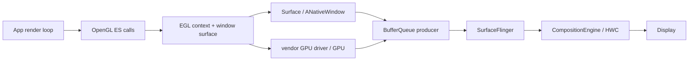

# 18.8 Android 17 EGL / OpenGL ES 渲染链路

OpenGL ES（GLES）定义应用如何向 GPU 描述绘制，EGL 则把 GLES context 与 Android `Surface` 对应的 native window 连接起来。应用发出 draw call 之后，GPU 开始或完成执行、window buffer 进入 BufferQueue、SurfaceFlinger 选中新内容，以及 HWC present，是四个不同的时间边界。

本文的平台基线是 `android-17.0.0_r1`，内核基线是 `android17-6.18-2026-06_r6`。厂商 EGL/GLES 驱动、GPU job scheduler（硬件任务调度器）和 Composer 实现并不由 AOSP 统一提供。分析调用阻塞与硬件完成时刻时，还必须使用目标设备的 trace 补足证据。

## 核心架构

### EGL 对象与 Android Surface

EGL 是 GLES 与 native window system 之间的绑定层。阅读代码时要分清三个核心对象：

- `EGLDisplay`：连接 EGL 实现的句柄，用于查询配置和创建资源；名称中的 Display 不代表某块物理屏幕。
- `EGLContext`：保存 GLES 状态与资源命名空间。共享 context 可以共享部分 GL 对象，但线程绑定、同步和资源生命周期仍由应用管理。
- `EGLSurface`：context 的 draw/read target（绘制或读取目标）。window surface 连接 `ANativeWindow`，pbuffer 等 surface 则用于离屏渲染。

Android `Surface` 可以通过 JNI/NDK 转换为 `ANativeWindow`。AOSP 的 `android::Surface` 实现 native window 接口，并把 dequeue/queue 请求转交给 BufferQueue Producer；EGL window surface 由此取得可供 GPU 写入的 GraphicBuffer。

下面的结构图用于区分 API、承载对象与显示后半段：



图中 GPU 与 BufferQueue 之间的箭头表示 buffer 内容会连同 GPU 完成依赖一起交付，并不表示 GLES draw call 会直接调用 SurfaceFlinger。

### GLES 是 Producer，承载方式要另行确认

GLES 只描述内容的生产方式，不决定内容由哪种 Android 组件承载。常见组合包括：

- `GLSurfaceView`：该类继承 `SurfaceView`，GLThread 向独立的 child Surface 提交内容；
- 原生 EGL + `SurfaceView`/GameActivity/NativeActivity：应用自行维护 render loop（渲染循环）和 window lifecycle；
- EGL 写入由 TextureView 的 SurfaceTexture 创建的 `Surface`：GLES 输出先成为 TextureView 输入，之后还要由宿主 HWUI 采样；
- pbuffer、FBO（Framebuffer Object，帧缓冲对象）、HardwareBuffer 等离屏目标：结果未必直接显示，还要确认后续 Consumer。

使用 Perfetto 确认拓扑时，要同时回答两个问题：谁发出 GLES 工作，EGLSurface 又连接到哪个 Consumer。看到 `eglSwapBuffers()` 只能证明某个 EGL surface 执行了 swap；还要确认目标 native window 属于独立可见 Surface、TextureView 输入还是其他消费者，不能据此推断 SurfaceFlinger 中一定存在独立的 SurfaceView layer。

### GLSurfaceView 的 GLThread

Android 17 的 `GLSurfaceView` 在调用 `setRenderer()` 后启动 `GLThread`。该线程负责：

- 创建和销毁 EGLContext 与 EGLSurface；
- 在 Surface 可用、尺寸非零并且没有暂停时调用 Renderer；
- 执行 `onSurfaceCreated()`、`onSurfaceChanged()`、`onDrawFrame()`；
- 调用 `EglHelper.swap()`，后者进入 `eglSwapBuffers()`；
- 处理 `EGL_CONTEXT_LOST`、无效 Surface、pause/resume、detach 和重建。

渲染回调不在应用主线程执行，但生命周期和输入状态仍从主线程传入。SurfaceHolder 创建或销毁、View attach/detach、`onPause()`/`onResume()`、`queueEvent()` 与业务状态同步不当，仍可能导致 GLThread 停止、重建，或者读取旧状态。独立线程只隔离执行队列，并不会隔离 UI 状态、Surface 生命周期或显示资源。

`EGLContext` 同一时刻只能 `current` 到符合 EGL 规则的线程/surface 组合。多线程资源加载如果使用共享 context，还需要显式同步 GL 资源的可见性；Java 线程的执行先后本身无法保证 GPU 资源已经可用。

## 渲染循环时序

### Continuous 与 When Dirty

`GLSurfaceView` 有两种 render mode：

| 模式 | `GLThread.readyToDraw()` 的触发 | 适合场景 | 风险 |
|---|---|---|---|
| `RENDERMODE_CONTINUOUSLY` | Surface/context 就绪后持续满足绘制条件 | 游戏、持续动画、相机特效 | 未做 pacing（提交节奏控制）时容易过量提交，增加功耗与排队 |
| `RENDERMODE_WHEN_DIRTY` | `requestRender()` 把 `mRequestRender` 设为 true | 静态图表、事件驱动更新 | 业务漏发请求会停在旧帧，过晚请求会错过目标周期 |

Continuous 模式下，`GLThread` 默认不会由 `Choreographer#doFrame()` 逐帧直接唤醒。它会持续执行 draw/swap，实际节奏可能受 swap interval、BufferQueue backpressure（消费者较慢形成的背压）、驱动、Swappy 或业务 scheduler 约束。When Dirty 只规定收到请求后才绘制；请求本身可以来自 Choreographer、传感器、网络或任意线程。

### 一帧的 CPU、GPU 与显示边界

下面的时序图以 `GLSurfaceView + SurfaceView` 为例；若 EGLSurface 连接 TextureView 或离屏目标，swap 之后的 Consumer 会不同：

```mermaid
sequenceDiagram
    participant Loop as "GLThread / app render loop"
    participant EGL as "EGL + vendor driver"
    participant BQ as "ANativeWindow / BufferQueue"
    participant GPU as "GPU queue"
    participant SF as "SurfaceFlinger"
    participant HWC as "Composer / Display"

    Loop->>Loop: "sample input / update / onDrawFrame"
    Loop->>EGL: "GLES draw calls"
    EGL->>GPU: "submit command work"
    Loop->>EGL: "eglSwapBuffers"
    EGL->>BQ: "queue current buffer + producer fence"
    BQ->>SF: "buffer update + acquire fence"
    SF->>SF: "transaction readiness / select new or old buffer"
    SF->>HWC: "validate / present"
    HWC-->>SF: "present fence + per-layer release fence"
    SF-->>BQ: "release dependency"
    BQ-->>EGL: "future dequeue returns reusable buffer + fence"
```

draw call 返回通常只说明命令已经记录或交给驱动。`eglSwapBuffers()` 返回则通常说明当前 image 已按 EGL/驱动规则交给 window system，无法证明 GPU 工作已完成、SurfaceFlinger 已 latch（为本次合成选中）该 buffer、HWC 已 present，或者面板已经扫描到该帧。

### frame pacing 与 queue-stuffing

如果 render loop 按最大速度持续提交，就可能在消费者释放 buffer 前积累多个 in-flight frame（已经开始、尚未完成显示的帧）。队列到达高水位后，线程会周期性阻塞在 swap 或下一次 dequeue。此时显示帧率可能仍然稳定，但输入状态采自更早的帧，触控到显示时延会随排队增长。

Frame Pacing library 中的 Swappy 属于 AGDK 库，不在 `android-17.0.0_r1` 平台源码内。GLES 入口 `SwappyGL_swap()` 包装 `eglSwapBuffers()`，综合 Choreographer、presentation timestamp 和 sync fence 控制提交节拍。看到 Swappy 主动等待时，应同时比较目标 present、队列深度和输入时延；这段等待可能是在避免 queue-stuffing，即生产端持续把过多帧塞进队列。

业务自研 pacing 也应区分：

- 内容目标帧率：应用希望按何种 cadence（节奏）生成新内容；
- Display refresh-rate hint：`Surface.setFrameRate()`/native window frame-rate API 向系统提供的显示模式选择提示；
- submit timing：当前帧应在哪个显示周期的截止点前交付；
- in-flight 数量：CPU、GPU 和 BufferQueue 中允许同时存在多少个尚未完成的帧。

只修改 refresh-rate hint，不会自动调整输入采样时刻、提交节拍或队列深度。

## eglSwapBuffers 详解

### Android 17 的分发边界

AOSP `libEGL` 的 `eglSwapBuffersImpl()` 会进入 `eglSwapBuffersWithDamageKHRImpl()`。平台层先验证 display/surface，处理 surface metadata 和 damage（本帧更新区域），再把调用分发给已经选中的 EGL 实现：

- native GLES 路径进入厂商 EGL 实现；
- ANGLE 路径进入 ANGLE 的 EGL；
- 扩展可用时，带 damage 的调用进入 `eglSwapBuffersWithDamageKHR()`；扩展不可用时使用普通 swap。

AOSP wrapper 只覆盖平台分发边界，不包含完整的 swap 实现。dequeue 的具体时机、GPU flush/submit、swap interval 和 fence 生成通常位于 ANGLE 或厂商驱动中。因此，`eglSwapBuffers()` 没有一条适用于所有设备的固定内部调用栈。

调用的职责可用下面的概念骨架理解：

```text
eglSwapBuffers(display, windowSurface)
  validate EGL objects
  propagate metadata / damage when supported
  enter selected EGL implementation
    complete or submit rendering for current image
    hand current image and producer completion dependency to ANativeWindow
    obey swap interval / pacing / available-buffer constraints
```

这份骨架只标出职责，不保证 dequeue 一定发生在 swap 函数的某一行。部分实现可能提前取得下一块 buffer，也可能等到后续渲染开始时再处理。

### swap 很长代表什么

`eglSwapBuffers()` 的 wall time 可能包含：

- 应用/驱动尚未提交完当前命令；
- 驱动内部串行执行或 GPU queue 限制；
- 没有可用 BufferQueue slot；
- 返回的旧 buffer release fence 尚未满足；
- swap interval 或 presentation timestamp 等待；
- Swappy/引擎的 pacing 等待；
- Surface resize、重分配、context/surface 错误恢复；
- ANGLE 状态处理和 Vulkan backend 工作。

因此，swap 耗时较长不能直接归因于 GPU shader，也不能预设大部分时间都花在 dequeue。需要把线程状态、子 slice、BufferQueue、fence、GPU stage 和 pacing marker 放在同一条时间轴上。

### damage 与 buffer age

`eglSwapBuffersWithDamageKHR()` 可以把本帧更新区域传给 window system；`EGL_EXT_buffer_age`/平台 buffer age 则帮助应用判断 back buffer 中哪些区域仍保留有效旧内容。只有 renderer 正确保留旧内容并计算 damage 时，这两项机制才能安全减少工作。

局部 damage 可能减少 tile/load/store 或后续合成工作，但系统不一定只读取指定矩形，HWC composition type 也可能变化。旋转、缩放、透明混合、颜色处理和设备实现都可能扩大最终有效的 damage 区域。

### 错误与生命周期

`GLSurfaceView` 对 swap 返回值做了明确区分：

- `EGL_SUCCESS`：本次 swap 调用成功，可以进入下一轮；
- `EGL_CONTEXT_LOST`：销毁并重建 context/surface，Renderer 需要在 `onSurfaceCreated()` 中重建 GL 资源；
- 其他错误：将 Surface 标记为 bad，等待生命周期变化后恢复。

原生 EGL 集成同样必须处理 `EGL_BAD_SURFACE`、context lost、窗口销毁和尺寸变化。只在 Activity `onResume()` 时创建一次 EGLSurface，无法覆盖 Surface 在 Activity 仍存活时被单独替换的情况。

## Buffer 流转与 Triple Buffering

“Triple Buffering”标题沿用目录名称，但 GLES window surface 并不存在适用于所有设备和模式的固定三 buffer 规则。

`BufferQueueCore` 根据 `mMaxDequeuedBufferCount`、`mMaxAcquiredBufferCount`、async/non-blocking 状态和配置上限计算可用数量。slot 是记录 buffer 所有权和状态的槽位，slot 表容量不等于同时分配的 GraphicBuffer 数量；EGL 实现、shared buffer mode、Consumer 和应用设置都可能改变活跃 buffer 的数量。

通用所有权可以简化为：

```text
FREE → DEQUEUED → QUEUED → ACQUIRED → FREE
          EGL/App          BLAST/SF/HWC
```

状态回到 FREE 时，前序 Consumer 的硬件工作未必已经完成。dequeue 返回的 fence 可能仍要求 Producer 在写入前等待；queue 当前 buffer 时，Producer 又会把 GPU 的完成依赖交给 Consumer。

### 为什么 buffer 数量影响吞吐与时延

较少的 buffer 会更早把显示背压传回 Producer，缩小排队空间，但可能让 CPU/GPU 更容易等待。较多的 buffer 能吸收短时抖动，也允许更多帧同时处于处理中，从而增加图形内存占用和输入时延。选择时应衡量目标设备上的稳定帧率、时延、内存和功耗，不能以“GLES 默认三缓冲”为前提跳过分析。

### 诊断等待

Producer 在 dequeue/swap 中等待时，依次核对：

1. 是否达到最大 dequeued/outstanding 限制；
2. 是否没有可用 slot；
3. Consumer 是否仍 ACQUIRED；
4. per-layer release fence 是否迟到；
5. buffer 是否因尺寸/格式变化重分配；
6. swap interval 或 pacing 是否有意等待；
7. Surface 是否正在重建或不可见。

只有同时出现队列长期处于高水位、Producer 持续按最大速度提交、swap/acquire 周期性等待和输入时延上升，才能构成 queue-stuffing 的完整证据。

## Fence 机制

### dequeue fence：旧消费者何时完成

Android `Surface::dequeueBuffer()` 从 `IGraphicBufferProducer` 取得 slot、GraphicBuffer 和 fence fd。这个 fence 说明前序 Consumer 何时停止读取该 buffer；Producer 在安全写入前必须满足这项依赖。调用线程仍阻塞在 dequeue，以及 dequeue 已返回但 fence 尚未 signal，是两个不同阶段，要分别观察。

### queue fence：新 Producer 何时写完

GLES 驱动可以把 GPU 尚未完成写入的 buffer 连同完成 fence 一起 queue 给 BufferQueue。对 SurfaceFlinger/BLAST 而言，这项依赖就是 acquire fence：合成路径真正读取像素前必须保证它已经满足。允许 unsignaled latch 的受限路径也不会消除硬件读取依赖。

HWC/Display 完成读取后会产生 per-layer release fence，并沿 SurfaceFlinger/BufferQueue 返回后续 dequeue。present fence 则描述一次 Display present 的显示栈同步边界，属于整个 Display，不是某块 GLES back buffer 的 Producer completion fence。

### EGL sync 与平台 buffer fence

应用可以用 `EGL_KHR_fence_sync`、`EGL_ANDROID_native_fence_sync` 等扩展建立额外同步，但必须先查询当前实现是否支持对应 extension。三种操作的语义不同：

- `eglClientWaitSyncKHR()` 让调用方在 CPU 上等待；
- `eglWaitSyncKHR()` 或相关能力可以把依赖放入 GPU 命令流；
- `eglDupNativeFenceFDANDROID()` 导出 native fence fd，其所有权按扩展规则转移。

创建 sync 后，如果需要保证前序 GL 命令已经送入驱动，还要按扩展要求执行 flush。导出 fd 和让 CPU 阻塞等待是两种不同操作，不能混为一个同步步骤。普通 window swap 的平台 fence 通常由 EGL/驱动与 ANativeWindow 的集成层维护，应用无须为每一帧手工导出 fence，再交回同一个 Surface。

### kernel 边界

在 `android17-6.18-2026-06_r6` 中：

- `drivers/dma-buf/dma-buf.c` 提供跨子系统共享 buffer 的基础机制；
- `drivers/dma-buf/sync_file.c` 把 fence 暴露为 fd（文件描述符）；
- `drivers/dma-buf/dma-fence.c` 提供 signal、callback 与 wait 原语。

common kernel 只能解释通用同步语义。某项 Adreno、Mali、Immortalis 或其他 GPU 工作何时完成，仍取决于厂商驱动的 job scheduler、频率、抢占、内存和硬件队列。

## ANGLE 路径

ANGLE 可以让应用继续调用 GLES/EGL，同时把命令翻译到 Vulkan 等 backend。应用可见的提交点仍是 `eglSwapBuffers()`，底层则可能出现 Vulkan command buffer、queue submit、pipeline cache 和 Vulkan 驱动工作。

ANGLE 不会因为某个 Android 版本而在所有应用中强制启用。实际选择会受到设备配置、开发者选项、应用 manifest、graphics driver 包、系统属性和厂商策略影响。Android 15 提供 ANGLE 开发者测试入口。Android 17 新增 manifest 元数据 `com.android.graphics.driver.prefer_angle=true`，用于表达应用对 ANGLE 的偏好；`GraphicsEnvironment#queryAngleChoice()` 仍可能因为平台选择优先级、denylist（禁用名单）、essential-tier、低内存设备、旧 vendor API 或 ANGLE 不可用，而保留或改用 GPU 厂商 GLES 驱动。该元数据只是偏好信号，无法证明当前进程正在使用 ANGLE。

### 怎样确认 backend

建议组合以下证据：

- `glGetString(GL_VENDOR/GL_RENDERER/GL_VERSION)` 和 EGL vendor/version；
- Graphics Driver/ANGLE 日志和包选择信息；
- 进程已加载库；
- Perfetto/atrace 中 ANGLE marker、Vulkan driver queue 和 GPU submission；
- 同一设备上 native/ANGLE 的 A/B trace。

看到 `vkQueueSubmit()` 只能说明进程中存在 Vulkan 工作，应用也可能同时运行其他 Vulkan 模块。要确认 ANGLE 路径，必须把该次 submit 与 GLES frame、ANGLE context 和目标 Surface 对齐。

### 分段归因

ANGLE 性能应拆成：

1. 应用 GLES 调用与状态切换；
2. ANGLE validation、state tracking、shader/pipeline 转换与缓存；
3. Vulkan driver 与 GPU 执行；
4. window swap、BufferQueue 与显示后半段。

大量细碎状态切换、同步 shader 编译或 pipeline cache 未命中，可能增加 ANGLE 的 CPU 成本；在另一台设备上，也可能因为 Vulkan 驱动更稳定而获得收益。因此，要用目标设备的 A/B 数据判断，不能预设 ANGLE 一定更快或更慢。

## Trace 视角

### 从目标 Surface 找 Producer

先在 SurfaceFlinger layer tree 中找到主体画面对应的可见 Surface，再回到应用进程定位管理该 Surface 的 render thread。`GLThread <id>` 是 `GLSurfaceView` 的常见线程名，原生引擎可能使用 Render、RHI（Render Hardware Interface，渲染硬件接口）或自定义名称。线程名只能作为线索；`eglMakeCurrent()`、GLES marker、swap 和 BufferQueue connection 更可靠。

每帧建议标出：

```text
input sample
→ logic/update
→ GL command preparation
→ driver submit / GPU start-end
→ eglSwapBuffers
→ BufferQueue queue
→ SF selects/latches buffer
→ HWC validate/present
→ display present feedback
→ per-layer release
```

这条时间线用于避免把 CPU API 返回误认为 GPU 或显示已经完成。缺少某个标准 slice 时，可以用 engine frame id、buffer id、frame number、fence 和 FrameTimeline token 补齐关联。

### 常见等待的证据表

| 现象 | 候选原因 | 应补证据 |
|---|---|---|
| `eglSwapBuffers()` 耗时长 | driver flush、可用 slot、release fence、swap interval、Swappy、Surface 重建 | 线程状态、swap 子 slice、BufferQueue 状态、fence 和 pacing marker |
| GL draw API 的 CPU 时间长 | 状态验证、shader 编译、驱动工作、ANGLE translation | 调用栈、shader/pipeline cache 和 CPU sampling |
| CPU 很快，GPU fence 迟到 | fragment/compute 负载、带宽、overdraw（重复绘制）、驱动队列、温控 | GPU stage/counter、频率、job queue 和 fence signal |
| buffer 已 queue，SF 仍使用旧内容 | acquire fence 未 ready、目标显示时刻未到、layer 不可见、transaction 条件未满足 | layer trace、fence、desired present 和 FrameTimeline |
| SF 已采用新 buffer，present 仍晚 | CLIENT composition、HWC validate、Display 资源竞争 | composition type、RenderEngine、HWC/present fence |
| swap 周期性阻塞且输入延迟升高 | queue-stuffing | pending buffer 数量、in-flight frame 数量和 input→present 时延 |

### FrameTimeline 与 composition

`GLSurfaceView` 的独立 child Surface 是否具有完整 App FrameTimeline，取决于 Producer 是否传递 frame timeline/desired present 信息，以及 trace 的采集配置。缺少 expected slice 只代表这条预期时间线没有被完整记录，不能说明内容未显示；可以用 buffer frame number、layer latch、HWC present 和 fence 补齐。

GLES 生成的 layer 不一定使用 DEVICE composition。alpha、crop、rotation、scale、HDR/SDR、protected usage、同屏其他 layer 和 HWC 资源都会影响策略。如果 GLES 主体已经由 GPU 渲染，又被 SurfaceFlinger 作为 CLIENT layer 采样进 client target，就会增加一段 RenderEngine 工作和相应带宽。

Android 17 的 HWC 主链路仍要区分 SF 侧的 `presentOrValidate()`、`validate()`、`present()` 与 ComposerHal 的 `*Display()` 调用。`PresentSucceeded` 表示组合调用已经执行 present 并保存 fence，当前流程无须再执行第二次 present；该状态无法证明面板扫描已经完成。

### GLSurfaceView 与原生 EGL

`GLSurfaceView` 适合单一 Surface、标准生命周期和简化的 EGL 管理。原生 EGL 适合需要多个 surface/context、共享资源、定制 pacing、明确控制错误恢复，或使用引擎自有线程模型的场景。原生实现需要自行处理：

- `ANativeWindow` 引用计数和 SurfaceHolder/NativeActivity 生命周期；
- config/context/surface 创建与销毁；
- context lost 和 bad surface 的恢复；
- 跨 context 资源同步；
- swap interval、frame-rate hint、damage 和 pacing；
- 所有 EGL/GL 错误检查。

原生 EGL 本身不会自动提升性能。它的收益来自更细的控制能力，代价则是应用要承担更多生命周期与同步责任。

### Android 12—17 边界

| 平台 | 相关变化 | 分析重点 |
|---|---|---|
| Android 12 / API 31 | BLAST/FrameTimeline 成为现代显示诊断基线；刷新率选择继续演进 | 区分 Producer、SF 和 Display 分别在哪一阶段迟到 |
| Android 13 / API 33 | Composer AIDL（稳定的进程间接口定义）成为新主线；Game Mode/FPS intervention 可能限制游戏帧率 | 判断目标帧率时要包含系统 intervention（干预） |
| Android 14 / API 34 | EGL→ANativeWindow→BufferQueue 主结构延续 | 不要寻找虚构的 API 34 swap 重构 |
| Android 15 / API 35 | ARR（Adaptive Refresh Rate，自适应刷新率）能力演进；提供 ANGLE 开发者测试入口；16 KB page-size 兼容进入 native 发布要求 | backend 和 native `.so` 兼容性要分开验证 |
| Android 16 / API 36 | ARR、性能 headroom 和 ADPF 能力扩展；GPU syscall filtering 影响非标准调试/注入路径 | 应用 API 路径与 profiling 工具要分别验证 |
| Android 17 / API 37 | 增加 `com.android.graphics.driver.prefer_angle` manifest 偏好信号；GLES/EGL、ANGLE 与 Vulkan 继续并存 | 检查选择优先级和实际 renderer，不能把驱动偏好写成强制使用 ANGLE |

### Android 17 源码锚点

- [`GLSurfaceView.java`](https://android.googlesource.com/platform/frameworks/base/+/refs/tags/android-17.0.0_r1/opengl/java/android/opengl/GLSurfaceView.java)：GLThread、render mode、Renderer 回调、swap、pause/resume 和 context lost；
- [`GraphicsEnvironment.java`](https://android.googlesource.com/platform/frameworks/base/+/refs/tags/android-17.0.0_r1/core/java/android/os/GraphicsEnvironment.java)：ANGLE driver 选择优先级、denylist 与 API 37 manifest 偏好信号；
- [`egl_platform_entries.cpp`](https://android.googlesource.com/platform/frameworks/native/+/refs/tags/android-17.0.0_r1/opengl/libs/EGL/egl_platform_entries.cpp)：libEGL validation、damage、native/ANGLE 分发；
- [`Surface.cpp`](https://android.googlesource.com/platform/frameworks/native/+/refs/tags/android-17.0.0_r1/libs/gui/Surface.cpp)、[`Surface.h`](https://android.googlesource.com/platform/frameworks/native/+/refs/tags/android-17.0.0_r1/libs/gui/include/gui/Surface.h)：ANativeWindow、dequeue/queue、buffer age 与 fences；
- [`BufferQueueCore.cpp`](https://android.googlesource.com/platform/frameworks/native/+/refs/tags/android-17.0.0_r1/libs/gui/BufferQueueCore.cpp)、[`BufferQueueProducer.cpp`](https://android.googlesource.com/platform/frameworks/native/+/refs/tags/android-17.0.0_r1/libs/gui/BufferQueueProducer.cpp)：buffer 数量、slot 和背压；
- [`BLASTBufferQueue.cpp`](https://android.googlesource.com/platform/frameworks/native/+/refs/tags/android-17.0.0_r1/libs/gui/BLASTBufferQueue.cpp)、[SurfaceFlinger FrontEnd](https://android.googlesource.com/platform/frameworks/native/+/refs/tags/android-17.0.0_r1/services/surfaceflinger/FrontEnd/)、[`HWComposer.cpp`](https://android.googlesource.com/platform/frameworks/native/+/refs/tags/android-17.0.0_r1/services/surfaceflinger/DisplayHardware/HWComposer.cpp)：buffer transaction、layer state、composition 和 present；
- [`dma-buf.c`](https://android.googlesource.com/kernel/common/+/refs/tags/android17-6.18-2026-06_r6/drivers/dma-buf/dma-buf.c)、[`sync_file.c`](https://android.googlesource.com/kernel/common/+/refs/tags/android17-6.18-2026-06_r6/drivers/dma-buf/sync_file.c)、[`dma-fence.c`](https://android.googlesource.com/kernel/common/+/refs/tags/android17-6.18-2026-06_r6/drivers/dma-buf/dma-fence.c)：共享 buffer 和 fence fd；
- [Android Frame Pacing](https://developer.android.com/games/sdk/frame-pacing)、[ANGLE for Android](https://chromium.googlesource.com/angle/angle/+/HEAD/doc/DevSetupAndroid.md)：库级 pacing 和 backend 的验证边界。

相关章节：

- [18.6 SurfaceView 独立 Surface 路径](06-surfaceview.md)
- [18.7 TextureView 宿主合成链路](07-textureview.md)
- [18.9 Vulkan 原生渲染链路](09-vulkan-native.md)
- [2.13 BufferQueue](../../part1-fundamentals/ch02-rendering/13-buffer-queue.md)
- [2.14 图形 API 演进](../../part1-fundamentals/ch02-rendering/14-graphics-api-evolution.md)
