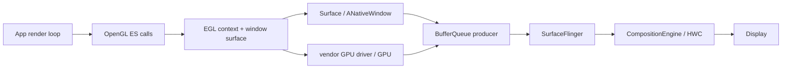

# 18.8 Android 17 EGL / OpenGL ES 渲染链路

OpenGL ES 规定怎样向 GPU 描述绘制，EGL 负责把 GLES context 与 Android `Surface` 对应的 native window 接起来。应用发出 draw call 后，GPU 何时执行、window buffer 何时进入 BufferQueue、SurfaceFlinger 何时采用新内容、HWC 何时 present，是四个不同边界。

平台锚点为 `android-17.0.0_r1`，kernel 锚点为 `android17-6.18-2026-06_r6`。厂商 EGL/GLES driver、GPU job scheduler 和 Composer 实现不在 AOSP 中统一，涉及调用阻塞和硬件完成时间时，必须用目标设备 trace 补足。

## 核心架构

### EGL 对象与 Android Surface

EGL 是 GLES 与 native window system 之间的绑定层。阅读代码时要分清三个对象：

- `EGLDisplay`：EGL 实现的连接句柄，用于发现配置和创建资源；不能简单等同于某块物理屏幕。
- `EGLContext`：保存 GLES context 状态与资源命名空间。共享 context 可以共享一部分 GL 对象，但线程绑定、同步和资源生命周期仍由应用管理。
- `EGLSurface`：context 的 draw/read target。window surface 连接 `ANativeWindow`，pbuffer 等 surface 用于离屏渲染。

Android `Surface` 可以通过 JNI/NDK 转换为 `ANativeWindow`；AOSP `android::Surface` 实现 native window 接口，并把 dequeue/queue 转交给 BufferQueue producer。EGL window surface 在此基础上获得可写 GraphicBuffer。

下面的结构图用于区分 API、承载对象与显示后半段：



图中的 GPU 与 BufferQueue 箭头表示 buffer 内容和完成依赖共同交付，不表示 GLES draw call 直接调用 SurfaceFlinger。

### GLES 是 Producer，承载方式要另行确认

GLES 描述生产方式，不等于固定使用 SurfaceView。常见组合包括：

- `GLSurfaceView`：类本身继承 `SurfaceView`，GLThread 向独立 child Surface 提交；
- 原生 EGL + `SurfaceView`/GameActivity/NativeActivity：应用自己维护 render loop 和 window lifecycle；
- EGL 写入由 TextureView 的 SurfaceTexture 创建的 `Surface`：GLES 输出先成为 TextureView 输入，之后仍需宿主 HWUI 采样；
- pbuffer、FBO、HardwareBuffer 等离屏目标：结果未必直接可见，还要看后续消费者。

Perfetto 定型时应同时回答“谁发出 GLES 工作”和“EGLSurface 连接哪个 Consumer”。看到 `eglSwapBuffers()` 只能证明存在 EGL surface 的 swap 调用；还要确认目标 native window 属于独立可见 Surface、TextureView 输入还是其它消费者，不能自动推断 SurfaceFlinger 中有独立 SurfaceView layer。

### GLSurfaceView 的 GLThread

Android 17 的 `GLSurfaceView` 在 `setRenderer()` 后启动 `GLThread`。该线程负责：

- 创建和销毁 EGLContext、EGLSurface；
- 在 Surface 可用、尺寸非零且未暂停时调用 Renderer；
- 执行 `onSurfaceCreated()`、`onSurfaceChanged()`、`onDrawFrame()`；
- 调用 `EglHelper.swap()`，后者进入 `eglSwapBuffers()`；
- 处理 `EGL_CONTEXT_LOST`、坏 Surface、pause/resume、detach 与重建。

渲染回调不在应用主线程执行，但生命周期和输入仍会从主线程传入。SurfaceHolder 创建/销毁、View attach/detach、`onPause()`/`onResume()`、`queueEvent()` 与业务状态同步不当，仍会让 GLThread 停止、重建或读取旧状态。“独立线程”不等于与 UI、Surface 生命周期和显示资源隔离。

`EGLContext` 同一时刻只能 current 到符合 EGL 规则的线程/surface 组合。多线程资源加载若使用共享 context，还需要显式同步资源可见性，不能只依赖 Java 线程先后。

## 渲染循环时序

### Continuous 与 When Dirty

`GLSurfaceView` 有两种 render mode：

| 模式 | `GLThread.readyToDraw()` 的触发 | 适合场景 | 风险 |
|---|---|---|---|
| `RENDERMODE_CONTINUOUSLY` | Surface/context 就绪后持续满足绘制条件 | 游戏、持续动画、相机特效 | 未做 pacing 时容易过量提交、增加功耗与排队 |
| `RENDERMODE_WHEN_DIRTY` | `requestRender()` 把 `mRequestRender` 设为 true | 静态图表、事件驱动更新 | 业务漏发请求会停在旧帧，过晚请求会错过目标周期 |

Continuous 模式的 `GLThread` 默认不是由 `Choreographer#doFrame()` 每帧直接唤醒。它会持续执行 draw/swap，节奏可能被 swap interval、BufferQueue backpressure、driver、Swappy 或业务自己的 scheduler 约束。When Dirty 也只规定“收到请求才绘制”，请求本身可以来自 Choreographer、传感器、网络或任意线程。

### 一帧的 CPU、GPU 与显示边界

下面的时序图以 `GLSurfaceView + SurfaceView` 为例；若 EGLSurface 连接 TextureView 或离屏目标，swap 之后的 Consumer 会不同：

```mermaid
sequenceDiagram
    participant Loop as "GLThread / app render loop"
    participant EGL as "EGL + vendor driver"
    participant BQ as "ANativeWindow / BufferQueue"
    participant GPU as "GPU queue"
    participant SF as "SurfaceFlinger"
    participant HWC as "Composer / Display"

    Loop->>Loop: "sample input / update / onDrawFrame"
    Loop->>EGL: "GLES draw calls"
    EGL->>GPU: "submit command work"
    Loop->>EGL: "eglSwapBuffers"
    EGL->>BQ: "queue current buffer + producer fence"
    BQ->>SF: "buffer update + acquire fence"
    SF->>SF: "transaction readiness / select new or old buffer"
    SF->>HWC: "validate / present"
    HWC-->>SF: "present fence + per-layer release fence"
    SF-->>BQ: "release dependency"
    BQ-->>EGL: "future dequeue returns reusable buffer + fence"
```

draw call 返回通常只说明命令已记录或交给 driver。`eglSwapBuffers()` 返回通常只说明当前 image 已按 EGL/driver 规则交给 window system，不表示 GPU 工作、SurfaceFlinger latch、HWC present 或 panel scan 已完成。

### frame pacing 与 queue-stuffing

render loop 若“能提交多快就提交多快”，可能在消费者释放之前积累多个 in-flight frame。队列进入高水位后，线程周期性卡在 swap 或下一次 dequeue；显示帧率看起来稳定，输入却在更早的帧中采样，触控到显示时延随排队增加。

Frame Pacing library 的 Swappy 属于 AGDK 库，不属于 `android-17.0.0_r1` 平台源码。GLES 入口 `SwappyGL_swap()` 包装 `eglSwapBuffers()`，综合 Choreographer、presentation timestamp 与 sync fence 控制提交节拍。看到 Swappy 主动等待时，应比较目标 present、队列深度和输入时延；主动等待可能是在阻止 queue-stuffing。

业务自研 pacing 也应区分：

- 内容目标帧率：应用希望以何种 cadence 生成新内容；
- display refresh-rate hint：`Surface.setFrameRate()`/native window frame-rate API 给系统的模式选择输入；
- submit timing：当前帧应在哪个显示周期前交付；
- in-flight 数量：CPU/GPU/BufferQueue 中允许积压多少帧。

只修改 refresh-rate hint，不会自动修正输入采样时刻和提交节拍。

## eglSwapBuffers 详解

### Android 17 的分发边界

AOSP `libEGL` 的 `eglSwapBuffersImpl()` 进入 `eglSwapBuffersWithDamageKHRImpl()`。平台层会验证 display/surface、处理 surface metadata 和 damage，再把调用分发给已选中的 EGL 实现：

- native GLES 路径进入厂商 EGL；
- ANGLE 路径进入 ANGLE 的 EGL；
- extension 可用时，带 damage 的调用进入 `eglSwapBuffersWithDamageKHR()`，否则回退到普通 swap。

AOSP wrapper 只覆盖平台分发边界，不包含完整的 swap 实现。dequeue 的具体时机、GPU flush/submit、swap interval 和 fence 生成通常位于 ANGLE 或厂商 driver。正文不能把 `eglSwapBuffers()` 固定展开成一条对所有设备相同的内部调用栈。

调用的职责可用下面的概念骨架理解：

```text
eglSwapBuffers(display, windowSurface)
  validate EGL objects
  propagate metadata / damage when supported
  enter selected EGL implementation
    complete or submit rendering for current image
    hand current image and producer completion dependency to ANativeWindow
    obey swap interval / pacing / available-buffer constraints
```

这份骨架只标职责，不承诺 dequeue 必然发生在 swap 函数的某一行。部分实现可能较早取得下一块 buffer，也可能在后续渲染开始时才处理。

### swap 很长代表什么

`eglSwapBuffers()` 的 wall time 可能包含：

- 应用/driver 尚未提交完当前命令；
- driver 内部串行化或 GPU queue 限制；
- 没有可用 BufferQueue slot；
- 返回的旧 buffer release fence 尚未满足；
- swap interval 或 presentation timestamp 等待；
- Swappy/引擎 pacing；
- Surface resize、重分配、context/surface 错误恢复；
- ANGLE 状态处理和 Vulkan backend 工作。

所以“swap 长”不能直接写成 GPU shader 慢，也不能默认“绝大部分都在 dequeue”。需要把线程状态、子 slice、BufferQueue、fence、GPU stage 和 pacing marker 放在同一时间轴。

### damage 与 buffer age

`eglSwapBuffersWithDamageKHR()` 可把本帧更新区域传给 window system；`EGL_EXT_buffer_age`/平台 buffer age 能帮助应用判断 back buffer 中哪些区域仍可复用。两者只在 renderer 正确保存旧内容并计算 damage 时有价值。

局部 damage 可能减少 tile/load/store 或后续合成工作，但不保证系统只读取矩形区域，也不保证 HWC composition type 不变。旋转、缩放、透明混合、颜色处理或设备实现都可能扩大有效 damage。

### 错误与生命周期

`GLSurfaceView` 对 swap 返回值做了明确区分：

- `EGL_SUCCESS`：进入下一轮；
- `EGL_CONTEXT_LOST`：销毁并重建 context/surface，Renderer 需要在 `onSurfaceCreated()` 重建 GL 资源；
- 其它错误：将 Surface 标为 bad，等待生命周期变化后恢复。

原生 EGL 集成也必须处理 `EGL_BAD_SURFACE`、context lost、窗口销毁和尺寸变化。只在 Activity `onResume()` 创建一次 EGLSurface，无法覆盖 Surface 被单独替换的情况。

## Buffer 流转与 Triple Buffering

“Triple Buffering”标题沿用目录名称，但 GLES window surface 没有适用于所有设备和模式的固定三 buffer 规则。

`BufferQueueCore` 根据 `mMaxDequeuedBufferCount`、`mMaxAcquiredBufferCount`、async/non-blocking 状态和配置上限计算可用数量。slot 表容量不等于同时分配的 GraphicBuffer 数；EGL 实现、shared buffer mode、消费者和应用设置都可能改变活跃 buffer。

通用所有权可以简化为：

```text
FREE → DEQUEUED → QUEUED → ACQUIRED → FREE
          EGL/App          BLAST/SF/HWC
```

状态回到 FREE 也不表示前序消费者工作已经完成。dequeue 返回的 fence 仍可能要求 Producer 在写入前等待；queue 当前 buffer 时，Producer 又把 GPU 完成依赖交给 Consumer。

### 为什么 buffer 数量影响吞吐与时延

较少 buffer 会更早把显示 backpressure 传回 Producer，降低排队空间，但可能让 CPU/GPU 更容易空等。较多 buffer 能吸收短时抖动，也允许更多 frame 在途中，增加显存占用和输入时延。选择依据应是目标设备上的稳定帧率、时延、内存和功耗，不是“GLES 默认三缓冲所以无需分析”。

### 诊断等待

Producer 在 dequeue/swap 中等待时，依次核对：

1. 是否达到最大 dequeued/outstanding 限制；
2. 是否没有可用 slot；
3. Consumer 是否仍 ACQUIRED；
4. per-layer release fence 是否迟到；
5. buffer 是否因尺寸/格式变化重分配；
6. swap interval 或 pacing 是否有意等待；
7. Surface 是否正在重建或不可见。

队列高水位、持续尽快提交、周期性 swap/acquire 等待和输入时延上升，组合起来才构成 queue-stuffing 证据。

## Fence 机制

### dequeue fence：旧消费者何时完成

Android `Surface::dequeueBuffer()` 从 `IGraphicBufferProducer` 获得 slot、GraphicBuffer 与 fence fd。这个 fence 描述该 buffer 的前序 Consumer 何时不再读取；Producer 在安全写入前必须遵守依赖。调用线程长时间阻塞在 dequeue 与“dequeue 已返回但 fence 未 signal”是两个阶段，要分别观察。

### queue fence：新 Producer 何时写完

GLES driver 可以把尚未完成的 GPU buffer 连同完成 fence queue 给 BufferQueue。对 SurfaceFlinger/BLAST 而言，这条依赖是 acquire fence：合成路径在读取像素前必须保证它满足。允许 unsignaled latch 的受限路径也不会消除硬件读取依赖。

HWC/display 完成读取后产生 per-layer release fence，沿 SurfaceFlinger/BufferQueue 回到未来的 dequeue。present fence 则描述一次 display present 的显示栈时间边界，不属于某一块 GLES back buffer 的 Producer completion fence。

### EGL sync 与平台 buffer fence

应用可以用 `EGL_KHR_fence_sync`、`EGL_ANDROID_native_fence_sync` 等扩展建立额外同步，但要先查询 extension。三种操作语义不同：

- `eglClientWaitSyncKHR()` 让 CPU 等待；
- `eglWaitSyncKHR()`/相关能力可把依赖放到 GPU 命令流；
- `eglDupNativeFenceFDANDROID()` 导出 native fence fd，所有权按扩展规则转移。

创建 sync 后若需要保证前序 GL 命令已送入 driver，要按扩展要求 flush；导出 fd 与 CPU 阻塞等待不能混成同一个示例。普通 window swap 的平台 fence 通常由 EGL/driver 与 ANativeWindow 集成维护，应用不应重复为每帧手工导出一条 fence 再交回相同 Surface。

### kernel 边界

在 `android17-6.18-2026-06_r6` 中：

- `drivers/dma-buf/dma-buf.c` 提供跨子系统共享 buffer 的基础；
- `drivers/dma-buf/sync_file.c` 把 fence 暴露为 fd；
- `drivers/dma-buf/dma-fence.c` 提供 signal、callback 与 wait 原语。

common kernel 只能解释通用同步语义。某块 Adreno、Mali、Immortalis 或其它 GPU 工作何时完成，仍取决于厂商 driver job scheduler、频率、抢占、内存和硬件队列。

## ANGLE 路径

ANGLE 可以在应用继续调用 GLES/EGL 时，把命令翻译到 Vulkan 等 backend。应用可见提交点仍是 `eglSwapBuffers()`，底层则可能出现 Vulkan command buffer、queue submit、pipeline cache 与 Vulkan driver 工作。

ANGLE 不是按 Android 版本全局强制开启。选择会受设备配置、开发者选项、应用 manifest、graphics driver 包、系统属性和厂商策略影响。Android 15 提供 ANGLE 开发者测试入口。Android 17 新增 manifest 元数据 `com.android.graphics.driver.prefer_angle=true`，向系统表达应用希望使用 ANGLE；`GraphicsEnvironment#queryAngleChoice()` 仍可能因为平台选择优先级、denylist、essential-tier、低内存设备、旧 vendor API 或 ANGLE 不可用而保留/回退到 GPU 厂商 GLES driver。这个元数据是偏好信号，不能证明当前进程已经使用 ANGLE。

### 怎样确认 backend

建议组合以下证据：

- `glGetString(GL_VENDOR/GL_RENDERER/GL_VERSION)` 与 EGL vendor/version；
- Graphics Driver/ANGLE 日志和包选择信息；
- 进程已加载库；
- Perfetto/atrace 中 ANGLE marker、Vulkan driver queue 和 GPU submission；
- 同一设备 native/ANGLE A/B trace。

看到 `vkQueueSubmit()` 只能说明进程中存在 Vulkan 工作；应用也可能同时有其它 Vulkan 模块。要把该 submit 与 GLES frame、ANGLE context 和目标 Surface 对齐。

### 分段归因

ANGLE 性能应拆成：

1. 应用 GLES 调用与状态切换；
2. ANGLE validation、state tracking、shader/pipeline 转换与缓存；
3. Vulkan driver 与 GPU 执行；
4. window swap、BufferQueue 与显示后半段。

大量细碎状态切换、同步 shader 编译或 pipeline cache 未命中可能增加 ANGLE CPU 成本；另一设备也可能因 Vulkan driver 更稳定而受益。不能预设 ANGLE 必定更快或更慢。

## Trace 视角

### 从目标 Surface 找 Producer

先在 SurfaceFlinger layer tree 找主体画面对应的可见 Surface，再回到应用进程定位管理该 Surface 的 render thread。`GLThread <id>` 是 `GLSurfaceView` 的常见命名，原生引擎可能使用 Render、RHI 或自定义名字；线程名只作线索，`eglMakeCurrent()`、GLES marker、swap 和 BufferQueue connection 更可靠。

每帧建议标出：

```text
input sample
→ logic/update
→ GL command preparation
→ driver submit / GPU start-end
→ eglSwapBuffers
→ BufferQueue queue
→ SF selects/latches buffer
→ HWC validate/present
→ display present feedback
→ per-layer release
```

这条时间线用于避免把 CPU API 返回当成 GPU 或显示完成。缺少某个标准 slice 时，可用 engine frame id、buffer id、frame number、fence 和 FrameTimeline token 补齐。

### 常见等待的证据表

| 现象 | 候选原因 | 应补证据 |
|---|---|---|
| `eglSwapBuffers()` 长 | driver flush、available slot、release fence、swap interval、Swappy、Surface 重建 | 线程状态、swap 子 slice、BQ 状态、fence、pacing marker |
| GL draw API CPU 时间长 | 状态验证、shader 编译、driver work、ANGLE translation | 调用栈、shader/pipeline cache、CPU sampling |
| CPU 很快，GPU fence 迟到 | fragment/compute/带宽、overdraw、driver queue、thermal | GPU stage/counter、频率、job queue、fence signal |
| buffer 已 queue，SF 仍用旧内容 | acquire fence 未 ready、目标时间未到、layer 不可见、transaction 条件 | layer trace、fence、desired present、FrameTimeline |
| SF 已采用新 buffer，present 晚 | CLIENT composition、HWC validate、display contention | composition type、RenderEngine、HWC/present fence |
| 周期性 swap 阻塞且输入延迟升高 | queue-stuffing | pending buffers、in-flight frame、input→present |

### FrameTimeline 与 composition

`GLSurfaceView` 的独立 child Surface 是否具有完整 App FrameTimeline，取决于 Producer 是否传递 frame timeline/desired present 信息和 trace 配置。缺少 expected slice 不表示没有显示；使用 buffer frame number、layer latch、HWC present 与 fence 补齐。

GLES 生成的 layer 不保证 DEVICE composition。alpha、crop、rotation、scale、HDR/SDR、protected usage、同屏其它 layer 和 HWC 资源都会改变策略。若 GLES 主体已由 GPU 渲染，又被 SurfaceFlinger 作为 CLIENT layer 采样进 client target，会再增加 RenderEngine 工作和带宽。

Android 17 的 HWC 主线仍要区分 SF 侧 `presentOrValidate()`、`validate()`、`present()` 与 ComposerHal 的 `*Display()` 调用。PresentSucceeded 表示组合调用已经 present 并保存 fences，后续不会再执行第二次 present；它也不表示 panel 扫描完成。

### GLSurfaceView 与原生 EGL

`GLSurfaceView` 适合单一 Surface、标准生命周期和简化 EGL 管理。原生 EGL 适合需要多个 surface/context、共享资源、定制 pacing、明确错误恢复或引擎自有线程模型的场景。原生实现需要自行处理：

- `ANativeWindow` 引用计数和 SurfaceHolder/NativeActivity 生命周期；
- config/context/surface 创建与销毁；
- context lost 和 bad surface 恢复；
- 跨 context 资源同步；
- swap interval、frame-rate hint、damage 和 pacing；
- 所有 EGL/GL 错误检查。

“原生 EGL”本身不会更快。收益来自业务需要的控制能力，代价是更大的生命周期与同步责任。

### Android 12—17 边界

| 平台 | 相关变化 | 分析重点 |
|---|---|---|
| Android 12 / API 31 | BLAST/FrameTimeline 成为现代显示诊断基线；刷新率选择继续演进 | 区分 Producer 晚、SF 晚与 display 晚 |
| Android 13 / API 33 | Composer AIDL 成为新主线；Game Mode/FPS intervention 可能限制游戏帧率 | 目标帧率要结合系统 intervention |
| Android 14 / API 34 | EGL→ANativeWindow→BufferQueue 主结构延续 | 不要寻找虚构的 API 34 swap 重构 |
| Android 15 / API 35 | ARR 平台能力演进；提供 ANGLE 开发者测试入口；16 KB page-size 兼容进入 native 发布要求 | backend 和 native `.so` 兼容要分开验证 |
| Android 16 / API 36 | ARR/headroom/ADPF 能力扩展，GPU syscall filtering 影响非标准调试/注入路径 | API 路径与 profiling 工具要分别验证 |
| Android 17 / API 37 | 增加 `com.android.graphics.driver.prefer_angle` manifest 偏好信号；GLES/EGL、ANGLE 与 Vulkan 继续并存 | 检查选择优先级和实际 renderer，不能把偏好写成强制 ANGLE |

### Android 17 源码锚点

- [`GLSurfaceView.java`](https://android.googlesource.com/platform/frameworks/base/+/refs/tags/android-17.0.0_r1/opengl/java/android/opengl/GLSurfaceView.java)：GLThread、render mode、Renderer 回调、swap、pause/resume 和 context lost；
- [`GraphicsEnvironment.java`](https://android.googlesource.com/platform/frameworks/base/+/refs/tags/android-17.0.0_r1/core/java/android/os/GraphicsEnvironment.java)：ANGLE driver 选择优先级、denylist 与 API 37 manifest 偏好信号；
- [`egl_platform_entries.cpp`](https://android.googlesource.com/platform/frameworks/native/+/refs/tags/android-17.0.0_r1/opengl/libs/EGL/egl_platform_entries.cpp)：libEGL validation、damage、native/ANGLE 分发；
- [`Surface.cpp`](https://android.googlesource.com/platform/frameworks/native/+/refs/tags/android-17.0.0_r1/libs/gui/Surface.cpp)、[`Surface.h`](https://android.googlesource.com/platform/frameworks/native/+/refs/tags/android-17.0.0_r1/libs/gui/include/gui/Surface.h)：ANativeWindow、dequeue/queue、buffer age 与 fences；
- [`BufferQueueCore.cpp`](https://android.googlesource.com/platform/frameworks/native/+/refs/tags/android-17.0.0_r1/libs/gui/BufferQueueCore.cpp)、[`BufferQueueProducer.cpp`](https://android.googlesource.com/platform/frameworks/native/+/refs/tags/android-17.0.0_r1/libs/gui/BufferQueueProducer.cpp)：buffer 数量、slot 与 backpressure；
- [`BLASTBufferQueue.cpp`](https://android.googlesource.com/platform/frameworks/native/+/refs/tags/android-17.0.0_r1/libs/gui/BLASTBufferQueue.cpp)、[SurfaceFlinger FrontEnd](https://android.googlesource.com/platform/frameworks/native/+/refs/tags/android-17.0.0_r1/services/surfaceflinger/FrontEnd/)、[`HWComposer.cpp`](https://android.googlesource.com/platform/frameworks/native/+/refs/tags/android-17.0.0_r1/services/surfaceflinger/DisplayHardware/HWComposer.cpp)：buffer transaction、layer state、composition 与 present；
- [`dma-buf.c`](https://android.googlesource.com/kernel/common/+/refs/tags/android17-6.18-2026-06_r6/drivers/dma-buf/dma-buf.c)、[`sync_file.c`](https://android.googlesource.com/kernel/common/+/refs/tags/android17-6.18-2026-06_r6/drivers/dma-buf/sync_file.c)、[`dma-fence.c`](https://android.googlesource.com/kernel/common/+/refs/tags/android17-6.18-2026-06_r6/drivers/dma-buf/dma-fence.c)：shared buffer 与 fence fd；
- [Android Frame Pacing](https://developer.android.com/games/sdk/frame-pacing)、[ANGLE for Android](https://chromium.googlesource.com/angle/angle/+/HEAD/doc/DevSetupAndroid.md)：库级 pacing 与 backend 验证边界。

相关章节：

- [18.6 SurfaceView 独立 Surface 路径](06-surfaceview.md)
- [18.7 TextureView 宿主合成链路](07-textureview.md)
- [18.9 Vulkan 原生渲染链路](09-vulkan-native.md)
- [2.13 BufferQueue](../../part1-fundamentals/ch02-rendering/13-buffer-queue.md)
- [2.14 图形 API 演进](../../part1-fundamentals/ch02-rendering/14-graphics-api-evolution.md)
