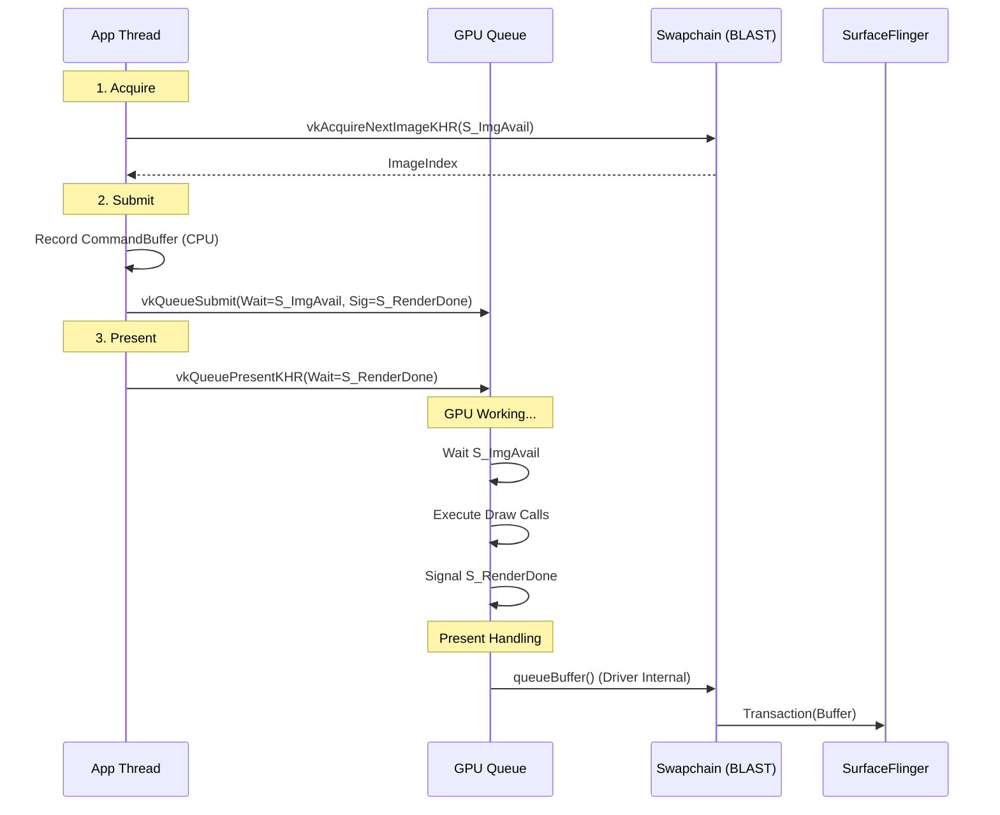
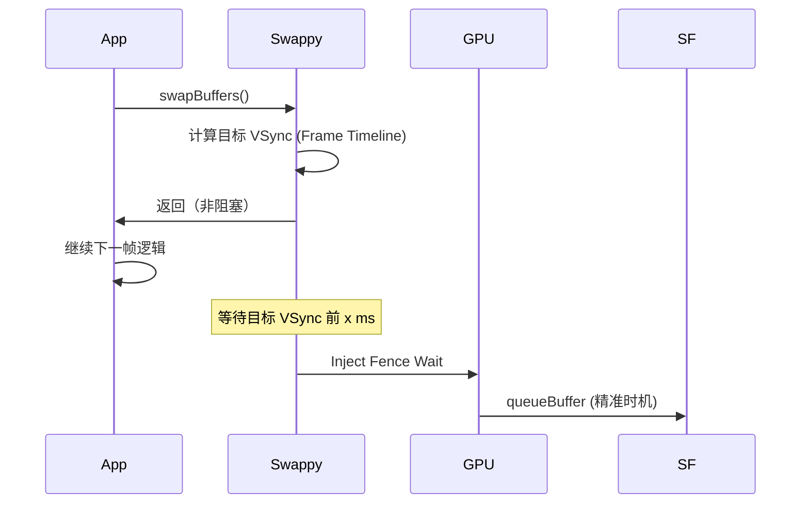

<!-- outline-start -->

**锚点（必须覆盖）：**
- [18.9.1 为什么选择 Vulkan](#为什么选择-vulkan) — 与 GLES 的本质区别
- [18.9.2 Android Vulkan Profile (AVP)](#android-vulkan-profile-avp) — 碎片化问题的标准化方案
- [18.9.3 渲染流程详解](#渲染流程详解) — Acquire → Submit → Present 的完整链路
- [18.9.4 Pipeline Barrier 与 Image Layout](#pipeline-barrier-与-image-layout) — 显式同步的关键
- [18.9.5 Presentation Mode](#presentation-mode) — FIFO / MAILBOX / IMMEDIATE 的取舍
- [18.9.6 Swappy Frame Pacing](#swappy-frame-pacing) — Android 官方的帧节奏库
- [18.9.7 Trace 视角](#trace-视角) — Vulkan 链路的识别特征

**扩展（可选深入）：**
- Command Buffer 多线程并行录制
- Validation Layers 的使用与调试
- Vulkan 与 SurfaceControl 的集成

<!-- outline-end -->

Vulkan 是 Android 的主低层图形 API，Android 15+ 进一步推进了 AVP（Android Vulkan Profile）等能力。[已验证: Android 15 Developer Preview 文档] 与 OpenGL ES 相比，Vulkan 的核心区别在于**"显式优于隐式"**——内存管理、同步原语、命令提交全部由 App 显式控制，驱动只做传达，不再替你猜。换来的是更低的 CPU 开销、更少的驱动 bug，以及更高的调试可控性。

关于图形 API 的演进历史和 Vulkan 在 Android 上的引入过程，详见 [2.14 图形 API 演进](../../part1-fundamentals/ch02-rendering/14-graphics-api-evolution.md)。本节聚焦 Vulkan 渲染链路的实战视角：从 Acquire 到 Present 的完整流程、Presentation Mode 的选择、以及如何在 Trace 中识别 Vulkan 链路。

## 为什么选择 Vulkan

### GLES 的隐式模型问题

GLES 驱动替你做了很多"聪明的猜测"——什么时候切换 Render Target、什么时候等待 GPU 完成、什么时候同步、内存什么时候释放。这些"猜测"让写代码变简单了，但代价是**CPU 端的 driver 开销巨大**——每次 GL 调用都可能触发驱动内部的同步逻辑。移动设备 GPU 驱动尤其如此，因为移动 GPU 的驱动通常比桌面端更激进地做隐式优化。

### Vulkan 的显式控制

Vulkan 要求 App 对一切负责：

| 维度 | GLES | Vulkan |
|:---|:---|:---|
| **内存管理** | 驱动自动分配/释放 | App 显式分配、绑定、释放 |
| **同步** | 隐式 barrier 由驱动插入 | App 显式指定 VkBarrier |
| **命令提交** | 驱动缓存命令 | App 自己管理 Command Buffer |
| **错误处理** | 驱动吞掉或用 GLSE | Validation Layer 严格检查 |
| **CPU 开销** | 高（驱动猜测多） | 低（显式路径短路） |
| **多线程** | 有限（Context 绑定线程） | 完全支持（Command Buffer 并行录制） |

**实测优势**：Vulkan 的 CPU 开销比 GLES 低 20-40%，省出的 CPU 时间可以留给游戏逻辑、AI 计算、音频处理等。[已验证: Android Developer Vulkan 性能文档]

### 代价

Vulkan 的代价是**开发复杂度**。你需要自己管理：
- 内存分配和绑定（VkDeviceMemory）
- 同步原语（Fence、Semaphore、Barrier）
- 命令缓冲区的生命周期
- Image Layout 转换
- 渲染 Pass 的显式定义

如果这些做错了，轻则花屏、黑屏，重则设备挂起。这就是为什么 Google 推出了 Swappy、AVP 等辅助工具——降低 Vulkan 的正确使用门槛。

## Android Vulkan Profile (AVP)

Vulkan 最大的问题是碎片化——不同设备支持的 Extension 不同，App 需要运行时查询并处理各种 fallback。AVP（Android Vulkan Profile）是 Google 推出的标准化方案，目标是让 App 开发者只需要检查"设备是否支持某个 Profile"，而不需要逐一查询 Extension。

### 问题背景

| 问题 | 传统 Vulkan | AVP 解决方案 |
|:---|:---|:---|
| **特性碎片化** | 每个设备支持不同的 Extension | 定义标准 Profile（如 `VP_ANDROID_baseline_2022`） |
| **能力查询成本** | 运行时逐一查询数十个 Extension | 声明式 Profile 匹配，一次检查 |
| **开发复杂度** | 需要大量 fallback 代码 | 保证 Profile 内特性全支持 |

### 标准 Profile 层级

```
VP_ANDROID_baseline_2021  ← 基础层（Android 10+）
       ↓
VP_ANDROID_baseline_2022  ← 推荐层（Android 14+）
       ↓
VP_ANDROID_baseline_2024  ← 最新层（Android 16+，计划中）
```

### 使用方式

```c
// 检查设备是否支持目标 Profile
VpProfileProperties profileProps = { VP_ANDROID_BASELINE_2022, 1 };
VkBool32 supported;
vpGetPhysicalDeviceProfileSupport(instance, physicalDevice, &profileProps, &supported);

if (supported) {
    // 可以安全使用 Profile 内所有特性，无需逐个查询 Extension
    VkDeviceCreateInfo createInfo = { ... };
    vpCreateDevice(physicalDevice, &createInfo, &profileProps, &device);
}
```

AVP 的引入意味着 Vulkan 的碎片化问题正在被系统性解决。对于新项目，推荐直接以 `VP_ANDROID_baseline_2022` 为最低目标。

## 渲染流程详解

Vulkan 的渲染流程围绕三个核心对象展开：**Swapchain**（管理图像）、**Command Buffer**（存储绘制命令）、**Queue**（提交命令到 GPU）。与 GLES 的最大区别在于，这三个对象的创建、配置和同步全部由 App 显式管理。

### 第一阶段：Acquire（获取）

```c
VkSemaphore imageAcquiredSemaphore;
VkFence fence;

VkResult result = vkAcquireNextImageKHR(
    device, swapchain,
    timeout,  // UINT64_MAX = 无限等待
    imageAcquiredSemaphore,
    fence,
    &imageIndex
);
```

- App 向 Swapchain 请求一个可写的 Image Index
- 需要提供一个 `VkSemaphore`（ImageAvailable），当 Image 真正可用时 Signal
- **通常非阻塞**：在 Swapchain 未满时立即返回；满了才会等
- 在 Trace 中，`vkAcquireNextImageKHR` 耗时短说明 Buffer 充足，耗时长说明 Buffer 压力大

### 第二阶段：Record & Submit（录制与提交）

这是 Vulkan 相比 GLES 最大的优势之一——**Command Buffer 可以在任意线程并行录制**。

```c
// 录制命令（可以在任意线程，不阻塞 GPU）
VkCommandBuffer cmdBuf = commandBuffers[imageIndex];
vkBeginCommandBuffer(cmdBuf, &beginInfo);
    vkCmdBeginRenderPass(cmdBuf, &renderPassBeginInfo, VK_SUBPASS_CONTENTS_INLINE);
    vkCmdBindPipeline(cmdBuf, VK_PIPELINE_BIND_POINT_GRAPHICS, pipeline);
    vkCmdDraw(cmdBuf, 3, 1, 0, 0);
    vkCmdEndRenderPass(cmdBuf);
vkEndCommandBuffer(cmdBuf);

// 提交到 GPU Queue
VkSubmitInfo submitInfo = {
    .waitSemaphoreCount = 1,
    .pWaitSemaphores = &imageAcquiredSemaphore,  // 等 Image 可用
    .signalSemaphoreCount = 1,
    .pSignalSemaphores = &renderFinishedSemaphore,  // 渲染完成后 Signal
};
vkQueueSubmit(graphicsQueue, 1, &submitInfo, fence);
```

**关键点**：
- Command Buffer 录制是纯 CPU 操作，不涉及 GPU
- `waitSemaphore` 确保 Image 真正可写后才开始绘制（GPU 端等待）
- `signalSemaphore` 确保渲染完成后才允许 Present

### 第三阶段：Present（展示）

```c
VkPresentInfoKHR presentInfo = {
    .waitSemaphoreCount = 1,
    .pWaitSemaphores = &renderFinishedSemaphore,  // 等渲染完成
    .swapchainCount = 1,
    .pSwapchains = &swapchain,
    .pImageIndices = &imageIndex,
};
vkQueuePresentKHR(presentQueue, &presentInfo);
```

- **Wait** `renderFinishedSemaphore`：确保 GPU 真的画完了
- **Android 集成**：Vulkan Present 最终落到 Android 的 Surface / Buffer / Transaction 体系，通常通过 BLAST / Transaction 模型进入 SurfaceFlinger。[已验证: Android Vulkan Presentation 文档]

### 完整时序图



注意信号量（Semaphore）的流转：`S_ImgAvail` 在 Swapchain 端 Signal、在 GPU 端 Wait；`S_RenderDone` 在 GPU 端 Signal、在 Present 端 Wait。CPU 只负责提交指令和配置依赖关系，真正的同步由 GPU 硬件执行。

## Pipeline Barrier 与 Image Layout

Vulkan 的显式同步中，Pipeline Barrier 和 Image Layout 转换是最容易出错的地方，但也是理解"Vulkan 为什么快"的关键。

### Image Layout Transition

Vulkan 的 Image 可以处于不同的 Layout，每种 Layout 对应不同的 GPU 访问模式：

- `UNDEFINED`：初始状态，不能直接使用
- `COLOR_ATTACHMENT_OPTIMAL`：作为 Render Target 使用
- `PRESENT_SRC_KHR`：准备提交给 Present Engine
- `SHADER_READ_ONLY_OPTIMAL`：作为纹理采样

在渲染流程中，典型的 Layout 转换链是：

```
UNDEFINED → COLOR_ATTACHMENT_OPTIMAL → PRESENT_SRC_KHR
```

如果忘记做 `PRESENT_SRC_KHR` 转换就 Present，结果可能是花屏、黑屏或设备挂起。

### Pipeline Barrier

Pipeline Barrier 显式地告诉 GPU："在这之前的操作必须完成，之后的操作才能开始"。这是 Vulkan 替代 GLES 隐式同步的核心机制：

```c
VkImageMemoryBarrier barrier = {
    .sType = VK_STRUCTURE_TYPE_IMAGE_MEMORY_BARRIER,
    .srcAccessMask = VK_ACCESS_COLOR_ATTACHMENT_WRITE_BIT,
    .dstAccessMask = VK_ACCESS_MEMORY_READ_BIT,
    .oldLayout = VK_IMAGE_LAYOUT_COLOR_ATTACHMENT_OPTIMAL,
    .newLayout = VK_IMAGE_LAYOUT_PRESENT_SRC_KHR,
    .image = swapchainImages[imageIndex],
    .subresourceRange = { VK_IMAGE_ASPECT_COLOR_BIT, 0, 1, 0, 1 },
};

vkCmdPipelineBarrier(
    cmdBuf,
    VK_PIPELINE_STAGE_COLOR_ATTACHMENT_OUTPUT_BIT,  // src stage
    VK_PIPELINE_STAGE_BOTTOM_OF_PIPE_BIT,            // dst stage
    0, 1, NULL, 0, NULL, 1, &barrier
);
```

## Presentation Mode

Vulkan Swapchain 支持多种 Presentation Mode，直接影响帧率稳定性和输入延迟。理解这些模式对游戏和视频应用的帧率控制有直接影响。

| Mode | 行为 | 延迟 | 撕裂风险 | 适用场景 |
|:---|:---|:---|:---|:---|
| **FIFO** | 严格 VSync，帧队列先进先出 | 较高（1-2帧） | 无 | 电影播放、省电 |
| **FIFO_RELAXED** | 与 FIFO 类似，但若帧迟到则立即展示 | 中等 | 可能 | 游戏（偶尔掉帧可接受） |
| **MAILBOX** | 新帧覆盖旧帧，下一个 VSync 展示最新 | 较低 | 无 | 竞技游戏、输入敏感 |
| **IMMEDIATE** | 无 VSync，立即 Present | 极低 | 常见 | 基准测试 |

### 检测支持的 Mode

```c
uint32_t count;
vkGetPhysicalDeviceSurfacePresentModesKHR(physicalDevice, surface, &count, NULL);
VkPresentModeKHR* modes = malloc(count * sizeof(VkPresentModeKHR));
vkGetPhysicalDeviceSurfacePresentModesKHR(physicalDevice, surface, &count, modes);
```

### Android 注意事项

- **FIFO 最常见**：Android 上 FIFO 往往是最普遍、最保守的选择，具体可用 mode 与默认策略取决于驱动和设备
- **MAILBOX 支持**：需要 Android 10+ 且部分厂商 Driver 支持
- **VRR（可变刷新率）**：需要搭配 Display 的 VRR 能力

## Swappy Frame Pacing

[Android Game SDK - Swappy](https://developer.android.com/games/sdk/frame-pacing) 是 Google 官方的帧节奏库，解决了 Vulkan 在移动设备上的三大问题。

### 解决的问题

1. **帧节奏不稳定**：不同厂商的 Vsync 实现差异巨大，直接使用 `vkQueuePresentKHR` 可能导致帧间隔不均匀
2. **Input-to-Display 延迟**：原生 Vulkan 无法预测帧着陆时间，App 不知道该在什么时候提交才能正好赶上目标 VSync
3. **高刷适配**：90Hz/120Hz/144Hz 屏幕需要动态调整 Swap Interval，原生 API 不提供方便的抽象

### 核心原理

Swappy 的核心思想是**精准控制 Present 时机**。它结合 Choreographer 的 VSync 时间戳、presentation timestamp 和 sync fence 来计算最佳提交时机：



### 关键 API

```c
// 初始化（在 Swapchain 创建后）
SwappyVk_initAndGetRefreshCycleDuration(env, activity, physicalDevice, device, 
                                         swapchain, &refreshDuration);

// 替代原生 vkQueuePresentKHR（关键：所有 Present 调用都要走 Swappy）
SwappyVk_queuePresent(queue, presentInfo);

// 设置目标帧率（如 60fps）
SwappyVk_setSwapIntervalNS(device, swapchain, 16666666);

// 自动选择最优 Swap Interval（根据屏幕刷新率）
SwappyVk_setAutoSwapInterval(true);
```

### Trace 特征

Perfetto 中如果应用接入了 Swappy：
- **Swappy track/slice**：独立的 trace 标记，显示帧节奏控制行为
- **FrameTimeline**：Android 12+ 的原生帧时间线支持，可以看到 Expected vs Actual Present Time 的差异
- **帧间隔均匀**：接入 Swappy 后帧间隔的方差显著减小

## Trace 视角

### 识别 Vulkan 链路

1. **`vkAcquireNextImageKHR`**：Vulkan 特有的 Swapchain 获取调用
2. **`vkQueueSubmit`**：命令提交到 GPU 队列
3. **`vkQueuePresentKHR`**：展示请求
4. **`vkCmdDraw*`**：具体的 GPU 绘制命令（替代 GLES 的 `glDraw*`）
5. **`vkCmdPipelineBarrier`**：显式同步 barrier

### 关键 Slice

| Slice | 含义 | 关注点 |
|:---|:---|:---|
| `vkAcquireNextImageKHR` | 从 Swapchain 获取可用 Image | 耗时长 → Buffer 压力 |
| `vkQueueSubmit` | 提交 Command Buffer 到 GPU | 正常情况 CPU 端不耗时 |
| `vkQueuePresentKHR` | 请求 Present | 配合 Swappy 控制时机 |
| `vkCmdPipelineBarrier` | 显式同步 | 频繁出现可能说明过度同步 |
| `Swappy_*` | 帧节奏控制 | 接入 Swappy 后可见 |

### 与 GLES 链路的 Trace 差异

| 特征 | GLES 链路 | Vulkan 链路 |
|:---|:---|:---|
| 帧提交标记 | `eglSwapBuffers` | `vkQueuePresentKHR` |
| Buffer 获取 | `dequeueBuffer`（隐式） | `vkAcquireNextImageKHR`（显式） |
| GPU 命令 | `glDraw*` | `vkCmdDraw*` |
| 同步 | Fence（隐式） | Semaphore + Barrier（显式） |
| ANGLE 路径 | 不适用 | `vkQueueSubmit`（ANGLE 翻译的 GLES） |

### 调试工具

- **RenderDoc**：抓帧神器，查看具体 DrawCall 和资源。支持 Vulkan 的完整抓帧分析
- **AGI（Android GPU Inspector）**：Google 官方图形调试工具（GAPID 的继承者），对 Vulkan 支持最好
- **Validation Layers**：开发阶段必须开启。Vulkan 出错通常直接 Crash 或黑屏，Validation Layer 是唯一的报错来源

```bash
# 启用 Vulkan Validation Layer（debug 构建）
adb shell setprop debug.vulkan.enable 1
adb shell setprop debug.vulkan.layers VK_LAYER_KHRONOS_validation
```

---

> **交叉引用**：
> - OpenGL ES 链路（对比参考）详见 [18.8 OpenGL ES 渲染链路](08-opengl-es.md)
> - SurfaceControl API 与 FrameTimeline 详见 [18.10 SurfaceControl API 深入](10-surface-control-api.md)
> - 图形 API 演进历史详见 [2.14 图形 API 演进](../../part1-fundamentals/ch02-rendering/14-graphics-api-evolution.md)
> - BufferQueue 与 Transaction 机制详见 [2.13 图形缓冲区管理](../../part1-fundamentals/ch02-rendering/13-buffer-queue.md)
