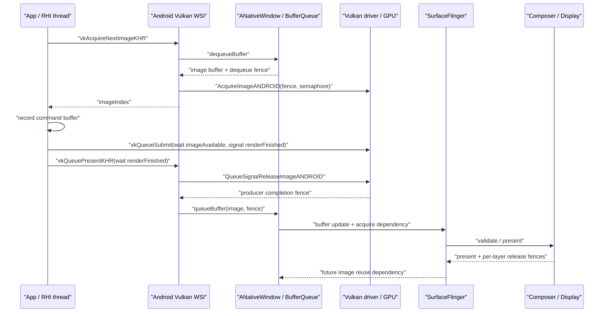

# 18.9 Android 17 Vulkan 原生渲染管线

Vulkan 把资源、命令和同步的管理责任交给应用，但 Android 的显示后半段仍然存在。App 要通过 `VK_KHR_android_surface`，把代表显示目标的 `VkSurfaceKHR` 连接到 `ANativeWindow`；swapchain image（循环用于渲染和显示的图像）仍映射到 Android GraphicBuffer/BufferQueue，提交后还要经过 SurfaceFlinger、HWC 和 Display present。

本文以 `android-17.0.0_r1` 中的 Android WSI（Window System Integration，Vulkan 与窗口系统的连接层）、SurfaceFlinger/RenderEngine 为平台基线，以 `android17-6.18-2026-06_r6` 中的 dma-buf/dma-fence 为内核基线。Vulkan 驱动和 GPU job scheduler 由设备厂商实现；AOSP 可以说明接口与所有权，却无法代替目标设备回答 GPU 工作何时完成。

## 为什么选择 Vulkan

### 显式控制带来的价值

OpenGL ES 把较多状态验证、资源转换和同步决策放在驱动中；Vulkan 则要求应用预先描述 pipeline（固定功能与着色器状态组合）、descriptor（着色器访问资源的绑定）、resource usage、command buffer 和执行依赖。组织得当时，Vulkan 可以：

- 降低高 draw-call 场景中的 CPU 驱动开销；
- 把 shader/pipeline 创建从关键帧移到加载或缓存阶段；
- 用多个 command pool（命令缓冲分配池）并行准备命令；
- 精确表达执行依赖、内存可见性和 image layout（图像当前用途对应的状态）；
- 让帧内 GPU 工作和错误更容易通过 Validation Layer/AGI 定位。

这些能力不会自动转化为性能收益。引擎如果频繁创建 pipeline、把提交切得过碎、设置过度保守的 barrier，或者积压太多 in-flight frame（已提交但尚未完成显示的帧），Vulkan 同样会产生较高 CPU 开销、GPU bubble（依赖导致的硬件空闲间隙）和输入延迟。比较 GLES 与 Vulkan 时，应保持内容、分辨率、pacing 和设备温度一致。

### 应用侧的责任

| 领域 | 应用需要管理的内容 |
|---|---|
| 资源 | 内存 allocation/binding、生命周期、aliasing（内存复用）和预算 |
| 命令 | command pool/buffer、record/reset 和 queue submit |
| 同步 | semaphore、fence、stage/access mask 和 queue ownership |
| 图像 | format、usage、layout、subresource（图像的 mip/layer 子范围）和 compression |
| 窗口 | surface capabilities、swapchain、resize、rotation、present mode |
| 节奏 | 输入采样、目标 present、in-flight 数量和刷新率提示 |
| 恢复 | `OUT_OF_DATE`、`SUBOPTIMAL`、surface lost、device lost |

Validation Layer 能发现许多 API、同步和对象生命周期误用，但无法证明性能达标，也无法覆盖所有跨帧业务所有权。Release 构建还要通过 trace、GPU counter、内存预算和长时间温度测试验证。

### Vulkan 与承载结构是两个维度

Vulkan 描述 Producer 如何生成内容。它可以绘制到 SurfaceView/GameActivity/NativeActivity 提供的独立 Surface，也可以写入 TextureView 的输入 Surface 或离屏 `AHardwareBuffer`。SurfaceFlinger 是否能看到独立 layer，取决于目标 `ANativeWindow` 连接到哪个 Consumer，不能根据 API 名判断。

常见游戏页面会同时包含 Vulkan 主体 Surface、宿主 HWUI、系统栏和弹窗。如果引擎 HUD（抬头显示界面）已经画入同一个 swapchain image，SurfaceFlinger 仍只看到一个主体 buffer layer；画面中存在按钮，无法证明还有额外的 SF layer。

## Android Vulkan Profile (AVP)

Vulkan Profile 是一组可以由工具检查的 extension、feature、property、format 和 limit。工程可以用一个 profile 表达所需能力集合，但运行时查询仍不可省略；安装同一 Android 版本的设备也不一定具有相同 GPU 能力。

### Android 17 的两类口径

Android 17 中要区分面向存量设备的兼容性 profile 和面向新芯片的要求 profile：

- `VP_ANDROID_vulkan_profile_2025`：Android Vulkan Profile 2025，面向广泛的现役设备能力，延续原 Android Baseline Profile 的兼容性用途。
- `VP_ANDROID_17_requirements`：由 `android-17.0.0_r1` 中 `vulkan/vkprofiles/profiles/VP_ANDROID_17_requirements.json` 定义，也称 VRA17；其 label 为 “Vulkan Minimum Requirements for Android 17”，面向随 Android 17 发布或续期 Google Requirements Freeze 的芯片。

`VP_ANDROID_17_requirements` 的 `api-version` 是 Vulkan 1.4.335，并以 `VP_ANDROID_vulkan_profile_2025` 为父 profile。它包含 `VK_KHR_present_id2`、`VK_KHR_present_wait2`、`VK_EXT_present_timing` 和 `VK_EXT_present_mode_fifo_latest_ready` 等要求。该文件约束的是相应新芯片档位，不能据此认定所有升级到 Android 17 的旧设备都支持完整 VRA17。

### 工程使用方式

建议把能力分三层：

1. 用目标市场的兼容性 profile 定义广覆盖的能力下限；
2. 对 Android 17 新芯片档位检查 `VP_ANDROID_17_requirements`；
3. 继续在运行时查询应用必需的 extension/feature/format/limit，并为缺失能力设计 fallback（降级路径）或明确拒绝启动。

Profile 检查通过，也不代表每种 surface、format、present mode 或 protected 路径都可用。swapchain 能力属于物理设备与具体 `VkSurfaceKHR` 的组合，仍要调用 surface capability/format/present-mode query 获取运行时结果。

### Dynamic Rendering 例子

某项功能进入 Vulkan core version，不代表创建设备后会自动启用。以 Dynamic Rendering（无须预先创建 RenderPass/Framebuffer 的渲染方式）为例，应用仍需通过 `VkPhysicalDeviceVulkan13Features` 或对应 extension feature 查询 `dynamicRendering`，并在 device creation feature chain 中显式启用。Profile JSON 是否要求该 bit，应以实际文件为准，不能只看 API version。

## 渲染流程详解

### 创建 surface 与 swapchain

进入帧循环前，应用至少要完成以下初始化：

1. 用 `VK_KHR_android_surface` 从 `ANativeWindow` 创建 `VkSurfaceKHR`；
2. 查询 queue family（具有相同能力的一组硬件队列）是否支持向该 surface present；
3. 查询 surface capabilities、formats 和 present modes；
4. 选择 extent（图像尺寸）、format/colorspace、usage、preTransform、compositeAlpha 和 image count；
5. 创建 swapchain 并取得 images；
6. 为每个 in-flight frame 准备 command buffer、acquire semaphore、render-finished semaphore 和供 CPU 查询完成状态的 fence。

`minImageCount` 只能在 `minImageCount..maxImageCount` 范围内选择；`maxImageCount == 0` 表示规范没有给出显式上限，并非数量无限。Android WSI 还受 native window 的 min-undequeued/max-buffer-count 约束，因此不能把 swapchain 固定描述为双缓冲或三缓冲。

### 第一阶段：Acquire

典型调用通过 semaphore 或 fence 接收 image 可用信号：

```c
VkResult result = vkAcquireNextImageKHR(
    device,
    swapchain,
    timeoutNs,
    imageAvailableSemaphore,
    VK_NULL_HANDLE,
    &imageIndex
);
```

这段调用只负责取得一块可用于后续渲染和 present 的 image。`timeoutNs == 0` 时可能返回 `VK_NOT_READY`，使用有限 timeout 时可能返回 `VK_TIMEOUT`；窗口变化还可能导致 `VK_ERROR_OUT_OF_DATE_KHR`。

在 Android 17 WSI 中，普通 swapchain 的 `AcquireNextImageKHR()` 会：

1. 把 Vulkan timeout 映射为 native window 的 dequeue timeout；
2. 调用 `ANativeWindow::dequeueBuffer()`，取得 buffer 和 dequeue fence fd；
3. 找到或绑定对应 swapchain image；
4. 把 fence fd 的副本交给驱动私有入口 `AcquireImageANDROID()`；
5. 由驱动把该依赖连接到应用提供的 semaphore/fence。

`AcquireImageANDROID()` 是 Android loader 与驱动之间的集成钩子，应用不会直接调用它。应用也不应手工 import 这条 fd，否则会与 loader 已建立的同步关系重复。

Acquire 耗时较长，可能因为没有可用 image、native window release 较慢、FIFO 节拍限制、surface 正在重新配置，或者驱动内部处理。dequeue fence 来自该 buffer 的前序 Consumer 完成依赖，但 `vkAcquireNextImageKHR()` 的 wall time 不能全部归因于某一条 release fence。应分别观察 dequeue 调用是否阻塞，以及返回后 fence/GPU 依赖何时满足。

### 第二阶段：Record 与 Submit

Command Buffer recording 是 host（CPU）工作，只负责记录命令和对象引用，不代表 GPU 已经执行。并行录制时要遵守 Vulkan 的 external synchronization（由应用负责的线程同步）规则：

- 每个 worker 线程使用独立的 `VkCommandPool`；
- 同一 `VkCommandBuffer` 的 begin/record/end/reset 不得并发；
- 同一 `VkQueue` 的 host access 需要由应用串行保护；
- descriptor pool、query pool 和其他标记为 externally synchronized 的对象也要按规范加锁或分离所有权。

下面的 synchronization2 骨架等待 acquired image，并在渲染完成后 signal present semaphore：

```c
VkSemaphoreSubmitInfo acquireWait = {
    .sType = VK_STRUCTURE_TYPE_SEMAPHORE_SUBMIT_INFO,
    .semaphore = imageAvailableSemaphore,
    .stageMask = VK_PIPELINE_STAGE_2_COLOR_ATTACHMENT_OUTPUT_BIT,
};

VkCommandBufferSubmitInfo commandInfo = {
    .sType = VK_STRUCTURE_TYPE_COMMAND_BUFFER_SUBMIT_INFO,
    .commandBuffer = commandBuffer,
};

VkSemaphoreSubmitInfo renderSignal = {
    .sType = VK_STRUCTURE_TYPE_SEMAPHORE_SUBMIT_INFO,
    .semaphore = renderFinishedSemaphore,
    .stageMask = VK_PIPELINE_STAGE_2_ALL_COMMANDS_BIT,
};

VkSubmitInfo2 submit = {
    .sType = VK_STRUCTURE_TYPE_SUBMIT_INFO_2,
    .waitSemaphoreInfoCount = 1,
    .pWaitSemaphoreInfos = &acquireWait,
    .commandBufferInfoCount = 1,
    .pCommandBufferInfos = &commandInfo,
    .signalSemaphoreInfoCount = 1,
    .pSignalSemaphoreInfos = &renderSignal,
};

vkQueueSubmit2(graphicsQueue, 1, &submit, frameFence);
```

这段代码只展示依赖关系，并非完整 renderer。`frameFence` 让 CPU 判断本次 submit 何时完成，以便安全复用这一帧的 command/descriptor 资源；`renderFinishedSemaphore` 则让 present engine 等待 GPU 渲染完成。前者连接 GPU 与 CPU，后者连接 GPU 工作与 present。

### 第三阶段：Present

Present 把 image index 和需要等待的 semaphore 交给 presentation engine（负责把 swapchain image 送入窗口系统的实现）：

```c
VkPresentInfoKHR present = {
    .sType = VK_STRUCTURE_TYPE_PRESENT_INFO_KHR,
    .waitSemaphoreCount = 1,
    .pWaitSemaphores = &renderFinishedSemaphore,
    .swapchainCount = 1,
    .pSwapchains = &swapchain,
    .pImageIndices = &imageIndex,
};

VkResult presentResult = vkQueuePresentKHR(presentQueue, &present);
```

Android 17 的 `PresentOneSwapchain()` 会调用驱动的 `QueueSignalReleaseImageANDROID()`，把 present waits 转换为 producer completion fence；随后设置 damage/timing 等 native window 状态，并由 CPU 调用 `queueBuffer(buffer, fence)`。`queueBuffer()` 接管 fence fd 的所有权，SurfaceFlinger/BLAST 再把它作为 buffer acquire dependency，等待 Producer 完成写入。

`vkQueuePresentKHR()` 返回时，用户通常还没有看到画面。应用仍需处理 `VK_ERROR_OUT_OF_DATE_KHR`、`VK_SUBOPTIMAL_KHR` 和 surface lost；显示时序还要继续追踪 SF latch、HWC validate/present 和 Display fence。Android WSI 当前只在 window transform/rotation 变化时返回 `VK_SUBOPTIMAL_KHR`，不能把所有 extent 变化都等同于该返回值。

### 完整时序

下面的图按 CPU API、GPU 依赖和 Android queue 三条线描述一帧：



图中 WSI 调用驱动取得 fence 后，再由 CPU 调用 `queueBuffer()`。GPU 通过 semaphore/fence 表达完成依赖，CPU 负责发起 API 调用和转移 fd 所有权；`queueBuffer()` 不是 GPU 自行执行的操作。

## Pipeline Barrier 与 Image Layout

### 三种同步对象解决不同问题

- Semaphore：连接 queue submit、acquire 和 present 等 GPU/WSI 执行依赖；
- Fence：把某次 queue 工作的完成状态暴露给 host（CPU）；
- Pipeline barrier/event：在 command stream 内定义执行顺序、内存可见性、image layout 和 queue-family ownership。

Semaphore signal 只能表达执行依赖，不能代替 image layout transition；barrier 也不能代替 present 对 render-finished semaphore 的等待。分析同步时，要同时检查 execution dependency（谁先执行）、memory dependency（写入何时对读取可见）和 resource state（资源处于哪种 layout/ownership）。

### acquired image 的 layout

swapchain image 会被循环复用。第一次使用且应用明确丢弃旧内容时，可以从 `VK_IMAGE_LAYOUT_UNDEFINED` 转换到颜色附件 layout；后续 acquire 到的 image 通常要从 `VK_IMAGE_LAYOUT_PRESENT_SRC_KHR` 转回渲染所需 layout。只有旧内容允许完全丢弃，并且符合规范与渲染设计时，才能把 `oldLayout` 设为 `UNDEFINED`，不能无条件每帧都这样写。

一次常见的 layout 序列是：

```text
acquire
PRESENT_SRC_KHR（或首次 UNDEFINED）
→ COLOR_ATTACHMENT_OPTIMAL
→ PRESENT_SRC_KHR
present
```

这条序列只说明最简状态变化，不包含 MSAA resolve、transfer、compute post-process 或多 queue ownership。涉及这些阶段时，还要增加对应的 layout transition 与 queue-family transfer。

### synchronization2 barrier

下面的 barrier 把颜色附件写入收束到 present layout：

```c
VkImageMemoryBarrier2 toPresent = {
    .sType = VK_STRUCTURE_TYPE_IMAGE_MEMORY_BARRIER_2,
    .srcStageMask = VK_PIPELINE_STAGE_2_COLOR_ATTACHMENT_OUTPUT_BIT,
    .srcAccessMask = VK_ACCESS_2_COLOR_ATTACHMENT_WRITE_BIT,
    .dstStageMask = VK_PIPELINE_STAGE_2_NONE,
    .dstAccessMask = 0,
    .oldLayout = VK_IMAGE_LAYOUT_COLOR_ATTACHMENT_OPTIMAL,
    .newLayout = VK_IMAGE_LAYOUT_PRESENT_SRC_KHR,
    .srcQueueFamilyIndex = VK_QUEUE_FAMILY_IGNORED,
    .dstQueueFamilyIndex = VK_QUEUE_FAMILY_IGNORED,
    .image = swapchainImages[imageIndex],
    .subresourceRange = {
        VK_IMAGE_ASPECT_COLOR_BIT, 0, 1, 0, 1
    },
};

VkDependencyInfo dependency = {
    .sType = VK_STRUCTURE_TYPE_DEPENDENCY_INFO,
    .imageMemoryBarrierCount = 1,
    .pImageMemoryBarriers = &toPresent,
};

vkCmdPipelineBarrier2(commandBuffer, &dependency);
```

这段示例适用于 graphics/present 使用同一 queue family，并且颜色附件写入是最后一项操作的简化场景。如果两类 queue family 不同，应按 surface sharing mode 和 ownership transfer 设计；如果后续还有 transfer/compute，`srcStageMask` 和 `srcAccessMask` 必须覆盖真正的最后一次写入。Validation Layer 只能发现部分错误，仍需使用 GPU-assisted validation 和目标设备测试补充验证。

### 过度同步

把 stage mask 一律设为 `ALL_COMMANDS`、频繁调用 queue idle、每个 pass 都使用 host fence，或者在没有依赖需要时拆成多个 submit，都会减少 GPU 可并行执行的空间。优化步骤应是：

1. 画出资源的生产者和消费者；
2. 找到必须等待该资源的最早 Consumer stage；
3. 让 access mask 只覆盖真实的写入和读取；
4. 合并无意义的小 submit；
5. 用 GPU trace 验证 bubble 是否减少。

## Presentation Mode

Vulkan 规范定义了多种 present mode，但应用只能使用 `vkGetPhysicalDeviceSurfacePresentModesKHR()` 为当前 surface 实际枚举出的模式。

Android 17 AOSP native WSI 的普通 surface 路径如下：

| Mode | Android 17 返回条件 | 语义与边界 |
|---|---|---|
| `FIFO_KHR` | 始终加入返回集合 | 按顺序显示队列中的 image；Vulkan 规范要求支持 |
| `MAILBOX_KHR` | `min_undequeued_buffers + 1 < max_buffer_count` | 新 image 可以替换尚未显示的旧 image；仍需评估 pacing、功耗与 in-flight 数量 |
| `FIFO_LATEST_READY_EXT` | `present_mode_fifo_latest_ready_ext2` flag 开启 | 从 FIFO 中选择已经 ready 的较新 image；必须通过枚举确认支持 |
| `SHARED_DEMAND_REFRESH_KHR` / `SHARED_CONTINUOUS_REFRESH_KHR` | physical-device presentation properties 报告 `sharedImage` | 使用共享 image 的专用模式，生命周期不同于普通 swapchain |

普通 Android Surface 路径不会把 `IMMEDIATE_KHR` 或 `FIFO_RELAXED_KHR` 加入该返回集合，因此桌面 Vulkan 的常见选择建议不能直接移植到 Android。

### 运行时选择

选择流程应包括：

1. 枚举 modes；
2. 结合业务目标选择 FIFO、MAILBOX 或 FIFO latest ready；
3. 用 surface capabilities 选择合法 image count；
4. 记录 swap interval/present mode 和 Display refresh mode；
5. 在目标设备测量 input-to-present、帧间隔、功耗和丢帧；
6. surface 重建后重新查询，不能一直沿用上一窗口的能力结果。

MAILBOX 不一定带来最低时延，更多可用 image 也不一定更流畅。如果应用过早采样输入并持续积压工作，即使 presentation engine 丢弃旧帧，CPU/GPU 仍然会为这些帧付出成本。

### Android 17 present timing

`android-17.0.0_r1` 增加了 `VK_EXT_present_timing` 平台支持，并把它列入 `VP_ANDROID_17_requirements`。AOSP WSI 可以查询 queue-operations-end、request-dequeued、image-first-pixel-out 和 image-first-pixel-visible 等显示阶段时间。应用还要完成以下步骤：

- 枚举并启用 extension；
- 查询 `VkPhysicalDevicePresentTimingFeaturesEXT`；
- 按规范启用 `VK_KHR_present_id2` 等依赖；
- 查询具体 surface 的 timing capabilities；
- 创建 swapchain 时设置 `VK_SWAPCHAIN_CREATE_PRESENT_TIMING_BIT_EXT`；
- 处理 timing queue full 和查询结果延迟到达。

该扩展提供 Android 显示链路中的阶段反馈，不是外部仪器测得的光学显示时间。旧设备可以继续评估 `VK_GOOGLE_display_timing`；两套 API 支持的阶段和时间域不同，不能混用。

## Swappy Frame Pacing

Swappy 是 Android Game Development Kit（AGDK）中的帧节奏库，不属于平台源码 `android-17.0.0_r1`。应用打包的 Swappy 版本、初始化结果和运行时配置都会影响行为，因此记录系统版本时还要单独记录库版本。

### 它解决什么

Swappy Vulkan 接口包装 `vkQueuePresentKHR()`，结合 Display refresh、presentation timestamp、Choreographer 和 sync fence 调整提交节奏。它主要用于：

- 避免 Producer 持续过早提交造成 queue-stuffing（待显示帧长期积压）；
- 让目标帧率与显示周期形成稳定关系；
- 在需要时调整 pipeline mode 和 swap interval；
- 为多刷新率设备提供可复用的 pacing 机制。

Swappy 中出现等待，不一定代表卡顿。如果它在合适的位置暂停 render thread，减少 in-flight frame 并推迟输入采样，端到端时延反而可能下降。判断时应比较等待前后的 present 间隔、missed frame、queue depth、GPU idle 和 input-to-present 时延。

### 接入边界

每个 swapchain 都要单独完成 Swappy 初始化，并在重建时更新对应状态。`SwappyVk_queuePresent()` 仍会返回 `VkResult`，应用必须处理 `OUT_OF_DATE`/`SUBOPTIMAL`；初始化失败时，也要切换到自研 pacing 或明确的降级策略。

下面的骨架只展示调用位置，具体签名与配置以应用锁定的 AGDK 版本为准：

```text
create swapchain
  → initialize Swappy for this swapchain
  → configure target swap interval / auto mode

per frame
  acquire → record → submit
  → SwappyVk_queuePresent(...)

swapchain recreate
  → destroy/reinitialize Swappy state
```

这份骨架说明 Swappy 只控制 present 附近的节奏，不会替应用管理 resource barrier、command buffer fence 或业务线程同步。

### 自研 pacing 与 Swappy

Vulkan 应用可以使用 `VK_EXT_present_timing`、`VK_GOOGLE_display_timing`、present id/wait、frame-rate hint 和引擎时钟自行实现 pacing。同一个 swapchain 不应同时由多套 pacing 控制器调度；接入 Swappy 后，要明确由谁决定目标时间、由谁等待，以及由谁统计历史 present。

## Trace 视角

### 建立逐帧证据

从目标 Surface 和 Producer tid 开始，每帧至少记录：

```text
input sample
→ logic/update
→ command recording
→ vkAcquireNextImageKHR result + image index
→ vkQueueSubmit + GPU execution
→ producer completion fence
→ vkQueuePresentKHR / queueBuffer
→ SF buffer selection
→ HWC validate/present
→ display timing / present fence
→ per-layer release
```

这条时间线把 CPU API、GPU execution 和显示阶段分开。带有调用名的 slice 可能来自应用 marker、Vulkan layer、AGI 或驱动数据源；没有标准 slice 时，可以用 present id、buffer/frame number、fence 和 FrameTimeline token 补齐关联。

### 等待归因

| 现象 | 候选原因 | 证据 |
|---|---|---|
| `vkAcquireNextImageKHR()` 耗时长 | 没有 available image、FIFO cadence、Consumer release 较晚、surface resize | image count、BufferQueue state、dequeue/release fence 和返回码 |
| command recording 迟到 | logic/RHI/worker 依赖、pipeline 编译、CPU 调度 | worker slice、Runnable latency（可运行线程等待 CPU 的时间）和 pipeline cache |
| `vkQueueSubmit*()` host 调用耗时长 | queue 外部同步竞争、驱动工作、过多小 submit | host mutex、调用栈和 submit 数量 |
| submit 较早但 GPU fence 迟到 | shader、overdraw、带宽、barrier bubble、温控/频率 | GPU stages/counters、job queue 和 fence signal |
| `vkQueuePresentKHR()` 耗时长 | 驱动/WSI、Swappy、present waits、window queue | Swappy marker、QueueSignalReleaseImage 和 BufferQueue queue |
| buffer 已 queue 但 SF 使用旧帧 | Producer fence 未 ready、目标显示时刻未到、visibility/transaction 条件 | layer trace、fence 和 present timing |
| SF 已选新帧但 present 仍晚 | CLIENT composition、HWC/Display 资源竞争 | RenderEngine、composition type 和 HWC/present fence |

`vkAcquireNextImageKHR()` 和 `vkQueuePresentKHR()` 只管理 swapchain image 的取得与交付，不适合充当业务线程或通用 GPU 同步器。其阻塞行为会随驱动、present mode 和 presentation engine 状态变化。

### queue-stuffing

典型证据是 pending/in-flight 数量长期处于高位，应用仍按最大速度 acquire/submit/present，随后周期性等待 available image；帧率接近目标，input-to-present 时延却持续上升。修复方向包括：

- 用 Swappy 或自研 timing 控制 submit；
- 降低 in-flight frame 数；
- 把输入采样推迟到更靠近目标帧；
- 减少 GPU workload，确保 Producer fence 在 deadline 前 ready；
- 选择经设备验证的 present mode/image count。

### FrameTimeline、present timing 与光学时间

FrameTimeline 可以帮助对齐 App SurfaceFrame 与 SurfaceFlinger DisplayFrame，但独立 native Surface 是否提供完整的 expected/actual 信息，取决于 Producer 传入的 timeline/desired-present 数据和 trace 配置。`VK_EXT_present_timing` 提供 WSI/Display 各阶段的反馈，present fence 提供显示栈同步完成边界；这三者都不是用户实际看到光线变化的光学时间。

### SurfaceFlinger Graphite 不属于 App WSI

Android 17 的 SurfaceFlinger RenderEngine 包含可选的 Graphite Vulkan backend；`RenderEngine::SkiaBackend` 仍以 Ganesh 为默认值，是否启用 Graphite 取决于 flag、property 和 OEM 配置。`RenderEngineThreaded` 会尝试使用 `SFRenderEnginePolicy` 和实时调度策略 `SCHED_FIFO` priority 2，在 `primeCache`（预热渲染缓存）期间暂时切回普通策略 `SCHED_OTHER`。

这条 Vulkan 工作只在 SurfaceFlinger 需要 RenderEngine 生成 client target、blur、tone-map 等内容时出现。它与 App 的 `vkQueueSubmit()`/swapchain 使用不同的 device、context、queue 和线程。如果主体 layer 使用 HWC DEVICE composition，SF 未必会通过 RenderEngine 重绘它。trace 中应把 App queue、`REThreaded::drawLayers`、Graphite/Ganesh submit 和 HWC present 分组，不能把 SF Graphite 的时间计入 App command recording。

Graphite 的 `flushAndSubmit()` 使用 Recording、wait/signal backend semaphores 和导出的 sync fd 表达 RenderEngine GPU 何时完成。这是 SF CLIENT composition 生成 client target 时的输出 fence，与 App swapchain 的 `VkFence` 无关。

### Validation 与工具

- Validation Layers：在开发构建中检查 API、同步和对象生命周期；按 Android 官方 GPU debug layers 流程打包和启用，不使用未经版本核实的全局属性片段。
- AGI（Android GPU Inspector）：关联 Vulkan API、GPU queue、counter 和 frame capture。
- RenderDoc：在目标设备和构建支持时，检查单帧资源与 DrawCall。
- Perfetto：关联线程调度、BufferQueue、SurfaceFlinger、FrameTimeline、fence 和 HWC。

这些工具会改变 CPU/GPU 成本。确定性能基线时，应关闭 validation/capture 后重新测量。

### Android 12—17 边界

| 平台 | 变化 | 分析重点 |
|---|---|---|
| Android 12 / API 31 | BLAST 与 FrameTimeline 形成现代显示诊断基线 | 区分 App submit、SF latch 和 Display present |
| Android 13 / API 33 | Composer AIDL（稳定的进程间接口定义）成为主线；Game Mode/FPS intervention 可能改变游戏帧率 | 判断目标 cadence 时要包含系统 intervention（干预） |
| Android 14 / API 34 | Android WSI acquire/queue 主结构延续 | 不要虚构 API 34 专属 present 流程 |
| Android 15 / API 35 | 年度 Vulkan requirements/profile 体系继续推进；16 KB page-size 兼容影响 native 库发布 | 能力 profile 与应用可运行性要分开验证 |
| Android 16 / API 36 | ADPF（Android Dynamic Performance Framework）、性能 headroom 与 ARR（Adaptive Refresh Rate）能力扩展，Vulkan 主链不变 | workload 自适应无法替代正确的 pacing |
| Android 17 / API 37 | 增加 `VP_ANDROID_17_requirements`、`VK_EXT_present_timing` 和有条件支持的 FIFO latest ready；SF 包含可选 Graphite backend | 运行时查询 surface/feature，并把 App WSI 与 SF RenderEngine 分组分析 |

### Android 17 源码锚点

- [`swapchain.cpp`](https://android.googlesource.com/platform/frameworks/native/+/refs/tags/android-17.0.0_r1/vulkan/libvulkan/swapchain.cpp)：surface capabilities、present modes、AcquireImageANDROID、QueueSignalReleaseImageANDROID、queueBuffer 和 present timing；
- [`VP_ANDROID_17_requirements.json`](https://android.googlesource.com/platform/frameworks/native/+/refs/tags/android-17.0.0_r1/vulkan/vkprofiles/profiles/VP_ANDROID_17_requirements.json)：Android 17 芯片要求 profile 和 Vulkan 1.4.335 能力集合；
- [`Surface.cpp`](https://android.googlesource.com/platform/frameworks/native/+/refs/tags/android-17.0.0_r1/libs/gui/Surface.cpp)、[`BufferQueueProducer.cpp`](https://android.googlesource.com/platform/frameworks/native/+/refs/tags/android-17.0.0_r1/libs/gui/BufferQueueProducer.cpp)：dequeue/queue、slot、fence 和 buffer age；
- [`SurfaceFlinger.cpp`](https://android.googlesource.com/platform/frameworks/native/+/refs/tags/android-17.0.0_r1/services/surfaceflinger/SurfaceFlinger.cpp)、[`HWComposer.cpp`](https://android.googlesource.com/platform/frameworks/native/+/refs/tags/android-17.0.0_r1/services/surfaceflinger/DisplayHardware/HWComposer.cpp)：buffer selection、composition 和 present；
- [`RenderEngine.h`](https://android.googlesource.com/platform/frameworks/native/+/refs/tags/android-17.0.0_r1/libs/renderengine/include/renderengine/RenderEngine.h)、[`GraphiteVkRenderEngine.cpp`](https://android.googlesource.com/platform/frameworks/native/+/refs/tags/android-17.0.0_r1/libs/renderengine/skia/GraphiteVkRenderEngine.cpp)、[`RenderEngineThreaded.cpp`](https://android.googlesource.com/platform/frameworks/native/+/refs/tags/android-17.0.0_r1/libs/renderengine/threaded/RenderEngineThreaded.cpp)：SF 可选 Graphite、threaded task 和 client-target fence；
- [`dma-buf.c`](https://android.googlesource.com/kernel/common/+/refs/tags/android17-6.18-2026-06_r6/drivers/dma-buf/dma-buf.c)、[`sync_file.c`](https://android.googlesource.com/kernel/common/+/refs/tags/android17-6.18-2026-06_r6/drivers/dma-buf/sync_file.c)、[`dma-fence.c`](https://android.googlesource.com/kernel/common/+/refs/tags/android17-6.18-2026-06_r6/drivers/dma-buf/dma-fence.c)：共享 buffer 和 fence fd；
- [Android Vulkan Profiles](https://developer.android.com/ndk/guides/graphics/android-vulkan-profile)、[Native/proprietary engine Vulkan guide](https://developer.android.com/games/develop/vulkan/native-engine-support)、[Android Frame Pacing](https://developer.android.com/games/sdk/frame-pacing)：profile、WSI 同步和 Swappy 的官方边界。

相关章节：

- [18.8 EGL / OpenGL ES 渲染链路](08-opengl-es.md)
- [18.10 SurfaceControl API 深入](10-surface-control-api.md)
- [2.13 BufferQueue](../../part1-fundamentals/ch02-rendering/13-buffer-queue.md)
- [2.14 图形 API 演进](../../part1-fundamentals/ch02-rendering/14-graphics-api-evolution.md)
