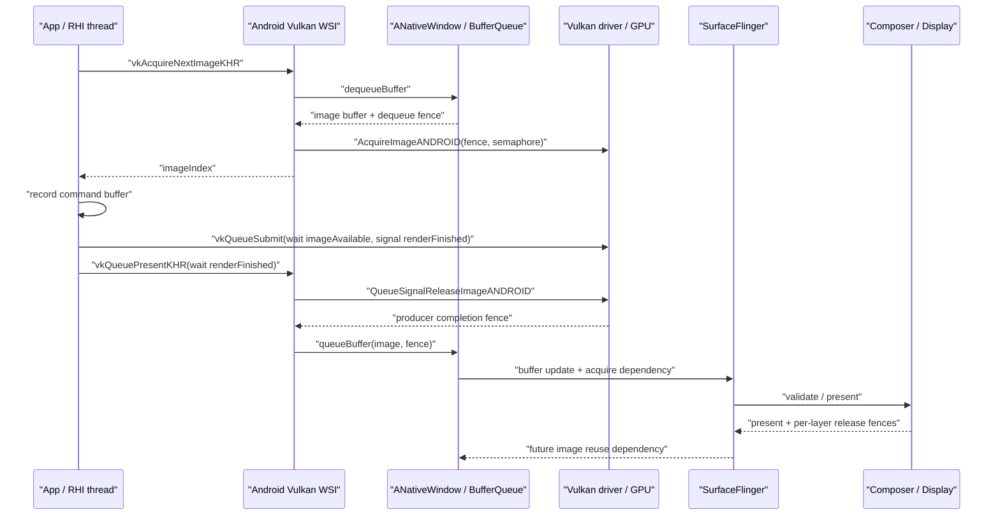

# 18.9 Android 17 Vulkan 原生渲染管线

Vulkan 把资源、命令和同步的责任交给应用，但 Android 的显示后半段没有消失。App 仍要通过 `VK_KHR_android_surface` 把 `VkSurfaceKHR` 接到 `ANativeWindow`，swapchain image 仍映射到 Android GraphicBuffer/BufferQueue，提交后仍要经过 SurfaceFlinger、HWC 和 display present。

平台源码锚点为 `android-17.0.0_r1` 的 Android WSI、SurfaceFlinger/RenderEngine，kernel 锚点为 `android17-6.18-2026-06_r6` 的 dma-buf/dma-fence。Vulkan driver 和 GPU job scheduler 由设备实现，AOSP 能固定接口与所有权，不能替目标设备回答 GPU 工作何时完成。

## 为什么选择 Vulkan

### 显式控制带来的价值

OpenGL ES 把较多状态验证、资源转换和同步决策放在 driver；Vulkan 让应用预先描述 pipeline、descriptor、resource usage、command buffer 与依赖。组织得当时，Vulkan 可以：

- 降低高 draw-call 场景中的 CPU driver 开销；
- 把 shader/pipeline 创建从关键帧移到加载或缓存阶段；
- 用多个 command pool 并行准备命令；
- 精确表达执行依赖、内存可见性和 image layout；
- 让帧内 GPU 工作和错误更容易通过 validation/AGI 定位。

这些是能力，不是自动收益。引擎若频繁创建 pipeline、错误拆分提交、过度 barrier、堆积过多 in-flight frame，Vulkan 也会产生高 CPU 开销、GPU bubble 和输入延迟。GLES 与 Vulkan 的性能应在同一内容、分辨率、pacing 和设备温度下比较。

### 应用侧的责任

| 领域 | 应用需要管理的内容 |
|---|---|
| 资源 | allocation、binding、lifetime、aliasing、budget |
| 命令 | command pool/buffer、record/reset、queue submit |
| 同步 | semaphore、fence、stage/access mask、queue ownership |
| 图像 | format、usage、layout、subresource、compression |
| 窗口 | surface capabilities、swapchain、resize、rotation、present mode |
| 节奏 | input sample、target present、in-flight 数量、refresh-rate hint |
| 恢复 | `OUT_OF_DATE`、`SUBOPTIMAL`、surface lost、device lost |

Validation Layer 能发现大量 API 误用，但它不证明画面性能合格，也不覆盖所有跨帧业务所有权。Release 构建还要用 trace、GPU counter、内存预算和长时间温度测试验证。

### Vulkan 与承载结构是两个维度

Vulkan 描述 Producer。它可以画到 SurfaceView/GameActivity/NativeActivity 提供的独立 Surface，也可以写 TextureView 输入或离屏 `AHardwareBuffer`。SurfaceFlinger 是否看到独立 layer，取决于目标 `ANativeWindow` 的 Consumer，不取决于 API 名。

一个常见游戏页面同时包含 Vulkan 主体 Surface、宿主 HWUI、系统栏和弹窗。引擎 HUD 如果已画入同一 swapchain image，SurfaceFlinger 仍只看到一个主体 buffer layer；画面中有按钮不能用来推断额外 SF layer。

## Android Vulkan Profile (AVP)

Vulkan Profile 是一组可机器检查的 extension、feature、property、format 和 limit。它能让工程以一个 profile 表达能力集合，但不会取消运行时查询，也不会让所有安装同一 Android 版本的设备拥有相同 GPU 能力。

### Android 17 的两类口径

Android 17 源码中应区分兼容性 profile 与芯片要求：

- `VP_ANDROID_vulkan_profile_2025`：面向广泛现役设备能力的 Android Vulkan Profile 2025；它延续原 Android Baseline Profile 的兼容性用途。
- `VP_ANDROID_17_requirements`：`android-17.0.0_r1` 内 `vulkan/vkprofiles/profiles/VP_ANDROID_17_requirements.json` 定义的 VRA17，label 为 “Vulkan Minimum Requirements for Android 17”，目标是随 Android 17 launch 或续期 Google Requirements Freeze 的芯片。

`VP_ANDROID_17_requirements` 的 `api-version` 是 Vulkan 1.4.335，并把 `VP_ANDROID_vulkan_profile_2025` 作为父 profile。它包含 `VK_KHR_present_id2`、`VK_KHR_present_wait2`、`VK_EXT_present_timing`、`VK_EXT_present_mode_fifo_latest_ready` 等要求。这个文件不能被解释为“所有升级到 Android 17 的旧设备都支持整套 VRA17”。

### 工程使用方式

建议把能力分三层：

1. 用目标市场的兼容性 profile 定义广覆盖下限；
2. 对 Android 17 新芯片档位检查 `VP_ANDROID_17_requirements`；
3. 对应用必需 extension/feature/format/limit 继续运行时查询，并为缺失能力设计 fallback 或拒绝启动。

Profile 检查通过也不代表每种 surface、format、present mode 或 protected 路径都可用。swapchain 相关能力属于物理设备与具体 `VkSurfaceKHR` 的组合，仍要调用 surface capability/format/present-mode query。

### Dynamic Rendering 例子

某项功能进入 Vulkan core version，不等于创建设备后自动启用。以 Dynamic Rendering 为例，应用仍需通过 `VkPhysicalDeviceVulkan13Features` 或对应 extension feature 查询 `dynamicRendering`，并在 device creation feature chain 中启用。Profile JSON 是否要求该 bit，应以实际文件为准，不能只看 API version。

## 渲染流程详解

### 创建 surface 与 swapchain

进入帧循环前，应用至少要完成：

1. 用 `VK_KHR_android_surface` 从 `ANativeWindow` 创建 `VkSurfaceKHR`；
2. 查询 queue family 的 present support；
3. 查询 surface capabilities、formats 与 present modes；
4. 选择 extent、format/colorspace、usage、preTransform、compositeAlpha、image count；
5. 创建 swapchain 并取得 images；
6. 为每个 in-flight frame 准备 command buffer、acquire semaphore、render-finished semaphore 和 CPU fence。

`minImageCount` 只能在 `minImageCount..maxImageCount` 范围内选择，`maxImageCount == 0` 表示规范意义上的无显式上限。Android WSI 还受 native window 的 min-undequeued/max-buffer-count 约束。不能把 swapchain 固定写成双缓冲或三缓冲。

### 第一阶段：Acquire

典型调用使用 semaphore 或 fence 接收 image 可用信号：

```c
VkResult result = vkAcquireNextImageKHR(
    device,
    swapchain,
    timeoutNs,
    imageAvailableSemaphore,
    VK_NULL_HANDLE,
    &imageIndex
);
```

这段调用只负责获取可用于后续工作的 presentable image。`timeoutNs == 0` 可返回 `VK_NOT_READY`，有限 timeout 可返回 `VK_TIMEOUT`；窗口变化还可能返回 `VK_ERROR_OUT_OF_DATE_KHR`。

在 Android 17 WSI 中，普通 swapchain 的 `AcquireNextImageKHR()` 会：

1. 把 Vulkan timeout 映射到 native window dequeue timeout；
2. 调用 `ANativeWindow::dequeueBuffer()`，获得 buffer 与 dequeue fence fd；
3. 找到或绑定对应 swapchain image；
4. 把 fence fd 的副本交给 driver 私有 `AcquireImageANDROID()`；
5. 由 driver 将依赖接到应用提供的 semaphore/fence。

`AcquireImageANDROID()` 是 Android loader/driver 集成钩子，不是应用直接调用的公共 WSI API。应用也不应手工 import 这条 fd，再与 loader 重复同步。

Acquire 很长可能来自没有可用 image、native window release 慢、FIFO 节拍、surface reconfiguration 或 driver 状态。dequeue fence 来源于该 buffer 的前序消费者完成依赖，但 `vkAcquireNextImageKHR()` wall time 不能全部归因于某一条 release fence；要分开看 dequeue 阻塞和返回后的 fence/GPU 依赖。

### 第二阶段：Record 与 Submit

Command Buffer recording 是 host 工作：它建立命令编码和对象引用，不等于 GPU 已执行。并行录制要遵守 external synchronization：

- 每个 worker 使用独立 `VkCommandPool`；
- 同一 `VkCommandBuffer` 的 begin/record/end/reset 不得并发；
- 同一 `VkQueue` 的 host access 需要外部同步；
- descriptor pool、query pool 和其它标记为 externally synchronized 的对象也要按规范保护。

下面的 synchronization2 骨架等待 acquired image，并在渲染完成后 signal present semaphore：

```c
VkSemaphoreSubmitInfo acquireWait = {
    .sType = VK_STRUCTURE_TYPE_SEMAPHORE_SUBMIT_INFO,
    .semaphore = imageAvailableSemaphore,
    .stageMask = VK_PIPELINE_STAGE_2_COLOR_ATTACHMENT_OUTPUT_BIT,
};

VkCommandBufferSubmitInfo commandInfo = {
    .sType = VK_STRUCTURE_TYPE_COMMAND_BUFFER_SUBMIT_INFO,
    .commandBuffer = commandBuffer,
};

VkSemaphoreSubmitInfo renderSignal = {
    .sType = VK_STRUCTURE_TYPE_SEMAPHORE_SUBMIT_INFO,
    .semaphore = renderFinishedSemaphore,
    .stageMask = VK_PIPELINE_STAGE_2_ALL_COMMANDS_BIT,
};

VkSubmitInfo2 submit = {
    .sType = VK_STRUCTURE_TYPE_SUBMIT_INFO_2,
    .waitSemaphoreInfoCount = 1,
    .pWaitSemaphoreInfos = &acquireWait,
    .commandBufferInfoCount = 1,
    .pCommandBufferInfos = &commandInfo,
    .signalSemaphoreInfoCount = 1,
    .pSignalSemaphoreInfos = &renderSignal,
};

vkQueueSubmit2(graphicsQueue, 1, &submit, frameFence);
```

这段代码展示依赖关系，不是完整 renderer。`frameFence` 用于 CPU 判断本次 submit 何时完成并安全复用 per-frame command/descriptor 资源；`renderFinishedSemaphore` 用于 present engine 等 GPU 渲染。两者职责不同。

### 第三阶段：Present

Present 将 image index 与等待 semaphore 交给 presentation engine：

```c
VkPresentInfoKHR present = {
    .sType = VK_STRUCTURE_TYPE_PRESENT_INFO_KHR,
    .waitSemaphoreCount = 1,
    .pWaitSemaphores = &renderFinishedSemaphore,
    .swapchainCount = 1,
    .pSwapchains = &swapchain,
    .pImageIndices = &imageIndex,
};

VkResult presentResult = vkQueuePresentKHR(presentQueue, &present);
```

Android 17 的 `PresentOneSwapchain()` 调用 driver 的 `QueueSignalReleaseImageANDROID()`，把 present waits 转成 producer completion fence；随后设置 damage/timing 等 native window 状态，并在 CPU 侧调用 `queueBuffer(buffer, fence)`。`queueBuffer()` 接管 fence fd，SurfaceFlinger/BLAST 把它作为 buffer acquire dependency。

`vkQueuePresentKHR()` 的返回不表示用户已经看到画面。应用仍需处理 `VK_ERROR_OUT_OF_DATE_KHR`、`VK_SUBOPTIMAL_KHR` 和 surface lost；显示时序还要追踪 SF latch、HWC validate/present 与 display fence。Android WSI 当前只在 window transform/rotation 变化时返回 `VK_SUBOPTIMAL_KHR`，也不能把 extent 变化都等同于该返回值。

### 完整时序

下面的图按 CPU API、GPU 依赖和 Android queue 三条线描述一帧：



图中 WSI 调 driver 取得 fence 后，由 CPU 调用 `queueBuffer()`；不能把 `queueBuffer()` 画成 GPU 自己执行。GPU 通过 semaphore/fence 表达依赖，CPU 负责 API 调用和 fd 所有权转移。

## Pipeline Barrier 与 Image Layout

### 三种同步对象解决不同问题

- Semaphore：连接 queue submit、acquire 和 present 等 GPU/WSI 执行依赖；
- Fence：把某次 queue 工作完成状态暴露给 host；
- Pipeline barrier/event：在 command stream 内定义执行顺序、内存可见性、image layout 与 queue-family ownership。

Semaphore signal 不能代替 image layout transition，barrier 也不能代替 present 对 render-finished semaphore 的等待。同步分析要同时检查 execution dependency、memory dependency 和 resource state。

### acquired image 的 layout

交换链 image 被重复使用。首轮若应用明确丢弃旧内容，可以从 `VK_IMAGE_LAYOUT_UNDEFINED` 转到颜色附件 layout；后续 acquire 的 image 通常从 `VK_IMAGE_LAYOUT_PRESENT_SRC_KHR` 转回渲染所需 layout。不能每帧都把 oldLayout 写成 `UNDEFINED`，除非内容允许完全丢弃且符合规范与渲染设计。

一次常见的 layout 序列是：

```text
acquire
PRESENT_SRC_KHR（或首次 UNDEFINED）
→ COLOR_ATTACHMENT_OPTIMAL
→ PRESENT_SRC_KHR
present
```

这条序列用于说明状态，不包含 MSAA resolve、transfer、compute post-process 或多 queue ownership；这些场景还需要对应 layout 与 queue-family transfer。

### synchronization2 barrier

下面的 barrier 把颜色附件写入收束到 present layout：

```c
VkImageMemoryBarrier2 toPresent = {
    .sType = VK_STRUCTURE_TYPE_IMAGE_MEMORY_BARRIER_2,
    .srcStageMask = VK_PIPELINE_STAGE_2_COLOR_ATTACHMENT_OUTPUT_BIT,
    .srcAccessMask = VK_ACCESS_2_COLOR_ATTACHMENT_WRITE_BIT,
    .dstStageMask = VK_PIPELINE_STAGE_2_NONE,
    .dstAccessMask = 0,
    .oldLayout = VK_IMAGE_LAYOUT_COLOR_ATTACHMENT_OPTIMAL,
    .newLayout = VK_IMAGE_LAYOUT_PRESENT_SRC_KHR,
    .srcQueueFamilyIndex = VK_QUEUE_FAMILY_IGNORED,
    .dstQueueFamilyIndex = VK_QUEUE_FAMILY_IGNORED,
    .image = swapchainImages[imageIndex],
    .subresourceRange = {
        VK_IMAGE_ASPECT_COLOR_BIT, 0, 1, 0, 1
    },
};

VkDependencyInfo dependency = {
    .sType = VK_STRUCTURE_TYPE_DEPENDENCY_INFO,
    .imageMemoryBarrierCount = 1,
    .pImageMemoryBarriers = &toPresent,
};

vkCmdPipelineBarrier2(commandBuffer, &dependency);
```

这段示例适用于同 queue family、颜色附件作为末项写入的简化场景。若 graphics/present queue family 不同，应按 surface sharing mode 和 ownership transfer 设计；若后续还有 transfer/compute，则 src stage/access 必须覆盖真实末项写入。使用 validation layer 只能发现部分错误，GPU-assisted validation 与目标设备测试仍有价值。

### 过度同步

把 stage mask 一律设为 ALL_COMMANDS、频繁 queue idle、每 pass 使用 host fence、无必要地拆成多个 submit，会让并行执行变成串行。优化步骤应是：

1. 画出资源的生产者和消费者；
2. 找到需要保证的最早 consumer stage；
3. 只覆盖真实写入和读取 access；
4. 合并无意义的小 submit；
5. 用 GPU trace 验证 bubble 是否下降。

## Presentation Mode

Vulkan 规范定义多种 present mode，但应用只能使用 `vkGetPhysicalDeviceSurfacePresentModesKHR()` 对当前 surface 实际枚举出的集合。

Android 17 AOSP native WSI 的普通 surface 路径如下：

| Mode | Android 17 返回条件 | 语义与边界 |
|---|---|---|
| `FIFO_KHR` | 始终加入返回集合 | 有序队列，Vulkan 规范要求支持 |
| `MAILBOX_KHR` | `min_undequeued_buffers + 1 < max_buffer_count` | 可替换未显示旧帧；仍需评估 pacing、功耗与 in-flight |
| `FIFO_LATEST_READY_EXT` | `present_mode_fifo_latest_ready_ext2` flag 开启 | 选择 FIFO 中较新的 ready 帧；必须枚举确认 |
| `SHARED_DEMAND_REFRESH_KHR` / `SHARED_CONTINUOUS_REFRESH_KHR` | physical-device presentation properties 报告 `sharedImage` | shared-image 专用模式，生命周期和普通 swapchain 不同 |

普通 Android Surface 路径不把 `IMMEDIATE_KHR` 或 `FIFO_RELAXED_KHR` 加入该返回集合。桌面 Vulkan 的常见建议不能直接移植。

### 运行时选择

选择流程应包括：

1. 枚举 modes；
2. 结合业务目标选择 FIFO/MAILBOX/FIFO latest ready；
3. 用 surface capabilities 选择合法 image count；
4. 记录 swap interval/present mode 与 display refresh mode；
5. 在目标设备测量 input-to-present、帧间隔、功耗和丢帧；
6. surface 重建后重新查询，不能永久缓存上一窗口的能力。

MAILBOX 不自动等于最低时延，更多可用 image 也不自动等于更流畅。应用若提前采样输入并持续堆积工作，即使 presentation engine 丢弃旧帧，CPU/GPU 仍可能浪费工作。

### Android 17 present timing

`android-17.0.0_r1` 增加 `VK_EXT_present_timing` 平台支持，并在 `VP_ANDROID_17_requirements` 中列为要求；AOSP WSI 可报告 queue-operations-end、request-dequeued、image-first-pixel-out、image-first-pixel-visible 等 stage query。应用还要：

- 枚举并启用 extension；
- 查询 `VkPhysicalDevicePresentTimingFeaturesEXT`；
- 按规范启用 `VK_KHR_present_id2` 等依赖；
- 查询具体 surface 的 timing capabilities；
- 创建 swapchain 时设置 `VK_SWAPCHAIN_CREATE_PRESENT_TIMING_BIT_EXT`；
- 处理 timing queue full 与结果延迟。

它提供 Android 显示阶段反馈，不等于外部光学测量。旧设备可继续评估 `VK_GOOGLE_display_timing`；两套 API 的能力和时间域不能混用。

## Swappy Frame Pacing

Swappy 是 Android Game Development Kit 的库，不属于 Platform `android-17.0.0_r1`。应用打包的版本、初始化结果和运行时配置都会影响行为，系统版本不能替代库版本记录。

### 它解决什么

Swappy Vulkan 接口包装 `vkQueuePresentKHR()`，结合 display refresh、presentation timestamp、Choreographer 与 sync fence 调整提交节奏。目标是：

- 避免 Producer 持续过早提交造成 queue-stuffing；
- 让目标帧率与显示周期形成稳定关系；
- 在需要时调整 pipeline mode 和 swap interval；
- 为多刷新率设备提供可复用 pacing。

Swappy 等待不一定是卡顿。若它把 render thread 挡在合适位置，减少 in-flight frame 并让输入更晚采样，端到端时延可能下降。判断应比较等待前后的 present 间隔、missed frame、queue depth、GPU idle 和 input-to-present。

### 接入边界

每个 swapchain 都要完成 Swappy 初始化，并在重建时更新。`SwappyVk_queuePresent()` 返回 `VkResult`，应用仍需处理 `OUT_OF_DATE`/`SUBOPTIMAL`；初始化失败也要有自研 pacing 或明确降级策略。

下面的骨架只展示调用位置，具体签名与配置以应用锁定的 AGDK 版本为准：

```text
create swapchain
  → initialize Swappy for this swapchain
  → configure target swap interval / auto mode

per frame
  acquire → record → submit
  → SwappyVk_queuePresent(...)

swapchain recreate
  → destroy/reinitialize Swappy state
```

这份骨架说明 Swappy 位于 present 周围，不替应用管理 resource barrier、command buffer fence 或业务线程同步。

### 自研 pacing 与 Swappy

Vulkan 应用可以使用 `VK_EXT_present_timing`、`VK_GOOGLE_display_timing`、present id/wait、frame-rate hint 与引擎时钟自研 pacing。不要同时让多套 pacing 控制器争夺同一 swapchain；接入 Swappy 后，应明确谁决定目标时间、谁等待、谁统计历史 present。

## Trace 视角

### 建立逐帧证据

从目标 Surface 和 producer tid 开始，每帧至少记录：

```text
input sample
→ logic/update
→ command recording
→ vkAcquireNextImageKHR result + image index
→ vkQueueSubmit + GPU execution
→ producer completion fence
→ vkQueuePresentKHR / queueBuffer
→ SF buffer selection
→ HWC validate/present
→ display timing / present fence
→ per-layer release
```

这条时间线分开 CPU API、GPU execution 与显示。调用名 slice 可能来自应用 marker、Vulkan layer、AGI 或 driver 数据源；没有标准 slice 时，用 present id、buffer/frame number、fence 和 FrameTimeline token 补齐。

### 等待归因

| 现象 | 候选原因 | 证据 |
|---|---|---|
| `vkAcquireNextImageKHR()` 长 | 无 available image、FIFO cadence、consumer release、surface resize | image count、BQ state、dequeue/release fence、返回码 |
| command recording 晚 | logic/RHI/worker 依赖、pipeline 编译、CPU 调度 | worker slice、Runnable latency、pipeline cache |
| `vkQueueSubmit*()` host 调用长 | queue 外部同步竞争、driver 工作、过多小 submit | host mutex、调用栈、submit 数量 |
| submit 早但 GPU fence 晚 | shader、overdraw、带宽、barrier bubble、thermal/频率 | GPU stages/counters、job queue、fence signal |
| `vkQueuePresentKHR()` 长 | driver/WSI、Swappy、present waits、window queue | Swappy marker、QueueSignalReleaseImage、BQ queue |
| buffer 已 queue 但 SF 用旧帧 | producer fence 未 ready、目标时间、visibility/transaction | layer trace、fence、present timing |
| SF 已选新帧但 present 晚 | CLIENT composition、HWC/display contention | RenderEngine、composition type、HWC/present fence |

`vkAcquireNextImageKHR()` 和 `vkQueuePresentKHR()` 只管理 swapchain，不适合作为业务线程或通用 GPU 同步器。阻塞行为会随 driver、present mode 和 presentation engine 状态变化。

### queue-stuffing

典型证据是 pending/in-flight 长期处于高位，应用仍尽快 acquire/submit/present，随后周期性等待 available image；帧率接近目标，input-to-present 却上升。修复方向包括：

- 用 Swappy 或自研 timing 控制 submit；
- 降低 in-flight frame 数；
- 把输入采样推迟到更靠近目标帧；
- 减少 GPU workload，确保 producer fence 在 deadline 前 ready；
- 选择经设备验证的 present mode/image count。

### FrameTimeline、present timing 与光学时间

FrameTimeline 能帮助对齐 App SurfaceFrame 与 SurfaceFlinger DisplayFrame，但独立 native Surface 是否提供完整 expected/actual 信息，取决于 Producer 传入的 timeline/desired-present 数据和 trace 配置。`VK_EXT_present_timing` 提供 WSI/display stage feedback；present fence 提供显示栈完成边界；三者都不等于用户眼睛看到光子的时间。

### SurfaceFlinger Graphite 不属于 App WSI

Android 17 的 SurfaceFlinger RenderEngine 已包含可选 Graphite Vulkan backend，`RenderEngine::SkiaBackend` 仍默认 Ganesh，Graphite 是否启用受 flag/property/OEM 配置影响。`RenderEngineThreaded` 会尝试 `SFRenderEnginePolicy` 和 `SCHED_FIFO` priority 2，`primeCache` 期间暂时切回 `SCHED_OTHER`。

这条 Vulkan 工作只在 SurfaceFlinger 需要 RenderEngine 生成 client target、blur、tone-map 等任务时出现。它与 App 的 `vkQueueSubmit()`/swapchain 是不同 device/context/queue 和线程。若主体 layer 走 HWC DEVICE composition，SF 不一定用 RenderEngine 重绘它。trace 中应把 App queue、`REThreaded::drawLayers`、Graphite/Ganesh submit 和 HWC present 分组，不能把 SF Graphite 时间算进 App command recording。

Graphite 的 `flushAndSubmit()` 用 Recording、wait/signal backend semaphores 和导出的 sync fd 表达 RenderEngine GPU 完成；这是 SF client composition 的输出 fence，不是 App swapchain 的 `VkFence`。

### Validation 与工具

- Validation Layers：开发构建检查 API、同步和对象生命周期；按 Android 官方 GPU debug layers 流程打包/启用，不使用未经版本核实的全局属性片段。
- AGI：关联 Vulkan API、GPU queue、counter 与 frame capture。
- RenderDoc：目标设备和构建支持时做帧级资源/DrawCall 检查。
- Perfetto：连接线程调度、BufferQueue、SurfaceFlinger、FrameTimeline、fence 与 HWC。

工具开启会改变 CPU/GPU 成本。性能基线应在关闭 validation/capture 后重测。

### Android 12—17 边界

| 平台 | 变化 | 分析重点 |
|---|---|---|
| Android 12 / API 31 | BLAST 与 FrameTimeline 形成现代显示诊断基线 | 区分 App submit、SF latch 与 display present |
| Android 13 / API 33 | Composer AIDL 主线；Game Mode/FPS intervention 可能改变游戏帧率 | 目标 cadence 要结合系统 intervention |
| Android 14 / API 34 | Android WSI acquire/queue 主结构延续 | 不要虚构 API 34 专属 present 流程 |
| Android 15 / API 35 | 年度 Vulkan requirements/profile 体系推进；16 KB page-size 兼容影响 native 库发布 | 能力 profile 与可运行性分开验证 |
| Android 16 / API 36 | ADPF/headroom 与 ARR 能力扩展，Vulkan 主链不变 | workload 自适应不能替代正确 pacing |
| Android 17 / API 37 | `VP_ANDROID_17_requirements`、`VK_EXT_present_timing`、条件 FIFO latest ready；SF 包含可选 Graphite backend | 运行时查询 surface/feature，App WSI 与 SF RenderEngine 分组 |

### Android 17 源码锚点

- [`swapchain.cpp`](https://android.googlesource.com/platform/frameworks/native/+/refs/tags/android-17.0.0_r1/vulkan/libvulkan/swapchain.cpp)：surface capabilities、present modes、AcquireImageANDROID、QueueSignalReleaseImageANDROID、queueBuffer 与 present timing；
- [`VP_ANDROID_17_requirements.json`](https://android.googlesource.com/platform/frameworks/native/+/refs/tags/android-17.0.0_r1/vulkan/vkprofiles/profiles/VP_ANDROID_17_requirements.json)：Android 17 芯片要求 profile 与 Vulkan 1.4.335 能力集合；
- [`Surface.cpp`](https://android.googlesource.com/platform/frameworks/native/+/refs/tags/android-17.0.0_r1/libs/gui/Surface.cpp)、[`BufferQueueProducer.cpp`](https://android.googlesource.com/platform/frameworks/native/+/refs/tags/android-17.0.0_r1/libs/gui/BufferQueueProducer.cpp)：dequeue/queue、slot、fence 与 buffer age；
- [`SurfaceFlinger.cpp`](https://android.googlesource.com/platform/frameworks/native/+/refs/tags/android-17.0.0_r1/services/surfaceflinger/SurfaceFlinger.cpp)、[`HWComposer.cpp`](https://android.googlesource.com/platform/frameworks/native/+/refs/tags/android-17.0.0_r1/services/surfaceflinger/DisplayHardware/HWComposer.cpp)：buffer selection、composition 与 present；
- [`RenderEngine.h`](https://android.googlesource.com/platform/frameworks/native/+/refs/tags/android-17.0.0_r1/libs/renderengine/include/renderengine/RenderEngine.h)、[`GraphiteVkRenderEngine.cpp`](https://android.googlesource.com/platform/frameworks/native/+/refs/tags/android-17.0.0_r1/libs/renderengine/skia/GraphiteVkRenderEngine.cpp)、[`RenderEngineThreaded.cpp`](https://android.googlesource.com/platform/frameworks/native/+/refs/tags/android-17.0.0_r1/libs/renderengine/threaded/RenderEngineThreaded.cpp)：SF 可选 Graphite、threaded task 与 client-target fence；
- [`dma-buf.c`](https://android.googlesource.com/kernel/common/+/refs/tags/android17-6.18-2026-06_r6/drivers/dma-buf/dma-buf.c)、[`sync_file.c`](https://android.googlesource.com/kernel/common/+/refs/tags/android17-6.18-2026-06_r6/drivers/dma-buf/sync_file.c)、[`dma-fence.c`](https://android.googlesource.com/kernel/common/+/refs/tags/android17-6.18-2026-06_r6/drivers/dma-buf/dma-fence.c)：shared buffer 与 fence fd；
- [Android Vulkan Profiles](https://developer.android.com/ndk/guides/graphics/android-vulkan-profile)、[Native/proprietary engine Vulkan guide](https://developer.android.com/games/develop/vulkan/native-engine-support)、[Android Frame Pacing](https://developer.android.com/games/sdk/frame-pacing)：profile、WSI 同步与 Swappy 的官方边界。

相关章节：

- [18.8 EGL / OpenGL ES 渲染链路](08-opengl-es.md)
- [18.10 SurfaceControl API 深入](10-surface-control-api.md)
- [2.13 BufferQueue](../../part1-fundamentals/ch02-rendering/13-buffer-queue.md)
- [2.14 图形 API 演进](../../part1-fundamentals/ch02-rendering/14-graphics-api-evolution.md)
