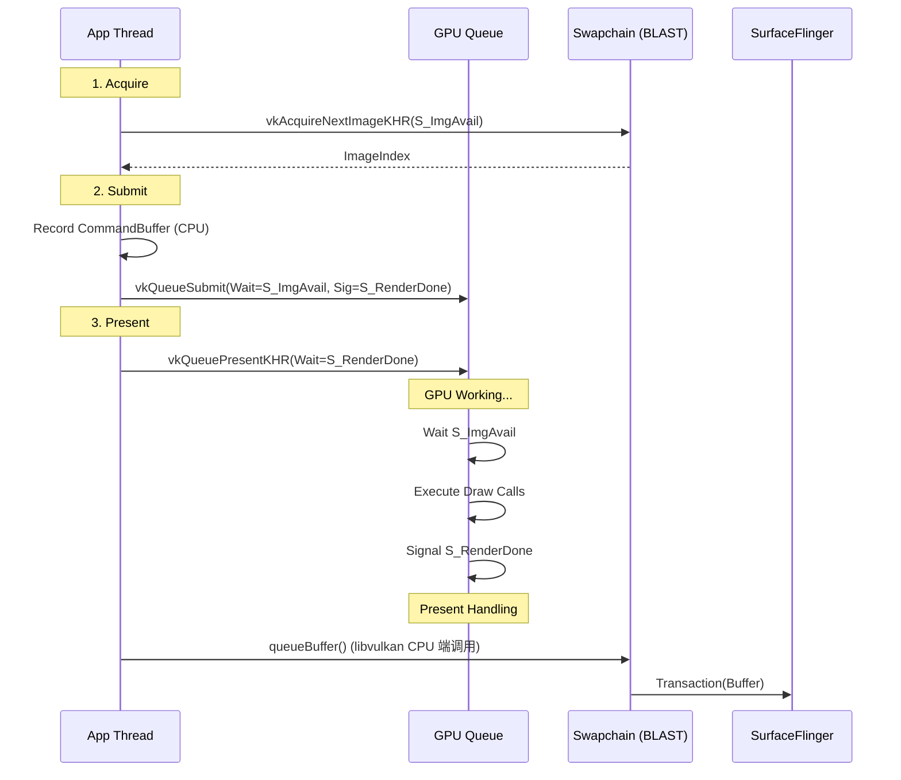
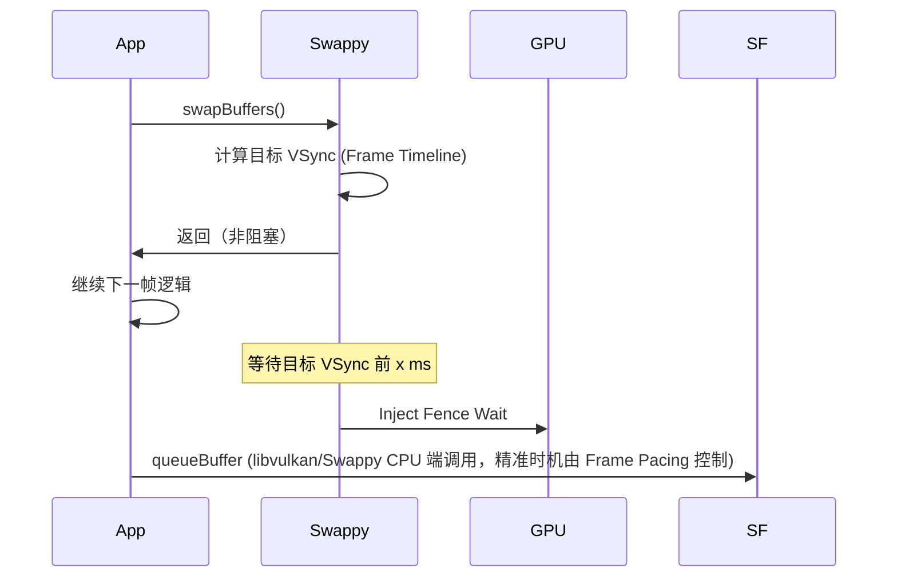

# 18.9 Vulkan 原生渲染管线

<!-- outline-start -->

**锚点（必须覆盖）：**
- [18.9.1 为什么选择 Vulkan](#为什么选择-vulkan) — 与 GLES 的关键区别
- [18.9.2 Android Vulkan Profile (AVP)](#android-vulkan-profile-avp) — 碎片化问题的标准化方案
- [18.9.3 渲染流程详解](#渲染流程详解) — Acquire → Submit → Present 的完整流程
- [18.9.4 Pipeline Barrier 与 Image Layout](#pipeline-barrier-与-image-layout) — 显式同步的关键
- [18.9.5 Presentation Mode](#presentation-mode) — Android native WSI 的支持边界
- [18.9.6 Swappy Frame Pacing](#swappy-frame-pacing) — Android 官方的帧节奏库
- [18.9.7 Trace 视角](#trace-视角) — Vulkan 调用路径的识别特征

**扩展（可选深入）：**
- Command Buffer 多线程并行录制
- Validation Layers 的使用与调试
- Vulkan 与 SurfaceControl 的集成

<!-- outline-end -->

Vulkan 是 Android 目前的主要底层图形 API，Android 15 起通过 AVP（Android Vulkan Profile）进一步统一了设备能力基线。[已验证: Android 15 Developer Preview 文档] 与 OpenGL ES 相比，Vulkan 的核心差异在于**“显式优于隐式”**——内存分配、同步原语、命令提交全部由 App 显式控制，驱动只负责执行已提交的命令，不再替应用猜测意图。换来的收益是更低的 CPU 开销、更少的驱动行为不确定性，以及更高的调试可控性。

关于图形 API 的演进历史，详见 [2.14 图形 API 演进](../../part1-fundamentals/ch02-rendering/14-graphics-api-evolution.md)。从实战角度看，Vulkan 渲染管线要讲清楚三件事：Acquire 到 Present 的完整流程、Presentation Mode 怎么选，以及 Trace 里怎么识别 Vulkan 调用路径。

## 为什么选择 Vulkan

### GLES 的隐式模型问题

GLES 驱动会做很多"聪明的猜测"——什么时候切换 Render Target、什么时候等待 GPU 完成、什么时候同步、内存什么时候释放。这些"猜测"让开发门槛降低，但代价是 **CPU 端 driver work 变重**——每次 GL 调用都可能触发驱动内部的同步逻辑。移动设备 GPU 驱动尤其如此，因为移动 GPU 的驱动通常比桌面端更激进地做隐式优化。

### Vulkan 的显式控制

Vulkan 要求 App 对一切负责：

| 维度 | GLES | Vulkan |
|:---|:---|:---|
| **内存管理** | 驱动自动分配/释放 | App 显式分配、绑定、释放 |
| **同步** | 隐式 barrier 由驱动插入 | App 显式指定 VkBarrier |
| **命令提交** | 驱动缓存命令 | App 自己管理 Command Buffer |
| **错误处理** | 依赖 GLES 错误码或驱动日志 | Validation Layer 严格检查 |
| **CPU 开销** | 高（驱动猜测多） | 低（显式路径短路） |
| **多线程** | 有限（Context 绑定线程） | 完全支持（Command Buffer 并行录制） |

官方文档强调，Vulkan 把内存、同步和命令提交流程交回给应用后，CPU 侧的 driver work 更可控。收益大小取决于引擎结构、驱动实现和 draw call 组织方式，适合用目标设备上的 AGI 或 Perfetto 实测，而不要把某个百分比当成通用结论。

### 代价

Vulkan 的代价是**开发复杂度**。应用需要自行管理：
- 内存分配和绑定（VkDeviceMemory）
- 同步原语（Fence、Semaphore、Barrier）
- 命令缓冲区的生命周期
- Image Layout 转换
- 渲染 Pass 的显式定义

如果这些做错了，轻则花屏、黑屏，重则设备挂起。因此 Google 推出了 Swappy、AVP 等辅助工具，用来降低 Vulkan 的正确使用门槛。

## Android Vulkan Profile (AVP)

Vulkan 在 Android 上面临的主要问题是碎片化：不同设备支持的 Extension 各不相同，App 必须在运行时逐个查询并处理 fallback。AVP（Android Vulkan Profile）是 Google 推出的标准化方案，目标是让 App 开发者只需要检查"设备是否支持某个 Profile"，而不需要逐一查询 Extension。

### 问题背景

| 问题 | 传统 Vulkan | AVP 解决方案 |
|:---|:---|:---|
| **特性碎片化** | 每个设备支持不同的 Extension | 定义标准 Profile（如 `VP_ANDROID_baseline_2022`） |
| **能力查询成本** | 运行时逐一查询数十个 Extension | 声明式 Profile 匹配，一次检查 |
| **开发复杂度** | 需要大量 fallback 代码 | 保证 Profile 内特性全支持 |

### Profile 演进口径

Android Vulkan Profile 的演进分成两类口径：

- `VP_ANDROID_baseline_2021`、`VP_ANDROID_baseline_2022`：描述当年 Android 设备上广泛可用的能力集合，适合当兼容性基线
- Android 15/16：Khronos Vulkan-Profiles 仓库公开的 JSON 文件名是 `VP_ANDROID_15_minimums.json`、`VP_ANDROID_16_minimums.json`，profile 名分别是 `VP_ANDROID_15_minimums`、`VP_ANDROID_16_minimums`。Android 文档或内部要求里可能使用 requirements target 的描述，但写工程配置和 profile 检查时以 JSON profile 名为准。
- 如果资料里提到 2024 roadmap 或 community profile，需要单独标注其身份是生态路线图，并与 Android 官方 requirements target 分开表述

常见 profile 的边界如下：

| Profile | Vulkan API version | 使用口径 |
|:---|:---|:---|
| `VP_ANDROID_baseline_2022` | Vulkan 1.1.x 兼容基线 | 用来判断广覆盖设备是否满足基本能力集合，适合作为运行时兼容性下限 |
| `VP_ANDROID_15_minimums` | Vulkan 1.3.273 | Android 15 / VRA15 面向新机 launch 与芯片续签的最低能力要求；requirements 属于要求描述，Khronos profile 文件名以 `minimums` 为准 |
| `VP_ANDROID_16_minimums` | Vulkan 1.3.276 | Android 16 代际最低能力要求，适合在明确瞄准 Android 16 新设备时使用 |

### 使用方式

工程上更稳的做法是分两步：

1. 先用 baseline profile 检查目标设备是否满足应用的兼容性下限
2. 如果产品明确瞄准 Android 15+ 新机，再额外检查对应的 `minimums` profile，确认能否依赖该代际要求的特性集合

这样可以把“广覆盖兼容基线”和“新设备强制要求”分开处理，不会把 `VP_ANDROID_baseline_2022` 与 Android 15/16 的 `minimums` profile 混成一个名字。

## 渲染流程详解

Vulkan 的渲染流程围绕三个核心对象展开：**Swapchain**（管理图像）、**Command Buffer**（存储绘制命令）、**Queue**（提交命令到 GPU）。与 GLES 的最大区别在于，这三个对象的创建、配置和同步全部由 App 显式管理。

### 第一阶段：Acquire（获取）

```c
VkSemaphore imageAcquiredSemaphore;
VkFence fence;

VkResult result = vkAcquireNextImageKHR(
    device, swapchain,
    timeout,  // UINT64_MAX = 无限等待
    imageAcquiredSemaphore,
    fence,
    &imageIndex
);
```

- App 向 Swapchain 请求一个可写的 Image Index
- 需要提供一个 `VkSemaphore`（ImageAvailable），当 Image 可用时 Signal
- **通常非阻塞**：在 Swapchain 未满时立即返回；满了才会等
- 在 Trace 中，`vkAcquireNextImageKHR` 耗时短说明 Buffer 充足，耗时长说明 Buffer 压力大

#### Vulkan swapchain 在 Android 上的底层映射

`VkSwapchainKHR` 在 Android 上**底层仍然基于 BufferQueue**，理解这套映射是排查"看似 CPU 很快、GPU 也不重"型卡顿的关键：

- `vkAcquireNextImageKHR` 内部调用 `ANativeWindow::dequeueBuffer` 拿到一个 buffer 和对应的 fence fd，随后将这个 fd 交给 GPU 驱动的 `AcquireImageANDROID` 钩子（`libvulkan` swapchain 内部实现，不是公开 API）。驱动负责在 buffer 可写时 signal App 传入的 `VkSemaphore` / `VkFence`。这个 fence fd 的来源是 BufferQueue 里上一个消费者释放此 buffer 时返回的 release fence——显示路径里通常来自 HWC 在 `presentDisplay` 后通过 `getReleaseFences()` 返回、再经 SF / BufferQueue 回传的 **release fence**（per-layer，回答"上一帧 buffer 什么时候能被 Producer 安全复用"）。
- Android 上 swapchain image 数量由 driver 和 surface capability 协商，一般落在 2-3（double / triple buffering）。BufferQueue 的 `maxDequeueBufferCount` 和 `VkSwapchainCreateInfoKHR::minImageCount` 共同决定实际可用 image 数，没有哪一个参数单独定死。
- App 通常选择 `VK_PRESENT_MODE_FIFO_KHR`（Vulkan 规范要求所有实现必须支持，对应 VSync 同步）。AOSP android-17.0.0_r1 的 native WSI 路径返回 FIFO、条件返回 MAILBOX；在 `flags::present_mode_fifo_latest_ready_ext2()` 打开时还会返回 `VK_PRESENT_MODE_FIFO_LATEST_READY_EXT`；shared presentation 支持时返回 `VK_PRESENT_MODE_SHARED_DEMAND_REFRESH_KHR` / `VK_PRESENT_MODE_SHARED_CONTINUOUS_REFRESH_KHR`。`IMMEDIATE` / `FIFO_RELAXED` 不应按 Android native Surface 的常规可用模式写。
- **如果在 `vkAcquireNextImageKHR` 上看到长时间等待**，通常是前面某个 image 的 release fence 还没回来（BufferQueue 消费端没跟上）——和 GLES 路径上 `eglSwapBuffers` 长 slice 的成因等价：内部在等空闲 buffer，并不是 GPU 绘制仍未完成。

[已验证: AOSP android-17.0.0_r1 `frameworks/native/vulkan/libvulkan/swapchain.cpp` `AcquireNextImageKHR` → `AcquireImageANDROID` 驱动钩子路径 + `frameworks/native/libs/gui/Surface.cpp` `dequeueBuffer`]

### 第二阶段：Record & Submit（录制与提交）

Command Buffer 的录制可以并行，但前提是 host 侧对象不被多个线程无锁共享。Vulkan 规范里很多对象标注为 externally synchronized；同一个 `VkCommandPool`、同一个 `VkCommandBuffer`、以及同一个 `VkQueue` 的提交访问都要由应用自己同步。常见做法是每个录制线程持有独立 `VkCommandPool`，worker 线程录制 secondary command buffer，提交线程把它们合入 primary command buffer 后统一提交。

```c
// 录制命令（可以在任意线程，不阻塞 GPU）
VkCommandBuffer cmdBuf = commandBuffers[imageIndex];
vkBeginCommandBuffer(cmdBuf, &beginInfo);
    vkCmdBeginRenderPass(cmdBuf, &renderPassBeginInfo, VK_SUBPASS_CONTENTS_INLINE);
    vkCmdBindPipeline(cmdBuf, VK_PIPELINE_BIND_POINT_GRAPHICS, pipeline);
    vkCmdDraw(cmdBuf, 3, 1, 0, 0);
    vkCmdEndRenderPass(cmdBuf);
vkEndCommandBuffer(cmdBuf);

// 提交到 GPU Queue
VkPipelineStageFlags waitStages = VK_PIPELINE_STAGE_COLOR_ATTACHMENT_OUTPUT_BIT;
VkSubmitInfo submitInfo = {
    .sType = VK_STRUCTURE_TYPE_SUBMIT_INFO,
    .waitSemaphoreCount = 1,
    .pWaitSemaphores = &imageAcquiredSemaphore,  // 等 Image 可用
    .pWaitDstStageMask = &waitStages,            // wait 数组非空时必须提供同长度 stage mask
    .commandBufferCount = 1,
    .pCommandBuffers = &cmdBuf,
    .signalSemaphoreCount = 1,
    .pSignalSemaphores = &renderFinishedSemaphore,  // 渲染完成后 Signal
};
vkQueueSubmit(graphicsQueue, 1, &submitInfo, fence);
```

**观察点**：
- Command Buffer 录制是纯 CPU 操作，不涉及 GPU
- **Dynamic Rendering（Vulkan 1.3 core feature）**：Dynamic Rendering 是 Vulkan 1.3 核心特性，但应用仍需在设备创建时查询 `VkPhysicalDeviceDynamicRenderingFeatures::dynamicRendering` feature bit 确认支持；VP_ANDROID_15_minimums 与 VP_ANDROID_16_minimums 均未显式声明该 feature。使用 `vkCmdBeginRendering` / `vkCmdEndRendering` 替代传统 `vkCmdBeginRenderPass` / `vkCmdEndRenderPass`，无需预先创建 `VkRenderPass` 和 `VkFramebuffer` 对象。上面代码示例保留传统 RenderPass 写法以保证向后兼容；确认设备支持后可直接采用 Dynamic Rendering，减少初始化复杂度。[已验证: Vulkan 1.3 spec, Khronos VP_ANDROID_15_minimums.json, VP_ANDROID_16_minimums.json]
- 多线程录制不等于共享同一个 command pool 并发录制；每个录制线程应使用自己的 `VkCommandPool` 和 command buffers
- 同一个 `VkCommandBuffer` 在 begin / record / end / reset 过程中不能被多个线程同时修改
- secondary command buffer 适合把 draw call 生成拆到 worker 线程；primary command buffer 负责执行它们并进入提交阶段
- `vkQueueSubmit` 针对同一 `VkQueue` 也需要外部同步；多个线程提交同一 queue 时要加锁或集中到提交线程
- `waitSemaphore` 确保 Image 可写后才开始绘制（GPU 端等待）
- `pWaitDstStageMask` 指定等待发生在哪个 pipeline stage。`waitSemaphoreCount > 0` 时必须提供同长度数组，否则会触发 Vulkan validation error
- `signalSemaphore` 确保渲染完成后才允许 Present

### 第三阶段：Present（展示）

```c
VkPresentInfoKHR presentInfo = {
    .waitSemaphoreCount = 1,
    .pWaitSemaphores = &renderFinishedSemaphore,  // 等渲染完成
    .swapchainCount = 1,
    .pSwapchains = &swapchain,
    .pImageIndices = &imageIndex,
};
vkQueuePresentKHR(presentQueue, &presentInfo);
```

- **Wait** `renderFinishedSemaphore`：确保 GPU 完成渲染
- **Android 集成**：Vulkan Present 最终落到 Android 的 Surface / Buffer / Transaction 体系，通常通过 BLAST / Transaction 模型进入 SurfaceFlinger。[已验证: Android Vulkan Presentation 文档]

### 完整时序图



注意信号量（Semaphore）的流转：`S_ImgAvail` 在 Swapchain 端 Signal、在 GPU 端 Wait；`S_RenderDone` 在 GPU 端 Signal、在 Present 端 Wait。CPU 只负责提交指令和配置依赖关系，同步由 GPU 硬件执行。

## Pipeline Barrier 与 Image Layout

Vulkan 的显式同步中，Pipeline Barrier 和 Image Layout 转换是最容易出错的地方，但也是理解"Vulkan 为什么快"的关键。

### Image Layout Transition

Vulkan 的 Image 可以处于不同的 Layout，每种 Layout 对应不同的 GPU 访问模式：

- `UNDEFINED`：初始状态，不能直接使用
- `COLOR_ATTACHMENT_OPTIMAL`：作为 Render Target 使用
- `PRESENT_SRC_KHR`：准备提交给 Present Engine
- `SHADER_READ_ONLY_OPTIMAL`：作为纹理采样

在渲染流程中，典型的 Layout 转换链是：

```
UNDEFINED → COLOR_ATTACHMENT_OPTIMAL → PRESENT_SRC_KHR
```

如果忘记做 `PRESENT_SRC_KHR` 转换就 Present，结果可能是花屏、黑屏或设备挂起。

### Pipeline Barrier

Pipeline Barrier 显式地告诉 GPU："在这之前的操作必须完成，之后的操作才能开始"。这是 Vulkan 替代 GLES 隐式同步的核心机制：

```c
VkImageMemoryBarrier barrier = {
    .sType = VK_STRUCTURE_TYPE_IMAGE_MEMORY_BARRIER,
    .srcAccessMask = VK_ACCESS_COLOR_ATTACHMENT_WRITE_BIT,
    .dstAccessMask = 0,
    .oldLayout = VK_IMAGE_LAYOUT_COLOR_ATTACHMENT_OPTIMAL,
    .newLayout = VK_IMAGE_LAYOUT_PRESENT_SRC_KHR,
    .image = swapchainImages[imageIndex],
    .subresourceRange = { VK_IMAGE_ASPECT_COLOR_BIT, 0, 1, 0, 1 },
};

vkCmdPipelineBarrier(
    cmdBuf,
    VK_PIPELINE_STAGE_COLOR_ATTACHMENT_OUTPUT_BIT,  // src stage
    VK_PIPELINE_STAGE_BOTTOM_OF_PIPE_BIT,            // dst stage
    0, 1, NULL, 0, NULL, 1, &barrier
);
```

这里不要把 `VK_ACCESS_MEMORY_READ_BIT` 配给 `VK_PIPELINE_STAGE_BOTTOM_OF_PIPE_BIT`。`BOTTOM_OF_PIPE` 不执行内存读；这段 barrier 只负责把颜色附件写入收束到 layout transition。Present 侧的等待由前文 `VkPresentInfoKHR.pWaitSemaphores = &renderFinishedSemaphore` 承担。使用 synchronization2 时，可以写成 `dstStageMask = VK_PIPELINE_STAGE_2_NONE`、`dstAccessMask = 0`。

## Presentation Mode

Vulkan 规范定义多种 Presentation Mode，但 Android native WSI 对 `ANativeWindow` surface 实际开放的 mode 更少。本节按 Android native WSI 的实际返回集合理解这些 mode。

| Mode | 行为 | Android native WSI 边界 | 适用判断 |
|:---|:---|:---|:---|
| **FIFO** | 严格 VSync，帧队列先进先出 | 必选 / 最常见 | 稳定帧节奏、省电 |
| **MAILBOX** | 新帧覆盖旧帧，下一个 VSync 展示最新 | 条件支持，取决于 BufferQueue 可用 buffer 数和实现 | 输入敏感场景，必须实测 |
| **FIFO_LATEST_READY_EXT** | FIFO 队列中选择最近已 ready 的帧，减少旧帧积压 | android-17.0.0_r1 中由 `present_mode_fifo_latest_ready_ext2` flag 控制返回 | 只在枚举命中并完成目标机型实测后使用 |
| **FIFO_RELAXED** | 若帧迟到则立即展示 | AOSP native WSI 不作为 Android Surface 常规返回模式 | 不应作为 Android native 目标模式 |
| **IMMEDIATE** | 无 VSync，立即 Present | AOSP native WSI 不作为 Android Surface 常规返回模式 | 不应作为 Android native 目标模式 |

### 检测支持的 Mode

```c
uint32_t count;
vkGetPhysicalDeviceSurfacePresentModesKHR(physicalDevice, surface, &count, NULL);
VkPresentModeKHR* modes = malloc(count * sizeof(VkPresentModeKHR));
vkGetPhysicalDeviceSurfacePresentModesKHR(physicalDevice, surface, &count, modes);
```

### Android 注意事项

- **FIFO 是 Android native WSI 基线**：Android `libvulkan` 对普通 surface 至少返回 FIFO；应用不要把 `IMMEDIATE` 当成 Android Surface 的低延迟通用选项
- **MAILBOX 必须枚举确认**：AOSP 在 `min_undequeued_buffers + 1 < max_buffer_count` 时返回 MAILBOX，并在创建 swapchain 时把 MAILBOX 映射为 `swap_interval = 0`；是否改善延迟还要结合 Trace 中的帧节奏表现核对
- **FIFO_LATEST_READY_EXT 是 Android 17 条件能力**：android-17.0.0_r1 在 `present_mode_fifo_latest_ready_ext2` flag 打开时返回该 mode；应用必须先枚举命中，再判断目标 ROM 是否实际启用
- **shared presentation 是独立分支**：设备报告 `VkPhysicalDevicePresentationPropertiesANDROID.sharedImage` 时，Android 还可能返回 `VK_PRESENT_MODE_SHARED_DEMAND_REFRESH_KHR` / `VK_PRESENT_MODE_SHARED_CONTINUOUS_REFRESH_KHR`
- **VRR（可变刷新率）**：需要搭配 Display 的 VRR 能力

## Swappy Frame Pacing

[Android Game SDK - Swappy](https://developer.android.com/games/sdk/frame-pacing) 是 Google 官方的帧节奏库，解决了 Vulkan 在移动设备上的三大问题。

### 解决的问题

1. **帧节奏不稳定**：不同厂商的 Vsync 实现差异巨大，直接使用 `vkQueuePresentKHR` 可能导致帧间隔不均匀
2. **Input-to-Display 延迟**：原生 Vulkan 无法预测帧着陆时间，App 不知道该在什么时候提交才能正好赶上目标 VSync
3. **高刷适配**：90Hz/120Hz/144Hz 屏幕需要动态调整 Swap Interval，原生 API 不提供方便的抽象

### 核心原理

Swappy 的核心思想是**精准控制 Present 时机**。它结合 Choreographer 的 VSync 时间戳、presentation timestamp 和 sync fence 来计算最佳提交时机：



### 关键 API

这段示例保留初始化、设置 interval、替换 present 三步，主要看返回值处理和每个 swapchain 的初始化顺序。

```c
uint64_t refreshDuration = 0;
bool initialized = SwappyVk_initAndGetRefreshCycleDuration(
    env,
    jactivity,
    physicalDevice,
    device,
    swapchain,
    &refreshDuration
);
if (!initialized) {
    // 省略：回退到应用自己的 frame pacing 策略，或停止接入 Swappy。
}

SwappyVk_setSwapIntervalNS(device, swapchain, refreshDuration);

VkResult presentResult = SwappyVk_queuePresent(queue, &presentInfo);
if (presentResult != VK_SUCCESS) {
    // 省略：按 VK_ERROR_OUT_OF_DATE_KHR / VK_SUBOPTIMAL_KHR 等结果重建 swapchain。
}

SwappyVk_setAutoSwapInterval(true);
```

`SwappyVk_initAndGetRefreshCycleDuration()` 的公开头文件签名包含 `JNIEnv* env` 和 `jobject jactivity`，返回 `bool`，刷新周期通过 `uint64_t* pRefreshDuration` 写回。`SwappyVk_queuePresent()` 返回 `VkResult`，出错时仍要按普通 Vulkan swapchain 错误处理。每个 swapchain 都要先初始化，再设置该 swapchain 的 swap interval。

### Trace 特征

Perfetto 里的默认诊断入口应先看三类证据：

- **`vkQueuePresentKHR` / `vkAcquireNextImageKHR`**：确认应用走的是 Vulkan swapchain 路径，并观察 acquire/present 是否被 buffer 压力拉长
- **FrameTimeline**：Android 12+ 的 Expected / Actual Timeline 用来判断帧是否按目标节奏落屏
- **graphics tracing / AGI / app-side ATrace**：当默认系统轨道不够细时，再补图形 tracing，或在 Swappy 调用附近写 trace marker

只有在应用或库主动注入 ATrace / Perfetto marker 时，`Swappy_*` 或独立的 Swappy track 才会稳定出现。看不到这些标记，不等于应用没有接入 Swappy。

## Trace 视角

### 识别 Vulkan 调用路径

1. **`vkAcquireNextImageKHR`**：Vulkan 特有的 Swapchain 获取调用
2. **`vkQueueSubmit`**：命令提交到 GPU 队列
3. **`vkQueuePresentKHR`**：展示请求
4. **`vkCmdDraw*`**：具体的 GPU 绘制命令（替代 GLES 的 `glDraw*`）
5. **`vkCmdPipelineBarrier`**：显式同步 barrier

### 关键 Slice

| Slice | 含义 | 关注点 |
|:---|:---|:---|
| `vkAcquireNextImageKHR` | 从 Swapchain 获取可用 Image | 耗时长 → Buffer 压力 |
| `vkQueueSubmit` | 提交 Command Buffer 到 GPU | 正常情况 CPU 端不耗时 |
| `vkQueuePresentKHR` | 请求 Present | 配合 Swappy 控制时机 |
| `vkCmdPipelineBarrier` | 显式同步 | 频繁出现可能说明过度同步 |
| `Swappy_*` | 应用或库主动写出的帧节奏标记 | 只在启用 ATrace / Perfetto marker 时可见 |

### 与 GLES 管线的 Trace 差异

| 特征 | GLES 管线 | Vulkan 管线 |
|:---|:---|:---|
| 帧提交标记 | `eglSwapBuffers` | `vkQueuePresentKHR` |
| Buffer 获取 | `dequeueBuffer`（隐式） | `vkAcquireNextImageKHR`（显式） |
| GPU 命令 | `glDraw*` | `vkCmdDraw*` |
| 同步 | Fence（隐式） | Semaphore + Barrier（显式） |
| ANGLE 路径 | 不适用 | `vkQueueSubmit`（ANGLE 翻译的 GLES） |

### 调试工具

- **RenderDoc**：Vulkan 抓帧工具，用于查看具体 DrawCall 和资源。支持 Vulkan 的完整抓帧分析
- **AGI（Android GPU Inspector）**：Google 官方图形调试工具（GAPID 的继承者），对 Vulkan 支持最好
- **Validation Layers**：开发阶段必须开启。Vulkan 出错通常表现为崩溃、黑屏或 validation message，Validation Layer 是开发阶段最重要的诊断来源之一

```bash
# 启用 Vulkan Validation Layer（debug 构建）
adb shell setprop debug.vulkan.enable 1
adb shell setprop debug.vulkan.layers VK_LAYER_KHRONOS_validation
```


## 18.9.8 Android 17 演进：Skia Graphite 后端与 RenderEngineThreaded

> **源码锚点声明**：本节已按 AOSP `android-17.0.0_r1` 复核。`RenderEngine.h`、`GraphiteVkRenderEngine.cpp`、`RenderEngineThreaded.cpp` 和 `Android.bp` 均能在 `refs/tags/android-17.0.0_r1` 下验证；正文不再把 main/master 内容作为 Android 17 结论。

### Skia Backend 二选一：Ganesh / Graphite

`frameworks/native/libs/renderengine/include/renderengine/RenderEngine.h` 的 `SkiaBackend` 枚举在 android-17.0.0_r1 中包含 `Ganesh` 与 `Graphite`：

```cpp
enum class SkiaBackend {
    Ganesh,
    Graphite,  // 新增
};
```

`RenderEngineCreationArgs::Builder` 的 `skiaBackend` 字段默认 `RenderEngine::SkiaBackend::Ganesh`，OEM 可通过 `debug.renderengine.graphite_preview_optin` / `debug.renderengine.graphite_preview2_optin` system property 和相关 flags 灰度切换。`frameworks/native/libs/renderengine/Android.bp` 的 `librenderengine_skia_sources` 已纳入 `skia/GraphiteVkRenderEngine.cpp`，说明 Graphite 是 Android 17 中已进入源码树的可选后端，不等于所有设备默认启用。

新增文件清单（Copyright 2024）：
- `libs/renderengine/skia/GraphiteVkRenderEngine.{h,cpp}`
- `libs/renderengine/skia/compat/GraphiteBackendTexture.{h,cpp}`
- `libs/renderengine/skia/compat/GraphiteGpuContext.{h,cpp}`

### Graphite 提交模型：Recording + BackendSemaphore

`GraphiteVkRenderEngine::flushAndSubmit()` 用 `graphite::Recorder::snap()` + `graphite::Context::insertRecording()` + `graphite::Context::submit(SyncToCpu::kNo)` 替代 Ganesh 的 `GrDirectContext` 即时命令路径：

```cpp
std::unique_ptr<graphite::Recording> recording = context->graphiteRecorder()->snap();
graphite::InsertRecordingInfo insertInfo;
insertInfo.fRecording = recording.get();
VkSemaphore vkSignalSemaphore = vulkanInterface.createExportableSemaphore();
auto backendSignalSemaphore = graphite::BackendSemaphores::MakeVulkan(vkSignalSemaphore);

insertInfo.fNumWaitSemaphores = mStagedWaitSemaphores.size();
insertInfo.fWaitSemaphores = mStagedWaitSemaphores.data();
insertInfo.fNumSignalSemaphores = 1;
insertInfo.fSignalSemaphores = &backendSignalSemaphore;
insertInfo.fFinishedProc = unref_semaphore;
insertInfo.fFinishedContext = destroySemaphoreInfo;

context->graphiteContext()->insertRecording(insertInfo);
context->graphiteContext()->submit(graphite::SyncToCpu::kNo);
base::unique_fd drawFenceFd = vulkanInterface.exportSemaphoreSyncFd(vkSignalSemaphore);
return drawFenceFd;
```

**与 18.9.3 节 App 侧 Vulkan 流程的对比**：

| 维度 | App 侧 Vulkan（18.9.3） | SurfaceFlinger Graphite（18.9.8） |
|:---|:---|:---|
| 命令录制 | `vkBeginCommandBuffer` / `vkCmdDraw*` | `graphite::Recorder::snap()` |
| 提交 | `vkQueueSubmit`（App 显式） | `graphite::Context::submit(SyncToCpu::kNo)` |
| 同步 | `VkSemaphore` + `VkFence`（App 拥有） | `graphite::BackendSemaphore`（Skia 内部） + `DestroySemaphoreInfo` 引用计数 |
| GPU 完成通知 | `vkWaitForFences` 或 `vkQueueWaitIdle` | `fFinishedProc` 回调（GPU 完成后 Skia 触发） |
| 输出 fence | `VkFence` → `sync_file` | `exportSemaphoreSyncFd` → `sync_file` |

App 侧继续使用原生 `libvulkan` + Swappy。Android 17 的 SurfaceFlinger RenderEngine 已包含可选 Skia Graphite 后端；是否启用由 flags、system property 和 OEM 配置决定。两条路径相对独立，但都依赖 `VkSemaphore ↔ sync_file` 双向转换（`importSemaphoreFromSyncFd` / `exportSemaphoreSyncFd`）。

### RenderEngineThreaded：SCHED_FIFO:2 实时线程

`frameworks/native/libs/renderengine/threaded/RenderEngineThreaded.cpp` 把渲染线程属性固定为：

- 调度策略 `SCHED_FIFO`，优先级 2
- Cgroup task profile `SFRenderEnginePolicy`（与 `VSyncThread` 同组）
- 线程名 `RenderEngine`（perfetto/systrace 中可识别）
- `primeCache` 期间临时切回 `SCHED_OTHER` 避免长任务占用实时配额

所有 RenderEngine 接口（`drawLayers`、`mapExternalTextureBuffer`、`cleanupPostRender` 等）通过 `std::function` 队列 + `std::condition_variable` 异步入队，调用方立即拿到 `std::future` 返回。对于 App 侧 Swappy 来说，这意味着 `VkQueuePresentKHR` 返回后 GPU 实际完成时刻由 `drawFenceFd` 表达，不必再依赖 `vkQueueWaitIdle` 这类粗粒度同步。

### VulkanInterface 进程级单例

`SkiaVkRenderEngine.cpp` 把 `sVulkanInterface` / `sProtectedContentVulkanInterface` 声明为文件作用域 static，整个 SurfaceFlinger 进程共享一对 VkDevice（普通 + protected）。`getContextPriority()` 返回 `EGL_CONTEXT_PRIORITY_REALTIME_NV`（0x3357）由 GPU 驱动决定是否支持。`LOG_ALWAYS_FATAL_IF(!sVulkanInterface.takeOwnership())` 显式禁止多 RenderEngine 实例并发。

### 对 App 侧 Vulkan 性能的实际影响

1. **启用 Graphite 后，SurfaceFlinger 自身的 GPU 初始化可能变重**（Graphite 上下文 + 额外 Skia shader 编译），可观察 `RenderEngine` 线程启动时间变化
2. **RenderEngineThreaded 会改变 SurfaceFlinger 合成任务的调度形态**（SCHED_FIFO 调度 + 录制/提交解耦），实际 fence 延迟是否下降需要用 FrameTimeline 和 fence trace 验证
3. **Vulkan 验证层路径未变**，App 仍可走 `debug.vulkan.enable=1` + `debug.vulkan.layers=VK_LAYER_KHRONOS_validation` 启用 validation
4. **Swappy 帧节奏库（18.9.6）行为不变**，仍由 App 主动调用 `Swappy_swap()` 触发 present

### Trace 视角的新增识别点

| Slice / Track | 含义 |
|:---|:---|
| `graphite::Context::insertRecording` | Graphite 后端命令插入 |
| `graphite::Context::submit` | 提交到 Graphite context |
| `REThreaded::drawLayers` | RenderEngineThreaded 异步 drawLayers 任务 |
| `REThreaded::primeCache` | 着色器预热任务（SCHED_OTHER） |
| `unref_semaphore` 回调 | GPU 完成后 Skia 触发的清理回调 |


---

> **交叉引用**：
> - OpenGL ES 管线（对比参考）详见 [18.8 OpenGL ES 渲染管线](08-opengl-es.md)
> - SurfaceControl API 与 FrameTimeline 详见 [18.10 SurfaceControl API 深入](10-surface-control-api.md)
> - 图形 API 演进历史详见 [2.14 图形 API 演进](../../part1-fundamentals/ch02-rendering/14-graphics-api-evolution.md)
> - BufferQueue 与 Transaction 机制详见 [2.13 图形缓冲区管理](../../part1-fundamentals/ch02-rendering/13-buffer-queue.md)


## 延伸阅读

### Android 17 GPU 渲染管线：Skia Graphite 后端与 Vulkan 性能优化

AOSP android-17.0.0_r1 的 SurfaceFlinger RenderEngine 层已包含 Skia Graphite 可选后端和 GraphiteVkRenderEngine 实现。Graphite 用 Recording + BackendSemaphore 的录制-提交分离模型替代 Ganesh 的即时命令模式，配合 RenderEngineThreaded 异步任务队列（SCHED_FIFO:2）构成录制/提交线程分离的新执行模型。默认是否启用取决于 flags、system property 和 OEM 配置；详见 DeepResearch 调研结果。
