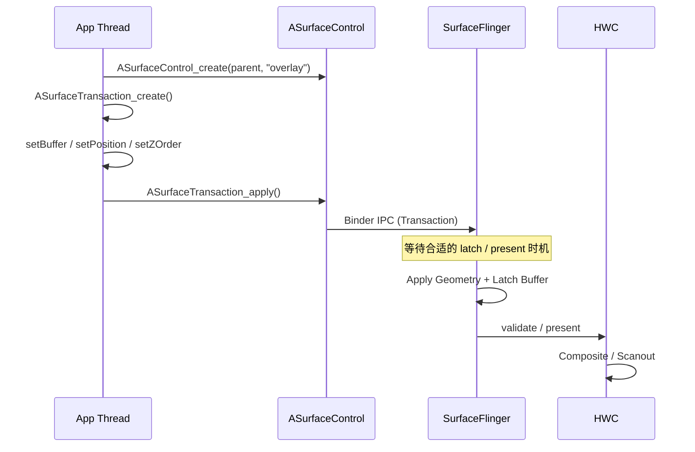

-
# 18.10 SurfaceControl API 深入

<!-- outline-start -->

**锚点（必须覆盖）：**
- [18.10.1 核心概念](#核心概念) — ASurfaceControl 与 ASurfaceTransaction 的定位
- [18.10.2 与 BLAST 的关系](#与-blast-的关系) — 共享事务模型但不等价
- [18.10.3 典型使用流程](#典型使用流程) — 创建 → 配置 → 提交的完整路径
- [18.10.4 关键 API 详解](#关键-api-详解) — Buffer、层级、Reparent
- [18.10.5 Layer 层级管理](#layer-层级管理) — 动态图层树的组织
- [18.10.6 FrameTimeline API](#frametimeline-api) — 精准控制帧着陆时间
- [18.10.7 Fence 处理与生命周期](#fence-处理与生命周期) — 最容易踩的坑
- [18.10.8 实战场景](#实战场景) — WebView OOP、画中画、自绘引擎
- [18.10.9 Trace 视角](#trace-视角) — SurfaceControl 路径的识别与瓶颈分析

**扩展（可选深入）：**
- SurfaceControl 与 WebView Out-of-process Rasterization
- Flutter Platform View 的 SurfaceControl 集成
- 跨进程 Layer 共享

<!-- outline-end -->

`ASurfaceControl`（Android 10/Q 引入，API 29）是 Android NDK 中面向 SurfaceFlinger 的原生图层控制接口。它允许 App 在 View 树之外创建或管理子 Layer，并把 Buffer、几何属性、层级关系等变更作为一次事务提交给系统合成器。 对浏览器、视频容器、自绘引擎这类需要自己组织合成结构的场景，它提供了比普通 View / Surface 更细的控制粒度。（具体性能收益取决于目标设备的 HWC 能力与合成策略，需按设备实测）

## 核心概念

### ASurfaceControl

`ASurfaceControl` 代表一个可被事务修改的 SurfaceFlinger Layer 句柄。 从 SurfaceFlinger 的组织方式看，常见表现有三类：- **Buffer Layer**：显示实际像素内容，通过 `setBuffer` 绑定 `AHardwareBuffer`
- **Color Layer**：显示纯色内容，通过 `setColor` 指定颜色
- **Container Layer**：只承担父子关系和 Z 轴组织，不直接携带像素内容

和 Java 层的 `SurfaceControl` 相比，NDK 侧直接暴露了创建子 Layer、reparent、buffer 提交等能力。App 不必依赖完整的 View 树，就可以把多个图层作为一棵独立子树交给 SurfaceFlinger 管理。

### ASurfaceTransaction

`ASurfaceTransaction` 代表一组原子提交的 Layer 属性更新。应用可以一次性修改多个 `ASurfaceControl` 的 Buffer、位置、裁剪区域、Z-Order、可见性，再通过 `apply()` 把这组更新作为统一快照送给系统。

原子提交主要解决三类问题：- Buffer 更新和几何属性可以在同一个提交边界里生效，减少中间态被用户看到的机会
- 多个 Layer 的变化可以作为一个快照出现，不必担心前一层已经移动、后一层还没跟上的错位
- Buffer、位置、透明度这类变化可以和 BLAST 使用的 Transaction 模型保持一致，便于分析 App 侧和 SurfaceFlinger 侧的对应关系

## 与 BLAST 的关系

NDK 的 SurfaceControl API 和 BLAST 共享同一套 Transaction + Buffer 协同更新模型，但两者不是同一个概念。

- **BLAST**：围绕 Buffer 提交、几何属性变更和提交边界同步的一套底层机制，常见实现形态是 BLASTBufferQueue
- **ASurfaceControl / ASurfaceTransaction**：应用可以直接调用的 NDK 接口，用来创建 Layer、设置属性、提交事务

当 App 用 `ASurfaceTransaction` 同时提交 buffer 和几何属性时，SurfaceFlinger 会在同一个事务边界里处理它们。是否真的落到 BLASTBufferQueue、是否还包着 legacy 兼容层，取决于组件类型和 Android 版本。（内部类名与调用路径因版本而异，需按目标版本源码确认）

### Sync 语义

Transaction 只是在提交点声明“这组属性和这个 buffer 应一起生效”。latch / present 的生效时机仍由 acquire fence、VSync、SurfaceFlinger 调度和 HWC 合成窗口共同决定。 `apply()` 返回，只能说明事务已经送出，不能说明这一帧已经上屏。

## 典型使用流程

### 步骤 1：创建 SurfaceControl

NDK 侧的根节点通常来自 Java 层已经创建好的 `SurfaceView` / `Surface`。常见桥接方式有两种：Java 层把 `Surface` 传进 JNI，native 侧用 `ANativeWindow_fromSurface()` 拿到 `ANativeWindow*`，再调用 `ASurfaceControl_createFromWindow()` 把这块 native window 变成 Layer 树的挂接点。

Android 14（API 34）以后，如果 Java 层已经持有 `android.view.SurfaceControl`，native 侧可以包含 `android/surface_control_jni.h`，调用 `ASurfaceControl_fromJava(JNIEnv*, jobject)` 取得 `ASurfaceControl*`；调用者取得所有权，后续必须配对 `ASurfaceControl_release()`。API 29-33 或只持有 `Surface` 的场景，仍走 `ANativeWindow_fromSurface()` → `ASurfaceControl_createFromWindow()` 路径；纯 `surface_control.h` 本身不提供这个 JNI 桥接函数。

```java
Surface surface = surfaceView.getHolder().getSurface();
nativeAttach(surface);
```

```c
void nativeAttach(JNIEnv* env, jobject surface) {
 ANativeWindow* window = ANativeWindow_fromSurface(env, surface);
 ASurfaceControl* root = ASurfaceControl_createFromWindow(window, "RootLayer");
 //... 基于 root 创建子 Layer
 ANativeWindow_release(window);
}
```

如果当前进程已经持有父 `ASurfaceControl`，也可以直接在这棵树下面创建子 Layer：```c
ASurfaceControl* child = ASurfaceControl_create(parent, "MyOverlay");
```

创建出来的 child layer 默认还没有可见内容；后续还要通过 transaction 设置 buffer、位置、Z 序，再 `apply()` 提交。`ANativeWindow_fromSurface()` 会拿一个额外引用，使用结束后要配对 `ANativeWindow_release()`。

### 步骤 2：配置 Transaction

创建并配置一个事务，设置各种属性。`ASurfaceTransaction_setBuffer()`、`ASurfaceTransaction_setZOrder()`、`ASurfaceTransaction_setVisibility()`、`ASurfaceTransaction_setBufferAlpha()` 从 API 29 可用；`ASurfaceTransaction_setPosition()`、`ASurfaceTransaction_setCrop()`、`ASurfaceTransaction_setScale()` 从 API 31 可用。```c
ASurfaceTransaction* transaction = ASurfaceTransaction_create();

// API 29: 绑定待显示的 buffer
ASurfaceTransaction_setBuffer(transaction, child, hardwareBuffer, fence_fd);

// API 31: 用裁剪区域 + 缩放表达目标矩形
ARect crop = {0, 0, bufferWidth, bufferHeight};
ASurfaceTransaction_setCrop(transaction, child, &crop);
ASurfaceTransaction_setPosition(transaction, child, x, y);
ASurfaceTransaction_setScale(transaction, child,
 (float)targetWidth / bufferWidth,
 (float)targetHeight / bufferHeight);

// API 29: 层级、可见性、buffer alpha
ASurfaceTransaction_setZOrder(transaction, child, 10);
ASurfaceTransaction_setVisibility(transaction, child, ASURFACE_TRANSACTION_VISIBILITY_SHOW);
ASurfaceTransaction_setBufferAlpha(transaction, child, 0.8f);
```

NDK 公开头文件里没有 `ASurfaceTransaction_setSize()` 和 `ASurfaceTransaction_setAlpha()`。目标区域的控制要拆成 crop、position、scale；透明度要落在 `ASurfaceTransaction_setBufferAlpha()`。如果业务已经在 Java 层持有 `SurfaceControl.Transaction`，绝对目标矩形也可以交给 Java 封装层处理。

### 步骤 3：提交 Transaction

```c
ASurfaceTransaction_apply(transaction);
```

这一步会把打包好的事务发送给 SurfaceFlinger 侧的 composer client。提交是异步的，`apply()` 不等待 SurfaceFlinger 完成处理就返回。

### 完整时序



## 关键 API 详解

### Buffer Management

```c
ASurfaceTransaction_setBuffer(
 transaction,
 sc, // ASurfaceControl*
 hardwareBuffer, // AHardwareBuffer*
 fence_fd // acquire fence
);
```

`setBuffer` / `setBufferWithRelease` 把 `AHardwareBuffer` 和 acquire fence 绑定到某个 Layer 上。 acquire fence 表示“生产者对这个 buffer 的写入何时完成”；SurfaceFlinger 只有在 fence signal 后才会读取它。

- **`AHardwareBuffer` 来源与 usage 约束**：可以来自 `AHardwareBuffer_allocate()`、Vulkan Image 导出、MediaCodec 输出 buffer，或者其他本地图形组件。传给 `setBuffer` 的 buffer 至少需要包含 `AHARDWAREBUFFER_USAGE_GPU_SAMPLED_IMAGE` usage flag——SurfaceFlinger 用 GPU 采样 buffer 内容时依赖这个标记。 如果生产端还需要 CPU 写入（调试预览）、Vulkan 渲染或 MediaCodec 编码，按生产端叠加对应 usage
- **release callback 的作用**：`ASurfaceTransaction_setBufferWithRelease()` 从 API 36 可用。它会在 buffer 可复用时触发 `ASurfaceTransaction_OnBufferRelease` 回调，回调给出的 release fence fd 由调用方负责等待并关闭；这条路径适合直接接 buffer pool 回收逻辑。
- **Android 10-15 的处理方式**：API 29 起已经可以在 `ASurfaceTransaction_setOnComplete()` 回调里，通过 `ASurfaceTransactionStats_getPreviousReleaseFenceFd(stats, sc)` 取到“上一块 buffer 何时释放”的 per-layer release fence。`OnComplete` 只是回调边界，是否能复用上一块 buffer 仍要看这个 fd；若返回值大于等于 0，需要等待 signal 并关闭，返回 `-1` 才表示上一块 buffer 已可直接复用。
- **不要把 `apply()` 当成释放信号**：只调用 `setBuffer` 时，`apply()` 返回不能代表 buffer 已经安全可写。

### Hierarchy Management

```c
// 动态改变图层树结构
ASurfaceTransaction_reparent(transaction, sc, newParent);
```

这个 API 允许应用在运行时重组 Layer 树。常见用法有三类：1. **画中画动画**：把视频 Layer 从 Activity 的 SurfaceView 移到系统管理的 PiP 容器
2. **多窗口切换**：把同一个内容 Layer 挂到新的父节点下面，沿用原有 buffer 提交节奏
3. **浏览器 / 自绘引擎**：把独立合成得到的内容树接到宿主窗口下面，而是塞回 View 树统一重绘

#### 单进程内的层级操作

`reparent` 默认在当前进程持有的 `ASurfaceControl` 句柄范围内完成。同进程内把子 Layer 从一个父节点移到另一个父节点，不需要任何额外序列化。#### 跨进程 Layer 共享

跨进程共享 `SurfaceControl` 时，公开入口分成 Java Parcelable 和 API 34 JNI bridge 两层。`android.view.SurfaceControl` 自 API 29 起实现 Parcelable，`writeToParcel()` 把 SurfaceFlinger 侧的 layer handle / client binder 写入 `Parcel`，目标进程 `readFromParcel()` 后得到新的 Java `SurfaceControl` 本地引用。Framework native 内部对应 `frameworks/native/libs/gui/include/gui/SurfaceControl.h` 的 `SurfaceControl::writeToParcel()` / `SurfaceControl::readFromParcel()`。

公开 NDK C API 侧没有 `ASurfaceControl_writeToParcel()` / `ASurfaceControl_readFromParcel()` 这类函数（AOSP android-17.0.0_r1 的 `include/android/surface_control.h` 未暴露）。API 34 起，native 代码可以在目标进程拿到 Java `SurfaceControl` 后，包含 `android/surface_control_jni.h` 并调用 `ASurfaceControl_fromJava(JNIEnv*, jobject)` 转成 `ASurfaceControl*`；调用方取得所有权，用完后必须 `ASurfaceControl_release()`。因此完整路径是：Java / Binder 负责跨进程序列化，NDK 在本进程继续提交 Transaction；不能把 `ASurfaceControl*` 当作可直接写入 Binder 的裸指针。

普通应用跨进程操作 Layer 树时，通常走以下几条路径之一：1. **系统托管**：WindowManager / Shell transition 负责跨进程 Layer 树的调整（如画中画、分屏），应用只需提交内容 buffer
2. **Java Parceling + NDK bridge**：持有 `android.view.SurfaceControl` 的一方通过 `writeToParcel()` / `readFromParcel()` 序列化句柄，目标进程再用 `ASurfaceControl_fromJava()` 接回 native 渲染代码
3. **系统服务中转**：通过 `WindowManagerService` 或 `ActivityTaskManagerService` 代理跨进程的 reparent / z-order 调整

### Color Layer

```c
// API 29: 直接设置背景色层的颜色、alpha 和 dataspace
ASurfaceTransaction_setColor(
 transaction,
 sc,
 r,
 g,
 b,
 alpha,
 ADATASPACE_SRGB
);
```

`setColor()` 直接写入背景色层的 `r/g/b/alpha/dataspace`。`dataspace` 决定颜色解释方式，普通 SDR UI 一般用 `ADATASPACE_SRGB`；如果 Layer 需要和 HDR 或广色域内容混合，dataspace 要和上游 buffer 的色域保持一致。 Buffer Layer 的色域解释则要单独通过 `ASurfaceTransaction_setBufferDataSpace()` 设置，不要把 `setColor()` 的规则直接套到带 `AHardwareBuffer` 的 Layer 上。

### Callback

```c
// sc 是本次提交目标 Layer
ASurfaceTransaction_setOnComplete(transaction, context,
 [](void* context, ASurfaceTransactionStats* stats) {
 int previousReleaseFenceFd =
 ASurfaceTransactionStats_getPreviousReleaseFenceFd(stats, sc);
 if (previousReleaseFenceFd >= 0) {
 // 等待 fence signal 后回收上一帧 buffer，并关闭 fd
 }
 });
```

`OnComplete` 里主要看两类信息：present 相关统计和 previous release fence。API 29-35 回收上一块 buffer 时，要从 `ASurfaceTransactionStats_getPreviousReleaseFenceFd()` 取 per-layer release fence；API 36 起再按 `setBufferWithRelease()` 的专用 callback 接 buffer pool 更顺手。

`ASurfaceTransactionStats_getAcquireTime()` 已被标记 deprecated。排查 acquire 时序时，更稳妥的做法是回到应用自己持有的 acquire fence，或回到 GPU / codec 生产端时间线看 signal 时刻。## Layer 层级管理

SurfaceControl 的核心能力之一，是把一组图层组织成一棵可动态调整的子树。应用可以在运行时增删子节点、改父子关系、改 Z 序，而不用回到 View 树里做整页重绘。### 典型 Layer 结构

```text
App Main Window (SurfaceControl from SurfaceView)
├── UI Background (Container Layer)
├── Video Content (Buffer Layer)
│ └── Subtitle Overlay (Buffer Layer, Z-Order above video)
├── Controls Container (Container Layer)
│ ├── Play Button (Buffer Layer)
│ └── ProgressBar (Buffer Layer)
└── Debug Overlay (Color Layer, semi-transparent)
```

### Layer 数量与性能

Layer 数量增加会直接抬高 SurfaceFlinger 的工作量。每多一个独立的 buffer layer，SurfaceFlinger 都要多做一次 `latchBuffer`、可见性判断和合成策略选择。常见的性能压力主要来自三类：1. **SurfaceFlinger 侧工作量增加**：独立 buffer layer 越多，遍历、latch、合成决策的成本越高
2. **HWC 直合成名额有限**：可直接交给 HWC 的 overlay 名额通常只有少数几个，超出后会退回 GPU 合成；精确上限强依赖 SoC、分辨率、旋转、HDR、裁剪和 OEM 策略。（精确上限因 SoC、分辨率、旋转、合成策略而异，需按目标设备实测）
3. **buffer 占用增长**：每个 buffer layer 都可能对应独立的 GraphicBuffer / AHardwareBuffer 池

实战里不建议给出“5 个以内”这种固定阈值。更稳妥的做法是：先用 `dumpsys SurfaceFlinger` 和 Perfetto 看当前场景到底需要几个独立 buffer layer，再判断哪些层必须异步更新，哪些层可以并回同一个 buffer，或者改成只承担结构关系的 Container Layer。

如果要把“Layer 变多了，SurfaceFlinger 变重了”这句话落到可复查证据，最小证据可以这样抓：1. `adb shell dumpsys SurfaceFlinger --list`，确认父子 Layer 数量和命名有没有明显增加
2. Perfetto 里看 `setTransactionState`、`latchBuffer` 是否在 child layer 增多后变密
3. 在 `dumpsys SurfaceFlinger` 的 layer dump 里看 CompositionType 是否从 HWC DEVICE 退回 GPU CLIENT
4. 再回到 App 侧线程，确认 RenderThread 的 `DrawFrame` 范围有没有真的缩小

这四步连起来，才知道瓶颈是在 Layer 数量、合成策略，还是仍然在 App 自己的绘制路径上。## FrameTimeline API（完整 NDK 用法需 Android 13+）

Android 12 把 FrameTimeline 机制带进了 SurfaceFlinger 和 Perfetto，但 NDK 侧可用的两步接口，`AChoreographer_postVsyncCallback()` 和 `ASurfaceTransaction_setFrameTimeline()`，都在 API 33 才公开。 对 native-only 应用来说，完整的“拿 callbackData → 选 timeline → 把 vsyncId 绑进 transaction”流程从 Android 13 才成立。Android 12 上可以观察 FrameTimeline 结果，也可以继续使用 `ASurfaceTransaction_setDesiredPresentTime()`（API 29），但如果要在 NDK 侧主动传入 `vsyncId`，还需要 Java 层或引擎层做额外桥接。### 核心 API

```c
typedef struct {
 ASurfaceTransaction* transaction;
 int64_t desiredPresentTimeNanos;
} FrameContext;

static size_t chooseFrameTimeline(
 const AChoreographerFrameCallbackData* data,
 int64_t desiredPresentTimeNanos) {
 size_t count = AChoreographerFrameCallbackData_getFrameTimelinesLength(data);
 size_t preferred =
 AChoreographerFrameCallbackData_getPreferredFrameTimelineIndex(data);

 for (size_t i = preferred; i < count; ++i) {
 int64_t expected =
 AChoreographerFrameCallbackData_getFrameTimelineExpectedPresentationTimeNanos(
 data, i);
 if (expected >= desiredPresentTimeNanos) {
 return i;
 }
 }
 return count - 1;
}

static void onVsync(const AChoreographerFrameCallbackData* data, void* userData) {
 FrameContext* ctx = (FrameContext*)userData;
 size_t index = chooseFrameTimeline(data, ctx->desiredPresentTimeNanos);
 AVsyncId vsyncId =
 AChoreographerFrameCallbackData_getFrameTimelineVsyncId(data, index);
 int64_t expectedPresentTime =
 AChoreographerFrameCallbackData_getFrameTimelineExpectedPresentationTimeNanos(
 data, index);
 int64_t deadline =
 AChoreographerFrameCallbackData_getFrameTimelineDeadlineNanos(data, index);

 // 用 expectedPresentTime 推进动画时钟，用 deadline 判断本帧是否来得及。
 ASurfaceTransaction_setFrameTimeline(ctx->transaction, vsyncId);
 ASurfaceTransaction_setDesiredPresentTime(ctx->transaction, expectedPresentTime);
 ASurfaceTransaction_apply(ctx->transaction);
}
```

实际接入时，还要先在带 `ALooper` 的线程上调用 `AChoreographer_getInstance()`，再用 `AChoreographer_postVsyncCallback(choreographer, onVsync, &frameContext)` 注册下一帧回调。连续渲染场景通常会在 `onVsync()` 末尾再次注册回调。上面这组接口的最小 API level 都是明确的：`AChoreographer_postVsyncCallback()`、`AChoreographerFrameCallbackData_*()`、`ASurfaceTransaction_setFrameTimeline()` 是 API 33；`ASurfaceTransaction_setDesiredPresentTime()` 是 API 29。

### 工作原理

`AChoreographer_postVsyncCallback()` 交回的是一组 candidate frame timelines，`vsyncId` 只是其中一个字段。每条 timeline 都带 3 个关键信息：1. `expectedPresentTimeNanos`，这条 timeline 预计上屏的时间
2. `deadlineNanos`，应用最晚需要在这个时间前把内容准备好
3. `vsyncId`，提交给 `ASurfaceTransaction_setFrameTimeline()` 的标识符

平台会给出一个 preferred timeline，它对应当前调度器默认希望应用追上的那一拍。应用如果只是尽快提交下一帧，直接用 preferred index 就够了。应用如果有自己的目标节奏，例如 24fps 视频、30fps 阅读器、或主动降帧的省电模式，就要先根据 `desiredPresentTime` 选择一个 `expectedPresentTime` 不早于目标时间的 timeline，再把这条 timeline 的 `vsyncId` 填进 transaction。

`setDesiredPresentTime()` 和 `setFrameTimeline()` 负责的是两个不同层面的信息。前者描述“应用希望这帧何时展示”，后者描述“这帧绑定到哪一个候选显示节拍”。二者一起使用时，SurfaceFlinger 才能区分“应用主动晚一点交帧”和“应用错过了原本该赶上的节拍”。```mermaid
sequenceDiagram
 participant App
 participant Choreo as AChoreographer(API 33)
 participant SC as SurfaceControl
 participant SF as SurfaceFlinger

 Choreo->>App: callbackData{preferred + candidate timelines}
 App->>App: 结合 desiredPresentTime 选择 timeline index
 App->>SC: setFrameTimeline(vsyncId[index])
 App->>SC: setDesiredPresentTime(expectedPresentTime[index])
 App->>SC: apply()

 SC->>SF: Transaction(vsyncId, desiredPresentTime)
 SF->>SF: 按绑定的 timeline 决定 latch / present
```

### 性能优势

1. **低帧率内容不会被误判成掉帧**：24fps / 30fps 内容只要绑定了正确 timeline，SurfaceFlinger 和 Perfetto 能识别这是目标节奏，不会把每个空档都当成 missed frame。2. **动态帧率控制更稳**：游戏、视频、阅读器可以在提交事务时明确告诉系统本帧想赶哪一个节拍。3. **Perfetto 证据更完整**：expected present、actual present、deadline、vsyncId 可以放到同一时间线上观察，定位时能分清是应用产帧慢、SurfaceFlinger 调度慢，还是显示侧节拍变化。### 使用场景

| 场景 | 作用 | 关键接口 |
|:---|:---|:---|
| **视频播放器** | 让 24fps / 30fps 内容匹配目标显示节拍 | `setDesiredPresentTime()` + `setFrameTimeline()` |
| **游戏引擎** | 按负载在多个 timeline 间切换 | preferred timeline + deadline 判断 |
| **省电模式** | 主动拉低非关键动画的提交频率 | 延后 desiredPresentTime，绑定较晚的 timeline |

## Fence 处理与生命周期

Fence 处理最容易踩坑，因为这里同时有 acquire fence、release fence 和 buffer 生命周期三件事。它们描述的是不同阶段的同步边界。

### acquire fence 与 release fence

- **acquire fence**：生产者写完这块 buffer 之前，消费者不能读
- **release fence**：消费者用完这块 buffer 之前，生产者不能复写
- **buffer 生命周期**：只有拿到 release callback，或拿到明确的 release fence，应用才知道这块 buffer 可以回收到池里。API 29-35 这条 release fence 入口就在 `OnComplete` 回调里的 `ASurfaceTransactionStats_getPreviousReleaseFenceFd()`。这三者一旦混淆，常见结果就是 SurfaceFlinger 长时间等 fence、应用过早复写 buffer，或者 buffer 池越来越大却回不来。### 常见错误

1. **传了 acquire fence，又在应用侧把同一个 fd 再关一次**：传给 NDK API 的 acquire fence fd 不应该再被应用复用或二次关闭。
2. **把 `OnComplete` 当成立刻可复用的信号，却不看 previous release fence**：API 29-35 期间，回调本身还不够，仍要看 `ASurfaceTransactionStats_getPreviousReleaseFenceFd()` 返回的 fd 有没有 signal。
3. **CPU 写 buffer 却挂了一个永远不 signal 的 fence**：SurfaceFlinger 会一直卡在 `latchBuffer` 等待
4. **buffer 池既没接 API 36 的 release callback，也没处理 API 29-35 的 previous release fence**：应用只能靠保守延迟或额外同步保护自己，最终把内存和延迟一起抬高

### ASurfaceControl 生命周期

`ASurfaceControl` 是系统资源句柄。创建后要在不用时及时释放：```c
ASurfaceControl* sc = ASurfaceControl_create(parent, "layer");

// 使用结束后释放
ASurfaceControl_release(sc);
```

`ASurfaceControl_release()` 只释放调用方持有的本地引用，不等于把 Layer 从显示树删除。结束显示时，先用 transaction 把目标节点 `reparent` 到 `nullptr` 或隐藏，等待事务边界生效，再释放本地句柄；否则父节点仍显示时，surface 及其子节点可能继续留在屏幕上。

不处理显示树移除和本地引用释放的边界，长时间运行后会表现为 Layer 树越来越大，排查时 `dumpsys SurfaceFlinger --list` 里会看到同类节点不断累积。

### AHardwareBuffer 生命周期

如果应用自己管理 `AHardwareBuffer` 池，API 36 起可以把“何时可复用”直接绑定到 `ASurfaceTransaction_setBufferWithRelease()` 的 release callback。回调拿到的 release fence fd 如果大于等于 0，表示这块 buffer 还没有释放完成；调用方负责等待并关闭这个 fd。返回 `-1` 时，buffer 已经可直接复用。

Android 10-15 没有专用的 NDK release callback，但仍然有官方回收路径。做法是继续用 `ASurfaceTransaction_setBuffer()` 提交，再在 `OnComplete` 里通过 `ASurfaceTransactionStats_getPreviousReleaseFenceFd(stats, sc)` 取回上一块 buffer 的 release fence。拿到 fd 后的处理规则和 API 36 一样：大于等于 0 就等待并关闭，返回 `-1` 表示可直接复用。实际工程里通常不会在 callback 里立刻销毁 buffer，而是把它归还到 buffer pool。这样既能保证时序安全，也能避免频繁分配 / 释放硬件 buffer 带来的额外抖动。## 实战场景

### WebView Out-of-process Rasterization

WebView 并不是每次都走独立 SurfaceControl 子 Layer。普通页面仍可能走 GL Functor 或其他宿主参与度更高的模式；只有 provider、feature 和场景条件满足时，Chromium 才会把网页合成结果放到独立的 child layer，再由宿主窗口在对应区域留出透明占位。

这个模式把网页重绘和宿主窗口绘制拆开。信息流页面最常见的现象，是顶部原生 Toolbar 和底部原生输入条都很轻，但页面主体是复杂 H5。只要网页里有大面积重排、Canvas 动画或视频贴片，宿主 App 的 RenderThread 就会跟着被拖慢。若 WebView 仍在宿主绘制过程中同步执行那一大段网页绘制，原生按钮和网页会一起掉帧。把网页内容放进独立 SurfaceControl layer 后，宿主窗口只保留原生控件和透明占位，网页内容由 Chromium 自己的合成线程按自己的节奏产出 buffer，SurfaceFlinger 在合成阶段把两边拼在一起。

排查时，重点看三处证据。第一，看 `dumpsys SurfaceFlinger`，宿主窗口下面是否多出一个属于 WebView 的 child layer。第二，看 Perfetto，是否能看到 Viz / Compositor 相关线程在提交独立 buffer，而不是所有网页绘制都堆在宿主 RenderThread 的 `DrawFrame` 里。第三，看 SurfaceFlinger 侧的 `setTransactionState`、`latchBuffer` 和 FrameTimeline，如果网页内容单独更新，宿主窗口的产帧节奏和网页 layer 的产帧节奏通常不会完全重合。如果要把“宿主 RenderThread 变轻了”这句话说得可复查，至少补齐这条最小证据链：- `dumpsys SurfaceFlinger --list` 能看到宿主窗口下面新增 WebView child layer
- Perfetto 里，宿主 `RenderThread` 主要留下原生 UI 的 `DrawFrame`，网页 raster / 合成活动转移到 Chromium Viz / Compositor 线程
- SurfaceFlinger 侧能看到对应 child layer 的 `setTransactionState`、`latchBuffer` 与网页更新拍点保持一致
- `dumpsys SurfaceFlinger` 的 layer dump 或厂商图形调试面板能说明该 layer 最终走 HWC 还是 GPU 合成

这组证据不成立时，不能直接把收益归因到独立 SurfaceControl。这个场景里的常见瓶颈也很典型。如果 Chromium 提交 Transaction 的频率高于显示侧能稳定消费的频率，SurfaceFlinger 侧会出现事务堆积；如果网页内容依赖 GPU 结果，acquire fence 没及时 signal，就会在 `latchBuffer` 上等待；如果这个 child layer 还叠了圆角、alpha、缩放或视频，HWC 可能接不了，只能退回 GPU 合成。（精确结论需结合目标设备的 HWC 约束和 provider 实现差异验证）

因此，WebView 场景里要比较的是两件事：宿主 RenderThread 的工作有没有明显减轻，以及 SurfaceFlinger 侧是否换来了更可控的独立 layer 合成。如果宿主仍要在每一帧里同步做网页绘制，问题还在 App 侧；如果宿主已经解耦，但 SurfaceFlinger 组合过重，问题就转到 Layer 数量、fence 和合成策略上了。[图：WebView 独立合成示意图。宿主窗口只绘制原生控件和透明占位，Chromium 独立提交 Web 内容 buffer，SurfaceFlinger 在同一帧里合成两者。]

### 画中画（Picture-in-Picture）

PiP 是 SurfaceControl 最适合观察的系统场景之一。进入小窗时，同一块视频内容需要在新的父节点、位置和裁剪范围下继续显示。系统侧并不想让应用在每一步动画里重画整棵 View 树，它更倾向于拿着已经存在的视频 layer，配合 `reparent`、位置、裁剪和 alpha 这类 Transaction 做连续动画。

分析 PiP 卡顿时，可以把问题拆成两段。第一段是窗口几何变化是否比内容更新更快。若 WindowManager 先把小窗边界改了，应用的新尺寸内容还没准备好，SurfaceFlinger 就可能短暂看到旧 buffer 配新边界，表现为黑边、拉伸或一帧空洞。第二段是视频 layer 本身是否稳定供帧。PiP 期间 decoder、渲染线程和 SurfaceFlinger 仍然要保持稳定节奏；只要 acquire fence 或 decoder 输出迟到，小窗动画也会显得顿挫。Perfetto 里可以沿着这个顺序看：WindowManager / shell transition 发起 PiP 进入，SurfaceFlinger 收到几何 Transaction，随后 `latchBuffer` 是否顺利跟上；如果 `latchBuffer` 之前有明显等待，通常是内容准备慢；如果几何变换很顺，但合成时间突然上升，通常是小窗的圆角、阴影或额外 overlay 让 HWC 直合成失败，掉回 GPU 合成。（具体回退条件按设备而异）

PiP 场景给 SurfaceControl API 的启示：已有内容层尽量复用，几何变化尽量放在事务里完成，避免每次状态切换都回到“应用整页重绘”这条更重的路径。需要跨进程挂接时，公开 NDK C API 不能单独把 `ASurfaceControl*` 写入 Binder；系统 PiP 容器通常仍由 WindowManager / shell 持有 Java / Binder 侧句柄，并在目标进程按需桥接到 native。### 自绘引擎

浏览器内核、视频编辑器、游戏引擎或其他自绘系统，经常已经有自己的合成器和 buffer 池。对这类系统，SurfaceControl 负责把更新节奏不同的内容拆开交给系统合成，例如把主画面、字幕、HUD、调试层分别做成少量独立 layer，再用一个 transaction 同时提交 buffer、位置和透明度。这种做法在两类场景里很有用。一类是主画面更新频率高，叠加层更新频率低，例如游戏画面 60fps，字幕和调试面板只在状态变化时更新；另一类是不同内容来源本来就在不同线程或不同进程里生产，例如视频轨和贴纸轨由不同模块生成。独立 layer 能减少“为了改一行字幕，整帧场景都重画一遍”的额外开销。把每个按钮、每个装饰元素都做成独立 layer，SurfaceFlinger 的工作量会快速上升，HWC 名额也更容易耗尽。更稳妥的做法，是只把需要异步更新、有独立生命周期的部分拆出来，其余结构层继续留在同一个 buffer 或用 Container Layer 表示层级关系。（精确合成成本需在目标设备上验证）

判断拆分是否过度，Perfetto 很直观。如果应用自己的渲染线程已经很稳定，但 SurfaceFlinger 侧的 `setTransactionState`、`latchBuffer`、合成耗时同步变重，通常是 layer 切得过细；如果合成耗时稳定，却频繁卡在 acquire / release fence，问题多半出在 buffer 池管理和生产者节奏上。[图：自绘引擎把主画面、字幕、HUD 分成三层的示意图，标出哪一层高频更新，哪一层低频更新。]

## Trace 视角

具体 slice 名称会随 Android 版本和 trace 配置变化。这里列出常见观察点；抓不到完全同名的 slice 时，要回到线程、Layer 和 buffer 提交关系来判断。（具体 slice 名称随版本变化，以实际 trace 为准）

### 识别 SurfaceControl 路径

1. **`ASurfaceTransaction_apply`**：App 侧提交 Transaction 的标记
2. **`setTransactionState`**：SurfaceFlinger 侧收到 Transaction 的系统级 slice
3. **独立 Layer 结构**：`dumpsys SurfaceFlinger` 中能看到 App 对应多个 Layer 节点
4. **`AChoreographer_postVsyncCallback`**：FrameTimeline 场景里用于获取 `vsyncId`

### 关键 Slice

| Slice | 含义 | 关注点 |
|:---|:---|:---|
| `ASurfaceTransaction_apply` | App 侧提交 Transaction | 提交频率是否稳定 |
| `setTransactionState` | SurfaceFlinger 收到事务 | 是否出现堆积或明显延迟 |
| `latchBuffer` | SurfaceFlinger 锁定 buffer | 是否在 acquire fence 上等待 |
| `AChoreographer_postVsyncCallback` | 获取 `vsyncId` | FrameTimeline 是否和提交节奏对应 |

### 典型瓶颈

1. **Transaction 提交过快**：应用提交速度超过 SurfaceFlinger 稳定处理能力，事务队列开始堆积
2. **Fence 未 signal**：`setBuffer` 传入的 acquire fence 长时间不 signal，`latchBuffer` 就会等待
3. **Layer 切分过细**：独立 buffer layer 太多，SurfaceFlinger 侧的遍历和合成决策成本上升
4. **资源泄漏**：未释放的 `ASurfaceControl` 或未回收的 `AHardwareBuffer` 让 Layer 树和内存持续增长

### 验证 Layer 结构

```bash
# 查看 SurfaceFlinger 的 Layer 树
adb shell dumpsys SurfaceFlinger --list

# 查看特定 App 的 Layer 详情
adb shell dumpsys SurfaceFlinger | grep -A 20 "<package>"

# 结合 Layer 数量、父子关系和 Composition Type 一起看
```

## 附录：图形缓冲体系对象边界与 BufferQueue 流转链（源码级）

> 本附录用于明确 Surface / ANativeWindow / HardwareBuffer / GraphicBuffer / Gralloc / HWC 的对象边界与流转路径。### 对象边界总览

| 层级 | 典型类型 | 说明 |
|:---|:---|:---|
| **App API** | `android.view.Surface` / `AHardwareBuffer` | 应用直接操作的对象 |
| **Native 绑定** | `ANativeWindow` / `ANativeWindowBuffer` | Surface 的 C/C++ 对应物 |
| **生产者端** | `IGraphicBufferProducer` | 向 BufferQueue 申请 buffer |
| **队列中枢** | `BufferQueue` (核心 + Producer + Consumer) | 生产/消费解耦的 buffer slot 管理器 |
| **消费者端** | `IGraphicBufferConsumer` / `GLConsumer` | 从 BufferQueue 消费 buffer |
| **Framework 对象** | `GraphicBuffer` | 持有 `buffer_handle_t` 的框架层封装 |
| **内存映射层** | `GraphicBufferMapper` | 通过 Mapper HAL 把 buffer_handle_t 映射到 CPU 地址空间 |
| **物理分配层** | Gralloc Allocator 3.x (HAL) | 分配物理页/dma-buf，返回 `buffer_handle_t` |
| **合成决策层** | SurfaceFlinger + HWC | 决定 DEVICE(Overlay) vs CLIENT(GLES) 合成 |

### 关键调用链

Android 图形缓冲有三种典型消费路径，混在一起容易产生误解：**① 普通 App Layer（Legacy / BLAST）**

```
App / HWUI (Surface.lockCanvas() / ThreadedRenderer.draw() / native producer)
 ↓
ANativeWindow (Surface.cpp 持有 IGraphicBufferProducer)
 ↓ dequeueBuffer() / queueBuffer()
BufferQueueCore slot pool
 ↓
 ├─ Legacy: IGraphicBufferConsumer 在 SurfaceFlinger 进程
 │ → SurfaceFlinger latchBuffer() → HWC 合成
 └─ BLAST: BLASTBufferItemConsumer 在 App 进程
 → acquire buffer → Transaction.apply() → SurfaceFlinger
```

SurfaceFlinger 收到 buffer 后由 HWC 决定合成类型：- DEVICE：HWC overlay 直接合成
- CLIENT：GLES 合成到 client target buffer → HWC

**② SurfaceTexture / GLConsumer（纹理消费）**

```
App (Camera / Video 解码器 / EGL Producer)
 ↓
BufferQueueCore
 ↓
GLConsumer (SurfaceTexture)
 → updateTexImage() 把 buffer 转为 GL 纹理
 → 不进入 SurfaceFlinger latchBuffer
```

GLConsumer 消费 buffer 后转为 GPU 纹理，供 App 自己渲染使用，不直接进入 SurfaceFlinger 的合成管线。**③ BLAST 模式（Android 11+）**

```
App 进程内 BLASTBufferQueue
 → BLASTBufferItemConsumer acquire buffer
 → 构造 SurfaceControl.Transaction
 (setBuffer + setGeometry + setAcquireFence)
 → Transaction.apply() 原子提交到 SurfaceFlinger
 → SurfaceFlinger 收到完整帧后 latchBuffer + HWC 合成
```

### buffer_handle_t 本质

`buffer_handle_t`（定义于 `system/core/libcutils/include/cutils/native_handle.h`）是 gralloc 返回的 opaque handle，实际结构是 `native_handle_t`：包含一个或多个 fd（通常是 dmabuf fd）以及厂商私有整数元数据：```c
// system/core/libcutils/include/cutils/native_handle.h
typedef struct native_handle {
 int version; /* sizeof(native_handle_t) */
 int numFds;
 int numInts;
 int data[0]; /* fd[numFds] + int[numInts] */
} native_handle_t;

typedef const native_handle_t* buffer_handle_t;
```

`system/core/include/system/graphics.h` 中定义的是 pixel format、dataspace 等图形常量，不包含 `native_handle_t` / `buffer_handle_t` 的结构定义。Binder 跨进程传递时，`GraphicBuffer::flatten()` 会传输 handle 的 fds 和 ints 数组；接收进程通过 `GraphicBufferMapper::importBuffer()` 把 fd 映射到本地虚拟地址。同步 fence 与 buffer handle 分离——acquire / release fence 作为独立的 fd 在 BufferQueue 传递（对应 fence 对象），不包含在 `native_handle_t` 的 fd 数组中。### Gralloc Allocator / Mapper HAL 分工

Gralloc HAL 分为 Allocator（分配物理内存）和 Mapper（导入进程地址空间）两个接口，版本随 Android 演进逐步更新：| Android 版本 | 常见版本 | 说明 |
|:---|:---|:---|
| Android 10 / 11 | Gralloc 3 / 4 | HIDL 接口，Allocator 3.x / Mapper 4.x |
| Android 12+ | 逐步引入 stable-C / mapper 4 | 开始向 AIDL 过渡 |
| Android 16 / 17 | Gralloc 5 / AIDL | Framework 侧 `GraphicBufferMapper` 优先尝试 `Gralloc5Mapper`（AIDL），再 fallback 到 `Gralloc4Mapper`、`Gralloc3Mapper`（HIDL） |

Mapper 的核心操作：`importBuffer`（导入进程地址空间）、`lock`（映射供 CPU 访问）、`flush`/`invalidate`（缓存同步）、`freeBuffer`（释放）。Framework 层入口是 `GraphicBufferMapper`（`libs/ui/GraphicBufferMapper.cpp`），App 层面操作 buffer 时不会直接调用它，但它是 CPU 访问 graphic buffer 的必经之路。### HWC 合成类型判断

`HwcCompositionType`（`surfaceflinger_layers.proto`）定义：```protobuf
enum HwcCompositionType {
 HWC_TYPE_UNSPECIFIED = 0;
 HWC_TYPE_CLIENT = 1; // SurfaceFlinger 合成到 client target buffer
 HWC_TYPE_DEVICE = 2; // HWC 用硬件 Overlay 直接合成
 HWC_TYPE_SOLID_COLOR = 3;
 HWC_TYPE_CURSOR = 4; // 类似 DEVICE，但位置可异步设置
 HWC_TYPE_SIDEBAND = 5; // HWC 通过 sideband stream 直接合成
 HWC_TYPE_DISPLAY_DECORATION = 6; // 显示装饰硬件路径
}
```

判断发生在 SurfaceFlinger 的 `validate()` 阶段：HWC 逐 layer 返回自己能不能处理，能处理则 `HWC_TYPE_DEVICE`，不能则 `HWC_TYPE_CLIENT`。Perfetto proto 里记录的是上述 `HWC_TYPE_*` 值；`dumpsys SurfaceFlinger` 或图形调试面板常把它显示成 `CLIENT`、`DEVICE` 这类可读名称。### BLAST 模式下的位置变化

Legacy 模式：BufferQueue Consumer 在 SurfaceFlinger 进程侧的 Layer 路径中，由 `Layer::onBufferAvailable` → `latchBuffer` 锁定 App buffer 并参与合成。`FramebufferSurface` 不在这条 App layer 输入链路上；它是物理显示的 client target 路径。当部分 layer 被判为 CLIENT composition 时，SurfaceFlinger 先用 GLES 把这些 layer 合成到 framebuffer buffer，再由 `FramebufferSurface::advanceFrame()` acquire 这块 buffer，并调用 `HWComposer::setClientTarget()` 交给 HWC。它消费的是 SurfaceFlinger 的 GLES 合成结果，不是 App 通过 BufferQueue / Transaction 提交的 layer buffer。BLAST 模式（Android 11+）：`BLASTBufferItemConsumer` 在 App 进程从本地队列 acquire 已绘制 buffer，并把 buffer、acquire fence、几何属性封装进 `SurfaceControl.Transaction`；SurfaceFlinger 收到 Transaction 后仍在 BufferStateLayer 路径 latch 该 buffer，再进入 HWC 合成决策。这里说的“Consumer 移入 App 进程”指 BufferQueue 管理位置变化，不代表 App 取代 SurfaceFlinger 做最终 layer 消费。### Perfetto / dumpsys 观测点

| 工具 | 可见对象 | 所在位置 |
|:---|:---|:---|
| `dumpsys SurfaceFlinger` | Layer name / CompositionType / frame 信息 | HWC 决策层 |
| `dumpsys meminfo <pid>` | Graphics 项（GraphicBuffer / ashmem / dmabuf 占用） | buffer_handle_t 内存 |
| `/sys/kernel/dmabuf/buffers` | dmabuf exporter / size / flags（Android 12+） | 物理内存层 |
| Perfetto `ftrace` / `atrace` | `dequeueBuffer` / `queueBuffer` / `acquireBuffer` 时序 | BufferQueue 运行时 |
| Perfetto `surfaceflinger_packet` | HWC composition type per frame | SurfaceFlinger 决策层 |
| Perfetto `linux.dmabuf` | dmabuf buffer events | 物理内存层 |

### 源码文件索引

以下路径基于 AOSP android-17.0.0_r1；旧版本部分路径可能不同，已标注。| 文件 | 关键内容 |
|:---|:---|
| `frameworks/native/libs/gui/Surface.cpp` | ANativeWindow 实现，`dequeueBuffer`/`queueBuffer` |
| `frameworks/native/libs/gui/BufferQueue.cpp` | `createBufferQueue()` 工厂方法 |
| `frameworks/native/libs/gui/BLASTBufferQueue.cpp` | App 进程内 BufferQueue（BLAST 模式） |
| `frameworks/base/core/java/android/view/SurfaceControl.java` | Java `SurfaceControl` Parcelable 与 Transaction API |
| `frameworks/native/libs/gui/include/gui/SurfaceControl.h` | Framework native `SurfaceControl::writeToParcel()` / `readFromParcel()` |
| `frameworks/native/include/android/surface_control_jni.h` | API 34 `ASurfaceControl_fromJava()` JNI bridge |
| `frameworks/native/services/surfaceflinger/DisplayHardware/FramebufferSurface.cpp` | 显示输出 client target 路径，`advanceFrame()` → `HWComposer::setClientTarget()` |
| `frameworks/native/libs/gui/GLConsumer.cpp` | SurfaceTexture 消费者端实现 |
| `frameworks/native/libs/ui/GraphicBuffer.cpp` | Framework 层 buffer 对象封装（旧版本在 `libs/gui/`） |
| `system/core/libcutils/include/cutils/native_handle.h` | `native_handle_t` / `buffer_handle_t` 定义 |
| `hardware/interfaces/graphics/allocator/3.0/IAllocator.hal` | Gralloc Allocator HAL 3.0（HIDL） |
| `hardware/interfaces/graphics/mapper/4.0/IMapper.hal` | Gralloc Mapper HAL 4.0（HIDL） |
| `frameworks/native/libs/ui/GraphicBufferMapper.cpp` | `GraphicBufferMapper` 实现，Android 16 优先 Gralloc5/AIDL（旧版本在 `libs/gui/GrallocMapper.cpp`） |
| Perfetto `protos/perfetto/trace/android/surfaceflinger_layers.proto` | `HwcCompositionType` enum（替代旧版 `layers.proto` 路径） |

---

> **交叉引用**：> - BLAST Buffer 生命周期详见 [18.2 Android View 标准路径（BLAST 深入）](02-android-view-standard.md)
> - SurfaceView 的 SurfaceControl 集成详见 [18.6 SurfaceView 直出路径](06-surfaceview.md)
> - Vulkan Presentation 与 SurfaceControl 详见 [18.9 Vulkan 原生渲染路径](09-vulkan-native.md)
> - WebView 的多种合成模式详见 [18.13 WebView 渲染路径](13-webview-rendering.md)
> - BufferQueue 详见 [2.13 图形缓冲区管理 (BufferQueue)](../../part1-fundamentals/ch02-rendering/13-buffer-queue.md)
> - SurfaceFlinger 合成策略详见 [2.6 SurfaceFlinger 与合成](../../part1-fundamentals/ch02-rendering/06-surfaceflinger.md)
> - Fence 所有权与同步模型详见 [2.16 Sync Fence 框架与帧同步机制](../../part1-fundamentals/ch02-rendering/16-sync-fence.md)
