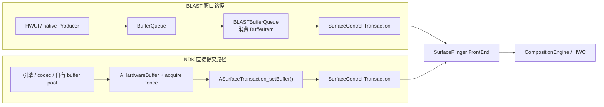
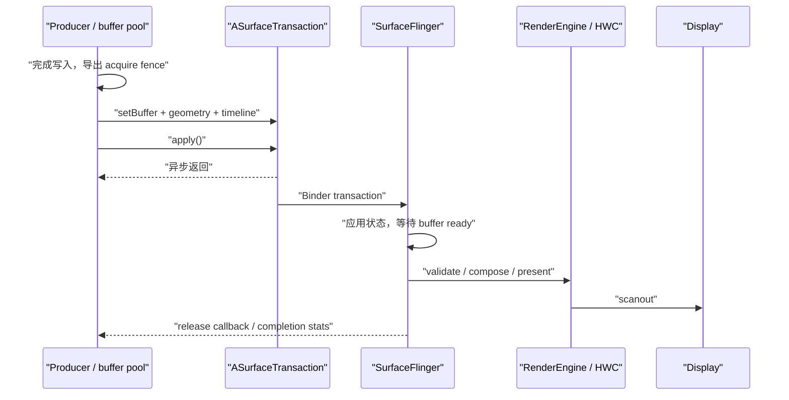

# 18.10 Android 17 SurfaceControl NDK API

Platform 源码锚点为 AOSP `android-17.0.0_r1`，kernel 锚点为 `android17-6.18-2026-06_r6`。`ASurfaceControl` 从 Android 10（API 29）起向 NDK 开放，它适合已有原生渲染器、硬件缓冲池或跨进程嵌入架构的组件。普通 View 页面通常不需要绕过 HWUI 直接使用这组 API。

理解 SurfaceControl 时，要把 **Layer 状态**、**像素缓冲**、**事务** 和 **同步 fence** 分开。`ASurfaceControl` 负责指向 Layer 节点，`AHardwareBuffer` 携带像素，`ASurfaceTransaction` 描述一批状态变更，fence 决定 buffer 何时可以被读取或复用。这四类对象的职责不能互相替代。

## 核心概念

### 五类对象各管什么

| 对象 | 职责 | 不负责什么 |
|:---|:---|:---|
| `ANativeWindow` | 面向生产者的 dequeue / queue 入口，常由 Java `Surface` 桥接而来 | 不等于一个新的 SurfaceFlinger Layer |
| `ASurfaceControl` | 指向可由事务修改的 Layer 节点 | 不提供绘制命令，也不是 BufferQueue |
| `ASurfaceTransaction` | 收集一批 Layer 状态，调用 `apply()` 后异步提交 | 不等待该帧上屏 |
| `AHardwareBuffer` | 持有可跨 CPU、GPU、编解码器和合成器共享的图形内存 | 不自带 acquire / release 时序 |
| sync fence fd | 描述生产完成或消费完成的同步边界 | 不延长业务对象和回调上下文的生命周期 |

在 Android 17 的 `frameworks/base/native/android/surface_control.cpp` 中，公开的 `ASurfaceControl*` 会转换为 framework native 的 `SurfaceControl*`，`ASurfaceTransaction*` 会转换为 `SurfaceComposerClient::Transaction*`。它们是 NDK 的不透明句柄，应用不能依赖内部结构，也不能把裸指针写入 Binder。

### 创建的是父节点下面的新 Layer

`ASurfaceControl_createFromWindow(parent, name)` 会从 `ANativeWindow` 取得已有的 SurfaceControl handle，再创建一个以它为父节点的新 Layer。它不会把原来的 window “转换成”新对象，也不会复用原 window 的 BufferQueue。Android 17 的实现给新节点使用 `eFXSurfaceBufferState` 标志，因此该节点可以直接接收 `setBuffer()` 提交的 `AHardwareBuffer`。

若已经持有一个 `ASurfaceControl*`，`ASurfaceControl_create(parent, name)` 会在同一个 `SurfaceComposerClient` 下创建子节点。两种创建函数都把返回引用交给调用方；失败时返回 `nullptr`，成功后要配对 `ASurfaceControl_release()`。

这里不应把 NDK 创建的节点简单分成“Buffer Layer、Color Layer、Container Layer”三类。公开 C API 的创建函数没有 Java `SurfaceControl.Builder` 那样的 layer type 选项。`ASurfaceTransaction_setColor()` 在 Android 17 实现中调用 `setBackgroundColor()`，只设置 buffer 透明区域下方的背景色，不会创建独立 Color Layer。只用于组织子树的节点可以不提交 buffer，但它仍是这组 NDK 创建函数生成的 buffer-state 节点。

### Java 与 NDK 句柄桥接

Android 14（API 34）增加了 `android/surface_control_jni.h`：

- `ASurfaceControl_fromJava()` 从有效的 Java `SurfaceControl` 取得一份本地强引用；用完必须调用 `ASurfaceControl_release()`。
- `ASurfaceTransaction_fromJava()` 返回 Java `SurfaceControl.Transaction` 内部事务的借用指针；它只在 Java 对象存活且未 `close()` 时有效，不能调用 `ASurfaceTransaction_delete()`。

这两个函数只解决同一进程内的 Java / native 桥接。跨进程传递仍由 Java `SurfaceControl` 的 `Parcelable` 能力、`SurfaceControlViewHost.SurfacePackage` 或系统服务完成。

### 事务原子性不等于已经上屏

一个 `ASurfaceTransaction` 可以同时修改多个节点。Android 17 头文件保证其中的更新原子应用；同一线程调用 `apply()` 的事务还保证按提交顺序应用。这个保证针对 SurfaceFlinger 接收和应用的状态边界，不代表：

- `apply()` 返回时 buffer 已经被 latch；
- 事务一定赶上调用后的第一个 VSync；
- acquire fence 尚未 signal 的 buffer 可以立即读取；
- 多个独立 Producer 的“业务同一帧”会被系统自动识别。

事务交出后还要经过 Binder、SurfaceFlinger 调度、buffer 就绪判断、合成策略选择和 display present。定位问题时必须沿这条时间线继续追踪。

## 与 BLAST 的关系

BLAST 和 NDK SurfaceControl 最终都使用 `SurfaceComposerClient::Transaction` 向 SurfaceFlinger 交付 buffer 与 Layer 状态，但入口和队列所有者不同。



BLAST 路径通常先由 Producer 向 BufferQueue `dequeueBuffer()` / `queueBuffer()`，再由 `BLASTBufferQueue` 的消费者侧取得 `BufferItem`，把 buffer、acquire fence 和几何状态放进事务。NDK 直接提交路径没有替调用方创建公开的 BufferQueue；应用把已有的 `AHardwareBuffer` 和 fence 直接放进事务。

两条路径在事务层汇合，不表示 `ASurfaceControl` 就是 `BLASTBufferQueue`，也不表示 `ASurfaceControl_createFromWindow()` 会接管 parent window 的队列。排查时可以用下面三个问题区分它们：

1. Producer 是在调用 `queueBuffer()`，还是直接调用 `ASurfaceTransaction_setBuffer()`？
2. buffer slot 和 release 节奏由 BufferQueue 管理，还是由应用自己的池管理？
3. Perfetto 中待查的是 BLAST queue 的 frame number，还是应用事务里的独立 Layer / buffer？

同一事务中的几何和 buffer 状态具有统一的应用边界，但显示时间仍受 acquire fence 和调度目标约束。若多个 Producer 各自提交事务，还需要上层同步协议决定哪些 buffer 属于同一业务帧；仅仅使用 SurfaceControl 不能自动消除跨 Producer 错帧。

## 典型使用流程

### 从 Java Surface 建立子 Layer

下面的 Java 代码只负责把有效的 `Surface` 交给 native。`SurfaceView` 生命周期结束后，这个 `Surface` 可能失效，因此 native 层也要跟随 `surfaceCreated`、`surfaceChanged` 和 `surfaceDestroyed` 更新资源。

```java
Surface surface = surfaceView.getHolder().getSurface();
nativeCreateChild(surface);
```

native 侧先取得 `ANativeWindow`，再在该 window 对应 Layer 下面创建子节点。下面的代码展示引用关系，不包含错误处理后的业务回调。

```c
#include <android/native_window_jni.h>
#include <android/surface_control.h>

static ASurfaceControl* g_child;

void nativeCreateChild(JNIEnv* env, jobject javaSurface) {
    ANativeWindow* window = ANativeWindow_fromSurface(env, javaSurface);
    if (window == NULL) {
        return;
    }

    ASurfaceControl* child =
            ASurfaceControl_createFromWindow(window, "native-overlay");
    ANativeWindow_release(window);

    if (child == NULL) {
        return;
    }
    g_child = child;
}
```

`ANativeWindow_fromSurface()` 增加 window 引用，示例在创建子节点后立即释放该引用。`ASurfaceControl_createFromWindow()` 返回的 child 是另一份资源，不能用 `ANativeWindow_release()` 释放。

### 提交 buffer 和几何状态

下面的 C 示例把一块已经由生产者写好的 `AHardwareBuffer` 提交给 child。`acquireFenceFd` 为 `-1` 时表示无需等待；大于等于 0 时，调用 `setBuffer()` 后 fd 所有权转移给 framework，调用方不能再次关闭同一个 fd。

```c
void submitBuffer(
        ASurfaceControl* child,
        AHardwareBuffer* buffer,
        int acquireFenceFd,
        int32_t bufferWidth,
        int32_t bufferHeight,
        int32_t x,
        int32_t y) {
    ASurfaceTransaction* tx = ASurfaceTransaction_create();

    ARect crop = {
        .left = 0,
        .top = 0,
        .right = bufferWidth,
        .bottom = bufferHeight,
    };

    ASurfaceTransaction_setBuffer(tx, child, buffer, acquireFenceFd);
    ASurfaceTransaction_setCrop(tx, child, &crop);
    ASurfaceTransaction_setPosition(tx, child, x, y);
    ASurfaceTransaction_setVisibility(
            tx, child, ASURFACE_TRANSACTION_VISIBILITY_SHOW);

    ASurfaceTransaction_apply(tx);
    ASurfaceTransaction_delete(tx);
}
```

`setCrop()` 和 `setPosition()` 从 API 31 可用。若 `minSdk` 低于 31，需要按系统版本选择接口，或在 API 29—30 使用已废弃的 `setGeometry()` 兼容旧设备。事务对象在 `apply()` 后可以删除；提交本身仍是异步的。

`AHardwareBuffer` 必须包含 `AHARDWAREBUFFER_USAGE_GPU_SAMPLED_IMAGE`，因为 SurfaceFlinger 可能选择 GPU CLIENT composition。若生产者用 Vulkan 写入，还要按图像用途增加 GPU color output 等 usage；若 CPU 会 lock 这块 buffer，则要增加对应的 CPU read / write usage。usage 描述允许的访问方式，不能用 fence 代替。

### 提交后的系统路径

下面的时序图把异步返回、buffer 就绪、系统合成和回收通知放在同一条时间线上。



从 `apply()` 到 release 回调之间，Producer 不能凭时间估算复用时机。可靠边界来自 API 36 的 per-buffer release callback，或 API 29—35 的 transaction completion stats。

## 关键 API 详解

### Android 17 下的公开能力

| API | 级别 | 用途与边界 |
|:---|:---:|:---|
| `createFromWindow()` / `create()` | 29 | 在已有 window 或 control 下创建子节点 |
| `reparent()` / visibility / Z | 29 | 修改树结构、子树可见性和兄弟节点相对层级 |
| `setBuffer()` / color / alpha / dataspace / damage | 29 | 提交像素及合成属性 |
| `setDesiredPresentTime()` | 29 | 请求事务不早于给定时间展示 |
| `setFrameRate()` | 30 | 向系统声明内容帧率，不会替应用节流 |
| crop / position / scale / transform | 31 | 拆分设置几何；优先于已废弃的 `setGeometry()` |
| `setOnCommit()` / backpressure | 31 | 事务节奏反馈和服务端排队策略 |
| `setFrameTimeline()` | 33 | 把事务关联到 Choreographer 给出的 `vsyncId` |
| `fromJava()` / `clearFrameRate()` | 34 | Java / native 桥接和清除帧率投票 |
| `setDesiredHdrHeadroom()` | 35 | 为标准 HDR 内容声明期望 headroom |
| `setBufferWithRelease()` / LUT | 36 | per-buffer 回收回调和显示 LUT |

`android-17.0.0_r1` 的公开头文件没有新增标记为 API 37 的 SurfaceControl C 函数。这里以 Android 17 为锚点复核所有签名、实现和 SurfaceFlinger 行为；旧接口不会因此被列为 Android 17 新功能。

### Buffer、几何和颜色

`ASurfaceTransaction_setBuffer()` 把 `AHardwareBuffer` 与 acquire fence 绑定到 Layer。framework 会为应用过的 buffer 状态持有引用。应用仍要管理自己在 buffer pool 中的引用，并等待所有 release 边界完成后再写入。

几何属性的坐标空间容易混淆：

- `setPosition()` 使用父节点坐标；
- `setCrop()` 限制该节点及其子树的可见边界；
- `setScale()` 以 `(0, 0)` 为缩放中心，缩放值必须大于 0；
- `setZOrder()` 只在兄弟节点之间比较，相同 Z 的顺序未定义；
- `setBufferTransform()` 描述 buffer 内容变换，不等于移动 Layer；
- `setDamageRegion()` 是内容更新区域提示，传错会造成显示错误或失去局部更新收益。

`setBufferAlpha()` 使用预乘 alpha。若通过 `setBufferTransparency(...OPAQUE)` 声明完全不透明，buffer 范围内每个像素都必须满足该声明；把带透明像素的内容标成 OPAQUE 可能出现错误合成。

`setColor()` 设置背景色、alpha 和 dataspace。带 buffer 的 Layer 还应通过 `setBufferDataSpace()` 描述 buffer 色彩空间；HDR 内容还要按格式提供对应静态元数据或 headroom。颜色接口不能修复生产端写错的像素格式或色域。

### `OnCommit`、`OnComplete` 与 release callback

| 回调 | API | 能证明什么 | 不能证明什么 |
|:---|:---:|:---|:---|
| `ASurfaceTransaction_OnCommit` | 31 | 事务已应用，更新已进入可展示状态；后续事务不会覆盖到同一帧 | buffer 已释放、present fence 可取 |
| `ASurfaceTransaction_OnComplete` | 29 | 包含该事务更新的帧已展示，可读取 latch / present / previous release 统计 | 所有 previous release fence 已 signal |
| `ASurfaceTransaction_OnBufferRelease` | 36 | 对应的 `setBufferWithRelease()` buffer 已进入可复用流程 | 回调 fd 大于等于 0 时已经 signal |

`OnCommit` 会先于 `OnComplete`，它适合做事务 pacing，不适合回收 buffer。在该回调中查询 present fence 或 previous release fence 会失败。

`OnComplete` 传入的 `ASurfaceTransactionStats*` 只在回调期间有效。`getPresentFenceFd()` 和 `getPreviousReleaseFenceFd()` 返回的有效 fd 归调用方所有，调用方负责等待与关闭。`getAcquireTime()` 已废弃，因为回调到达时 acquire fence 可能仍未 signal；排障应保留生产端 fence 与提交时间。

API 36 起优先使用 `setBufferWithRelease()`。它把回收通知绑定到本次 buffer 提交，避免应用再从“上一块 buffer”的 transaction stats 反推池状态。

### Backpressure 与丢帧

NDK 创建的节点默认关闭 backpressure。在上一块 buffer 的回调到达前继续提交，新 buffer 可能覆盖尚未展示的旧 buffer。这适合优先低延迟、允许丢中间帧的场景。

`ASurfaceTransaction_setEnableBackPressure(..., true)` 要求每个 buffer 在释放前先展示，服务端可以暂存更多提交。它能保留帧序，但也可能增加排队和内存压力。引擎若已有可靠的 N-buffer 池与 release pacing，不应只因看到掉帧就打开 backpressure；要先判断中间帧是否具有业务价值。

## Layer 层级管理

### 用树描述所有权

下面的结构适合视频编辑器或自绘播放器：视频、字幕和调试信息更新频率不同，因此各自拥有少量独立 Layer。

```text
Host Window
└── Native Container
    ├── Video Buffer Layer      Z = 0
    ├── Subtitle Buffer Layer   Z = 10
    └── Debug Buffer Layer      Z = 20
```

父节点的位置、裁剪和可见性会影响子树。`setVisibility(HIDE)` 隐藏节点及其后代；`reparent(child, newParent)` 移动节点时，child 原有后代仍挂在 child 下；`reparent(child, NULL)` 会让整个子树离开显示树。

相同 Z 值的兄弟节点顺序未定义，不能依赖创建先后。需要稳定顺序时给出不同 Z 值，并把层级变更和相关几何更新放进同一事务。

### 跨进程边界

Java `android.view.SurfaceControl` 从 API 29 起实现 `Parcelable`。系统组件可以经 Binder 传递有效句柄，再在目标进程创建本地引用。普通应用做远端 View 嵌入时，更常见的公开封装是：

- 提供方用 `SurfaceControlViewHost` 托管远端 View；
- 接收方取得 `SurfacePackage` 并附着到 `SurfaceView`；
- API 34 起可用 `SurfaceSyncGroup` 收集参与者的同步结果；
- native 代码需要操作已经传到本进程的 Java control 时，再用 `ASurfaceControl_fromJava()` 桥接。

公开 NDK 没有 `ASurfaceControl_writeToParcel()`。`ASurfaceControl*` 只是当前进程地址空间中的句柄，不能作为跨进程协议。跨进程双方还要约定谁创建、谁 reparent、谁在 Binder death 后清理，以及 callback context 在服务退出时如何失效。

### 销毁分为“离开显示树”和“释放本地引用”

`ASurfaceControl_release()` 只减少调用方的本地强引用。Android 17 头文件明确说明：只要父节点仍显示，surface 及其 children 仍可能留在屏幕上。

需要移除一棵子树时，可以按以下顺序处理：

1. 在事务中隐藏节点，或 `reparent(node, NULL)`；
2. 提交事务，并在需要严格确认时等待 `OnComplete`；
3. 停止 Producer，处理尚未返回的 buffer release；
4. 释放 `ASurfaceControl`、buffer pool 和回调上下文。

这四步分别处理显示状态、事务完成、像素所有权和本地引用。只调用 `release()`，或只把节点隐藏，都不能替代完整清理。

### Layer 数量没有通用阈值

每个独立 buffer Layer 都会增加状态遍历、buffer / fence 跟踪和合成策略输入。HWC 能直接处理多少 Layer 还受像素格式、缩放、旋转、alpha、HDR、secure 属性、分辨率和厂商硬件限制影响，不能写成“超过 N 层必然 GPU 合成”。

拆分 Layer 时保留两个条件即可：该内容是否需要独立更新节奏，是否需要独立生命周期。若两个元素总是一起生产、一起移动、一起销毁，把它们画进同一个 buffer 往往更简单。

## FrameTimeline API

### API 33 才具备完整的 NDK 选择流程

Android 12 引入系统侧 FrameTimeline 诊断能力；NDK 的 `AChoreographer_postVsyncCallback()`、`AChoreographerFrameCallbackData_*()` 与 `ASurfaceTransaction_setFrameTimeline()` 都从 Android 13（API 33）开放。

VSync callback 会提供多条候选 timeline。每条包含：

- `vsyncId`：交给 SurfaceFlinger 的关联标识；
- `expectedPresentationTimeNanos`：预计展示时间，也适合推进动画时钟；
- `deadlineNanos`：buffer 要按时展示所需的就绪期限。

callback data 只在回调期间有效，但取出的 `AVsyncId`、时间戳和索引值可以保存。选择时既要看期望展示时间，也要估算渲染是否能赶上 deadline。

下面的示例选取一条不早于业务目标、且 deadline 晚于预计完成时间的 timeline。代码省略了 GPU 提交，只展示选择和事务绑定位置。

```c
#include <android/choreographer.h>
#include <android/surface_control.h>

typedef struct FrameContext {
    AChoreographer* choreographer;
    int64_t desiredPresentTimeNanos;
    int64_t predictedReadyTimeNanos;
} FrameContext;

static size_t chooseTimeline(
        const AChoreographerFrameCallbackData* data,
        int64_t desiredPresentTimeNanos,
        int64_t predictedReadyTimeNanos) {
    size_t count =
            AChoreographerFrameCallbackData_getFrameTimelinesLength(data);
    size_t preferred =
            AChoreographerFrameCallbackData_getPreferredFrameTimelineIndex(data);

    for (size_t i = preferred; i < count; ++i) {
        int64_t expected =
                AChoreographerFrameCallbackData_getFrameTimelineExpectedPresentationTimeNanos(
                        data, i);
        int64_t deadline =
                AChoreographerFrameCallbackData_getFrameTimelineDeadlineNanos(
                        data, i);
        if (expected >= desiredPresentTimeNanos
                && deadline >= predictedReadyTimeNanos) {
            return i;
        }
    }
    return count - 1;
}

static void onVsync(
        const AChoreographerFrameCallbackData* data,
        void* opaque) {
    FrameContext* ctx = (FrameContext*)opaque;
    size_t index = chooseTimeline(
            data,
            ctx->desiredPresentTimeNanos,
            ctx->predictedReadyTimeNanos);
    AVsyncId vsyncId =
            AChoreographerFrameCallbackData_getFrameTimelineVsyncId(data, index);

    ASurfaceTransaction* tx = ASurfaceTransaction_create();
    ASurfaceTransaction_setFrameTimeline(tx, vsyncId);
    /* renderFrameAndAttachBuffer(tx, vsyncId); */
    ASurfaceTransaction_apply(tx);
    ASurfaceTransaction_delete(tx);

    AChoreographer_postVsyncCallback(
            ctx->choreographer, onVsync, ctx);
}
```

连续渲染时每次 callback 都要再次注册下一帧。`AChoreographer_getInstance()` 必须在带 `ALooper` 的线程调用。示例假定 callback 至少提供一条 timeline；工程代码还应检查上下文销毁、渲染取消和 buffer 提交失败。

`setFrameTimeline()` 已把事务关联到该候选 timeline 的 expected presentation time 和 deadline。不要机械地再把同一个 expected time 填入 `setDesiredPresentTime()`；后者是 API 29 起的独立调度请求，适用于没有 `vsyncId` 或业务明确要求“不早于某时刻”的场景。若两个请求并用，应保证语义一致。过期或无效的 `vsyncId` 会被忽略。

`setFrameRate()` 也不是 FrameTimeline 的替代品。它向系统声明内容帧率，可能影响显示刷新率选择；应用仍要用 Choreographer、交换链 pacing 或 release callback 控制自身产帧。

### Trace 中怎样解释 FrameTimeline

FrameTimeline 提供的是“计划”和“结果”的对应关系。分析一帧时至少记录：

| 字段 | 回答的问题 |
|:---|:---|
| expected presentation | 应用选择赶哪一拍 |
| deadline | buffer 最晚何时应准备好 |
| actual presentation | 该 SurfaceFrame / DisplayFrame 何时上屏 |
| present type / jank type | 平台如何归类早、准时或迟到 |
| Layer / token 映射 | 这条 timeline 对应哪个内容对象 |

只看到 `vsyncId` 不能解释卡顿。还要把 GPU fence、SurfaceFlinger latch 和 display present 放到同一帧上。

## Fence 处理与生命周期

### 一块 buffer 的同步方向

下面的方向图只描述一块 buffer 的读写同步，不表示对象引用关系。

```text
Producer 写入
    │
    ├── acquire fence ──> SurfaceFlinger / HWC 等待后读取
    │
    └── buffer 保持不可复写
                         │
                         └── release fence ──> Producer 等待后复用
```

acquire fence 保护“写完再读”，release fence 保护“读完再写”。它们方向相反，且都与 `AHardwareBuffer` 的引用计数分离。

调用 `setBuffer()` 或 `setBufferWithRelease()` 后，framework 接管传入的 acquire fence fd。若调用方还要保留同一 fence 做诊断，必须在调用前 `dup()` 一份；不能在调用后关闭或复用已经转移的 fd。

kernel `android17-6.18-2026-06_r6` 的 `drivers/dma-buf/sync_file.c` 把 dma-fence 暴露为 fd，`drivers/dma-buf/dma-fence.c` 提供 signal、callback 与 wait 原语。它们定义通用同步机制，无法单独说明某台设备的 GPU、codec 或 display fence 为何迟到；归因仍要结合 vendor driver timeline 和目标 buffer 的所有权。

### API 36：按 buffer 接收 release

release callback 可以在任意线程执行。回调不宜直接永久阻塞；更安全的做法是把 slot 和 fence fd 交给专门的回收队列。

```c
static void onBufferRelease(void* opaque, int releaseFenceFd) {
    BufferSlot* slot = (BufferSlot*)opaque;
    enqueueForRecycle(slot, releaseFenceFd);
}

void attachBuffer(
        ASurfaceTransaction* tx,
        ASurfaceControl* child,
        BufferSlot* slot,
        int acquireFenceFd) {
    ASurfaceTransaction_setBufferWithRelease(
            tx,
            child,
            slot->hardwareBuffer,
            acquireFenceFd,
            slot,
            onBufferRelease);
}
```

回收线程看到 `releaseFenceFd >= 0` 时要等待 signal，再关闭 fd 并把 slot 放回可写队列；值为 `-1` 表示已经释放。回调上下文 `BufferSlot*` 必须活到回调执行，组件销毁时要先停止新提交，再清空未完成回调。

Android 17 头文件还规定：若同一事务里的 buffer 在 `apply()` 前被另一轮 `setBuffer()` 替换，被替换 buffer 的回调会立即执行；其余情况会在 buffer 展示后、`OnComplete` 之前执行。buffer pool 不能假定回调都来自“已上屏的帧”。

### API 29—35：从完成统计取得上一块 buffer

旧系统使用 `setBuffer()`，并在 `OnComplete` 中调用：

```c
int fd = ASurfaceTransactionStats_getPreviousReleaseFenceFd(stats, control);
if (fd >= 0) {
    enqueuePreviousBufferForRecycle(control, fd);
} else {
    recyclePreviousBufferNow(control);
}
```

该 fd 描述此 Layer 的 **上一块** buffer。每次把 buffer 应用到某个 surface，framework 都把它视为一次独立引用；同一块 `AHardwareBuffer` 被多次提交时，应用要等所有待处理引用都释放，不能看到一次 callback 就立即复写。

### 常见错误

| 错误 | 后果 | 修正 |
|:---|:---|:---|
| `apply()` 返回就复写 buffer | 撕裂、花屏或同步错误 | 等 per-buffer callback / previous release fence |
| 把 acquire fd 传入后再次 `close()` | framework 等到无效或复用 fd | 调用前按需 `dup()`，明确所有权转移 |
| 在 `OnCommit` 查询 present / release fence | 查询失败 | 在 `OnComplete` 查询，或使用 API 36 release callback |
| callback context 提前销毁 | use-after-free | 停止提交并排空回调后再销毁池 |
| callback 线程直接做长时间等待 | 回调拥塞，后续 release 延迟 | 把 fence 移交回收线程 |
| 只释放 `ASurfaceControl`，未移除子树 | Layer 仍可能显示 | 先 hide / reparent-null，再释放句柄 |

## 实战场景

### 自绘引擎与视频编辑器

SurfaceControl 适合把更新节奏不同的少量内容分开：主画面每帧更新，字幕只在文本变化时更新，调试层只在采样点刷新。引擎自己负责生产 `AHardwareBuffer`、提交 acquire fence、消费 release callback；SurfaceFlinger 负责把这些 Layer 和其他窗口一起合成。

收益要用两侧数据验证。App GPU 工作减少，不代表显示侧成本也降低；额外 Layer 可能因缩放、alpha、HDR 或硬件限制进入 CLIENT composition。若 App RenderThread 变轻但 SurfaceFlinger / RenderEngine 变重，优化只是把成本移到了系统合成阶段。

### SurfaceView 宿主

`SurfaceView` 提供了天然的独立 Surface 和 Layer 生命周期。native 组件可以从其 Java `Surface` 取得 `ANativeWindow`，再用 `createFromWindow()` 创建受宿主裁剪和可见性影响的子节点。宿主销毁或重建 Surface 时，旧 parent handle 不能继续当作新树根使用。

需要直接向 `SurfaceView` 的 BufferQueue 渲染时，应使用该 `ANativeWindow` 的 EGL / Vulkan / MediaCodec Producer 路径；需要在它下面组织额外 Layer 时才使用 `ASurfaceControl_createFromWindow()`。这两个目的不应混为一次“转换”操作。

### WebView

标准 WebView 主体通常由 Chromium 准备 compositor frame，再通过宿主进程的 HWUI functor 合入 App Window buffer。renderer 进程独立，不等于网页主体必然拥有独立 SurfaceFlinger Layer。

视频、受保护内容或 provider 选择的 overlay 可以产生额外 SurfaceControl Layer。判断设备上的真实路径要看 WebView provider revision、SurfaceFlinger Layer 树、宿主 RenderThread 和媒体 Producer，不能仅凭出现 Viz / Compositor 线程就断言网页已独立合成。

### 画中画与系统动画

进入 PiP 时，WindowManager Shell 通常持有任务 leash 和 PiP container，并通过 Java / framework transaction 改位置、裁剪、圆角和层级。普通应用提交视频内容，但不能用公开 NDK API 把自己的 Layer 任意 reparent 到系统私有容器。

分析 PiP 卡顿时应分开看：

- Shell / WMS 的几何事务是否按时；
- 视频 Producer 的 buffer 与 acquire fence 是否按时；
- PiP 圆角、阴影和其他窗口是否改变 HWC composition；
- transition 结束后旧 leash / Layer 是否被清理。

旧 buffer 配新几何可能表现为拉伸或黑边，内容迟到与动画事务迟到要按 token 和 Layer 分开定位。

### 跨进程 View 与 Flutter Platform View

跨进程 View 优先从 `SurfaceControlViewHost`、`SurfacePackage` 和 `SurfaceSyncGroup` 的公开生命周期分析。Flutter Platform View 可能使用 hybrid composition、Texture 路径或 SurfaceProducer，具体拓扑随 Flutter engine、Android 版本和插件实现变化。框架名称不能直接决定是否有独立 SurfaceControl Layer。

先画出“内容 Producer → 消费位置 → 宿主 buffer 或独立 Layer → SurfaceFlinger”的对象图，再讨论优化。若只按进程名或框架名判断，很容易把宿主纹理合入路径写成系统 overlay。

## Trace 视角

### 先建内容对象表

混合出图应以内容对象作为分析单位，不按应用名或某一条线程直接归类。SurfaceControl 场景可以先填这张表：

| 内容 | Producer | 提交入口 | SF Layer / parent | buffer 标识 | acquire / release | FrameTimeline |
|:---|:---|:---|:---|:---|:---|:---|
| 主画面 | 引擎 RenderThread | `setBufferWithRelease()` | `game-main` / host | pool slot + frame id | GPU → SF / SF → pool | vsyncId |
| 字幕 | UI raster worker | `setBuffer()` | `subtitle` / container | subtitle generation | CPU ready / previous release | 可选 |
| 视频 | codec | `queueBuffer()` 或独立 bridge | `video` / host | codec PTS + frame number | codec → consumer | media timing |

这张表能发现“同名 Layer 已重建”“拿宿主 FrameTimeline 解释独立视频”“把 release fence 归到错误 buffer”等问题。

### 不依赖固定 slice 名称

NDK 的 `ASurfaceTransaction_apply()` 实现只是调用 native transaction `apply()`，Android 17 源码没有承诺一定生成名为 `ASurfaceTransaction_apply` 的 trace slice。`setTransactionState`、`latchBuffer` 等内部 slice 也会随版本和 trace 配置变化。

应用可以在提交点增加自己的稳定标记。下面的标记只表示调用边界，不表示事务已 commit 或上屏。

```c
#include <android/trace.h>

ATrace_beginSection("SC submit: subtitle frame=42");
ASurfaceTransaction_apply(tx);
ATrace_endSection();
```

把业务 frame id 写入自定义 marker 后，再用 transaction、Layer、buffer 和 FrameTimeline 数据源向显示端关联。不要用 marker 结束时间代替 present time。

### 最小证据链

一次 SurfaceControl 卡顿分析至少覆盖五段：

1. Producer 何时开始和结束写 buffer，GPU / codec fence 何时 signal；
2. 应用何时提交 transaction，transaction 是否被更晚提交覆盖；
3. SurfaceFlinger 看到哪个 Layer、parent、Z、crop、buffer 和 frame token；
4. 该 display frame 选择 DEVICE 还是 CLIENT composition，RenderEngine / HWC 花费多少；
5. actual present 和 release fence 何时发生，buffer pool 是否及时恢复可写 slot。

下面的命令用于核对当前 Layer 名称。不同版本的详细 dump 格式会变化，脚本不要依赖固定列位置。

```bash
adb shell dumpsys SurfaceFlinger --list
adb shell dumpsys SurfaceFlinger
```

Perfetto 配置应包含应用 atrace、调度、Binder、gfx / view、SurfaceFlinger、FrameTimeline 和需要的 GPU 数据源。厂商 GPU / HWC counter 是否可见取决于设备，缺少 counter 时要明确证据边界。

### 从现象回到边界

| 现象 | 优先检查 | 不要直接下的结论 |
|:---|:---|:---|
| `apply()` 很快，画面仍晚 | acquire fence、目标 timeline、SF / HWC present | SurfaceControl 没有生效 |
| 中间帧消失 | backpressure、连续 setBuffer、Producer 频率 | SurfaceFlinger 随机丢帧 |
| Layer 数量上升后耗时增加 | parent 树、CLIENT / DEVICE、RenderEngine | 超过固定 Layer 数上限 |
| WebView renderer 很忙 | renderer / functor / host / media overlay 各自路径 | 网页主体一定是独立 Layer |
| PiP 几何顺、内容卡 | codec buffer、acquire fence、视频 Layer | Shell 动画慢 |
| 内存只增不降 | 未完成 release、buffer pool、旧 Layer / callback context | 单纯 Java heap 泄漏 |

### Android 17 源码索引

- [`surface_control.h`](https://android.googlesource.com/platform/frameworks/native/+/android-17.0.0_r1/include/android/surface_control.h)：公开 API、级别、fd 所有权和 callback 语义。
- [`surface_control_jni.h`](https://android.googlesource.com/platform/frameworks/native/+/android-17.0.0_r1/include/android/surface_control_jni.h)：API 34 Java / native 桥接及所有权差异。
- [`surface_control.cpp`](https://android.googlesource.com/platform/frameworks/base/+/android-17.0.0_r1/native/android/surface_control.cpp)：NDK 到 `SurfaceControl` / `Transaction` 的实现映射。
- [`SurfaceControl.java`](https://android.googlesource.com/platform/frameworks/base/+/android-17.0.0_r1/core/java/android/view/SurfaceControl.java)：Java Layer 树、`Parcelable` 与 Transaction。
- [`BLASTBufferQueue.cpp`](https://android.googlesource.com/platform/frameworks/native/+/android-17.0.0_r1/libs/gui/BLASTBufferQueue.cpp)：BLAST 消费 BufferQueue 并生成事务的路径。
- [`SurfaceComposerClient.cpp`](https://android.googlesource.com/platform/frameworks/native/+/android-17.0.0_r1/libs/gui/SurfaceComposerClient.cpp)：transaction 状态收集和提交。
- [`SurfaceFlinger.cpp`](https://android.googlesource.com/platform/frameworks/native/+/android-17.0.0_r1/services/surfaceflinger/SurfaceFlinger.cpp) 与 [`FrameTimeline.cpp`](https://android.googlesource.com/platform/frameworks/native/+/android-17.0.0_r1/services/surfaceflinger/Scheduler/FrameTimeline.cpp)：事务应用、帧调度和展示结果。
- [`sync_file.c`](https://android.googlesource.com/kernel/common/+/refs/tags/android17-6.18-2026-06_r6/drivers/dma-buf/sync_file.c) 与 [`dma-fence.c`](https://android.googlesource.com/kernel/common/+/refs/tags/android17-6.18-2026-06_r6/drivers/dma-buf/dma-fence.c)：kernel fence fd、signal、callback 与 wait 语义。

---

> **交叉引用**
>
> - BLAST Buffer 生命周期详见 [18.2 Android View 标准路径（BLAST 深入）](02-android-view-standard.md)
> - SurfaceView 的 Layer 结构详见 [18.6 SurfaceView 独立 Surface 路径](06-surfaceview.md)
> - Vulkan WSI 与 BufferQueue 详见 [18.9 Android 17 Vulkan 原生渲染管线](09-vulkan-native.md)
> - WebView 的宿主 functor 与媒体 overlay 详见 [18.13 WebView 渲染路径](13-webview-rendering.md)
> - BufferQueue 对象边界详见 [2.13 图形缓冲区管理（BufferQueue）](../../part1-fundamentals/ch02-rendering/13-buffer-queue.md)
> - SurfaceFlinger 合成策略详见 [2.6 SurfaceFlinger 与合成](../../part1-fundamentals/ch02-rendering/06-surfaceflinger.md)
> - fence 所有权详见 [2.16 Sync Fence 框架与帧同步机制](../../part1-fundamentals/ch02-rendering/16-sync-fence.md)
