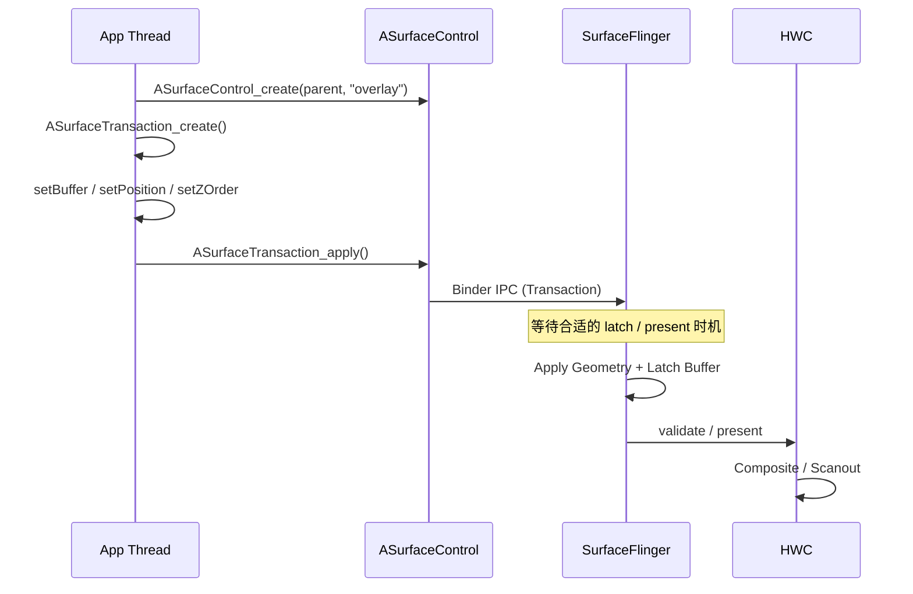
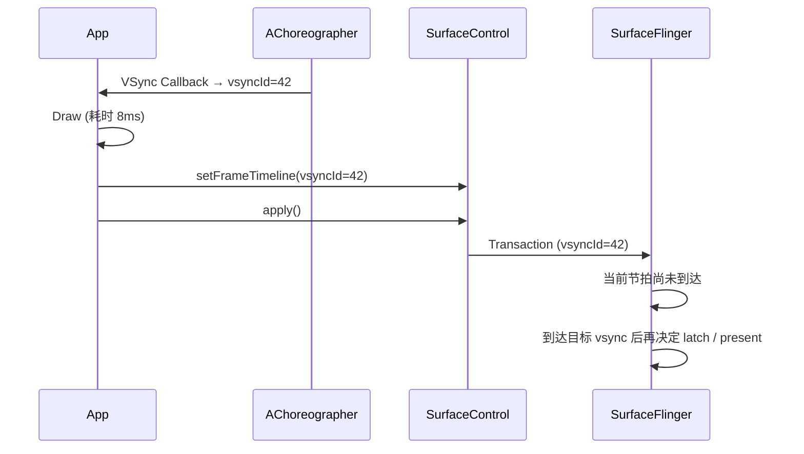

<!-- outline-start -->

**锚点（必须覆盖）：**
- [18.10.1 核心概念](#核心概念) — ASurfaceControl 与 ASurfaceTransaction 的定位
- [18.10.2 与 BLAST 的关系](#与-blast-的关系) — 共享事务模型但不等价
- [18.10.3 典型使用流程](#典型使用流程) — 创建 → 配置 → 提交的完整路径
- [18.10.4 关键 API 详解](#关键-api-详解) — Buffer、层级、Reparent
- [18.10.5 Layer 层级管理](#layer-层级管理) — 动态图层树的组织
- [18.10.6 FrameTimeline API](#frametimeline-api) — 精准控制帧着陆时间
- [18.10.7 Fence 处理与生命周期](#fence-处理与生命周期) — 最容易踩的坑
- [18.10.8 实战场景](#实战场景) — WebView OOP、画中画、自绘引擎
- [18.10.9 Trace 视角](#trace-视角) — SurfaceControl 路径的识别与瓶颈分析

**扩展（可选深入）：**
- SurfaceControl 与 WebView Out-of-process Rasterization
- Flutter Platform View 的 SurfaceControl 集成
- 跨进程 Layer 共享

<!-- outline-end -->

`ASurfaceControl`（Android 10/Q 引入，API 29）是 Android NDK 中面向 SurfaceFlinger 的原生图层控制接口。它允许 App 在 View 树之外创建或管理子 Layer，并把 Buffer、几何属性、层级关系等变更作为一次事务提交给系统合成器。[已验证: Android NDK surface_control 文档] 对浏览器、视频容器、自绘引擎这类需要自己组织合成结构的场景，它提供了比普通 View / Surface 更细的控制粒度。[待验证: 具体性能收益需结合目标设备的 HWC 能力与合成策略评估]

## 核心概念

### ASurfaceControl

`ASurfaceControl` 代表一个可被事务修改的 SurfaceFlinger Layer 句柄。[已验证: Android NDK surface_control 文档] 从 SurfaceFlinger 的组织方式看，常见表现有三类：

- **Buffer Layer**：显示实际像素内容，通过 `setBuffer` 绑定 `AHardwareBuffer`
- **Color Layer**：显示纯色内容，通过 `setColor` 指定颜色
- **Container Layer**：只承担父子关系和 Z 轴组织，不直接携带像素内容

和 Java 层的 `SurfaceControl` 相比，NDK 侧直接暴露了创建子 Layer、reparent、buffer 提交等能力。App 不必依赖完整的 View 树，就可以把多个图层作为一棵独立子树交给 SurfaceFlinger 管理。[已验证: Android NDK surface_control 文档]

### ASurfaceTransaction

`ASurfaceTransaction` 代表一组原子提交的 Layer 属性更新。应用可以一次性修改多个 `ASurfaceControl` 的 Buffer、位置、裁剪区域、Z-Order、可见性，再通过 `apply()` 把这组更新作为统一快照送给系统。[已验证: Android NDK surface_control 文档]

原子提交的价值主要体现在三个地方：

- Buffer 更新和几何属性可以在同一个提交边界里生效，减少中间态被用户看到的机会
- 多个 Layer 的变化可以作为一个快照出现，不必担心前一层已经移动、后一层还没跟上的错位
- Buffer、位置、透明度这类变化可以和 BLAST 使用的 Transaction 模型保持一致，便于分析 App 侧和 SurfaceFlinger 侧的对应关系

## 与 BLAST 的关系

NDK 的 SurfaceControl API 和 BLAST 共享同一套 Transaction + Buffer 协同更新模型，但两者不是同一个概念。[已验证: Android 10+ 图形栈文档]

- **BLAST**：围绕 Buffer 提交、几何属性变更和提交边界同步的一套底层机制，常见实现形态是 BLASTBufferQueue
- **ASurfaceControl / ASurfaceTransaction**：应用可以直接调用的 NDK 接口，用来创建 Layer、设置属性、提交事务

当 App 用 `ASurfaceTransaction` 同时提交 buffer 和几何属性时，SurfaceFlinger 会在同一个事务边界里处理它们。是否真的落到 BLASTBufferQueue、是否还包着 legacy 兼容层，取决于组件类型和 Android 版本。[待验证: 具体内部类名与调用路径需按目标版本源码确认]

### Sync 语义

Transaction 只是在提交点声明“这组属性和这个 buffer 应一起生效”。真正的 latch / present 时机仍由 acquire fence、VSync、SurfaceFlinger 调度和 HWC 合成窗口共同决定。[已验证: SurfaceFlinger transaction + sync fence 模型] `apply()` 返回，只能说明事务已经送出，不能说明这一帧已经上屏。[已验证: NDK transaction apply 语义]

## 典型使用流程

### 步骤 1：创建 SurfaceControl

你需要一个父 `ASurfaceControl`，或者从 `ANativeWindow` 创建根节点：

```c
// 从现有 SurfaceControl 创建子 Layer
ASurfaceControl* child = ASurfaceControl_create(parent, "MyOverlay");

// 或从 ANativeWindow 创建
ASurfaceControl* child = ASurfaceControl_createFromWindow(window, "MyOverlay");
```

创建出来的 child layer 默认还没有可见内容；后续要通过 transaction 设置 buffer、位置、Z 序，再 `apply()` 提交。[已验证: Android NDK surface_control 文档]

### 步骤 2：配置 Transaction

创建并配置一个事务，设置各种属性：

```c
ASurfaceTransaction* transaction = ASurfaceTransaction_create();

// 设置 Buffer（来自 AHardwareBuffer）
ASurfaceTransaction_setBuffer(transaction, child, hardwareBuffer, fence_fd);

// 设置位置
ASurfaceTransaction_setPosition(transaction, child, x, y);

// 设置大小
ASurfaceTransaction_setSize(transaction, child, width, height);

// 设置层级
ASurfaceTransaction_setZOrder(transaction, child, 10);

// 设置可见性
ASurfaceTransaction_setVisibility(transaction, child, ASURFACE_TRANSACTION_VISIBILITY_SHOW);

// 设置透明度
ASurfaceTransaction_setAlpha(transaction, child, 0.8f);
```

不同 NDK 版本也可以通过 crop / geometry 相关 API 控制显示区域。上面的代码块只演示一组常见事务组合，真实项目要以当前编译环境里的 `android/surface_control.h` 为准。[待验证: 具体函数可用性和最小 API 级别需按项目使用的 NDK 版本确认]

### 步骤 3：提交 Transaction

```c
ASurfaceTransaction_apply(transaction);
```

这一步会把打包好的事务发送给 SurfaceFlinger 侧的 composer client。提交是异步的，`apply()` 不等待 SurfaceFlinger 完成处理就返回。[已验证: Android NDK surface_control 文档]

### 完整时序



## 关键 API 详解

### Buffer Management

```c
ASurfaceTransaction_setBuffer(
    transaction,
    sc,                      // ASurfaceControl*
    hardwareBuffer,          // AHardwareBuffer*
    fence_fd                 // acquire fence
);
```

`setBuffer` / `setBufferWithRelease` 把 `AHardwareBuffer` 和 acquire fence 绑定到某个 Layer 上。[已验证: Android NDK surface_control 文档] acquire fence 表示“生产者对这个 buffer 的写入何时完成”；SurfaceFlinger 只有在 fence signal 后才会读取它。[已验证: Android sync fence 文档]

- **`AHardwareBuffer` 来源**：可以来自 `AHardwareBuffer_allocate()`、Vulkan Image 导出、MediaCodec 输出 buffer，或者其他本地图形组件
- **release callback 的作用**：如果目标是知道“这块 buffer 何时可以复用”，优先使用 `ASurfaceTransaction_setBufferWithRelease()` 提供 release callback。回调给出的 release fence fd 由调用方负责关闭；它比 `OnComplete` 更适合做 buffer 复用判断。[已验证: Android NDK OnBufferRelease 文档]
- **不要把 `apply()` 当成释放信号**：只调用 `setBuffer` 时，`apply()` 返回不能代表 buffer 已经安全可写。[已验证: Android NDK transaction apply 语义]

### Hierarchy Management

```c
// 动态改变图层树结构
ASurfaceTransaction_reparent(transaction, sc, newParent);
```

这个 API 允许应用在运行时重组 Layer 树。常见用法有三类：

1. **画中画动画**：把视频 Layer 从 Activity 的 SurfaceView 移到系统管理的 PiP 容器
2. **多窗口切换**：把同一个内容 Layer 挂到新的父节点下面，沿用原有 buffer 提交节奏
3. **浏览器 / 自绘引擎**：把独立合成得到的内容树接到宿主窗口下面，而不是塞回 View 树统一重绘

### Color Layer

```c
// 创建一个纯色 Layer（不需要应用自己提供 Buffer）
ASurfaceTransaction_setColor(transaction, sc,
    &(ASurfaceTransaction_Color){r, g, b, a});
```

Color Layer 不需要应用自己填充 `GraphicBuffer`。它适合做背景、遮罩、调试标记这类“属性变化多、像素内容简单”的场景。最终是由 HWC 直接处理还是退回 GPU 合成，仍取决于设备能力和当前组合条件。[待验证: 受旋转、alpha、裁剪、HDR 等条件影响]

### Callback

```c
// 设置 Transaction 完成回调
ASurfaceTransaction_setOnComplete(transaction, context,
    [](void* context, ASurfaceTransactionStats* stats) {
        // 可在这里拿到本次 transaction 的统计信息
    });
```

`OnComplete` 适合拿 transaction 统计信息，例如 present fence、显示时间戳等。buffer 的复用时机仍应以 `setBufferWithRelease` 对应的 release callback 为准，不要把二者混在一起。[已验证: Android NDK OnComplete / OnBufferRelease 回调语义]

## Layer 层级管理

SurfaceControl 最有价值的能力之一，是把一组图层组织成一棵可动态调整的子树。应用可以在运行时增删子节点、改父子关系、改 Z 序，而不用回到 View 树里做整页重绘。

### 典型 Layer 结构

```text
App Main Window (SurfaceControl from SurfaceView)
├── UI Background (Container Layer)
├── Video Content (Buffer Layer)
│   └── Subtitle Overlay (Buffer Layer, Z-Order above video)
├── Controls Container (Container Layer)
│   ├── Play Button (Buffer Layer)
│   └── ProgressBar (Buffer Layer)
└── Debug Overlay (Color Layer, semi-transparent)
```

### Layer 数量与性能

Layer 数量增加会直接抬高 SurfaceFlinger 的工作量。每多一个独立的 buffer layer，SurfaceFlinger 都要多做一次 `latchBuffer`、可见性判断和合成策略选择。

常见的性能压力主要来自三类：

1. **SurfaceFlinger 侧工作量增加**：独立 buffer layer 越多，遍历、latch、合成决策的成本越高
2. **HWC 直合成名额有限**：可直接交给 HWC 的 overlay 名额通常只有少数几个，超出后会退回 GPU 合成；精确上限强依赖 SoC、分辨率、旋转、HDR、裁剪和 OEM 策略。[待验证: 目标设备实测]
3. **buffer 占用增长**：每个 buffer layer 都可能对应独立的 GraphicBuffer / AHardwareBuffer 池

实战里不建议给出“5 个以内”这种固定阈值。更稳妥的做法是：先用 `dumpsys SurfaceFlinger` 和 Perfetto 看当前场景到底需要几个独立 buffer layer，再判断哪些层必须异步更新，哪些层可以并回同一个 buffer，或者改成只承担结构关系的 Container Layer。[已验证: SurfaceFlinger 合成决策思路；待验证: 具体阈值需按目标设备验证]

## FrameTimeline API（Android 12+）

从 Android 12 开始，SurfaceControl NDK 提供了 FrameTimeline 相关接口，用于把某一帧的事务和特定的 `vsyncId` 绑定起来。[已验证: `ASurfaceTransaction_setFrameTimeline` 文档] 这套机制用于告诉 SurfaceFlinger 这帧打算落在哪个显示节拍上。它描述的是目标节拍，不是“立刻显示”的强制指令。

### 核心 API

```c
// 通过 Choreographer 获取 VSync ID（Android 12+）
// App 在 AChoreographer_postVsyncCallback 回调中获取 vsyncId
// 然后传给 ASurfaceTransaction_setFrameTimeline

ASurfaceTransaction_setFrameTimeline(
    transaction,
    vsyncId
);
```

### 工作原理



### 性能优势

1. **减少帧节拍误判**：当应用主动按 30fps 或 24fps 提交内容时，SurfaceFlinger 能区分“有意降低频率”和“无意超时”。[已验证: Android 12 FrameTimeline 文档]
2. **方便做动态帧率控制**：游戏、视频、阅读器可以把自己的产帧节奏和显示节拍对应起来
3. **Perfetto 可观察**：FrameTimeline track 能看到 expected / actual present time，方便判断问题出在应用产帧、SurfaceFlinger 调度，还是显示侧

### 使用场景

| 场景 | 作用 | 帧率策略 |
|:---|:---|:---|
| **视频播放器** | 让 24fps / 30fps 内容按目标节拍展示，减少节奏抖动 | 固定帧率，匹配内容源 |
| **游戏引擎** | 在负载变化时主动调整提交节奏 | 动态帧率，根据负载调整 |
| **省电模式** | 主动降低非关键动画的提交频率 | 固定低帧率 |

## Fence 处理与生命周期

Fence 处理最容易踩坑，因为这里同时有 acquire fence、release fence 和 buffer 生命周期三件事。它们描述的不是同一个时刻。[已验证: Android sync fence 文档]

### acquire fence 与 release fence

- **acquire fence**：生产者写完这块 buffer 之前，消费者不能读
- **release fence**：消费者用完这块 buffer 之前，生产者不能复写
- **buffer 生命周期**：只有拿到 release callback 或明确的 release fence 后，应用才知道这块 buffer 可以回收到池里

这三者一旦混淆，常见结果就是 SurfaceFlinger 长时间等 fence、应用过早复写 buffer，或者 buffer 池越来越大却回不来。

### 常见错误

1. **传了 acquire fence，又在应用侧把同一个 fd 再关一次**：传给 NDK API 的 acquire fence fd 不应该再被应用复用或二次关闭。[已验证: Android sync fence fd ownership 约定]
2. **拿 `OnComplete` 当 buffer 释放信号**：`OnComplete` 说明 transaction 生命周期结束，不是给 buffer 池做复用判断的最佳接口。[已验证: Android NDK OnComplete / OnBufferRelease 文档]
3. **CPU 写 buffer 却挂了一个永远不 signal 的 fence**：SurfaceFlinger 会一直卡在 `latchBuffer` 等待
4. **buffer 池没有 release callback**：应用只能靠保守延迟或额外同步保护自己，最终把内存和延迟一起抬高

### ASurfaceControl 生命周期

`ASurfaceControl` 是系统资源句柄。创建后要在不用时及时释放：

```c
ASurfaceControl* sc = ASurfaceControl_create(parent, "layer");

// 使用结束后释放
ASurfaceControl_release(sc);
```

不释放的直接后果是 Layer 节点仍留在 SurfaceFlinger 里，长时间运行后会表现为 Layer 树越来越大，排查时 `dumpsys SurfaceFlinger --list` 里会看到同类节点不断累积。[已验证: Android NDK surface_control 文档]

### AHardwareBuffer 生命周期

如果应用自己管理 `AHardwareBuffer` 池，安全做法是把“何时可复用”绑定到 `ASurfaceTransaction_setBufferWithRelease()` 的 release callback。回调拿到的 release fence fd 如果大于等于 0，表示系统还没彻底放开这块 buffer；调用方负责等待并关闭这个 fd。返回 `-1` 时，buffer 已经可直接复用。[已验证: Android NDK OnBufferRelease 文档]

实际工程里通常不会在 callback 里立刻销毁 buffer，而是把它归还到 buffer pool。这样既能保证时序安全，也能避免频繁分配 / 释放硬件 buffer 带来的额外抖动。

## 实战场景

### WebView Out-of-process Rasterization

WebView 并不是每次都走独立 SurfaceControl 子 Layer。普通页面仍可能走 GL Functor 或其他宿主参与度更高的模式；只有 provider、feature 和场景条件满足时，Chromium 才会把网页合成结果放到独立的 child layer，再由宿主窗口在对应区域留出透明占位。[已验证: Chromium WebView 架构文档对多种渲染模式的划分；待验证: 具体 feature flag 和默认启用条件按 provider 版本而异]

这个模式的价值，是把网页重绘和宿主窗口绘制拆开。信息流页面最常见的现象，是顶部原生 Toolbar 和底部原生输入条都很轻，但页面主体是复杂 H5。只要网页里有大面积重排、Canvas 动画或视频贴片，宿主 App 的 RenderThread 就会跟着被拖慢。若 WebView 仍在宿主绘制过程中同步执行那一大段网页绘制，原生按钮和网页会一起掉帧。把网页内容放进独立 SurfaceControl layer 后，宿主窗口只保留原生控件和透明占位，网页内容由 Chromium 自己的合成线程按自己的节奏产出 buffer，SurfaceFlinger 在合成阶段把两边拼在一起。[已确认: 与 §18.13 WebView 渲染链路对 WebView 多模式的描述一致]

排查时，重点看三处证据。第一，看 `dumpsys SurfaceFlinger`，宿主窗口下面是否多出一个属于 WebView 的 child layer。第二，看 Perfetto，是否能看到 Viz / Compositor 相关线程在提交独立 buffer，而不是所有网页绘制都堆在宿主 RenderThread 的 `DrawFrame` 里。第三，看 SurfaceFlinger 侧的 `setTransactionState`、`latchBuffer` 和 FrameTimeline，如果网页内容单独更新，宿主窗口的产帧节奏和网页 layer 的产帧节奏通常不会完全重合。

这个场景里的常见瓶颈也很典型。如果 Chromium 提交 Transaction 的频率高于显示侧能稳定消费的频率，SurfaceFlinger 侧会出现事务堆积；如果网页内容依赖 GPU 结果，acquire fence 没及时 signal，就会在 `latchBuffer` 上等待；如果这个 child layer 还叠了圆角、alpha、缩放或视频，HWC 可能接不了，只能退回 GPU 合成。[待验证: 目标设备的 HWC 约束和 provider 实现差异]

因此，WebView 场景里真正要比较的是两件事：宿主 RenderThread 的工作有没有明显减轻，以及 SurfaceFlinger 侧是否换来了更可控的独立 layer 合成。如果宿主仍要在每一帧里同步做网页绘制，问题还在 App 侧；如果宿主已经解耦，但 SurfaceFlinger 组合过重，问题就转到 Layer 数量、fence 和合成策略上了。

[图：WebView 独立合成示意图。宿主窗口只绘制原生控件和透明占位，Chromium 独立提交 Web 内容 buffer，SurfaceFlinger 在同一帧里合成两者。]

### 画中画（Picture-in-Picture）

PiP 是 SurfaceControl 最适合观察的系统场景之一，因为进入小窗的过程，本质上就是“同一块视频内容在新的父节点、位置和裁剪范围下继续显示”。系统侧并不想让应用在每一步动画里重画整棵 View 树，它更倾向于拿着已经存在的视频 layer，配合 `reparent`、位置、裁剪和 alpha 这类 Transaction 做连续动画。[已验证: WMS / SurfaceControl 动画模型]

分析 PiP 卡顿时，可以把问题拆成两段。第一段是窗口几何变化是否比内容更新更快。若 WindowManager 先把小窗边界改了，应用的新尺寸内容还没准备好，SurfaceFlinger 就可能短暂看到旧 buffer 配新边界，表现为黑边、拉伸或一帧空洞。第二段是视频 layer 本身是否稳定供帧。PiP 期间 decoder、渲染线程和 SurfaceFlinger 仍然要保持稳定节奏；只要 acquire fence 或 decoder 输出迟到，小窗动画也会显得顿挫。

Perfetto 里可以沿着这个顺序看：WindowManager / shell transition 发起 PiP 进入，SurfaceFlinger 收到几何 Transaction，随后 `latchBuffer` 是否顺利跟上；如果 `latchBuffer` 之前有明显等待，通常是内容准备慢；如果几何变换很顺，但合成时间突然上升，通常是小窗的圆角、阴影或额外 overlay 让 HWC 直合成失败，掉回 GPU 合成。[待验证: 具体回退条件按设备而异]

PiP 场景给 SurfaceControl API 的启示很直接：已有内容层尽量复用，几何变化尽量放在事务里完成，避免每次状态切换都回到“应用整页重绘”这条更重的路径。

### 自绘引擎

浏览器内核、视频编辑器、游戏引擎或其他自绘系统，经常已经有自己的合成器和 buffer 池。对这类系统，SurfaceControl 的价值在于“把更新节奏不同的内容拆开交给系统合成”，例如把主画面、字幕、HUD、调试层分别做成少量独立 layer，再用一个 transaction 同时提交 buffer、位置和透明度。

这种做法在两类场景里很有用。一类是主画面更新频率高，叠加层更新频率低，例如游戏画面 60fps，字幕和调试面板只在状态变化时更新；另一类是不同内容来源本来就在不同线程或不同进程里生产，例如视频轨和贴纸轨由不同模块生成。独立 layer 能减少“为了改一行字幕，整帧场景都重画一遍”的额外开销。

风险也很直接。把每个按钮、每个装饰元素都做成独立 layer，SurfaceFlinger 的工作量会快速上升，HWC 名额也更容易耗尽。更稳妥的做法，是只把真正需要异步更新、真正有独立生命周期的部分拆出来，其余结构层继续留在同一个 buffer 或用 Container Layer 表示层级关系。[待验证: 目标设备上独立 layer 的合成成本]

判断拆分是否过度，Perfetto 很直观。如果应用自己的渲染线程已经很稳定，但 SurfaceFlinger 侧的 `setTransactionState`、`latchBuffer`、合成耗时同步变重，通常是 layer 切得过细；如果合成耗时稳定，却频繁卡在 acquire / release fence，问题多半出在 buffer 池管理和生产者节奏上。

[图：自绘引擎把主画面、字幕、HUD 分成三层的示意图，标出哪一层高频更新，哪一层低频更新。]

## Trace 视角

具体 slice 名称会随 Android 版本和 trace 配置变化。下面列的是常见观察点；抓不到完全同名的 slice 时，要回到线程、Layer 和 buffer 提交关系来判断。[待验证: 不同版本命名差异]

### 识别 SurfaceControl 路径

1. **`ASurfaceTransaction_apply`**：App 侧提交 Transaction 的标记
2. **`setTransactionState`**：SurfaceFlinger 侧收到 Transaction 的系统级 slice
3. **独立 Layer 结构**：`dumpsys SurfaceFlinger` 中能看到 App 对应多个 Layer 节点
4. **`AChoreographer_postVsyncCallback`**：FrameTimeline 场景里用于获取 `vsyncId`

### 关键 Slice

| Slice | 含义 | 关注点 |
|:---|:---|:---|
| `ASurfaceTransaction_apply` | App 侧提交 Transaction | 提交频率是否稳定 |
| `setTransactionState` | SurfaceFlinger 收到事务 | 是否出现堆积或明显延迟 |
| `latchBuffer` | SurfaceFlinger 锁定 buffer | 是否在 acquire fence 上等待 |
| `AChoreographer_postVsyncCallback` | 获取 `vsyncId` | FrameTimeline 是否和提交节奏对应 |

### 典型瓶颈

1. **Transaction 提交过快**：应用提交速度超过 SurfaceFlinger 稳定处理能力，事务队列开始堆积
2. **Fence 未 signal**：`setBuffer` 传入的 acquire fence 长时间不 signal，`latchBuffer` 就会等待
3. **Layer 切分过细**：独立 buffer layer 太多，SurfaceFlinger 侧的遍历和合成决策成本上升
4. **资源泄漏**：未释放的 `ASurfaceControl` 或未回收的 `AHardwareBuffer` 让 Layer 树和内存持续增长

### 验证 Layer 结构

```bash
# 查看 SurfaceFlinger 的 Layer 树
adb shell dumpsys SurfaceFlinger --list

# 查看特定 App 的 Layer 详情
adb shell dumpsys SurfaceFlinger | grep -A 20 "<package>"

# 结合 Layer 数量、父子关系和 Composition Type 一起看
```

---

> **交叉引用**：
> - BLAST Buffer 生命周期详见 [18.2 Android View 标准链路（BLAST 深入）](02-android-view-standard.md)
> - SurfaceView 的 SurfaceControl 集成详见 [18.6 SurfaceView 直出链路](06-surfaceview.md)
> - Vulkan Presentation 与 SurfaceControl 详见 [18.9 Vulkan 原生渲染链路](09-vulkan-native.md)
> - WebView 的多种合成模式详见 [18.13 WebView 渲染链路](13-webview-rendering.md)
> - BufferQueue 详见 [2.13 图形缓冲区管理 (BufferQueue)](../../part1-fundamentals/ch02-rendering/13-buffer-queue.md)
> - SurfaceFlinger 合成策略详见 [2.6 SurfaceFlinger 与合成](../../part1-fundamentals/ch02-rendering/06-surfaceflinger.md)
> - Fence 所有权与同步模型详见 [2.16 Sync Fence 框架与帧同步机制](../../part1-fundamentals/ch02-rendering/16-sync-fence.md)
