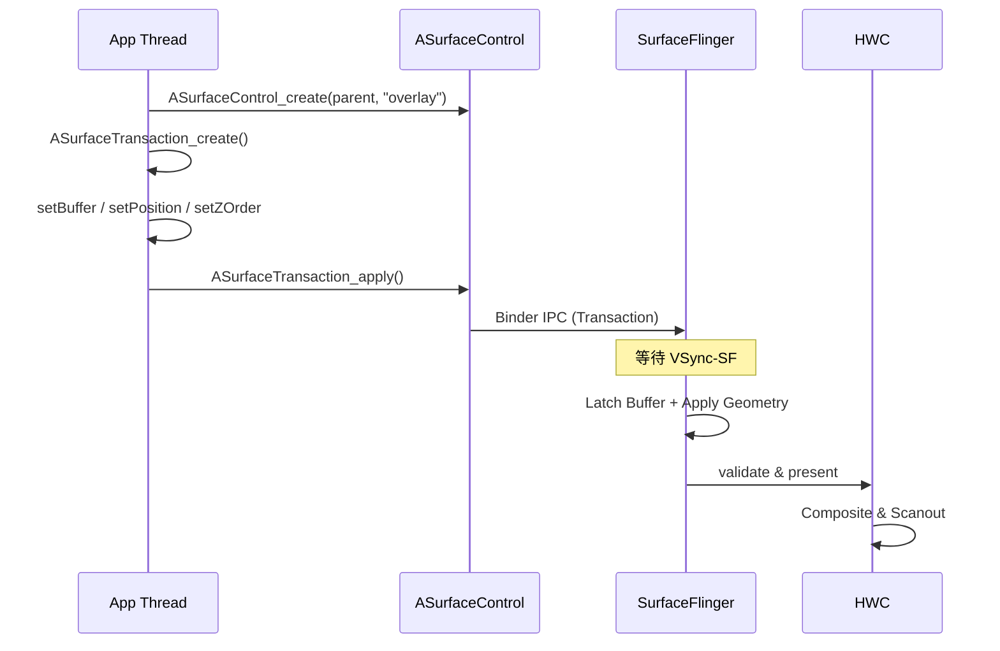
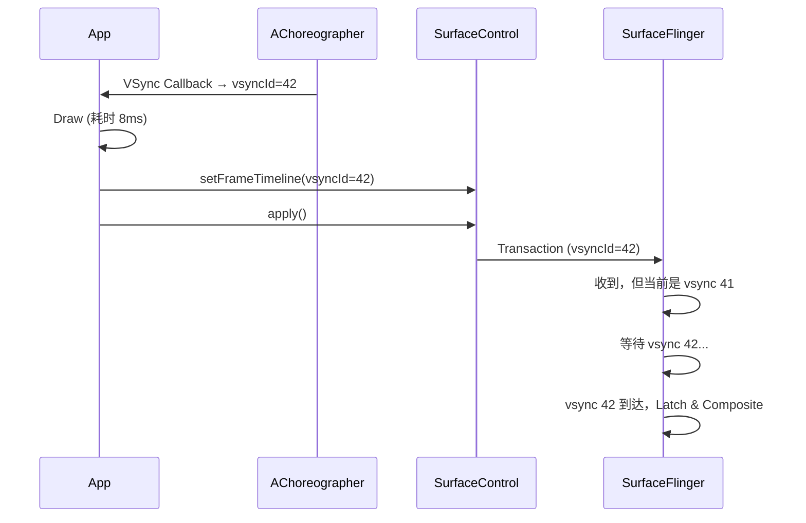

<!-- outline-start -->

**锚点（必须覆盖）：**
- [18.10.1 核心概念](#核心概念) — ASurfaceControl 与 ASurfaceTransaction 的定位
- [18.10.2 与 BLAST 的关系](#与-blast-的关系) — 共享事务模型但不等价
- [18.10.3 典型使用流程](#典型使用流程) — 创建 → 配置 → 提交的完整路径
- [18.10.4 关键 API 详解](#关键-api-详解) — Buffer、层级、Reparent
- [18.10.5 Layer 层级管理](#layer-层级管理) — 动态图层树的组织
- [18.10.6 FrameTimeline API](#frametimeline-api) — 精准控制帧着陆时间
- [18.10.7 Fence 处理与生命周期](#fence-处理与生命周期) — 最容易踩的坑
- [18.10.8 实战场景](#实战场景) — WebView OOP、画中画、自绘引擎
- [18.10.9 Trace 视角](#trace-视角) — SurfaceControl 链路的识别与瓶颈分析

**扩展（可选深入）：**
- SurfaceControl 与 WebView Out-of-process Rasterization
- Flutter Platform View 的 SurfaceControl 集成
- 跨进程 Layer 共享

<!-- outline-end -->

`ASurfaceControl`（Android 10/Q 引入，API 29）是 Android NDK 中与 SurfaceFlinger 进行**低级交互**的核心接口。与 Java 层的 SurfaceView 不同，ASurfaceControl 赋予 App 直接操控 SurfaceFlinger 中 Layer（图层）的能力——可以创建子 Layer、动态改变 Z-Order、以原子事务提交多个属性变更。这是在 App 进程内实现"浏览器级"合成控制的大门。[已验证: Android NDK ASurfaceControl 文档]

## 核心概念

### ASurfaceControl

`ASurfaceControl` 代表 SurfaceFlinger 中的一个 **Layer（图层）**。在 SurfaceFlinger 的 Layer 树中，每个 ASurfaceControl 对应一个节点。它可以是：

- **Buffer Layer**：显示实际像素内容（通过 `setBuffer` 设置）
- **Color Layer**：纯色背景（通过 `setColor` 设置）
- **Container Layer**：纯容器，用于组织层级结构，不显示内容

和 Java 层的 `SurfaceControl`（`View.SurfaceControl`）不同，NDK 的 `ASurfaceControl` 给了 App 更底层的控制权——可以直接创建、销毁、配置 Layer，而不必依赖 View 系统。这意味着你可以在没有 View 树的情况下直接操控图层。

### ASurfaceTransaction

`ASurfaceTransaction` 代表一组**原子操作**。你可以一次性修改多个 ASurfaceControl 的属性（Buffer、位置、大小、Z-Order、可见性），然后 `apply()` 提交——这些变更会作为统一快照原子性地生效。

原子性是 SurfaceControl API 最重要的特性。它意味着：

- Buffer 更新和几何变化在同一帧内生效，不会出现"Buffer 换了但位置还没变"的撕裂问题
- 多个 Layer 的属性变更要么全部可见，要么全部不可见——不会有中间状态
- 这与 BLAST 的事务模型一脉相承

## 与 BLAST 的关系

NDK 的 SurfaceControl API 与 BLAST 共享同一个"事务式更新 Surface / Layer 状态"的体系，但**不应简单画等号**：

- **BLAST**：现代 Android 图形栈里围绕 Buffer + Transaction 协同更新的一条常见路径；是底层机制
- **ASurfaceControl / ASurfaceTransaction**：App 直接操控 Layer/事务的低级接口；是应用层的 API

理解这一点很重要：当你用 ASurfaceControl 创建子 Layer 并提交 Transaction 时，底层走的正是 BLAST 的事务处理流程。但你获得了比 Java SurfaceView 更精细的控制能力——可以创建任意层级的 Layer 树、动态 Reparent、精确控制每帧的着陆时间。

### Sync 语义

可以通过 `ASurfaceTransaction_setBuffer` 将 Buffer 与几何/可见性等属性一并提交；最终何时 Latch 和显示，由 SurfaceFlinger / HWC / fence 状态共同决定。这个"最终决定权在系统"的设计很重要——你提交了 Transaction，但不代表帧会立即上屏。系统会根据 VSync 时序、合成策略、HWC 能力来决定最佳的展示时机。

## 典型使用流程

### 步骤 1：创建 SurfaceControl

你需要一个父 SurfaceControl（通常来自 `SurfaceView.getSurfaceControl()`）或者直接从 ANativeWindow 创建：

```c
// 从现有 SurfaceControl 创建子 Layer
ASurfaceControl* child = ASurfaceControl_create(parent, "MyOverlay");

// 或从 ANativeWindow 创建（需要 API 29+）
ASurfaceControl* child = ASurfaceControl_createFromWindow(window, "MyOverlay");
```

创建的 Layer 初始状态是不可见的——你需要显式设置可见性并 apply。

### 步骤 2：配置 Transaction

创建并配置一个事务，设置各种属性：

```c
ASurfaceTransaction* transaction = ASurfaceTransaction_create();

// 设置 Buffer（来自 AHardwareBuffer）
ASurfaceTransaction_setBuffer(transaction, child, hardwareBuffer, fence);

// 设置位置
ASurfaceTransaction_setPosition(transaction, child, x, y);

// 设置大小（仅设置 Layer 的显示区域，不改变 Buffer 大小）
ASurfaceTransaction_setSize(transaction, child, width, height);

// 设置层级
ASurfaceTransaction_setZOrder(transaction, child, 10);

// 设置可见性
ASurfaceTransaction_setVisibility(transaction, child, ASURFACE_TRANSACTION_VISIBILITY_SHOW);

// 设置透明度
ASurfaceTransaction_setAlpha(transaction, child, 0.8f);
```

### 步骤 3：提交 Transaction

```c
ASurfaceTransaction_apply(transaction);
```

这一步会将打包好的数据通过 Binder IPC 发送给 SurfaceFlinger。Transaction 提交是**异步的**——`apply()` 不等待 SF 处理完成就返回。

### 完整时序



## 关键 API 详解

### Buffer Management

```c
ASurfaceTransaction_setBuffer(
    transaction,
    sc,                      // ASurfaceControl*
    hardwareBuffer,          // AHardwareBuffer*
    fence_fd                 // acquire fence
);
```

这是最核心的 API。你必须自己管理 `AHardwareBuffer` 的生命周期：

- **`AHardwareBuffer`**：通过 `AHardwareBuffer_allocate()` 分配，或从 Vulkan Image、MediaCodec Output Buffer 获取
- **`fence_fd`**：一个 acquire fence。SurfaceFlinger 会等这个 fence signal 后才去读 Buffer。传 `-1` 表示 Buffer 已经可用（CPU 写入的 Buffer 无需 fence）

注意：`AHardwareBuffer` 传入后，**你不能在 SF 消费完之前释放或修改它**。通常的做法是在 release callback（通过 `ASurfaceTransaction_setOnComplete` 设置）中释放。

### Hierarchy Management

```c
// 动态改变图层树结构
ASurfaceTransaction_reparent(transaction, sc, newParent);
```

这个 API 极其强大——它允许你在运行时动态重组 Layer 树。常见用法：

1. **画中画动画**：将视频 Layer 从 Activity 的 SurfaceView 移到系统级的 PiP Window
2. **Activity 切换动画**：将 App 的 Layer 从一个 Display 移到另一个
3. **WebView OOP 合成**：将浏览器合成线程的 Layer 挂载到 App 的 Layer 树下

### Color Layer

```c
// 创建一个纯色 Layer（不需要 Buffer）
ASurfaceTransaction_setColor(transaction, sc,
    &(ASurfaceTransaction_Color){r, g, b, a});
```

Color Layer 不需要 Buffer，GPU 开销几乎为零。常用于：
- 设置背景色
- 调试时的可视化标记（不同颜色代表不同 Layer）
- 透明度遮罩效果

### Callback

```c
// 设置 Transaction 完成回调
ASurfaceTransaction_setOnComplete(transaction, context, 
    [](void* context, ASurfaceTransactionStats* stats) {
        // SF 已消费完这帧，Buffer 可以复用
        // 可以从 stats 获取 present fence 等
    });
```

这个回调在 SurfaceFlinger 完成帧处理后触发，是安全释放 `AHardwareBuffer` 的时机。

## Layer 层级管理

SurfaceControl 最强大的能力是**动态 Layer 树管理**。你可以创建任意深度的 Layer 层级，在运行时动态调整。

### 典型 Layer 结构

```
App Main Window (SurfaceControl from SurfaceView)
├── UI Background (Container Layer)
├── Video Content (Buffer Layer)
│   └── Subtitle Overlay (Buffer Layer, Z-Order above video)
├── Controls Container (Container Layer)
│   ├── Play Button (Buffer Layer)
│   └── ProgressBar (Buffer Layer)
└── Debug Overlay (Color Layer, semi-transparent)
```

### Layer 数量与性能

每个 Layer 在 SurfaceFlinger 中都有开销——合成时需要遍历、判断 Composition Type、可能的 GPU 合成。Layer 数量过多会导致：

1. **SF 合成耗时增加**：每个 Layer 都需要 `latchBuffer`、判断 Overlay 可行性
2. **HWC Layer 数量限制**：设备的 HWC 通常只支持 3-4 个 Overlay Layer，超出部分退化为 GPU 合成
3. **内存开销**：每个 Buffer Layer 需要独立的 GraphicBuffer

建议：Layer 数量控制在 5 个以内，尽量使用 Container Layer 组织层级（不消耗 Buffer）。

## FrameTimeline API（Android 11+）

从 Android R 开始，SurfaceControl API 新增了 **Frame Timeline** 系列接口，用于精准控制帧的着陆时间。这是实现"动态帧率"和"消除 Jank 误判"的关键能力。

### 核心 API

```c
// 通过 Choreographer 获取 VSync ID（Android 12+）
// App 在 AChoreographer_postVsyncCallback 回调中获取 vsyncId
// 然后传给 ASurfaceTransaction_setFrameTimeline

// 设置目标帧时间线（Android 12+）
ASurfaceTransaction_setFrameTimeline(
    transaction,
    vsyncId   // 告诉 SurfaceFlinger：这帧打算在这个 VSync 着陆
);
```

### 工作原理



### 性能优势

1. **消除掉帧误判**：SF 知道这帧是故意"迟到"的（因为帧率设定），不会错误标记为 Jank。[已验证: Android 12 FrameTimeline 文档]
2. **支持动态帧率**：配合 VRR 屏幕，App 可以精准控制 30/60/90/120fps 切换
3. **Perfetto 可视化**：在 FrameTimeline Track 中可以看到 Expected vs Actual Present Time

### 使用场景

| 场景 | 作用 | 帧率策略 |
|:---|:---|:---|
| **视频播放器** | 24fps/30fps 视频在 60Hz 屏幕上避免 3:2 pulldown 抖动 | 固定帧率，匹配视频帧率 |
| **游戏引擎** | GPU 负载高时主动降频，而非被动掉帧 | 动态帧率，根据负载调整 |
| **省电模式** | 低功耗场景主动请求 30fps 渲染 | 固定低帧率 |

## Fence 处理与生命周期

Fence 处理是 SurfaceControl API 中**最容易踩坑的地方**。处理不当会导致系统挂起、资源泄漏、或画面花屏。

### Fence Leak（栅栏泄漏）

传递给 API 的 Fence FD（文件描述符）的所有权会转移给系统：

```c
// fence_fd 传入后，FD 所有权归系统，不要再 close 它
ASurfaceTransaction_setBuffer(transaction, sc, buffer, fence_fd);
// fence_fd 现在归 SurfaceFlinger 管理
// 如果你还 close(fence_fd)，SF 等待的 FD 变成 invalid → 系统挂起
```

常见的 Fence 泄漏模式：

1. **忘记传递 fence**：从 MediaCodec 获取了 output buffer 的 fence，但没有通过 `setBuffer` 传给 SF → Producer 永远等不到 release
2. **双重 close**：传入 fence_fd 后又 close 了同一个 FD → SF 端的 fence 变成无效
3. **fence 未正确创建**：CPU 写入的 Buffer 传了一个未 signal 的 fence → SF 永远等不到

### ASurfaceControl 生命周期

`ASurfaceControl` 是内核资源。创建后必须及时 Release：

```c
// 创建
ASurfaceControl* sc = ASurfaceControl_create(parent, "layer");

// 使用...

// 释放（必须！）
ASurfaceControl_release(sc);
```

不释放的后果：SurfaceFlinger 中的 Layer 永远存在，消耗内核句柄和内存。长期运行的进程（如浏览器）如果频繁创建但不释放，会导致 Layer 数量持续增长。

### AHardwareBuffer 生命周期

```c
// 分配
AHardwareBuffer* buffer;
AHardwareBuffer_allocate(&desc, &buffer);

// 使用：设置到 Transaction
ASurfaceTransaction_setBuffer(transaction, sc, buffer, -1);

// 释放时机：在 onComplete 回调中（SF 消费完之后）
ASurfaceTransaction_setOnComplete(transaction, buffer, 
    [](void* ctx, ASurfaceTransactionStats* stats) {
        AHardwareBuffer_release((AHardwareBuffer*)ctx);
    });
```

## 实战场景

### WebView Out-of-process Rasterization

现代 Chrome/WebView 使用 SurfaceControl 实现 Out-of-process Rasterization：浏览器在独立进程合成页面，通过 SurfaceControl 直接将合成结果发给 SurfaceFlinger，不经过 App 主线程。这解耦了浏览器渲染和 App UI 的帧率绑定。

### 画中画（Picture-in-Picture）

PiP 动画的实现依赖 `ASurfaceTransaction_reparent`：

1. 进入 PiP 时：将视频 Layer 从 Activity 的 SurfaceView 移到系统级的 PiP Window
2. 在 PiP 状态：通过 Transaction 动态调整 Layer 的位置和大小
3. 退出 PiP 时：将 Layer 移回 Activity

### 自绘引擎

浏览器内核、Flutter Engine、游戏引擎等自绘系统可以使用 SurfaceControl 构建自己的 Layer 树，而不依赖 Android View 系统。这给了它们对帧提交时机的完全控制。

## Trace 视角

### 识别 SurfaceControl 链路

1. **`ASurfaceTransaction_apply`**：App 侧提交 Transaction 的标记
2. **`setTransactionState`**：SurfaceFlinger 侧收到 Transaction 的系统级 Slice
3. **多 Layer 结构**：`dumpsys SurfaceFlinger` 中看到 App 对应多个 Layer 节点
4. **`AChoreographer_postVsyncCallback`**：获取 VSync ID（FrameTimeline 使用时）

### 关键 Slice

| Slice | 含义 | 关注点 |
|:---|:---|:---|
| `ASurfaceTransaction_apply` | App 侧提交 Transaction | 频率是否合理 |
| `setTransactionState` | SF 侧收到 Transaction | 处理延迟 |
| `latchBuffer` | SF 锁定 Buffer | 等待 acquireFence |
| `AChoreographer_postVsyncCallback` | VSync ID 获取 | FrameTimeline 配合 |

### 典型瓶颈

1. **Transaction 提交过快**：App 提交速度超过 SF 处理能力 → Transaction 队列积压 → 帧延迟增加
2. **Fence 未 Signal**：`setBuffer` 传入的 fence 迟迟不 Signal → SF 在 `latchBuffer` 时等待 → 合成延迟
3. **Layer 层级过深**：嵌套的 Container Layer 增加 SF 的遍历开销 → 合成耗时增加
4. **内存泄漏**：未释放的 ASurfaceControl 或 AHardwareBuffer → 内存持续增长

### 验证 Layer 结构

```bash
# 查看 SurfaceFlinger 的 Layer 树
adb shell dumpsys SurfaceFlinger --list

# 查看特定 App 的 Layer 详情
adb shell dumpsys SurfaceFlinger | grep -A 20 "<package>"

# 关注 Layer 数量和 Composition Type
```

---

> **交叉引用**：
> - BLAST Buffer 生命周期详见 [18.2 Android View 标准链路](02-android-view-standard.md)
> - SurfaceView 的 SurfaceControl 集成详见 [18.6 SurfaceView 直出链路](06-surfaceview.md)
> - Vulkan Presentation 与 SurfaceControl 详见 [18.9 Vulkan 原生渲染链路](09-vulkan-native.md)
> - BufferQueue 与 Transaction 机制详见 [2.1 BufferQueue](../../part1-foundation/ch02-graphics-foundation/)
> - SurfaceFlinger 合成策略详见 [2.5 SurfaceFlinger](../../part1-foundation/ch02-graphics-foundation/)
