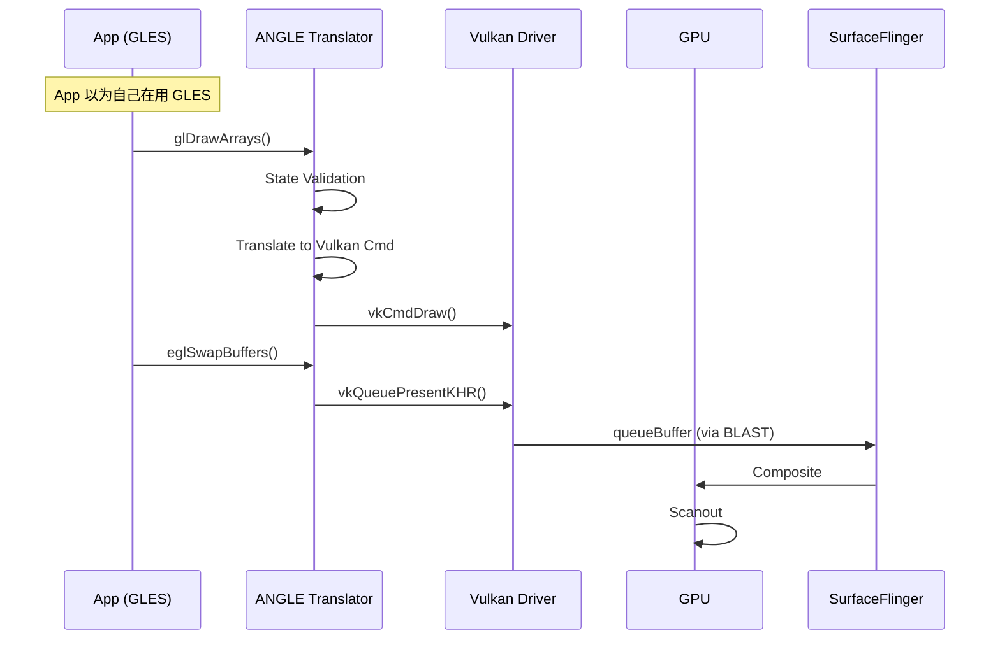

<!-- outline-start -->

**锚点（必须覆盖）：**
- ANGLE 解决的核心问题：GLES 驱动碎片化
- 翻译层架构：GLSL → SPIR-V → Vulkan
- 渲染时序：App 调用 GLES → ANGLE 翻译 → Vulkan 执行
- 性能特征：翻译开销 vs 驱动一致性收益
- 在 Perfetto 中识别 ANGLE 层的方法

**扩展（可选深入）：**
- ANGLE 启用检测与调试
- Shader 编译差异（GLSL vs SPIR-V pipeline cache）
- Android 15+ 的 ANGLE 生态趋势

<!-- outline-end -->

## 为什么需要 ANGLE

Android 图形生态有一个长期痛点：GLES（OpenGL ES）驱动的碎片化。高通、联发科、三星、ARM……每家 GPU 厂商都有自己的 GLES 驱动实现，质量参差不齐。同一个 `glDrawArrays` 调用，在不同设备上可能产生不同的渲染结果，甚至触发驱动 Bug 导致 Crash。

**ANGLE**（Almost Native Graphics Layer Engine）是 Google 开发的开源图形翻译层，核心思路是：**让所有 GLES 调用都先经过 ANGLE 翻译成 Vulkan 指令，再交给 GPU 执行**。这样 App 仍然调用 GLES API，但底层走的是统一维护的翻译层，而不是各家厂商的闭源驱动。

Android 10 起支持手动启用 ANGLE，Android 15+ 将其纳入重要生态方向。但需要注意的是：**是否默认启用取决于设备、OEM 和 provider 配置**，不是所有 Android 15+ 设备都会自动走 ANGLE。[已验证: Android 官方文档]

## 核心架构

ANGLE 的翻译流程可以概括为三个步骤：

```mermaid
graph TD
    subgraph "App Layer"
        App[App (GLES Calls)]
    end
    
    subgraph "ANGLE Layer"
        Translator[GLES → Vulkan Translator]
        Shader[SPIR-V Compiler]
        State[State Tracker]
    end
    
    subgraph "System"
        VK[Vulkan Driver]
        GPU[GPU]
    end
    
    App -->|glDrawArrays| Translator
    Translator -->|vkCmdDraw| VK
    Translator -->|Shader| Shader
    Shader -->|SPIR-V| VK
    VK -->|Execute| GPU
```

1. **GLES API 拦截**：App 调用 `glDrawArrays`、`glUseProgram` 等 GLES 函数，被 ANGLE 的翻译层拦截。
2. **状态跟踪**：ANGLE 维护一个 GLES 状态机的镜像，将隐式的 GLES 状态转换为 Vulkan 所需的显式状态。
3. **Shader 翻译**：GLSL Shader 源码被编译为 SPIR-V（Vulkan 的标准 Shader 中间表示），再由 Vulkan 驱动编译为 GPU Binary。
4. **Vulkan 指令生成**：GLES 绘制调用被翻译为 Vulkan Command Buffer 操作，提交给 GPU 队列。

## 渲染时序

从 App 的视角，它仍然在调用 GLES API，感觉不到 ANGLE 的存在。但在底层，每一步都有翻译开销：



关键差异点：

| 操作 | 原生 GLES | ANGLE 翻译后 |
|:---|:---|:---|
| `glDrawArrays` | 直接调用 GLES 驱动 | 翻译为 `vkCmdDraw` |
| `glShaderSource` | GLSL → GPU Binary | GLSL → SPIR-V → GPU Binary |
| `eglSwapBuffers` | GLES 驱动处理 | 翻译为 `vkQueuePresentKHR` |

## 性能特征

ANGLE 不是免费的午餐——翻译层本身有开销，但它带来的好处也很大。

### 优势

| 方面 | 传统 GLES Driver | ANGLE → Vulkan |
|:---|:---|:---|
| **Draw Call 开销** | 较高（GLES 状态机） | 较低（Vulkan 显式状态） |
| **多线程** | 有限支持 | 完全支持 |
| **Shader 编译** | 运行时 GLSL → Binary | GLSL → SPIR-V → Pipeline Cache |
| **驱动一致性** | 每家不同 | Google 统一维护 |
| **调试** | 厂商闭源 | ANGLE 开源可 Debug |

### 开销

- **翻译层开销**：状态转换和命令翻译有 CPU 成本，具体开销取决于 workload
- **首次 Shader 编译稍慢**：GLSL → SPIR-V → GPU Binary 的编译链比直接编译 GLSL 多一步
- **内存略高**：需要维护翻译状态

总体而言，对于 Draw Call 密集的场景（如地图、游戏），ANGLE 的收益通常大于开销；对于 Draw Call 很少的简单场景，翻译开销可能更明显。[已验证: Google ANGLE 官方文档]

## 在 Perfetto 中识别 ANGLE

识别 ANGLE 的关键线索：

1. **Vulkan 指令替代 GLES 指令**：如果 App 代码只调用了 GLES API，但 Trace 中看到 `vkQueueSubmit`、`vkCmdDraw` 而不是 `glDraw*`，说明走了 ANGLE。
2. **ANGLE 相关 Track/Slice**：部分 Trace 配置下可能出现 ANGLE 翻译线程或编译 slice。
3. **Renderer 字符串**：运行时 `glGetString(GL_RENDERER)` 如果返回包含 "ANGLE" 的字符串（如 `"ANGLE (Google, Vulkan 1.3.x, ...)"`），确认 ANGLE 已启用。

```bash
# adb 快速检查
adb shell settings get global angle_gl_driver_all_apps

# 强制所有 App 使用 ANGLE（调试用）
adb shell settings put global angle_gl_driver_all_apps angle
```

```sql
-- Perfetto SQL: 查找 ANGLE 相关耗时
SELECT name, dur FROM slice 
WHERE name LIKE '%ANGLE%' OR name LIKE '%vk%'
ORDER BY dur DESC LIMIT 20;
```

## 开发者建议

1. **测试覆盖**：确保 App 在 ANGLE 和原生 GLES 下都测试过，特别是依赖厂商扩展（`GL_QCOM_*` 等）的代码
2. **Shader 规范**：ANGLE 对 GLSL 语法要求更严格，不合规的 GLSL 会直接报错
3. **新项目优先 Vulkan**：如果不需要兼容旧设备，直接用 Vulkan 比 ANGLE 更高效

## 与其他章节的关系

- **2.14 图形 API 演进与选择策略**：ANGLE 在 Android 图形生态中的定位
- **18.8 OpenGL ES 渲染链路**：原生 GLES 链路，与 ANGLE 形成对比
- **18.9 Vulkan 原生渲染链路**：ANGLE 底层走的就是 Vulkan

## 参考资料

- Google ANGLE 项目：https://chromium.googlesource.com/angle/angle/
- Android 官方文档：ANGLE on Android
- AOSP `external/angle/`
